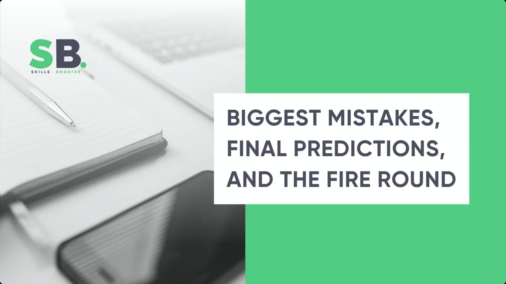
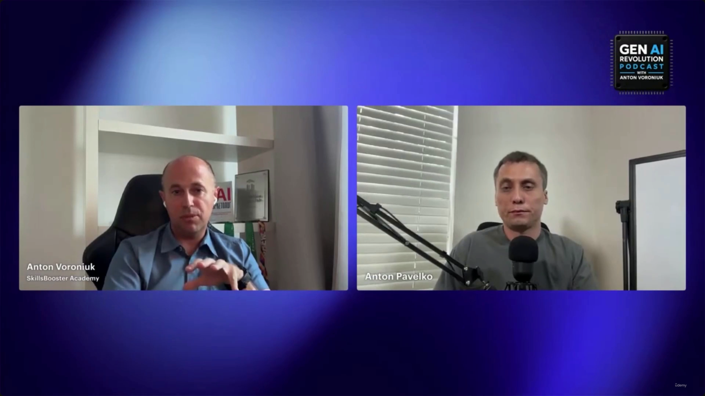
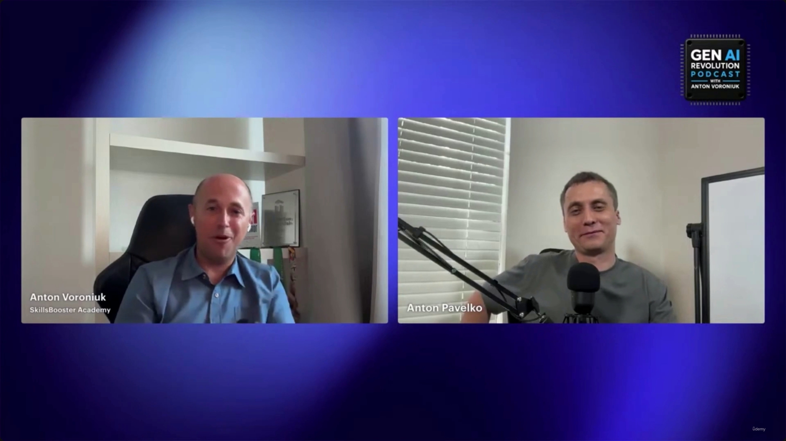

# Biggest Mistakes, Final Predictions, and the Fire Round

> This is the closing lecture of the *Claude Certified Architect Foundations* course — the tail end of a bonus interview segment (the **Gen AI Revolution Podcast**, hosted by **Anton Voroniuk** of **SkillsBooster Academy**, interviewing **Anton Pavelko**, a Claude Certified Architect). It wraps up with the exam mistakes people make, some predictions about the field, and a rapid-fire Q&A before the two hosts sign off.

**[Slide detail]** Neither the transcript text nor the slide-note bullets name the two speakers or the podcast anywhere — that information is visible only in the on-screen video-call lower-thirds and the "GEN AI REVOLUTION PODCAST WITH ANTON VORONIUK" bug in the corner of the talking-head frames.

---

## Common Exam Mistakes

- Attempting to pass without practical experience
- Relying solely on memorizing technical details
- Trying to guess answers
- **[Recommendation]** Build hands-on competence instead:
  - Implement actual projects
  - Build something from scratch
  - Use code to create simple, authentic systems

> **Transcript color:** "When they try to pass this without practical experience and they're just trying to memorize some technical details and they try to guess, it's really very difficult... try to implement something, try to build something, try to use [Claude] Code, try to create some simple, authentic system and after that everything will be fine. But without practical experience, I do not recommend to try to pass the exam."

---

## Final Predictions

### Certification vs. Real-World Experience

- **[The Core Distinction]** Companies prioritize what an architect has actually *built and delivered* over the badges they hold.
- Certifications can still serve as a useful baseline.
- Practical, real-world experience is the most important factor for relevance — even years into the future.

> **Transcript color:** "I think real world experience will matter much more than any kind of certification or badge, but certification still can be a useful baseline, and companies will care more about what you have actually built and delivered... This is the most important thing that will be relevant even in five years."

### Roadmap for Aspiring AI Architects

- **[Starting Point]** Use exam guides to define your learning path:
  - Read all four Anthropic exam guides — Associate, Developer, Architect Foundations, and Architect Professional.
  - **[Why?]** This shows exactly what knowledge Anthropic expects from each role and gives you a clear roadmap.
- **[Building Knowledge]** Once the roadmap is established, use courses to fill the gaps — Anthropic's own courses or other relevant educational resources — to pick up the basic knowledge you're missing.

> **Transcript color:** "If someone watching this wants to become an AI architect but feels completely overwhelmed by how fast everything is changing, what is the one thing you would tell them to do this week?... First of all, just read exam guides provided by Anthropic, all four... just to understand what kind of knowledge Anthropic expects... And after that, you will have a roadmap."

### Path to Specialization

- **[The Progression]** Build → Launch → Certify:
  1. Start by **building** something to learn the basics.
  2. Move to **launching** and operating in production.
  3. Once practical experience is established, use the exam to **certify** — solidifying your status as a specialist.

> **Transcript color:** "Build something, and once you build something you know the basics — launch, so you can move on, you can do something in prod... and now you're like a specialist, and it was really practical."

---

## The Fire Round

The host frames this explicitly as a rapid-fire format: short questions, short answers. Presented here as a clean Q&A list rather than prose.

- **Certification or real experience — who wins?**
  Real experience.

- **What's the biggest architecture mistake companies will make in 2026?**
  Over-reliance on multi-agents — "multi-agents everywhere." **[Warning]** Agents are currently considered somewhat overhyped.

- **What skill is massively hard to sustain in AI right now?**
  Prompt engineering as a standalone profession.

- **What AI skill is seriously underrated?**
  Evaluation — often overlooked, but a critical component of AI development.

---

## Sign-off

The episode closes on an unscripted, personal note rather than more slide content: the host recalls a technical issue earlier in the recording that briefly made him think he'd lost the connection to his guest, calls the conversation "super insightful," and says it motivated him to go back and pursue the Claude Associate certification himself — inspired by the guest's LinkedIn post — with an eye toward eventually completing the "full collection" of Claude certifications.

> **Transcript color:** "It's a great pleasure to have you back, because when there was some technical issue, I started thinking that I've lost you. And honestly, it was super insightful. I've got a lot of things that definitely pushed me to go back to the basic Claude Associate certification, and I will pass it, because I was motivated by your LinkedIn post yesterday."

---

## Summary

- **Biggest exam mistake:** trying to pass on memorization and guessing instead of hands-on building.
- **Biggest career signal:** real-world, delivered work outweighs any certification — though a certification is still a useful baseline.
- **Roadmap for newcomers:** read Anthropic's four exam guides → fill knowledge gaps with courses → build → launch to production → certify.
- **2026 prediction:** over-reliance on multi-agent systems will be the era's defining architectural mistake; agents are somewhat overhyped today.
- **Skills outlook:** prompt engineering alone is a shaky standalone career bet; evaluation is the underrated skill worth investing in.
- This closes out the *Claude Certified Architect Foundations* course's bonus interview arc — a fitting, practitioner-voiced capstone to the material covered in lectures 1–32.

---

## In Plain English

Here's the whole file in plain, everyday language:

**The big picture:** the closing lecture of the entire course — the tail end of the bonus interview, covering common exam mistakes, some predictions for where the field is headed, and a rapid-fire Q&A before signing off.

**1. The most common exam mistakes**
Trying to pass with zero practical experience, relying purely on memorizing facts, and just guessing at answers. The actual fix: go build real, working things first (even something simple and self-made) — that's what makes the scenario questions actually answerable.

**2. The final prediction on certifications vs. experience**
Real-world, actually-delivered work will matter more than any badge — but a certification is still a genuinely useful baseline, and companies increasingly care about what you've actually built and shipped, not just what you're certified in.

**3. The recommended starting point for anyone feeling overwhelmed**
Read all four of Anthropic's official exam guides (Associate, Developer, Architect Foundations, Architect Professional) first — that alone tells you exactly what's expected at each level and gives you an instant roadmap, before you even touch a course.

**4. The recommended progression**
Build something small first → Launch it and actually run it in production → THEN pursue certification to formalize what you've already proven you can do.

**5. The rapid-fire round, straight answers**
Real experience beats certification, every time. The biggest architecture mistake companies will likely make in 2026: over-relying on multi-agent systems everywhere ("multi-agents for everything"). The hardest skill to sustain as a standalone career right now: prompt engineering. The most underrated skill: evaluation.

**One-sentence summary:** The course closes by reinforcing its central theme one last time — skip memorization and guessing, build real things, use Anthropic's own exam guides as your roadmap, follow build → launch → certify, and remember that real, delivered experience will always outweigh a certification — while flagging over-reliance on multi-agent systems as 2026's likely biggest architecture mistake and evaluation as the most underrated skill to invest in.

---

*Sources: [slide notes](../44-Biggest-Mitakes-Final-Predictions-And-The-Fire-Round.md) · [[hover-notes-transcripts/44-Biggest-Mitakes-Final-Predictions-And-The-Fire-Round (transcript)|full transcript]]*
