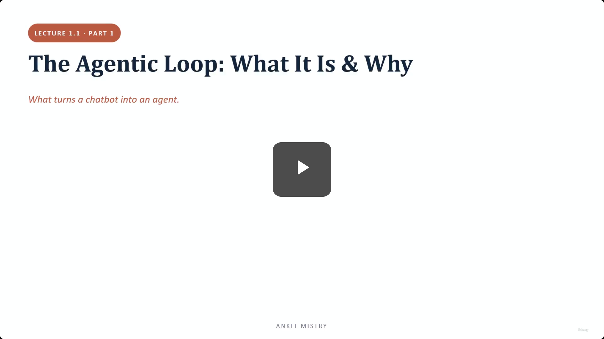
[00:00:01](https://www.udemy.com/course/claude-ai-certification/learn/lecture/57908961#overview)

## The Agentic Loop: What It Is & Why

- **Core Question**: What turns a chatbot into an agent?
- **Lecture Overview**:
    - One call vs. a loop
    - The four steps
    - The `stop_reason` — the signal that keeps you in the loop

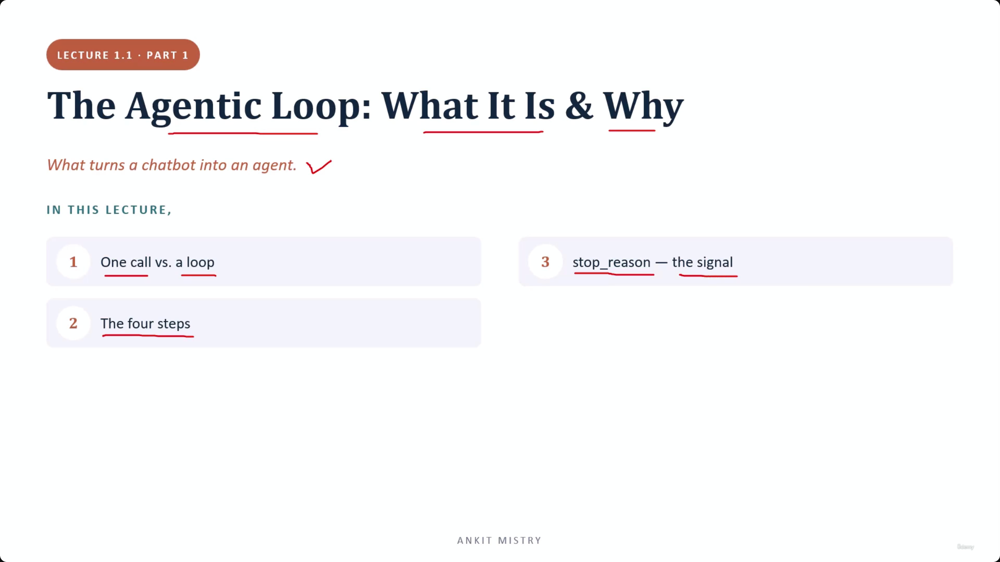
[00:00:43](https://www.udemy.com/course/claude-ai-certification/learn/lecture/57908961#overview)

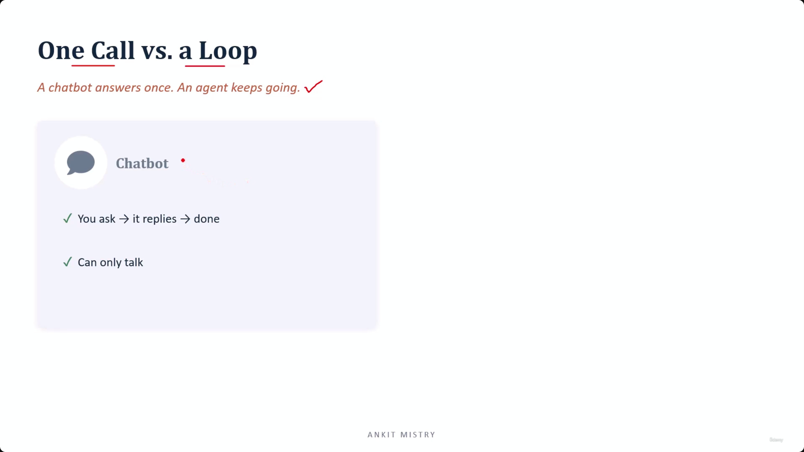
[00:01:01](https://www.udemy.com/course/claude-ai-certification/learn/lecture/57908961#overview)

## One Call vs. a Loop

- **The distinction**: A chatbot answers once, while an agent keeps going
- **Chatbot behavior**:
    - Follows a linear flow: You ask $\rightarrow$ it replies $\rightarrow$ done
    - Limited to conversation only
    - **[Analogy]**: Like phoning a friend who knows every company handbook by heart but has no computer or way to actually check or perform tasks

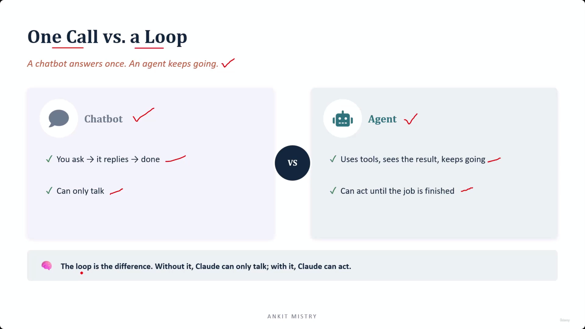
[00:02:12](https://www.udemy.com/course/claude-ai-certification/learn/lecture/57908961#overview)

### Agent Capabilities

- **The Agent**: Unlike a chatbot, an agent can act until a job is finished
    - Uses tools to interact with the world
    - Sees the results of its actions
    - Keeps going based on those results
- **Tools**: An action that allows an LLM (like Claude) to interact with the real world
    - **[Analogy]**: If a chatbot is a friend who knows the handbook but has no computer, a tool is the laptop that allows them to look up real orders, check delivery status, and verify refunds

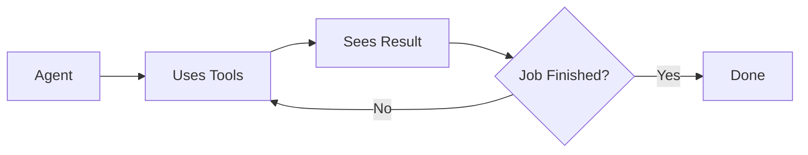

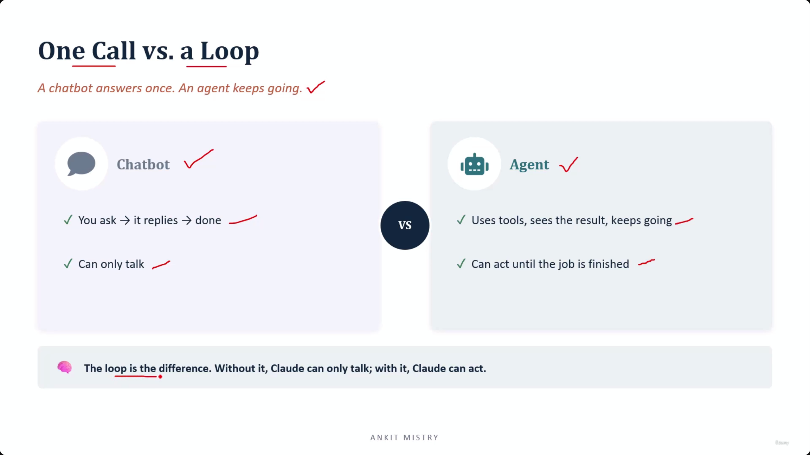
[00:02:15](https://www.udemy.com/course/claude-ai-certification/learn/lecture/57908961#overview)

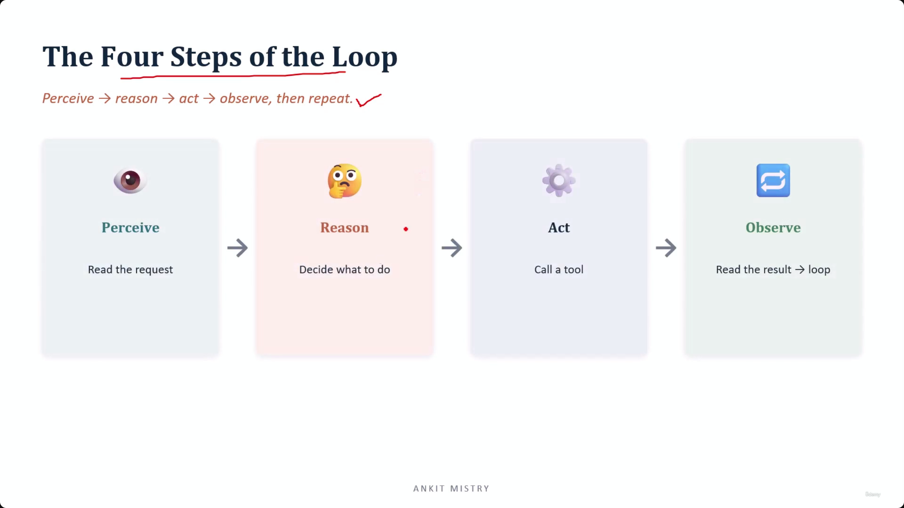
[00:02:52](https://www.udemy.com/course/claude-ai-certification/learn/lecture/57908961#overview)

### The Impact of the Loop

- **The defining difference**: The loop is what enables the transition from conversation to action
    - Without the loop, Claude can only talk
    - With the loop, Claude can act
- **[Crucial Insight]**: The intelligence of the model does not change between being a chatbot or an agent; what changes is the ability to reach out and interact with the real world before providing an answer

### The Four Steps of the Loop

- The agentic process follows a continuous cycle of four stages:
    - **Perceive**: Read the request
    - **Reason**: Decide what to do
    - **Act**: Call a tool
    - **Observe**: Read the result $\rightarrow$ loop back

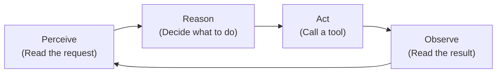

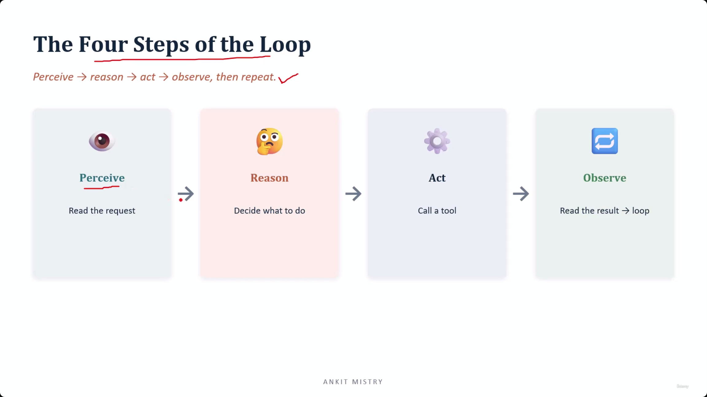
[00:02:59](https://www.udemy.com/course/claude-ai-certification/learn/lecture/57908961#overview)

### The Four Steps in Action

- **Example Scenario**: A customer asks, "Where is my refund?"
- **The Loop Process**:
    - **Perceive**: The agent reads the customer's question
    - **Reason**: The agent determines it cannot answer without more information, so it decides to look up the order
    - **Act**: The agent calls the `order_lookup` tool
    - **Observe**: The agent reads the result (e.g., "delivered three weeks ago, and no refund issued")

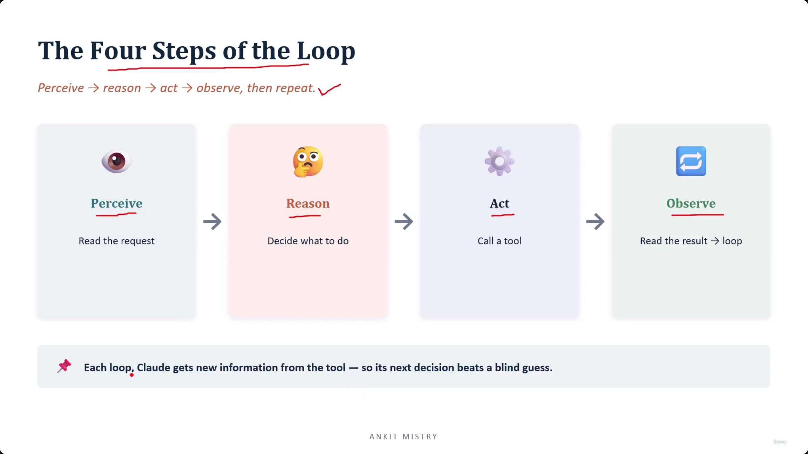
[00:03:54](https://www.udemy.com/course/claude-ai-certification/learn/lecture/57908961#overview)

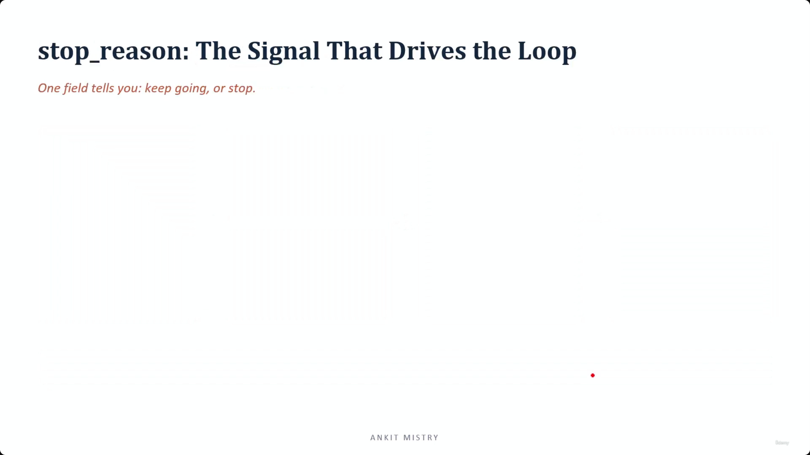
[00:04:23](https://www.udemy.com/course/claude-ai-certification/learn/lecture/57908961#overview)

### The Value of Iteration

- **Information Gain**: Each loop provides the LLM with new information from the tool
    - This ensures the next decision is informed by reality rather than being a "blind guess"
- **Dynamic Reasoning**: The agent's next question is driven by the results of the previous action
    - In the refund example, the agent doesn't just stop after seeing the order status; it uses that information to ask a new, unscripted question: "Is this customer even entitled to a refund?"

### stop\_reason: The Signal That Drives the Loop

- **The Control Mechanism**: A single field that determines the agent's next move
- **Decision Logic**: It tells the system whether to:
        - Keep going (continue the loop)
        - Stop (finish the task)

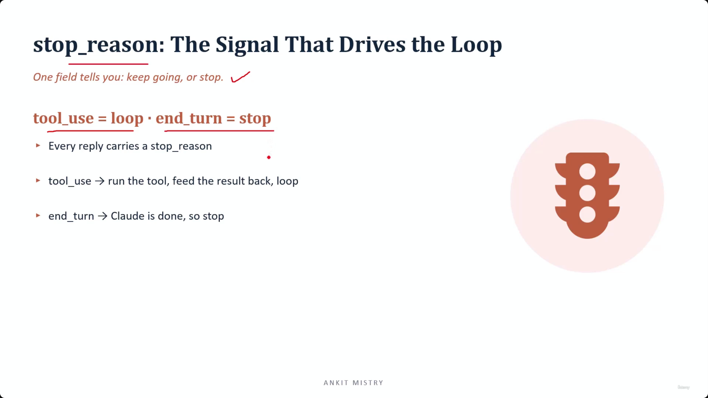
[00:04:54](https://www.udemy.com/course/claude-ai-certification/learn/lecture/57908961#overview)

### Decoding the stop\_reason Signals

- **The Control Mechanism**: A single field in every reply that dictates the next move
    - It tells the system whether to keep going or to stop
- **The Two Primary Signals**:
    - `tool_use` = loop
        - This signal means the LLM wants to run a tool
        - The system must run the tool, feed the result back to the model, and continue the loop
    - `end_turn` = stop
        - This signal means the LLM is finished with the task
        - The loop terminates here

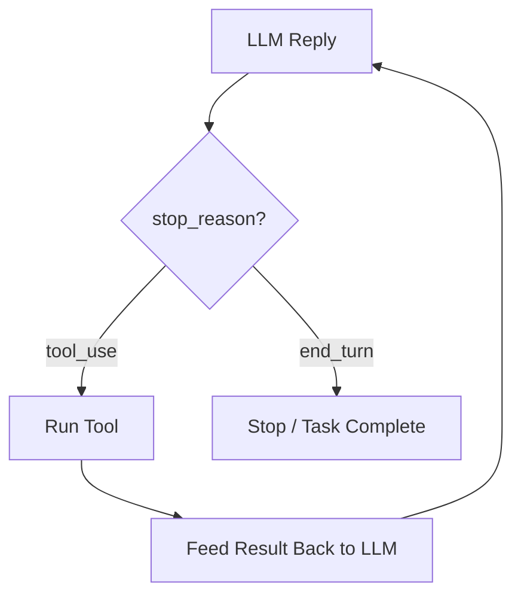

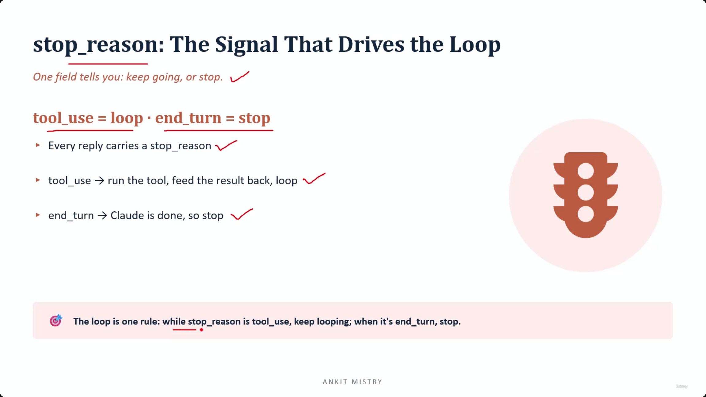
[00:05:34](https://www.udemy.com/course/claude-ai-certification/learn/lecture/57908961#overview)

### The Decision-Making Authority

- **Who controls the loop?**: Claude decides, not your code
    - The `stop_reason` is a label attached to every reply
    - It functions as the single rule for the loop:
        - While `stop_reason` is `tool_use` $\rightarrow$ keep looping
        - When `stop_reason` is `end_turn` $\rightarrow$ stop
- **[Risk] The Danger of Arbitrary Caps**:
        - Capping an agent at a fixed number of tool calls (e.g., 3) can break functionality
        - **Example**: A refund agent might need a sequence of steps that exceeds the cap:

                1. Look up the order
                2. Check the refund policy
                3. Verify the refund code

        - If the cap is too low, the agent is forced to stop before the job is actually finished

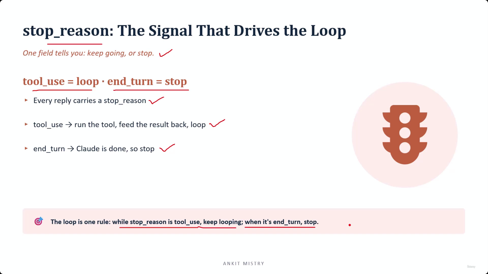
[00:05:59](https://www.udemy.com/course/claude-ai-certification/learn/lecture/57908961#overview)

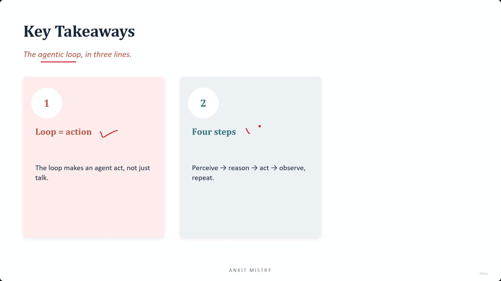
[00:06:32](https://www.udemy.com/course/claude-ai-certification/learn/lecture/57908961#overview)

## Key Takeaways

### The Agentic Loop in Three Lines

- **1. Loop = Action**
    - The loop is what enables an agent to act rather than just talk
    - **[Analogy]**: It is the difference between a friend who knows everything and a friend with a laptop who can actually go and check information
- **2. The Four-Step Cycle**
    - Every agent operates through this repeating sequence:

        1. **Perceive**
        2. **Reason**
        3. **Act**
        4. **Observe**

    - This cycle repeats until the task is complete

[00:06:51](https://www.udemy.com/course/claude-ai-certification/learn/lecture/57908961#overview)

### The Agentic Loop in Three Lines (Continued)

- **3. The&#32;`stop_reason`&#32;drives it**
    - `tool_use` = loop
    - `end_turn` = stop
    - **[Crucial Rule]**: The model tells you when the work is finished
        - Do not try to override the model's decision with an arbitrary counter (e.g., a maximum number of tool calls)
        - Your job is to listen to the signal provided by the model

---

### Chatbot vs. Agent: The Core Distinction

- **Chatbot**: Produces words
- **Agent**: Produces words $\rightarrow$ looks at what happened $\rightarrow$ decides what to do next
- **The Essence**: The entire domain of agentic architecture is built upon this single difference: the ability to "go round again" based on observed results.

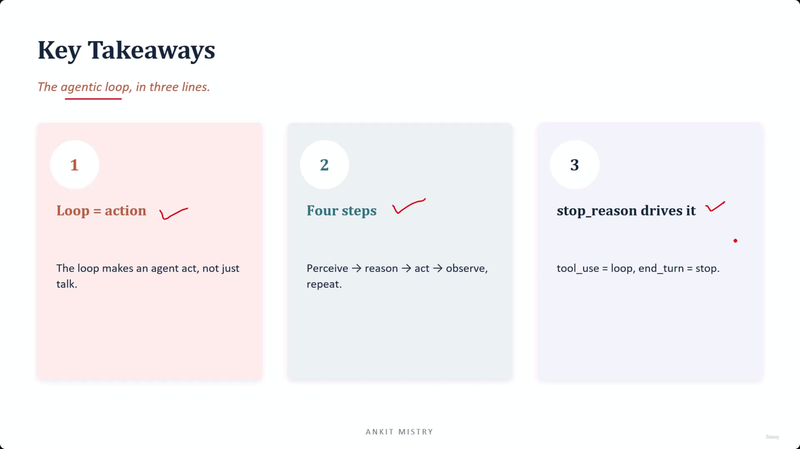
[00:07:30](https://www.udemy.com/course/claude-ai-certification/learn/lecture/57908961#overview)

---

## Simple Explanation (with Claude Examples)

**The core idea, in one line**: A chatbot only talks; an agent talks, *acts*, looks at what happened, and keeps going until the job is actually done.

**Everyday analogy**

A chatbot is like a friend who has the entire company handbook memorized but no computer — they can tell you policy from memory, but can't actually check your specific order. An agent is that same friend, now handed a laptop: they can look up your real order, check its real delivery status, and verify a real refund, then act on what they find.

**The four-step cycle, with a Claude example**

Every agent repeats: **Perceive → Reason → Act → Observe.**

*Claude Code example*: Earlier in this very conversation, when you asked me to explain a note file:
- **Perceive** — I read your request ("explain domain-4/05-Batch-Processing.md")
- **Reason** — I decided I needed to find and read the actual file before I could explain it
- **Act** — I called the `Read` tool on that file
- **Observe** — I looked at the file's contents, and *that* shaped the explanation I wrote back to you

If the file hadn't existed at the path I guessed, Observe would have shown me an error, and I'd have looped back to Reason (search for the right file) before trying Act again.

**`stop_reason` — the signal that runs the whole show**

Every reply carries a label: `tool_use` means "I want to run a tool, keep looping," and `end_turn` means "I'm done, stop." Crucially, **Claude decides this — not your code**. Capping an agent at a fixed number of tool calls (like "max 3 tool calls") can break it, since some tasks genuinely need more steps than that arbitrary number allows.

*Claude Code example*: In this session, when I need to look something up, then read a file, then edit it, then verify the edit — that's four tool calls in a row for one request. If something artificially capped me at 3 calls, I'd be forced to stop before finishing your actual task.

**Recap in 3 lines**

1. **Loop = action** — the loop is what lets Claude go check something real, not just talk.
2. **Four steps repeat**: Perceive, Reason, Act, Observe — until the job is finished.
3. **`stop_reason` drives it, not a fixed counter** — `tool_use` keeps going, `end_turn` stops; trust the model's own signal.

---

## Exam Objective Note: CCAR-F 1.1 — Agentic Loops

**How does the loop actually end?**

Claude stops by itself the moment it gives a reply with no tool call in it. That's the real "done" signal — Claude doesn't need a turn limit to know the job is finished.

**So what is `max_turns` for, then?**

Think of `max_turns` as a safety net, not the real stop button. It's there in case something goes wrong and the loop runs too long. It also only counts turns where a tool was actually used — not every message sent back and forth.

**A gotcha to remember: `ResultMessage`**

When a run ends, you get a `ResultMessage`. Its `subtype` field tells you *how* it ended — for example, `"success"` or `"max_turns"`. The `result` field is only filled in when `subtype` is `"success"`.

*Why this matters*: if your code always reads `.result` without checking `subtype` first, it will crash in exactly the cases it was supposed to handle — like hitting the `max_turns` cap.

**Claude Code example**: Say a task genuinely needs 4 tool calls (look up order → check policy → verify code → confirm), but `max_turns` is set to 3. The run stops early with `subtype: "max_turns"` and no `result` field. Code that blindly reads `.result` here crashes; code that checks `subtype` first handles it cleanly.

**Recap in 3 lines**

1. Claude stops on its own once it replies with no tool call — `max_turns` is just a backup safety cap, not the real mechanism.
2. `max_turns` only counts turns that used a tool, not every message.
3. Always check `ResultMessage.subtype` before reading `.result` — `.result` only exists when `subtype` is `"success"`.