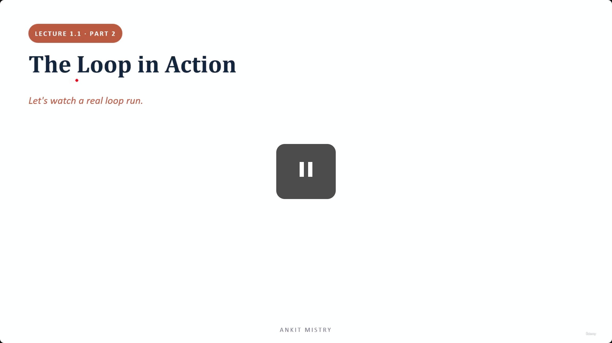
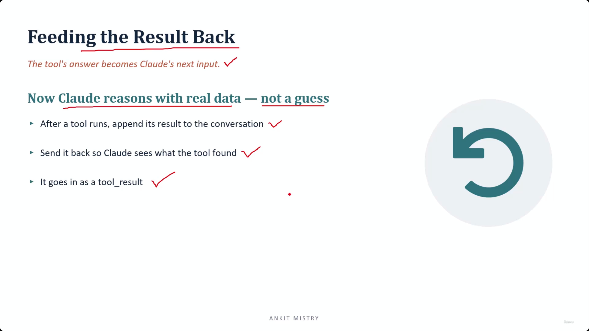
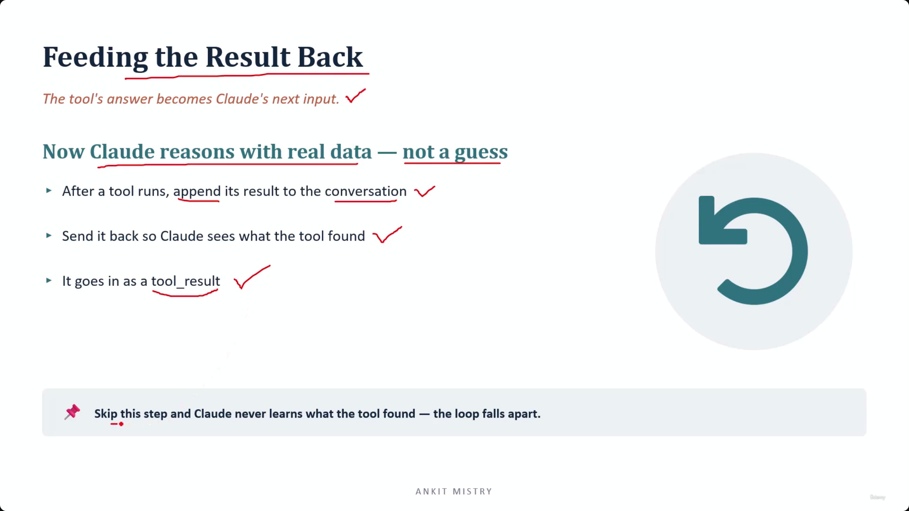
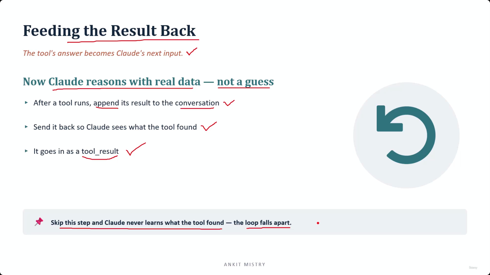
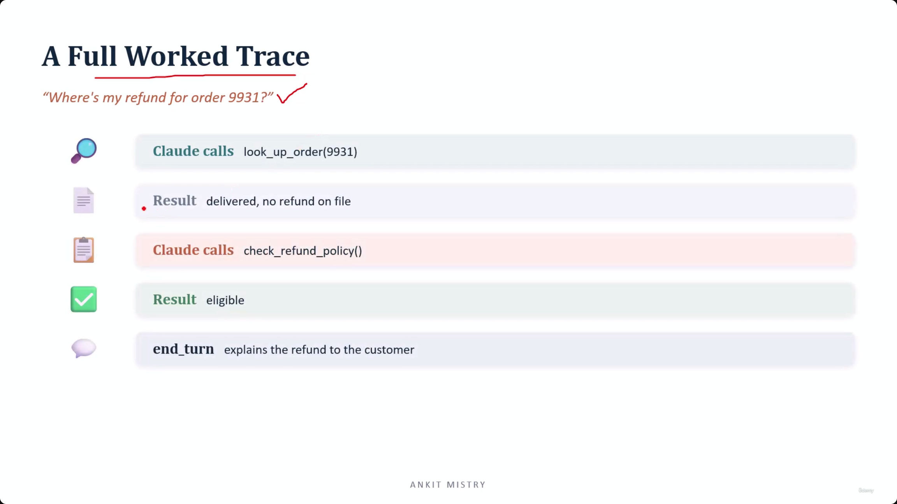
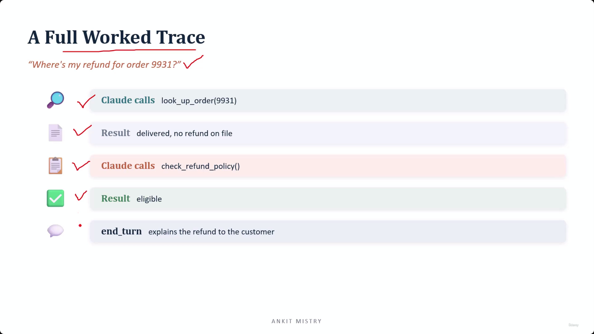
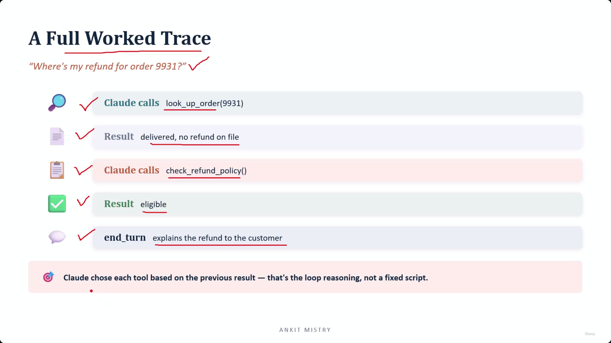
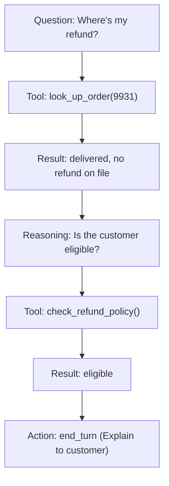
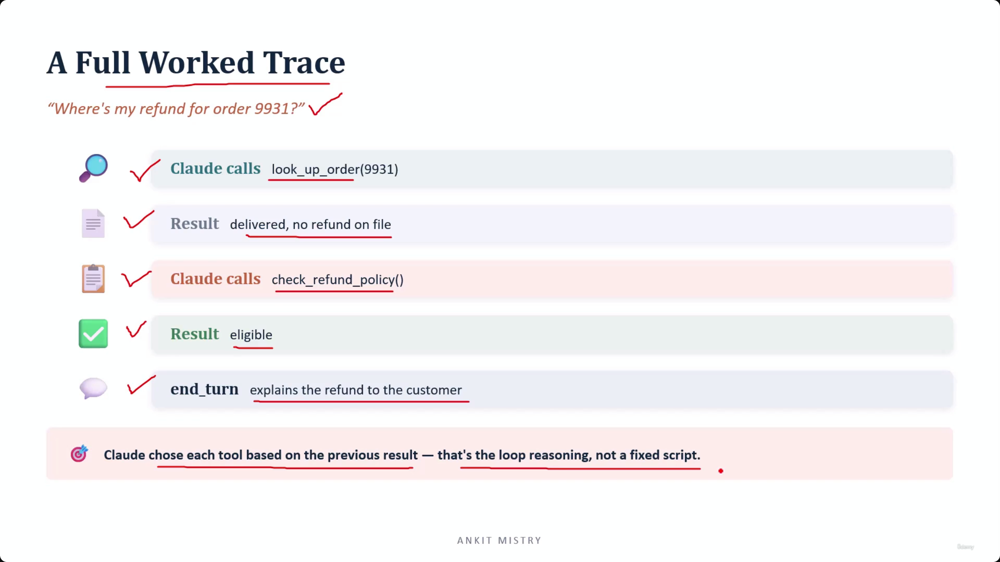
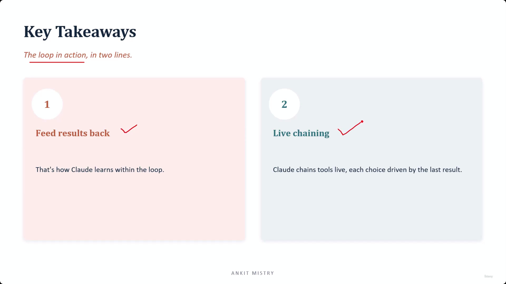

[00:00:14](https://www.udemy.com/course/claude-ai-certification/learn/lecture/57908963#overview)

## The Loop in Action

- Moving from theoretical discussion to observing a real-world loop execution

### Lecture Overview

- **Objective**: To observe a real-world execution of the agentic loop
- **Key Topics**:
    - Feeding results back into the system
    - Performing a full worked trace

### Feeding the Result Back

- The tool's answer becomes Claude's next input
- **[Why?]** This ensures Claude reasons with real data instead of making guesses
- Process for integrating tool outputs:
    - After a tool runs, append its result to the conversation
    - Send it back so Claude sees exactly what the tool found
    - The information is integrated as a `tool_result`


[00:01:12](https://www.udemy.com/course/claude-ai-certification/learn/lecture/57908963#overview)

### Mechanics of Feeding Results Back

- **Terminology breakdown**:
    - **Conversation**: The running list of messages that are sent to Claude during every single turn
    - **Appending**: Adding one more entry to the end of that conversation list
    - **tool\_result**: The specific new entry/message that communicates: "You asked for this tool to run and here is what came back"
- **[Why this step exists]** Because the tool does not run inside Claude
    - The tool execution happens on your local computer or on your server, separate from the LLM


[00:02:19](https://www.udemy.com/course/claude-ai-certification/learn/lecture/57908963#overview)

### The Criticality of Passing Results Back

- **[The Problem]** Claude has no inherent way of seeing tool outputs
    - Tools run on your local computer, your server, or somewhere on the internet
    - Claude cannot "look" at these external environments on its own
- **Analogy**: It is like a colleague asking you to check a file
    - If you check the file but say nothing, they remain in a state of knowing nothing
- **[Warning]** Skipping this step causes the loop to fall apart
    - This is the most common beginner mistake
    - If you run the tool but never pass the answer back, Claude is left sitting with only the original question and no new information


[00:02:42](https://www.udemy.com/course/claude-ai-certification/learn/lecture/57908963#overview)


[00:03:03](https://www.udemy.com/course/claude-ai-certification/learn/lecture/57908963#overview)

### Consequences of Failing to Feed Results Back

- **[The Infinite Loop]** If Claude doesn't receive new information, it perceives no change in the state of the conversation
    - It will likely ask for the exact same tool to run again
    - This creates a cycle of asking and receiving nothing new, achieving zero progress

### A Full Worked Trace

- **Scenario**: A customer asks, "Where's my refund for order 9931?"
- **Execution Flow**:
    - **Step 1**: Claude calls `look_up_order(9931)`
    - **Step 2**: Result returned: `delivered, no refund on file`
    - **Step 3**: Claude calls `check_refund_policy()`
    - **Step 4**: Result returned: `eligible`
    - **Step 5**: end_turn: `explains the refund to the customer`


[00:03:28](https://www.udemy.com/course/claude-ai-certification/learn/lecture/57908963#overview)

### Deep Dive into the Execution Trace

- **[The Reasoning Behind the Actions]** The focus is not just on what the agent did, but *why* it made those specific decisions based on the data it retrieved.
- **Step 1: Data Retrieval vs. Guessing**
    - Claude calls `look_up_order(9931)`
    - **[Why this matters]** Instead of guessing or providing general information (e.g., "refunds usually take 5 days"), the agent fetches the actual, specific record for that customer.
    - **Result**: Two key facts are returned:
        - The order was delivered.
        - No refund currently exists on file.
- **Step 2: Informed Decision Making**
    - Claude calls `check_refund_policy()`
    - **[Why it picked this tool]** The agent uses the specific facts from the first step (the order is delivered but no refund is present) to determine that the next logical step is to see if the customer is actually eligible for a refund.


[00:04:38](https://www.udemy.com/course/claude-ai-certification/learn/lecture/57908963#overview)

### The Core Insight: Loop Reasoning vs. Fixed Scripts

- **[The Key Takeaway]** Claude chose each tool based on the previous result — this is "loop reasoning," not a fixed script.
    - In a fixed script, you would have pre-programmed: "First look up the order, then check the policy."
    - In loop reasoning, the agent only decides to check the policy *because* the first tool returned the fact that no refund was issued.
- **The Logic Chain in the Trace**
    - **Observation**: The first tool revealed no refund was ever issued.
    - **Inference**: The next logical question is whether the customer is even entitled to one.
    - **Action**: Claude calls `check_refund_policy()` to answer that specific question.




[00:04:58](https://www.udemy.com/course/claude-ai-certification/learn/lecture/57908963#overview)


[00:05:36](https://www.udemy.com/course/claude-ai-certification/learn/lecture/57908963#overview)

### Key Takeaways: The Loop in Action

- **1. Feed results back**
    - This is how Claude learns within the loop
    - **[The Consequence]** If the result never travels back to the LLM, it learns nothing and the loop stalls in place
- **2. Live chaining**
    - Claude chains tools live
    - Each choice is driven dynamically by the last result received


[00:05:44](https://www.udemy.com/course/claude-ai-certification/learn/lecture/57908963#overview)

### The Power of Dynamic Sequencing

- **[The Core Difference]** You aren't writing a fixed sequence of instructions in advance
    - Instead, you provide the LLM with a set of available tools
    - The model builds the execution sequence on the fly as it progresses
- **[Why this matters]** This allows the agent to handle edge cases and situations that you never specifically planned for

---

## Model-Driven vs. Hard-Coded

- **Upcoming Topics**
    - Deciding who should control the steps (Model-driven vs. Hard-coded)
    - Identifying the three common anti-patterns that break an agentic loop

---

## Simple Explanation (with Claude Examples)

**The core idea, in one line**: Running a tool is only half the job — if you never tell Claude what the tool found, Claude learns nothing and the loop grinds to a halt.

**Everyday analogy**

Imagine asking a colleague to check a file for you. If they check it but never tell you what they found, you're stuck exactly where you started — you asked, but you still know nothing. That's what happens if a tool's result never gets sent back to Claude: the loop looks like it ran, but Claude never actually saw the answer.

**Why this step exists at all**

Tools don't run *inside* Claude — they run on your computer or server, completely separate from the model. So Claude has zero way of "seeing" what a tool did unless you explicitly package the result and send it back as a `tool_result`.

*Claude Code example*: When I run `Read` on a file in this session, the actual file reading happens on your machine, outside of me. What comes back to me is the file's content, wrapped as a tool result — I never "see" your filesystem directly, only whatever gets explicitly returned to me after each tool call.

**What happens if you skip this step**

Claude just asks for the same tool again, because from its perspective nothing has changed — it's still sitting with the original question and zero new information. This can quietly spiral into an infinite loop of "ask, get nothing, ask again."

**A full worked trace — chaining decisions live**

```
Question: "Where's my refund for order 9931?"
   ↓
Claude calls look_up_order(9931)
   ↓
Result comes back: "delivered, no refund on file"
   ↓
Claude reasons: "Is this customer even eligible?"
   ↓
Claude calls check_refund_policy()
   ↓
Result comes back: "eligible"
   ↓
end_turn: Claude explains the refund to the customer
```

Notice Claude didn't decide up front to call both tools — it called the *second* tool specifically *because* of what the *first* result revealed. This is "loop reasoning": nothing was scripted in advance ("first do X, then do Y"); each step was chosen live, based on the previous observation.

*Claude Code example*: This is exactly how I work in this session — if I read a note file and notice it references a topic covered in a different file, I decide to go read that second file too, *because* of what the first one told me, not because it was planned from the start.

**Recap in 3 lines**

1. **Feed results back, every time** — this is literally how Claude learns anything within the loop.
2. **Skipping it stalls the loop** — Claude just re-asks for the same thing, achieving nothing.
3. **Tools get chained live, not scripted** — each choice is driven dynamically by what the last result actually said.