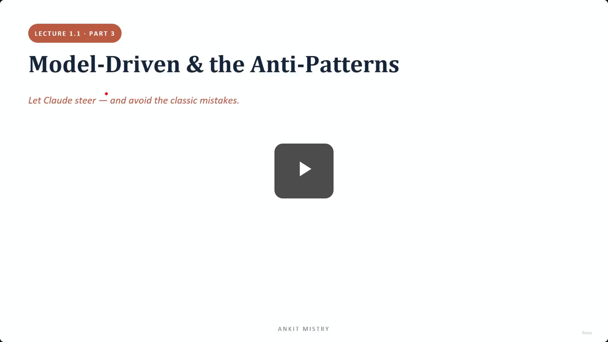
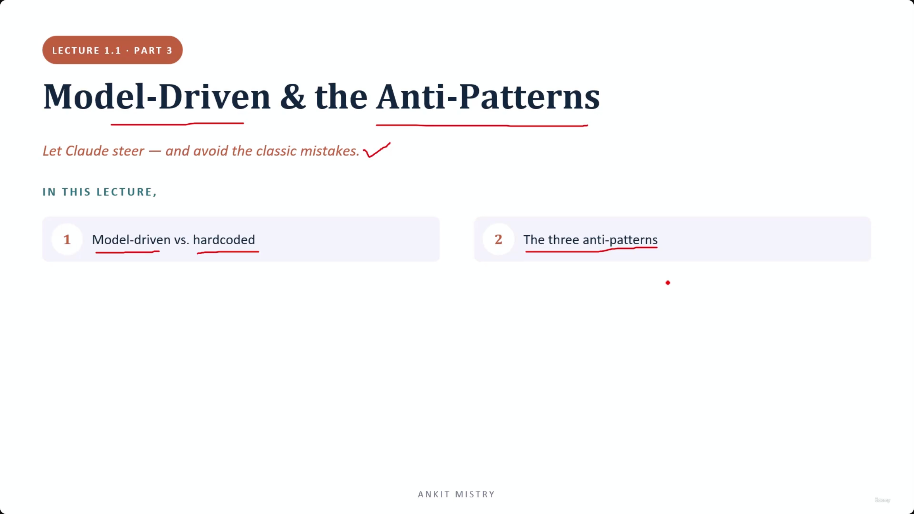
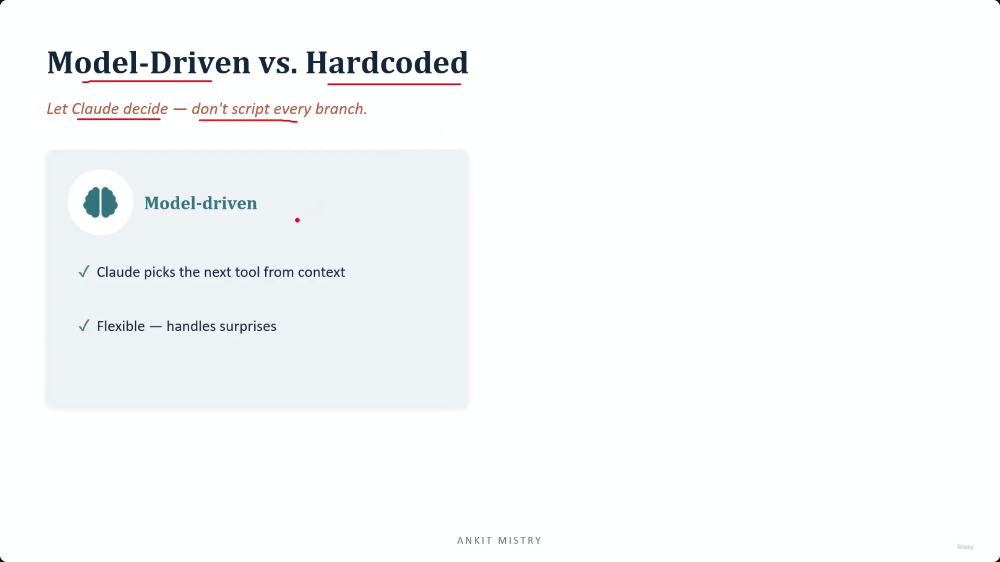
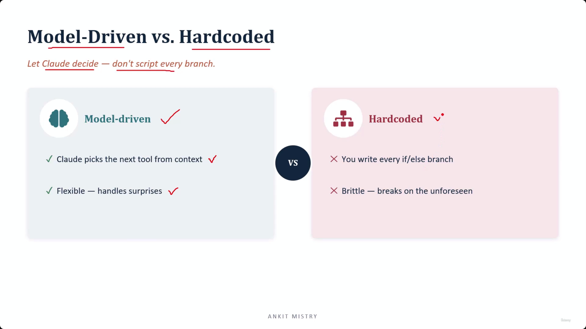
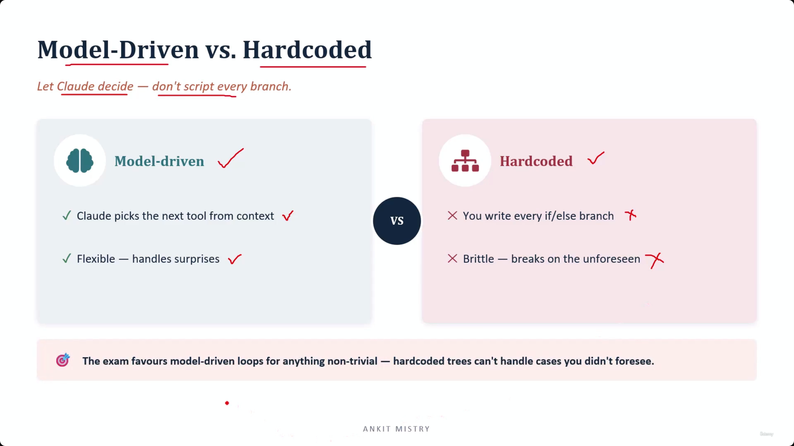
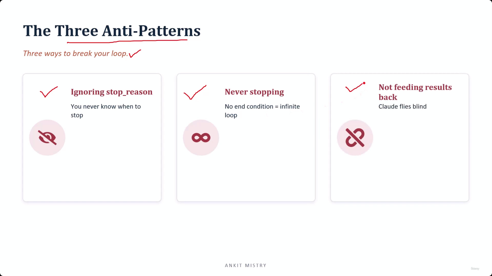
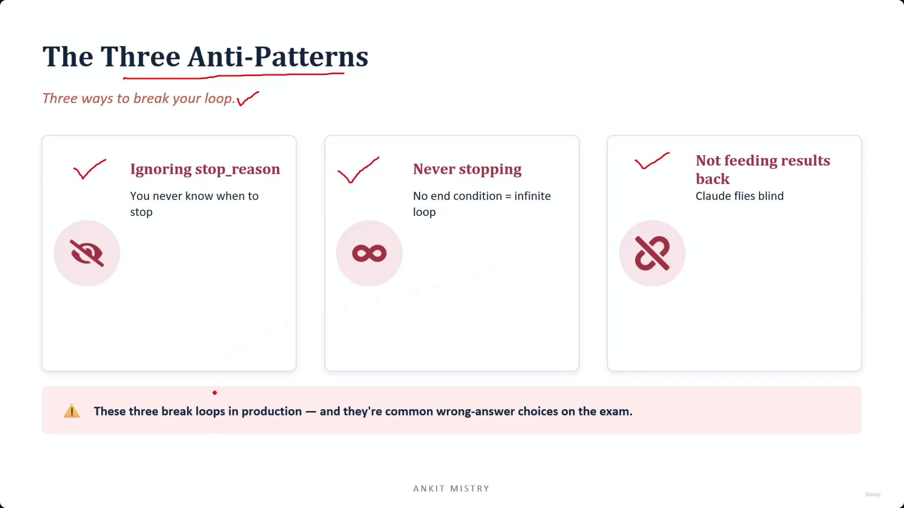
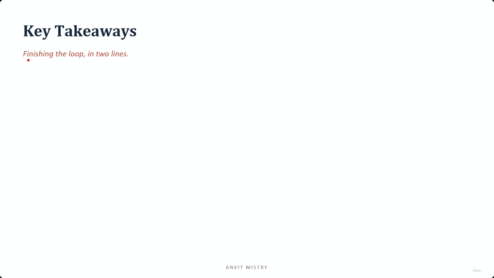
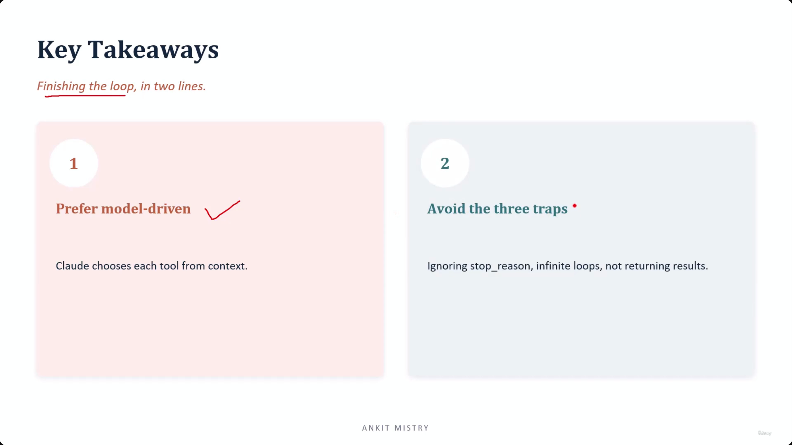
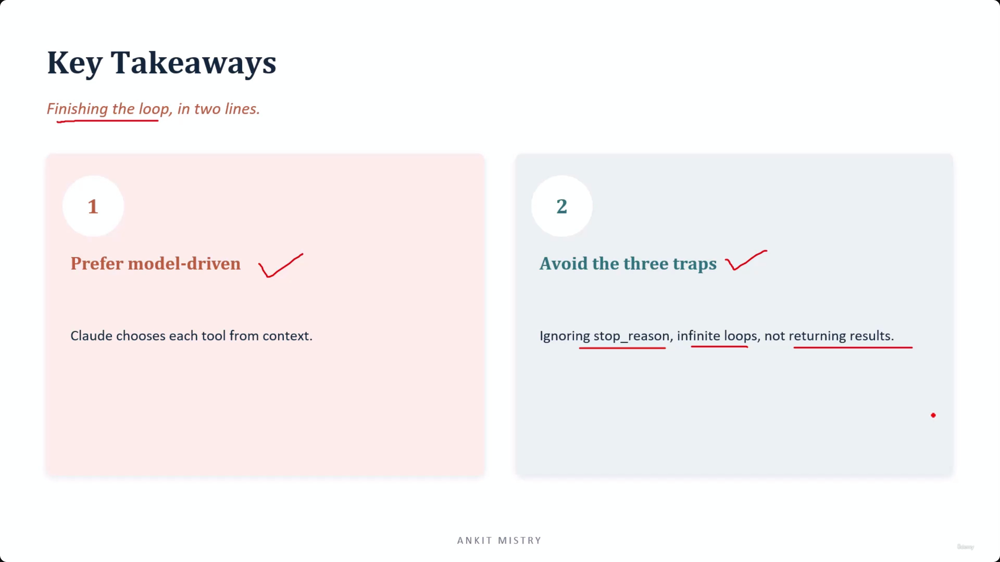

[00:00:00](https://www.udemy.com/course/claude-ai-certification/learn/lecture/57908967#overview)

## Model-Driven & the Anti-Patterns

- Let Claude steer — and avoid the classic mistakes.

### In This Lecture

1. Model-driven vs. hardcoded

    - A fundamental question of who is in charge of the logic

2. The three anti-patterns

[00:00:42](https://www.udemy.com/course/claude-ai-certification/learn/lecture/57908967#overview)

[00:01:09](https://www.udemy.com/course/claude-ai-certification/learn/lecture/57908967#overview)

### Model-Driven vs. Hardcoded

- The core decision is whether the AI reads the situation or if you write out every logic branch in advance
- **[Advice]** Let Claude decide — don't script every branch

#### Model-driven

- Claude picks the next tool from context
- Flexible because it handles surprises
    - Similar to how a sat nav reacts to real-world driving conditions

[00:01:45](https://www.udemy.com/course/claude-ai-certification/learn/lecture/57908967#overview)

#### Hardcoded

- **[Why it's brittle]** Because you have to write every single `if/else` branch in advance
    - It breaks on the unforeseen
    - Like a printed sheet of directions: it works until you encounter a change that isn't on the paper

| Feature | Model-driven | Hardcoded |
| --- | --- | --- |
| Logic | Claude picks the next tool from context | You write every if/else branch |
| Resilience | Flexible — handles surprises | Brittle — breaks on the unforeseen |

[00:02:27](https://www.udemy.com/course/claude-ai-certification/learn/lecture/57908967#overview)

[00:02:55](https://www.udemy.com/course/claude-ai-certification/learn/lecture/57908967#overview)

### Choosing the Right Approach

- **[Exam Tip]** The exam favors model-driven loops for anything non-trivial
    - Hardcoded trees cannot handle cases you didn't foresee
- When to use each:
    - **Hardcoded**: Genuinely fine for tiny, fixed jobs
    - **Model-driven**: The expected answer the moment a task has any real variety in it

[00:03:16](https://www.udemy.com/course/claude-ai-certification/learn/lecture/57908967#overview)

## The Three Anti-Patterns

- Three ways to break your loop.
- **[Definition]** An anti-pattern is a solution that looks reasonable but reliably causes trouble.

### Ignoring `stop_reason`

- You never know when to stop
    - Claude provides a signal every turn to indicate if the job is finished
    - **[The Risk]** If you ignore this signal, you are essentially guessing when the task is done
    - It is like asking a colleague to check something and walking away before they can give you their answer; you miss the outcome regardless of what they found

[00:04:13](https://www.udemy.com/course/claude-ai-certification/learn/lecture/57908967#overview)

### Never stopping

- No end condition = infinite loop
- **[The Risk]** It is like a tap left running overnight
    - It doesn't necessarily crash the system
    - It quietly costs real money with every single call made in the loop

### Not feeding results back

- Claude "flies blind"
- **[Why it happens]** The tool executes, but the resulting answer is never sent back to the model
    - This breaks the loop's ability to learn from its own actions

[00:04:40](https://www.udemy.com/course/claude-ai-certification/learn/lecture/57908967#overview)

[00:05:07](https://www.udemy.com/course/claude-ai-certification/learn/lecture/57908967#overview)

### Importance of the Anti-Patterns

- **[Production Risk]** These three patterns are the specific bugs that actually take agents down in real systems
- **[Exam Tip]** They are common wrong-answer choices on the exam
    - They often appear as tempting options that look reasonable but are incorrect

### Key Takeaways

- Finishing the loop, in two lines.

[00:05:40](https://www.udemy.com/course/claude-ai-certification/learn/lecture/57908967#overview)

### Summary: Finishing the Loop

1. **Prefer model-driven**

    - Claude chooses each tool from context
    - You set the destination, and Claude works out the turns one at a time
    - **[Why?]** This allows the system to cope when unexpected turns occur, which is common in real-world systems

2. **Avoid the three traps**

    - Ignoring `stop_reason`
    - Infinite loops
    - Not returning results
    - **[Crucial distinction]** These are all failures in the "plumbing" built around the model, not failures of Claude's intelligence itself

[00:05:58](https://www.udemy.com/course/claude-ai-certification/learn/lecture/57908967#overview)

- **[Crucial Insight]** The three anti-patterns are failures in the plumbing built around the model, not failures of Claude itself
    - Because they are plumbing issues, they are entirely in your hands to fix

1. Prefer model-driven

    - Claude chooses each tool from context

2. Avoid the three traps

    - Ignoring `stop_reason`
    - Infinite loops
    - Not returning results

---

## Multi-Agent Systems

- Moving beyond a single agent when a job is too big for one model to handle.