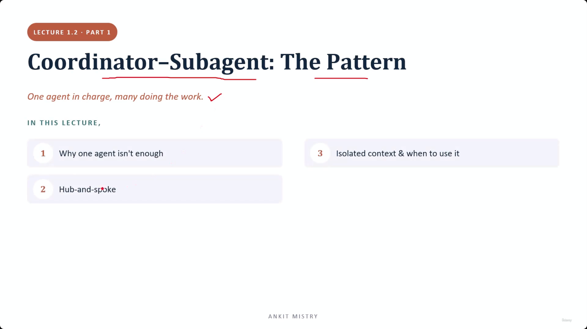
[00:00:31](https://www.udemy.com/course/claude-ai-certification/learn/lecture/57908971#overview)

## Coordinator-Subagent: The Pattern

- One agent in charge, many doing the work
- **[Context]** While a single agent in an agentic loop can handle many tasks, it becomes insufficient as the job size increases

### Lecture Overview

1. Why one agent isn't enough
2. Hub-and-spoke (the shape of this pattern)
3. Isolated context & when to use it

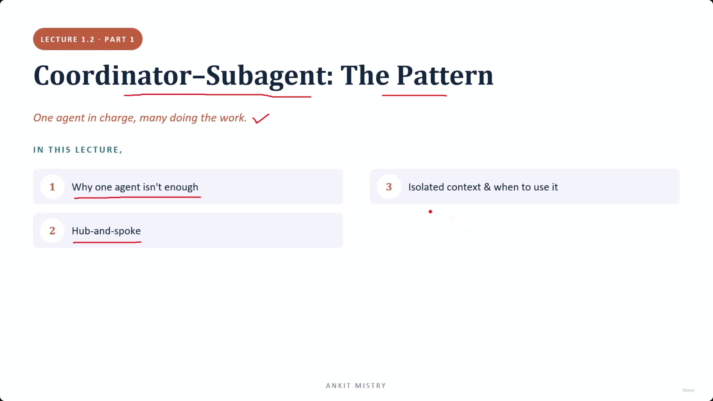
[00:00:43](https://www.udemy.com/course/claude-ai-certification/learn/lecture/57908971#overview)

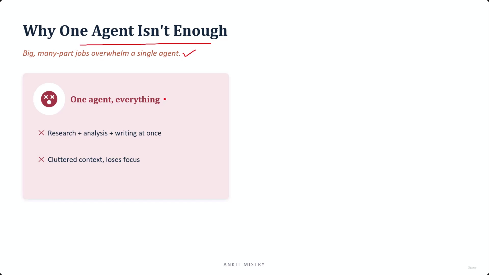
[00:01:12](https://www.udemy.com/course/claude-ai-certification/learn/lecture/57908971#overview)

### Why One Agent Isn't Enough

- Big, many-part jobs overwhelm a single agent
    - **[Problem]** Trying to do everything at once (e.g., research + analysis + writing) leads to a cluttered context
    - This clutter causes the agent to lose focus on the task at hand

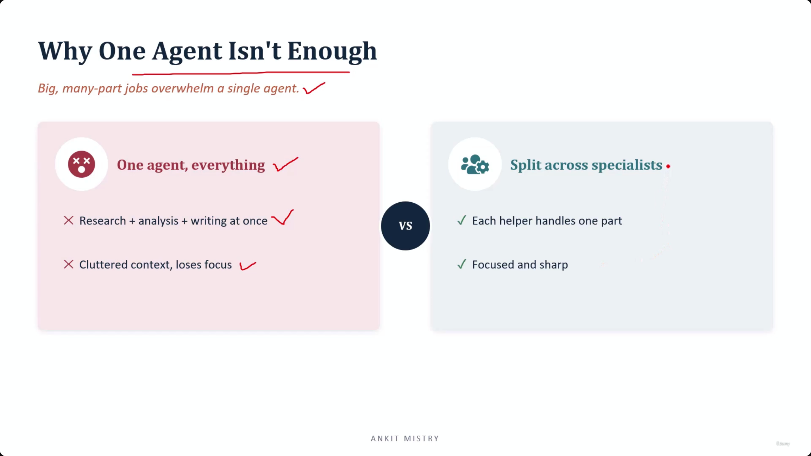
[00:01:52](https://www.udemy.com/course/claude-ai-certification/learn/lecture/57908971#overview)

### Comparison: One Agent vs. Specialists

- **One agent, everything**
    - Similar to a single cook trying to make starters, mains, and desserts all at once
    - The agent might be skilled, but quality begins to slip because there is too much on their "bench" at once
- **Split across specialists**
    - Similar to a kitchen brigade where different cooks manage specific stations (starters, mains, desserts)
    - Each helper handles one part
    - This keeps the agents focused and sharp

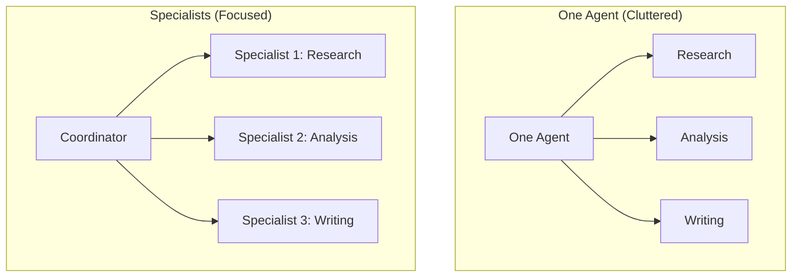

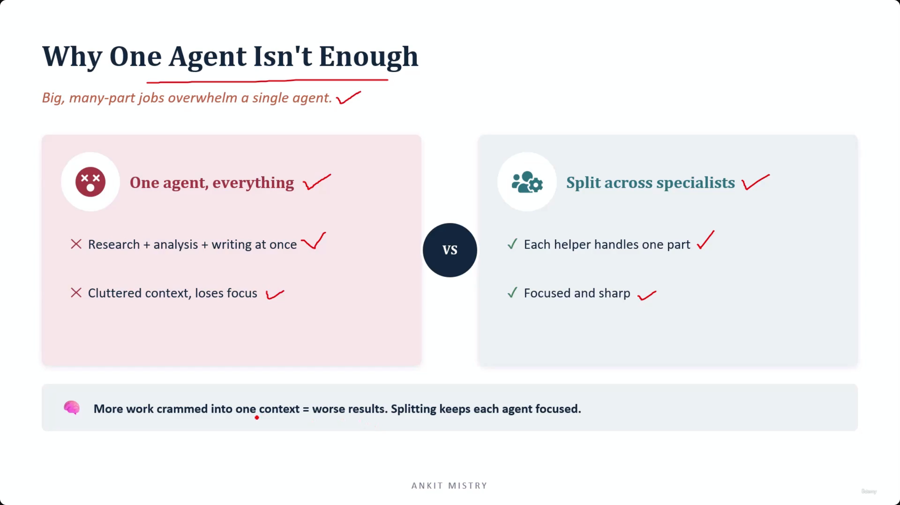
[00:02:30](https://www.udemy.com/course/claude-ai-certification/learn/lecture/57908971#overview)

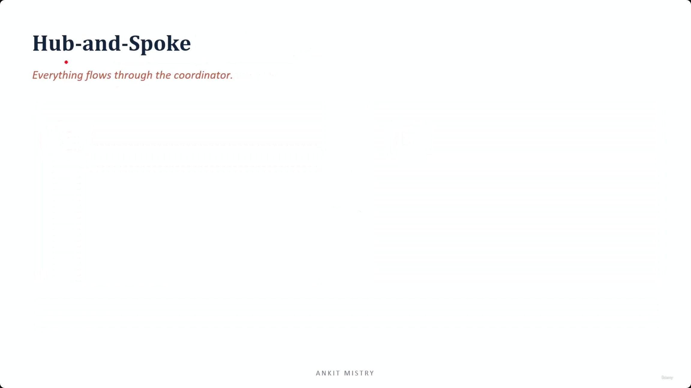
[00:02:56](https://www.udemy.com/course/claude-ai-certification/learn/lecture/57908971#overview)

### The Core Problem: Context Overload

- **[Key Principle]** More work crammed into one context = worse results
    - Splitting tasks keeps each agent focused
- It is not a matter of the agent's intelligence (e.g., Claude not being clever enough)
    - The failure occurs because different types of information (research notes, half-finished analysis, draft text) are all piled into one place
    - This "pile" causes critical details to get lost

[00:03:43](https://www.udemy.com/course/claude-ai-certification/learn/lecture/57908971#overview)

## Hub-and-Spoke

- **[Core Principle]** Everything flows through the coordinator
- This pattern takes a "wheel" shape to manage work distribution

### The Hub-and-Spoke Architecture

- The **Coordinator** acts as the central hub
- **Subagents** act as the spokes, each handling a specific part of the task
    - Research subagent
    - Analysis subagent
    - Writing subagent
- **[Key Rule]** Subagents are connected only to the central coordinator and not to each other

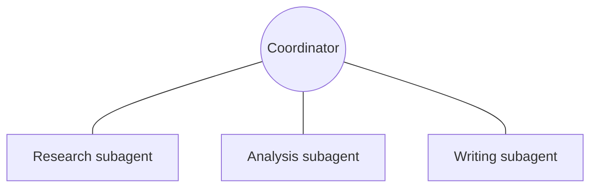

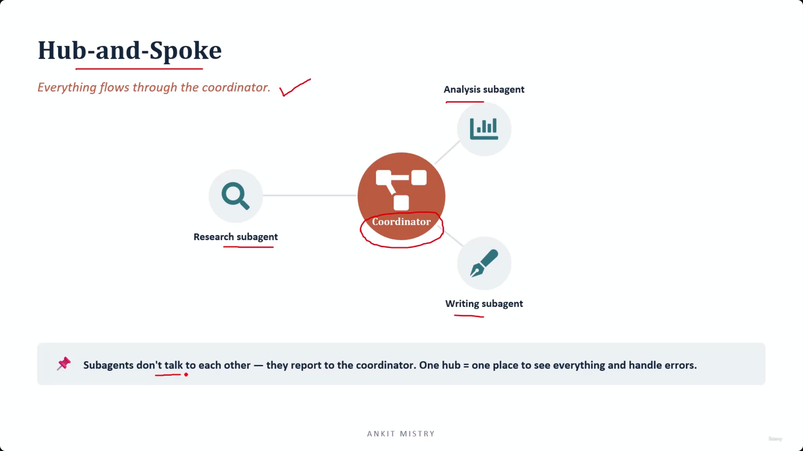
[00:03:44](https://www.udemy.com/course/claude-ai-certification/learn/lecture/57908971#overview)

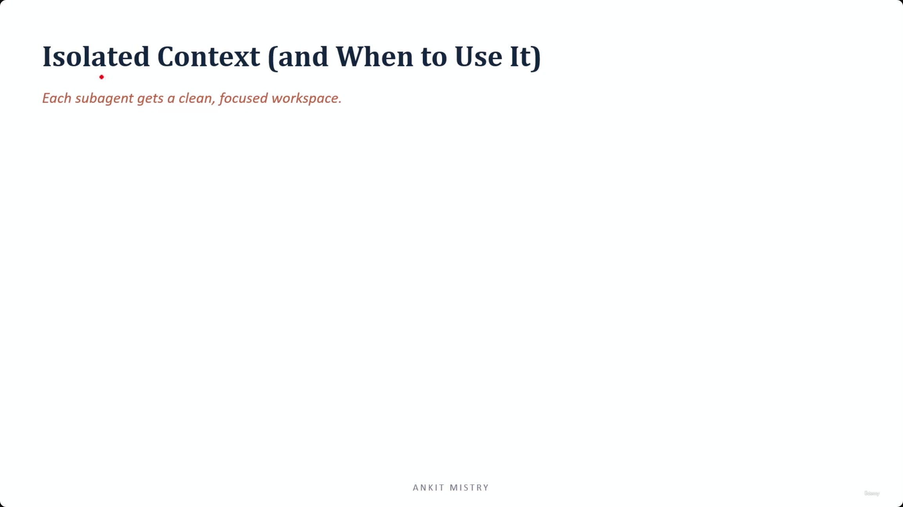
[00:04:11](https://www.udemy.com/course/claude-ai-certification/learn/lecture/57908971#overview)

### Hub-and-Spoke Communication Rules

- **Subagents do not talk to each other**
    - They report exclusively to the coordinator
- **One hub = one place to see everything and handle errors**
    - **[Analogy]** Like a head chef at the pass in a kitchen: the different stations (starters, desserts) don't shout to each other; everything goes through the one person who knows what the final plate should look like and can spot when something is missing

---

## Isolated Context (and When to Use It)

- **[Core Principle]** Each subagent gets a clean, focused workspace

[00:05:08](https://www.udemy.com/course/claude-ai-certification/learn/lecture/57908971#overview)

### The Benefits and Use Cases of Isolated Context

- **[Core Principle]** A clean workspace = better work
- **[Why it works]** Isolated context allows a subagent focused on one job to do that job better
    - Each subagent sees only its specific task, not the whole job
- **When to use this pattern**
    - When a task has several separable parts
- **When to avoid this pattern**
    - Simple, single-threaded jobs don't need a coordinator
    - **[Warning]** For straight-line work, adding a coordinator introduces more points of failure

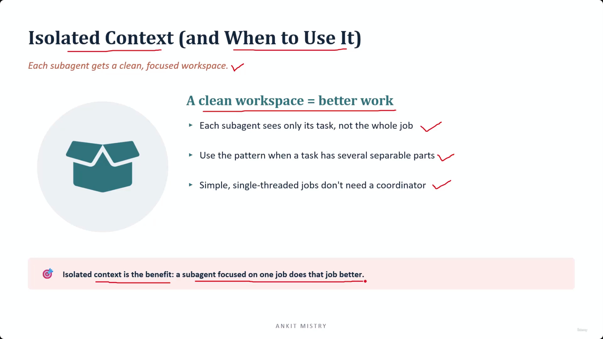
[00:05:14](https://www.udemy.com/course/claude-ai-certification/learn/lecture/57908971#overview)

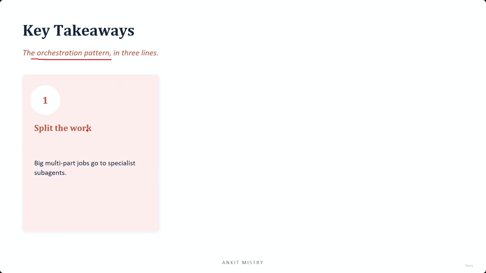
[00:05:48](https://www.udemy.com/course/claude-ai-certification/learn/lecture/57908971#overview)

### Determining Separability

- **[Crucial Criterion]** Can the job genuinely be cut into pieces that stand on their own?
    - **Example: Separable task**
        - Writing a market report: can be split into research $\rightarrow$ analysis $\rightarrow$ writing
    - **Example: Non-separable task**
        - Editing a single paragraph: there is nothing there to split

## Key Takeaways: The Orchestration Pattern

- **1. Split the work**
    - Big, multi-part jobs should be sent to specialist subagents
    - **[Why?]** Like the kitchen analogy, one cook doing everything gets slower and makes more errors

---

## Simple Explanation (with Claude Examples)

**The core idea, in one line**: When a job has too many moving parts for one agent to juggle, split it across focused specialist subagents that all report to a single coordinator — instead of one agent trying to do everything at once.

**Everyday analogy: the kitchen**

One cook trying to make starters, mains, and desserts simultaneously gets overwhelmed — quality slips because there's too much on their bench at once. A kitchen brigade instead has a fish station, a pastry section, and so on — each cook focused on one thing, all reporting to the head chef at the pass. Same total amount of food, much better execution.

*Claude Code example*: In this session, the `Agent` tool lets me spawn a focused subagent — like `Explore` — to dig through a codebase in its own separate context and report back just a summary, instead of me personally reading 40 files directly into our shared conversation and getting cluttered. One "cook" (subagent) handles the reading; I stay focused on the actual task.

**Why cramming everything into one context hurts — even a smart model**

This isn't about the agent not being clever enough. When research notes, half-finished analysis, and draft writing are all piled into one context together, details get lost in the mess. Splitting keeps each agent's "workspace" clean and focused.

**Hub-and-spoke — the shape of this pattern**

The **coordinator** is the hub; **subagents** are the spokes. Subagents talk only to the coordinator, never to each other — exactly like kitchen stations don't shout across to one another; everything routes through the head chef, who's the one person who sees the whole picture and can catch problems.

*Claude Code example*: If I spawn two subagents to investigate different parts of a codebase, they don't communicate with each other directly — each reports its findings back to me, and I (the coordinator) am the one who combines their results into a single coherent answer for you.

**When to use isolated context — and when not to**

Use it when a task genuinely has separable parts (e.g., "research → analyze → write" for a report — each piece can stand on its own). Skip it for simple, single-threaded jobs — adding a coordinator to a straight-line task just adds more points of failure for no benefit.

*Claude Code example*: Asking me to "fix this one typo" doesn't warrant spawning a subagent — that's a simple, non-separable task. Asking me to "review this 50-file PR for security issues" is genuinely separable and is a much better fit for delegating to specialist subagents.

**Recap in 3 lines**

1. **Split big, multi-part jobs** — one agent doing everything gets slower and makes more mistakes, just like one overloaded cook.
2. **Hub-and-spoke** — subagents report only to the coordinator, never to each other, so there's one place to see everything.
3. **Only split what's genuinely separable** — simple, single-threaded work doesn't need a coordinator at all.

---

## Exam Objective Note: CCAR-F 1.2 — Multi-Agent Orchestration

**Five shapes to know**

Most exam questions describe a setup and ask you to name its shape. The five shapes are: a single call, a fixed chain, parallel workers, an orchestrator that decides how many workers to spawn, and an evaluator paired with an optimizer.

**When is an orchestrator actually worth it?**

An orchestrator feels like the "safe" answer, but it only earns its cost when you don't know how many subtasks there are until partway through the run. If the number of subtasks is already known before you start, a simpler fixed chain or parallel split is the right call — the orchestrator's extra overhead isn't needed.

**Two traps to watch for**

- Splitting work into overlapping pieces makes you pay twice for the same document, and covers nothing extra. Pure waste.
- Only the coordinator ever sees every worker's findings. Individual workers can't see each other's output, so only the coordinator can notice when two of them disagree.

*Claude Code example*: If I split a research task into overlapping topics and two subagents end up covering the same ground, that's wasted effort for zero extra coverage. When several subagents run in parallel instead, only I — the coordinator collecting their answers — am in a position to spot if two of them contradict each other.

**Recap in 3 lines**

1. Five shapes get tested: single call, fixed chain, parallel workers, orchestrator, evaluator-optimizer.
2. Use an orchestrator only when the number of subtasks is discovered mid-run, not when it's already known.
3. Overlapping splits waste effort for no extra coverage; only the coordinator can catch workers disagreeing.