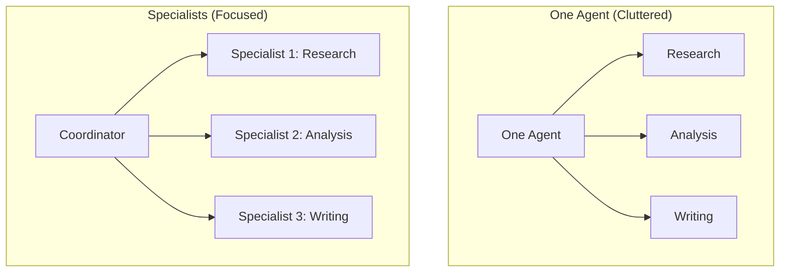
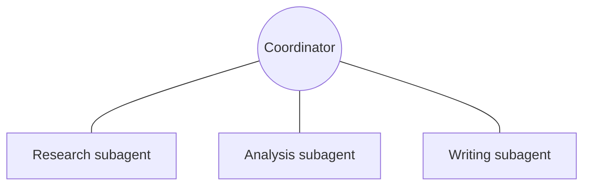

[00:00:31](https://www.udemy.com/course/claude-ai-certification/learn/lecture/57908971#overview)

## Coordinator-Subagent: The Pattern

- One agent in charge, many doing the work
- **[Context]** While a single agent in an agentic loop can handle many tasks, it becomes insufficient as the job size increases

### Lecture Overview

1. Why one agent isn't enough
2. Hub-and-spoke (the shape of this pattern)
3. Isolated context & when to use it

[00:00:43](https://www.udemy.com/course/claude-ai-certification/learn/lecture/57908971#overview)

[00:01:12](https://www.udemy.com/course/claude-ai-certification/learn/lecture/57908971#overview)

### Why One Agent Isn't Enough

- Big, many-part jobs overwhelm a single agent
    - **[Problem]** Trying to do everything at once (e.g., research + analysis + writing) leads to a cluttered context
    - This clutter causes the agent to lose focus on the task at hand

[00:01:52](https://www.udemy.com/course/claude-ai-certification/learn/lecture/57908971#overview)

### Comparison: One Agent vs. Specialists

- **One agent, everything**
    - Similar to a single cook trying to make starters, mains, and desserts all at once
    - The agent might be skilled, but quality begins to slip because there is too much on their "bench" at once
- **Split across specialists**
    - Similar to a kitchen brigade where different cooks manage specific stations (starters, mains, desserts)
    - Each helper handles one part
    - This keeps the agents focused and sharp

[00:02:30](https://www.udemy.com/course/claude-ai-certification/learn/lecture/57908971#overview)

[00:02:56](https://www.udemy.com/course/claude-ai-certification/learn/lecture/57908971#overview)

### The Core Problem: Context Overload

- **[Key Principle]** More work crammed into one context = worse results
    - Splitting tasks keeps each agent focused
- It is not a matter of the agent's intelligence (e.g., Claude not being clever enough)
    - The failure occurs because different types of information (research notes, half-finished analysis, draft text) are all piled into one place
    - This "pile" causes critical details to get lost

[00:03:43](https://www.udemy.com/course/claude-ai-certification/learn/lecture/57908971#overview)

## Hub-and-Spoke

- **[Core Principle]** Everything flows through the coordinator
- This pattern takes a "wheel" shape to manage work distribution

### The Hub-and-Spoke Architecture

- The **Coordinator** acts as the central hub
- **Subagents** act as the spokes, each handling a specific part of the task
    - Research subagent
    - Analysis subagent
    - Writing subagent
- **[Key Rule]** Subagents are connected only to the central coordinator and not to each other

[00:03:44](https://www.udemy.com/course/claude-ai-certification/learn/lecture/57908971#overview)

[00:04:11](https://www.udemy.com/course/claude-ai-certification/learn/lecture/57908971#overview)

### Hub-and-Spoke Communication Rules

- **Subagents do not talk to each other**
    - They report exclusively to the coordinator
- **One hub = one place to see everything and handle errors**
    - **[Analogy]** Like a head chef at the pass in a kitchen: the different stations (starters, desserts) don't shout to each other; everything goes through the one person who knows what the final plate should look like and can spot when something is missing

---

## Isolated Context (and When to Use It)

- **[Core Principle]** Each subagent gets a clean, focused workspace

[00:05:08](https://www.udemy.com/course/claude-ai-certification/learn/lecture/57908971#overview)

### The Benefits and Use Cases of Isolated Context

- **[Core Principle]** A clean workspace = better work
- **[Why it works]** Isolated context allows a subagent focused on one job to do that job better
    - Each subagent sees only its specific task, not the whole job
- **When to use this pattern**
    - When a task has several separable parts
- **When to avoid this pattern**
    - Simple, single-threaded jobs don't need a coordinator
    - **[Warning]** For straight-line work, adding a coordinator introduces more points of failure

[00:05:14](https://www.udemy.com/course/claude-ai-certification/learn/lecture/57908971#overview)

[00:05:48](https://www.udemy.com/course/claude-ai-certification/learn/lecture/57908971#overview)

### Determining Separability

- **[Crucial Criterion]** Can the job genuinely be cut into pieces that stand on their own?
    - **Example: Separable task**
        - Writing a market report: can be split into research $\rightarrow$ analysis $\rightarrow$ writing
    - **Example: Non-separable task**
        - Editing a single paragraph: there is nothing there to split

## Key Takeaways: The Orchestration Pattern

- **1. Split the work**
    - Big, multi-part jobs should be sent to specialist subagents
    - **[Why?]** Like the kitchen analogy, one cook doing everything gets slower and makes more errors