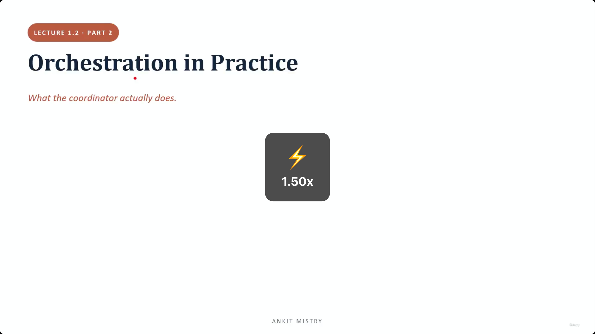
[00:00:00](https://www.udemy.com/course/claude-ai-certification/learn/lecture/57908975#overview)

## Orchestration in Practice

- Focuses on the practical responsibilities of the coordinator within an agentic architecture
- **In this lecture:**
    - 1. The coordinator's jobs
    - 2. Sequential vs. parallel
    - 3. Iterative refinement
    - 4. The narrow-decomposition trap

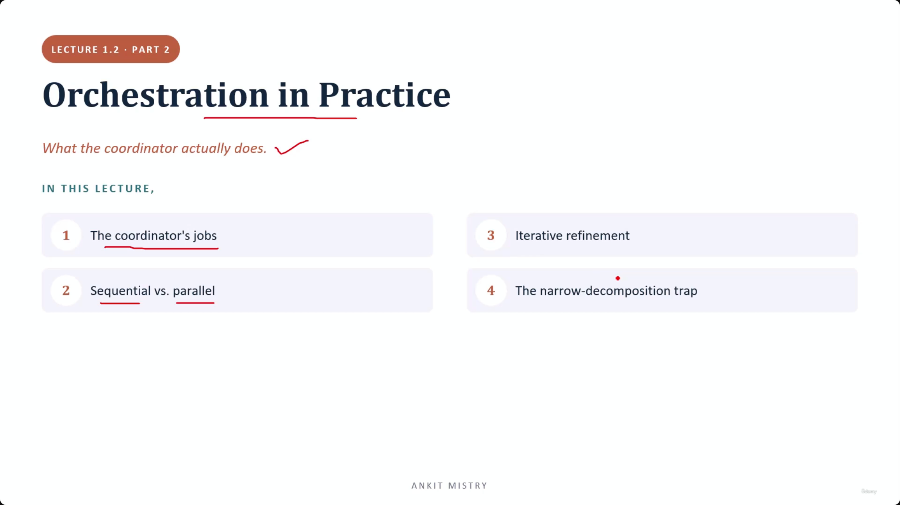
[00:00:35](https://www.udemy.com/course/claude-ai-certification/learn/lecture/57908975#overview)

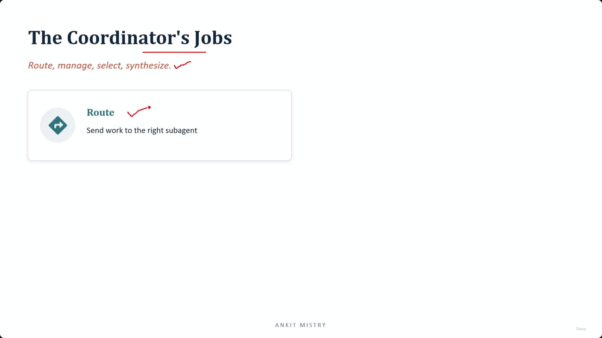
[00:01:06](https://www.udemy.com/course/claude-ai-certification/learn/lecture/57908975#overview)

### The Coordinator's Jobs

- There are four distinct types of work a coordinator performs:
    - Route
    - Manage
    - Select
    - Synthesize
- **Routing**
    - The task of sending work to the correct sub-agent
    - **[Analogy]** Like a head chef handing specific ingredients or tasks to the fish station or the pastry section

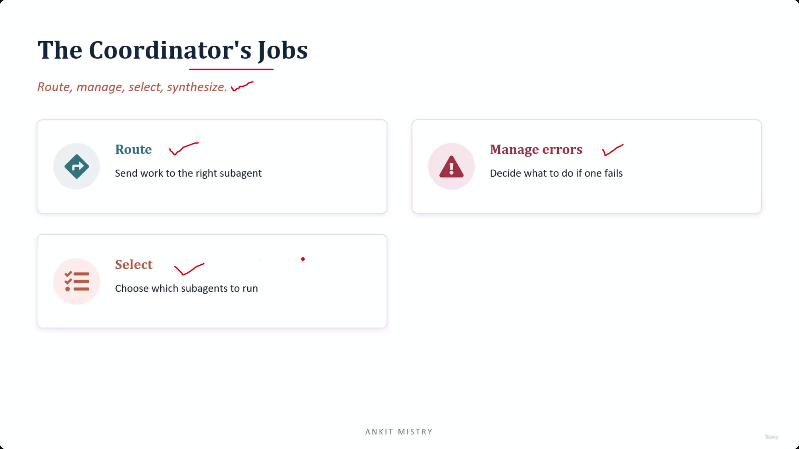
[00:02:03](https://www.udemy.com/course/claude-ai-certification/learn/lecture/57908975#overview)

- **Manage errors**
    - Deciding what to do if a sub-agent fails
    - Reacting when a sub-agent comes back empty or breaks
    - **[Possible reactions]**
        - Trying the task again
        - Taking a different route entirely
    - **[Why it matters]** Because the coordinator is the 'hub', it provides a single, centralized place to catch and handle failures
- **Select**
    - Choosing which sub-agents to run

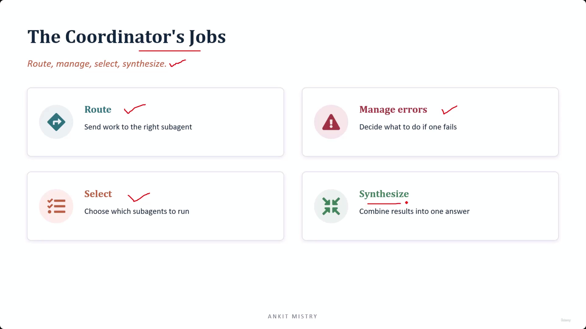
[00:02:30](https://www.udemy.com/course/claude-ai-certification/learn/lecture/57908975#overview)

### Synthesize

- Combining separate results into one single, coherent answer
- **[Why it matters]** Without synthesis, the user just receives multiple disconnected components rather than a complete answer
- **[Analogy]** Like a head chef turning separate components into a single coherent plate that makes sense to the person who ordered it

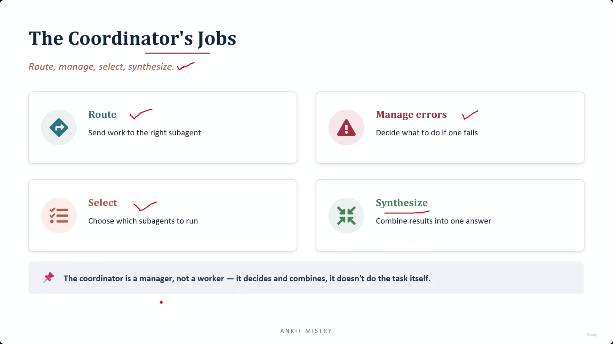
[00:02:54](https://www.udemy.com/course/claude-ai-certification/learn/lecture/57908975#overview)

[00:03:24](https://www.udemy.com/course/claude-ai-certification/learn/lecture/57908975#overview)

### The Coordinator's Role

- **The coordinator is a manager, not a worker**
    - It decides and combines results
    - It does not perform the task itself
- **[Why this is critical]** If the coordinator starts doing the actual research or work, you lose the benefit of the specialized agentic pattern
    - **Analogy:** The head chef at the pass is managing the flow and quality, not cooking every dish themselves

## Sequential vs. Parallel

- Represents the choice of how tasks are executed:
    - **Sequential:** One after another
    - **Parallel:** All at once

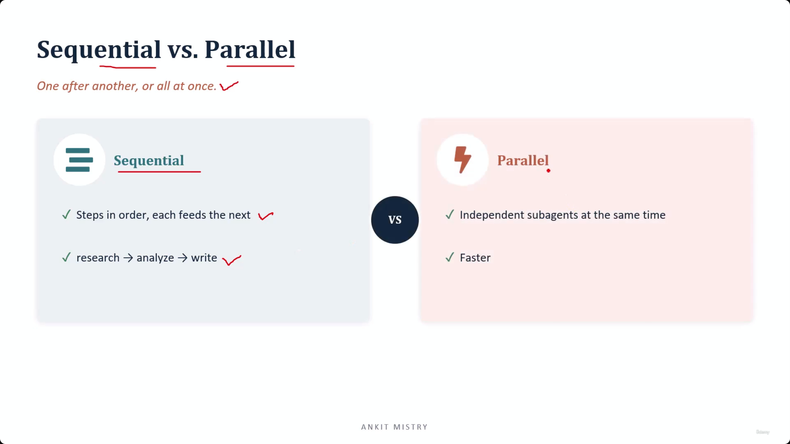
[00:04:13](https://www.udemy.com/course/claude-ai-certification/learn/lecture/57908975#overview)

### Execution Patterns: Sequential vs. Parallel

- Deciding how sub-agents run is a structural decision based on the work's requirements
- **Sequential**
    - Steps occur in a specific order, where each step feeds the next
    - **[Example]** `research` $\rightarrow$ `analyze` $\rightarrow$ `write`
    - **[Why it's required]** The work has a specific shape; you cannot analyze material that hasn't been gathered, nor write an analysis that doesn't exist
- **Parallel**
    - Independent sub-agents run at the same time
    - **[Benefit]** Faster execution

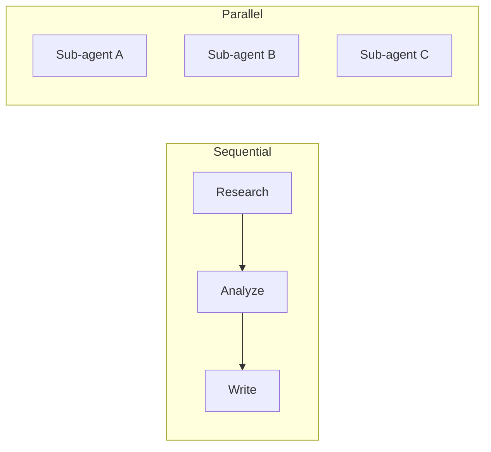
```mermaid
graph LR
    subgraph Sequential
    S1[Research] --> S2[Analyze] --> S3[Write]
    end

    subgraph Parallel
    P1[Sub-agent A]
    P2[Sub-agent B]
    P3[Sub-agent C]
    end
```

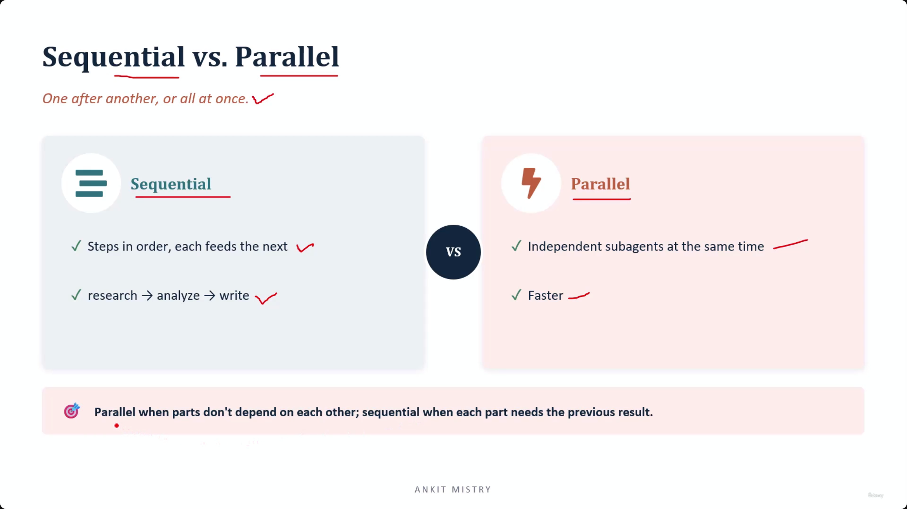
[00:04:38](https://www.udemy.com/course/claude-ai-certification/learn/lecture/57908975#overview)

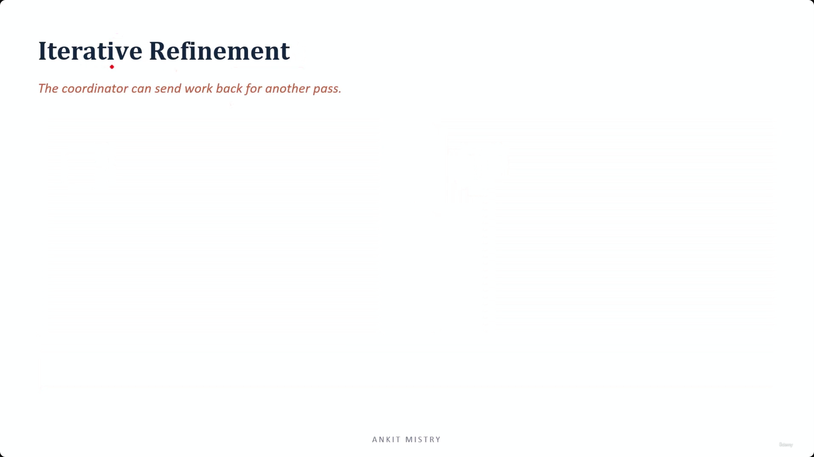
[00:05:05](https://www.udemy.com/course/claude-ai-certification/learn/lecture/57908975#overview)

### Choosing an Execution Pattern

- The decision between sequential and parallel is not a matter of taste, but is dictated by the dependencies of the work
- **The Rule**
    - **Parallel**: Use when parts don't depend on each other
        - **[Benefit]** Faster execution; multiple sub-agents can work at the same time without waiting
        - **[Analogy]** Three cooks making three different starters at once
    - **Sequential**: Use when each part needs the previous result
        - **[Requirement]** The work has a specific shape where one step feeds the next
- **[Decision Framework]** To decide, ask: "Does this piece need the answer from that piece?"
    - If yes $\rightarrow$ Sequential
    - If no $\rightarrow$ Parallel

---

## Iterative Refinement

- The coordinator can send work back for another pass

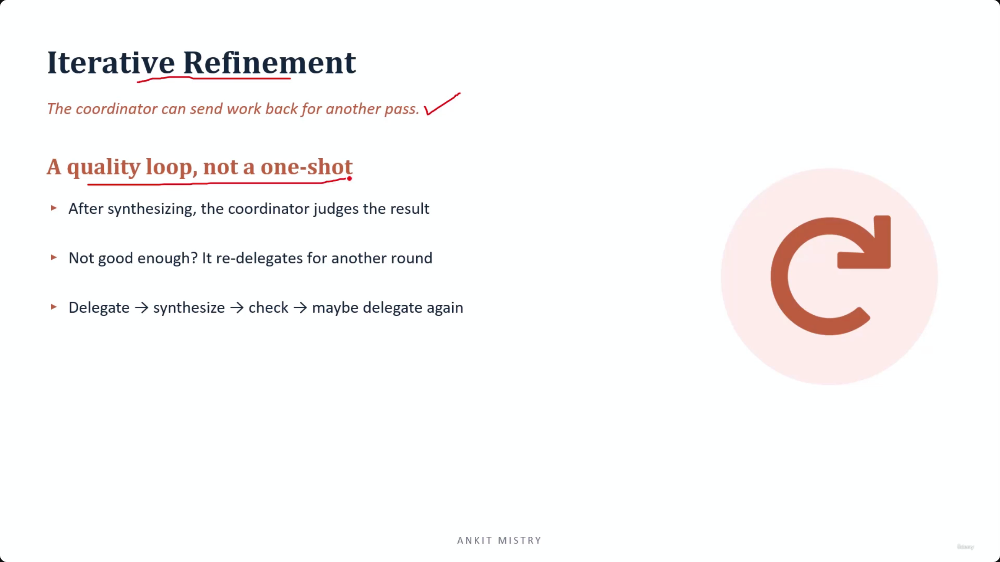
[00:05:30](https://www.udemy.com/course/claude-ai-certification/learn/lecture/57908975#overview)

### The Quality Loop: Iterative Refinement

- The coordinator can send work back for another pass
    - **[Why?]** This distinguishes a coordinator that simply collects information from one that takes responsibility for the quality of the final output
- **A quality loop, not a one-shot**
    - After synthesizing, the coordinator judges the result
    - If the result is not good enough, it re-delegates for another round

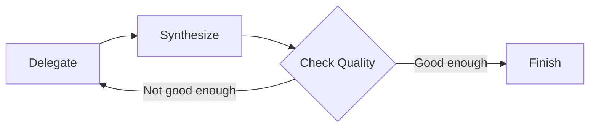
```mermaid
flowchart LR
    A[Delegate] --> B[Synthesize]
    B --> C{Check Quality}
    C -->|Not good enough| A
    C -->|Good enough| D[Finish]
```

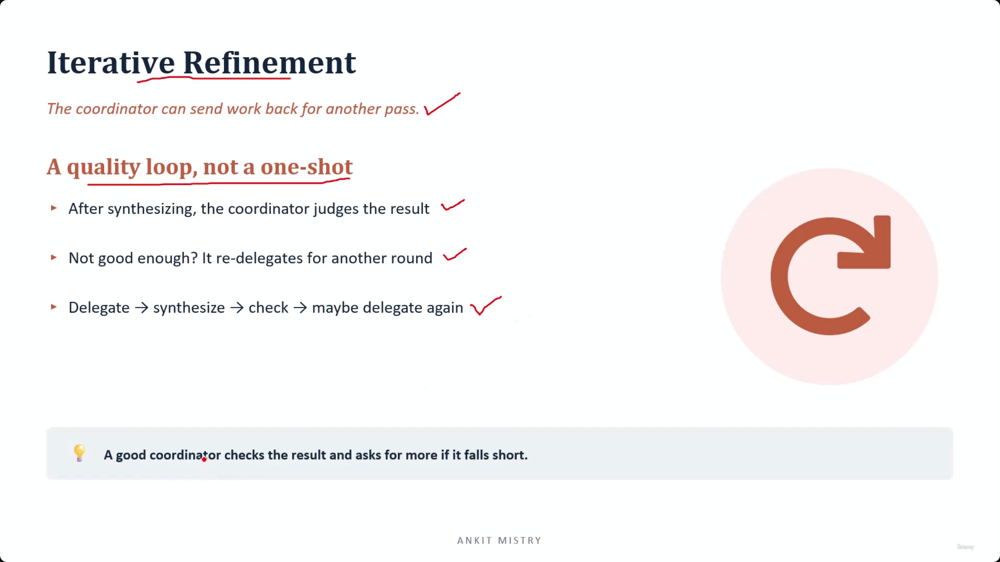
[00:05:59](https://www.udemy.com/course/claude-ai-certification/learn/lecture/57908975#overview)

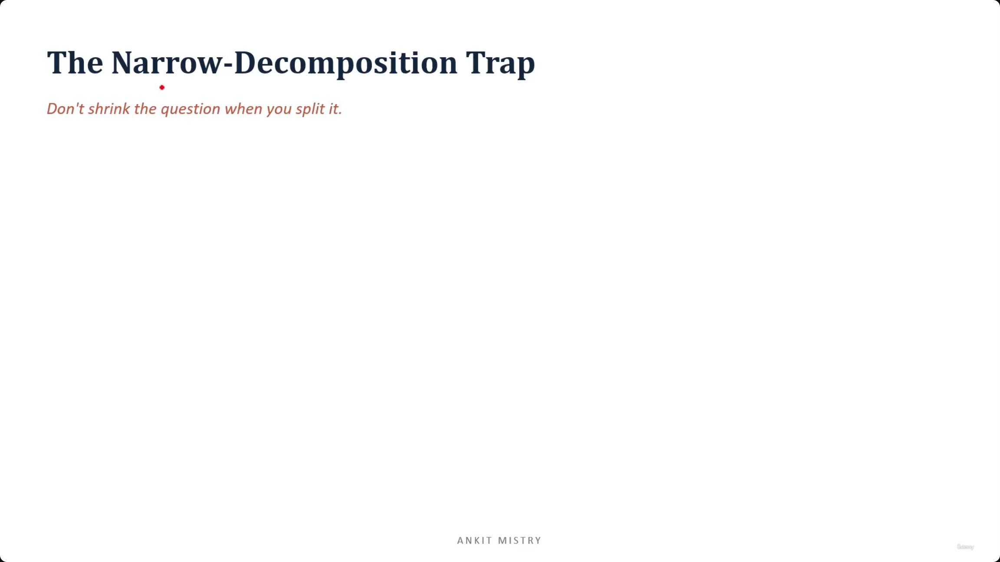
[00:06:29](https://www.udemy.com/course/claude-ai-certification/learn/lecture/57908975#overview)

### The Coordinator as a Quality Controller

- A good coordinator acts as a final checkpoint, ensuring the output meets standards before completion
    - **[Analogy]** Like a head chef tasting a sauce before the plate leaves the kitchen; if it isn't right, it goes straight back to the station
- This mechanism is a direct application of the fundamental agentic loop:

    1. **Act**: Perform the task or delegate it
    2. **Observe**: Look at the resulting output
    3. **Reason**: Decide whether to finish or go around the loop again

## The Narrow-Decomposition Trap

- When breaking down complex tasks, there is a risk of shrinking the scope of the original question
- **The Trap**: Splitting a task into such small, granular pieces that the original intent or context is lost, making it impossible for the sub-agents to solve the actual problem.

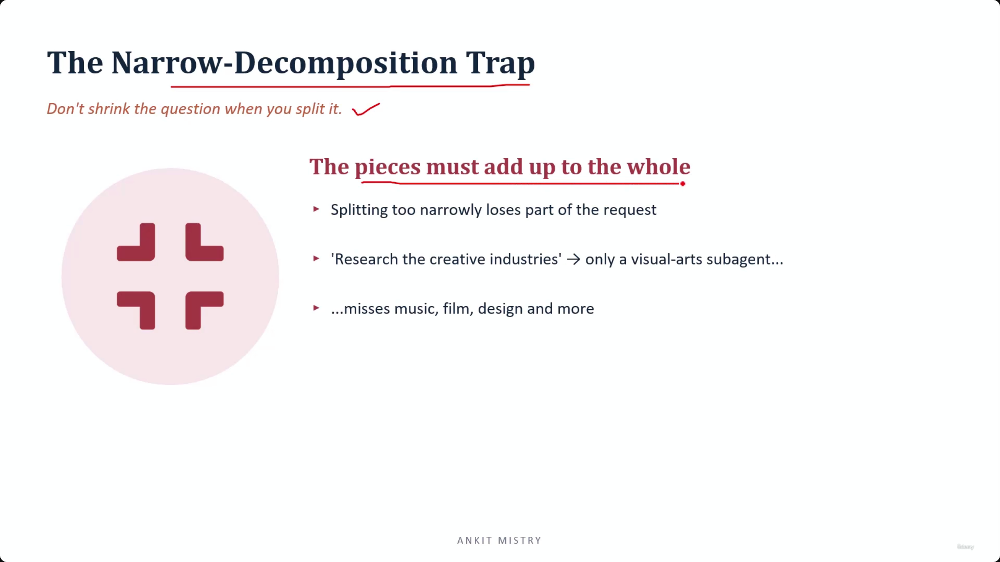
[00:06:55](https://www.udemy.com/course/claude-ai-certification/learn/lecture/57908975#overview)

### The Mechanics of Narrow Decomposition

- **The Golden Rule**: The pieces must add up to the whole
- **The Trap**: Splitting work too narrowly can lead to losing parts of the original request
    - This happens even if no technical errors occur and all sub-agents succeed in their specific tasks
- **Example: Researching Creative Industries**
    - **Original Goal**: Research the creative industries
    - **Narrow Decomposition**: Spawning only a visual-arts sub-agent
    - **Result**: The agent misses critical sectors like music, film, and design

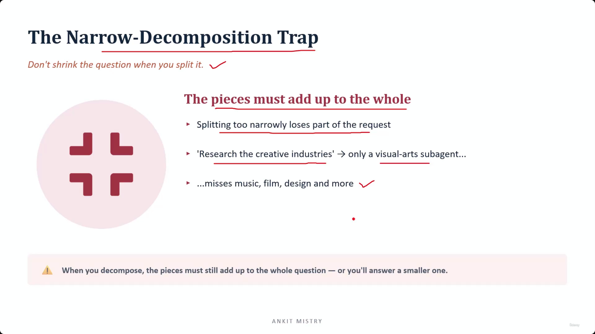
[00:07:33](https://www.udemy.com/course/claude-ai-certification/learn/lecture/57908975#overview)

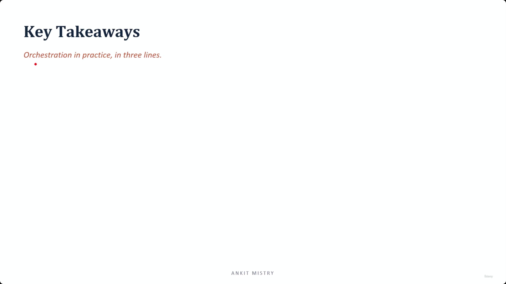
[00:08:02](https://www.udemy.com/course/claude-ai-certification/learn/lecture/57908975#overview)

### The Risk of Quiet Failure

- **The Warning**: When you decompose, the pieces must still add up to the whole question
    - **[The Consequence]**: If they don't, you will answer a smaller question rather than the one asked
- **Why it is a "quiet failure"**
    - The sub-agents can perform their specific tasks perfectly
    - The output can be confident, well-written, and technically correct
    - However, the original intent or context is lost because critical components were omitted during the split

---

## Key Takeaways

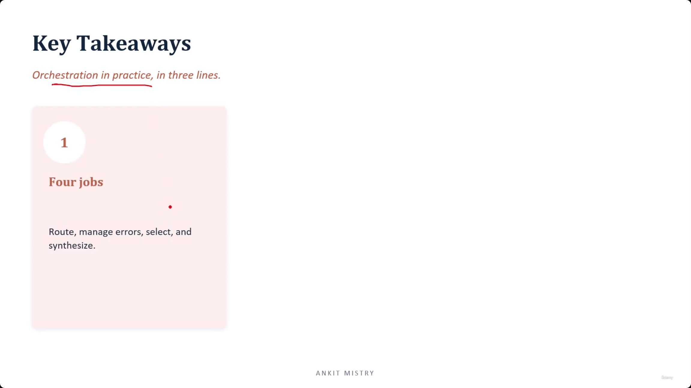
[00:08:10](https://www.udemy.com/course/claude-ai-certification/learn/lecture/57908975#overview)

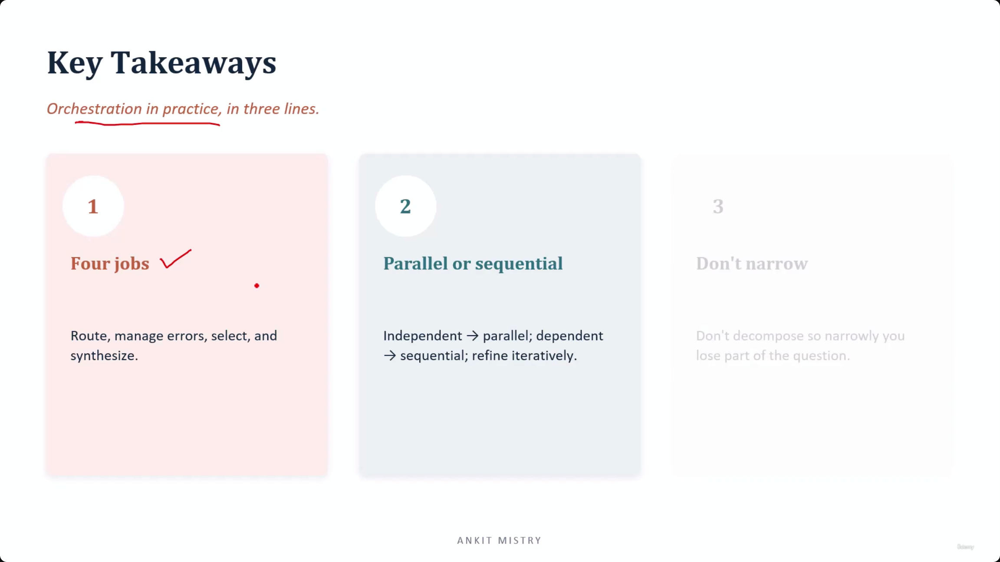
[00:08:27](https://www.udemy.com/course/claude-ai-certification/learn/lecture/57908975#overview)

[00:08:35](https://www.udemy.com/course/claude-ai-certification/learn/lecture/57908975#overview)

### Orchestration in Practice: Three Lines

#### 1. The Four Jobs

- Route, manage errors, select, and synthesize
    - **The Head Chef Analogy**: The coordinator is like a head chef at the pass—deciding, checking, and combining, but never actually cooking the dish themselves
    - **[Critical Warning]**: The moment your coordinator starts doing the actual work (the cooking), the orchestration pattern stops paying for itself

#### 2. Execution Patterns

- The decision between parallel and sequential is driven by dependencies, not personal preference for speed
    - **Parallel**: Use when tasks are independent
    - **Sequential**: Use when tasks are dependent (one piece needs the answer from another)
    - **Iterative Refinement**: Refine the process iteratively based on results

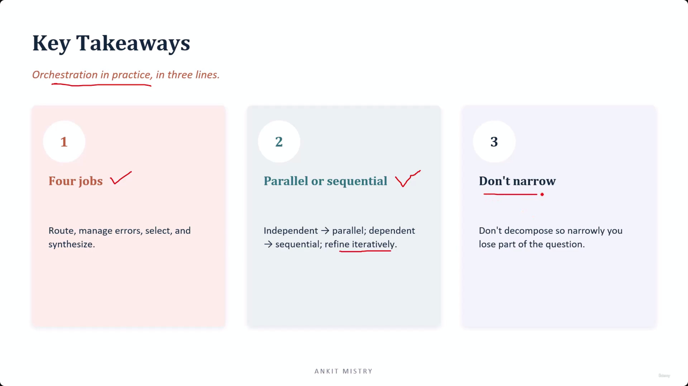
[00:08:56](https://www.udemy.com/course/claude-ai-certification/learn/lecture/57908975#overview)

#### 3. Don't narrow

- Do not decompose so narrowly that you lose part of the question
- **[The Validation Rule]**: Always check your decomposed pieces against the original request
- **The Danger of High-Quality Wrong Answers**: This is the hardest kind of error to spot because the resulting answer often reads very well, even though it is answering a smaller, incorrect question

---

## Simple Explanation (with Claude Examples)

**The core idea, in one line**: A coordinator's job is to route, manage errors, select, and synthesize — never to do the actual work itself, and never to slice a task so narrowly that pieces stop adding up to the original question.

**The coordinator's four jobs — the head chef analogy**

A head chef at the pass doesn't cook every dish personally — they hand ingredients to the right station (**route**), decide what happens if a dish comes back wrong (**manage errors**), pick which stations are even needed for tonight's menu (**select**), and combine everything into one coherent plate before it goes out (**synthesize**). The moment the head chef starts cooking instead of managing, the whole system stops paying for itself.

*Claude Code example*: When I delegate a codebase investigation to an `Explore` subagent, my job afterward isn't to re-read every file it found — it's to take its summary and weave it into a coherent answer for you. If I started re-doing the subagent's reading myself, spawning it in the first place would have been pointless.

**Sequential vs. parallel — the deciding question**

Ask: *"Does this piece need the answer from that piece?"*
- **Yes** → sequential (research → analyze → write; you can't analyze data you haven't gathered yet)
- **No** → parallel (three independent checks can all run at once — faster, since nothing's waiting on anything else)

*Claude Code example*: Earlier in this session, when I looked up multiple different note files across domains, each Read could run independently — no file's content depended on another's — so those were natural candidates for parallel tool calls, run together in a single batch rather than one after another.

**Iterative refinement — a quality loop, not a one-shot**

A good coordinator doesn't just collect subagent results and ship them — it checks: is this actually good enough? If not, it sends the work back for another pass. Like a head chef tasting a sauce before the plate leaves the kitchen; if it's off, it goes straight back to the station, not out to the customer.

**The narrow-decomposition trap — the sneakiest failure mode**

If you split "research the creative industries" into only a visual-arts subagent, you'll get a confident, well-written, technically correct answer — that completely misses music, film, and design. Every subagent did its job perfectly; the *decomposition itself* was the bug. This is dangerous specifically because it looks fine on the surface — there's no error message, just a smaller answer than what was actually asked for.

*Claude Code example*: If you asked me to "review this PR for bugs" and I only spawned a subagent to check the frontend files while ignoring backend changes in the same PR, my final report could read as thorough and confident — while silently missing half the actual PR. Always check: do the pieces I split this into add up to the whole original request?

**Recap in 3 lines**

1. **Coordinator manages, never cooks** — route, handle errors, select, synthesize; delegate the actual work.
2. **Sequential when dependent, parallel when independent** — decided by the work's shape, not by preference.
3. **Never decompose so narrowly you lose the original question** — a confident answer to a smaller question is a silent failure.

---

## Exam Objective Note: CCAR-F 1.2 — Multi-Agent Orchestration (see [04-Coordinator-Subagent-The-Pattern.md](04-Coordinator-Subagent-The-Pattern.md) for the full note)

**Quick recap of the full note**

See [04-Coordinator-Subagent-The-Pattern.md](04-Coordinator-Subagent-The-Pattern.md) for the complete version. Short version: five shapes get tested — single call, fixed chain, parallel workers, orchestrator, evaluator-optimizer. An orchestrator is only worth its cost when you discover the number of subtasks as you go, not when you already knew it upfront.

**How this file connects**

This file's own decision rule — "does this piece need the answer from that piece?" — is exactly how you tell a fixed chain (yes) apart from parallel workers (no) on the exam.

**One more gotcha**

Only the coordinator ever sees every worker's results. Workers can't see each other's output, so only the coordinator can spot two of them disagreeing.

**Recap in 3 lines**

1. Five shapes get tested: single call, fixed chain, parallel workers, orchestrator, evaluator-optimizer.
2. "Does this piece need the answer from that piece?" tells a chain (yes) apart from parallel work (no).
3. Only the coordinator sees every worker's output — so only it can catch a disagreement.