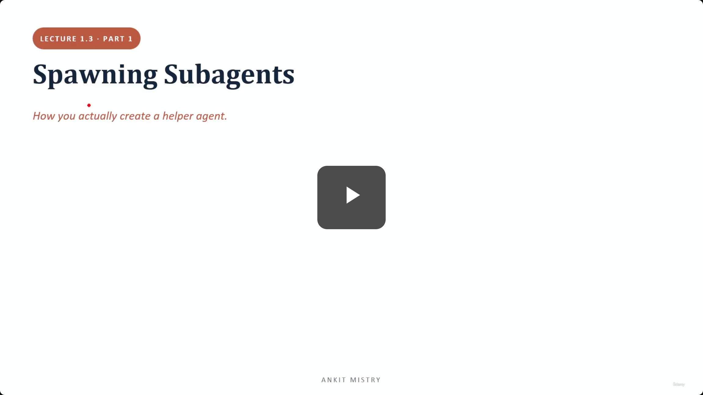
[00:00:00](https://www.udemy.com/course/claude-ai-certification/learn/lecture/57908977#overview)

## Spawning Subagents

- Goal: Learning how to actually create a helper agent

### Lecture Overview

- **1. The Task tool**: The mechanism used to spawn agents
- **2. Defining an agent**: The four specific requirements for an agent definition
- **3. Scoping tools & spawning in parallel**

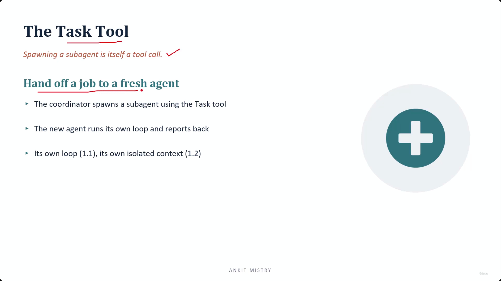
[00:01:08](https://www.udemy.com/course/claude-ai-certification/learn/lecture/57908977#overview)

### The Task Tool

- Spawning a sub-agent is itself a tool call
    - This means there is no new machinery to learn for the coordinator to initiate a hand-off
- **[How it works]** The coordinator uses the Task tool to hand off a job to a fresh agent
    - The new agent runs its own loop (as seen in 1.1)
    - The new agent operates within its own isolated context (as seen in 1.2)
    - The agent eventually reports back to the coordinator

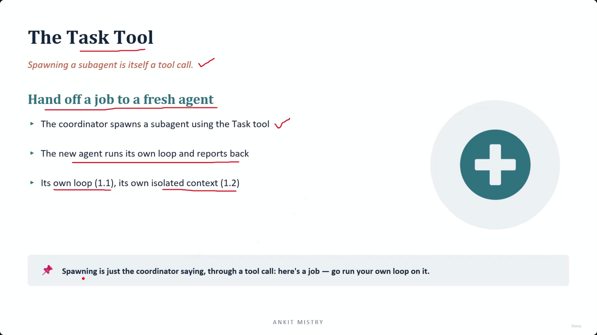
[00:01:49](https://www.udemy.com/course/claude-ai-certification/learn/lecture/57908977#overview)

### The Task Tool Mechanics

- **[Integration of concepts]** Spawning combines the two core principles of agent behavior:
    - The new agent runs its own loop (as learned in 1.1)
    - The new agent receives its own isolated workspace/context (as learned in 1.2)
- **Summary of the process**
    - Spawning is simply the coordinator saying, through a tool call: "here's a job — go run your own loop on it."

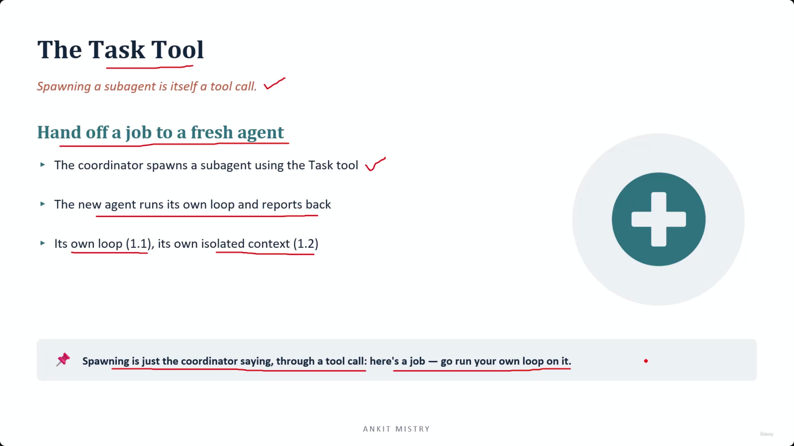
[00:01:58](https://www.udemy.com/course/claude-ai-certification/learn/lecture/57908977#overview)

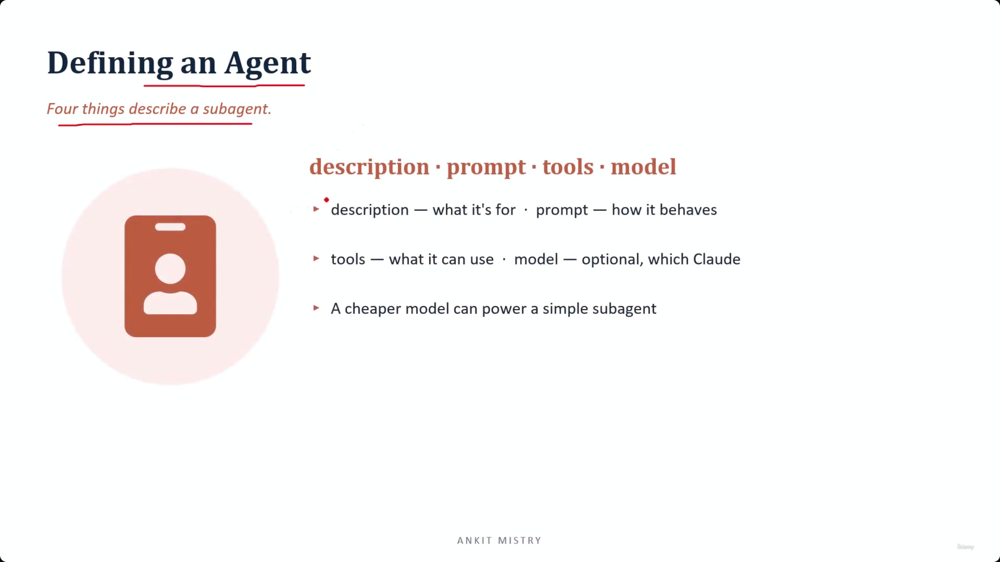
[00:02:35](https://www.udemy.com/course/claude-ai-certification/learn/lecture/57908977#overview)

### Defining an Agent

- Think of an agent definition as a "job advert" for a helper
- Once defined, the helper exists and can be called upon by the coordinator
- **[The Four Fields]** To describe a sub-agent, four components are required:
    - **description**: what the agent is for
    - **prompt**: how the agent behaves
    - **tools**: what the agent can use
    - **model**: which model powers the agent (optional, e.g., using a cheaper model for a simple subagent)

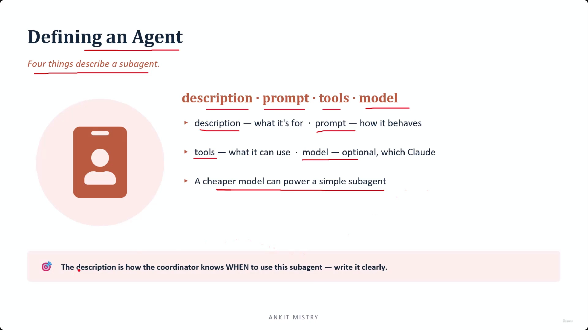
[00:03:24](https://www.udemy.com/course/claude-ai-certification/learn/lecture/57908977#overview)

### Deep Dive: Agent Definition Fields

- **[The Role of Description]** The `description` field is critical because it is how the code (and the coordinator) understands the agent's purpose.
- **[Model Optimization]** A cheaper model can power a simple sub-agent
    - If a helper's job is straightforward (e.g., tidying up text), you do not need the most powerful model
    - High-horsepower models should be reserved for agents performing genuinely hard analysis

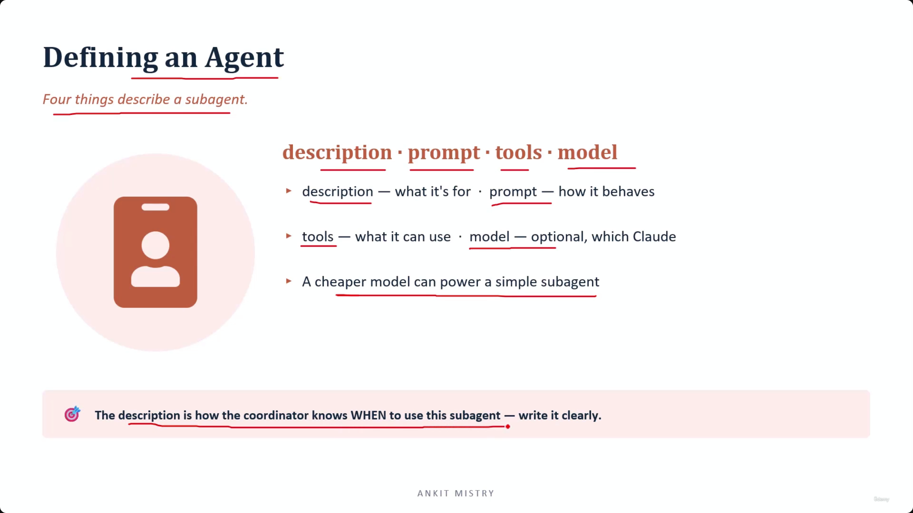
[00:03:29](https://www.udemy.com/course/claude-ai-certification/learn/lecture/57908977#overview)

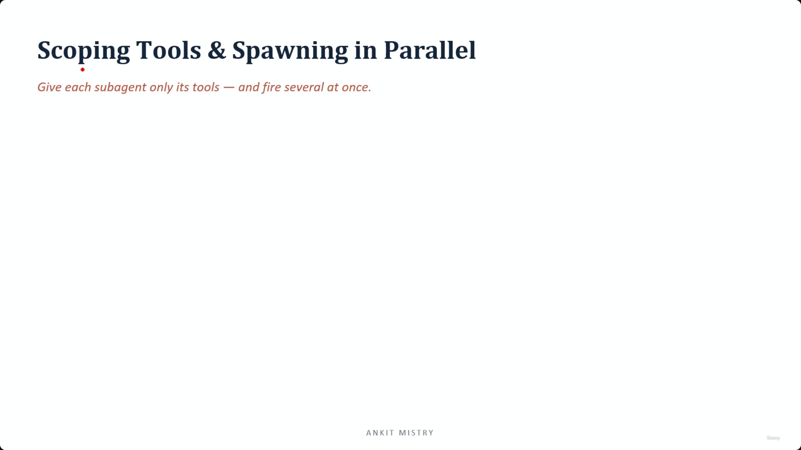
[00:04:02](https://www.udemy.com/course/claude-ai-certification/learn/lecture/57908977#overview)

### Refining Agent Definitions

- **[The Role of Description]** The `description` field is how the coordinator knows **WHEN** to use a specific sub-agent
    - Because routing is the coordinator's first job, it reads these descriptions to decide which agent gets which piece of work
    - **[Analogy]** Think of the relationship between the description and the prompt as a job posting:
        - **Description** = The job title (how the agent gets chosen)
        - **Prompt** = The job instructions (how the agent performs once chosen)

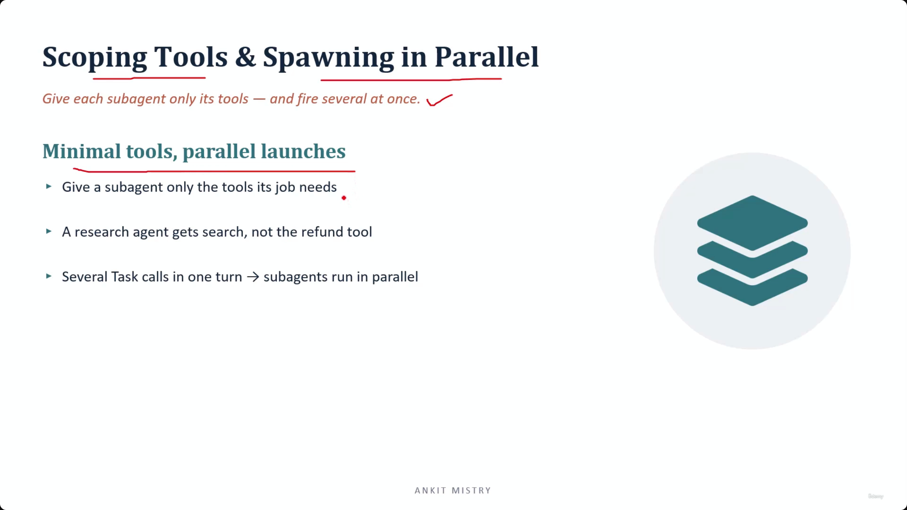
[00:04:27](https://www.udemy.com/course/claude-ai-certification/learn/lecture/57908977#overview)

## Scoping Tools & Spawning in Parallel

- **[Core Principle]** Give each sub-agent only its tools — and fire several at once.

### Minimal Tools

- **[Safety & Focus]** Provide a sub-agent only with the specific tools its job requires
    - This limits what the agent can touch, enhancing security
    - **Example**: A research agent should be given a `search` tool, but not a `refund` tool

### Parallel Launches

- **[Efficiency]** Multiple `Task` calls within a single turn allow sub-agents to run in parallel
    - This prevents the coordinator from having to wait for one sub-agent to finish before starting the next

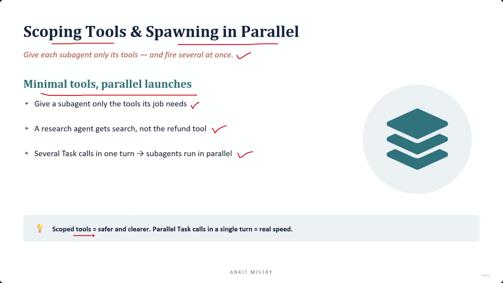
[00:05:07](https://www.udemy.com/course/claude-ai-certification/learn/lecture/57908977#overview)

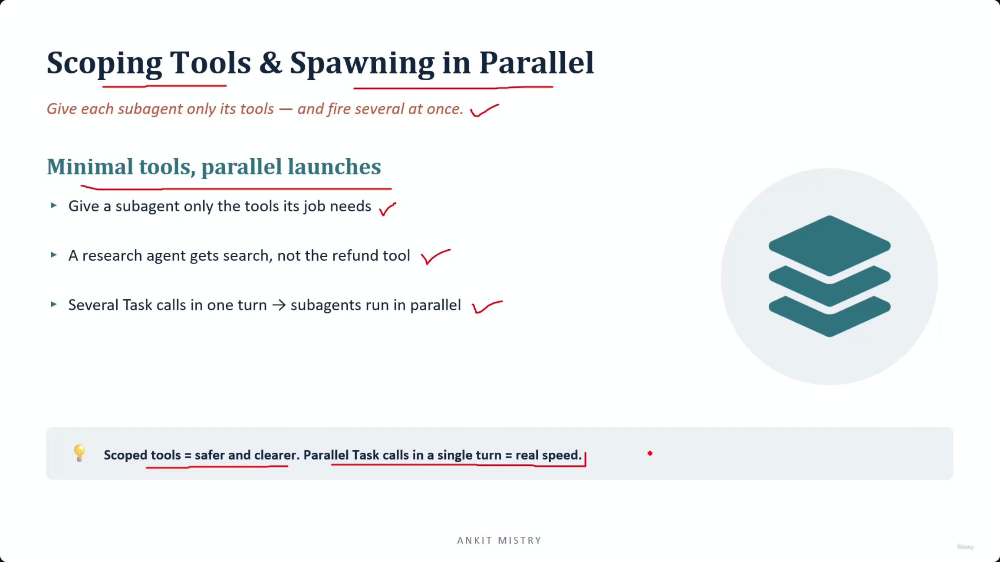
[00:05:37](https://www.udemy.com/course/claude-ai-certification/learn/lecture/57908977#overview)

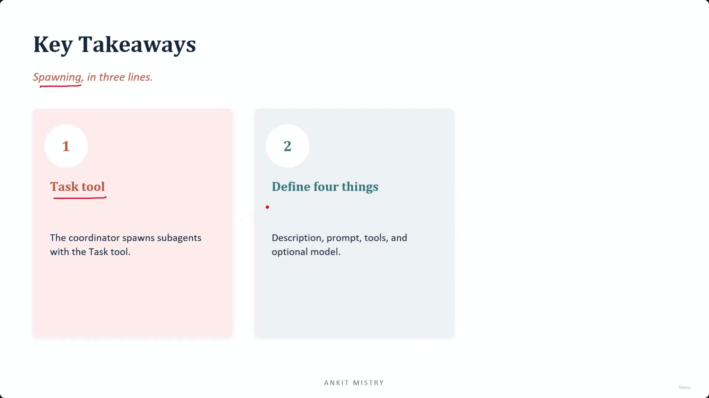
[00:06:10](https://www.udemy.com/course/claude-ai-certification/learn/lecture/57908977#overview)

## Key Takeaways

### Spawning, in three lines

1. **Task tool**: The coordinator spawns sub-agents using the `Task` tool.

    - Spawning is not specialized machinery; it is simply one more tool call.
    - Instead of fetching a single fact, this tool call hands over an entire job.

2. **Define four things**: To define an agent, you must specify:

    - **description**: The field used for routing
    - **prompt**
    - **tools**
    - **model** (optional)

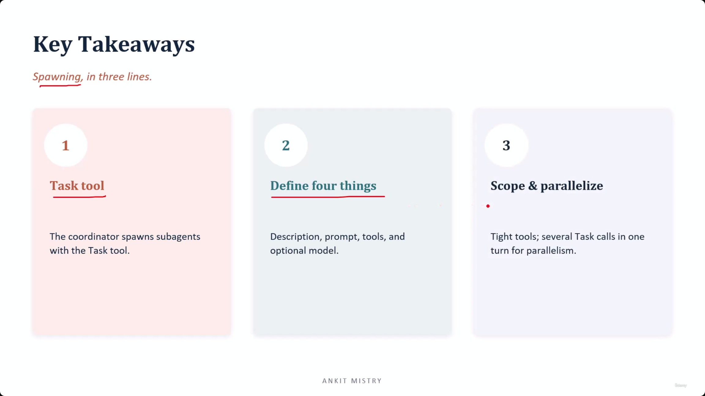
[00:06:32](https://www.udemy.com/course/claude-ai-certification/learn/lecture/57908977#overview)

---

## Simple Explanation (with Claude Examples)

**The core idea, in one line**: Spawning a helper agent isn't special magic — it's just one more tool call that hands over an entire job instead of a single fact.

**The Task tool — no new machinery needed**

The coordinator uses a tool call (the `Task` tool) to say "here's a job, go run your own loop on it." The new subagent then runs its own full Perceive→Reason→Act→Observe cycle, in its own isolated context, and reports back when done.

*Claude Code example*: This is exactly the `Agent` tool available to me in this session. When I call it with `subagent_type: "Explore"` and a task description, I'm doing precisely this — handing off a job to a fresh instance that runs its own loop, rather than me trying to do the digging myself inline.

**Defining an agent — think "job advert"**

Four fields describe a subagent:
- **description** — what it's for (used for *routing* — deciding *when* to use it)
- **prompt** — how it should behave (the actual job instructions)
- **tools** — what it's allowed to use
- **model** — optional; a cheaper model for a simple job

*Everyday analogy*: `description` is the job title on a posting (how you pick the right person for the role); `prompt` is the job instructions (how they actually do the work once hired).

*Claude Code example*: In this session's system prompt, `Explore` is described as "Fast read-only search agent for locating code... Do NOT use it for code review." That description is exactly how I decide whether to reach for `Explore` versus a different agent type — it's routing information, not instructions for how it behaves once running.

**Minimal tools — give a subagent only what its job needs**

A research subagent should get a search tool, not a refund tool. This limits the blast radius of what the subagent can touch, purely for safety and focus.

*Claude Code example*: The `Explore` agent in this session is deliberately restricted — it has read-only tools (Read, Grep, Glob) and explicitly cannot use `Edit` or `Write`. That's the "minimal tools" principle in action: its job is finding things, not changing them, so it isn't given the power to change anything.

**Parallel launches — fire several at once**

Multiple `Task` calls in a single turn let subagents run in parallel, so the coordinator doesn't have to wait for one to finish before starting the next.

*Claude Code example*: If you asked me to research two unrelated topics, I could spawn two `Agent` calls in the same response — both run at once, and I get both results back without waiting for one to finish serially first.

**Recap in 3 lines**

1. **Spawning = one more tool call** — no special new mechanism, just a `Task` call that hands off a whole job.
2. **Four fields define an agent** — description (for routing), prompt (for behavior), tools, and an optional model.
3. **Minimal tools + parallel launches** — restrict each subagent to what it needs, and fire independent ones simultaneously for speed.