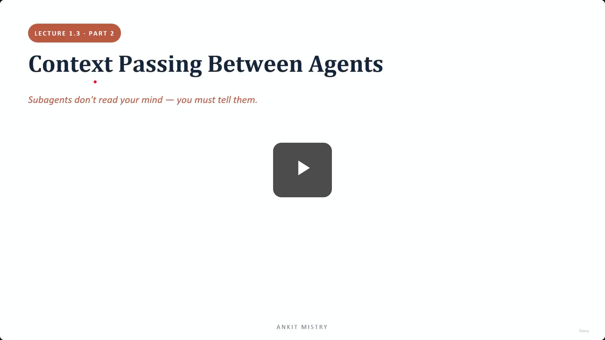
[00:00:00](https://www.udemy.com/course/claude-ai-certification/learn/lecture/57908983#overview)

## Context Passing Between Agents

- Subagents don't read your mind — you must tell them.
- **[The Problem]** No automatic inheritance
    - A newly created subagent has no knowledge of the previous conversation or actions taken by the main agent

### Lecture Overview

1. No automatic inheritance
2. Inject context explicitly
3. Include complete findings
4. Goals, not steps

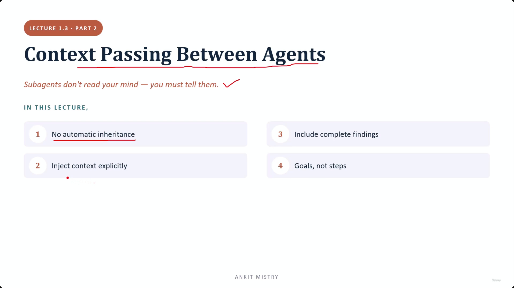
[00:00:42](https://www.udemy.com/course/claude-ai-certification/learn/lecture/57908983#overview)

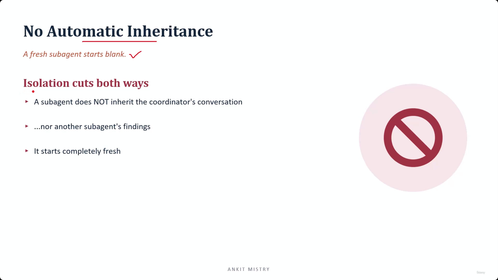
[00:01:14](https://www.udemy.com/course/claude-ai-certification/learn/lecture/57908983#overview)

### The Mechanics of Isolation

- **[The Rule]** Isolation cuts both ways
    - A subagent does not inherit the coordinator's conversation
    - A subagent does not inherit another subagent's findings

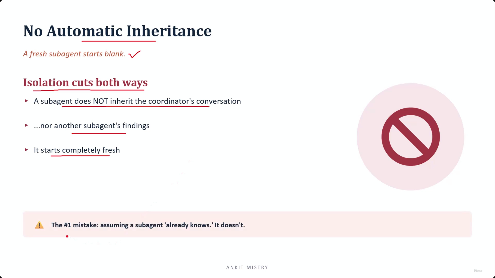
[00:01:53](https://www.udemy.com/course/claude-ai-certification/learn/lecture/57908983#overview)

### The Double-Edged Sword of Isolation

- **[The Trade-off]** Isolation provides a clean workspace for better work, but "clean" also means "empty"
    - Nothing carries across on its own by design
- **The #1 Mistake**
    - Assuming a subagent "already knows" what the coordinator has done
    - For example, assuming a writing subagent is aware of the research conducted by the coordinator

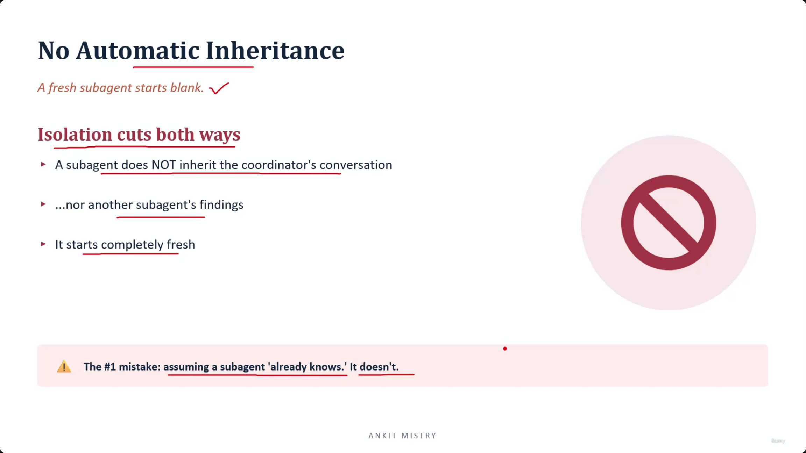
[00:02:13](https://www.udemy.com/course/claude-ai-certification/learn/lecture/57908983#overview)

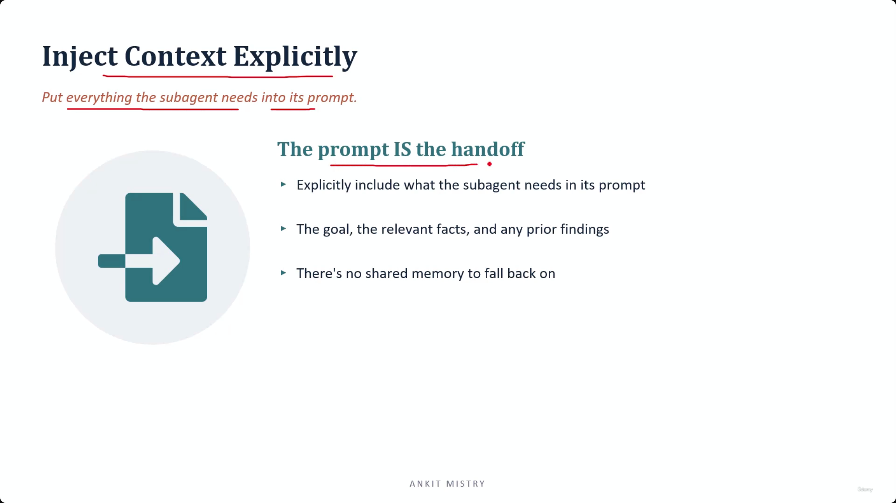
[00:02:53](https://www.udemy.com/course/claude-ai-certification/learn/lecture/57908983#overview)

### The Silent Failure of Missing Context

- **[The Risk]** Missing context is "sneaky"
    - Subagents won't throw an error or cause a system crash when they lack information
    - Instead, they will quietly produce generic content or invent (hallucinate) details to fill the gaps
    - The failure is often only detectable when the output appears thin or lacks substance

### Inject Context Explicitly

- **[The Rule]** The prompt IS the handoff
- Put everything the subagent needs directly into its prompt
    - Include the specific goal
    - Include relevant facts
    - Include any prior findings
- **[Why?]** There is no shared memory to fall back on; the subagent starts completely blank.

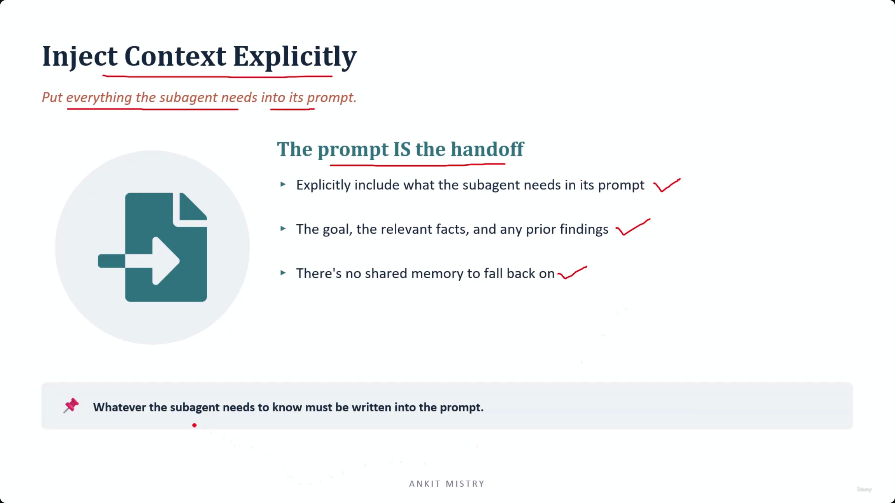
[00:03:23](https://www.udemy.com/course/claude-ai-certification/learn/lecture/57908983#overview)

### Prompting for Success

- **[The Rule]** Whatever the subagent needs to know must be written into the prompt
- **What to include in the prompt:**
    - The specific goal
    - Relevant facts
    - Any prior findings from previous helpers
- **[The Reality]** There is no shared memory to fall back on
    - There is no hidden notice board where agents quietly compare notes behind the scenes
    - If a fact is not in the prompt, the subagent does not have access to it

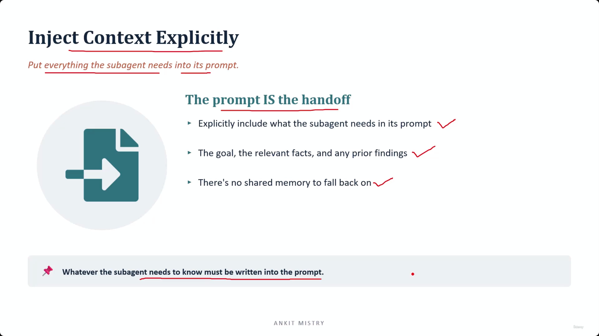
[00:03:44](https://www.udemy.com/course/claude-ai-certification/learn/lecture/57908983#overview)

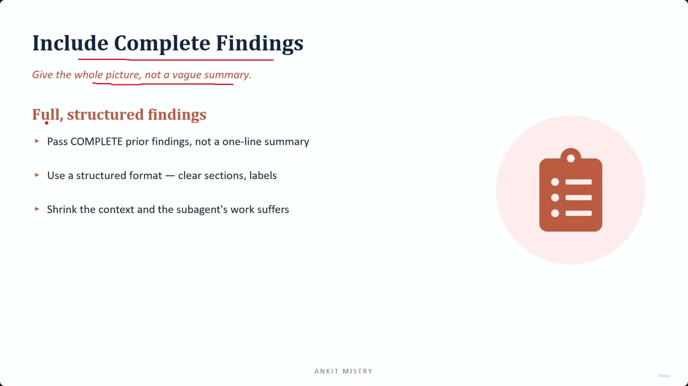
[00:04:25](https://www.udemy.com/course/claude-ai-certification/learn/lecture/57908983#overview)

### Prompt Completeness Test

- **[The Heuristic]** To ensure a prompt is sufficient, read it back to yourself and ask:
    - "If I knew only this and nothing else at all, could I actually do the job?"
    - If the answer is no, critical context is still missing

### Include Complete Findings

- **[The Rule]** Give the whole picture, not a vague summary
- **[The Goal]** Provide full, structured findings to the subagent
    - Pass COMPLETE prior findings instead of a one-line summary
    - Use a structured format with clear sections and labels
- **[The Risk]** Shrinking the context causes the subagent's work to suffer

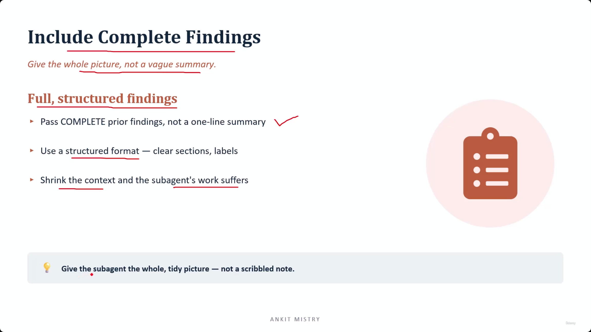
[00:05:02](https://www.udemy.com/course/claude-ai-certification/learn/lecture/57908983#overview)

### Structuring for Clarity

- **[The Importance of Structure]** A wall of unlabeled text is genuinely hard for an agent to use
    - Clear sections tell the subagent exactly what each part of the data is for
    - Without labels, the agent may struggle to parse the relevance of the information

### The Handoff Analogy

- Think of passing findings to a subagent like handing work over to a colleague before you go on holiday
    - You wouldn't leave them a scribbled, incomplete note
    - You would provide a tidy, complete picture so they can function effectively in your absence

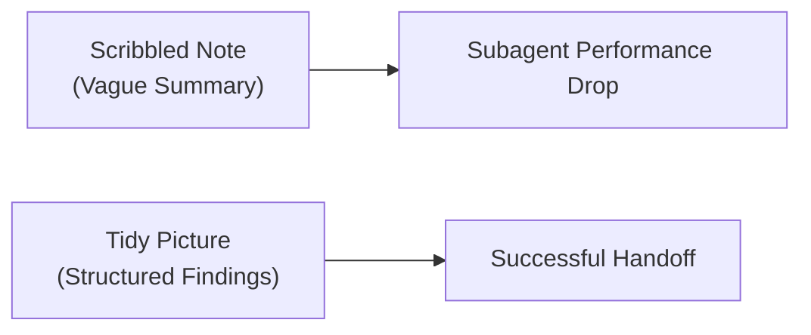

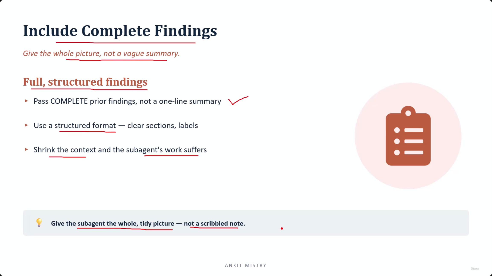
[00:05:13](https://www.udemy.com/course/claude-ai-certification/learn/lecture/57908983#overview)

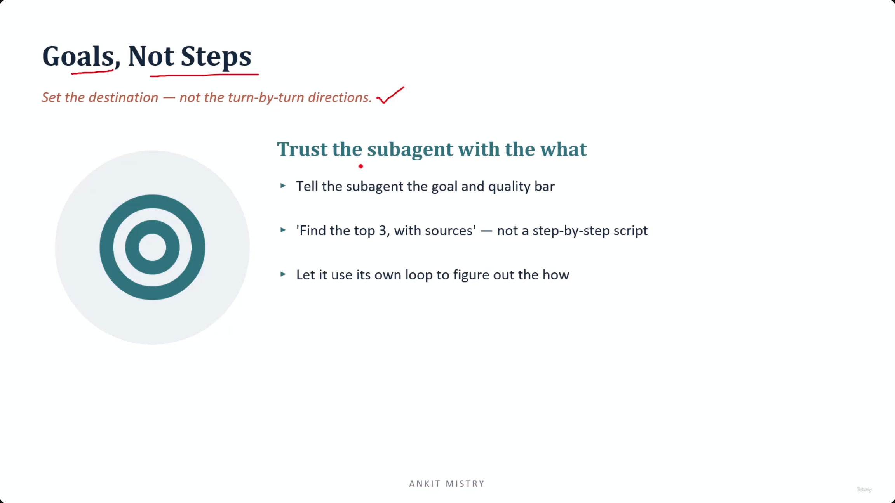
[00:05:47](https://www.udemy.com/course/claude-ai-certification/learn/lecture/57908983#overview)

### Goals, Not Steps

- **[The Rule]** Set the destination — not the turn-by-turn directions
- **Trust the subagent with the \*what**\*
    - Tell the subagent the goal and the quality bar
    - Avoid providing a step-by-step script
        - Instead of: "Find the top 3, with sources"
        - Focus on the outcome and let the subagent use its own loop to figure out the *how*

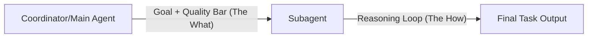

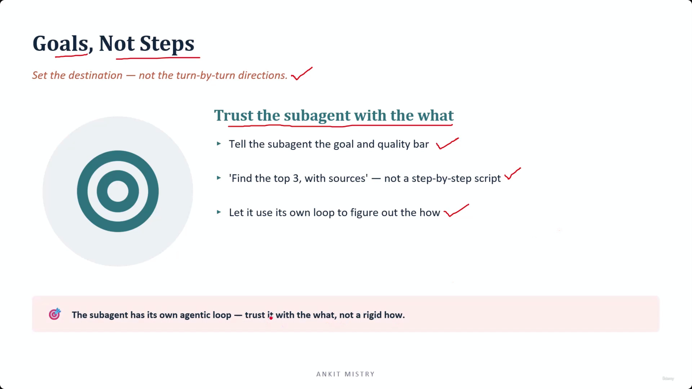
[00:06:21](https://www.udemy.com/course/claude-ai-certification/learn/lecture/57908983#overview)

### The Agentic Loop Advantage

- **[The Core Reason]** Subagents are not just scripts; they are autonomous entities
- **[Capabilities]** Like any other agent, a subagent can:
    - **Perceive** the provided context
    - **Reason** through the requirements
    - **Act** upon the information
    - **Observe** the results of its own actions
- **[The Risk of Over-Scripting]** Providing a rigid, step-by-step script prevents the subagent from utilizing this internal loop to handle nuances or unexpected turns in the task.

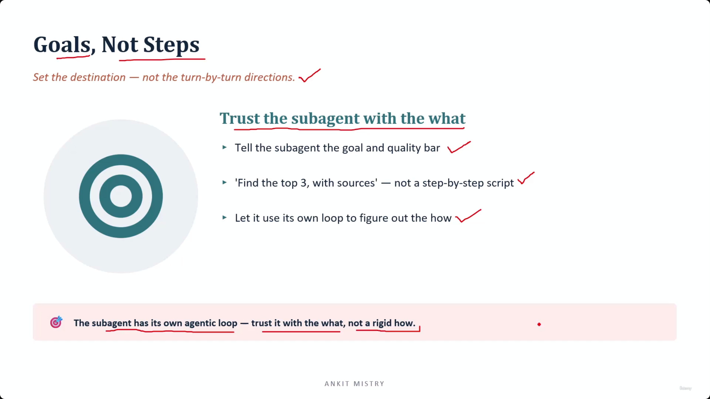
[00:06:44](https://www.udemy.com/course/claude-ai-certification/learn/lecture/57908983#overview)

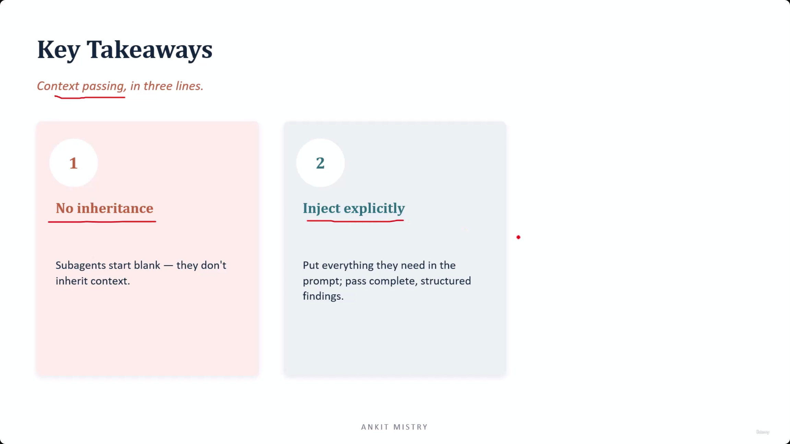
[00:07:21](https://www.udemy.com/course/claude-ai-certification/learn/lecture/57908983#overview)

### Key Takeaways: Context Passing

- **[1. No inheritance]** Subagents start blank and do not inherit context from the main agent
    - Because isolation cuts both ways, the clean workspace you want arrives completely empty
    - Never assume a helper already knows something
- **[2. Inject explicitly]** Put everything the subagent needs directly into the prompt
    - This includes passing complete, structured findings to ensure the agent has all necessary data

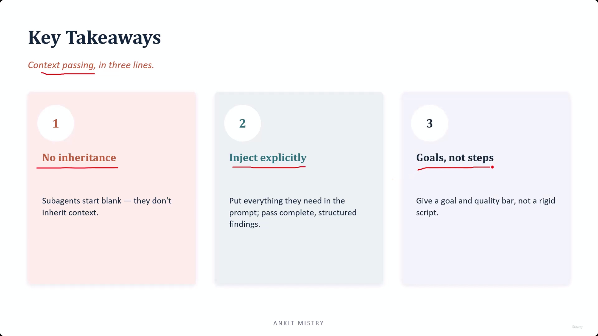
[00:07:39](https://www.udemy.com/course/claude-ai-certification/learn/lecture/57908983#overview)