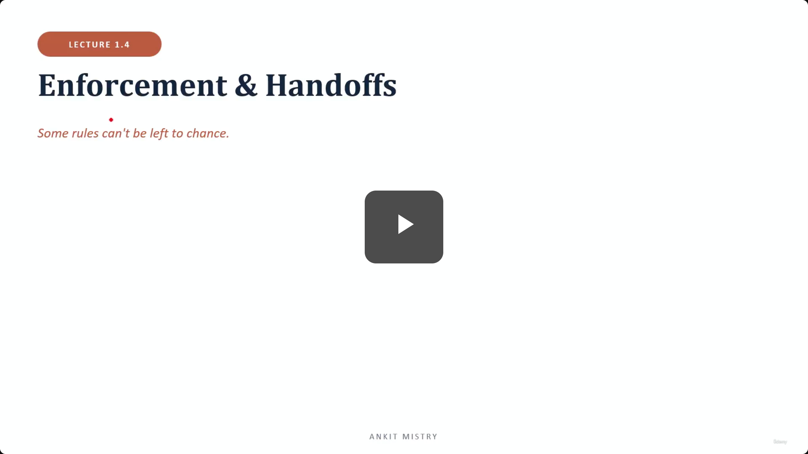
[00:00:00](https://www.udemy.com/course/claude-ai-certification/learn/lecture/57908987#overview)

## Enforcement & Handoffs

- Some rules can't be left to chance.

### In This Lecture

1. Programmatic vs. prompt
2. When you need enforcement
3. Prerequisite gates
4. Handoffs & escalation

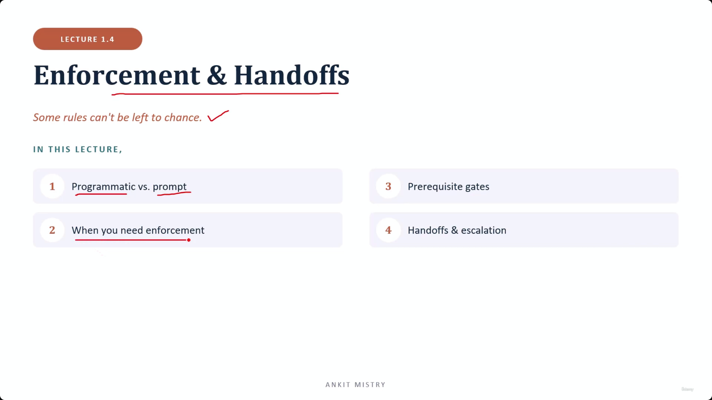
[00:00:43](https://www.udemy.com/course/claude-ai-certification/learn/lecture/57908987#overview)

### Programmatic vs. Prompt

- **[The Core Choice]** Ask nicely, or guarantee it in code
- Prompt guidance
    - You ask Claude to follow a rule
    - It is probabilistic, meaning it usually holds but is not a guarantee

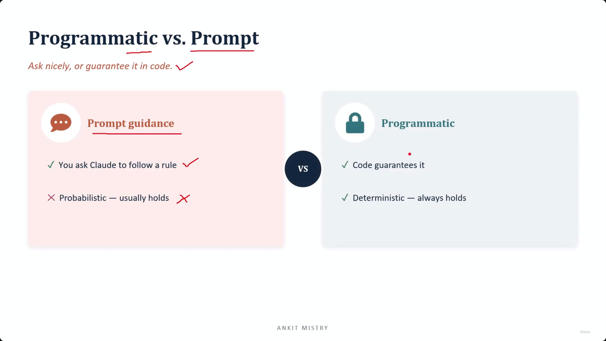
[00:01:54](https://www.udemy.com/course/claude-ai-certification/learn/lecture/57908987#overview)

### Programmatic Enforcement

- **[The Alternative]** Code guarantees it
- It is deterministic
    - This means it always holds
    - Rather than a request the model might follow, this acts as a "wall" that sits outside the model

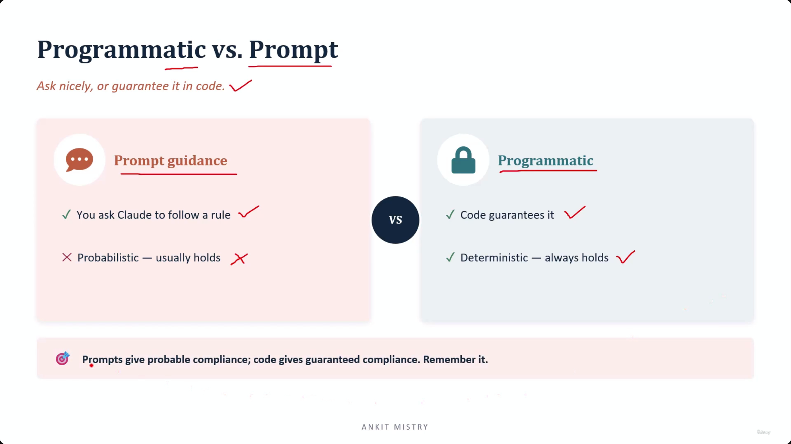
[00:02:23](https://www.udemy.com/course/claude-ai-certification/learn/lecture/57908987#overview)

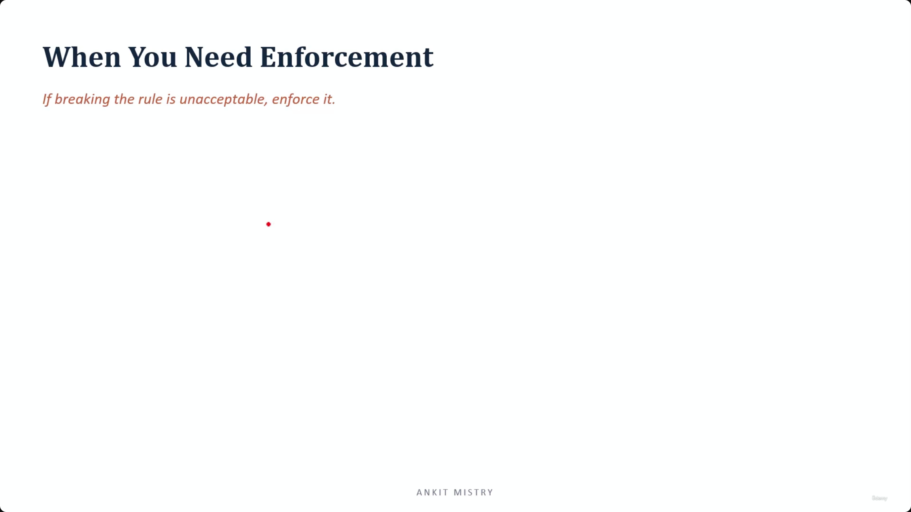
[00:02:54](https://www.udemy.com/course/claude-ai-certification/learn/lecture/57908987#overview)

### Probable vs. Guaranteed Compliance

- **[The Key Distinction]** Prompts give probable compliance; code gives guaranteed compliance
    - This is a fundamental pairing in the domain
    - If a rule must never be broken, the word "guaranteed" points you toward using code

### When You Need Enforcement

- If breaking the rule is unacceptable, enforce it

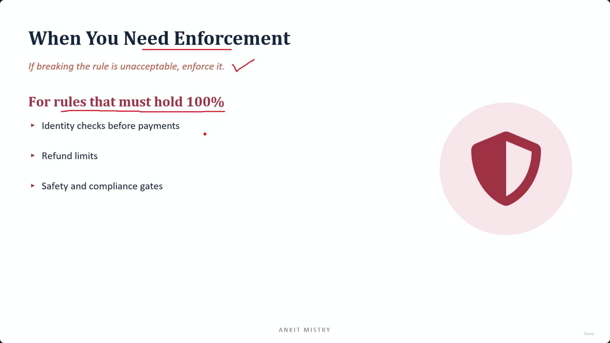
[00:03:09](https://www.udemy.com/course/claude-ai-certification/learn/lecture/57908987#overview)

### High-Stakes Enforcement Examples

- **[The Core Principle]** Enforcement is required for rules that protect against real damage, rather than stylistic preferences (like tone or wording).
- **Examples of rules that must hold 100%:**
    - **Identity checks before payments:** Preventing unauthorized financial transactions.
    - **Refund limits:** Ensuring financial boundaries are never breached.
    - **Safety and compliance gates:** Preventing physical or legal harm.

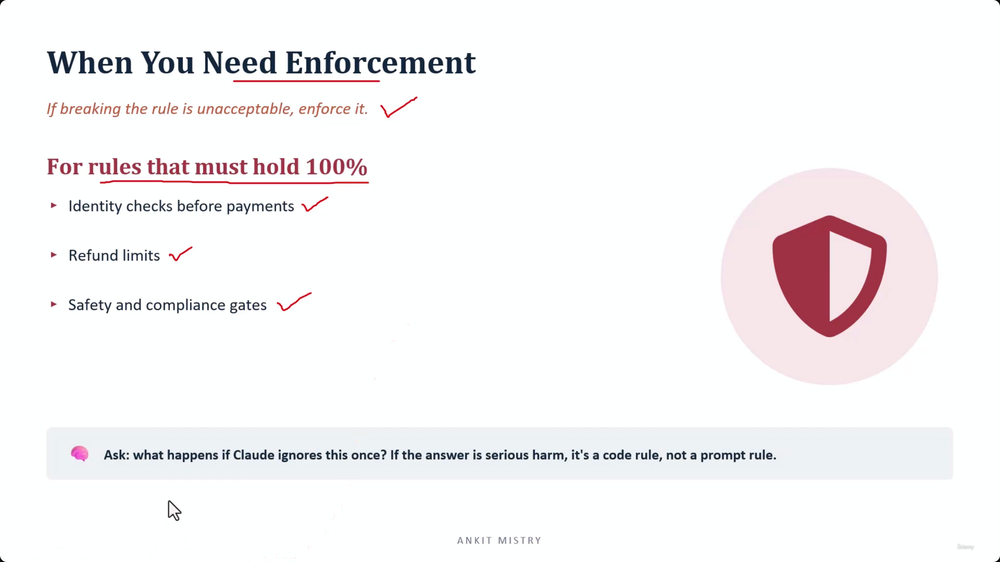
[00:03:45](https://www.udemy.com/course/claude-ai-certification/learn/lecture/57908987#overview)

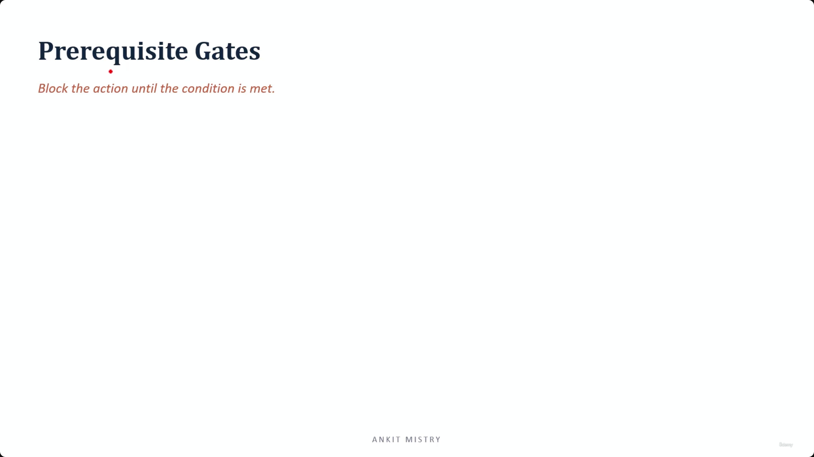
[00:04:18](https://www.udemy.com/course/claude-ai-certification/learn/lecture/57908987#overview)

### Deciding Between Prompt and Code

- **[The Litmus Test]** Ask: "What happens if Claude ignores this once?"
    - If the answer is serious harm, it must be a code rule, not a prompt rule
    - This distinguishes between "most of the time" (prompt) and "never" (code)

### Prerequisite Gates

- A mechanism to block an action until a specific condition is met

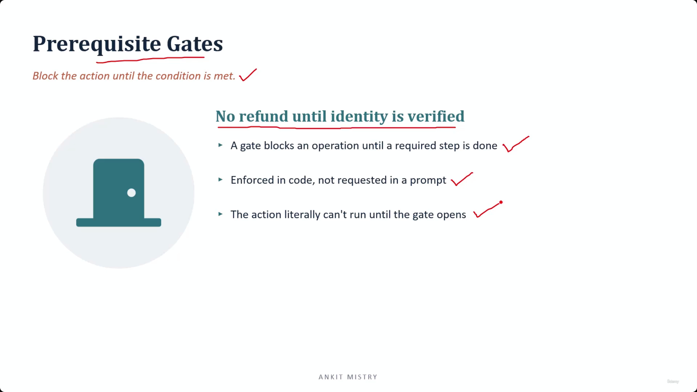
[00:04:57](https://www.udemy.com/course/claude-ai-certification/learn/lecture/57908987#overview)

### Mechanics of a Gate

- **[The Core Logic]** A gate blocks an operation until a required step is completed
- **[Implementation]** It is enforced via code rather than being requested in a prompt
    - The action literally cannot run until the gate opens
- **Example: No refund until identity is verified**
    - This acts as a "physical" barrier in the system
    - The refund simply refuses to happen while identity remains unverified

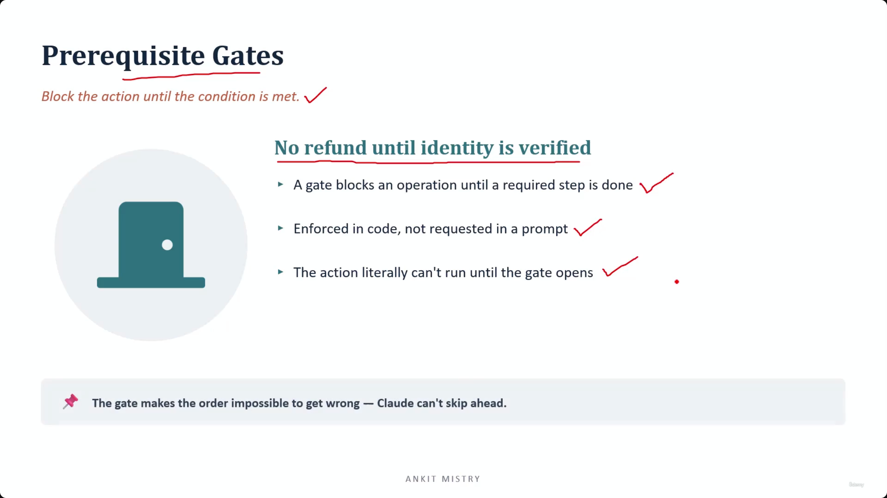
[00:05:16](https://www.udemy.com/course/claude-ai-certification/learn/lecture/57908987#overview)

### The Power of the Gate: Preventing Order Errors

- **[The Benefit]** The gate makes the order impossible to get wrong because Claude cannot skip ahead
- **Analogy: Car Park Barrier**
    - Drivers are not asked nicely to pay before leaving
    - The barrier stays down until the ticket is paid
    - The rule is simply how the place works, so no one has to remember it
- **Application to Workflows (e.g., Refund Flow)**
    - Claude does not need to remember the correct order of operations
    - Claude does not need to resist a persuasive customer
    - Even if the model tries to jump straight to a refund, the gate simply will not open

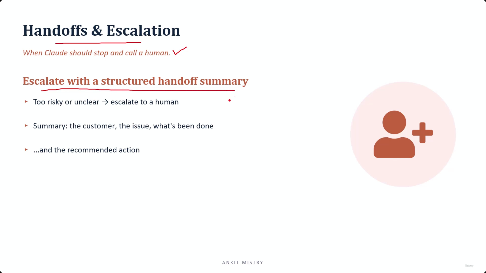
[00:06:21](https://www.udemy.com/course/claude-ai-certification/learn/lecture/57908987#overview)

## Handoffs & Escalation

### When to Escalate

- **[The Goal]** Determine when Claude should stop and call a human
- **Triggers for escalation:**
    - The situation is too risky for automation
    - The situation is unclear

### Structured Handoff Summary

- **[The Purpose]** To ensure the human agent has full context and can act immediately without repeating steps
- **The four essential components of a summary:**

    1. **The Customer:** Who is involved
    2. **The Issue:** What is wrong
    3. **What's Been Done:** The history of actions already taken
    4. **Recommended Action:** What you suggest the human should do next

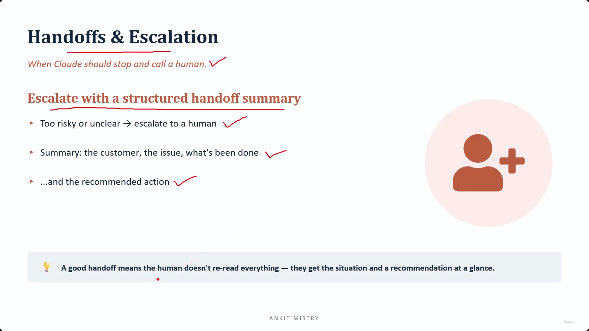
[00:06:49](https://www.udemy.com/course/claude-ai-certification/learn/lecture/57908987#overview)

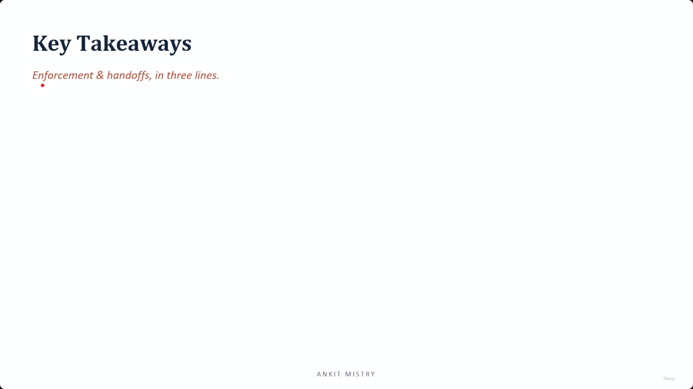
[00:07:23](https://www.udemy.com/course/claude-ai-certification/learn/lecture/57908987#overview)

### The Importance of Handoff Structure

- **[The Goal]** Enable the human to act almost immediately
- **Avoid "Lazy Escalations"**
    - Dumping a full conversation history on a human provides no value
    - The human still has to read everything and figure out the situation themselves
- **The Benefit of Structure**
    - A good handoff allows the human to understand the situation and the recommendation at a glance
    - This prevents the need for the human to re-read the entire history

[00:08:08](https://www.udemy.com/course/claude-ai-certification/learn/lecture/57908987#overview)

## Key Takeaways: Enforcement & Handoffs

### 1. Code vs. Prompt

- Prompts give probable compliance; code gives guaranteed compliance
- **[The Risk]** The gap between "usually" and "always" is where trouble lives
- If a rule genuinely cannot wait or fail, a prompt is the wrong place for it

### 2. Gate the Must-Holds

- Enforce 100% rules in code using prerequisite gates
- **[The Benefit]** Like a car park barrier, the rule is built into how the system works, so no one has to remember it

### 3. Escalate Cleanly

- Hand risky cases to a human using a structured summary

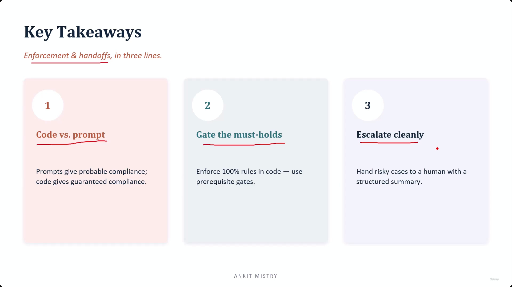
[00:08:14](https://www.udemy.com/course/claude-ai-certification/learn/lecture/57908987#overview)