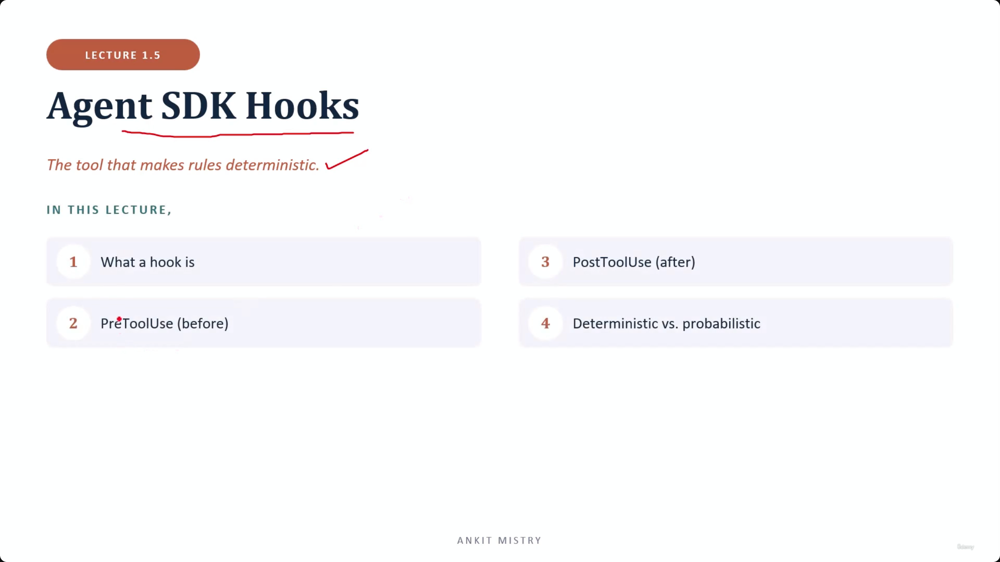
[00:00:31](https://www.udemy.com/course/claude-ai-certification/learn/lecture/57908993#overview)

## Agent SDK Hooks

- The tool that makes rules deterministic
- **[Context]** While rules can be requested in a prompt, hooks provide a way to guarantee these rules are actually enforced within the agent's code during its execution loop.

### In This Lecture

1. What a hook is
2. PreToolUse (before)
3. PostToolUse (after)
4. Deterministic vs. probabilistic

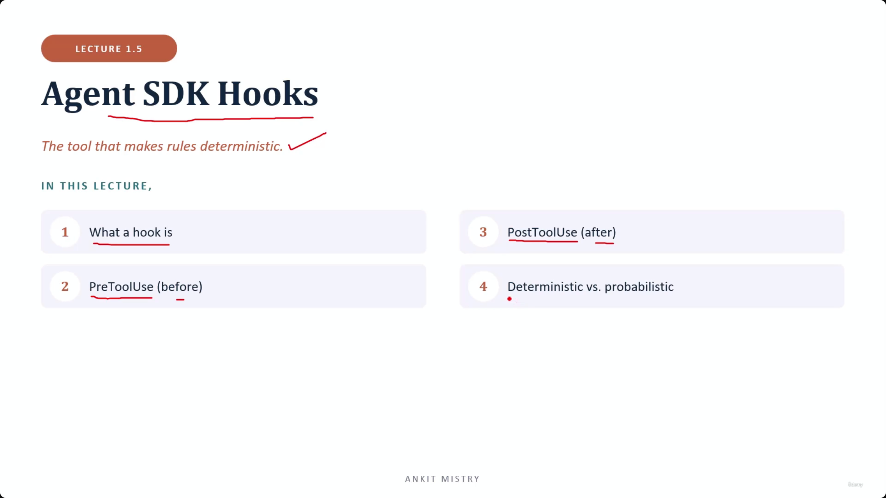
[00:00:44](https://www.udemy.com/course/claude-ai-certification/learn/lecture/57908993#overview)

### What is a Hook?

- Code that runs around a tool call
    - It is not located inside the tool itself
    - It is not located inside the LLM
    - Instead, it wraps the call on either side
- Runs automatically, every time
    - Your code runs at a set point in the execution loop
    - It executes just before or just after a tool runs
    - It can inspect, change, or block what happens

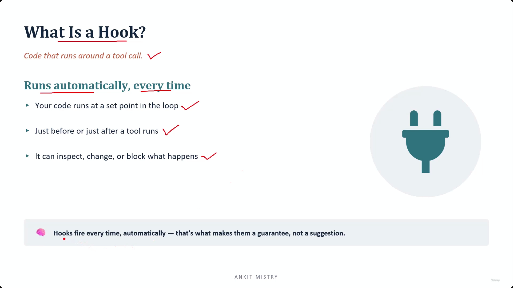
[00:01:51](https://www.udemy.com/course/claude-ai-certification/learn/lecture/57908993#overview)

### The Power of Hooks

- Hooks provide three specific capabilities:
    - **Inspect**: Look at what is about to happen
    - **Change**: Alter the event before it occurs
    - **Block**: Stop the tool call entirely
- **[Guarantee vs. Suggestion]** Because hooks fire automatically every time, they act as a guarantee rather than a suggestion
    - There is no path through the execution loop where a hook can be skipped
    - The LLM (e.g., Claude) cannot forget to trigger them or decide to go around them

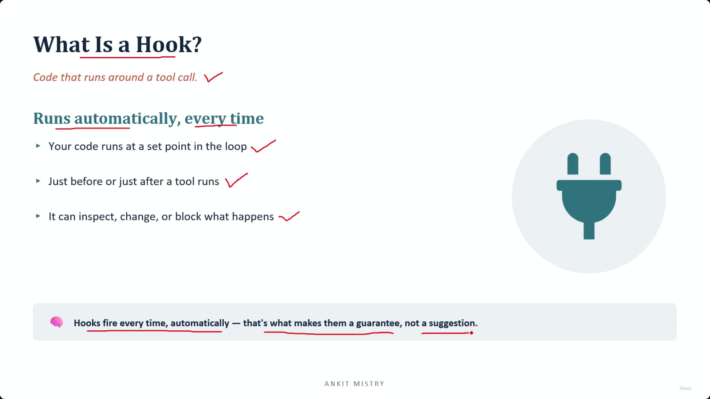
[00:02:15](https://www.udemy.com/course/claude-ai-certification/learn/lecture/57908993#overview)

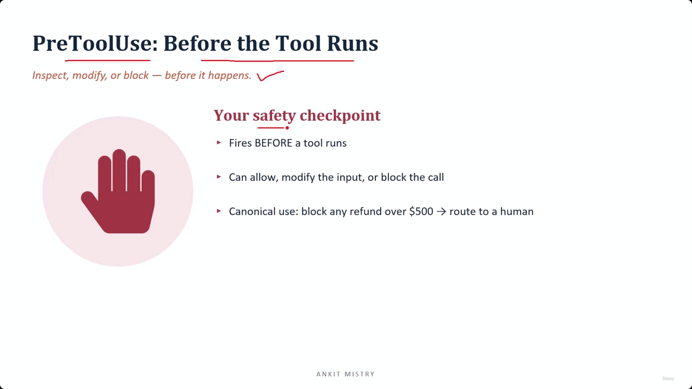
[00:02:47](https://www.udemy.com/course/claude-ai-certification/learn/lecture/57908993#overview)

### PreToolUse: Before the Tool Runs

- **[The core difference]** A hook is not something the LLM chooses to do
    - It sits in the execution loop itself
    - If the tool runs at all, the hook has already run
    - This is a stronger guarantee than just writing a rule in a prompt and hoping the LLM follows it
- **Your safety checkpoint**
    - Fires BEFORE a tool runs
    - Can allow the call, modify the input, or block the call entirely
- **Canonical use case**
    - Block any refund over 500 dollars $\rightarrow$ route to a human

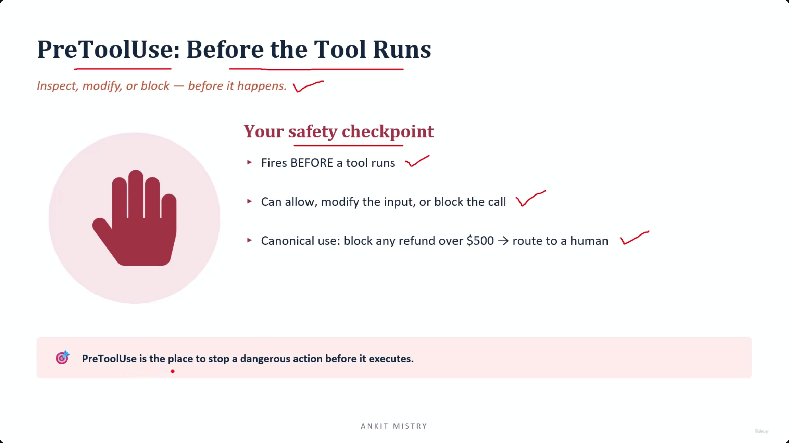
[00:03:24](https://www.udemy.com/course/claude-ai-certification/learn/lecture/57908993#overview)

### The Timing Advantage of PreToolUse

- **[Prevention vs. Cleanup]** The critical distinction of a PreToolUse hook is its timing relative to the action:
    - **Pre-execution (Prevention):** Because the hook fires before the tool runs, no state has changed yet (e.g., no money has moved). This is the last moment where stopping an action is "free."
    - **Post-execution (Cleanup):** Once a tool has executed, you are no longer preventing a problem; you are merely cleaning one up.

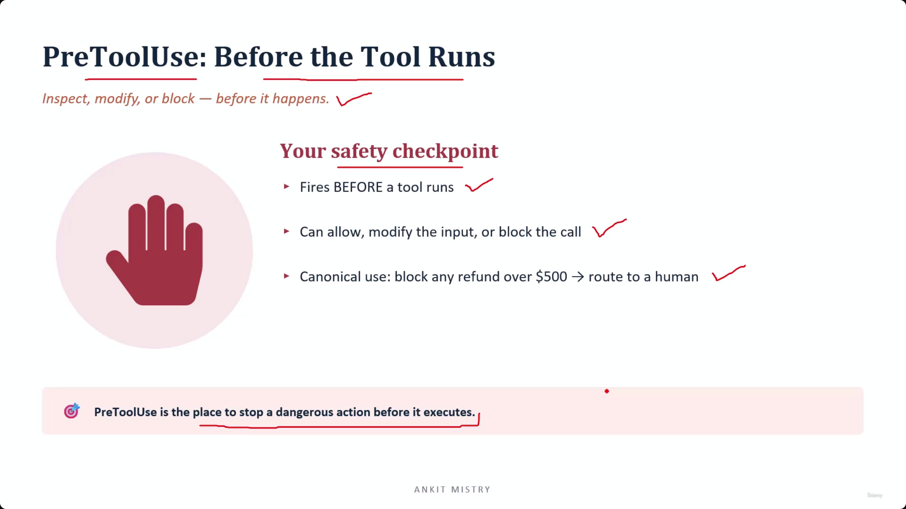
[00:03:46](https://www.udemy.com/course/claude-ai-certification/learn/lecture/57908993#overview)

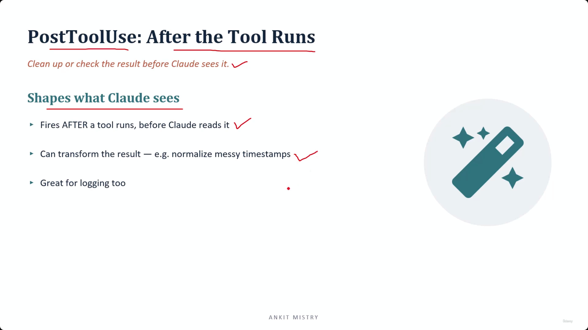
[00:04:27](https://www.udemy.com/course/claude-ai-certification/learn/lecture/57908993#overview)

### PostToolUse: After the Tool Runs

- **[The core purpose]** Shapes what Claude sees
    - It acts as a buffer between the tool's output and the LLM
    - If PreToolUse protects the world from Claude, PostToolUse protects Claude from the tool
- Fires AFTER a tool runs, but before Claude reads the result
- Capabilities:
    - **Transform the result**: e.g., normalizing messy timestamps into a consistent format
    - **Logging**: Great for recording tool outputs for audit or debugging purposes

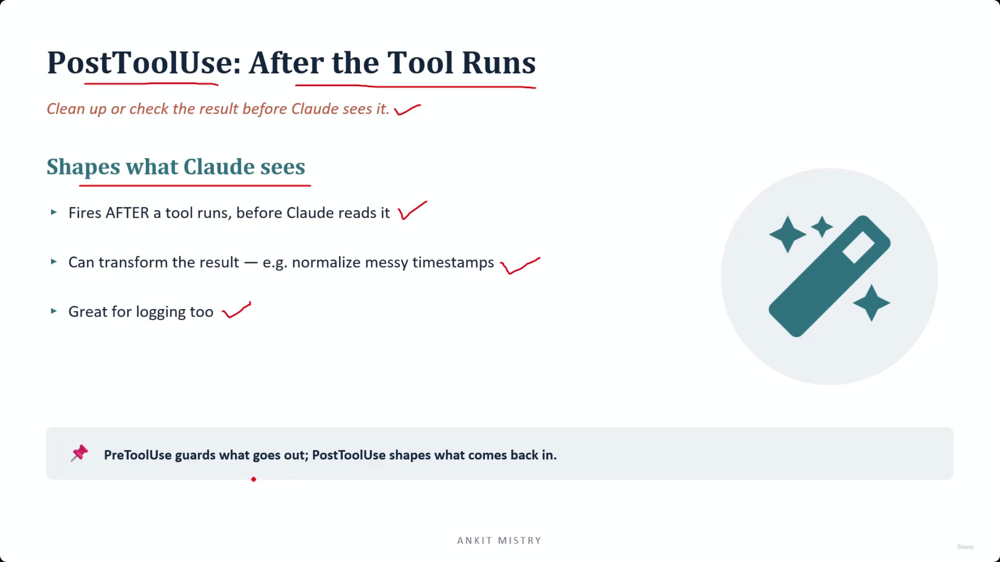
[00:04:48](https://www.udemy.com/course/claude-ai-certification/learn/lecture/57908993#overview)

### PostToolUse: Summary and Mental Model

- **[The 'Tidying' window]** The hook occupies the space where the tool has finished, but Claude has not yet looked at the output
    - This provides one chance to transform or clean the result
- **Mental Model: Guarding vs. Shaping**

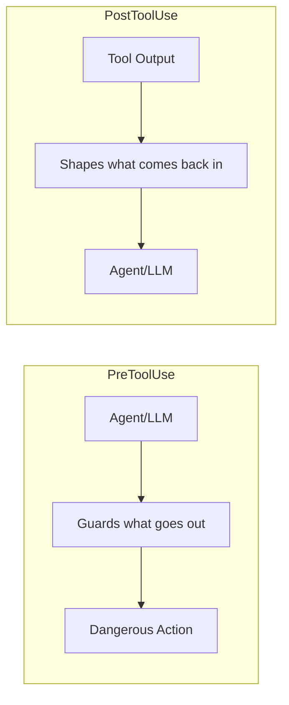

- **How to choose between them:**
        - **Use PreToolUse** if you are protecting the world from a dangerous action
        - **Use PostToolUse** if you are protecting Claude from a messy result

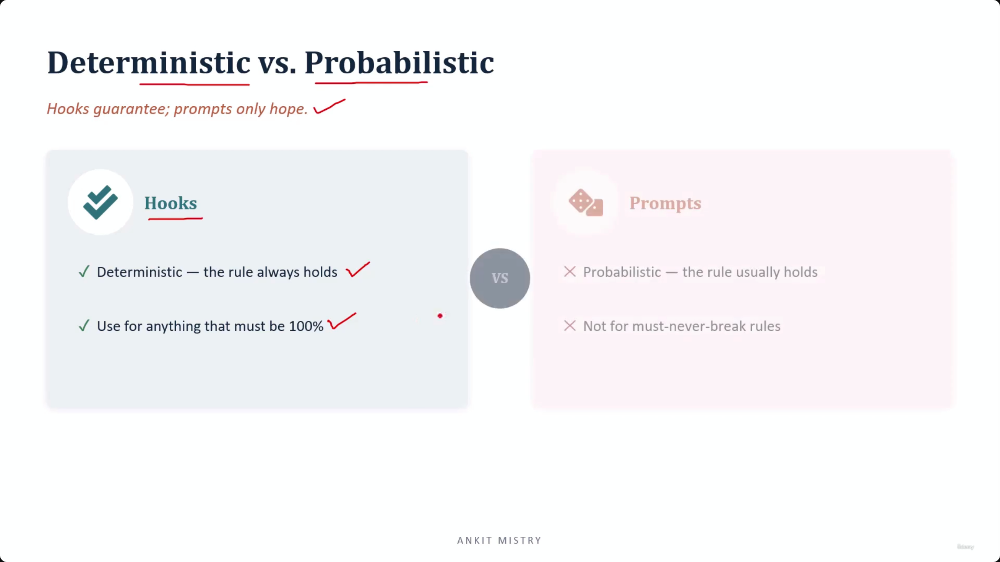
[00:05:57](https://www.udemy.com/course/claude-ai-certification/learn/lecture/57908993#overview)

## Deterministic vs. Probabilistic

- **[The Core Distinction]** Hooks provide guarantees, while prompts only provide hope
- **Hooks: Deterministic**
    - The rule always holds
    - Used for anything that must be 100% accurate
    - There is no distribution or "usually" involved; either the rule holds or the code is broken

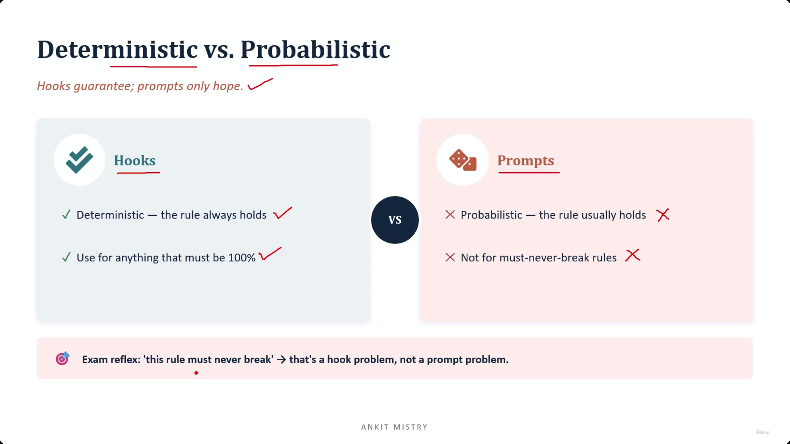
[00:06:31](https://www.udemy.com/course/claude-ai-certification/learn/lecture/57908993#overview)

### The "Must-Never-Break" Reflex

- **[Exam Tip]** Train your ear for specific phrasing to distinguish between tool implementation strategies:
    - **"This rule must never break"** $\rightarrow$ This is a **hook problem**, not a prompt problem.
- **[Strategic Application]**
    - **Hooks**: Use when absolute, deterministic compliance is required.
    - **Prompts**: Use when probabilistic guidance or "usually" behavior is acceptable.

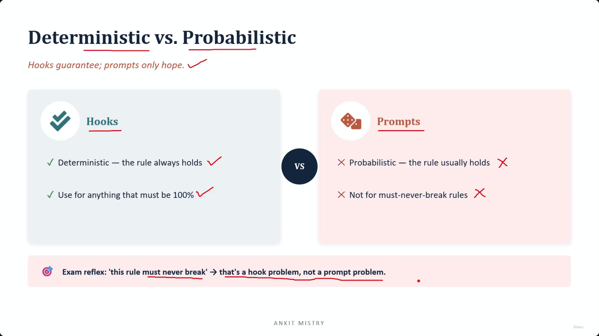
[00:06:44](https://www.udemy.com/course/claude-ai-certification/learn/lecture/57908993#overview)

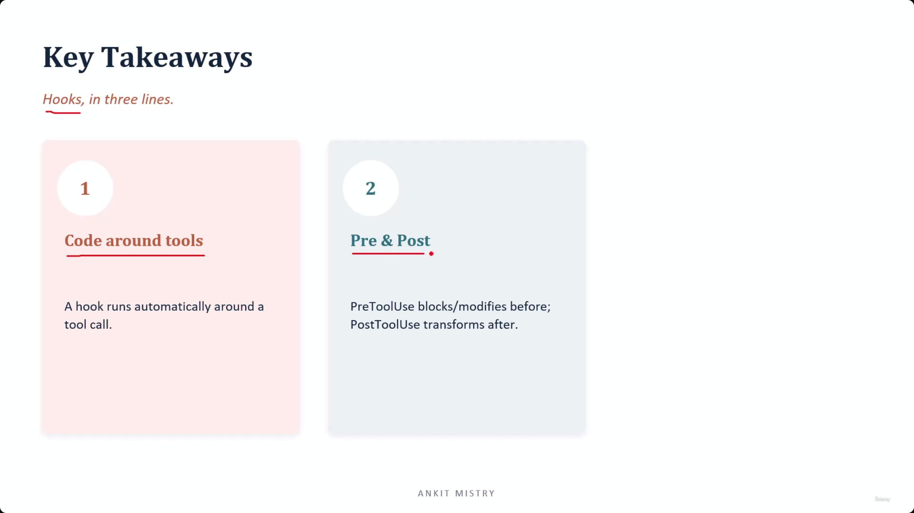
[00:07:24](https://www.udemy.com/course/claude-ai-certification/learn/lecture/57908993#overview)

### Key Takeaways

- **Hooks, in three lines:**
    - **1. Code around tools**
        - A hook runs automatically around a tool call
        - **[Why it matters]** Because it is automatic, it turns a "hope" (prompt) into a "guarantee" (code)
    - **2. Pre and Post**
        - **PreToolUse**: Blocks or modifies before the tool runs
        - **PostToolUse**: Transforms the result after the tool runs

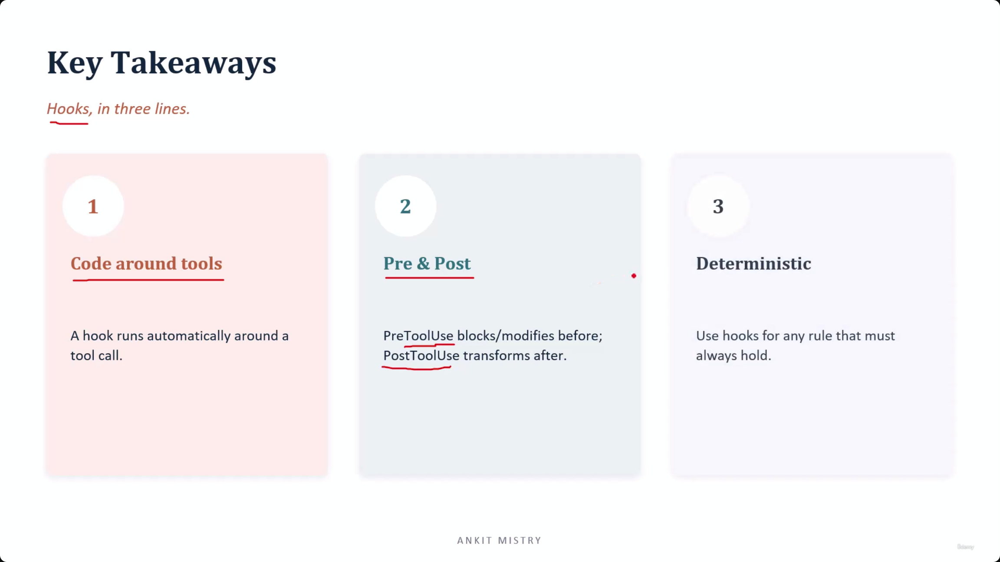
[00:07:43](https://www.udemy.com/course/claude-ai-certification/learn/lecture/57908993#overview)