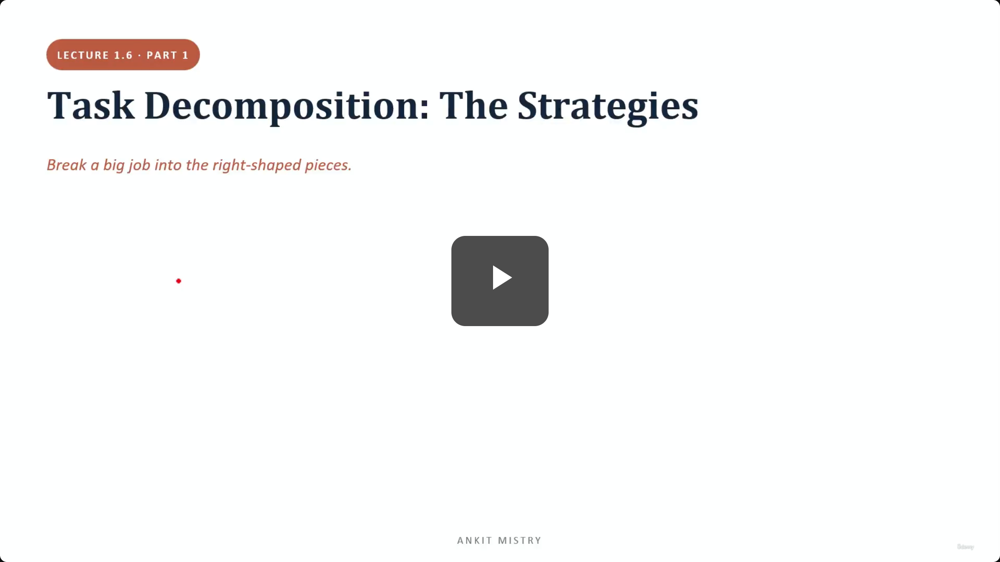
[00:00:00](https://www.udemy.com/course/claude-ai-certification/learn/lecture/57908997#overview)

## Task Decomposition: The Strategies

- The process of breaking a big job into the right-shaped pieces
- Serves as the underlying thinking scale for agentic machinery
    - Loops
    - Coordinators and subagents
    - Gates and hooks

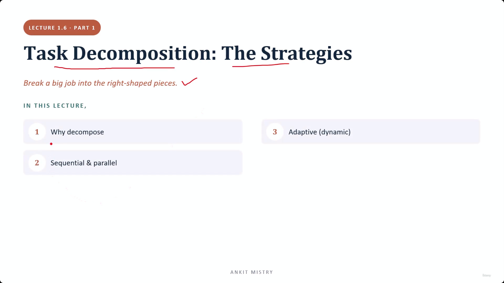
[00:00:37](https://www.udemy.com/course/claude-ai-certification/learn/lecture/57908997#overview)

[00:01:00](https://www.udemy.com/course/claude-ai-certification/learn/lecture/57908997#overview)

### Task Decomposition Strategies

- Aim: Break a big job into the right-shaped pieces
- Core components of the study:
    - Why decompose?
    - Sequential & parallel (the two basic shapes)
    - Adaptive (also called dynamic) for jobs that cannot be planned in advance

### Why Decompose?

- **[Primary Reason]** Smaller pieces are easier to get right

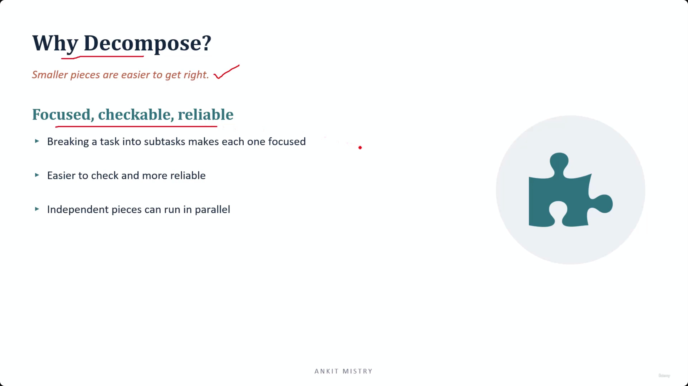
[00:01:22](https://www.udemy.com/course/claude-ai-certification/learn/lecture/57908997#overview)

### Benefits of Decomposition

- **Focused, checkable, reliable**
    - Breaking a task into subtasks makes each one focused
    - Makes tasks easier to check and more reliable
    - Independent pieces can run in parallel
- **[The importance of checkability]** Because a giant task is a "solid block," if it fails, you cannot see inside to identify the cause
    - Subtasks allow you to pinpoint exactly which part let you down

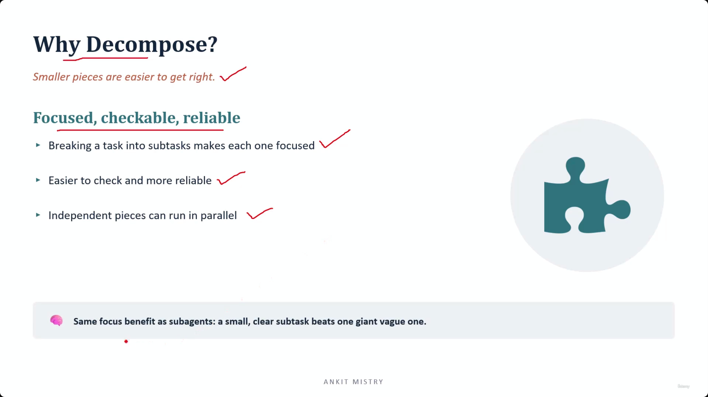
[00:02:05](https://www.udemy.com/course/claude-ai-certification/learn/lecture/57908997#overview)

### The Core Principle: Small & Clear vs. Big & Vague

- **The recurring principle of focus**
    - Small, clear sub-tasks consistently outperform one giant, vague task
    - This mirrors the logic of sub-agents: splitting work across specialists (e.g., a kitchen) ensures each part is manageable
- **Decomposition as a tool for understanding**
    - Being able to describe a job in small, discrete pieces is a sign that you genuinely understand the task

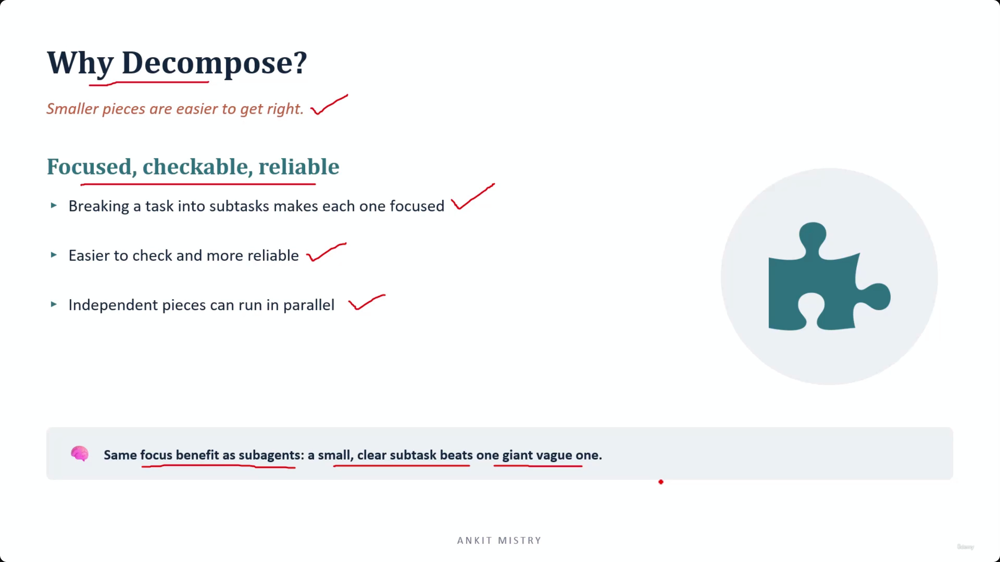
[00:02:43](https://www.udemy.com/course/claude-ai-certification/learn/lecture/57908997#overview)

## Sequential & Parallel

- Represented by two mental pictures: a **chain** or a **fan**

### Sequential

- Follows a fixed order where each task feeds the next
- **[The shape of the work]** The order is often non-negotiable because of the dependencies between steps
    - Example: `extract` $\rightarrow$ `validate` $\rightarrow$ `format`
        - You cannot validate data that hasn't been extracted yet
        - You cannot format an analysis that does not yet exist

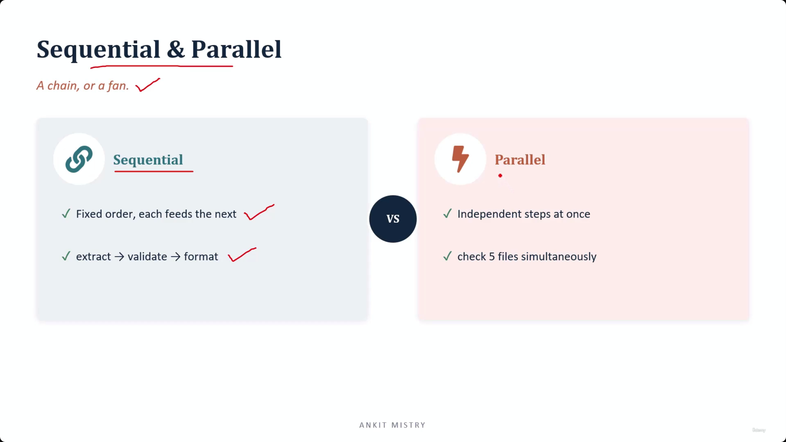
[00:03:40](https://www.udemy.com/course/claude-ai-certification/learn/lecture/57908997#overview)

### Sequential & Parallel

- **Sequential (A Chain)**
    - Fixed order where each step feeds the next
    - Driven by dependencies: you cannot perform a step until the previous one is complete
    - Example: `extract` $\rightarrow$ `validate` $\rightarrow$ `format` (you can't validate data that hasn't been extracted yet)
- **Parallel (A Fan)**
    - Independent steps performed at once
    - No dependency between steps; one step does not need the answer from another
    - Example: `check 5 files simultaneously`
    - **[The payoff]** Because they don't have to queue up, parallel execution finishes in roughly the time it takes to complete a single step

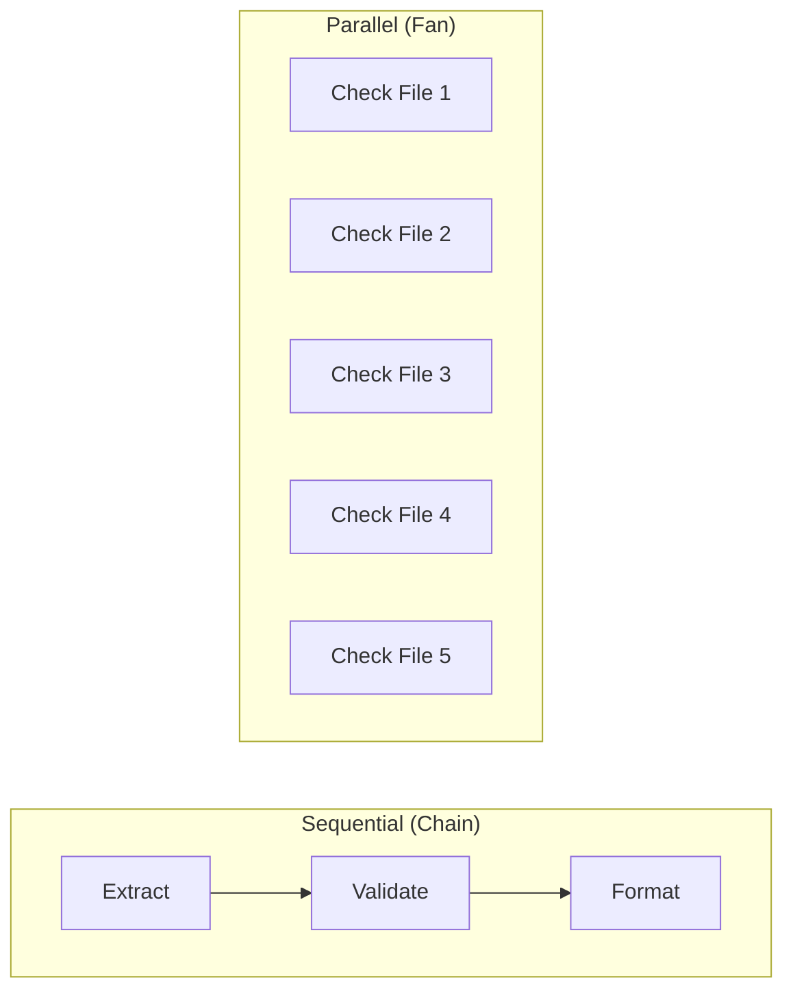

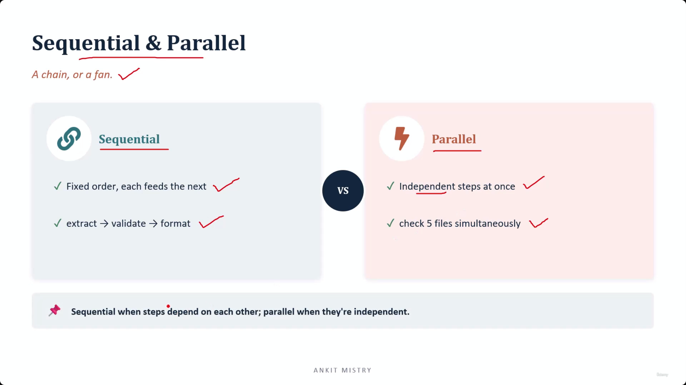
[00:04:13](https://www.udemy.com/course/claude-ai-certification/learn/lecture/57908997#overview)

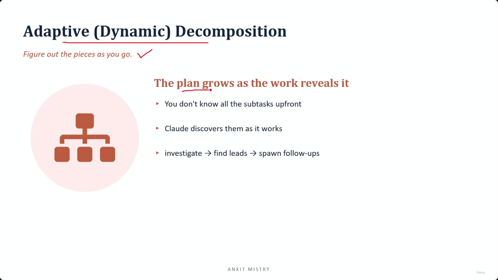
[00:04:54](https://www.udemy.com/course/claude-ai-certification/learn/lecture/57908997#overview)

### Choosing Between Sequential and Parallel

- **The decision rule**
    - Do not choose based on what sounds faster
    - Instead, look at the work and ask: "Does this piece need the answer from that piece?"
- **Sequential (The Chain)**
    - Use when steps depend on each other
- **Parallel (The Fan)**
    - Use when steps are independent

### Adaptive (Dynamic) Decomposition

- **Figure out the pieces as you go**
- **[How it works]** The plan grows as the work reveals it
    - You don't know all the subtasks upfront
    - An agent (e.g., Claude) discovers them as it works
    - Example flow: `investigate` $\rightarrow$ `find leads` $\rightarrow$ `spawn follow-ups`

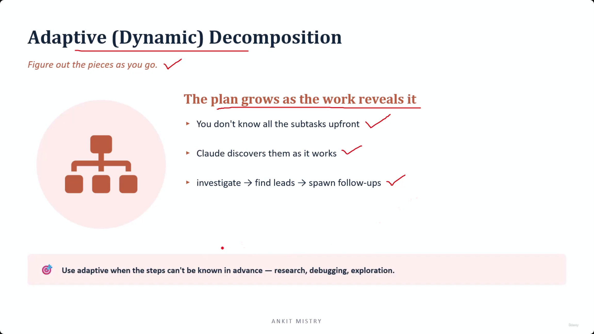
[00:05:37](https://www.udemy.com/course/claude-ai-certification/learn/lecture/57908997#overview)

### Adaptive (Dynamic) Decomposition

- **[Core Concept]** The plan grows as the work reveals it
    - Unlike sequential or parallel shapes, you do not know all subtasks upfront
    - The agent (e.g., Claude) discovers subtasks as it works
    - The second step depends on whatever the first step turns up
- **The shape of adaptive work**

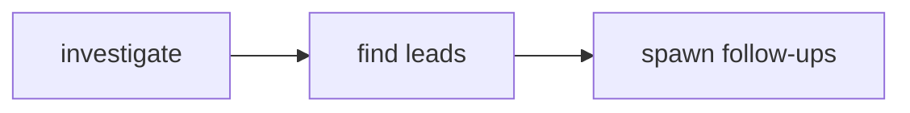

- **[When to use it]** Use adaptive decomposition when steps cannot be known in advance
        - Research
        - Debugging
        - Exploration

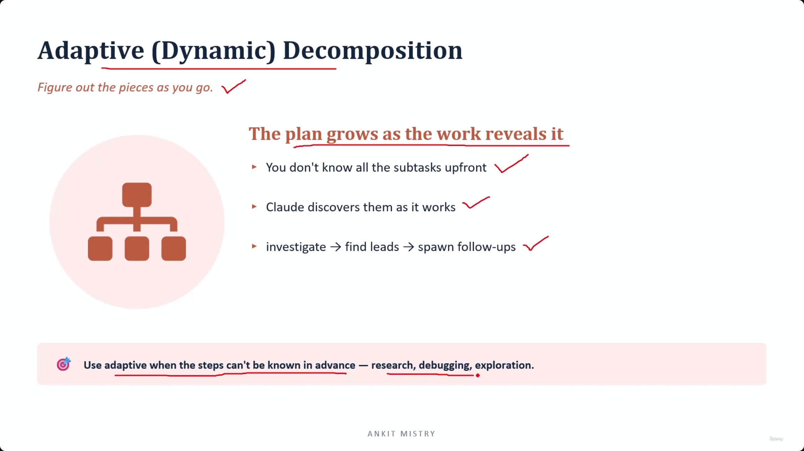
[00:05:43](https://www.udemy.com/course/claude-ai-certification/learn/lecture/57908997#overview)

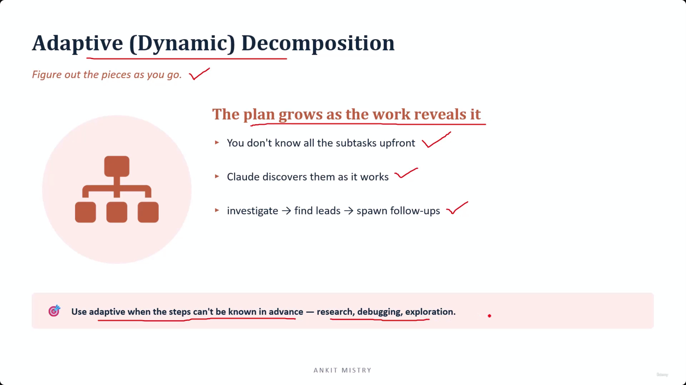
[00:05:44](https://www.udemy.com/course/claude-ai-certification/learn/lecture/57908997#overview)

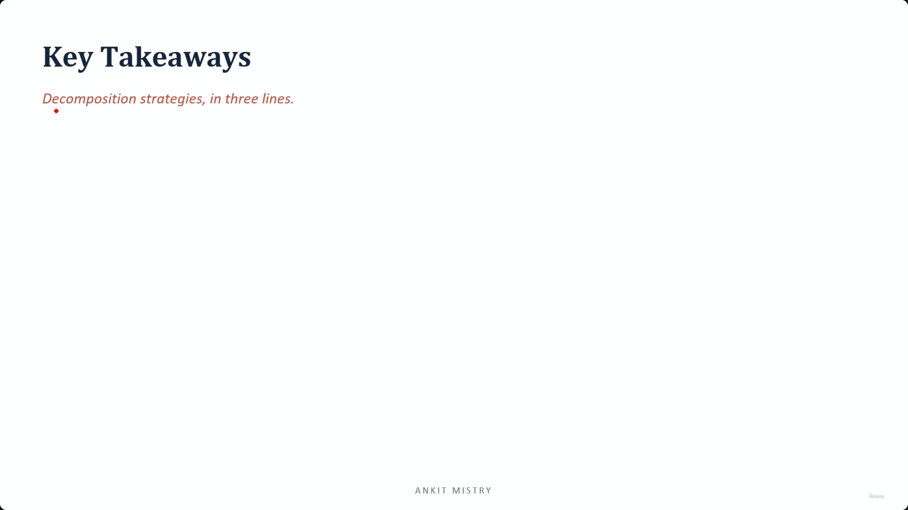
[00:06:20](https://www.udemy.com/course/claude-ai-certification/learn/lecture/57908997#overview)

### Adaptive Decomposition and the Agentic Loop

- **[The nature of adaptive work]** It is like following a trail through a woods
    - You take one step
    - You look at what is actually there
    - Only then can you decide where the next step goes
- **Connection to the Agentic Loop**
    - Adaptive decomposition perfectly fits the core agentic pattern:
    - Act $\rightarrow$ Observe $\rightarrow$ Decide what comes next

## Key Takeaways

- Decomposition strategies can be summarized in three lines (Sequential, Parallel, and Adaptive)

[00:07:02](https://www.udemy.com/course/claude-ai-certification/learn/lecture/57908997#overview)

### Summary of Decomposition Strategies

- **Why decompose?**
    - Each piece becomes focused and reliable
    - **[The benefit of granularity]** A giant task can hide its own failures, whereas five small pieces tell you exactly which one went wrong
- **Sequential or parallel?**
    - The decision is driven by dependency, not a preference for speed
    - Dependent tasks $\rightarrow$ sequential (a chain)
    - Independent tasks $\rightarrow$ parallel (a fan)
- **Adaptive**
    - Used when steps cannot be known upfront
    - The work itself reveals the plan

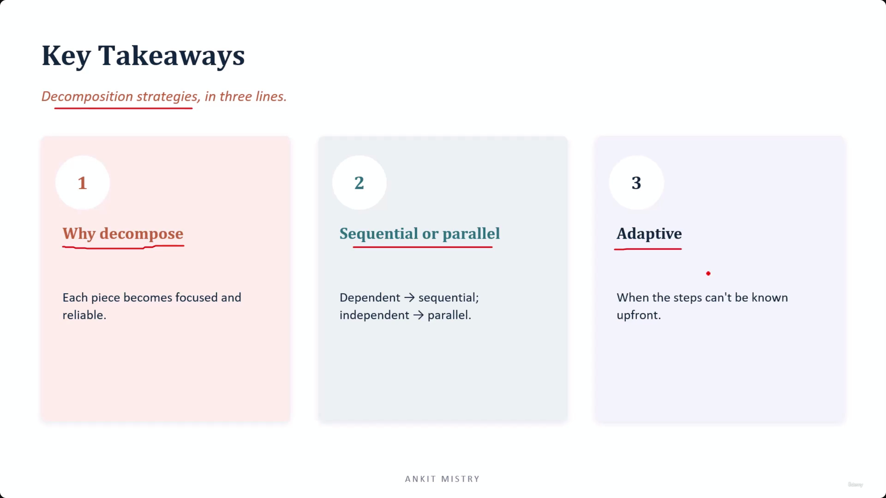
[00:07:13](https://www.udemy.com/course/claude-ai-certification/learn/lecture/57908997#overview)

---

## Simple Explanation (with Claude Examples)

**The core idea, in one line**: Break a big job into pieces shaped by how those pieces actually depend on each other — sequential when they're linked, parallel when they're not, and adaptive when you can't even know the pieces in advance.

**Why decompose at all**

A giant task is a "solid block" — if it fails, you can't see inside it to find out why. Five small, focused subtasks let you pinpoint exactly which one broke, and small, clear pieces are just easier to get right than one giant, vague ask.

**Sequential — a chain**

Each step needs the previous one's output. `extract → validate → format`: you can't validate data you haven't extracted yet.

*Claude Code example*: When I fixed a bug earlier in this session, the steps were naturally sequential — read the file, understand the bug, then edit it. I couldn't edit before reading, and I couldn't validate the fix before making it.

**Parallel — a fan**

Independent steps, no dependency between them, so they run at once. `check 5 files simultaneously` — since nothing waits on anything else, it finishes in roughly the time of *one* step, not five.

*Claude Code example*: Earlier in this conversation, when I looked up multiple unrelated note files, I issued several `Read` calls together in one batch — since reading file A never depended on what was in file B, running them in parallel was both correct and faster than one-by-one.

**Adaptive (dynamic) — following a trail**

You genuinely don't know the subtasks upfront; the agent discovers them as it works. `investigate → find leads → spawn follow-ups`. It's like following a trail through woods: you take one step, look at what's actually there, and *only then* decide where the next step goes.

*Claude Code example*: When I use the `Agent` tool for an open-ended research question, I can't list every file I'll need to check before I start — I read one file, it points me toward another, and the plan grows as I go. That's adaptive decomposition mapping directly onto the Act → Observe → Decide agentic loop.

**The decision rule — not about speed**

Don't pick sequential/parallel based on what "sounds" faster. Ask: *"Does this piece need the answer from that piece?"* Yes → sequential. No → parallel. If you can't even list the steps in advance, you're in adaptive territory.

**Recap in 3 lines**

1. **Decompose for focus and checkability** — small pieces reveal exactly what broke; one giant block hides it.
2. **Sequential vs. parallel is decided by dependency, not speed preference** — chain when one step needs another's answer, fan out when it doesn't.
3. **Adaptive is for the unknowable** — research, debugging, exploration — where the plan can only be discovered by actually doing the work.

---

## Exam Objective Note: CCAR-F 1.6 — Task Decomposition Strategies

**How to spot where a job should be split**

Exam questions describe a workload and ask you to find the right seams. Three patterns to recognize:

- Different types of input that each need different handling → a **routing** problem.
- The same kind of work repeated over separate, independent units → **split it up and run it in parallel**.
- Stages where each one needs the previous stage's output → a **chain** — and a real chain can't be parallelized, because every step genuinely needs the one before it to finish first.

**The trickiest mistake to watch for**

If you split a code review by *file*, but the problem you're looking for lives *between* files, no single-file worker will ever spot it. Splitting by *concern* instead — giving each worker the whole diff, but asking it to look through one specific lens — is what actually catches problems that cross file boundaries.

*Claude Code example*: If I split a security review into "worker checks file A, worker checks file B," neither one can catch "file A passes an unescaped value that file B then renders unsafely" — that bug lives between the two files. Splitting instead into "one worker checks all files for injection risks, another checks all files for auth issues" catches it, because each worker sees the whole picture through one lens.

**Recap in 3 lines**

1. Different input types → routing; same work on independent units → split and parallelize; dependent stages → chain.
2. A true chain can't run in parallel — each step needs the one before it to finish first.
3. Split a code review by concern, not by file — file-splitting hides bugs that live between files.