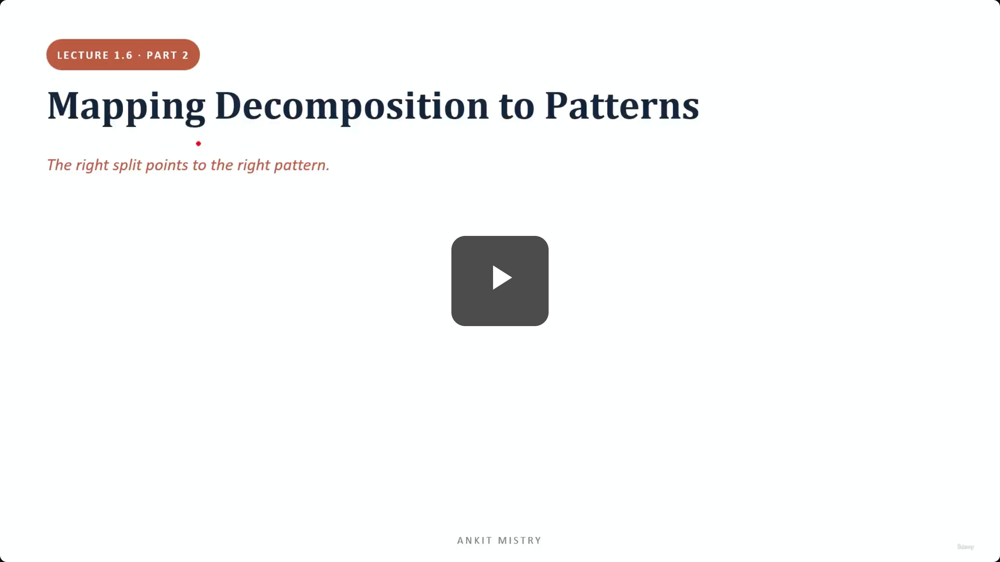
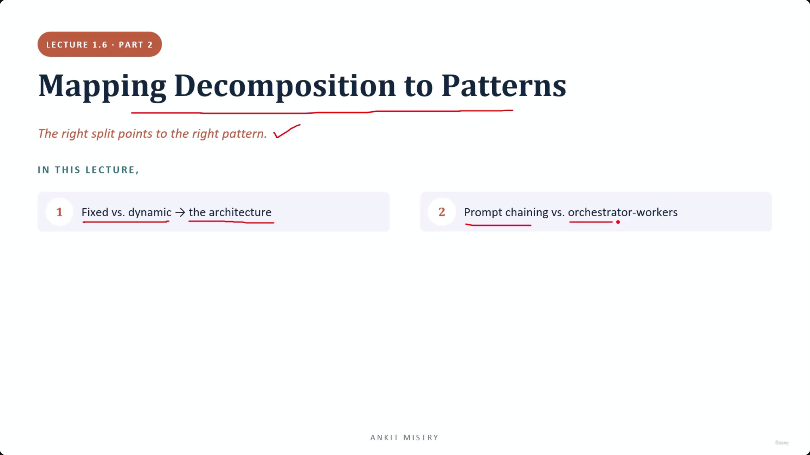
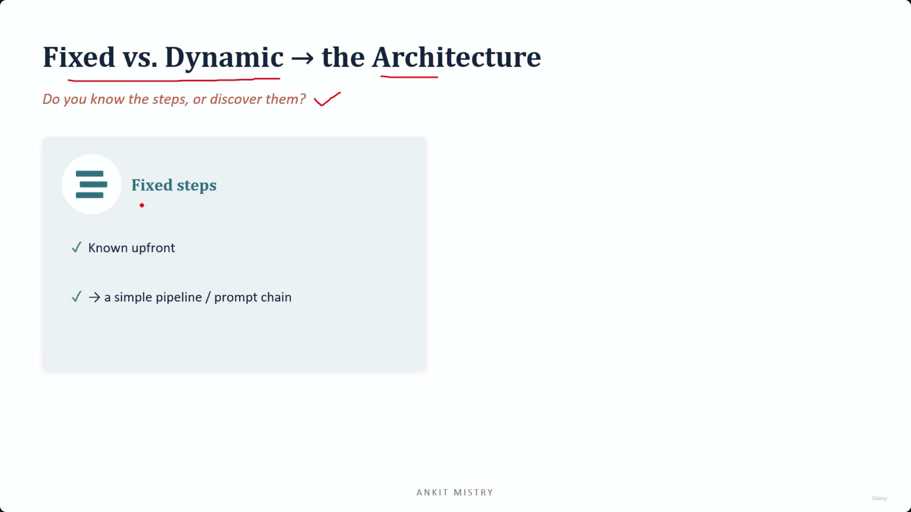
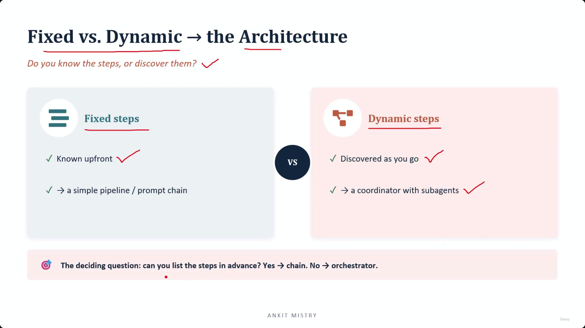
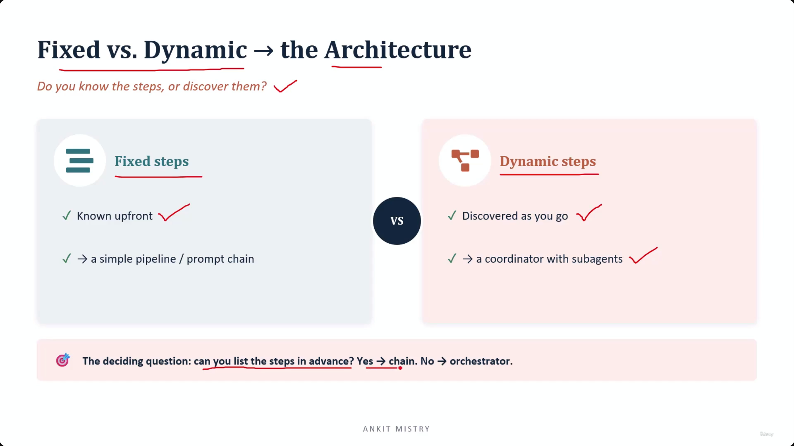
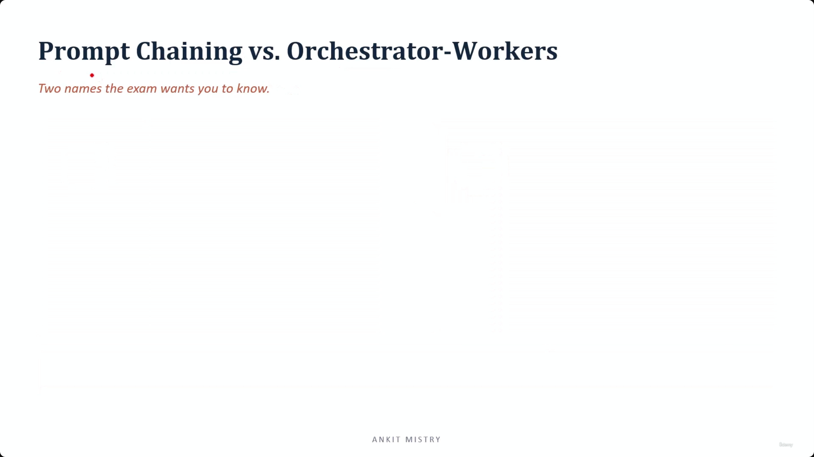
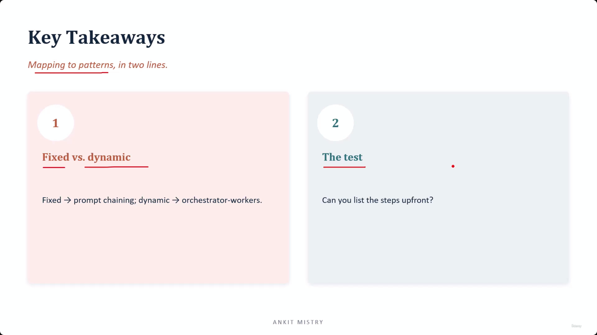

[00:00:00](https://www.udemy.com/course/claude-ai-certification/learn/lecture/57909001#overview)

## Mapping Decomposition to Patterns

- The shape of a job's split determines the appropriate architecture to build
    - "The right split points to the right pattern."

### Lecture Overview

1. Fixed vs. dynamic $\rightarrow$ the architecture
2. Prompt chaining vs. orchestrator-workers

[00:00:43](https://www.udemy.com/course/claude-ai-certification/learn/lecture/57909001#overview)

[00:01:08](https://www.udemy.com/course/claude-ai-certification/learn/lecture/57909001#overview)

### Fixed vs. Dynamic Workflows

- **The Core Question**: Do you know the steps, or discover them?
- **Fixed steps**
    - These are known upfront
    - Because the steps and their order are already determined, they point to a simple pipeline or a prompt chain
    - No "clever" orchestration layer is needed on top because there is no uncertainty in the workflow

[00:02:09](https://www.udemy.com/course/claude-ai-certification/learn/lecture/57909001#overview)

### Dynamic Steps

- Discovered as you go
    - Requires a coordinator with subagents
    - **[Why?]** Someone must judge what comes next based on the results of the previous step, which can only be decided in the moment

### The Deciding Question

- To choose the architecture, ask: "Can you list the steps in advance?"
    - **Yes** $\rightarrow$ Prompt chain
    - **No** $\rightarrow$ Orchestrator

[00:02:14](https://www.udemy.com/course/claude-ai-certification/learn/lecture/57909001#overview)

[00:02:39](https://www.udemy.com/course/claude-ai-certification/learn/lecture/57909001#overview)

### Answering the Deciding Question Honestly

- Avoid the temptation to say "yes" to listing steps in advance if you actually mean "mostly"
    - If there are real branches where the path depends on what is found during execution, the answer is "no"
    - A "no" answer necessitates an orchestrator architecture

## Prompt Chaining vs. Orchestrator-Workers

- Two key architectural terms to know for the exam

### Prompt Chaining

- A linear sequence of steps where the output of one step becomes the input for the next
- **Characteristics**:
    - Simple and predictable
    - You know exactly what will happen before the run begins
- **[Benefits]** Because it is predictable, it is much easier to test and debug
    - If an error occurs, there is only one specific path/part that could have caused it

### Orchestrator-Workers

- A pattern involving a coordinator directing various sub-agents
- **Characteristics**:
    - Flexible and adaptive
    - This is the formal name for the "hub and spoke" pattern

| Feature | Prompt Chaining | Orchestrator-Workers |
| --- | --- | --- |
| Structure | Linear / Straight | Coordinator + Sub-agents |
| Nature | Predictable | Flexible & Adaptive |
| Model | Pipeline | Hub and Spoke |

### Orchestrator-Worker Terminology Mapping

- The 'Orchestrator-Workers' pattern is the formal name for the previously learned 'Hub and Spoke' machinery
    - The **Orchestrator** is the coordinator
    - The **Workers** are the sub-agents
- **[Exam Tip]** Memorize these exact pairings word-for-word:
    - Fixed known steps $\rightarrow$ Prompt chaining
    - A coordinator directing workers $\rightarrow$ Orchestrator-workers
- **Watch for synonyms**
    - The exam may not use the word "coordinator"
    - Listen for terms like "lead agent" or "manager agent" to identify the orchestrator role

[00:05:10](https://www.udemy.com/course/claude-ai-certification/learn/lecture/57909001#overview)

## Key Takeaways

### Mapping to Patterns

- The shape of your job split must decide the architecture
    - **[Important]** Do not pick a pattern first and then attempt to bend the work to fit it
- The two primary mappings are:
    - Fixed $\rightarrow$ Prompt chaining
    - Dynamic $\rightarrow$ Orchestrator-workers

### The Deciding Test

- Ask: "Can you list the steps upfront?"
    - This single question settles the choice between patterns
    - **[Why?]** It is worth asking honestly every time because the cost of choosing the wrong architecture runs in both directions

[00:05:14](https://www.udemy.com/course/claude-ai-certification/learn/lecture/57909001#overview)

### Consequences of Architectural Mismatch

- **Misaligned Patterns**
    - A prompt chain on dynamic work simply breaks
    - An orchestrator on fixed work is expensive complexity you never needed

---

## Simple Explanation (with Claude Examples)

**The core idea, in one line**: How you split a job tells you which architecture to build — fixed, known steps become a simple prompt chain; steps that can only be discovered as you go become an orchestrator with workers.

**The one deciding question**

*"Can you list the steps in advance?"*
- **Yes** → **Prompt chaining** — a straight-line pipeline, step A's output feeds step B, and so on.
- **No** → **Orchestrator-workers** — a coordinator that decides what happens next based on what it just found.

**Prompt chaining — simple and predictable**

Because the whole sequence is known before you even start, it's easy to test and debug: if something breaks, there's only one specific path it could have gone wrong on.

*Claude Code example*: If I run "read this file, then summarize it, then translate the summary" — three fixed steps in a known order — that's a prompt chain. No branching, no discovery, just a straight pipeline.

**Orchestrator-workers — the formal name for hub-and-spoke**

This is exactly the coordinator/subagent pattern covered earlier in this domain — same idea, just the official term for it. The **Orchestrator** is the coordinator; the **Workers** are the subagents.

*Claude Code example*: When I spawn an `Agent` to investigate a codebase and decide, based on what it finds, whether to spawn a second follow-up agent — that's orchestrator-workers. I couldn't have listed "spawn agent 2" in advance, because whether agent 2 is even needed depends entirely on what agent 1 discovers.

**Exam tip carried into practice: watch for synonyms**

The exact word "coordinator" might not appear — terms like "lead agent" or "manager agent" describe the same orchestrator role. Don't get thrown off by different wording for the same underlying pattern.

**Answer the deciding question honestly**

Don't say "yes, I can list the steps" when you actually mean "mostly." If there's a real branch where the path depends on what's discovered mid-execution, the honest answer is "no" — and that means you need an orchestrator, not a chain.

**What happens if you get it wrong**

- A prompt chain forced onto genuinely dynamic work simply breaks — it has no way to react to the unexpected.
- An orchestrator built for genuinely fixed work is expensive complexity you never needed — added failure points for zero benefit.

*Claude Code example*: If a task is truly linear (read → format → save), spawning multiple coordinated subagents for it would be pure overhead — a simple sequence of tool calls does the job with less risk of something going wrong in the coordination itself.

**Recap in 3 lines**

1. **Fixed steps → prompt chaining** — simple, predictable, easy to debug.
2. **Discovered-as-you-go steps → orchestrator-workers** — a coordinator decides the next move based on results.
3. **Answer the "can I list the steps?" question honestly** — "mostly yes" really means "no," and picking the wrong architecture breaks or over-complicates the work.