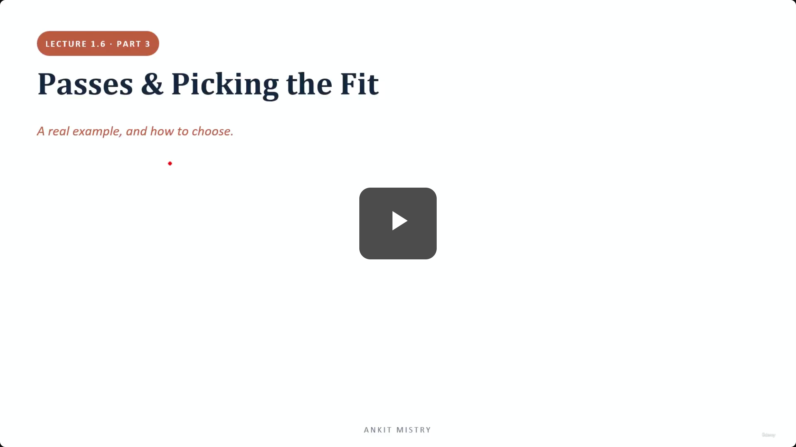
[00:00:00](https://www.udemy.com/course/claude-ai-certification/learn/lecture/57909003#overview)

## Passes & Picking the Fit

- A real example, and how to choose.

### In This Lecture

- 1. Per-file & cross-file passes
- 2. Picking the fit

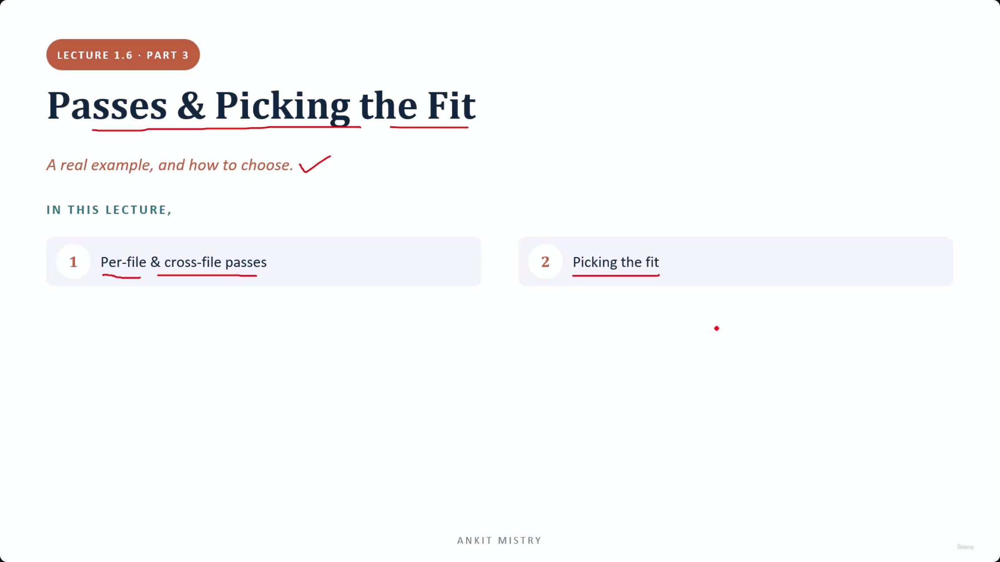
[00:00:44](https://www.udemy.com/course/claude-ai-certification/learn/lecture/57909003#overview)

### Decomposition Example: Code Review

- **Per-file pass**
    - Check each file on its own
    - Because they are independent, they can run in parallel
        - Checking file 1 does not require information from file 2

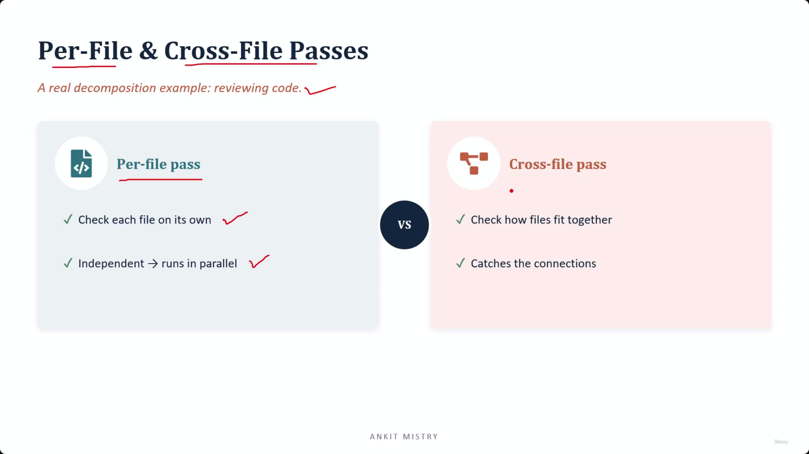
[00:01:39](https://www.udemy.com/course/claude-ai-certification/learn/lecture/57909003#overview)

### Per-File vs. Cross-File Passes

- **Per-file pass**
    - Check each file on its own
    - Independent, which allows them to run in parallel
        - This is crucial for large codebases (e.g., 50 files)
        - Running them sequentially would be 50 times slower
- **Cross-file pass**
    - Check how files fit together
    - Catches the connections between files
- **[Why both are needed?]** Because a single pass is insufficient
    - A per-file pass can spot mistakes within a single file
    - However, a per-file pass cannot see if one file contradicts another
    - For example, one file might define a value in one way while another file expects it differently

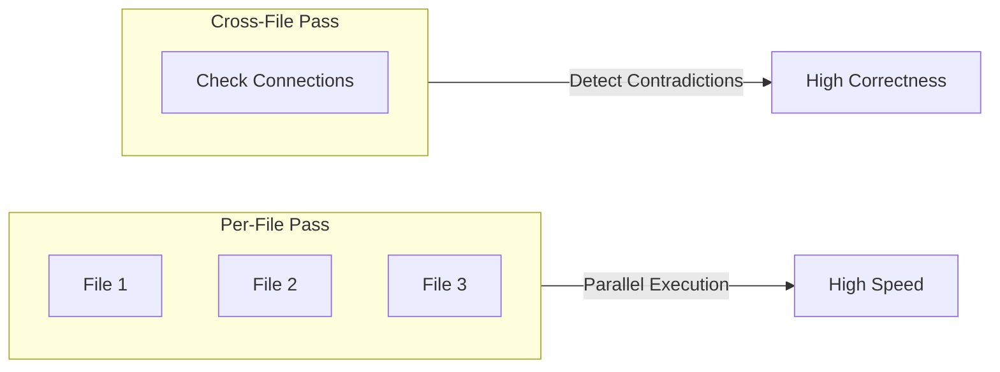

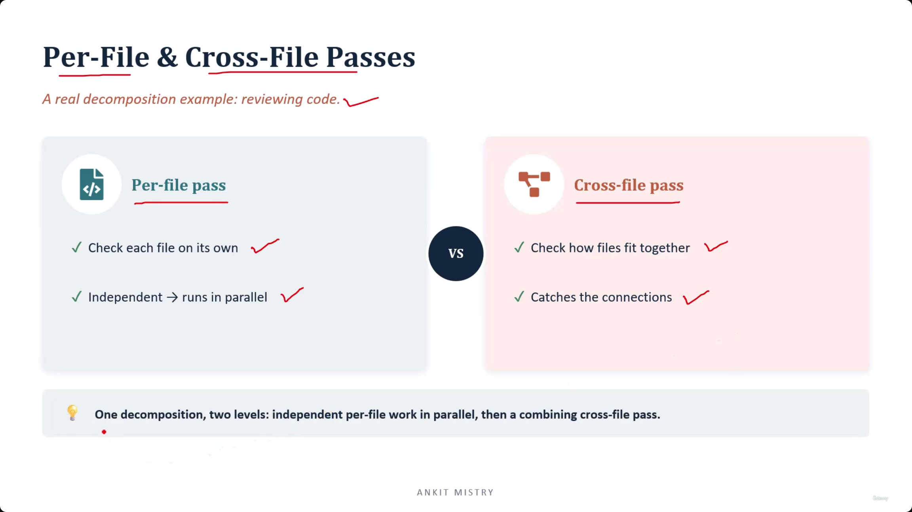
[00:02:19](https://www.udemy.com/course/claude-ai-certification/learn/lecture/57909003#overview)

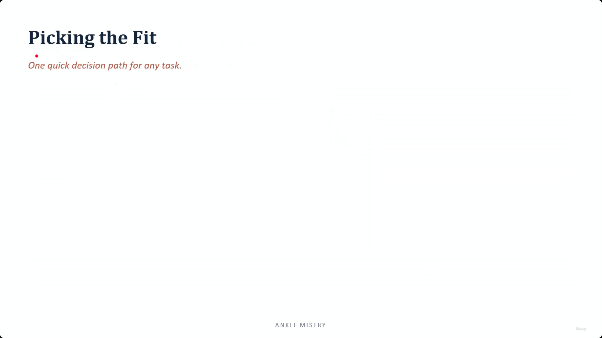
[00:02:57](https://www.udemy.com/course/claude-ai-certification/learn/lecture/57909003#overview)

### Two-Level Decomposition Structure

- One decomposition, two levels:
    - Independent per-file work that runs in parallel
    - A combining cross-file pass
- **[The limitation of per-file passes]** They cannot detect bugs that exist "between" files
    - A per-file review might report nothing even if the system is broken
    - This happens when each file is perfectly correct on its own, but the mistake lives in how they interact

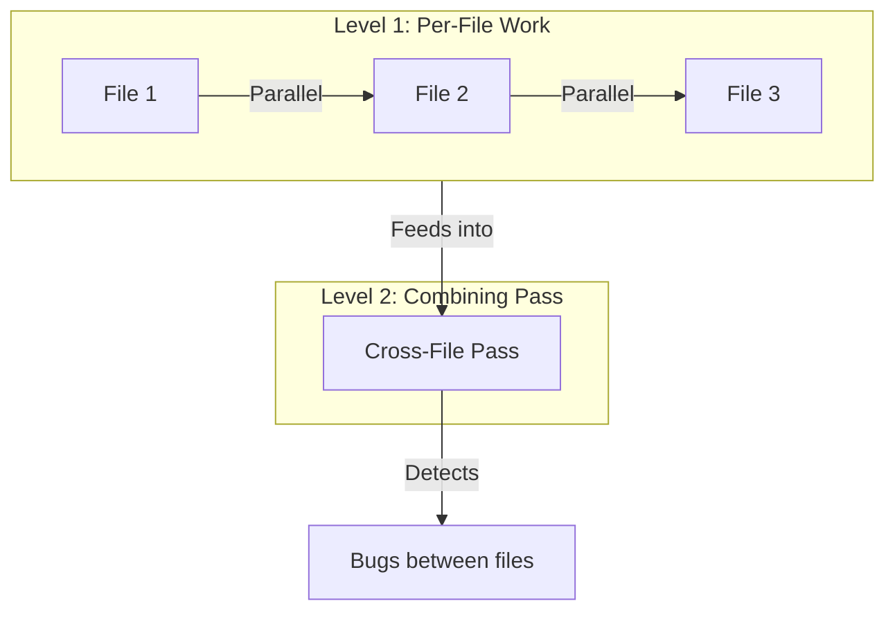

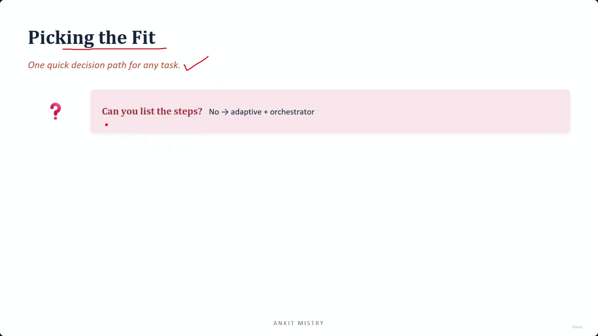
[00:03:15](https://www.udemy.com/course/claude-ai-certification/learn/lecture/57909003#overview)

## Picking the Fit

### Decision Path for Any Task

- A three-question sequential process to settle the best approach for a task
- **Question 1: Can you list the steps?**
    - If **No** $\rightarrow$ Requires **adaptive + orchestrator**
        - **[Why?]** If the steps cannot be named upfront, no fixed arrangement will survive the actual work
        - This requires an orchestrator to run adaptive decomposition, allowing for decisions to be made as the work progresses

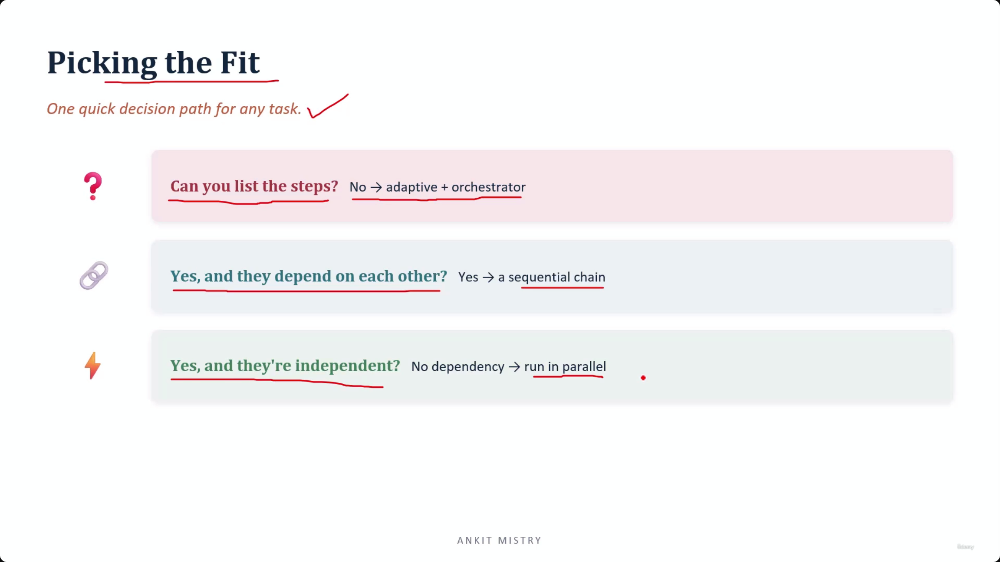
[00:04:27](https://www.udemy.com/course/claude-ai-certification/learn/lecture/57909003#overview)

### Decision Path: The Three Questions

- **Question 2: Yes (steps can be listed), and they depend on each other?**
    - $\rightarrow$ A sequential chain
    - **[The test for dependency]** Does one piece need the answer from another piece to proceed?
        - If yes, they are dependent and must form a chain
- **Question 3: Yes (steps can be listed), and they're independent?**
    - $\rightarrow$ Run in parallel
    - **[Why?]** If there is no dependency between the steps, they can be executed simultaneously

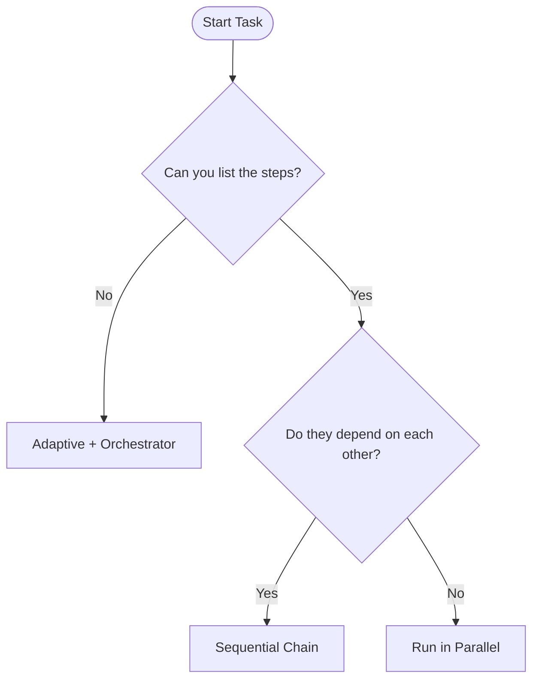

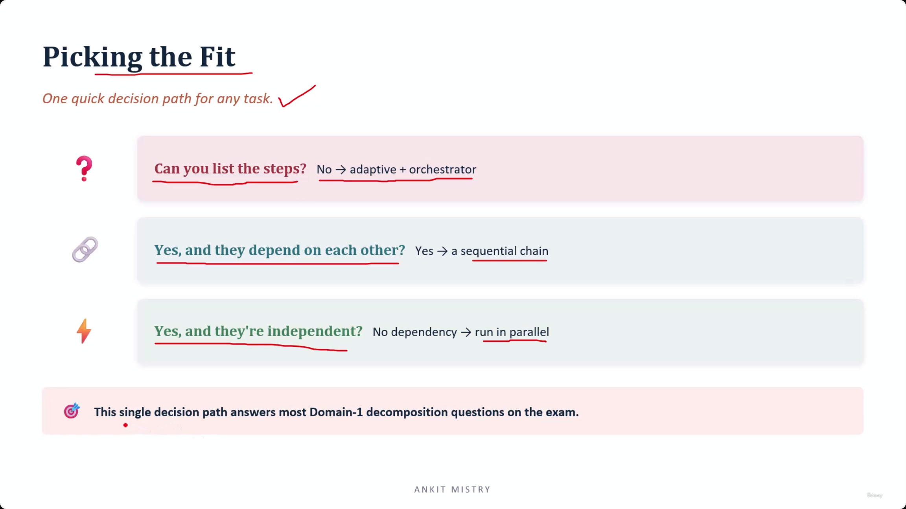
[00:04:48](https://www.udemy.com/course/claude-ai-certification/learn/lecture/57909003#overview)

### Application of the Decision Path

- **[Why the order matters]** The questions are sequential because each one is designed to rule out specific possibilities
    - By the third question, only one valid answer remains
- **Exam Strategy**
    - This single decision path answers most Domain-1 decomposition questions
    - **[Note]** Exam questions rarely name the pattern directly; they describe a situation
    - Your task is to run the three-question process against the described scenario to find the correct fit

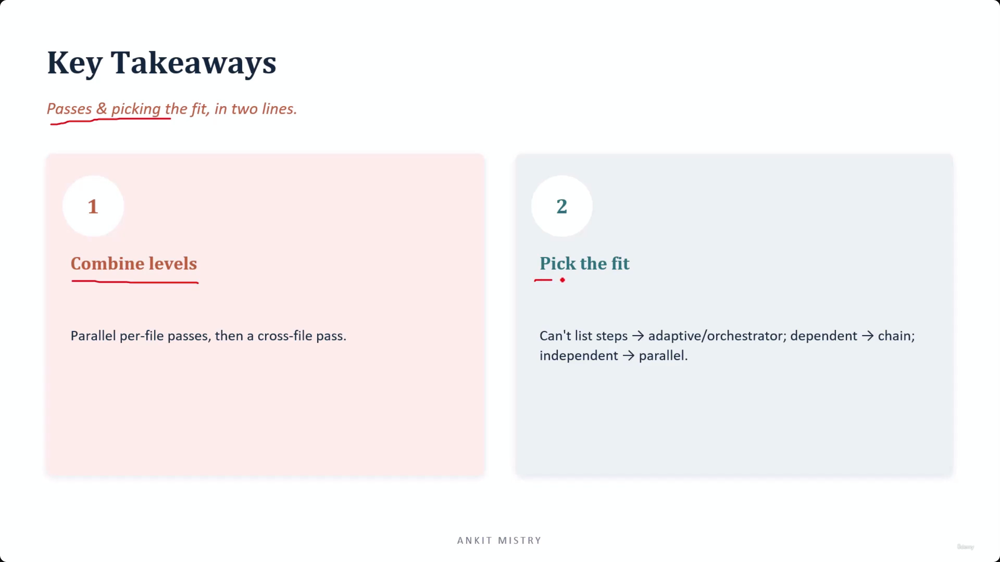
[00:05:40](https://www.udemy.com/course/claude-ai-certification/learn/lecture/57909003#overview)

## Key Takeaways

### Combine Levels

- Real-world jobs are rarely a single shape
- Usually involve independent work first, followed by a step that brings it all together
    - Combine parallel per-file passes with a cross-file pass

### Pick the Fit

- Use the three-question process to determine the approach:
    - **Can't list steps** $\rightarrow$ Adaptive or Orchestrator
    - **Dependent steps** $\rightarrow$ Sequential chain
    - **Independent steps** $\rightarrow$ Parallel execution

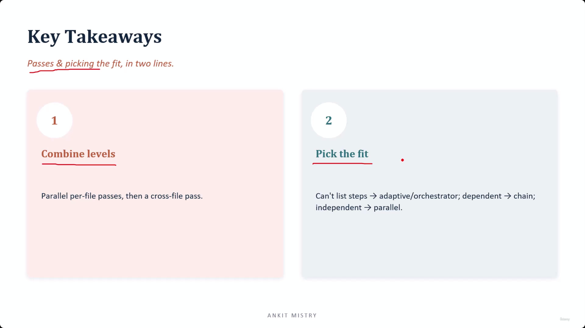
[00:05:57](https://www.udemy.com/course/claude-ai-certification/learn/lecture/57909003#overview)

### Key Takeaways: Passes & Picking the Fit

- **1. Combine levels**
    - Parallel per-file passes, then a cross-file pass
    - **[Insight]** Real-world jobs are rarely a single shape; they often consist of independent work first, followed by a step that brings everything together
- **2. Pick the fit**
    - Can't list steps $\rightarrow$ adaptive/orchestrator
    - Dependent $\rightarrow$ chain
    - Independent $\rightarrow$ parallel
- **[Core Goal]** All three questions in the decision path are ultimately asking: "What shape does this work actually have?"

---

## Simple Explanation (with Claude Examples)

**The core idea, in one line**: Real jobs often need two levels of review at once — fast parallel checks on individual pieces, plus one combining pass that catches how the pieces interact — and a simple 3-question test tells you how to shape any task.

**Per-file vs. cross-file passes — using code review as the example**

- **Per-file pass** — check each file on its own. Since files don't depend on each other for this, they can all run *at the same time*. For 50 files, checking sequentially would be 50x slower.
- **Cross-file pass** — a separate step checking how files fit *together*. A per-file pass can't catch this: File A might define a value one way, File B expects it differently, and each file still looks perfectly fine in isolation.

*Claude Code example*: If I reviewed 10 files in your project for bugs, I could check all 10 in parallel `Read` calls (per-file speed) — but only a separate pass comparing them against each other would catch something like "this function signature changed in file A but file B still calls it the old way."

**The 3-question decision path — for picking the right shape of any task**

1. **Can you list the steps?** No → you need **adaptive + orchestrator** (figure it out as you go).
2. **Yes, and do they depend on each other?** Yes → **sequential chain**.
3. **Yes, and are they independent?** Yes → **run in parallel**.

*Claude Code example*: Earlier in this session, when I explained multiple note files one after another, each explanation was independent of the others — a perfect candidate for parallel reads if I'd wanted to batch them. But when I updated the `explain-note` skill *based on* your feedback about a specific explanation, that had to happen *after* I saw the feedback — a sequential dependency, not something I could've done in advance.

**Combine levels — the real-world default**

Most real jobs aren't a single shape. They're usually independent work first (parallel), followed by one step that ties it all together (like the cross-file pass). This mirrors what I do with the `explain-note` skill in this project: reading and drafting several file explanations can happen independently, but making sure they're all consistent in style is a combining step done afterward.

**Recap in 3 lines**

1. **Combine parallel + combining passes** — fast independent checks, then one pass that catches the connections between them.
2. **Three questions settle any task's shape**: can't list steps → adaptive; dependent → chain; independent → parallel.
3. **Exam scenarios describe situations, not pattern names** — run the 3-question test against what's described to find the fit.