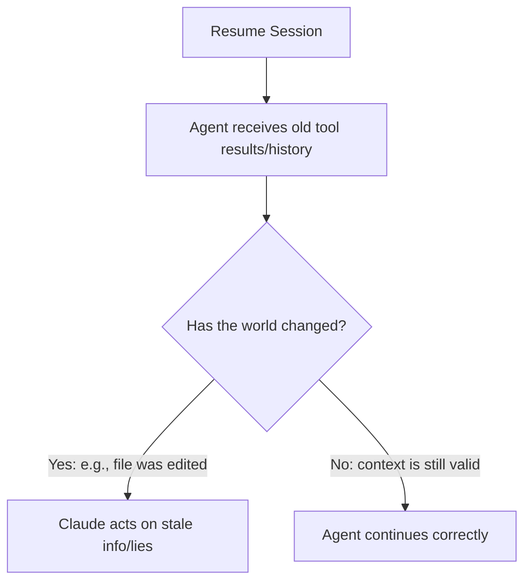

[00:00:00](https://www.udemy.com/course/claude-ai-certification/learn/lecture/57909007#overview)

## Session State: Resume

- Picking up where you left off.
- **[The Problem]** Previous builds assumed one continuous run (start $\rightarrow$ loop $\rightarrow$ finish).
    - Real work involves interruptions (e.g., closing a laptop, long jobs being interrupted halfway through).
- **Lecture Roadmap**

    1. What a session is
    2. Resume & continue (the two ways of coming back)
    3. The stale-transcript trap

[00:01:08](https://www.udemy.com/course/claude-ai-certification/learn/lecture/57909007#overview)

### What Is a Session?

- The saved memory of an agent's work
- **The agent's memory on disk**
    - The saved record of a conversation and its work
    - Includes messages, tool calls, and results
    - By saving this, you can come back later

[00:01:43](https://www.udemy.com/course/claude-ai-certification/learn/lecture/57909007#overview)

### Importance of Persistence

- **[On disk]** means the data is written into a file
    - This allows the state to survive after the program closes
- **[Why it matters]** Without a saved session, closing the window means starting over from nothing
    - An agent's knowledge is limited to the current conversation context
    - If the conversation is lost, the agent loses everything: every file it read and every lookup it performed
    - For long-running jobs, this loss of progress is highly inefficient

[00:02:15](https://www.udemy.com/course/claude-ai-certification/learn/lecture/57909007#overview)

[00:02:44](https://www.udemy.com/course/claude-ai-certification/learn/lecture/57909007#overview)

## Resume & Continue

- Reopen a session and keep going
- **[Core Principle]** Keep the full prior context
- **Two ways to return to work:**
    - `resume`: Reopens a specific saved session
    - `continue`: Picks up the most recent session
    - Both methods ensure the agent retains its entire prior context

[00:03:13](https://www.udemy.com/course/claude-ai-certification/learn/lecture/57909007#overview)

### Choosing Between Resume and Continue

- **[Usage Patterns]**
    - `continue`: The go-to method for daily use; it simply takes you back to wherever you last were
    - `resume`: Used when juggling several different pieces of work simultaneously and you need a specific session
- **The Core Definition of Resume**
    - `Resume = keep the whole history and carry on`
- **[The Critical Condition]**
    - Resume is only the right choice if the earlier context is **still valid**
    - If nothing important has changed since the last session, resume works perfectly; if the world has changed, the old history might become a liability

[00:03:44](https://www.udemy.com/course/claude-ai-certification/learn/lecture/57909007#overview)

[00:04:08](https://www.udemy.com/course/claude-ai-certification/learn/lecture/57909007#overview)

## The Stale-Transcript Trap

- **[Warning]** Old tool results can lie to the model
- **Resumed&#32;**$\neq$**&#32;fresh**
    - A resumed session still holds OLD tool results
    - Claude trusts these results even if the world has changed
    - **[The Risk]** If a file was edited while the session was inactive, Claude may act on stale information

[00:04:56](https://www.udemy.com/course/claude-ai-certification/learn/lecture/57909007#overview)

### The Danger of Being Confidently Wrong

- **[Why it happens]** Resuming restores the full history, including tool results that were true in the past
    - A tool result is just an entry in the conversation
    - It does not carry any metadata or labels to indicate if the information is now out of date
- **[The Risk]** If earlier results are no longer accurate, resuming can make Claude "confidently wrong"
    - Claude will not hesitate or flag any doubt when using stale information
    - This is the most dangerous type of error because the agent acts with absolute certainty on incorrect premises

[00:05:14](https://www.udemy.com/course/claude-ai-certification/learn/lecture/57909007#overview)

[00:05:56](https://www.udemy.com/course/claude-ai-certification/learn/lecture/57909007#overview)

### Practical Habit for Resuming

- **[Pre-resume Check]** Ask yourself: "Has anything changed since I was last here?"
- If files were edited or data was updated while the session was inactive, treat the old context with suspicion
    - Resuming is like acting on a two-week-old note without checking if anything moved

## Key Takeaways

### Resume in Three Lines

- **1. Session = memory**
        - The agent's saved messages, tools, and results

[00:06:45](https://www.udemy.com/course/claude-ai-certification/learn/lecture/57909007#overview)