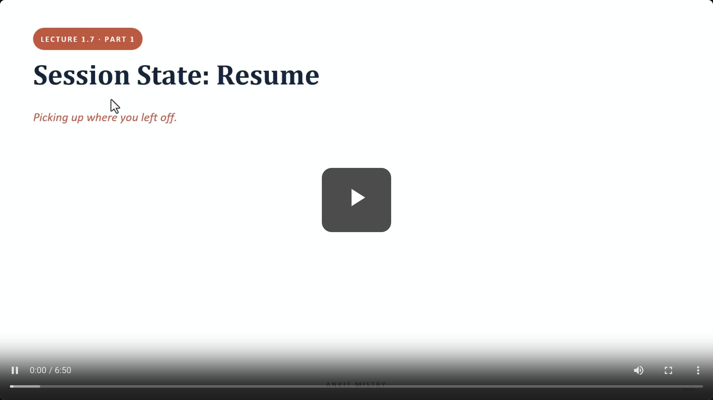
[00:00:00](https://www.udemy.com/course/claude-ai-certification/learn/lecture/57909007#overview)

## Session State: Resume

- Picking up where you left off.
- **[The Problem]** Previous builds assumed one continuous run (start $\rightarrow$ loop $\rightarrow$ finish).
    - Real work involves interruptions (e.g., closing a laptop, long jobs being interrupted halfway through).
- **Lecture Roadmap**

    1. What a session is
    2. Resume & continue (the two ways of coming back)
    3. The stale-transcript trap

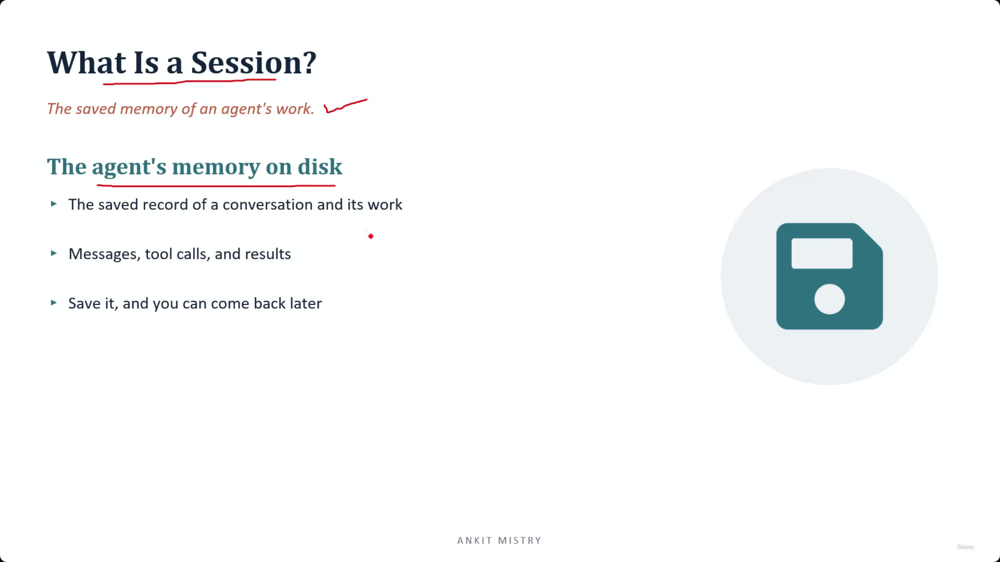
[00:01:08](https://www.udemy.com/course/claude-ai-certification/learn/lecture/57909007#overview)

### What Is a Session?

- The saved memory of an agent's work
- **The agent's memory on disk**
    - The saved record of a conversation and its work
    - Includes messages, tool calls, and results
    - By saving this, you can come back later

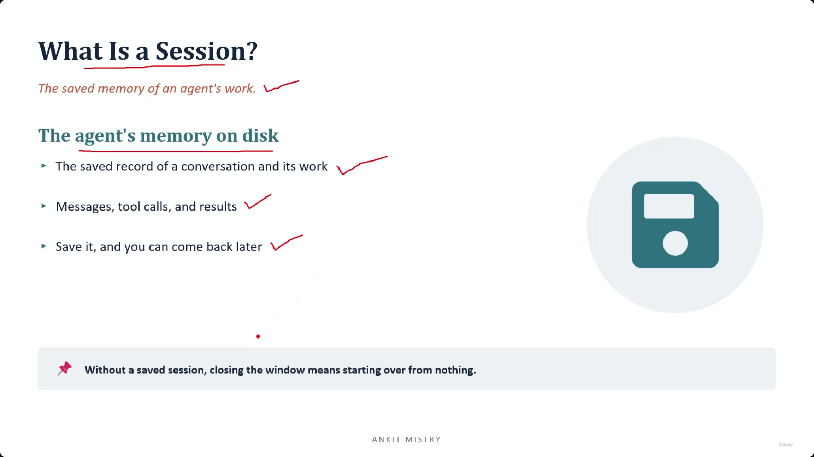
[00:01:43](https://www.udemy.com/course/claude-ai-certification/learn/lecture/57909007#overview)

### Importance of Persistence

- **[On disk]** means the data is written into a file
    - This allows the state to survive after the program closes
- **[Why it matters]** Without a saved session, closing the window means starting over from nothing
    - An agent's knowledge is limited to the current conversation context
    - If the conversation is lost, the agent loses everything: every file it read and every lookup it performed
    - For long-running jobs, this loss of progress is highly inefficient

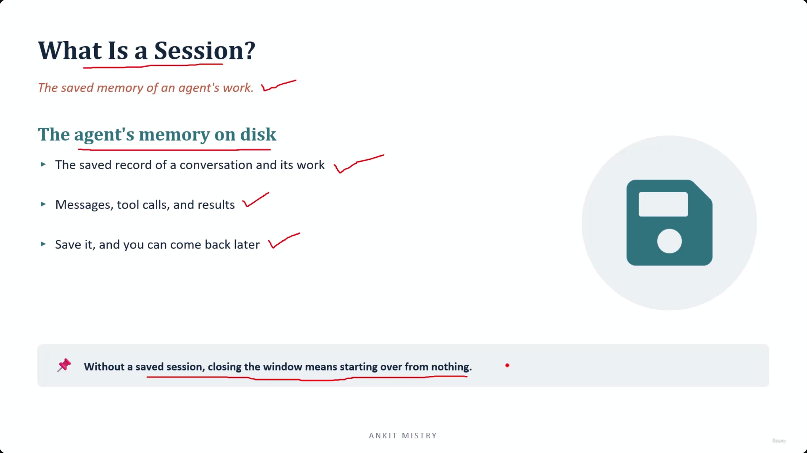
[00:02:15](https://www.udemy.com/course/claude-ai-certification/learn/lecture/57909007#overview)

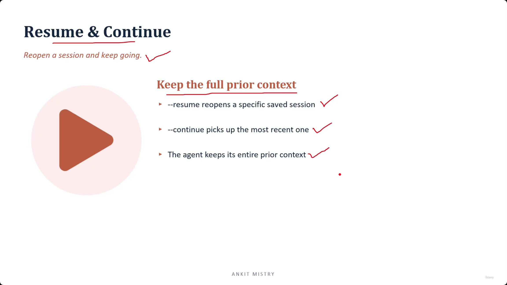
[00:02:44](https://www.udemy.com/course/claude-ai-certification/learn/lecture/57909007#overview)

## Resume & Continue

- Reopen a session and keep going
- **[Core Principle]** Keep the full prior context
- **Two ways to return to work:**
    - `resume`: Reopens a specific saved session
    - `continue`: Picks up the most recent session
    - Both methods ensure the agent retains its entire prior context

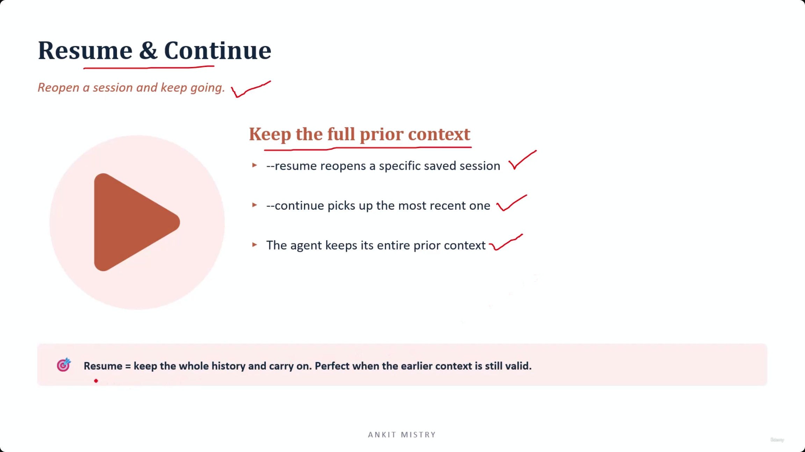
[00:03:13](https://www.udemy.com/course/claude-ai-certification/learn/lecture/57909007#overview)

### Choosing Between Resume and Continue

- **[Usage Patterns]**
    - `continue`: The go-to method for daily use; it simply takes you back to wherever you last were
    - `resume`: Used when juggling several different pieces of work simultaneously and you need a specific session
- **The Core Definition of Resume**
    - `Resume = keep the whole history and carry on`
- **[The Critical Condition]**
    - Resume is only the right choice if the earlier context is **still valid**
    - If nothing important has changed since the last session, resume works perfectly; if the world has changed, the old history might become a liability

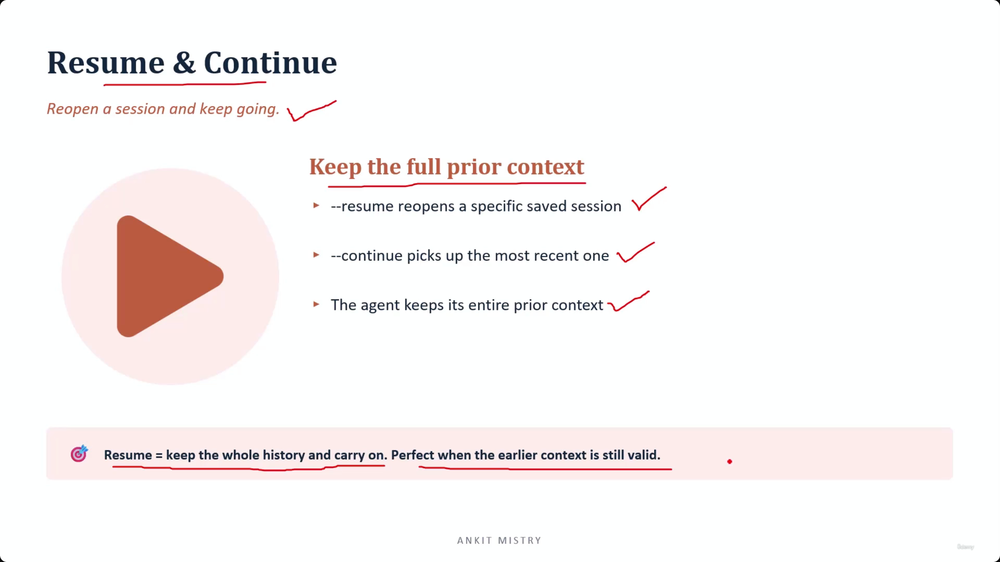
[00:03:44](https://www.udemy.com/course/claude-ai-certification/learn/lecture/57909007#overview)

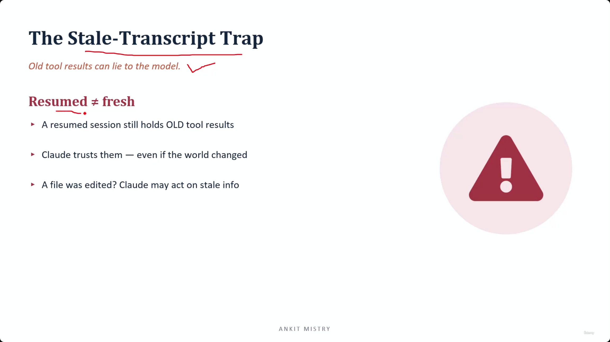
[00:04:08](https://www.udemy.com/course/claude-ai-certification/learn/lecture/57909007#overview)

## The Stale-Transcript Trap

- **[Warning]** Old tool results can lie to the model
- **Resumed&#32;**$\neq$**&#32;fresh**
    - A resumed session still holds OLD tool results
    - Claude trusts these results even if the world has changed
    - **[The Risk]** If a file was edited while the session was inactive, Claude may act on stale information

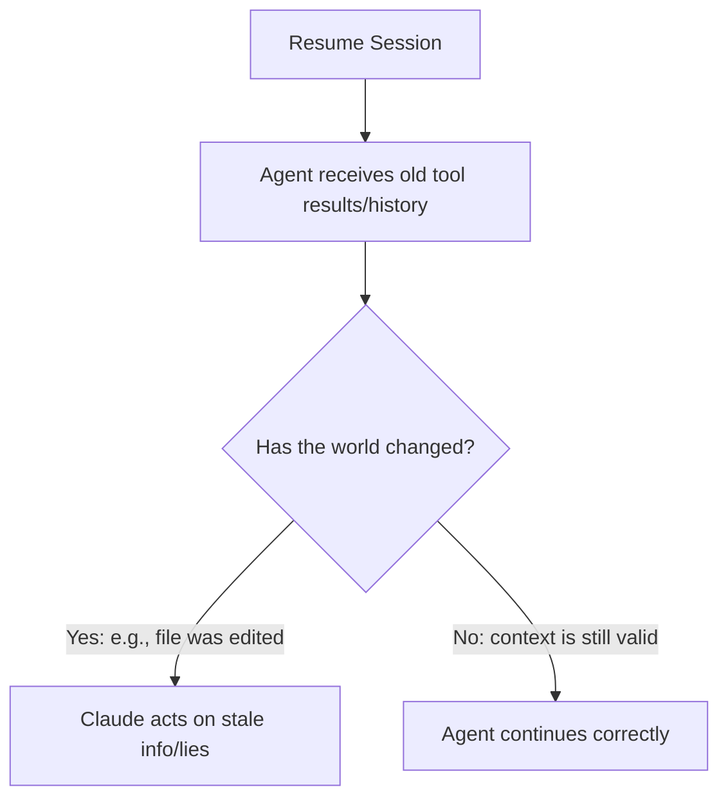

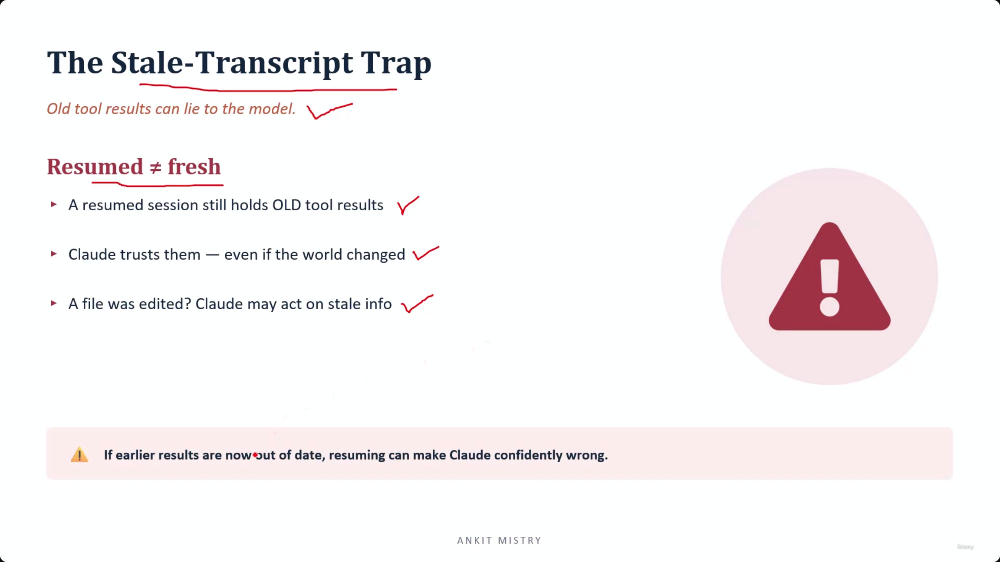
[00:04:56](https://www.udemy.com/course/claude-ai-certification/learn/lecture/57909007#overview)

### The Danger of Being Confidently Wrong

- **[Why it happens]** Resuming restores the full history, including tool results that were true in the past
    - A tool result is just an entry in the conversation
    - It does not carry any metadata or labels to indicate if the information is now out of date
- **[The Risk]** If earlier results are no longer accurate, resuming can make Claude "confidently wrong"
    - Claude will not hesitate or flag any doubt when using stale information
    - This is the most dangerous type of error because the agent acts with absolute certainty on incorrect premises

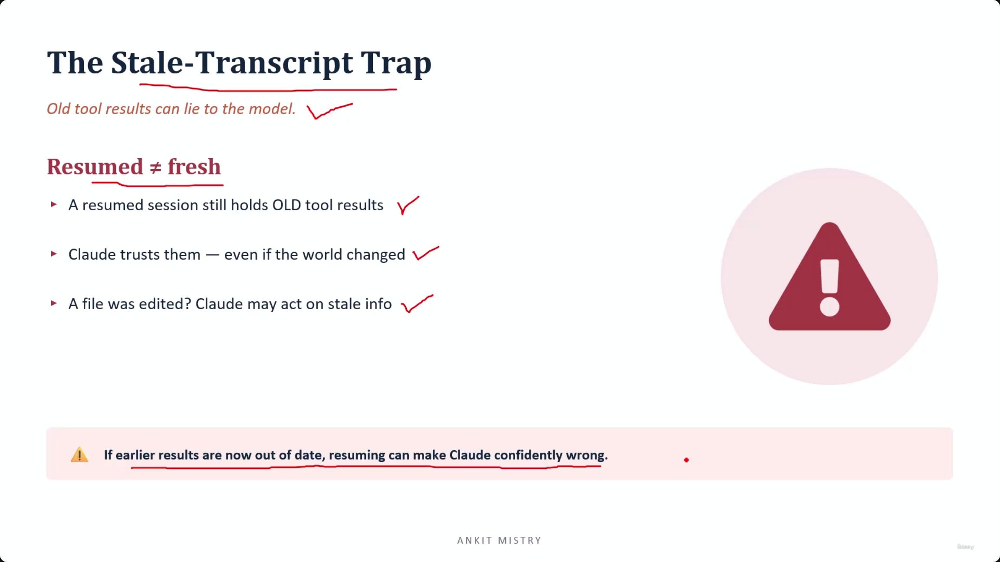
[00:05:14](https://www.udemy.com/course/claude-ai-certification/learn/lecture/57909007#overview)

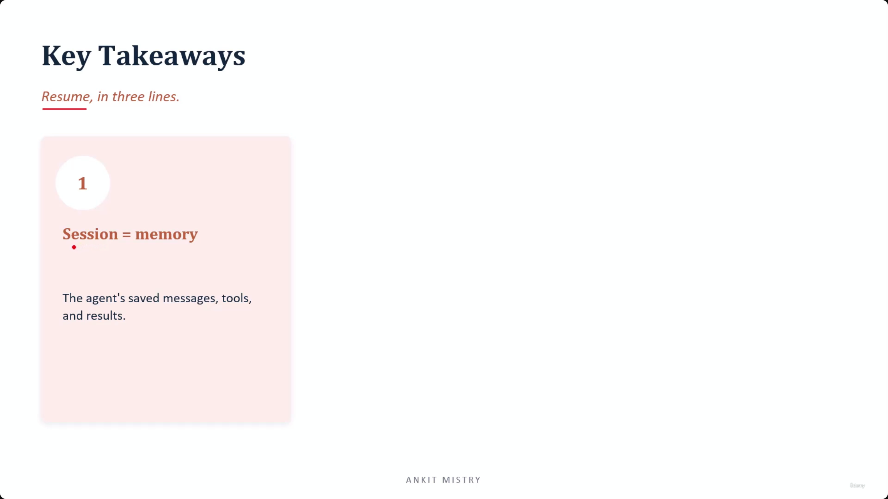
[00:05:56](https://www.udemy.com/course/claude-ai-certification/learn/lecture/57909007#overview)

### Practical Habit for Resuming

- **[Pre-resume Check]** Ask yourself: "Has anything changed since I was last here?"
- If files were edited or data was updated while the session was inactive, treat the old context with suspicion
    - Resuming is like acting on a two-week-old note without checking if anything moved

## Key Takeaways

### Resume in Three Lines

- **1. Session = memory**
        - The agent's saved messages, tools, and results

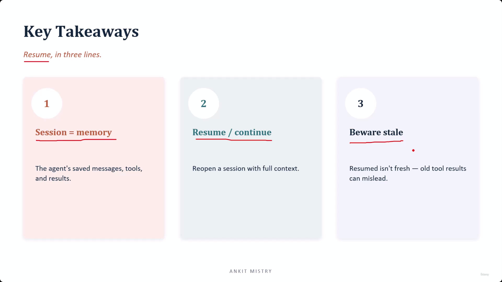
[00:06:45](https://www.udemy.com/course/claude-ai-certification/learn/lecture/57909007#overview)

---

## Simple Explanation (with Claude Examples)

**The core idea, in one line**: Resuming a session brings back everything Claude did before — including old tool results that might no longer be true, so a resumed session can confidently act on outdated information.

**What a session actually is**

It's the agent's memory saved to disk — every message, every tool call, every result. Because it's written to a file (not just kept in memory), it survives after you close the window. Without this, closing your terminal means starting completely from zero — every file read, every lookup, gone.

*Claude Code example*: This is why, in this environment, our long conversation about explaining note files persists across turns — every file I've already read and every explanation I've written stays available to me, instead of vanishing the moment a new message arrives.

**Resume vs. continue**

- `continue` — picks up your most recent session; the everyday go-to.
- `resume` — reopens one *specific* saved session, useful when you're juggling multiple separate pieces of work.

Both bring back the full prior context — which is exactly where the risk shows up.

**The stale-transcript trap — the dangerous part**

A resumed session still holds *old* tool results, and nothing marks them as potentially outdated. If a file was edited while the session was inactive, Claude has no built-in way to know that — it will trust the old result exactly as confidently as a fresh one.

*Everyday analogy*: it's like acting on a two-week-old sticky note without checking whether anything's moved since you wrote it.

*Claude Code example*: Suppose in an earlier turn I read a config file and it said `debug: false`. If you then edited that file outside our conversation and later resumed this session, I might still "remember" `debug: false` from the old tool result — and confidently act on that, even though the real file now says `debug: true` — unless I re-read it.

**Why this is worse than a normal mistake**

Claude won't hesitate or flag doubt when using stale information — it acts with full confidence on an outdated premise. That combination (confident + wrong) is the most dangerous kind of error, because nothing about the response looks uncertain or suspicious.

**The practical habit**

Before resuming, ask: *"Has anything changed since I was last here?"* If files were edited or data updated while the session was inactive, treat the old context with suspicion — re-check rather than trust blindly.

**Recap in 3 lines**

1. **A session is the agent's saved memory** — every message, tool call, and result, written to disk.
2. **`resume`/`continue` bring back the full history** — useful, but it includes old tool results with no "may be outdated" label.
3. **Stale context makes Claude confidently wrong** — always ask "has anything changed?" before trusting a resumed session's old results.

---

## Exam Objective Note: CCAR-F 1.7 — Session State and Resumption

**Three ways to come back to a session**

- `continue` — picks up whatever session you were most recently in, in that working folder.
- `resume` — reopens one specific session, using an ID you saved earlier.
- `fork` — reopens a session, then branches off a copy, leaving the original session and its history completely untouched.

**The trickiest point in this whole topic**

Forking only branches the *conversation* — not the files on your computer. If a forked agent edits a real file, that edit is real and permanent, visible to any other session working in that same folder, including the original one you forked from. Thinking a fork is a safe sandbox for file changes is a mistake that can cost real work.

*Claude Code example*: If I fork a session and then use `Edit` to change a config file, that change is saved to disk exactly like any other edit. The original session, if it reads that file afterward, sees my edit too — forking never protected the file itself, only the conversation history.

**Recap in 3 lines**

1. `continue` picks up the most recent session; `resume` reopens one specific saved session by ID; `fork` branches off a copy and leaves the original untouched.
2. Forking protects conversation history only — not the files on disk.
3. A forked agent's file edits are real and shared with everyone working in that folder — don't treat a fork as a safe sandbox for file changes.