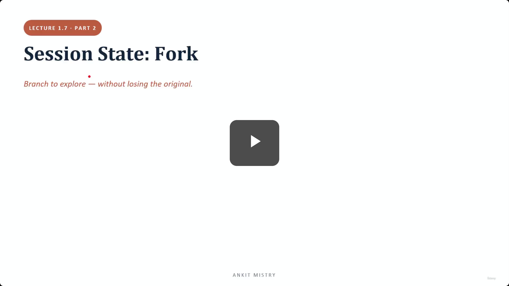
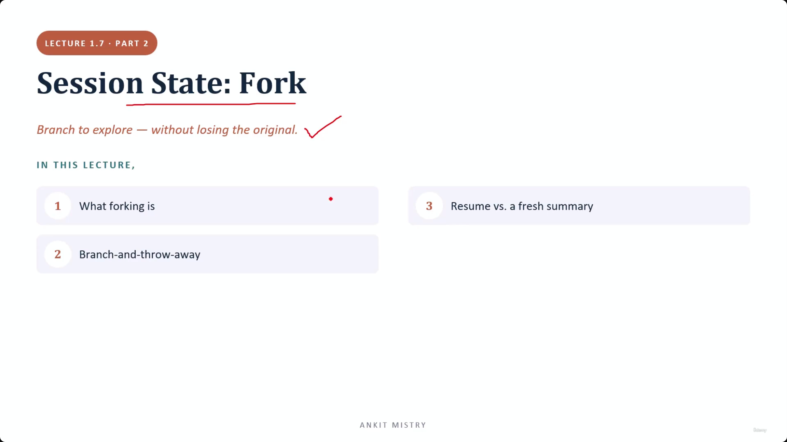
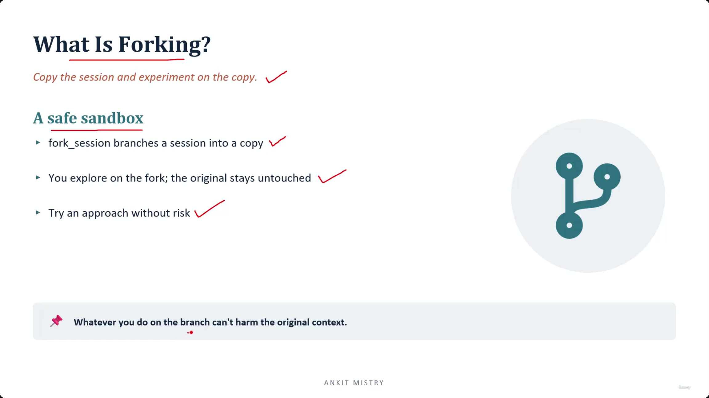
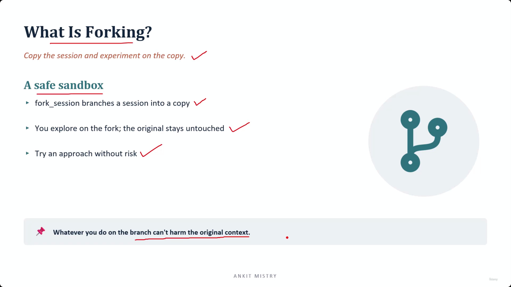
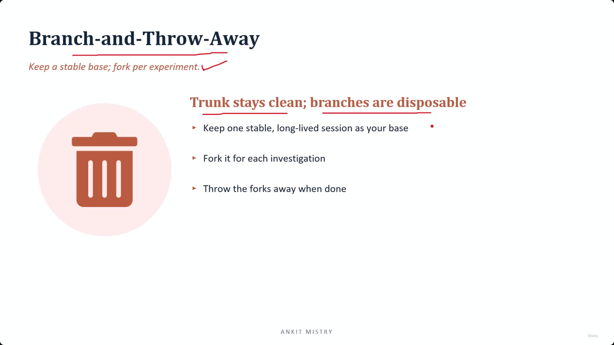
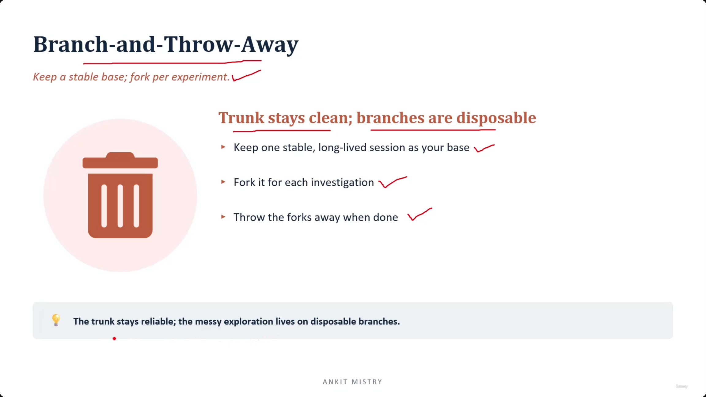
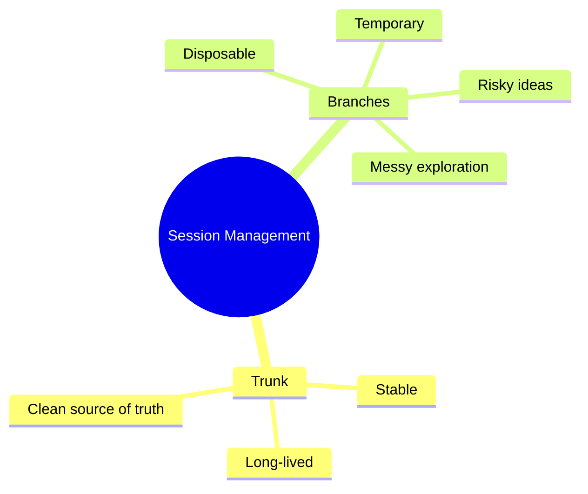
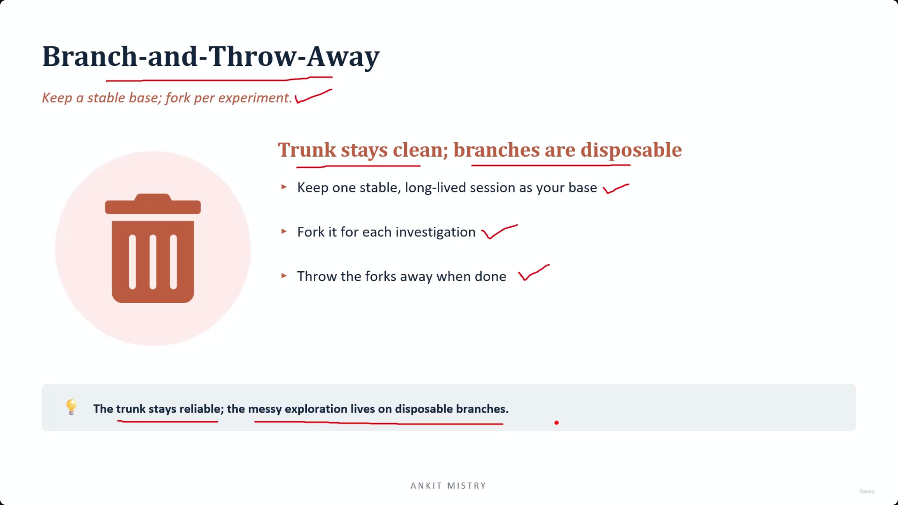
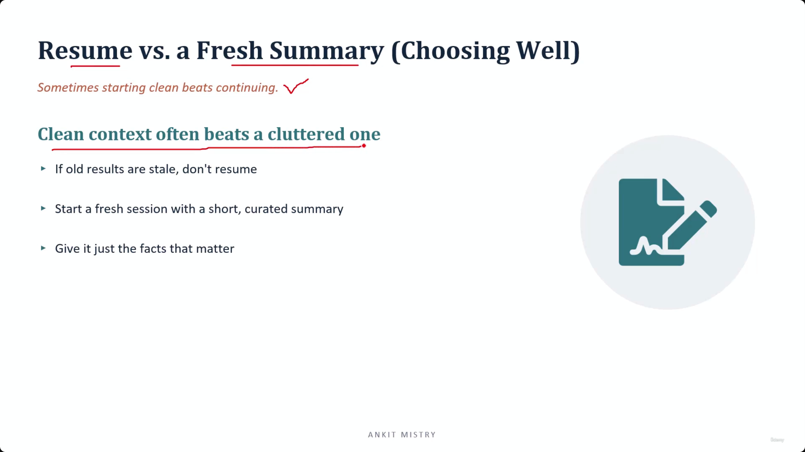
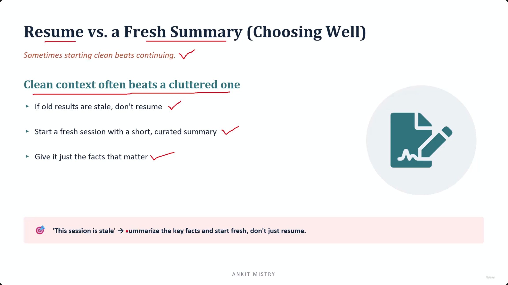

[00:00:00](https://www.udemy.com/course/claude-ai-certification/learn/lecture/57909013#overview)

## Session State: Fork

- Branch to explore — without losing the original.
- **[Purpose]** To allow experimentation on a copy of a session
    - This prevents the original session from being altered or lost while exploring new ideas or paths

[00:00:37](https://www.udemy.com/course/claude-ai-certification/learn/lecture/57909013#overview)

### What Is Forking?

- Copy the session and experiment on the copy
- **[A safe sandbox]**
    - `fork_session` branches a session into a copy
    - You explore on the fork; the original stays untouched
    - Try an approach without risk

[00:01:48](https://www.udemy.com/course/claude-ai-certification/learn/lecture/57909013#overview)

### The Mechanics of Forking

- Creating a second copy rather than moving the existing one
    - You end up with two distinct sessions: the original (exactly as it was) and the copy
    - You are free to "make a mess" of the copy without consequence
- **[The core promise]** Whatever occurs on the branch cannot harm the original context
    - This is vital because all of Claude's knowledge is tied to that specific conversation
    - Without forking, testing a bad approach risks permanently altering your main session

[00:02:09](https://www.udemy.com/course/claude-ai-certification/learn/lecture/57909013#overview)

[00:02:44](https://www.udemy.com/course/claude-ai-certification/learn/lecture/57909013#overview)

### Preventing Context Pollution

- Without forking, experimentation risks polluting the main session
    - Wrong turns and bad approaches become a permanent part of the conversation history
- **[The solution]** With a fork, the 'mess' is contained
    - The experiment stays on the copy, and once finished, the copy is simply thrown away
    - The main session remains unaware the experiment ever happened

## Branch-and-Throw-Away

- **[The working habit]** Keep a stable base; fork per experiment
- **Rule: Trunk stays clean; branches are disposable**
    - Keep one stable, long-lived session as your base (the "trunk")
    - Fork it for each individual investigation
    - Throw the forks away when done

[00:03:16](https://www.udemy.com/course/claude-ai-certification/learn/lecture/57909013#overview)

### The Trunk and Branch Model

- **[The Analogy]** Visualizing the session structure like a tree
    - The **Trunk**: Your main session, which you protect carefully
    - The **Branches**: As many temporary copies as you need for investigation
- **[Why this works]** It separates reliability from exploration
    - The trunk stays reliable and stable
    - Messy exploration lives on disposable branches
- **[The ultimate benefit]** You gain a clean source of truth
    - Every risky or half-formed idea happens in a space that doesn't matter if it fails

[00:03:38](https://www.udemy.com/course/claude-ai-certification/learn/lecture/57909013#overview)

[00:04:17](https://www.udemy.com/course/claude-ai-certification/learn/lecture/57909013#overview)

### The Value of Low-Cost Failure

- If an experiment fails, don't try to repair it
    - Simply discard that branch and fork again from the trunk
- **[The psychological shift]** When experiments cost nothing, you try more of them
    - Increased experimentation is often the path to finding a better approach

## Resume vs. a Fresh Summary (Choosing Well)

- **[The core principle]** Clean context often beats a cluttered one
- If old results are stale, don't resume
    - Instead, start a fresh session with a short, curated summary
    - Provide only the facts that matter to avoid cluttering the context

[00:04:43](https://www.udemy.com/course/claude-ai-certification/learn/lecture/57909013#overview)

### The Power of Curated Summaries

- **[The reflex]** When you realize "This session is stale," follow this pattern:
    - Summarize the key facts
    - Start a fresh session
    - **Do not just resume**
- **[Why curation matters]** It prevents the "stale material" problem
    - Simply dumping an old transcript into a new session drags the same outdated context back in
    - A **curated** summary means deliberately choosing only the handful of facts that are still relevant
    - This ensures the new session has clean, high-signal context rather than cluttered, low-signal history

### Validating Curated Summaries

- **[The Litmus Test]** To ensure a summary is high-signal enough to start a fresh session, ask yourself:
    - "If I only knew what is written in this summary, could I carry on properly?"
    - If the answer is **no**, then essential context is missing and the summary needs more detail

---

## Lecture Summary: Session Management Skills

- **Forking = Safe Branching**
    - Use forking to experiment without risking the original session
    - The "mess" stays contained on the copy, protecting the trunk
- **Curated Summaries = Clean Context**
    - When results become stale, do not simply resume
    - Start a fresh session using a deliberate, high-signal summary to avoid dragging in outdated or cluttered information

### Decision-Making Framework: When to Pivot

- **[The Branch-and-Discard Habit]**
    - Fork for investigation, then treat the forks as disposable
    - **[The goal]** Protect the main "trunk" by being happy to throw away any experimental "branches"
- **[The Stale vs. Fresh Rule]**
    - If a session becomes stale, start a fresh one using a curated summary
    - **[The principle]** Clean context often beats a cluttered one
    - **[The nuance]** This is a judgment call, not an automatic rule; apply it when the signal-to-noise ratio drops