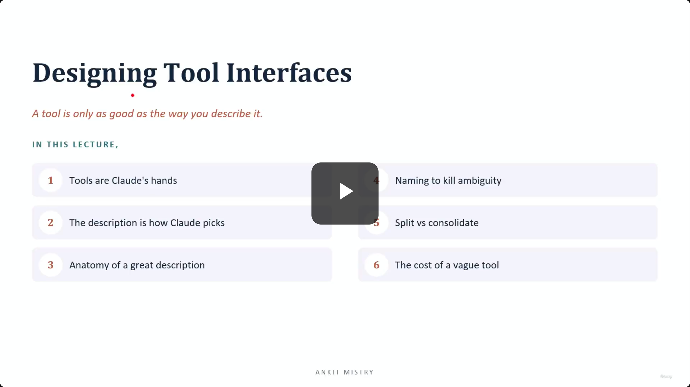
[00:00:00](https://www.udemy.com/course/claude-ai-certification/learn/lecture/57460121#overview)

## Designing Tool Interfaces

- A tool is only as good as the way you describe it.

### Lecture Overview

- 1. Tools are Claude's hands
- 2. The description is how Claude picks
- 3. Anatomy of a great description
- 4. Naming to kill ambiguity
- 5. Split vs consolidate
- 6. The cost of a vague tool

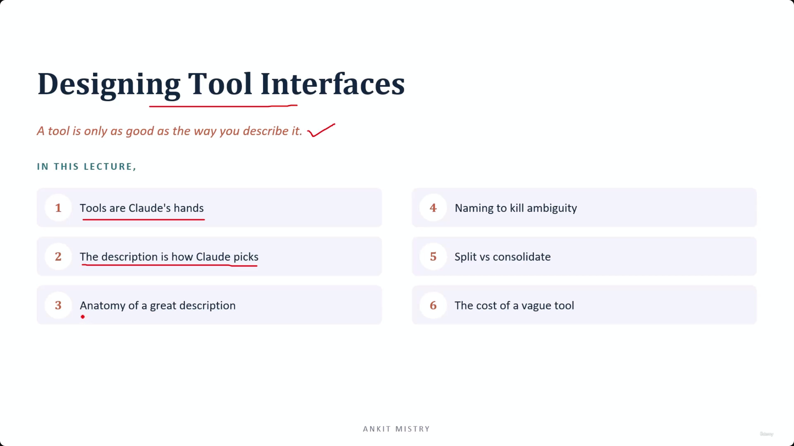
[00:00:42](https://www.udemy.com/course/claude-ai-certification/learn/lecture/57460121#overview)


[00:01:26](https://www.udemy.com/course/claude-ai-certification/learn/lecture/57460121#overview)

### Tools Are Claude's Hands

- **[Core Concept]** Talk is cheap — tools let Claude act.
- A tool is a function that Claude can call to perform a specific action
    - Examples include looking up an order, sending an email, or querying a database
- Without tools, Claude is limited to conversation (it can only talk)
- Each tool represents a single, discrete action that Claude can reach for

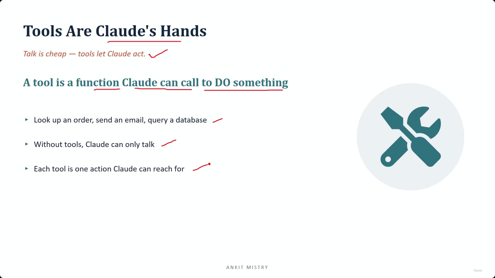
[00:01:27](https://www.udemy.com/course/claude-ai-certification/learn/lecture/57460121#overview)

### The Transition from Words to Actions

- **[The Core Transition]** Claude is a clever system that primarily produces words; tools are what turn those words into actions in the real world
    - Without tools, Claude can only describe things
    - With tools, Claude can actually *do* things
- **The Request-Execution Loop**
    - This connects back to the fundamental interaction pattern: Claude requests a tool, and your code executes it
    - A tool is simply one of the specific items that Claude can ask for in this loop

### The Description is How Claude Picks

- **[Critical Limitation]** Claude cannot see your actual code; it only sees the description you provide
    - When Claude decides which tool to use, it makes its selection based solely on the tool's **name** and its **description**
    - It has no visibility into the logic, parameters, or implementation inside your function
- **The Shopkeeper Analogy**
    - Choosing a tool is like a shopkeeper trying to find an item by reading only the labels on the boxes
    - If the label is vague or misleading, the shopkeeper (Claude) will pick the wrong box or fail to find anything at all
- **The Risk of Vague Descriptions**
    - A poorly written description leads to two failure modes:
            - The wrong tool is selected for the task
            - No tool is selected at all because Claude doesn't realize a tool exists that fits the request

### The Description as a Selection Mechanism

- **[The Golden Rule]** You write the description for Claude, not for yourself
    - It is a common mistake to treat descriptions as developer notes or internal documentation
    - Because the description is the only information Claude has to make a decision, it must be optimized for the AI's reasoning process
- **The Risk of "Choosing Blind"**
    - Since Claude cannot "peek" into the underlying code to understand the logic
    - If the label (description) is unclear, Claude is essentially forced to make a choice without seeing the actual implementation
    - This lack of visibility makes the clarity of the description the single most important factor in successful tool selection

### The Anatomy of a Great Description

To move beyond vague labels, a high-quality description should be structured into four specific parts:

1. **The Action (What it does)**

    - A single, clear line describing the primary function of the tool.

2. **The Context (When to use it)**

    - Explicitly stating the scenarios where this tool is appropriate.
    - **[Crucial Detail]** Also include when *not* to use the tool to prevent misuse or incorrect selection.

3. **The Parameter Definitions (What to pass)**

    - An explanation of every parameter using plain, unambiguous language.

4. **The Example (A sample call)**

    - A short, tiny example of a sample function call to illustrate the expected input/output pattern.

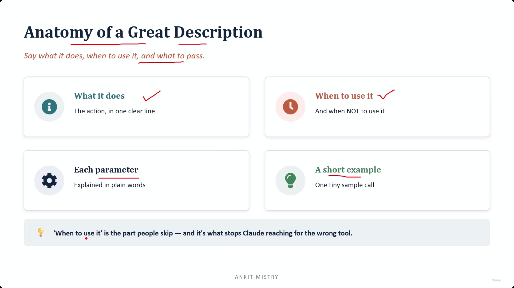
[00:04:47](https://www.udemy.com/course/claude-ai-certification/learn/lecture/57460121#overview)

### The Criticality of Usage Boundaries

- **[The Most Skipped Component]** Specifying "when to use it" and "when NOT to use it"
    - While most descriptions focus on what a tool does, this is the part most developers overlook
    - It is the most vital component for preventing Claude from reaching for the wrong tool
- **Why explicit boundaries matter**
    - Multiple tools might sound reasonable or similar for a specific task
    - Defining the exact line between tools (e.g., "Use this tool for X, but do NOT use it for Y") prevents ambiguity
    - This instruction helps Claude distinguish between overlapping functionalities

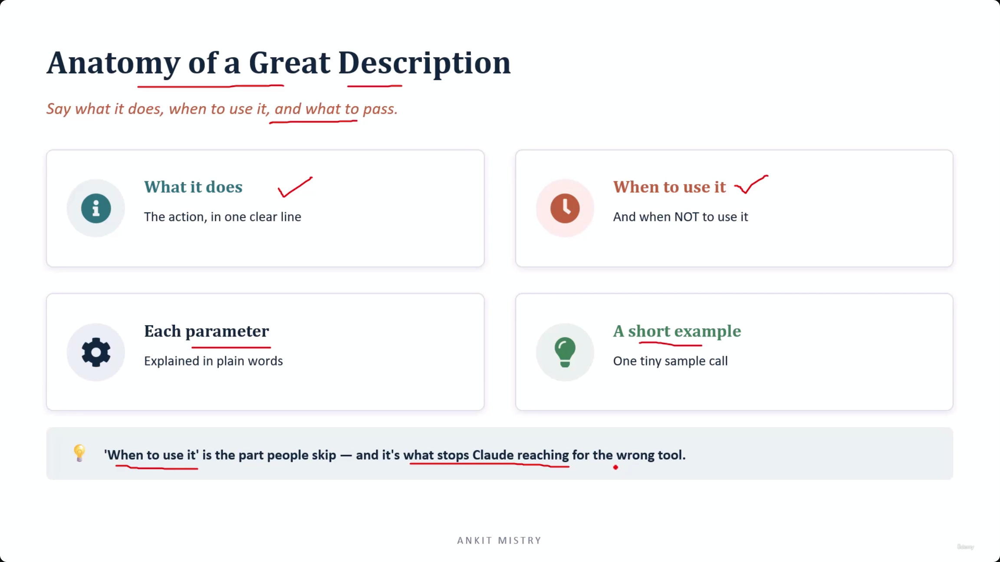
[00:05:13](https://www.udemy.com/course/claude-ai-certification/learn/lecture/57460121#overview)

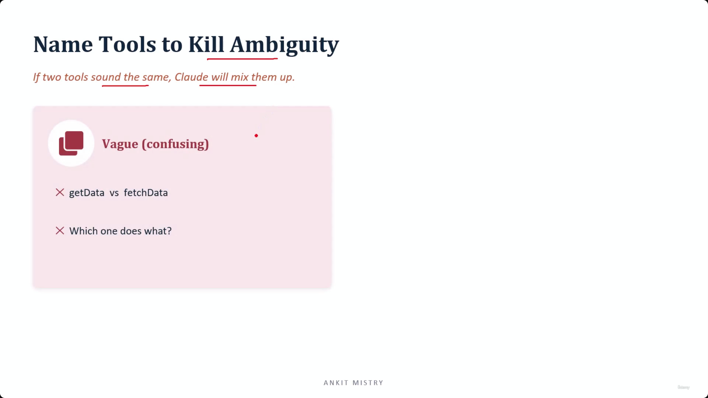
[00:05:33](https://www.udemy.com/course/claude-ai-certification/learn/lecture/57460121#overview)

### Name Tools to Kill Ambiguity

- If two tools sound similar, Claude will mix them up
- **[The Problem of Vague Naming]** Using synonyms or near-identical terms creates confusion
    - Example: `getData` vs `fetchData`
    - In plain English, these mean almost the same thing
    - If a human cannot distinguish between the two names, Claude certainly cannot either

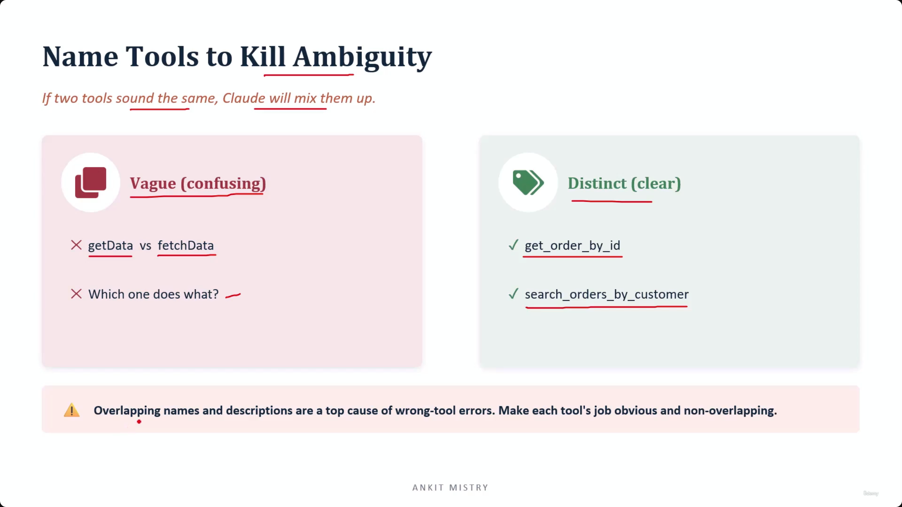
[00:06:36](https://www.udemy.com/course/claude-ai-certification/learn/lecture/57460121#overview)

### Best Practices for Distinct Naming

- **[The Distinct Approach]** Use names that describe the specific scope or method to eliminate guesswork
    - Example: `get_order_by_id` vs `search_orders_by_customer`
    - `get_order_by_id` implies fetching a single specific record when the ID is known
    - `search_orders_by_customer` implies a search operation for multiple records based on a customer attribute
    - This removes all overlap, allowing Claude to identify the correct tool from the name alone

> **Warning:** Overlapping names and overlapping descriptions are a top cause of wrong-tool errors.

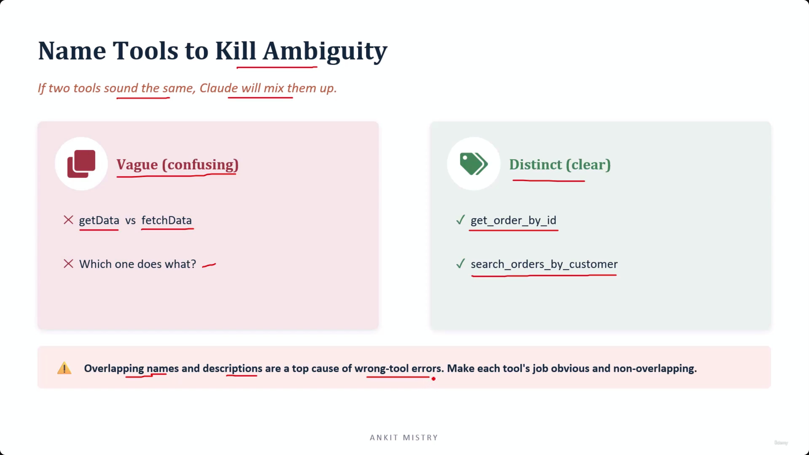
[00:06:43](https://www.udemy.com/course/claude-ai-certification/learn/lecture/57460121#overview)

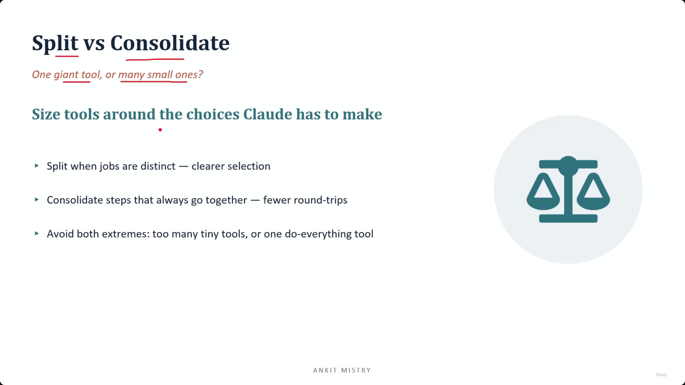
[00:07:24](https://www.udemy.com/course/claude-ai-certification/learn/lecture/57460121#overview)

### Split vs Consolidate

- **[The Core Question]** One giant tool, or many small ones?
- **The Guiding Principle**: Size your tools around the choices that Claude has to make
- **Strategies for sizing**:
    - **Split** when jobs are distinct
        - This leads to clearer selection by the AI
    - **Consolidate** steps that always go together
        - This results in fewer round-trips (improving efficiency)
- **The Goal**: Avoid both extremes
    - Don't create too many tiny, fragmented tools
    - Don't create a single "do-everything" tool

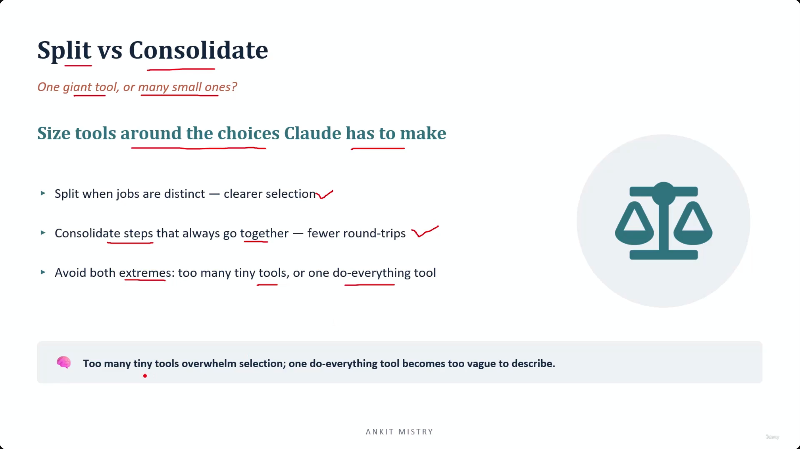
[00:08:04](https://www.udemy.com/course/claude-ai-certification/learn/lecture/57460121#overview)

### The Balance of Tool Sizing

- **[The Goal]** Match the shape of your tools to the actual decisions Claude needs to make
- **Avoid both extremes**
    - **Too many tiny tools**
        - These overwhelm the selection process
    - **One "do-everything" tool**
        - This becomes too vague to describe accurately

> **Key Principle:** Sizing is a balance, not a hard rule.

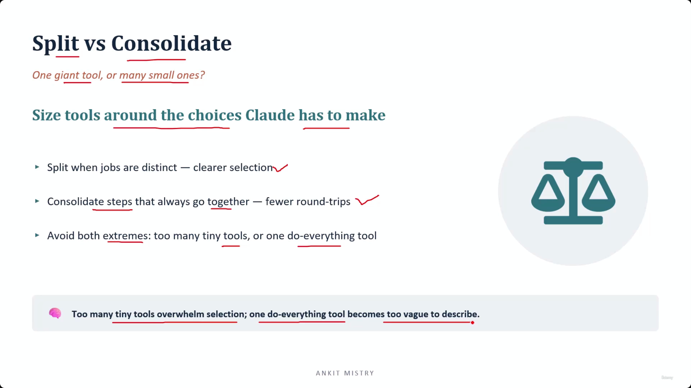
[00:08:14](https://www.udemy.com/course/claude-ai-certification/learn/lecture/57460121#overview)

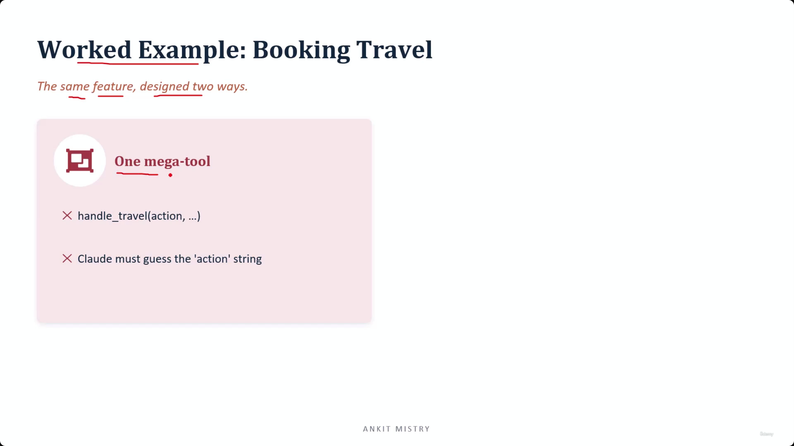
[00:08:52](https://www.udemy.com/course/claude-ai-certification/learn/lecture/57460121#overview)

### Worked Example: Booking Travel

#### Design 1: One Mega-tool

- **Name**: `handle_travel(action, ...)`
- **[The Problem]** Claude is forced to guess the `'action'` string
    - Because the tool is so broad, the specific action isn't explicitly defined by the tool name itself, requiring the AI to provide a string parameter that might be ambiguous.

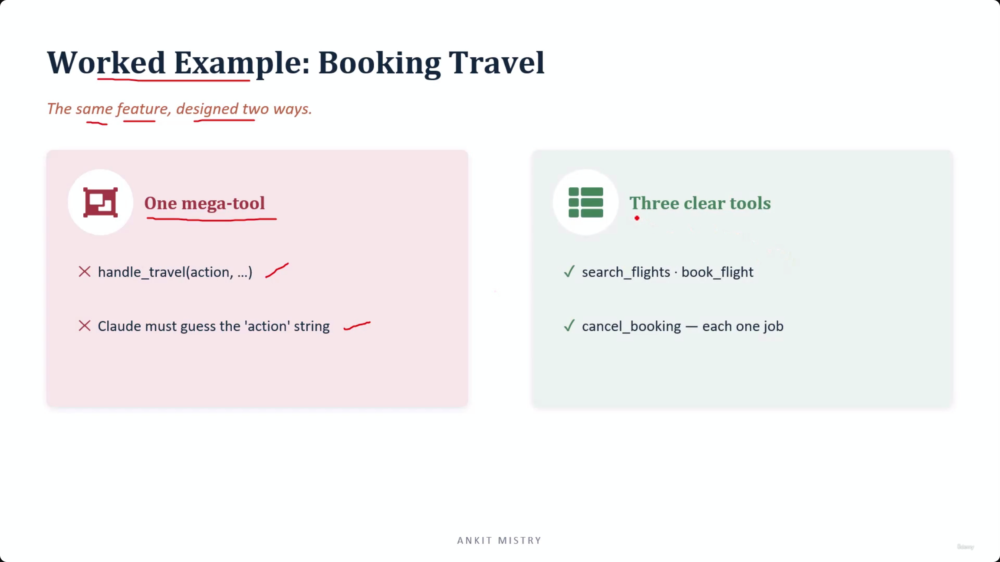
[00:09:33](https://www.udemy.com/course/claude-ai-certification/learn/lecture/57460121#overview)

#### Design 1: One Mega-tool (Continued)

- **[The Problem]** Claude must guess the `'action'` string
    - To use this tool, Claude has to know to pass specific "magic words" like `book`, `search`, or `cancel` into the `action` field.
    - If the AI guesses the wrong string, the entire tool call fails.
    - This design effectively pushes a hard decision down into a parameter where the AI is just guessing.

#### Design 2: Three Clear Tools

- **[The Solution]** Split the functionality into dedicated tools for each specific job:
    - `search_flights`
    - `book_flight`
    - `cancel_booking`
- **[The Benefit]** This approach eliminates guesswork because each tool name and description maps to exactly one job.

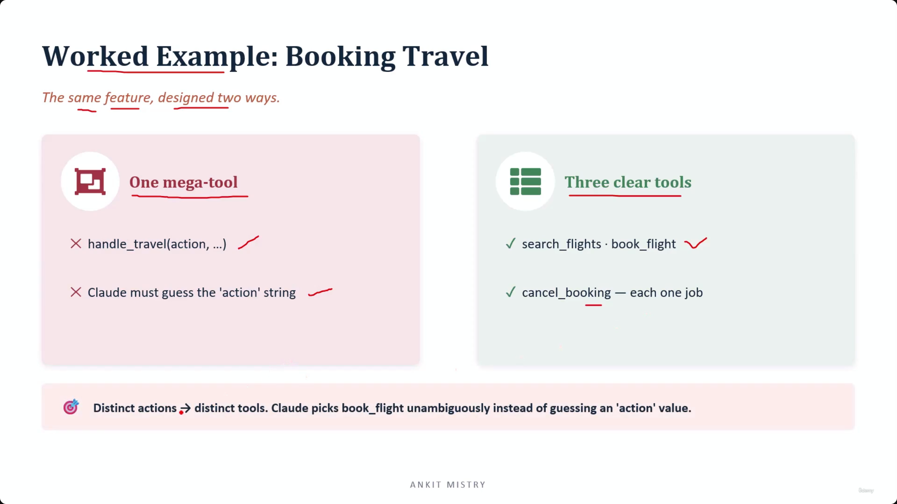
[00:10:00](https://www.udemy.com/course/claude-ai-certification/learn/lecture/57460121#overview)

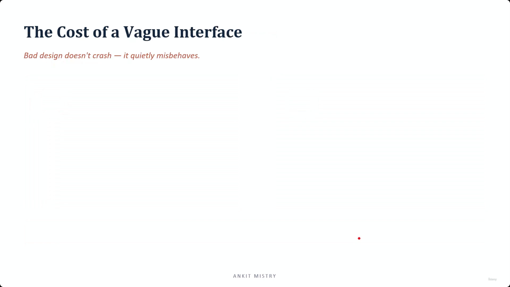
[00:10:27](https://www.udemy.com/course/claude-ai-certification/learn/lecture/57460121#overview)

#### Design 2: Three Clear Tools (Continued)

- **[The Benefit]** Eliminates the need for a "mysterious" action string
    - There is no longer a parameter value that the AI must guess correctly to function
- **[The Shift in Logic]** Moves the decision to the tool selection phase
    - If Claude wants to book, it simply calls `book_flight` directly
    - This leverages the AI's primary strength: picking the right tool for the job

> **The Lesson:** Distinct actions $\rightarrow$ distinct tools.

By turning three different actions into three different tools, a decision that was previously a risky guess becomes a clean, obvious choice.

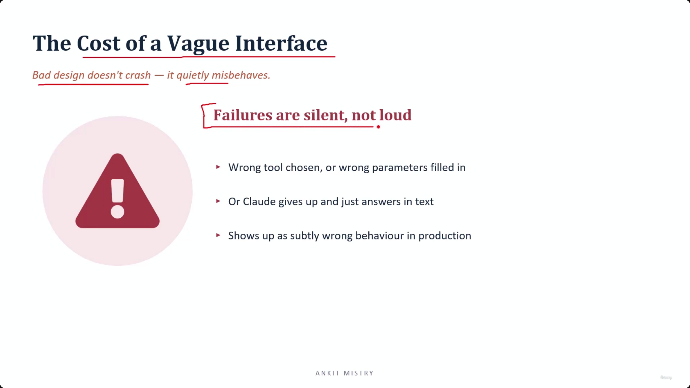
[00:10:47](https://www.udemy.com/course/claude-ai-certification/learn/lecture/57460121#overview)

## The Cost of a Vague Interface

> Bad design doesn't crash — it quietly misbehaves.

### The Nature of Failures

- Failures in vague interfaces are silent, not loud
    - They do not trigger clear, red error messages
    - Instead, they manifest as subtly wrong behavior in production
- **[How failures manifest]**
    - The wrong tool is chosen
    - The wrong parameters are filled in
    - Claude gives up on the tool entirely and simply answers in plain text

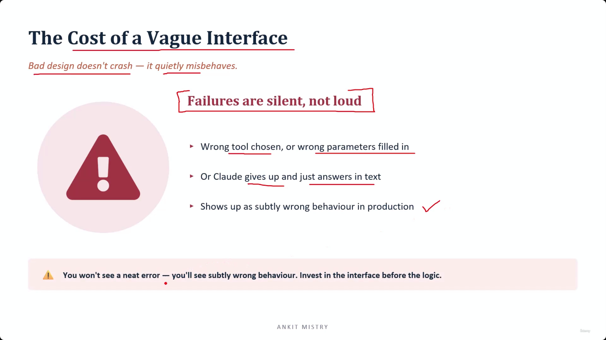
[00:11:21](https://www.udemy.com/course/claude-ai-certification/learn/lecture/57460121#overview)

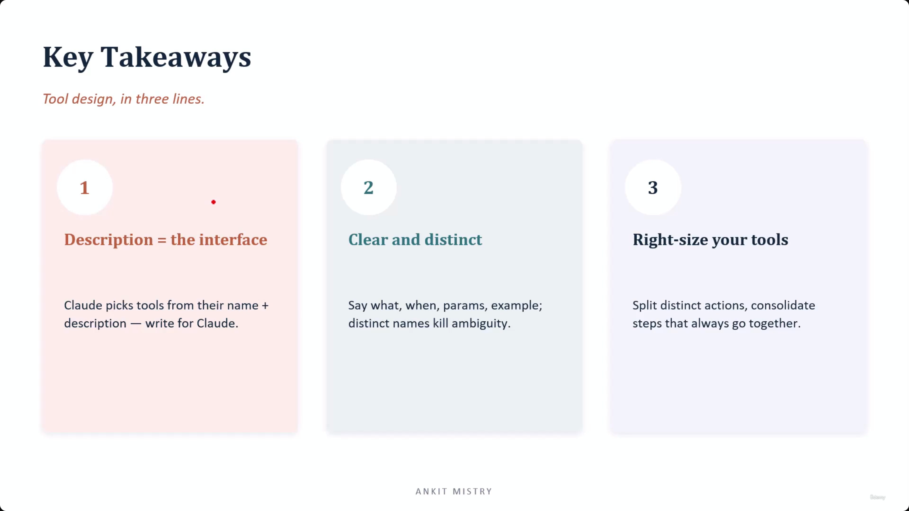
[00:11:57](https://www.udemy.com/course/claude-ai-certification/learn/lecture/57460121#overview)

### Prioritize Interface Over Logic

- **[The core principle]** Invest in the interface before the logic
    - Most developers rush to write clever internal logic for a tool first
    - However, if the tool's name or description is vague, Claude will call that perfect logic at the wrong time or with the wrong inputs
    - The interface is the foundation that everything else depends on

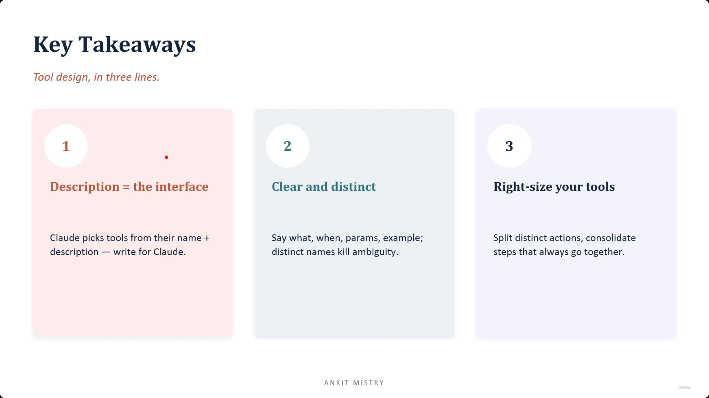
[00:12:01](https://www.udemy.com/course/claude-ai-certification/learn/lecture/57460121#overview)

## Key Takeaways: Tool Design

Tool design can be summarized in three core principles:

| Principle | Description |
| --- | --- |
| 1. Description = the interface | Claude picks tools based on their name and description; you must write specifically for Claude. |
| 2. Clear and distinct | Define what the tool does, when to use it, the required parameters, and provide an example; distinct names are vital to kill ambiguity. |
| 3. Right-size your tools | Split distinct actions into separate tools, but consolidate steps that always go together. |


[00:12:46](https://www.udemy.com/course/claude-ai-certification/learn/lecture/57460121#overview)

### The Interface as a Control Panel

- Names and descriptions are not just supplementary documentation
    - They function as the actual control panel Claude uses to make selections
    - If the interface is vague, Claude will reach for the wrong tool

### Structured Error Responses

- When a tool fails, the error message is Claude's only window into what went wrong
- **[Key concept]** Errors are how the AI learns to navigate failures
    - Effective design involves providing structured error responses
    - This includes using mechanisms like an `isError` flag and categorizing error types

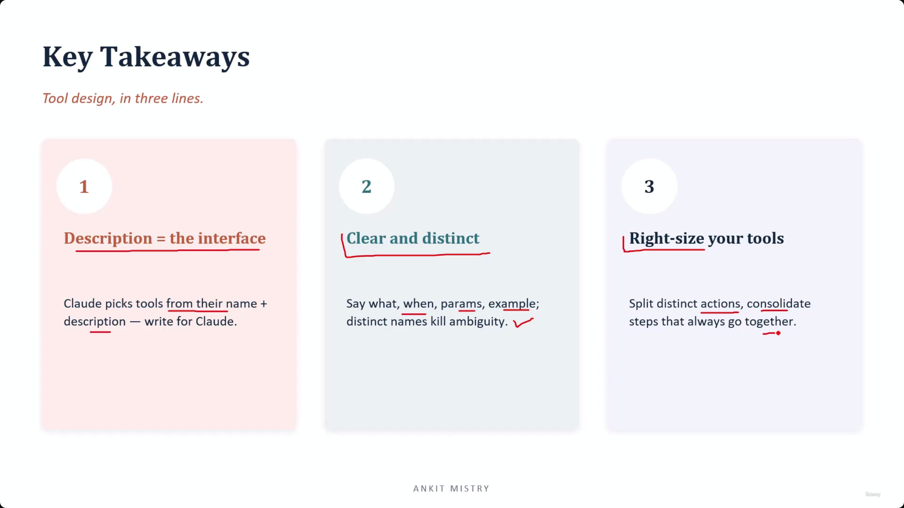
[00:13:31](https://www.udemy.com/course/claude-ai-certification/learn/lecture/57460121#overview)

---

## Simple Explanation (with Claude Examples)

**The core idea, in one line**: Claude can't see your code, only the tool's name and description — so if that description is vague, Claude is essentially picking a box off a shelf by reading a blurry label.

**The shopkeeper analogy**

Choosing a tool is like a shopkeeper finding an item by reading only the label on a box — they never open it to check inside. If the label is vague ("Misc Supplies"), the shopkeeper either grabs the wrong box or gives up looking entirely. Claude works the same way: name and description are the *entire* interface it has to decide with.

*Claude Code example*: In this session, tools like `Read` and `Grep` have tightly scoped descriptions ("opens and views a file" vs. "searches for text inside files"). If both were instead labeled something vague like "get info," I'd have real trouble knowing which one to reach for when you asked me to find where a function is called.

**Write the description for Claude, not for yourself**

It's a common mistake to write descriptions like internal dev notes. But since the description is the *only* information Claude has, it must be optimized for Claude's reasoning, not a future engineer reading your codebase.

**Anatomy of a great description — four parts**

1. **Action** — what it does, one clear line
2. **Context** — when to use it, *and* explicitly when NOT to (the most commonly skipped part!)
3. **Parameters** — plain-language explanation of every input
4. **Example** — a tiny sample call

*Claude Code example*: The `Explore` agent's description in this session doesn't just say "searches code" — it explicitly says "Do NOT use it for code review, design-doc auditing... it reads excerpts rather than whole files." That negative boundary is exactly what stops me from misusing it for a task it's not suited for.

**Naming to kill ambiguity**

`getData` vs. `fetchData` — if a human can't tell them apart, Claude certainly can't. Better: `get_order_by_id` (one specific record) vs. `search_orders_by_customer` (multiple records via search) — names that describe scope, not vague synonyms.

**Split vs. consolidate — sizing your tools**

Split when jobs are genuinely distinct (clearer selection). Consolidate steps that always happen together (fewer round-trips). Avoid both extremes: dozens of tiny fragmented tools, or one "do-everything" tool.

*Worked example from the note*: A single `handle_travel(action, ...)` tool forces Claude to *guess* a magic string like `"book"` or `"cancel"` — if it guesses wrong, the call fails. Splitting into `search_flights`, `book_flight`, `cancel_booking` removes the guesswork entirely: Claude just picks the right tool by name, which is exactly what it's good at.

**The cost of getting this wrong — silent, not loud**

A vague interface doesn't crash. It quietly misbehaves: the wrong tool gets picked, wrong parameters get filled in, or Claude just gives up and answers in plain text instead. None of this throws an error — it just produces subtly wrong behavior in production.

**Recap in 3 lines**

1. **Claude only sees the name and description** — write them *for* Claude, as the actual interface, not as developer notes.
2. **A great description has 4 parts**: action, context (including when NOT to use it), parameters, and an example.
3. **Right-size your tools** — split genuinely distinct actions, consolidate steps that always travel together.

---

## Exam Objective Note: CCAR-F 2.1 — Tool Interface Design (Domain 2 · 18% of exam)

**The core claim: vague descriptions cause three specific symptoms**

Since Claude can't see your actual code — only the name and description you wrote — a vague description causes three specific, recognizable failures:

1. **Guessed parameter formats** — no clear format specified, so Claude guesses (sometimes `"2026-03-05"`, sometimes `"March 5, 2026"`).
2. **Wrong tool picked for adjacent work** — two tools sound similar, Claude reaches for the "close enough" one instead of the correct one.
3. **Tool abandoned after one failure** — an unhelpful error message causes Claude to give up on the tool entirely instead of retrying correctly.

*Example*: the `handle_travel(action, ...)` mega-tool from earlier in this note — Claude had to *guess* a magic string like `"book"` or `"cancel"`, and any wrong guess caused the whole call to fail.

**Fix 1 — put constraints in the schema, not in prose**

Instead of writing "status must be one of: active, pending, or closed" as a sentence, define it as an `enum` in the schema itself:

```json
"status": { "enum": ["active", "pending", "closed"] }
```

A constraint written in prose is just a suggestion Claude might follow — it can still produce a value outside the list, which you'd then have to catch and fix afterward. A constraint baked into the schema's actual *shape* stops the wrong value from being generated in the first place — like handing someone a dropdown menu instead of asking them to type a color and hoping they pick red, blue, or green.

**Fix 2 — shape the result, don't dump everything**

If a tool returns 90 fields but the next decision only needs 3, all 90 still eat up context space regardless of whether they're used.

*Everyday analogy*: asking "is the store open?" and being handed the entire 200-page operations manual instead of a simple "yes" — the answer's in there, but at a much higher cost than needed.

**Recap in 3 lines**

1. **Vague descriptions produce guessed formats, wrong tool picks, and abandoned tools** — three specific, testable symptoms, not vague "confusion."
2. **Bake constraints into the schema (enums), not prose** — this prevents bad values instead of catching them after the fact.
3. **Shape tool output to only what's needed** — returning everything "just in case" wastes context on every call.