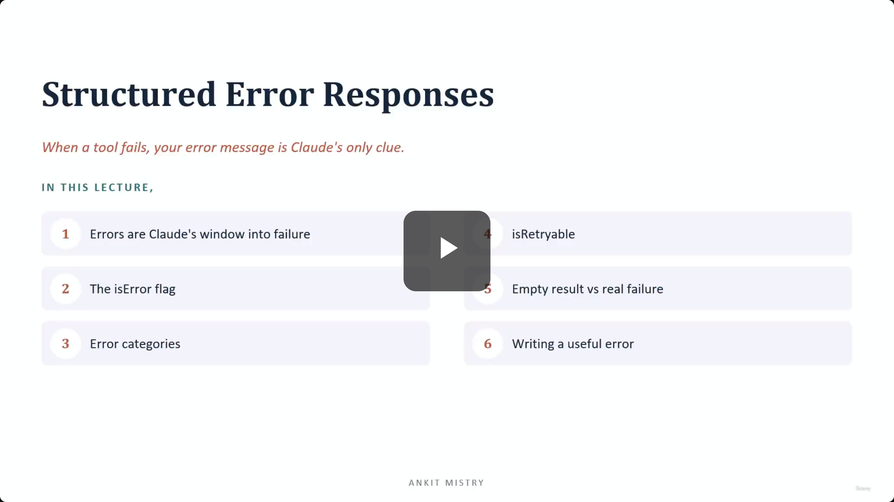
[00:00:00](https://www.udemy.com/course/claude-ai-certification/learn/lecture/57460123#overview)

## Structured Error Responses

- When a tool fails, the error message is Claude's only clue to what went wrong
    - Even perfectly described tools can fail due to external issues like:
        - Payment bounces
        - Database downtime
        - Missing data (e.g., an order simply isn't there)

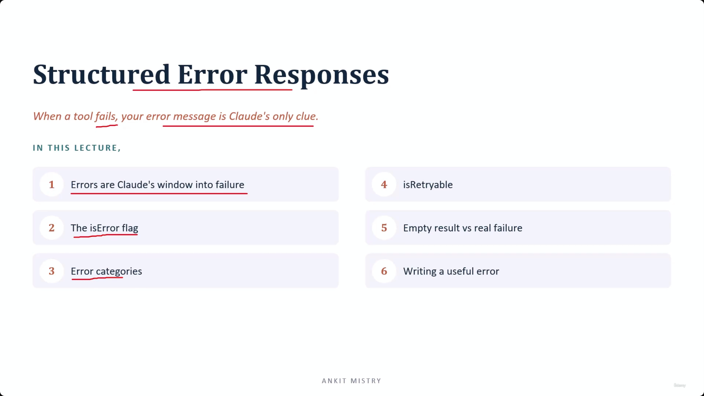
[00:00:45](https://www.udemy.com/course/claude-ai-certification/learn/lecture/57460123#overview)

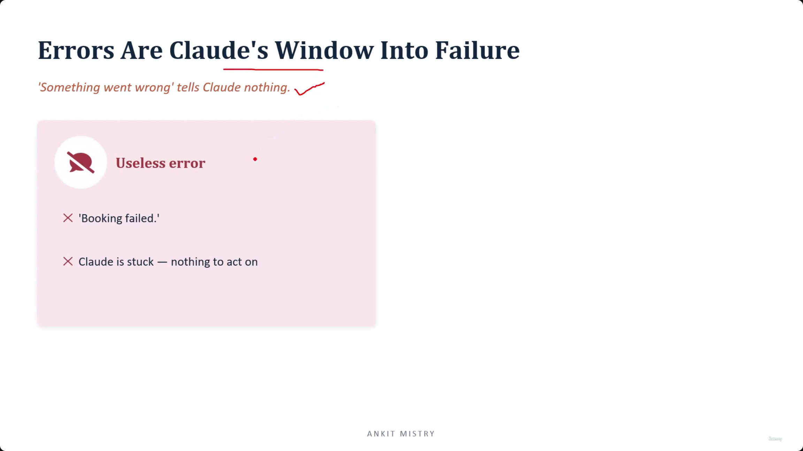
[00:01:10](https://www.udemy.com/course/claude-ai-certification/learn/lecture/57460123#overview)

### Errors Are Claude's Window Into Failure

- Generic messages like "Something went wrong" provide no information to the model
- **[The Useless Error Example]**
    - Error: `"Booking failed."`
    - Result: Claude is stuck with nothing to act on
    - Why: It doesn't specify the cause (e.g., was it a credit card issue?)

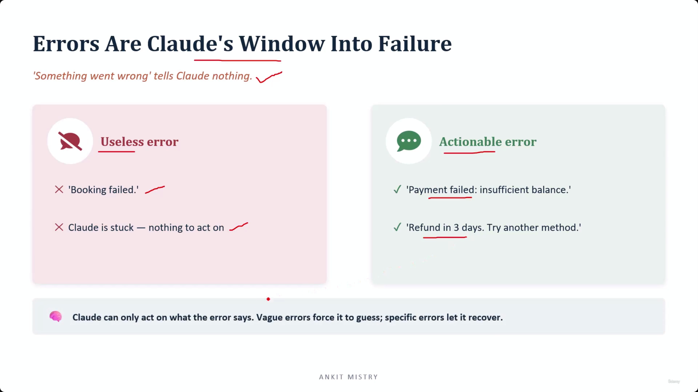
[00:02:13](https://www.udemy.com/course/claude-ai-certification/learn/lecture/57460123#overview)

### Actionable vs. Useless Errors

- **[Useless Error]**
    - Example: `'Booking failed.'`
    - Problem: Does not explain the cause (e.g., was the card declined, was the flight full, or was the service down?)
    - Result: Claude is stuck because it has no information to act upon
- **[Actionable Error]**
    - Example: `'Payment failed: insufficient balance. Refund in 3 days. Try another method.'`
    - Benefit: It identifies exactly what broke and hints at the next move
    - Result: Claude can take sensible actions, such as:
        - Telling the customer their balance is low
        - Suggesting a different payment method


[00:02:14](https://www.udemy.com/course/claude-ai-certification/learn/lecture/57460123#overview)

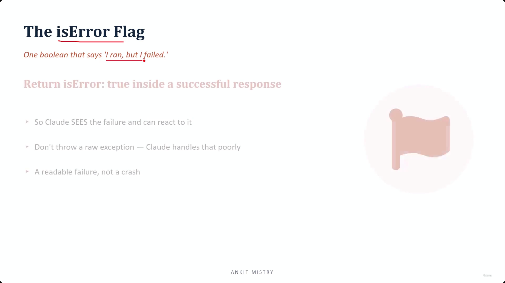
[00:02:58](https://www.udemy.com/course/claude-ai-certification/learn/lecture/57460123#overview)

### The Importance of Error Specificity

- Claude can only act on what the error message actually says
    - It is not sitting inside your system watching what happened
    - The error text is the entire window it has into what went wrong
- **[The Core Principle]**
    - Vague errors force the model to guess
    - Specific errors let the model recover

### The isError Flag

- A single boolean value (true/false)
    - Indicates that a tool ran, but the execution failed

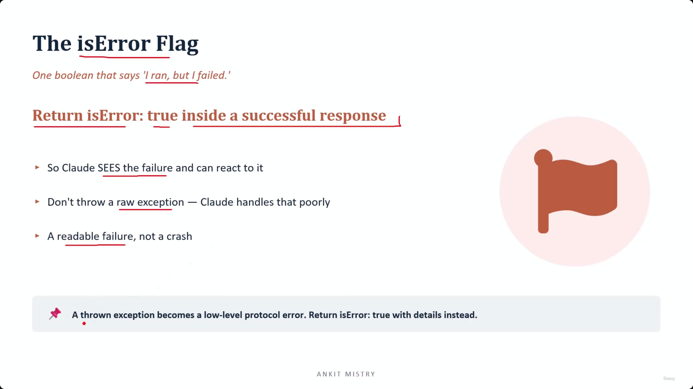
[00:03:41](https://www.udemy.com/course/claude-ai-certification/learn/lecture/57460123#overview)

### Implementing Readable Failures

- **The Technical Distinction**
    - The tool call itself should succeed at the technical level to prevent a system crash
    - Instead of throwing a raw exception, return a response containing `isError: true`
- **Why Avoid Raw Exceptions?**
    - Claude handles raw exceptions poorly, often treating them as low-level protocol errors
    - By returning a structured error within a successful response, you provide a "readable failure" that Claude can interpret and act upon

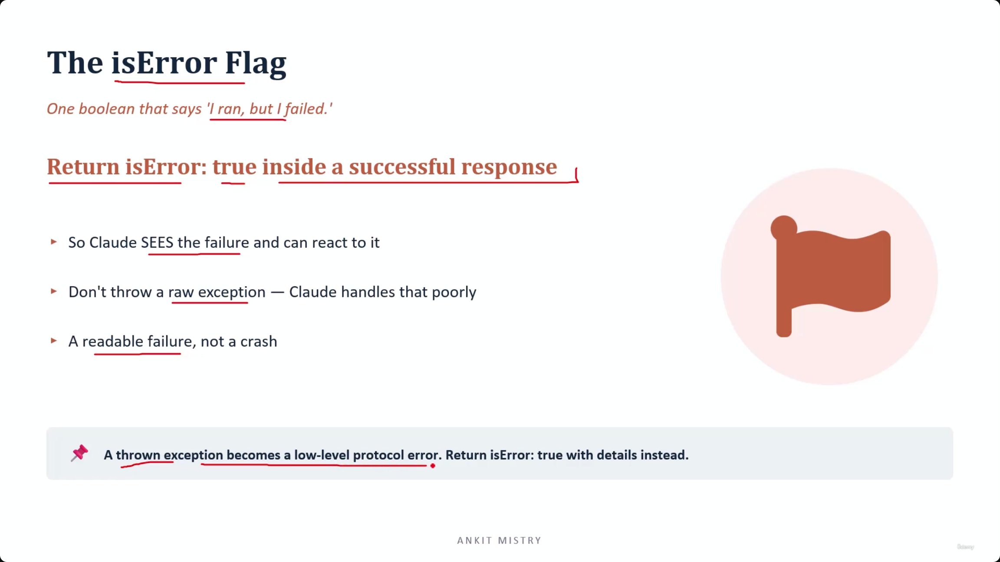
[00:03:44](https://www.udemy.com/course/claude-ai-certification/learn/lecture/57460123#overview)

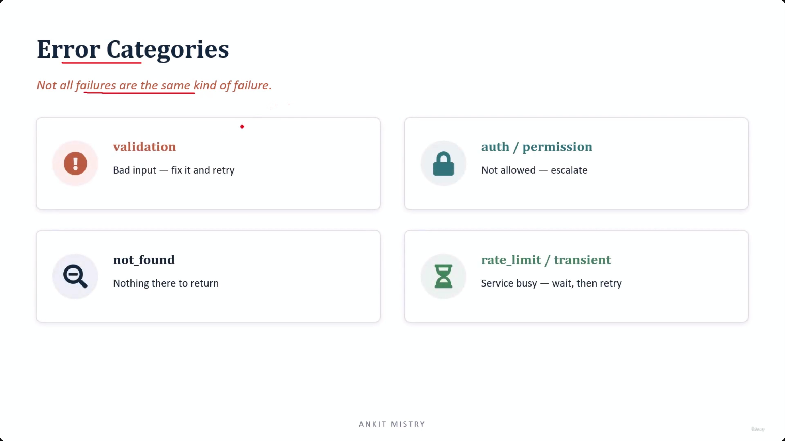
[00:04:27](https://www.udemy.com/course/claude-ai-certification/learn/lecture/57460123#overview)

### Exception vs. Structured Error

- **[The Problem with Exceptions]**
    - A thrown exception becomes a low-level protocol error
    - This happens at the "plumbing" level, below the conversation
    - Result: Claude cannot see, reason about, or act upon the failure
- **[The Solution: Handing Failures Gently]**
    - Return `isError: true` along with specific details inside a normal response
    - This arrives as a message Claude can actually read and interpret
    - **[Why this works]** It transforms a system crash into actionable data

## Error Categories

- Not all failures are the same kind of failure
- **Common categories include:**
    - `validation`: Bad input — fix it and retry
    - `auth / permission`: Not allowed — escalate
    - `not_found`: Nothing there to return
    - `rate_limit / transient`: Service busy — wait, then retry

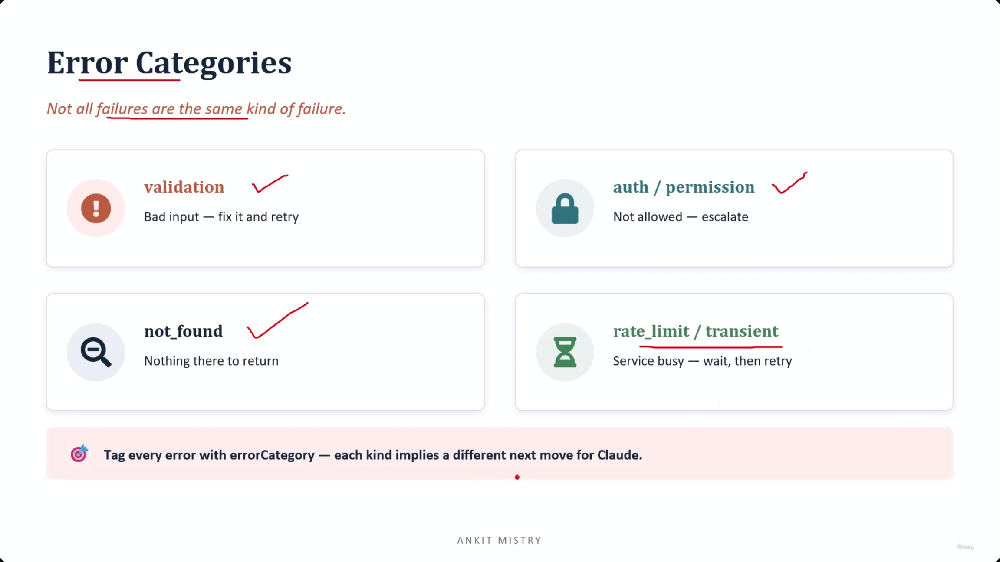
[00:05:10](https://www.udemy.com/course/claude-ai-certification/learn/lecture/57460123#overview)

### Error Tagging for Recovery

- **[The Core Strategy]**
    - To ensure Claude takes the correct path, every error should be explicitly tagged with its specific category
    - This transforms a simple error message into a set of instructions for the next move
- **[Mapping Failures to Actions]**
    - The goal is to ensure the response points to a distinct recovery strategy:
        - **Bad input** $\rightarrow$ Fix and retry
        - **Not allowed** $\rightarrow$ Escalate
        - **Nothing there** $\rightarrow$ Accept/End
        - **Service busy** $\rightarrow$ Wait and retry

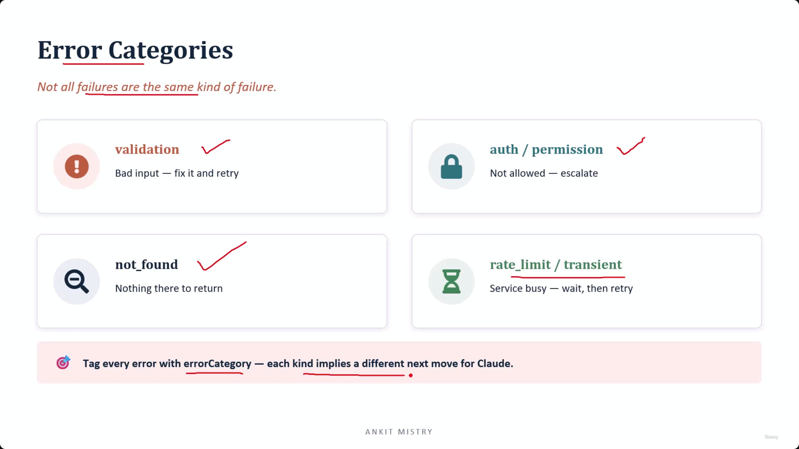
[00:05:14](https://www.udemy.com/course/claude-ai-certification/learn/lecture/57460123#overview)

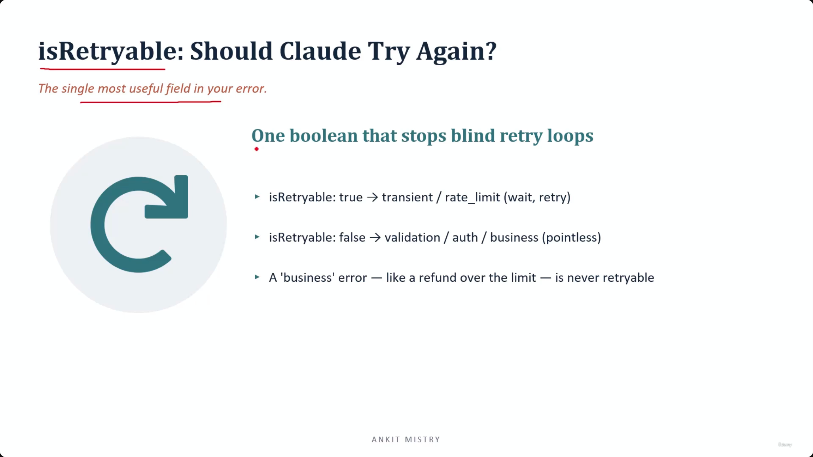
[00:05:55](https://www.udemy.com/course/claude-ai-certification/learn/lecture/57460123#overview)

### The Power of Error Categorization

- Tagging every error with an `errorCategory` provides a clear decision path for Claude
- **[The Benefit]**
    - Without a tag, every failure looks identical, forcing the model to guess how to react
    - With a tag, a vague failure is transformed into a clear, actionable decision

## isRetryable: Should Claude Try Again?

- Described as the single most useful field in an error response
- A single boolean value (`true` or `false`) that prevents "blind retry loops"
- **[How it guides behavior]**
    - `isRetryable: true` $\rightarrow$ used for `transient` or `rate_limit` errors (wait, then retry)
    - `isRetryable: false` $\rightarrow$ used for `validation`, `auth`, or `business` errors (retrying is pointless)
- **[Example: Business Errors]**
    - A "business error" (e.g., a refund that exceeds a limit) is never retryable

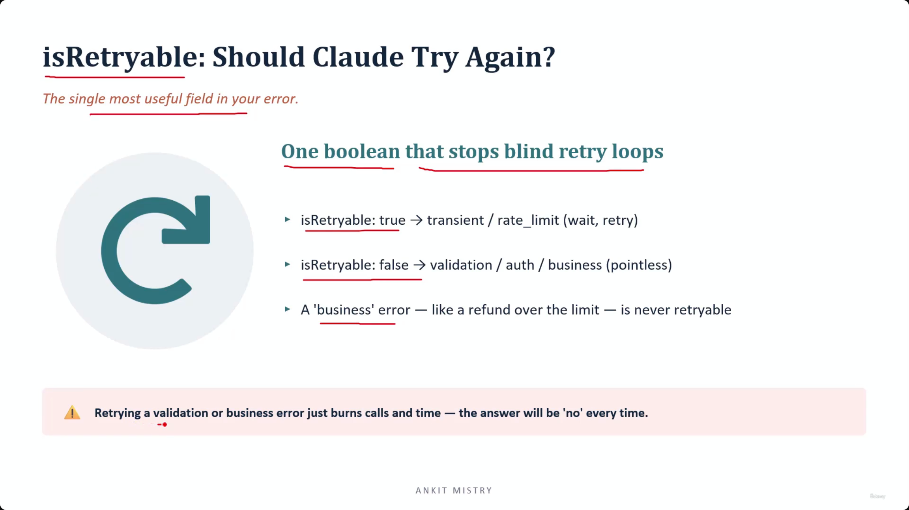
[00:06:38](https://www.udemy.com/course/claude-ai-certification/learn/lecture/57460123#overview)

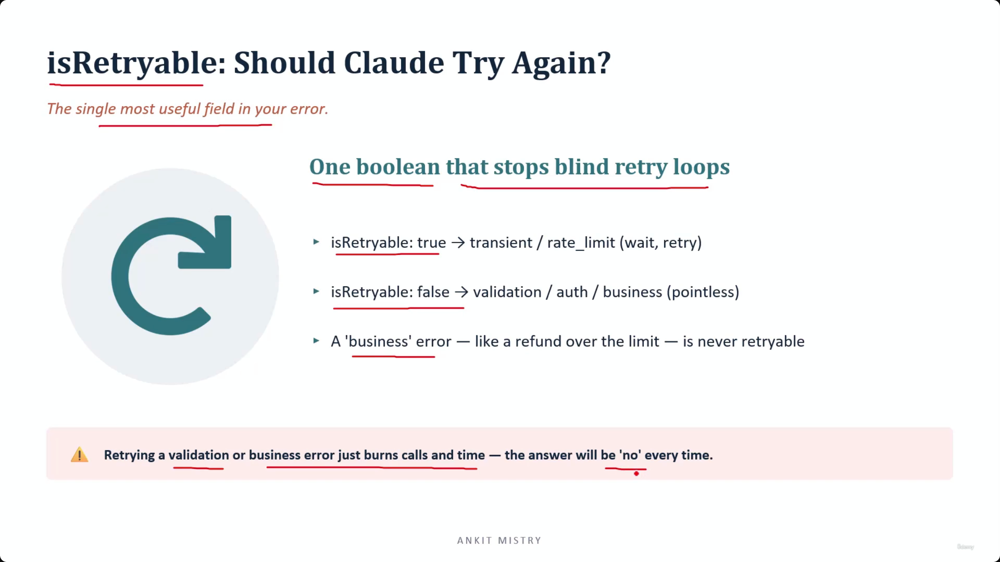
[00:06:45](https://www.udemy.com/course/claude-ai-certification/learn/lecture/57460123#overview)

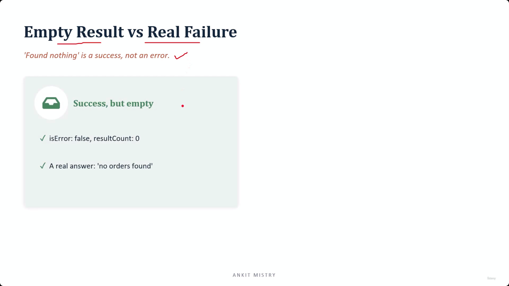
[00:07:25](https://www.udemy.com/course/claude-ai-certification/learn/lecture/57460123#overview)

### The Cost of Blind Retries

- **[The Risk]** Without an `isRetryable` flag, an agent may enter a loop of repeating the same unsuccessful action
    - If input is invalid, it remains invalid on every retry
    - If a business policy is violated (e.g., a refund limit), it will continue to fail on every attempt
- **[Consequence]** This wastes both time and money (API calls) on operations that can never succeed

---

## Empty Result vs Real Failure

- **[Core Principle]** "Found nothing" is a success, not an error
- **[Success, but empty]** When a search or query returns no results, it should be reported as a successful operation with an empty set
    - Example response structure:

```json
{
        "isError": false,
        "resultCount": 0
      }
```

    - This provides a real answer: "no orders found" rather than triggering error recovery logic

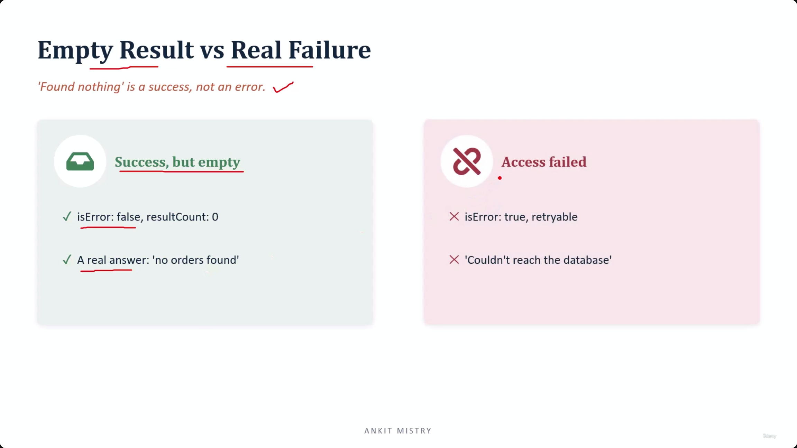
[00:07:55](https://www.udemy.com/course/claude-ai-certification/learn/lecture/57460123#overview)

### Distinguishing Success from Connectivity Failures

- **[Success, but empty]** The tool performed its task perfectly and correctly reported that no data exists
    - Example: Searching for orders and finding none
    - Response structure:

```json
{
        "isError": false,
        "resultCount": 0
      }
```

    - **[Key takeaway]** This is a complete and successful answer, not a failure
- **[Real Failure: Access Failed]** The tool was unable to perform its task because it couldn't reach the necessary data source
    - Example: "Couldn't reach the database"
    - Response structure:

```json
{
        "isError": true,
        "isRetryable": true
      }
```

    - **[Why it differs]** Unlike an empty result, the tool never actually got to look at the data, meaning it doesn't know if orders exist or not

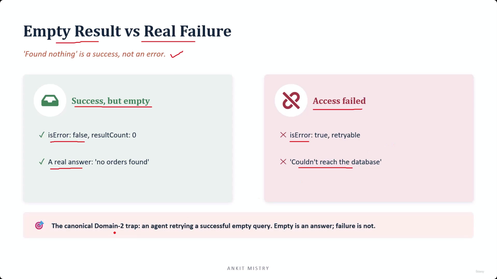
[00:08:21](https://www.udemy.com/course/claude-ai-certification/learn/lecture/57460123#overview)

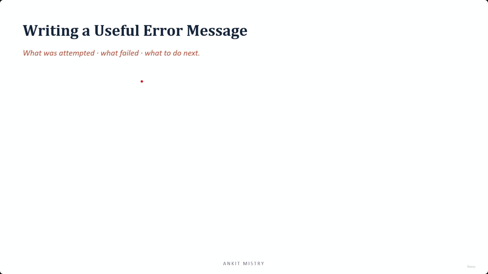
[00:08:56](https://www.udemy.com/course/claude-ai-certification/learn/lecture/57460123#overview)

### The Distinction Between Empty Results and Failures

- **[The Canonical Trap]** An agent retrying a successful empty query
    - This occurs if an empty result is mistakenly reported as an error
    - The agent will continuously hunt for data that does not exist, wasting resources
- **[Comparison]**

| Scenario | isError | retryable | Meaning |
| --- | --- | --- | --- |
| Success, but empty | false | N/A | The tool worked perfectly; the answer is simply "nothing found" |
| Access failed | true | true | A genuine failure (e.g., database unreachable) that is worth retrying |

- **[Key Rule]** "Empty is an answer; failure is not"
        - An empty result must explicitly communicate: "I succeeded, and the answer is nothing"

## Writing a Useful Error Message

- To be effective, an error message should cover:
        - What was attempted
        - What failed
        - What to do next

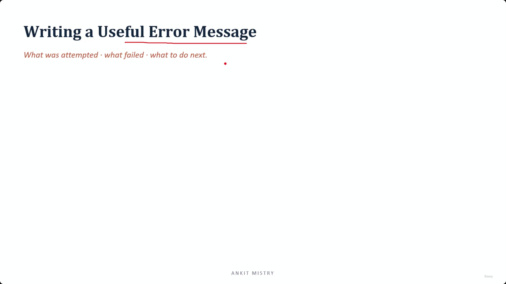
[00:09:00](https://www.udemy.com/course/claude-ai-certification/learn/lecture/57460123#overview)

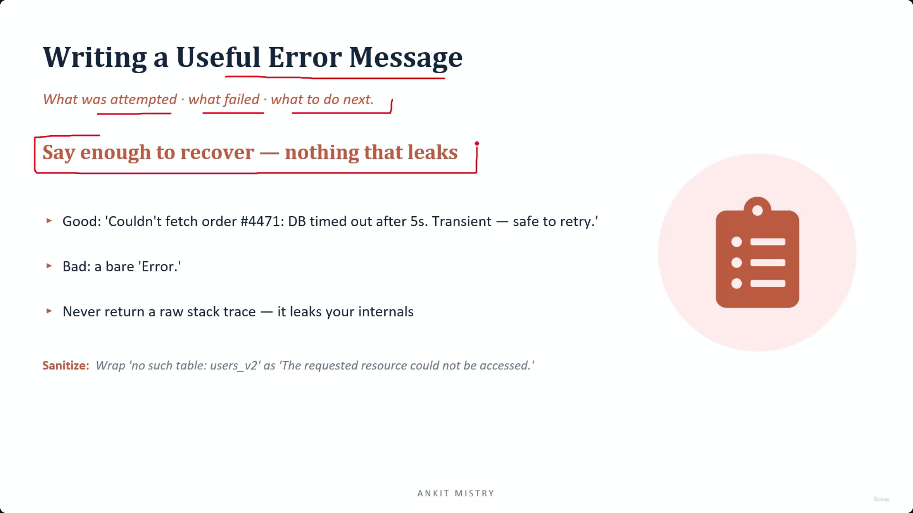
[00:09:14](https://www.udemy.com/course/claude-ai-certification/learn/lecture/57460123#overview)

### The Error Message Balance

- **[Core Principle]** Say enough to recover — nothing that leaks
- **[The Recipe]** A useful message should cover:
    - What was attempted
    - What failed
    - What to do next
- **Comparison of Error Quality**
    - **Good:** Provides context and guidance
        - *Example:* "Couldn't fetch order #4471: DB timed out after 5s. Transient — safe to retry."
    - **Bad:** Provides no utility
        - *Example:* A bare "Error."
    - **Dangerous:** Leaks system internals
        - *Example:* Returning a raw stack trace
- **Sanitization**
    - **[Why sanitize?]** Raw technical errors leak your internal implementation details to the LLM/user
    - **[How to sanitize]** Wrap specific, low-level errors into safe, high-level descriptions
        - *Instead of:* `no such table: users_v2`
        - *Use:* `The requested resource could not be accessed.`

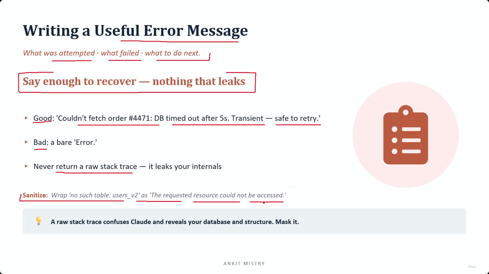
[00:09:58](https://www.udemy.com/course/claude-ai-certification/learn/lecture/57460123#overview)

### The Dual Purpose of Masking Errors

- **[Goal 1] Help the LLM**
    - A raw stack trace acts as "noise" to Claude
    - This noise makes it significantly harder for the model to identify and understand the actual problem
- **[Goal 2] Protect the System**
    - Raw technical errors reveal the internal structure of your system
    - They can act as a "free map" for outsiders, exposing sensitive details like:
        - Database table names
        - Internal file paths
- **[The Solution] One clean, sanitized message fixes both issues**

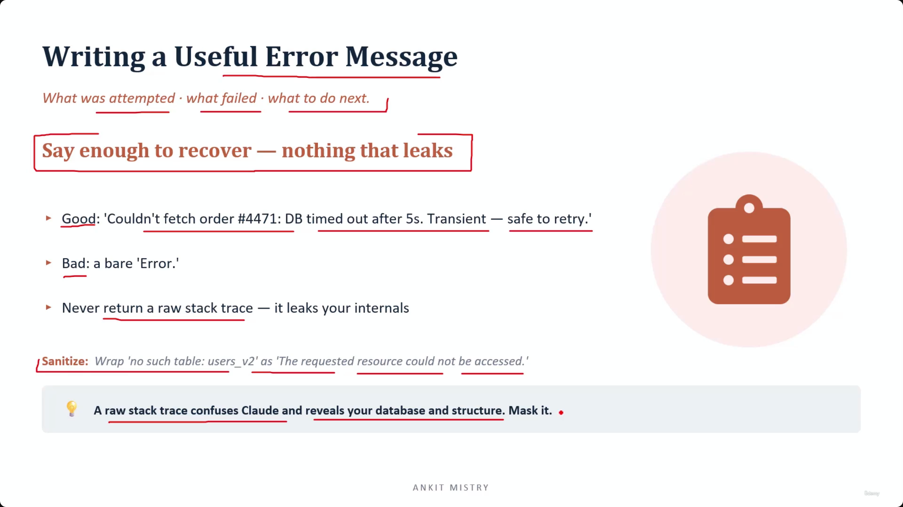
[00:10:32](https://www.udemy.com/course/claude-ai-certification/learn/lecture/57460123#overview)

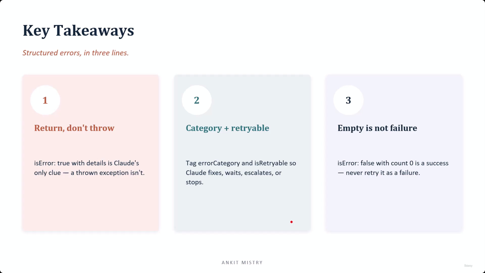
[00:10:34](https://www.udemy.com/course/claude-ai-certification/learn/lecture/57460123#overview)

## Key Takeaways: Structured Errors

- **[Core Philosophy]** When a tool fails, Claude is not in the room; it relies entirely on the structured data you return to understand the situation.

### 1. Return, Don't Throw

- **[The Problem]** A thrown exception provides no actionable information to the LLM.
- **[The Solution]** Return an error response containing specific details
    - This provides Claude with its only clue to resolve the issue

### 2. Category + Retryable

- **[The Mechanism]** Tag every error with an `errorCategory` and an `isRetryable` flag
- **[The Goal]** This gives Claude a clear decision path so it knows whether to:
    - **Fix** (e.g., bad input)
    - **Wait** (e.g., transient error/rate limit)
    - **Escalate** (e.g., permission denied)
    - **Stop** (e.g., business rule violation)

### 3. Empty is Not Failure

- **[The Distinction]** An empty result is a successful query that found nothing
- **[Implementation]** Use `isError: false` with a `resultCount: 0`
    - **[Why?]** This ensures the agent never incorrectly retries a successful operation as if it were a failure


[00:11:16](https://www.udemy.com/course/claude-ai-certification/learn/lecture/57460123#overview)

### The Role of the Error Message

- **[Core Reality]** Claude cannot see your logs, exceptions, or database
    - The error message is the *only* window it has into what went wrong
- **[The Goal]** A good error is a small, structured note that tells the model:
        - What happened
        - What to do about it
- **[Consequences of Poor Design]**
        - **Good error:** The agent recovers gracefully
        - **Bad error:** The agent guesses or enters an infinite loop

---

## Tool Distribution and Tool Choice

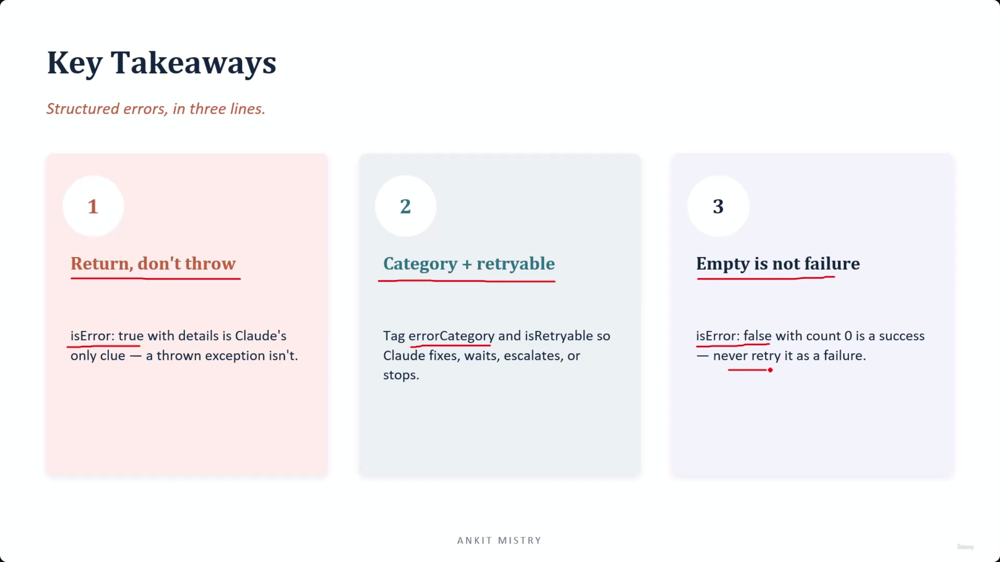
[00:12:01](https://www.udemy.com/course/claude-ai-certification/learn/lecture/57460123#overview)

## Tool Distribution and Tool Choice

- **[Focus]** Moving from how to describe a single tool to determining how many tools to provide to Claude and how to steer those choices.
- **Upcoming Topics**
    - Scoping tools to the job
    - The four modes of tool choice
    - When to use each mode
    - Real-world work examples