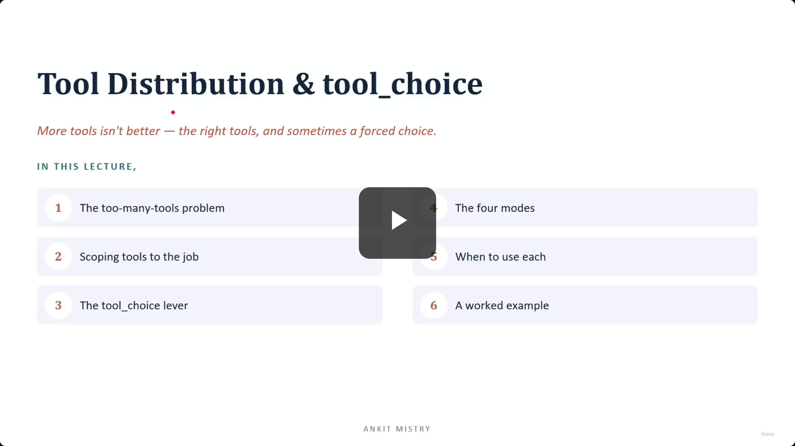
[00:00:00](https://www.udemy.com/course/claude-ai-certification/learn/lecture/57460127#overview)

## Tool Distribution & tool\_choice

- More tools isn't better — the right tools, and sometimes a forced choice.

### Lecture Overview

1. The too-many-tools problem
2. Scoping tools to the job
3. The tool\_choice lever
4. The four modes
5. When to use each
6. A worked example

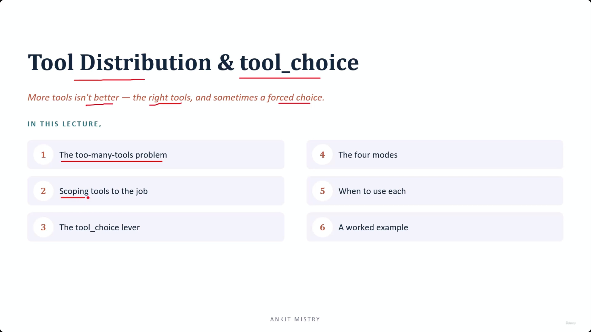
[00:00:43](https://www.udemy.com/course/claude-ai-certification/learn/lecture/57460127#overview)

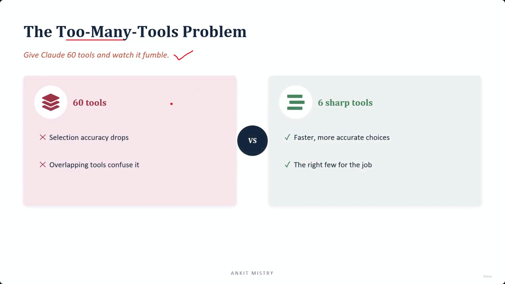
[00:01:08](https://www.udemy.com/course/claude-ai-certification/learn/lecture/57460127#overview)

### The Too-Many-Tools Problem

- Giving Claude 60 tools causes it to fumble
- **60 tools (Low performance):**
    - Selection accuracy drops
    - Overlapping tools cause confusion
- **6 sharp tools (High performance):**
    - Choices are faster and more accurate
    - Provides the right view for the job

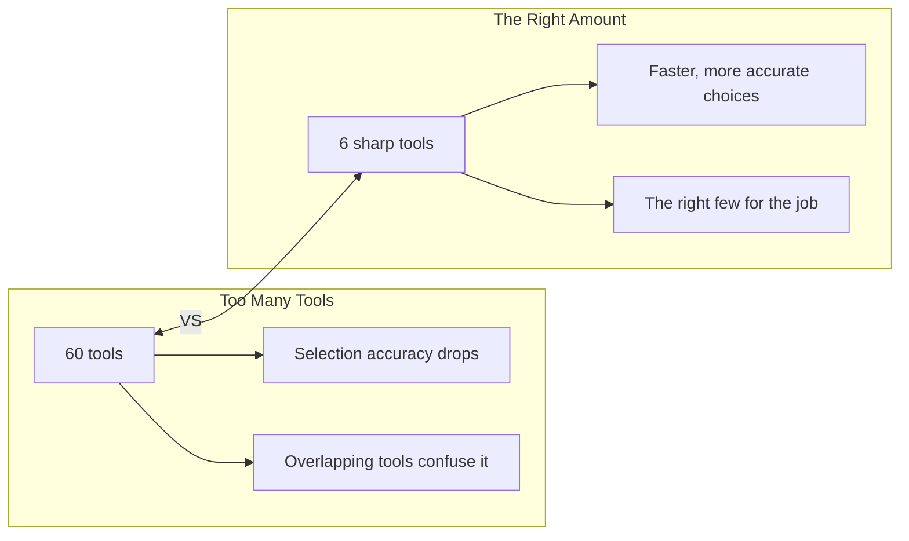
```mermaid
graph LR
    subgraph "Too Many Tools"
    A["60 tools"] --> B["Selection accuracy drops"]
    A --> C["Overlapping tools confuse it"]
    end

    subgraph "The Right Amount"
    D["6 sharp tools"] --> E["Faster, more accurate choices"]
    D --> F["The right few for the job"]
    end

    A <-->|VS| D
```

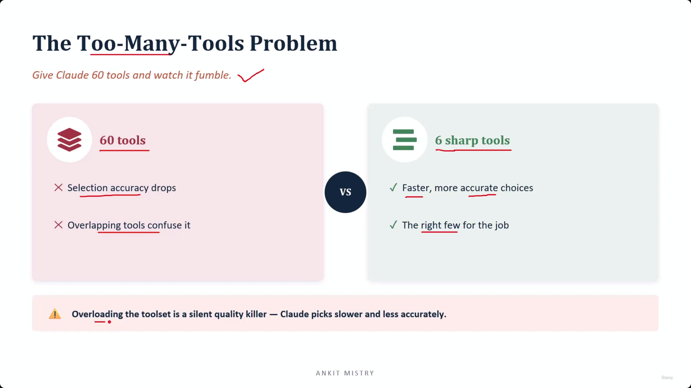
[00:01:54](https://www.udemy.com/course/claude-ai-certification/learn/lecture/57460127#overview)

### The Impact of Tool Overload

- It is not a matter of the LLM not being clever enough
    - Every extra tool adds another look-alike option to weigh up during every decision
    - More tools $\neq$ more power; beyond a certain point, it leads to worse choices
- **[Warning] Overloading the toolset is a silent quality killer**
    - It does not cause crashes or explicit errors
    - It simply causes the agent to pick tools slower and less accurately as the toolbox grows

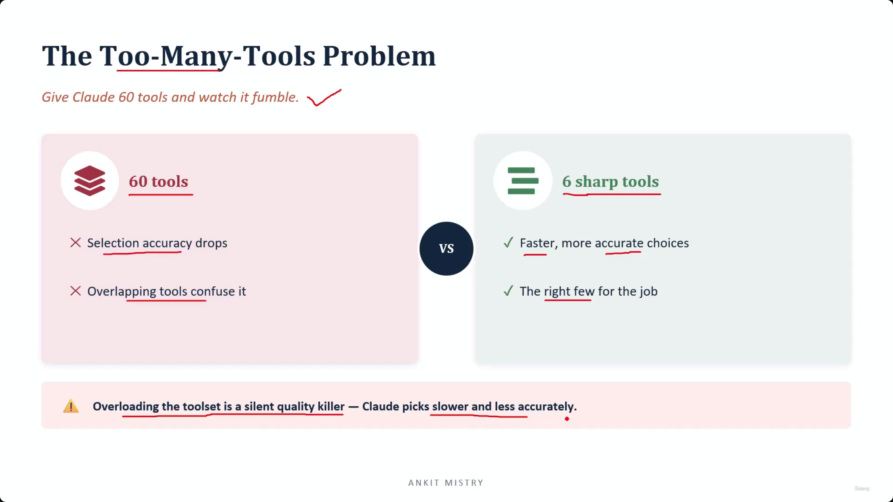
[00:02:14](https://www.udemy.com/course/claude-ai-certification/learn/lecture/57460127#overview)

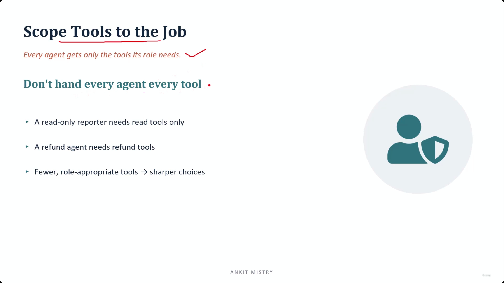
[00:02:39](https://www.udemy.com/course/claude-ai-certification/learn/lecture/57460127#overview)

### Scope Tools to the Job

- **Rule:** Every agent gets only the tools its role needs
- **[Why?]** To ensure sharper choices by avoiding unnecessary options
- **Examples of role-based scoping:**
    - A read-only reporter needs read tools only
    - A refund agent needs refund tools
- Fewer, role-appropriate tools $\rightarrow$ sharper choices

### The Discipline of Scoping

- Follow a simple discipline: identify the agent's specific job and provide exactly that, and nothing more
- **[Why?]** This prevents the agent from being "tempted" by irrelevant tools that don't apply to its role
    - For example, a reporting agent should never be presented with tools that allow for modifications

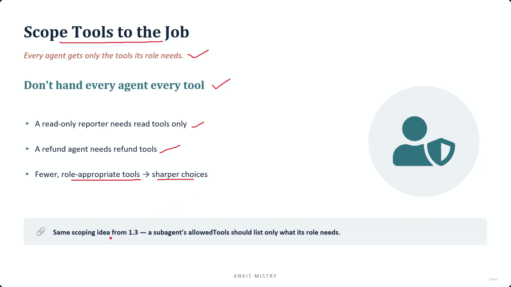
[00:03:12](https://www.udemy.com/course/claude-ai-certification/learn/lecture/57460127#overview)

### Scoping Subagent Tools

- A subagent's `allowedTools` should list only what its role needs
- **[Why?]** This provides two key benefits:
    - **Safety:** It restricts the agent's capabilities to a defined boundary
    - **Sharper Selection:** It prevents the agent from being overwhelmed by irrelevant options, leading to more accurate tool choices

## Enter tool\_choice: the Control Lever

- By default, Claude decides which tool to use
- Sometimes, you cannot allow the model to make that decision autonomously

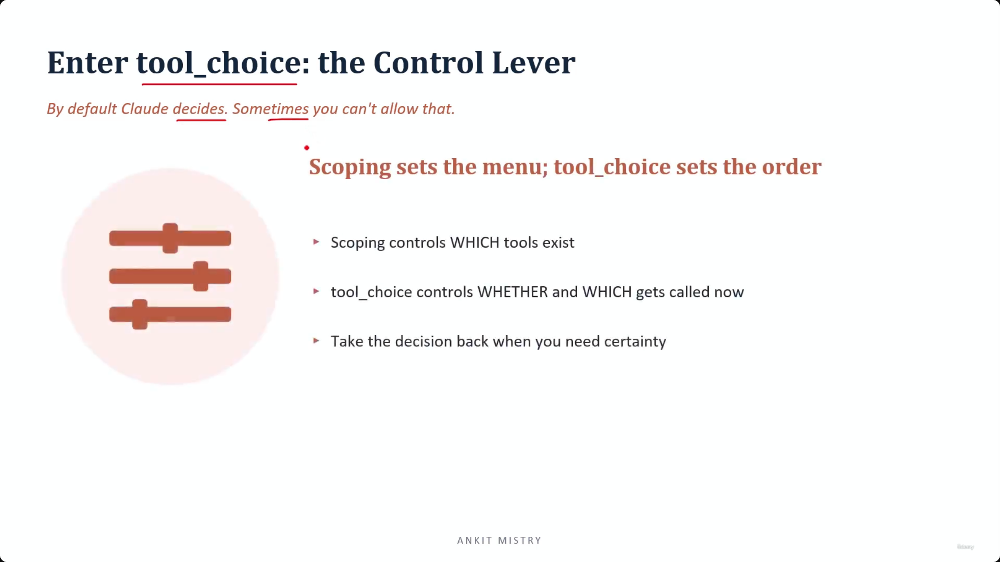
[00:04:01](https://www.udemy.com/course/claude-ai-certification/learn/lecture/57460127#overview)

### Scoping vs. tool\_choice

- These are two separate levers that work together to provide full control over an agent
- **[The Analogy]** Scoping sets the menu; tool\_choice sets the order
- **Scoping** controls WHICH tools exist
- **tool\_choice** controls WHETHER and WHICH tool gets called now
- **[Why use tool\_choice?]** To take the decision back from the model when you need certainty

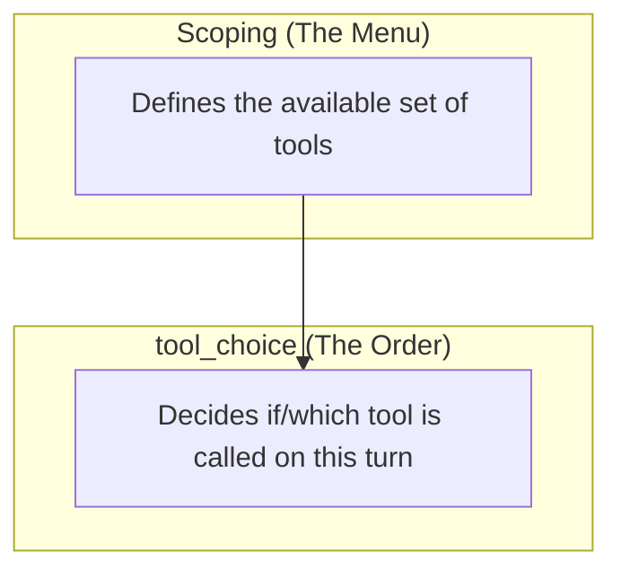
```mermaid
graph TD
    subgraph "Scoping (The Menu)"
    A[Defines the available set of tools]
    end

    subgraph "tool_choice (The Order)"
    B[Decides if/which tool is called on this turn]
    end

    A --> B
```

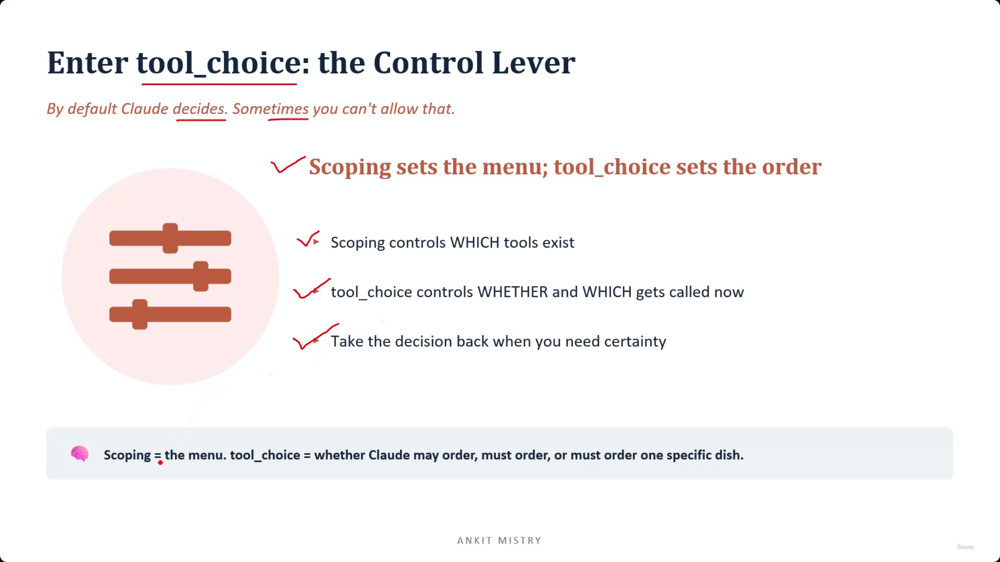
[00:04:38](https://www.udemy.com/course/claude-ai-certification/learn/lecture/57460127#overview)

### The Restaurant Analogy

- A way to visualize how scoping and tool\_choice interact
    - **Scoping = The Menu**: The list of dishes available to be ordered
    - **tool\_choice = The Waiter's Rules**: The logic governing how those dishes are ordered
        - Rule 1: "You may pick anything from the menu"
        - Rule 2: "You must pick something from the menu"
        - Rule 3: "You must order this one specific dish"

### The Four Modes

- The specific settings available for `tool_choice`:
    - `auto`
    - `any`
    - `tool`
    - `none`

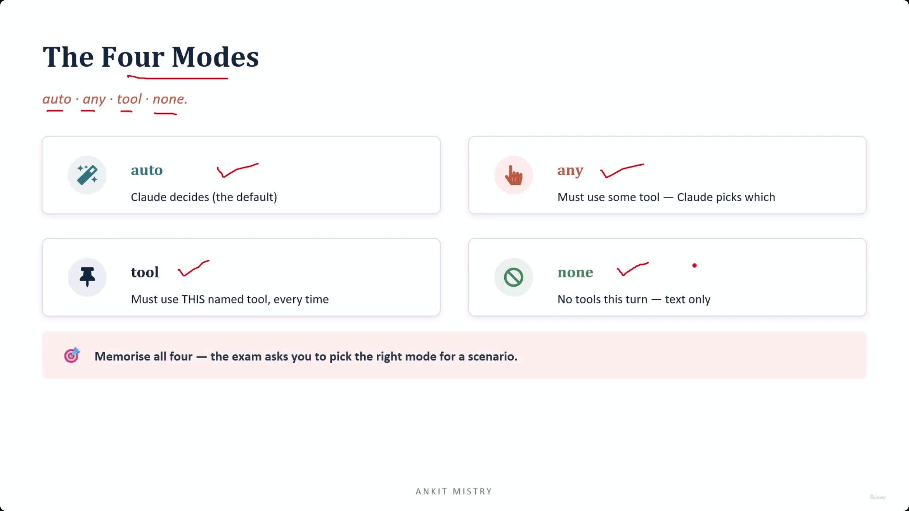
[00:06:02](https://www.udemy.com/course/claude-ai-certification/learn/lecture/57460127#overview)

### The `tool_choice` Spectrum

These modes exist on a spectrum moving from total model freedom to maximum control:

- **`auto`**
    - Claude decides which tool to use
    - This is the default setting
- **`any`**
    - Claude must use some tool
    - Claude picks which specific tool to call
- **`tool`**
    - Claude must use one specific, named tool
    - This removes the model's choice entirely
- **`none`**
    - No tools are used during this turn
    - The response is text only

| Mode | Behavior | Control Level |
| --- | --- | --- |
| auto | Claude decides (default) | Total Freedom |
| any | Must use some tool; Claude picks which | Forced Action |
| tool | Must use this specific named tool | No Choice |
| none | No tools this turn; text only | Tools Switched Off |

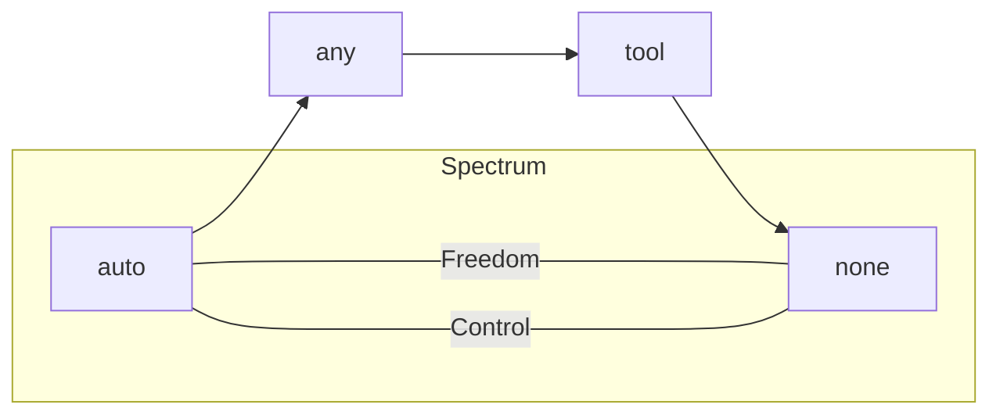
```mermaid
flowchart LR
    A[auto] --> B[any] --> C[tool] --> D[none]
    subgraph Spectrum
    A ---|Freedom| D
    D ---|Control| A
    end
```

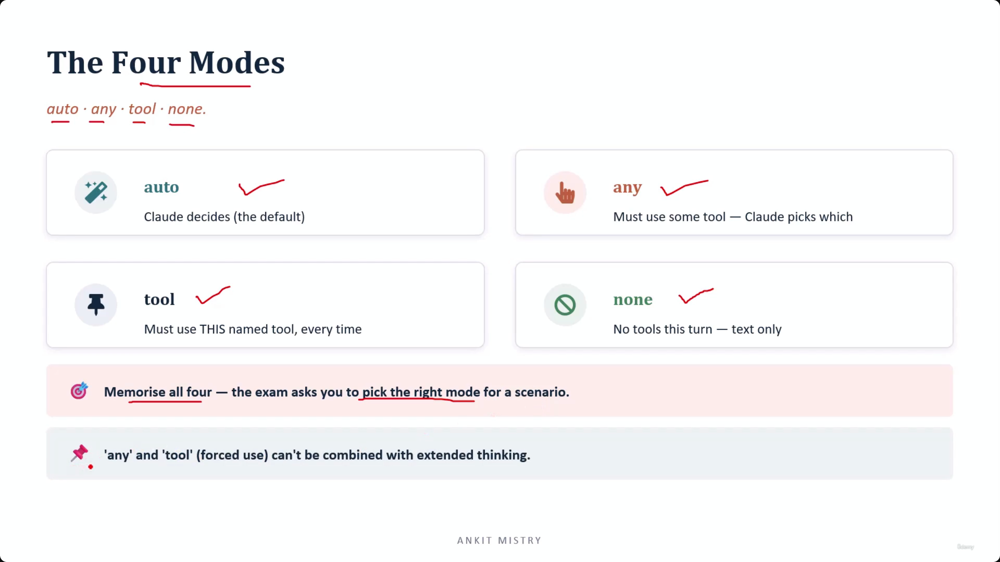
[00:06:31](https://www.udemy.com/course/claude-ai-certification/learn/lecture/57460127#overview)

- **[Exam Tip]** Memorize these four modes by name
    - Questions will describe a scenario and ask you to identify the correct mode
- **Technical Constraint: Forced Tool Use vs. Extended Thinking**
    - The `any` and `tool` modes (forced use) **cannot** be combined with extended thinking
    - **[Why?]** When you force Claude to call a tool, you are removing its freedom to stop and think before acting

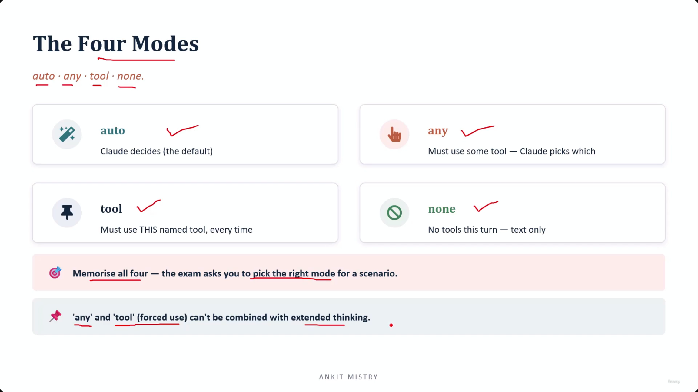
[00:06:54](https://www.udemy.com/course/claude-ai-certification/learn/lecture/57460127#overview)

### When to Use Each Mode

- **[Guiding Principle]** Match the mode to how much certainty you need, moving from free choice to non-negotiable control
- **`auto`** $\rightarrow$ ordinary chat assistants
- **`any`** $\rightarrow$ "must act, you choose how"
- **`tool`** $\rightarrow$ guaranteed output / always-save step
- **`none`** $\rightarrow$ asking without acting, or a plain text-only turn

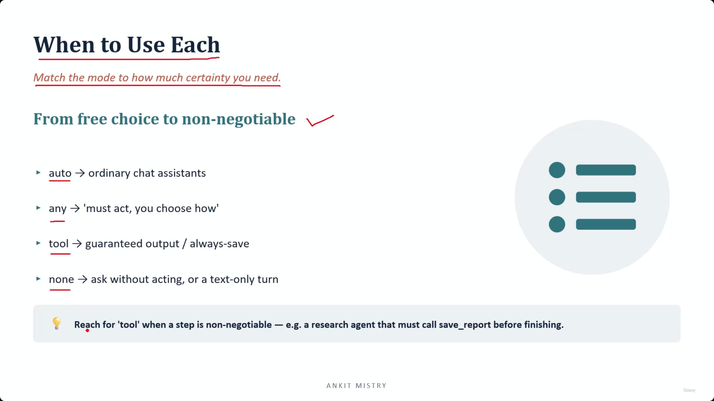
[00:07:56](https://www.udemy.com/course/claude-ai-certification/learn/lecture/57460127#overview)

### Ensuring Non-Negotiable Actions

- **[Guiding Principle]** Selection is based on the required level of certainty
    - As the need for a guaranteed outcome increases, move from `auto` toward `tool`
- **Using&#32;`tool`&#32;for mandatory steps**
    - Reach for the `tool` mode when a specific action is mandatory and cannot be skipped
    - **[Example]** A research agent that must call `save_report` before it finishes
        - You don't want the agent to "sometimes" save and "sometimes" forget
        - Forcing the tool turns a "hopeful" action into a guaranteed one

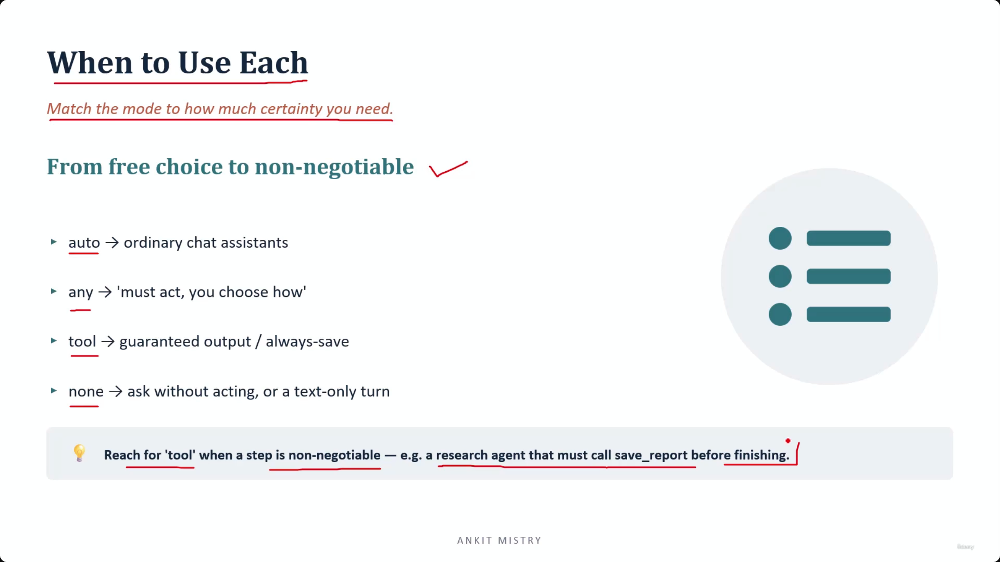
[00:08:24](https://www.udemy.com/course/claude-ai-certification/learn/lecture/57460127#overview)

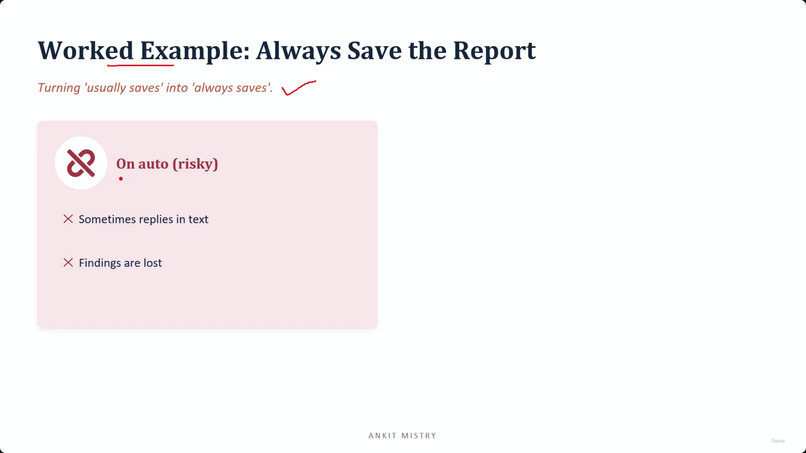
[00:08:40](https://www.udemy.com/course/claude-ai-certification/learn/lecture/57460127#overview)

### Worked Example: Always Save the Report

- **Goal:** Turning "usually saves" into "always saves"
- **The Risk of&#32;`auto`&#32;mode:**
    - Using `auto` for a saving step is risky because saving becomes a strong suggestion rather than a requirement
    - **[The Danger]** The agent might occasionally decide that a simple text reply is enough instead of calling the save tool
    - When this happens, the findings or work completed during the session are lost without any explicit error, often without the user noticing

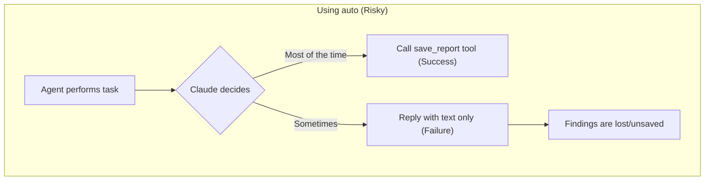
```mermaid
flowchart TD
    subgraph "Using auto (Risky)"
    A[Agent performs task] --> B{Claude decides}
    B -->|Most of the time| C["Call save_report tool (Success)"]
    B -->|Sometimes| D["Reply with text only (Failure)"]
    D --> E[Findings are lost/unsaved]
    end
```

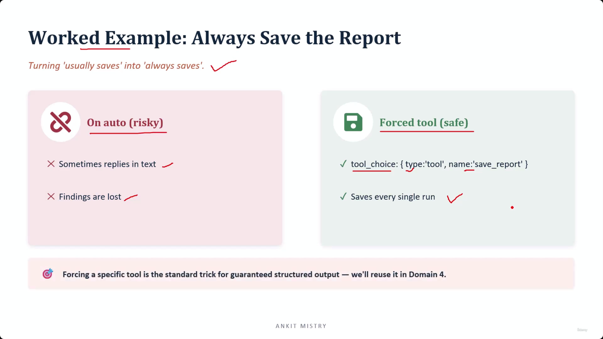
[00:09:47](https://www.udemy.com/course/claude-ai-certification/learn/lecture/57460127#overview)

### Worked Example: Always Save the Report

**Goal:** Turning 'usually saves' into 'always saves'

#### On auto (risky)

- **Behavior:** The agent sometimes chooses to reply with text instead of calling a tool
- **Consequence:** Findings are lost because the work was never written to a report
- **[Why it's risky]** Saving the report is only a "strong suggestion" to the model; it is not guaranteed

#### Forced tool (safe)

- **Configuration:**

```python
tool_choice: { type: 'tool', name: 'save_report' }
```

- **Behavior:** The agent is forced to call the `save_report` tool on every single run
- **Result:** The agent no longer has the choice to simply reply in text; saving becomes what the turn does by default

---

> **Note for the road:** Forcing a specific tool is the standard trick used to guarantee structured output.

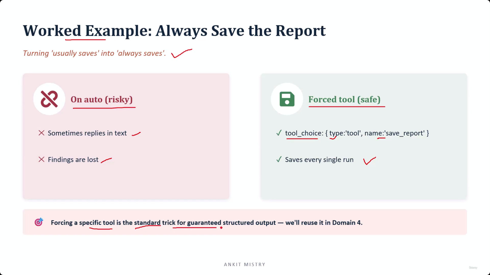
[00:09:53](https://www.udemy.com/course/claude-ai-certification/learn/lecture/57460127#overview)

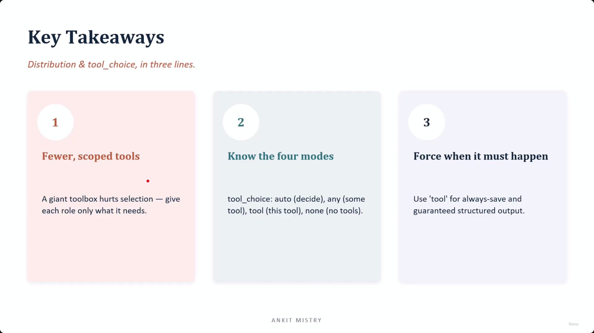
[00:10:20](https://www.udemy.com/course/claude-ai-certification/learn/lecture/57460127#overview)

### Forcing Tools for Structured Output

- **[General Technique]** Forcing a specific tool is the standard way to guarantee structured output
    - This is not just for saving reports; it's a general method to ensure Claude's answer follows a fixed shape
    - When you need a specific structure, force the tool that produces that shape

### Key Takeaways: Distribution & tool\_choice

1. **Fewer, scoped tools**

    - A giant toolbox hurts selection accuracy
    - Give each role only exactly what it needs

2. **Know the four modes**

    - `auto`, `any`, `tool`, and `none`

3. **Force when it must happen**

    - Use the `tool` mode for "always-save" scenarios and to guarantee structured output

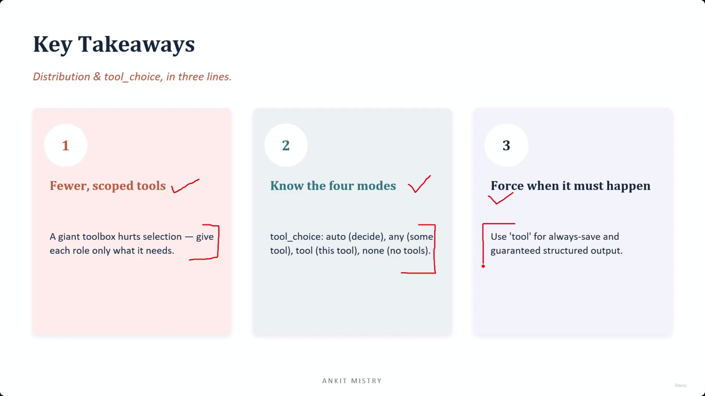
[00:10:49](https://www.udemy.com/course/claude-ai-certification/learn/lecture/57460127#overview)

### Summary: The Two Levers of Control

- **Scoping**
    - Decides which tools even exist for a given agent
    - **[Principle]** Fewer, sharper tools lead to better selection accuracy
- **tool\_choice**
    - Decides what happens on a specific turn
    - Ranges from letting Claude decide freely to forcing one exact tool


[00:11:23](https://www.udemy.com/course/claude-ai-certification/learn/lecture/57460127#overview)

---

## Simple Explanation (with Claude Examples)

**The core idea, in one line**: Giving Claude too many tools quietly makes it worse at picking the right one — so scope each agent to only the tools its role needs, and use `tool_choice` when you need certainty instead of a suggestion.

**More tools isn't more power**

60 tools cause selection accuracy to drop and overlapping tools to confuse Claude. 6 sharp, role-appropriate tools lead to faster, more accurate choices. This isn't Claude being "not clever enough" — every extra tool is one more look-alike option to weigh on *every single decision*, and this failure is silent: no crash, just a slow, quiet decline in accuracy.

*Claude Code example*: The `Explore` subagent in this session is deliberately given only read-only tools — not the full toolset I have access to. That scoping is exactly this principle: give each role only what it needs, so its choices stay sharp within its narrow job.

**Scoping vs. `tool_choice` — the restaurant analogy**

- **Scoping = the menu** — which dishes (tools) exist at all
- **`tool_choice` = the waiter's rules** — how you're allowed to order from that menu

**The four modes of `tool_choice`**, from total freedom to total control:

| Mode | Behavior |
|---|---|
| `auto` | Claude decides freely (default) |
| `any` | Must use *some* tool, Claude picks which |
| `tool` | Must use *this exact* named tool |
| `none` | No tools this turn, text only |

**When to use each**: `auto` for ordinary use; `any` for "must act, you choose how"; `tool` for a guaranteed, non-negotiable step; `none` for asking without acting.

**Worked example — always save the report**

On `auto`, saving a report is only a "strong suggestion." Claude might sometimes reply in plain text instead of calling `save_report` — and your findings quietly vanish, with no error at all.

```python
tool_choice: { type: 'tool', name: 'save_report' }
```

This forces `save_report` to be called on *every single run*, no exceptions. "Usually saves" becomes "always saves."

*Claude Code example from this exact session*: when I used the `Skill` tool earlier for `explain-note`, that call wasn't optional — the design of that interaction effectively guarantees the skill gets invoked rather than leaving it as "Claude might decide to explain the file directly instead." Forcing the specific tool is exactly how you turn a hopeful behavior into a guaranteed one.

**Recap in 3 lines**

1. **Fewer, scoped tools beat a giant toolbox** — every extra tool quietly degrades selection accuracy.
2. **Scoping sets the menu; `tool_choice` sets the order** — two separate levers of control.
3. **Force with `tool` when something absolutely must happen** — like a mandatory save step or guaranteed structured output.

---

## Exam Objective Note: CCAR-F 2.3 — Tool Distribution and Tool Choice

**The four `tool_choice` values and one sneaky consequence**

- `auto` — default once tools exist; Claude decides freely.
- `any` — forces *some* tool to be called.
- `tool` — forces one specific, named tool.
- `none` — no tools allowed this turn.

The consequence worth knowing: **`any` and `tool` prefill the assistant's message.** When you force tool use, the model's response is pre-seeded to start directly with the tool call — it skips straight to `tool_use`, with **no natural-language text before it**, even if the prompt explicitly asks Claude to explain first.

*Everyday analogy*: telling someone "you must hand me the form, filled out" — they can't also pause to explain why they filled it out that way first; the forcing itself skips past any explanation.

**The practical trap**

A scenario that wants **both** a guaranteed extraction (forced tool call) **and** something readable to show the user cannot use forcing — you can't get a forced tool call *and* preceding explanatory text in the same turn. That combination needs a different approach (e.g., `auto` with a strong instruction, or a separate follow-up turn for the explanation).

**Tool distribution — how allow/deny lists combine**

- **Neither set** → the agent inherits everything, no restriction.
- **Only an allow-list (`tools`) set** → acts as a whitelist — only those tools are available.
- **Both an allow-list and a deny-list set, overlapping on the same tool** → the **denial wins** — that tool stays blocked even though it was also allowed.

*Everyday analogy*: a badge granting access to "all floors" plus a specific rule "never floor 13" — the specific denial overrides the broader allowance every time.

**Recap in 3 lines**

1. **`any`/`tool` force a tool call and skip any preceding explanation** — forced tool use always prefills straight to `tool_use`.
2. **Can't force a tool call and get explanatory text in the same turn** — that combination requires `auto` instead of forcing.
3. **Denial always wins when allow and deny lists overlap** — an unset pair inherits everything; an allow-list alone is a whitelist.