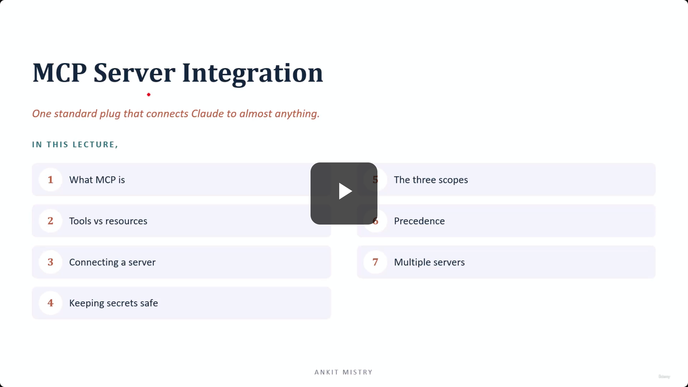
[00:00:00](https://www.udemy.com/course/claude-ai-certification/learn/lecture/57460129#overview)

## MCP Server Integration

- A standard way to plug in existing tools instead of building them from scratch
    - It acts as a "standard plug" that connects Claude to almost anything

### Lecture Overview

- What MCP is
- Tools vs resources
- Connecting a server
- Keeping secrets safe
- The three scopes
- Precedence
- Multiple servers

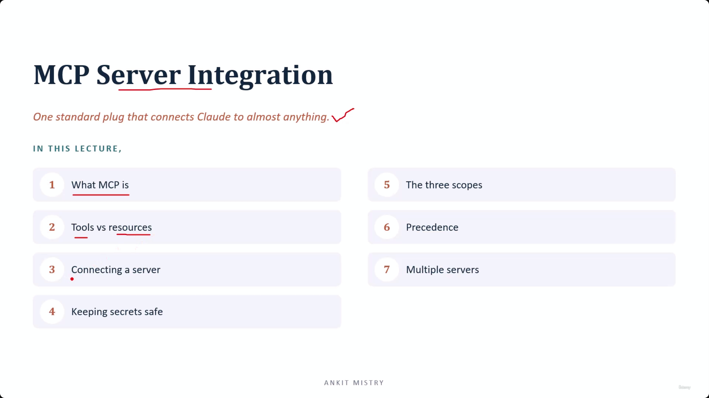
[00:00:43](https://www.udemy.com/course/claude-ai-certification/learn/lecture/57460129#overview)

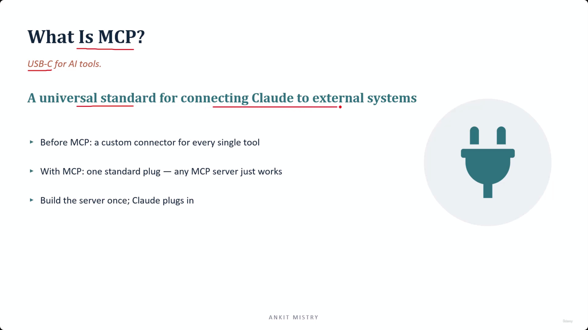
[00:01:15](https://www.udemy.com/course/claude-ai-certification/learn/lecture/57460129#overview)

### The Core Concept

- **"USB-C for AI tools"**: A universal standard for connecting Claude to external systems
- **The Shift**
    - **Before MCP**: Required a custom connector for every single tool
    - **With MCP**: One standard plug allows any MCP server to work
    - **Efficiency gain**: Build the server once, and Claude can plug into it

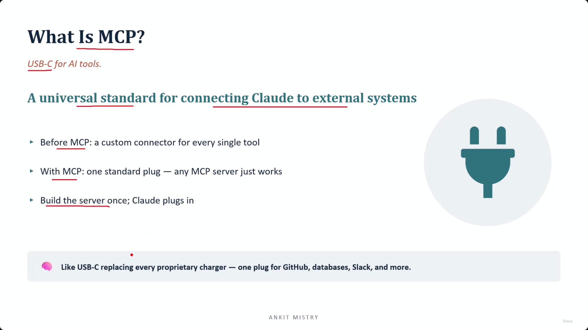
[00:01:56](https://www.udemy.com/course/claude-ai-certification/learn/lecture/57460129#overview)

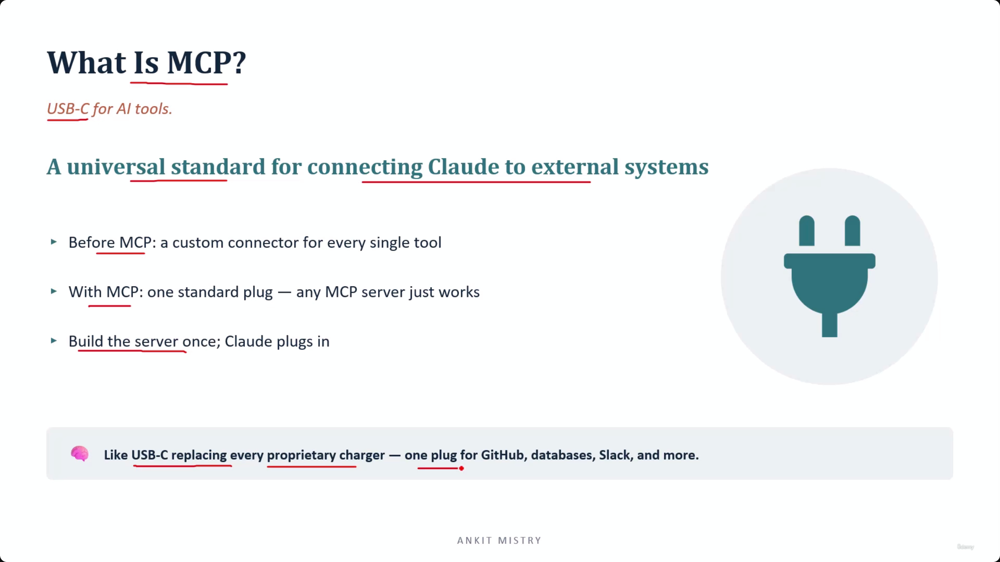
[00:02:15](https://www.udemy.com/course/claude-ai-certification/learn/lecture/57460129#overview)

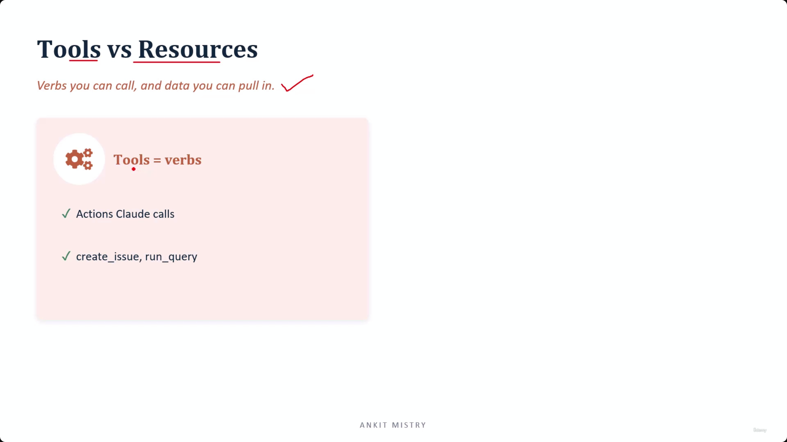
[00:02:42](https://www.udemy.com/course/claude-ai-certification/learn/lecture/57460129#overview)

### Tools vs Resources

- **The Distinction**
    - Tools are **verbs** (actions Claude can call)
    - Resources are **data** (information Claude can pull in)
- **Tools: Actions and Verbs**
    - Tools represent actions that Claude initiates
    - They are used to "change the world" or perform specific tasks
    - Examples:
        - `create_issue`
        - `run_query`

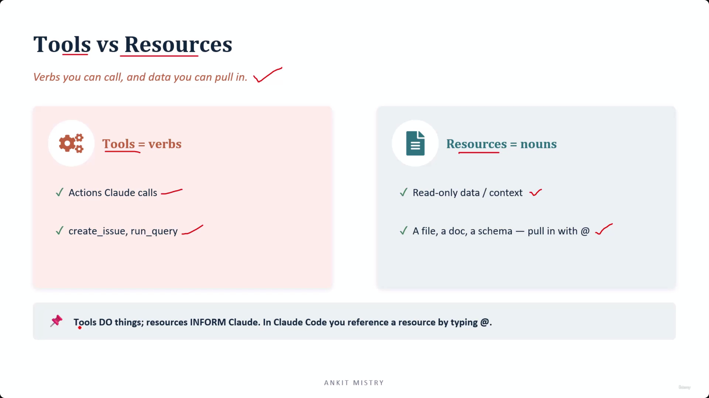
[00:03:40](https://www.udemy.com/course/claude-ai-certification/learn/lecture/57460129#overview)

### Resources: Nouns and Context

- **Resources are nouns**
    - They represent read-only data or context
    - Examples include files, documents, or schemas
- **How they are used**
    - Claude pulls them into the conversation to inform its work
    - In Claude Code, you reference a resource by typing `@`

### Summary: Tools vs. Resources

| Feature | Tools | Resources |
| --- | --- | --- |
| Nature | Verbs (Actions) | Nouns (Data) |
| Function | Do things | Inform Claude |
| Interaction | Claude calls them to make something happen | Claude pulls them in for context |

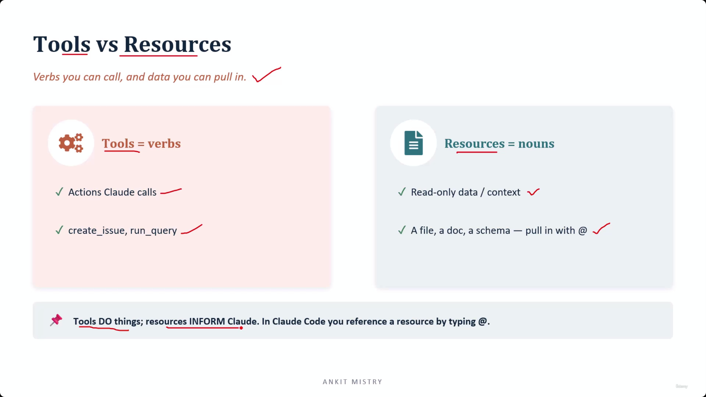
[00:03:45](https://www.udemy.com/course/claude-ai-certification/learn/lecture/57460129#overview)

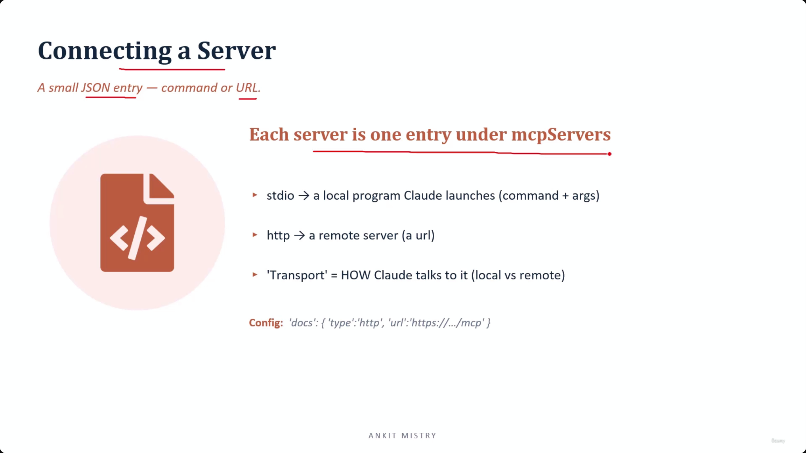
[00:04:24](https://www.udemy.com/course/claude-ai-certification/learn/lecture/57460129#overview)

### Connecting a Server

- **The Connection Method**
    - Connecting a server is a small task involving a JSON entry
    - It requires either a command or a URL
- **Server Configuration**
    - Each server is defined as a single entry under the `mcpServers` section
    - There are two primary ways a server can communicate (transports):
        - `stdio`: Used for a local program that Claude launches using a command and arguments
        - `http`: Used to connect to a remote server via a URL

```json
"mcpServers": {
  "docs": {
    "type": "http",
    "url": "https://.../mcp"
  }
}
```

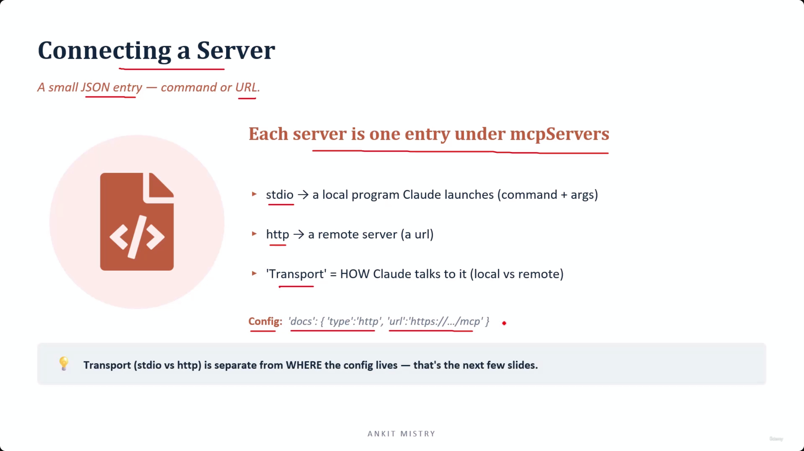
[00:05:10](https://www.udemy.com/course/claude-ai-certification/learn/lecture/57460129#overview)

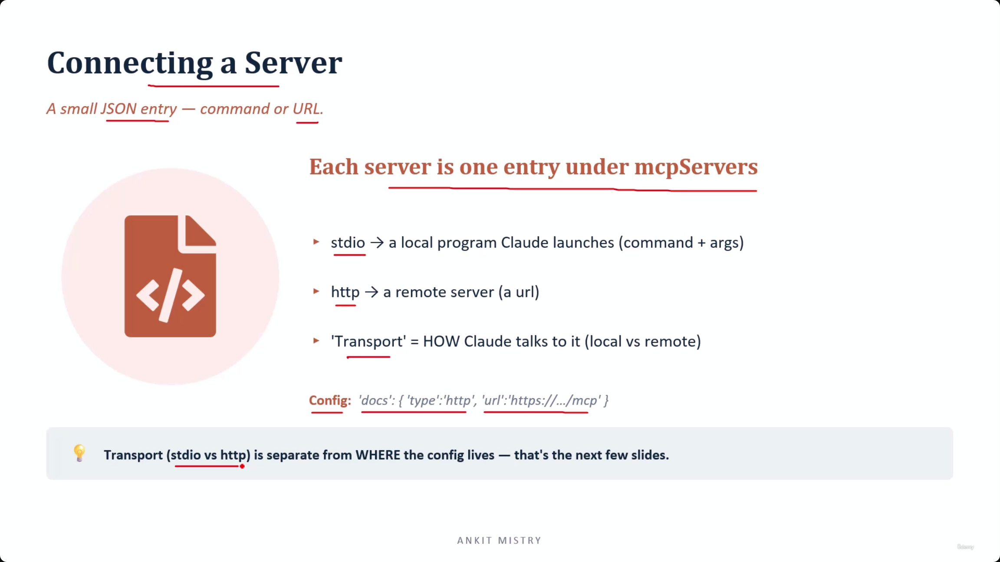
[00:05:15](https://www.udemy.com/course/claude-ai-certification/learn/lecture/57460129#overview)


[00:05:46](https://www.udemy.com/course/claude-ai-certification/learn/lecture/57460129#overview)

### Transport vs. Configuration Location

- **Two distinct concepts**
    - **Transport (How)**: Refers to the communication method (e.g., `stdio` for local programs vs. `http` for remote servers)
    - **Configuration Location (Where)**: Refers to where the config file lives and who has access to it (e.g., just you vs. your whole team)
- **[Crucial Distinction]** Do not mix these up; they are separate questions regarding the setup.

### Keeping Secrets Out of the Config

- **The Golden Rule**: Reference secrets by name
    - Never paste actual secrets (like API keys or passwords) directly into the configuration file
    - Instead, use references so that the sensitive data remains secure and managed elsewhere

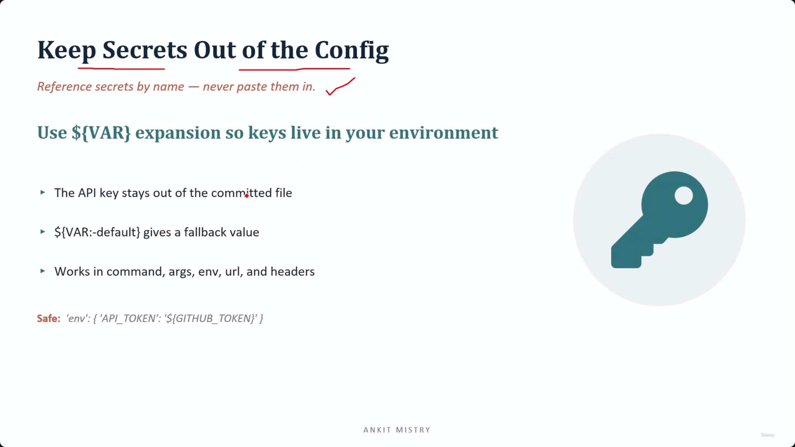
[00:06:01](https://www.udemy.com/course/claude-ai-certification/learn/lecture/57460129#overview)

### Using Variable Expansion for Secrets

- **The Technique**: Use `${VAR}` expansion so that keys live in your environment rather than the config file itself
    - This ensures the actual API key stays out of the committed file
- **Fallback Values**: Use the `${VAR:-default}` syntax to provide a fallback value if the environment variable is missing
- **Where it works**: Variable expansion is supported in several areas:
    - Commands
    - Arguments
    - `env` blocks
    - URLs
    - Headers

**[Example] Safe Environment Block Configuration:**

```json
"env": {
  "API_TOKEN": "${GITHUB_TOKEN}"
}
```

*In this example, the actual secret is stored in the&#32;`GITHUB_TOKEN`&#32;environment variable, not in the JSON file.*

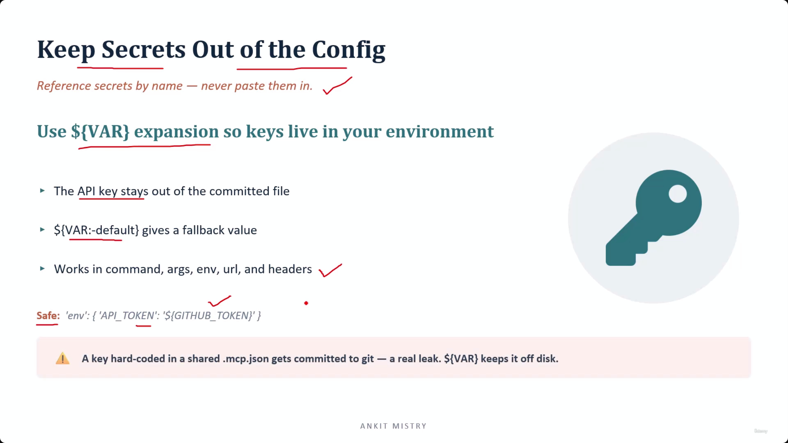
[00:06:51](https://www.udemy.com/course/claude-ai-certification/learn/lecture/57460129#overview)

### The Danger of Hardcoded Secrets

- **[Warning]** Hardcoding a key in a shared `.mcp.json` file results in it being committed to git
    - This creates a real security leak because the key is now part of the permanent repository history
    - Anyone with access to the repo can find the secret
- **The Solution**: Use variable expansion syntax
    - This keeps the actual secret off the disk entirely
    - It ensures the sensitive data is never part of a git commit

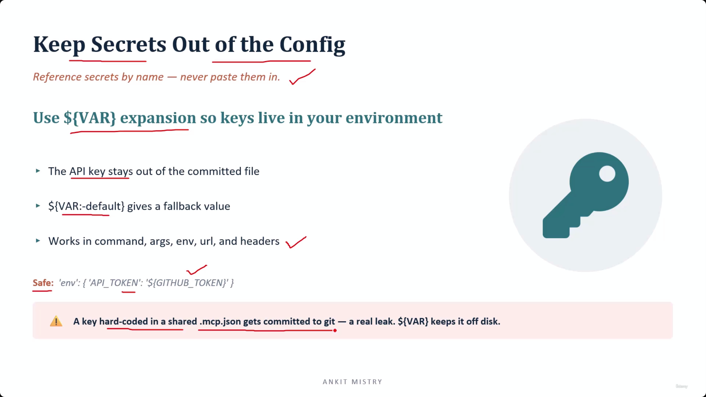
[00:07:24](https://www.udemy.com/course/claude-ai-certification/learn/lecture/57460129#overview)

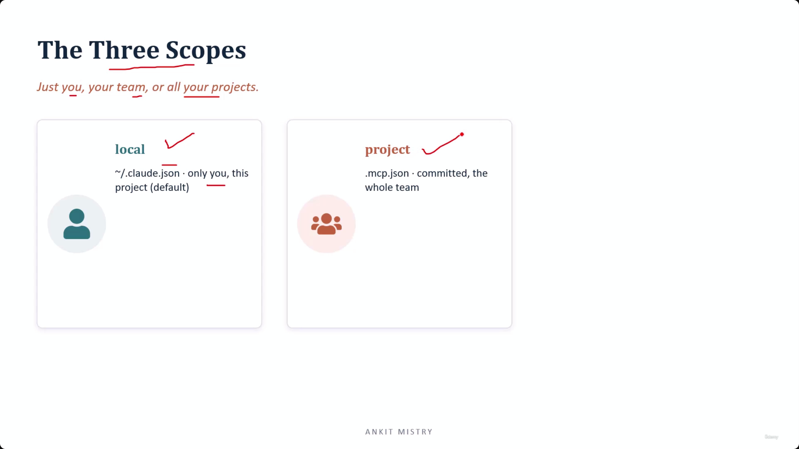
[00:08:07](https://www.udemy.com/course/claude-ai-certification/learn/lecture/57460129#overview)

### The Three Scopes

- Configuration visibility is categorized into three levels:
    - Just you
    - Your team
    - All your projects

#### Local Scope

- **Definition**: The most private scope available
    - Resides in your personal `claude.json` file
    - Restricted to just you and just the current project
- **Key characteristics**:
    - It is the default scope
    - It is not shared with anyone on your team
    - It does not follow you to other projects

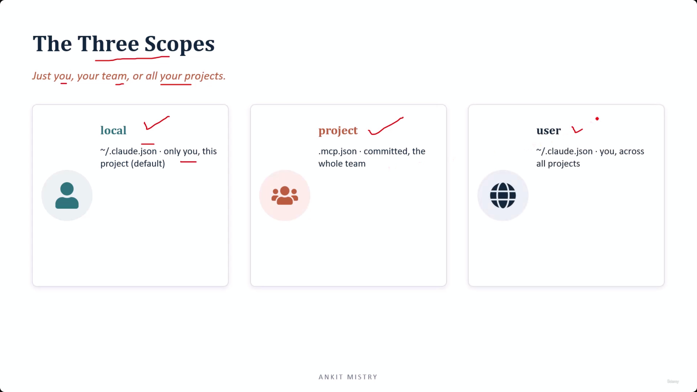
[00:08:31](https://www.udemy.com/course/claude-ai-certification/learn/lecture/57460129#overview)

#### Project Scope

- **Definition**: A deliberately shared configuration
    - Resides in the `mcp.json` file
- **Key characteristics**:
    - When committed to git, it is shared with the whole team
    - Anyone who pulls the repository automatically gets these tools
    - Best used for tools that the entire team should have access to

#### User Scope

- **Definition**: A personal configuration that follows you
    - Resides in your personal `claude.json` file
- **Key characteristics**:
    - Applies to you across **all** of your projects
    - Differs from local scope (which is restricted to one project)
    - Ideal for your own personal tools that you want available everywhere

### Summary of MCP Scopes

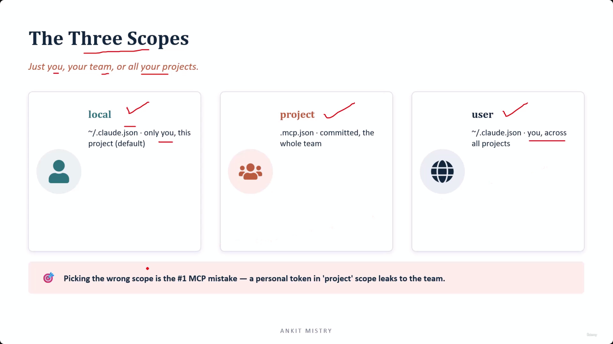
[00:08:59](https://www.udemy.com/course/claude-ai-certification/learn/lecture/57460129#overview)

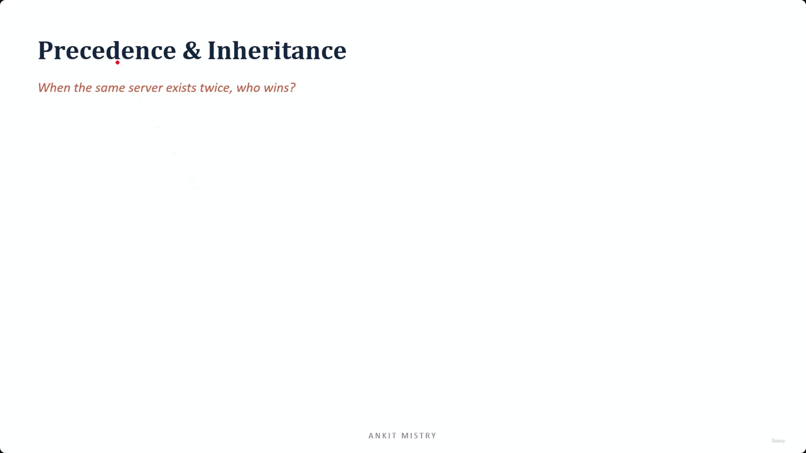
[00:09:34](https://www.udemy.com/course/claude-ai-certification/learn/lecture/57460129#overview)

### The Critical Security Risk of Scopes

- **[Warning]** Picking the wrong scope is the #1 MCP mistake
    - The most common error is placing a personal token into the `project` scope
    - Because `project` scope is committed to git, your personal token will leak to the entire team
- **Guidelines for Scope Selection**:
    - **Local/User Scopes**: Reserved for private things and personal tokens
    - **Project Scope**: Reserved only for tools that are genuinely meant to be shared with the whole team

### Precedence & Inheritance

- When the same server exists twice, which configuration wins?

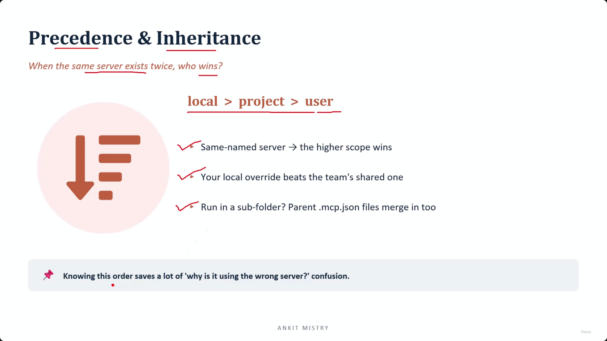
[00:10:21](https://www.udemy.com/course/claude-ai-certification/learn/lecture/57460129#overview)

#### Configuration Priority & Merging

- **The Hierarchy**: When the same server name appears in multiple configuration files, the higher scope wins
    - `local > project > user`
- **[Why this matters]**: This allows you to quietly override a shared team server with a local one just for yourself
    - Your local configuration takes priority over the team's shared configuration
- **Sub-folder Behavior**:
    - If you are running in a sub-folder, any parent `mcp.json` files are merged in as well

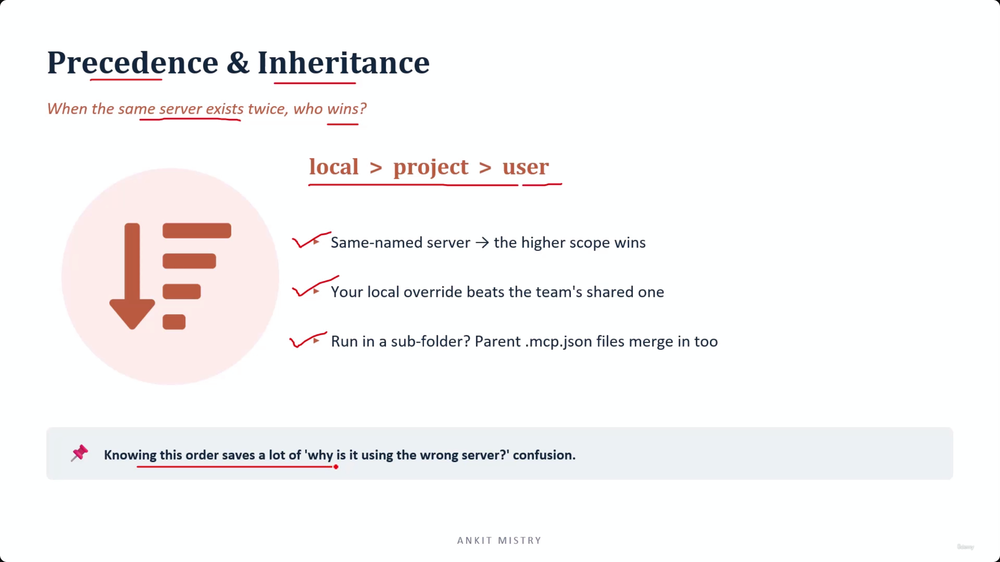
[00:10:24](https://www.udemy.com/course/claude-ai-certification/learn/lecture/57460129#overview)

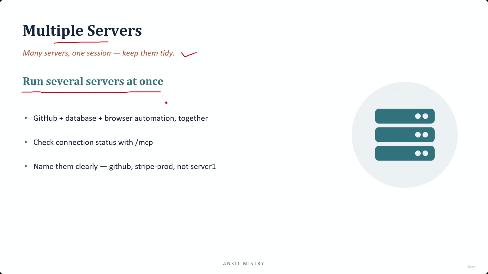
[00:11:06](https://www.udemy.com/course/claude-ai-certification/learn/lecture/57460129#overview)

### Troubleshooting Server Confusion

- **[The 'Why']** Most unexpected behavior occurs because the same server is defined in multiple scopes
    - If a server is configured in two places, a higher scope will quietly win and override the other
    - Memorizing the order `local > project > user` allows you to quickly diagnose why a specific configuration isn't being applied

### Multiple Servers

- You can run several different MCP servers all at once in a single session
    - Example: Running a GitHub server and a database server together
- **Best Practices for Management**:
    - Keep them tidy to avoid confusion
    - Check connection status using `/mcp`
    - Use clear, descriptive names (e.g., `github` or `stripe-prod` instead of `server1`)

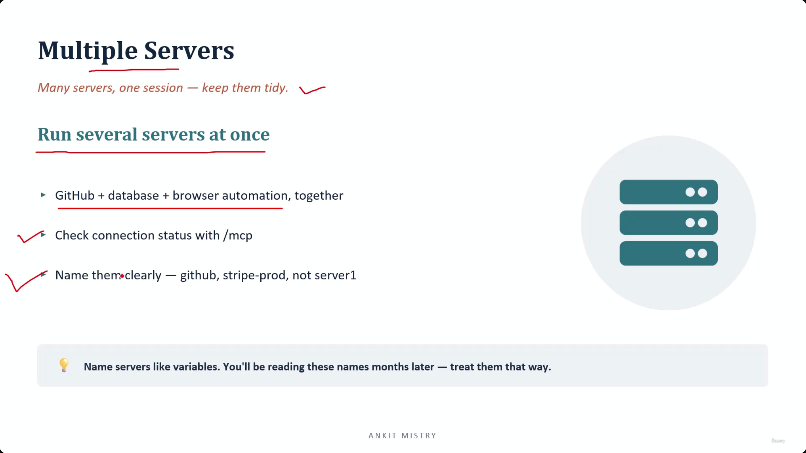
[00:11:41](https://www.udemy.com/course/claude-ai-certification/learn/lecture/57460129#overview)

### Best Practices for Server Naming

- **[Pro-tip]** Name your servers the same way you name your variables
    - You will likely be reading these names months after you first configured them
    - Use descriptive, high-quality names to support your "future self"

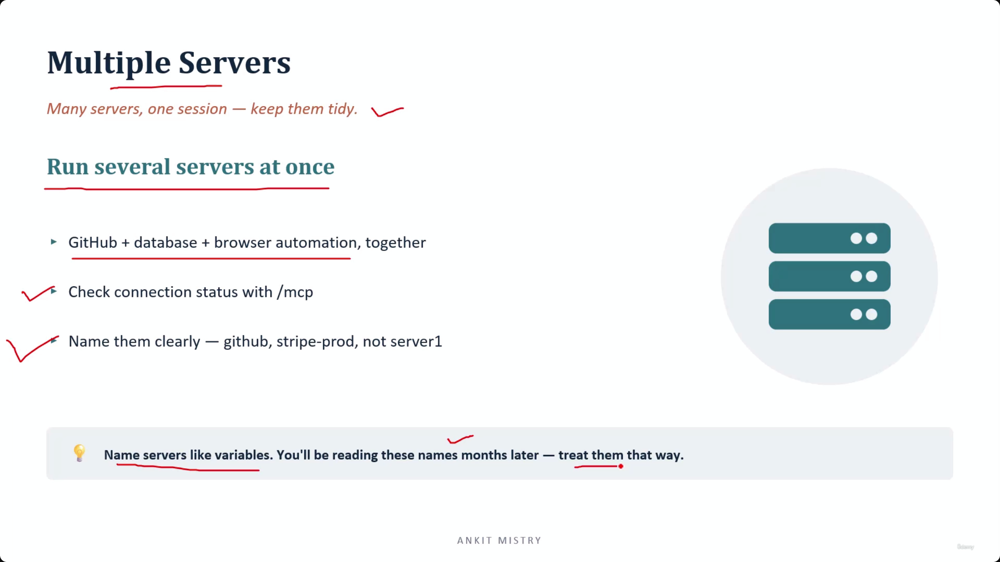
[00:11:55](https://www.udemy.com/course/claude-ai-certification/learn/lecture/57460129#overview)

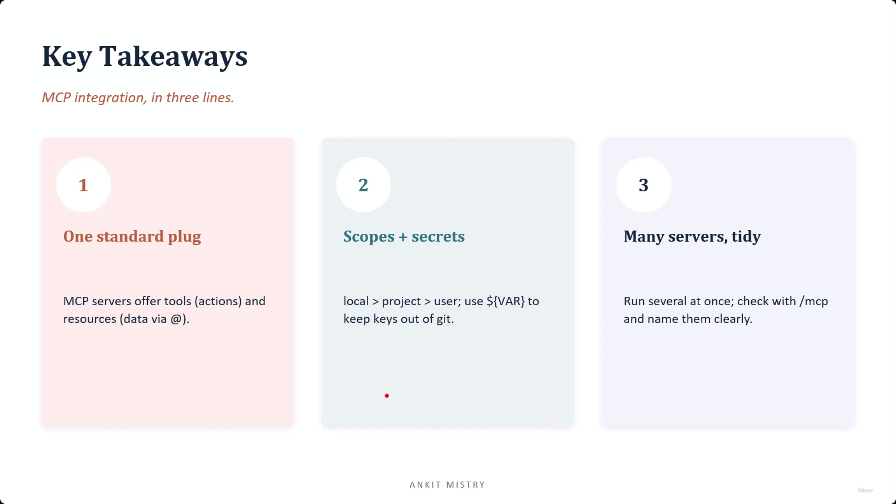
[00:12:08](https://www.udemy.com/course/claude-ai-certification/learn/lecture/57460129#overview)

### Naming Best Practices

- **[Pro-tip]** Name your servers like you name your variables
    - You will be reading these names months later, so treat them with that level of foresight
    - Avoid generic names like `server1` or `server2` which hold no meaning over time
    - Use descriptive names like `github` or `stripe-prod` to ensure they are instantly clear

### Key Takeaways: MCP Integration

1. **One standard plug**

    - MCP servers offer **Tools** (actions/verbs) and **Resources** (data/nouns)

2. **Scopes + Secrets**

    - Configuration follows the hierarchy: `local > project > user`
    - Use `${VAR}` syntax to keep sensitive keys out of git history

3. **Many servers, tidy**

    - You can run several servers at once in a single session
    - Check connection status using `/mcp` and use clear, descriptive names

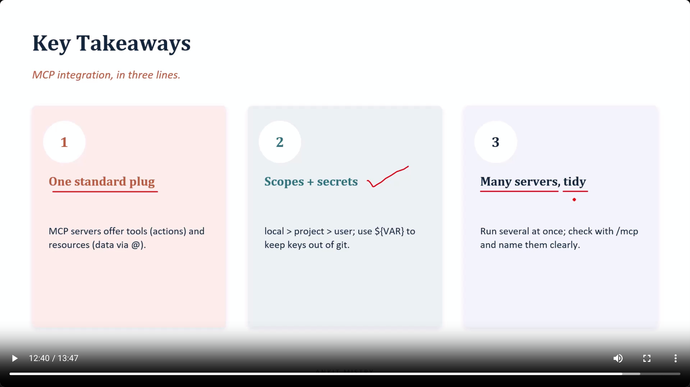
[00:12:40](https://www.udemy.com/course/claude-ai-certification/learn/lecture/57460129#overview)

### The Paradigm Shift of MCP

- **[The Core Value]** MCP stops the cycle of reinventing the wheel
    - Instead of building every tool by hand, you use one common standard to plug into existing tools
- **What remains a manual design task?**
    - Choosing which servers to connect
    - Determining which scope they belong in
    - Deciding how to protect secrets
- **What becomes standardized?**
    - The "wiring" (the connection process) becomes a single, universal plug for almost anything

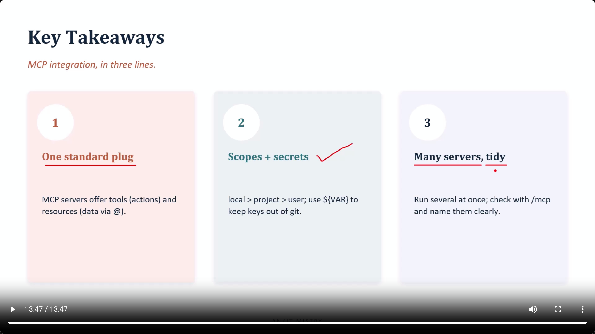
[00:13:47](https://www.udemy.com/course/claude-ai-certification/learn/lecture/57460129#overview)

### Built-in Tools in Claude Code

- Claude Code comes with six built-in tools available out of the box
- Key tools and concepts to be explored:
    - `grab` vs `glob` patterns
    - `read`, `edit`, and `write` operations
    - The **"read before edit"** rule
    - Why to prefer built-in tools over using `bash` commands
    - Strategies for exploring a codebase incrementally