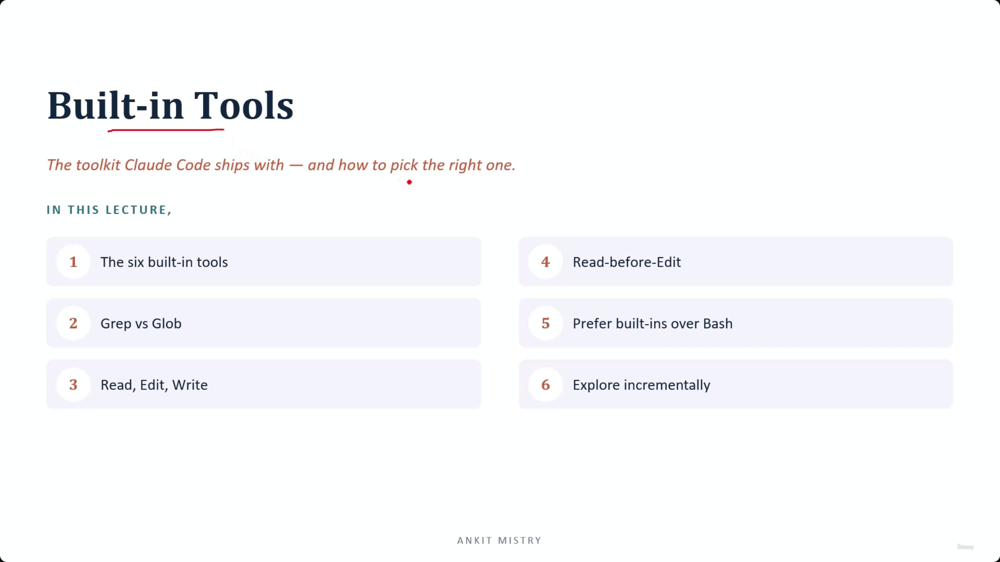
[00:00:21](https://www.udemy.com/course/claude-ai-certification/learn/lecture/57460133#overview)

## Built-in Tools

- Claude Code includes its own set of built-in tools designed for speed and precision
- **Lecture Roadmap**

    1. The six built-in tools
    2. Grep vs Glob
    3. Read, Edit, and Write
    4. Read-before-Edit
    5. Preferring built-ins over Bash
    6. Explore incrementally

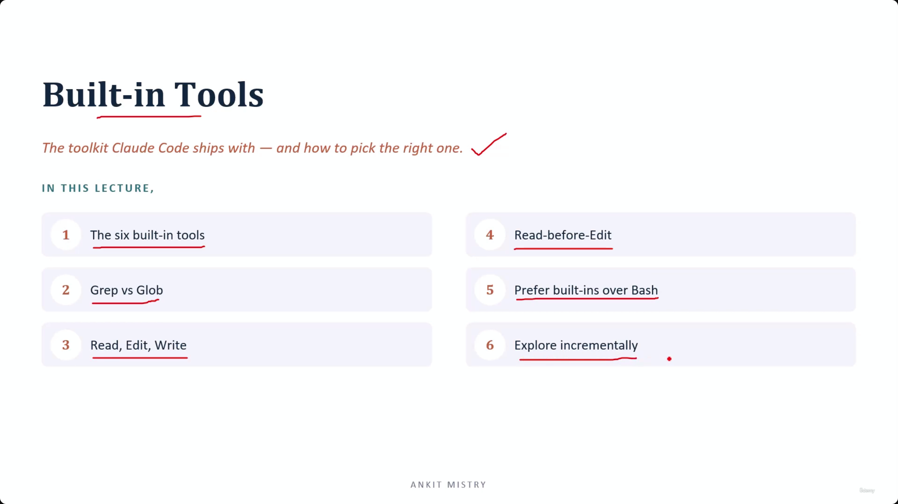
[00:00:45](https://www.udemy.com/course/claude-ai-certification/learn/lecture/57460133#overview)

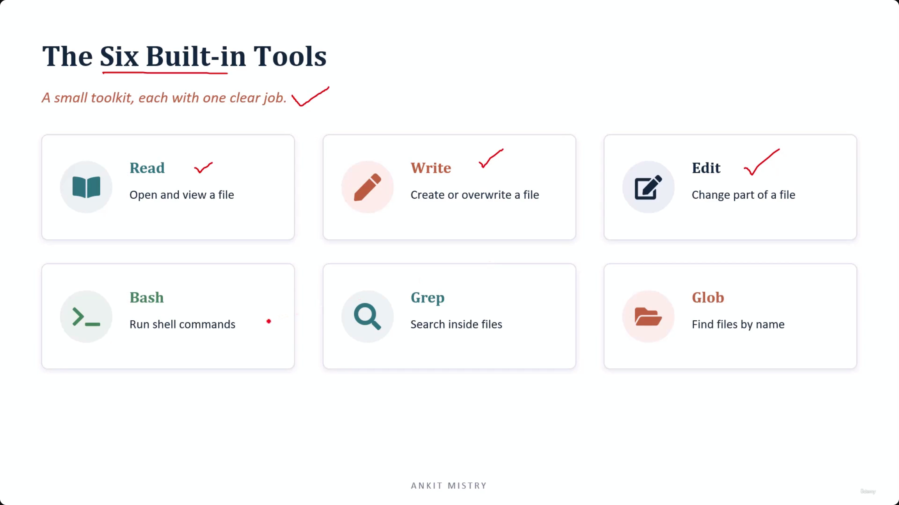
[00:01:30](https://www.udemy.com/course/claude-ai-certification/learn/lecture/57460133#overview)

### The Six Built-in Tools

- A small toolkit where each tool has one clear job
- **File-oriented tools**
    - `Read`: Opens and views a file
    - `Write`: Creates or overwrites a file
    - `Edit`: Changes just part of a file

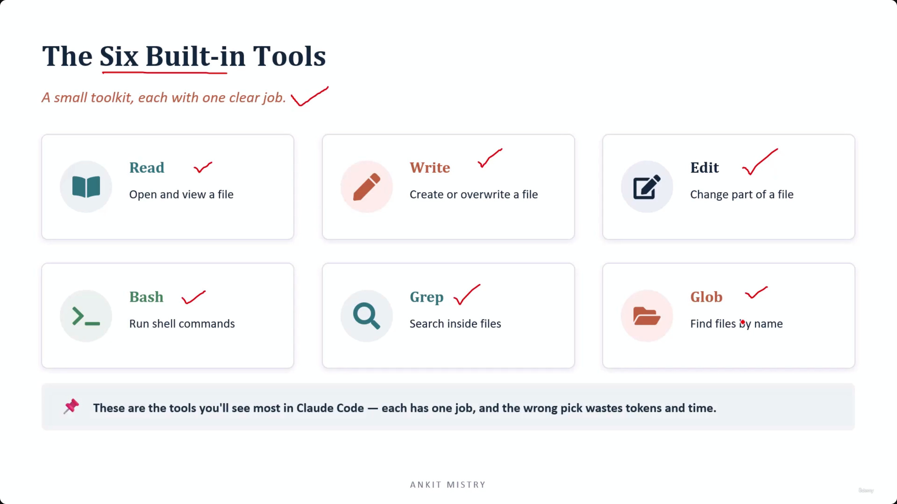
[00:02:04](https://www.udemy.com/course/claude-ai-certification/learn/lecture/57460133#overview)

### Searching and Command Tools

- `Bash`: The general tool for running shell commands
- `Grep`: Searches for specific text inside files
- `Glob`: Finds files based on their names
- **Precision in tool selection**: Each tool has a single, narrow purpose; choosing the wrong one wastes tokens and time.

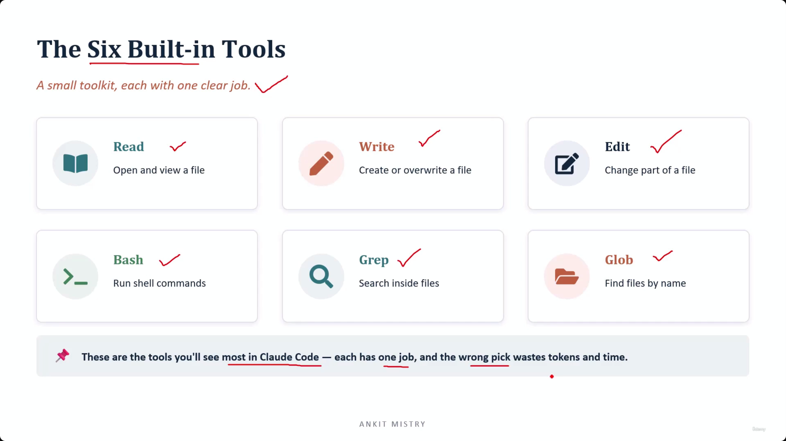
[00:02:16](https://www.udemy.com/course/claude-ai-certification/learn/lecture/57460133#overview)

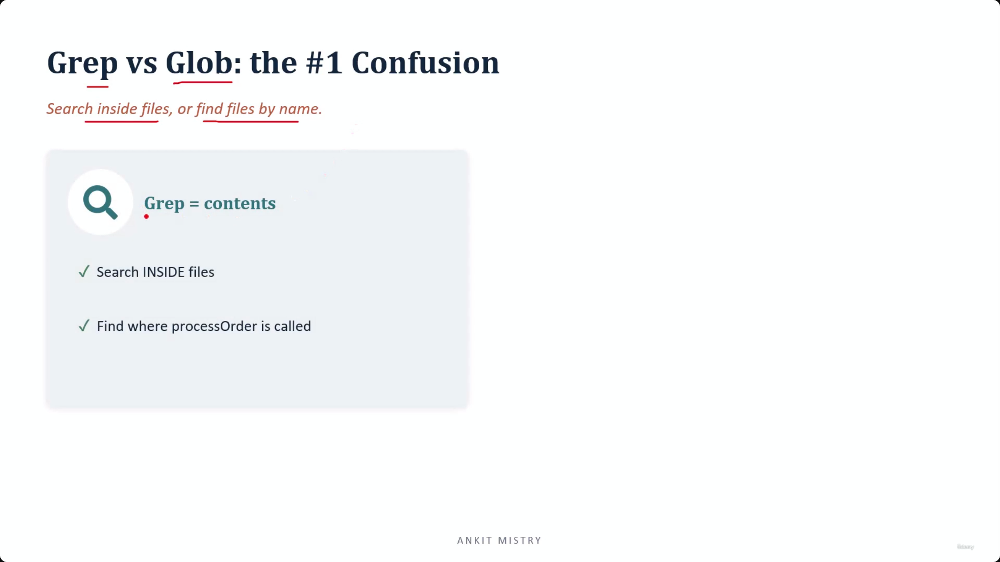
[00:02:51](https://www.udemy.com/course/claude-ai-certification/learn/lecture/57460133#overview)

### Grep vs Glob: The #1 Confusion

- **[The Core Distinction]** The choice depends on whether you are looking for what is *inside* a file or the file itself
    - **Grep**: Searches for specific content *inside* files
        - Example: Finding where `processOrder` is called within the codebase
    - **Glob**: Finds files based on their *names*

[00:03:45](https://www.udemy.com/course/claude-ai-certification/learn/lecture/57460133#overview)

### Deep Dive: Grep vs. Glob

- **Grep = contents**
    - Used when the question is about what is written in the code
    - It opens files to search the text inside them
    - Example: Finding where `processOrder` is called
- **Glob = filenames**
    - Used when the question is about which files exist by name
    - It matches file paths and name patterns without caring about the file contents
    - Example: Finding every `*.test.js` file

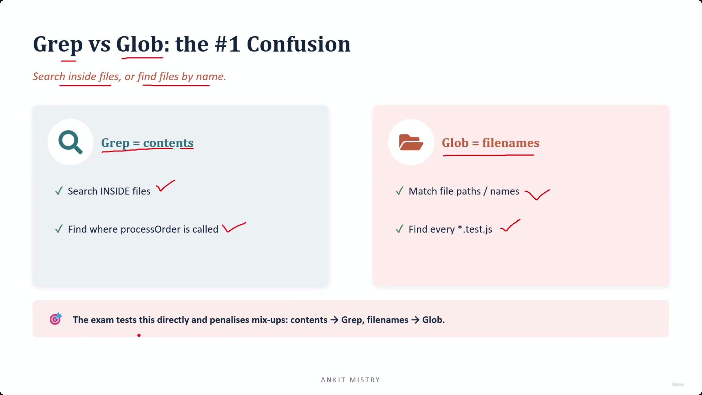
[00:03:47](https://www.udemy.com/course/claude-ai-certification/learn/lecture/57460133#overview)

[00:04:26](https://www.udemy.com/course/claude-ai-certification/learn/lecture/57460133#overview)

### Exam Tip: Grep vs. Glob

- **[Crucial Distinction]** Mixing these up is a common error that is directly tested and penalized
    - **Grep**: Contents (searching for text inside files)
    - **Glob**: Filenames (finding files by their names)

### Read, Edit, and Write

- Three tools used to manage file content:
    - **Read**: See a file
    - **Edit**: Change part of a file
    - **Write**: Replace the whole thing

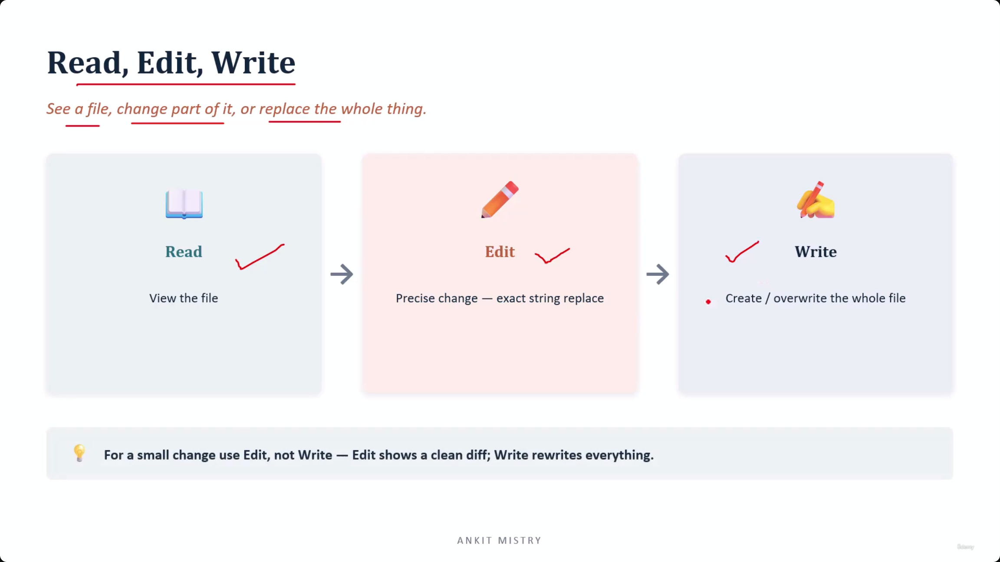
[00:05:02](https://www.udemy.com/course/claude-ai-certification/learn/lecture/57460133#overview)

### Tool Impact and Usage Habits

- The three tools manage file content with increasing levels of impact:
    - **Read**: Views the file (no change)
    - **Edit**: Performs a precise change (exact string replace)
    - **Write**: Creates or overwrites the entire file

```mermaid
flowchart LR
    A["Read"] -->|Small change| B["Edit"] -->|Full rewrite| C["Write"]
    style A fill:#f9f9f9,color:#000
    style B fill:#ffe6e6,color:#000
    style C fill:#e6f2ff,color:#000
```

- **[Key Habit]** Use `Edit` instead of `Write` for small changes
    - `Edit` shows a clean diff
    - `Write` rewrites everything, which is unnecessary for minor updates

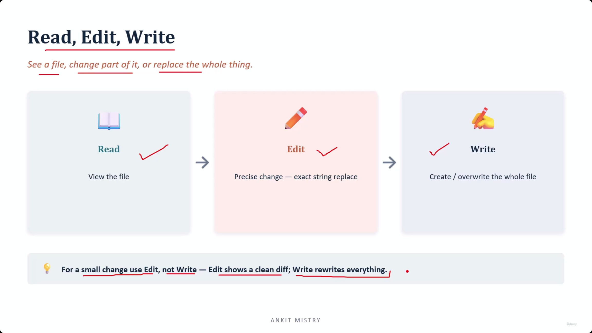
[00:05:16](https://www.udemy.com/course/claude-ai-certification/learn/lecture/57460133#overview)

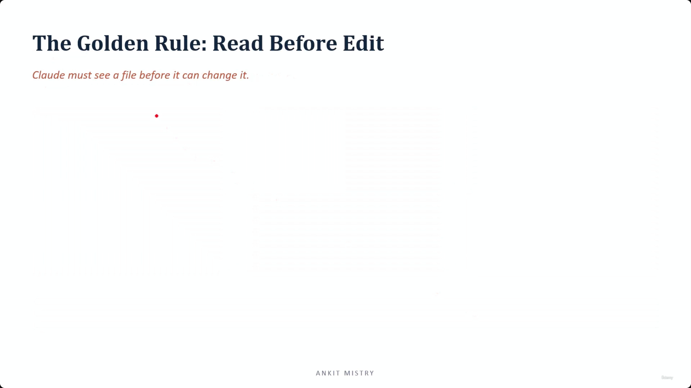
[00:05:37](https://www.udemy.com/course/claude-ai-certification/learn/lecture/57460133#overview)

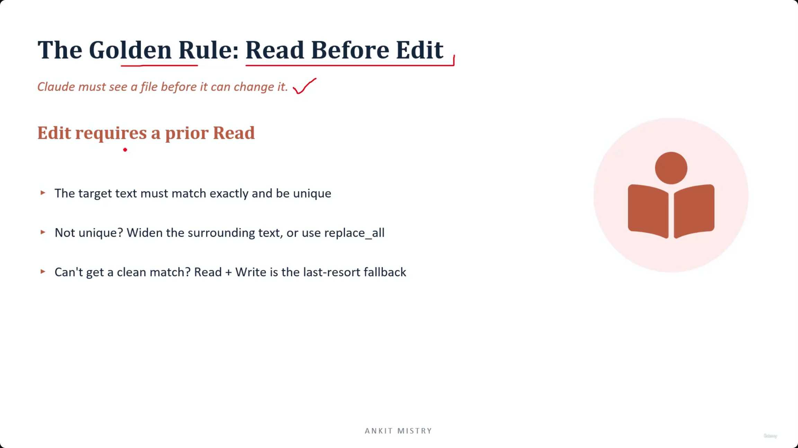
[00:05:52](https://www.udemy.com/course/claude-ai-certification/learn/lecture/57460133#overview)

### The Golden Rule: Read Before Edit

- **[The Rule]** Claude must see a file before it can change it
    - This means an `Edit` operation requires a prior `Read` operation
- **Why this is necessary for&#32;`Edit`**
    - The target text for an edit must match the file content exactly
    - The target text must also be unique within the file to avoid ambiguity
- **What to do if matching fails**
    - If the text is not unique: Widen the surrounding text used in the edit command
    - If a clean match is impossible: Use `Read` + `Write` as a last-resort fallback

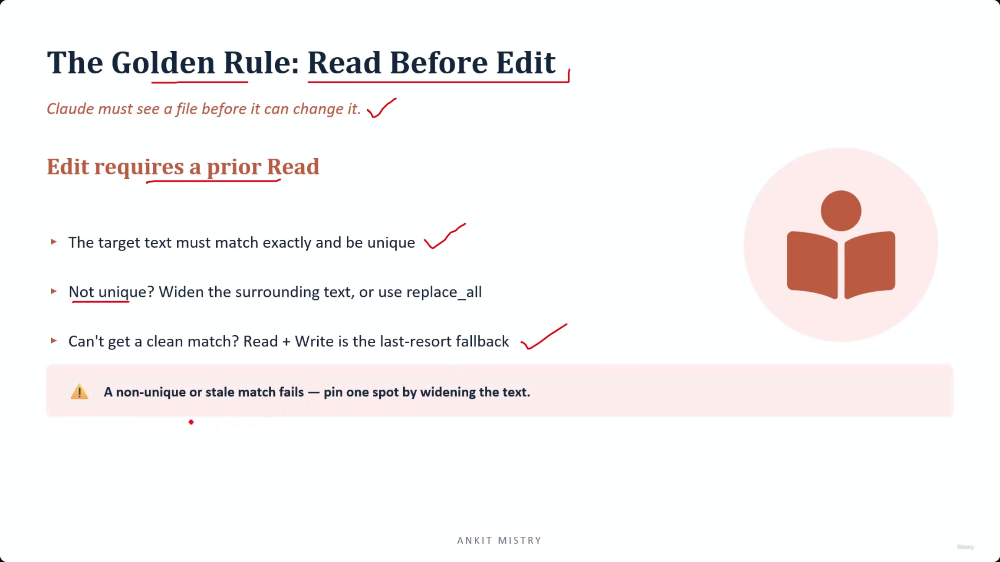
[00:06:29](https://www.udemy.com/course/claude-ai-certification/learn/lecture/57460133#overview)

### Troubleshooting Edit Failures

- **[The Mechanism]** `Edit` works by finding an exact piece of text and swapping it out
    - This requires Claude to have already read the file to know the text exists
    - Claude must also verify that the text appears only once to ensure accuracy
- **[Warning]** A non-unique or stale match fails
    - If the text you are matching appears in multiple places, `Edit` cannot determine which one to change
- **[Resolution Strategies]**
    - **Widen the context**: Pin the specific spot by including more surrounding text in the command
    - **Use&#32;`replace_all`**: An alternative when the pattern is consistent
    - **Last-resort fallback**: If a clean match is impossible, use `Read` + `Write` to replace the entire file

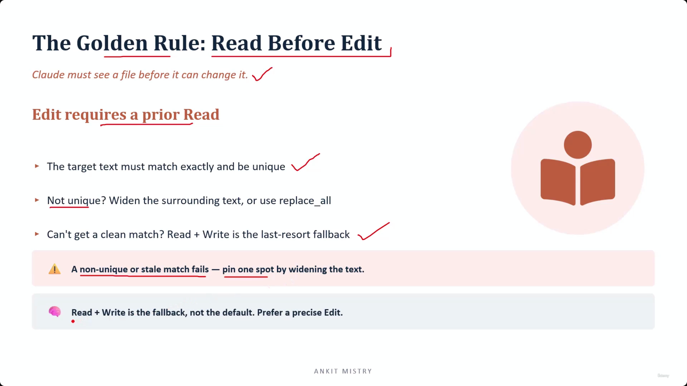
[00:07:01](https://www.udemy.com/course/claude-ai-certification/learn/lecture/57460133#overview)

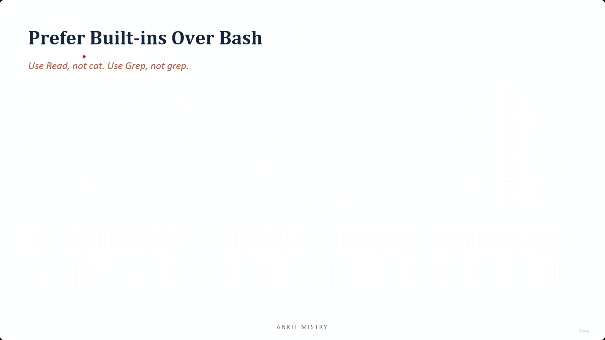
[00:07:31](https://www.udemy.com/course/claude-ai-certification/learn/lecture/57460133#overview)

### Precision vs. Convenience in File Modification

- **[The Fix]** If a match is non-unique, include more of the surrounding lines
    - This pins the change to one single, unmistakable spot
- **[The Fallback]** `Read` + `Write` is the last-resort fallback
    - **[Crucial]** This is *not* the default behavior
    - Always prefer a precise `Edit` as the first choice
- **[Why avoid&#32;`Write`&#32;as a default?]**
    - It is "heavier" (more resource-intensive/token-heavy)
    - It hides what actually changed by overwriting the entire file
    - A precise `Edit` is clearer and safer for tracking modifications

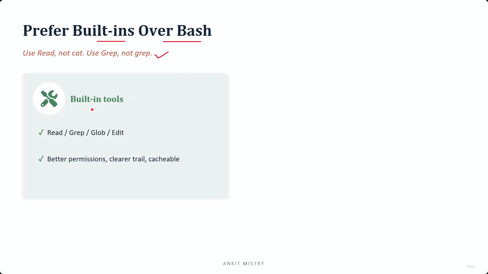
[00:07:48](https://www.udemy.com/course/claude-ai-certification/learn/lecture/57460133#overview)

## Prefer Built-ins Over Bash

- **[Core Principle]** Always prioritize Claude Code's built-in tools over running raw shell commands via `bash`
    - **Examples:**
        - Use `Read`, not `cat`
        - Use the built-in `Grep`, not the raw `grep` command
- **Advantages of Built-in Tools**
    - **Better Permissions:** They fit properly into the Claude Code permission system
    - **Clearer Trail:** They leave a clean, structured record of actions taken
    - **Cacheable Results:** The results can be reused from a cache, improving efficiency
- **The Built-in Toolkit**
    - `Read` / `Grep` / `Glob` / `Edit`

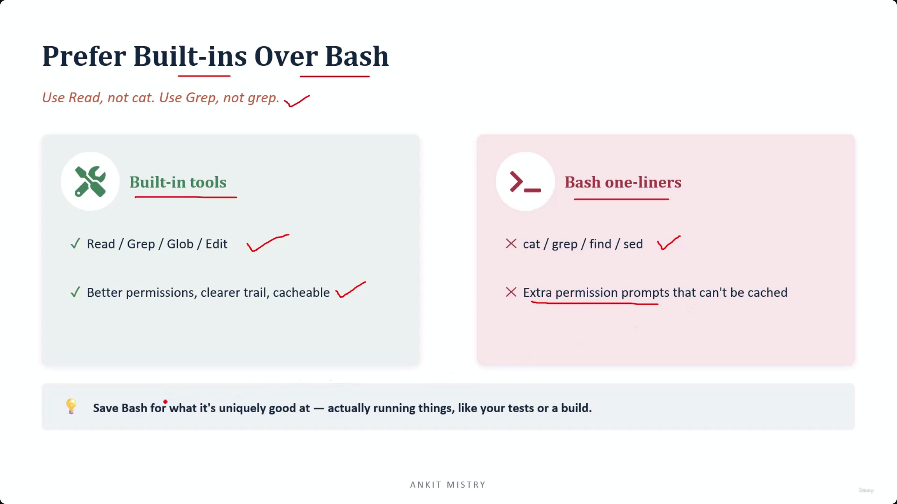
[00:08:53](https://www.udemy.com/course/claude-ai-certification/learn/lecture/57460133#overview)

### The Friction of Bash One-Liners

- **[The Problem]** Using raw shell commands for simple tasks adds unnecessary overhead
    - **Examples of one-liners to avoid:** `cat`, `grep`, `find`, `sed`
    - **Extra Permission Prompts:** Every time a raw shell command is used, it can trigger a new permission request
    - **No Caching:** Unlike built-ins, the work done via raw Bash commands cannot be cached and reused
- **[The Strategy]** Use Bash only for what it is uniquely good at
    - **Primary Use Case:** Running processes like tests or builds

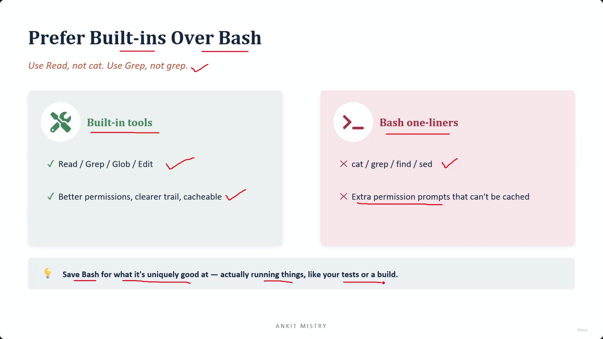
[00:09:04](https://www.udemy.com/course/claude-ai-certification/learn/lecture/57460133#overview)

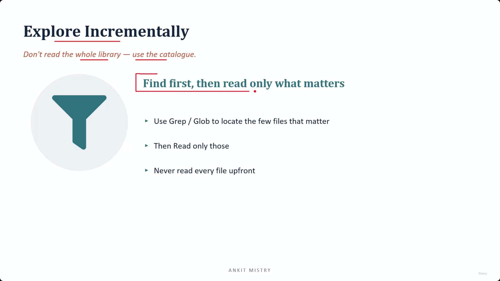
[00:09:42](https://www.udemy.com/course/claude-ai-certification/learn/lecture/57460133#overview)

### The Proper Balance of Bash

- **[Not "Never Use Bash"]** Bash is essential for tasks that only it can perform
    - **Primary Use Cases:**
        - Running tests
        - Kicking off a build
        - Executing actual system commands
- **Summary of Tool Selection**
    - **Use Built-ins for:** Reading, searching, and editing
    - **Use Bash for:** Actually running things

## Explore Incrementally

- **[The Philosophy]** Don't read the whole library — use the catalogue
- **The Incremental Approach**
    - **Step 1: Find first**
        - Use `Grep` or `Glob` to locate the few specific files that matter
    - **Step 2: Read only what matters**
        - Once located, use `Read` on only those specific files
    - **[Key Principle]** Never read every file upfront

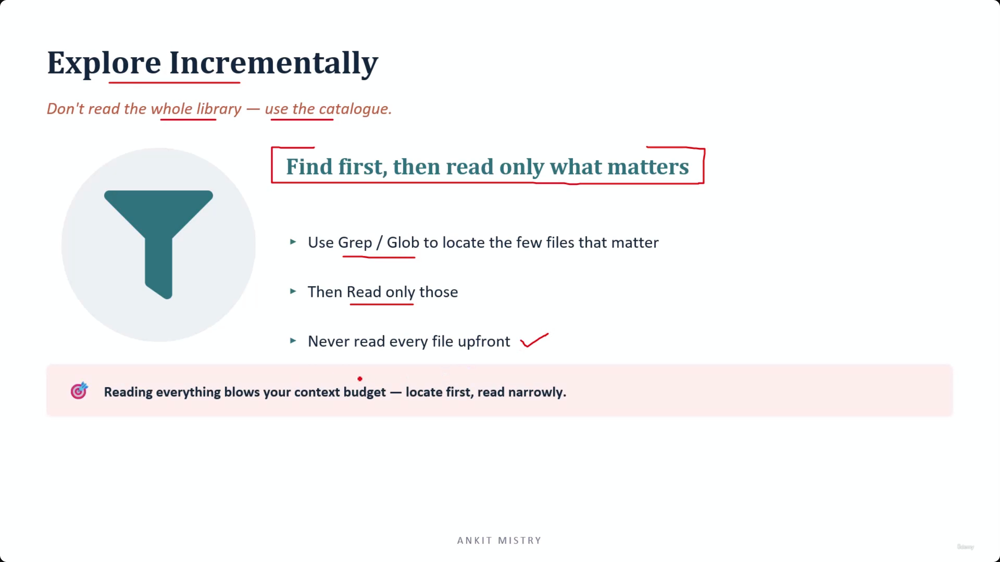
[00:10:15](https://www.udemy.com/course/claude-ai-certification/learn/lecture/57460133#overview)

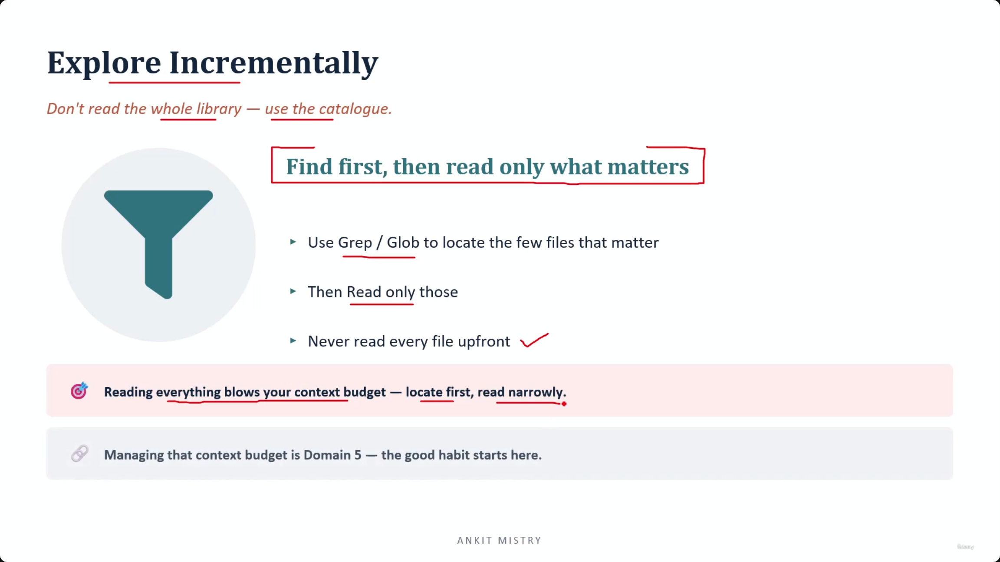
[00:10:46](https://www.udemy.com/course/claude-ai-certification/learn/lecture/57460133#overview)

### Protecting the Context Budget

- **[The Problem]** Reading every file is enormously wasteful
    - It blows your context budget
    - Context is limited and precious
- **[The Solution]** Use the "catalogue" approach
    - **Step 1: Check the catalogue**
        - Use `Grep` or `Glob` to locate the specific files needed
    - **Step 2: Pull only what is necessary**
        - Read only the two or three files identified by the search
- **Key Principle: Locate first, read narrowly**
    - This discipline is the foundation for managing context properly

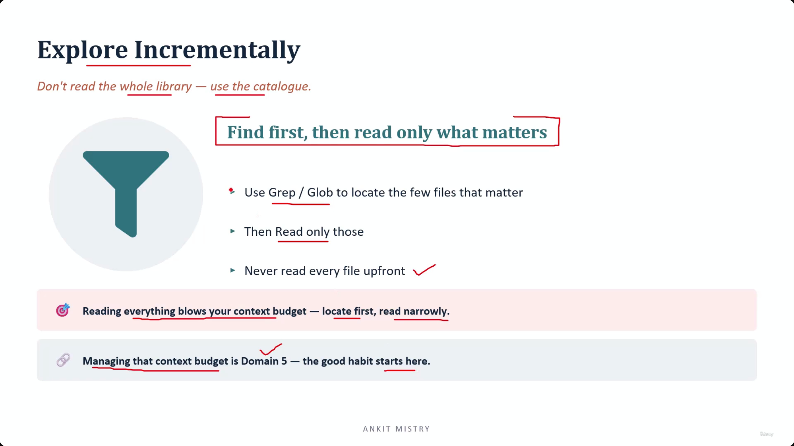
[00:11:19](https://www.udemy.com/course/claude-ai-certification/learn/lecture/57460133#overview)

[00:11:57](https://www.udemy.com/course/claude-ai-certification/learn/lecture/57460133#overview)

## Key Takeaways

### Built-in Tools Summary

- **Six tools, clear jobs**
    - `Read`, `Write`, `Edit`, `Bash`, `Grep`, and `Glob`
    - **[Distinction]** `Grep` = contents; `Glob` = filenames
- **Read before Edit**
    - Target text must be an exact and unique match
    - **Fallbacks:** Use `replace_all` or the `Read` + `Write` method if a clean match isn't possible
- **Built-ins + Incremental**
    - Prefer built-in tools over raw `Bash` commands
    - Locate files first (using `Grep`/`Glob`) rather than reading everything upfront

[00:12:04](https://www.udemy.com/course/claude-ai-certification/learn/lecture/57460133#overview)

### Domain 2 Recap: Tool Design and MCP Integration

- **Progression of learning**
    - Designing single-tool interfaces for Claude to select
    - Implementing structured errors to make failures communicate clearly
    - Distributing tools wisely and forcing choices when necessary
    - Integrating with the wider world via MCP
    - Mastering the built-in toolkit
- **[Core Objective]** The goal of tool design and MCP integration is to provide Claude with the correct "hands" and describe them so effectively that it always reaches for the right tool for the job.

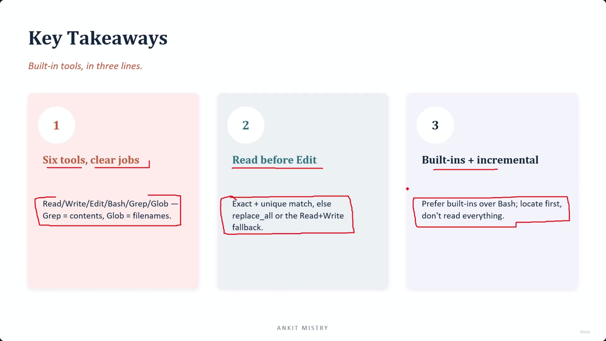
[00:12:49](https://www.udemy.com/course/claude-ai-certification/learn/lecture/57460133#overview)

## Claude Code Configuration and Workflows

- **[New Domain]** Moving from individual tools to systemic behavior
    - Focus on how to shape Claude Code's behavior for an entire team or project
    - Covers setup and workflows surrounding the tools

---

## Simple Explanation (with Claude Examples)

**The core idea, in one line**: Claude Code ships six built-in tools, each with exactly one job — using the right one (and using it precisely) is faster, safer, and cheaper than reaching for raw shell commands.

**The six tools, at a glance**

- `Read` — opens and views a file
- `Write` — creates or overwrites a file
- `Edit` — changes just part of a file
- `Bash` — runs shell commands
- `Grep` — searches *inside* files for text
- `Glob` — finds files by *name*

**Grep vs. Glob — the #1 confusion**

`Grep` = contents (what's written inside a file). `Glob` = filenames (which files exist by name).

*Claude Code example*: If you asked me "find where `processOrder` is called," I'd reach for `Grep` — I'm searching text *inside* files. If you asked "find every `*.test.js` file," I'd reach for `Glob` — I'm matching *filenames*, not caring what's written inside them.

**Read, Edit, Write — increasing levels of impact**

`Read` (no change) → `Edit` (a precise, targeted swap) → `Write` (replaces the entire file). Prefer `Edit` for small changes: it shows a clean diff and is far lighter than rewriting a whole file for a one-line fix.

**The Golden Rule: Read Before Edit**

Claude must see a file before it can change it — an `Edit` requires a prior `Read`. Why: the text you're replacing must match the file *exactly*, and it must be *unique* — otherwise `Edit` can't know which occurrence you mean.

*Claude Code example*: In this very conversation, every time I've used `Edit` on a note file, I first called `Read` on it — that's not optional politeness, it's a hard requirement of how `Edit` works, because I need to know the exact current text to target it precisely.

**If the match isn't unique**: widen the surrounding text to pin down one specific spot, or use `replace_all` if the same pattern should change everywhere. If a clean match is truly impossible, `Read` + `Write` is the last resort — never the default, since it's heavier and hides exactly what changed compared to a precise `Edit`.

**Prefer built-ins over Bash**

Use `Read`, not `cat`. Use the built-in `Grep`, not raw `grep`. Built-ins fit the permission system properly, leave a clean audit trail, and their results can be cached — raw Bash one-liners get none of that, and each one can trigger its own fresh permission prompt.

*Claude Code example*: In this session, I have a dedicated `Read` tool instead of running `cat file.md` via `Bash` — using `Read` gives you a cleaner, structured tool call in the transcript rather than an opaque shell command, and it's exactly the built-ins-over-bash principle described here.

**Bash still has its place**: running tests, kicking off a build, executing genuine system commands — things only a shell process can actually do.

**Explore incrementally — don't read the whole library**

Locate first (`Grep`/`Glob`), then read only the two or three files that actually matter. Reading every file upfront blows your context budget for no reason.

*Claude Code example*: When you asked me to find and explain specific note files throughout this conversation, I used `Bash find` or targeted `Read` calls on exact paths — I never read every file in the `Notes` folder upfront "just in case." That discipline is precisely what keeps this long conversation from drowning in irrelevant file contents.

**Recap in 3 lines**

1. **Grep = contents, Glob = filenames** — the most commonly confused pair; mixing them up wastes tokens and time.
2. **Read before Edit, always** — the target text must be exact and unique; widen context or use `replace_all` if it isn't.
3. **Built-ins over Bash, and locate before reading** — cleaner permissions, better caching, and never read the whole codebase when a targeted search will do.