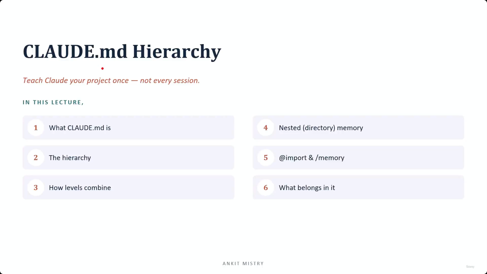

## CLAUDE.md Hierarchy

- A method to teach Claude about your project once, rather than having to re-teach it in every single session
- This forms the basis for project configuration and workflows within Domain 3

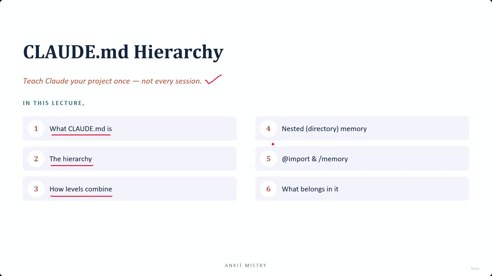
[00:00:43](https://www.udemy.com/course/claude-ai-certification/learn/lecture/57479739#overview)

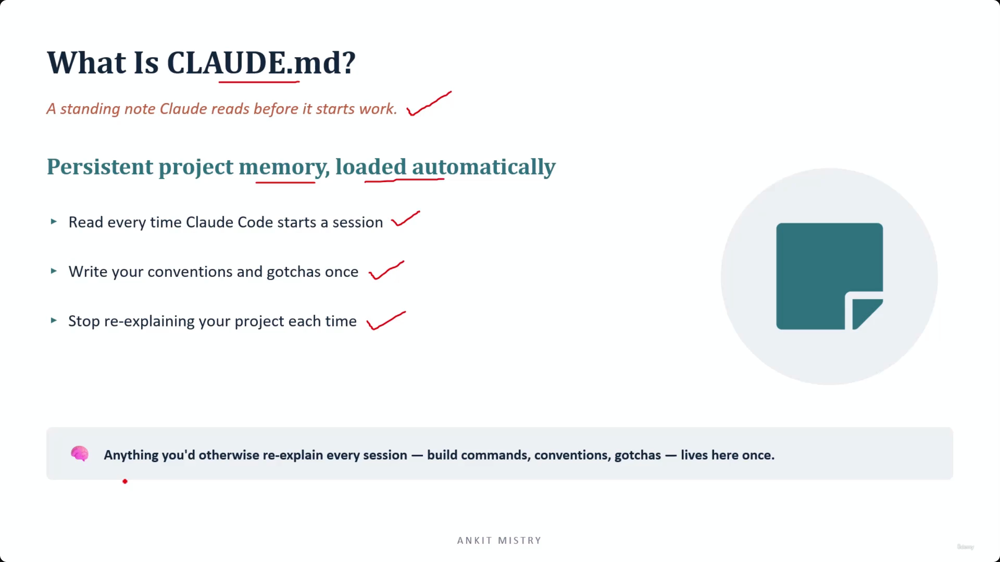
[00:01:50](https://www.udemy.com/course/claude-ai-certification/learn/lecture/57479739#overview)

### Determining what belongs in CLAUDE.md

- **[Rule of Thumb]** Anything you would otherwise re-explain every session lives here once
    - This includes build commands
    - Coding conventions
    - Project "gotchas" or common traps

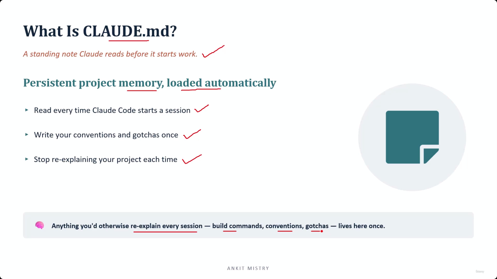
[00:02:11](https://www.udemy.com/course/claude-ai-certification/learn/lecture/57479739#overview)

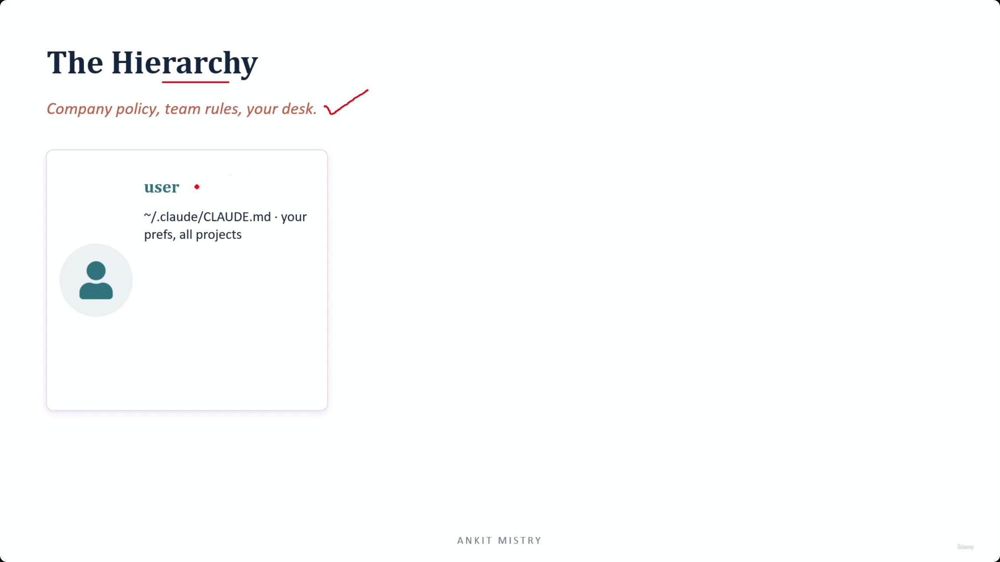
[00:02:31](https://www.udemy.com/course/claude-ai-certification/learn/lecture/57479739#overview)

### Hierarchy Levels

- Organized by scope, analogous to "Company policy, team rules, your desk"
- **User Level**
    - Located in the home folder as `~/.claude/CLAUDE.md`
    - Holds personal preferences and habits
    - These settings are persistent across all projects

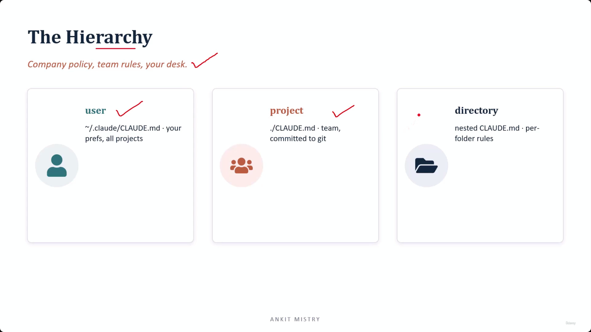
[00:03:36](https://www.udemy.com/course/claude-ai-certification/learn/lecture/57479739#overview)

### Project Level

- A CLAUDE.md file located at the project root
- **[Key characteristic]** It is committed to git
    - This makes it a shared resource for the entire team
    - Anyone who clones the project will automatically receive these instructions
- **[Common Pitfall]** If a teammate isn't following project instructions, they may have mistakenly placed them at the User level (which is personal/private) instead of the Project level (which is shared)

### Directory Level

- Nested CLAUDE.md files within specific sub-directories
- Used to define per-folder rules

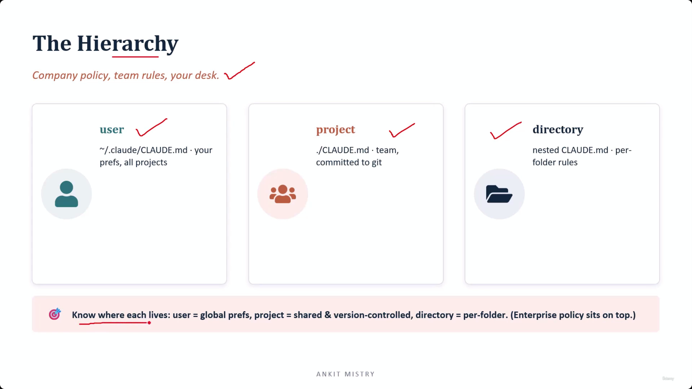
[00:04:01](https://www.udemy.com/course/claude-ai-certification/learn/lecture/57479739#overview)

### Directory-Specific Rules

- A nested `CLAUDE.md` file placed within a specific folder
- **[Purpose]** Provides rules that apply exclusively to that specific directory/folder

### Summary of Hierarchy Levels

| Level | Scope | Key Characteristic |
| --- | --- | --- |
| User | Global preferences | Personal to you; follows you across all projects |
| Project | Shared / Team | Located at project root; committed to git (version-controlled) |
| Directory | Per-folder | Nested within specific directories for granular rules |
| Enterprise | Organization-wide | Sits at the very top, above all other levels |

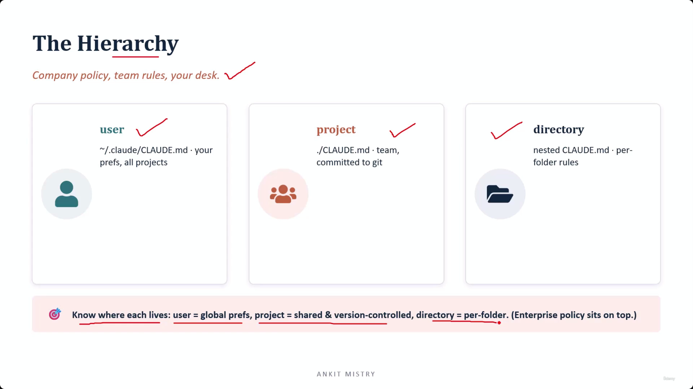
[00:04:26](https://www.udemy.com/course/claude-ai-certification/learn/lecture/57479739#overview)

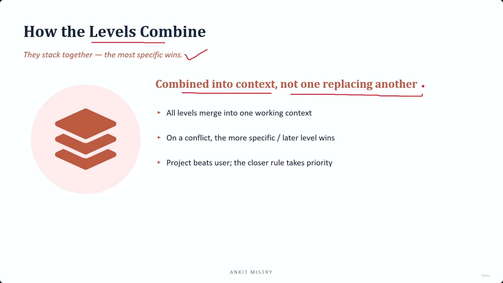
[00:04:50](https://www.udemy.com/course/claude-ai-certification/learn/lecture/57479739#overview)

### How the Levels Combine

- **[The Rule]** They stack together — the most specific wins
- All levels merge into one working context rather than one replacing another
- **[Conflict Resolution]** On a conflict, the more specific or later level wins
    - Project rules beat user rules
    - The closer rule takes priority

[00:05:20](https://www.udemy.com/course/claude-ai-certification/learn/lecture/57479739#overview)

### Conflict Resolution in Combined Levels

- **[The Dual Principle]** Rules function through both addition and priority:
    - **Merging**: All levels are additive; Claude sees and incorporates all of them together into one working context
    - **Specificity**: When rules conflict, the more specific or "closer" rule takes priority
- **Example: Indentation Conflict**
    - Personal file: `2-space` indentation
    - Project file: `4-space` indentation
    - **Result**: The project rule wins because it is closer and more specific to the shared work being performed

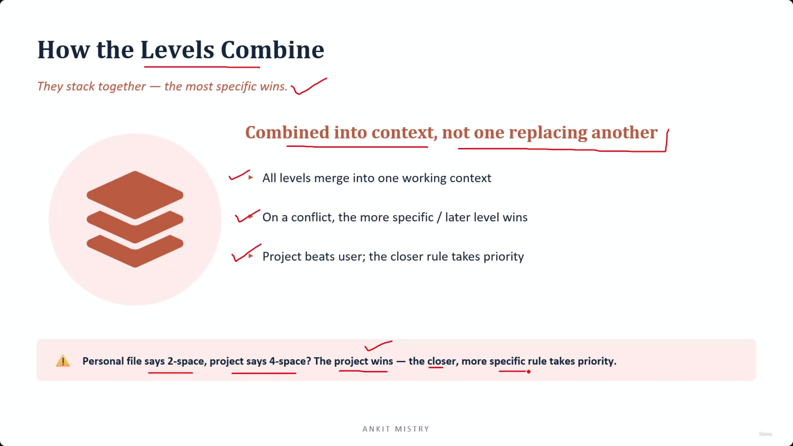
[00:05:45](https://www.udemy.com/course/claude-ai-certification/learn/lecture/57479739#overview)

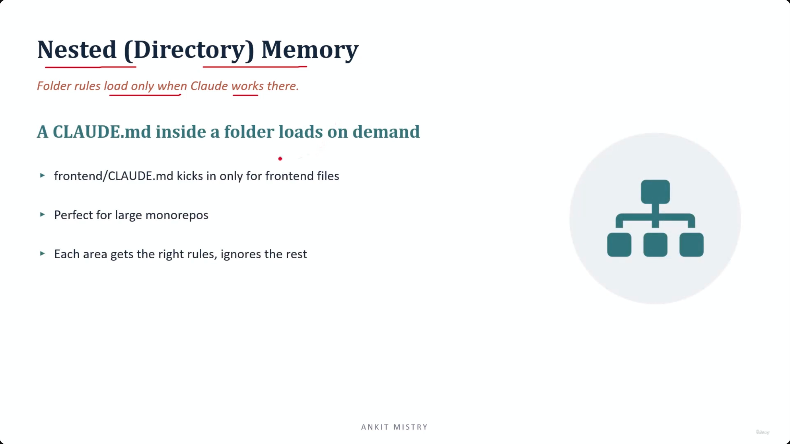
[00:06:11](https://www.udemy.com/course/claude-ai-certification/learn/lecture/57479739#overview)

### Nested (Directory) Memory

- Folder rules load only when Claude works in that specific directory
- **[Mechanism]** A `CLAUDE.md` file inside a folder loads on demand
    - For example, `frontend/CLAUDE.md` kicks in only for files within the `frontend` folder
- **[Why it matters]** Perfect for large monorepos
    - Each area gets exactly the right rules
    - It ignores rules that aren't relevant to the current directory

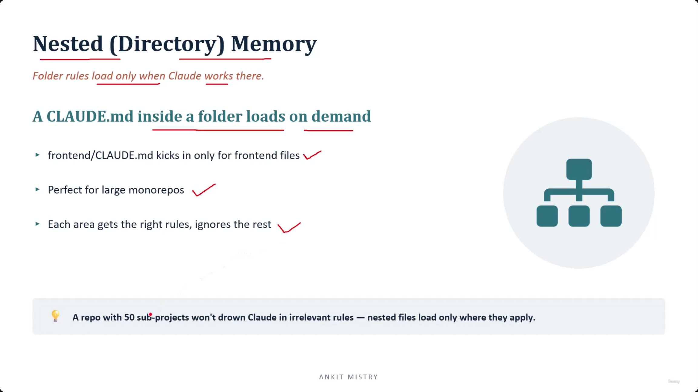
[00:06:49](https://www.udemy.com/course/claude-ai-certification/learn/lecture/57479739#overview)

### Scalability through Efficiency

- **[Efficiency]** Rules are context-aware and load only when necessary
    - Frontend rules do not clutter the context when working on the backend
    - Each folder's rules appear only when they are actually relevant
- **[Scaling for Monorepos]** Prevents "context drowning"
    - In a repository with many sub-projects (e.g., 50+), Claude won't be overwhelmed by irrelevant rules
    - Nested files solve the problem of being buried under rules that have nothing to do with the current task

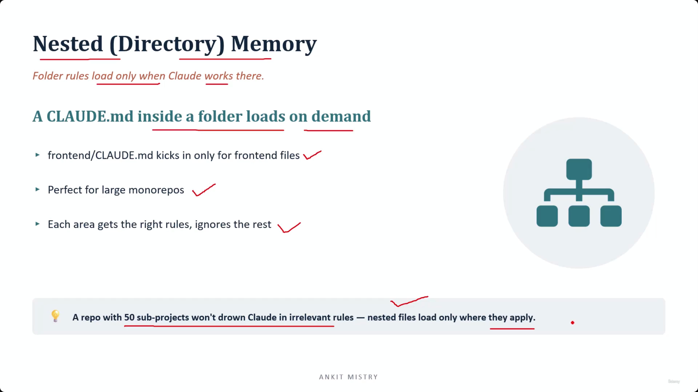
[00:07:16](https://www.udemy.com/course/claude-ai-certification/learn/lecture/57479739#overview)

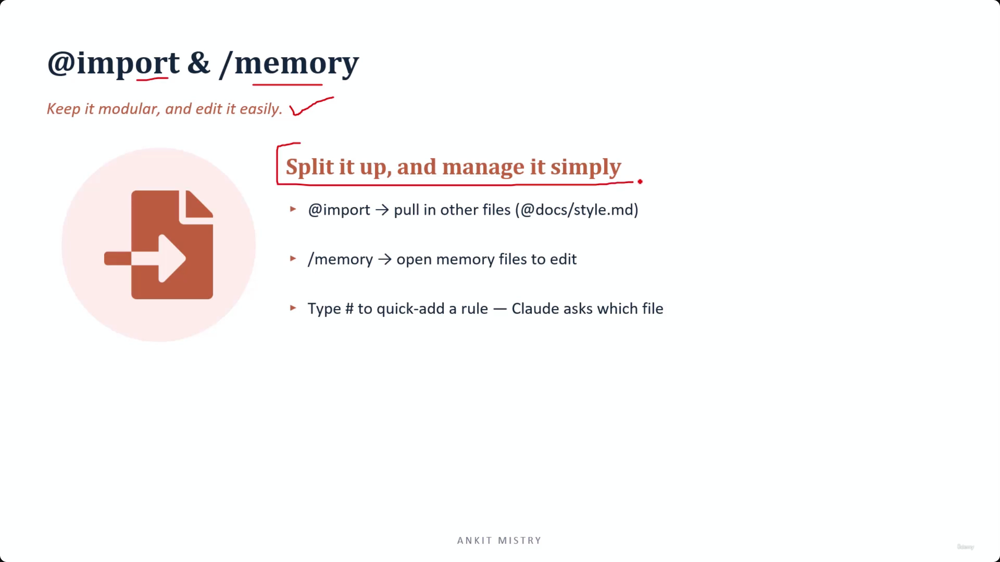
[00:07:39](https://www.udemy.com/course/claude-ai-certification/learn/lecture/57479739#overview)

### @import & /memory

- **[Purpose]** To keep the configuration modular and easy to edit
- **Tools for management**:
    - `@import` $\rightarrow$ Pulls in other files (e.g., `@docs/style.md`)
    - `/memory` $\rightarrow$ Opens memory files for direct editing
    - `Type #` $\rightarrow$ Quick-add a rule
        - Claude will prompt you to specify which file the rule should belong to

[00:08:42](https://www.udemy.com/course/claude-ai-certification/learn/lecture/57479739#overview)

### Modular Organization vs. Context Size

- **[The Important Catch]** Imports are for human organization, not context management
    - Using `@import` keeps the file tidy and modular for the user
    - **[Crucial Distinction]** It does **not** shrink the context window
    - Everything imported still loads into Claude's context at launch
- **[Quick-add Rule]** Using the `#` symbol
    - Typing `#` at the start of a message allows you to quickly jot down a rule
    - Claude will then prompt you to specify which file the rule should be saved to

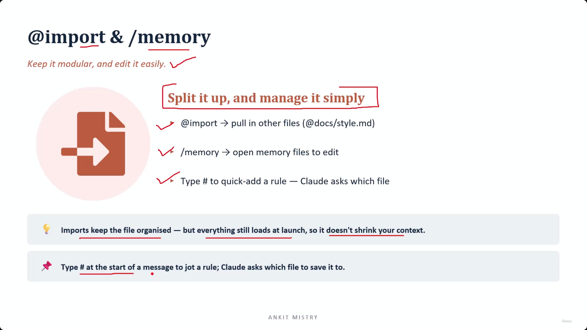
[00:08:46](https://www.udemy.com/course/claude-ai-certification/learn/lecture/57479739#overview)

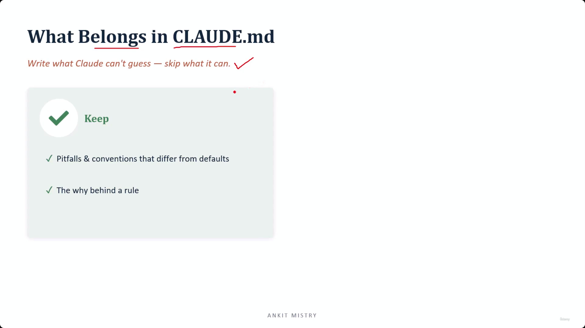
[00:09:30](https://www.udemy.com/course/claude-ai-certification/learn/lecture/57479739#overview)

### Rule Management Workflow

- **[The Workflow Benefit]** Using `#` at the start of a message allows you to jot down a rule mid-session
    - Instead of stopping to open files, you just type `#` and your rule
    - Claude then asks which file to save it to, keeping the process quick and painless
- **[The Important Catch]** Imports are for organizational purposes only
    - **[Warning]** Imports do **not** shrink your context
    - Everything still loads at launch, so while it makes the files tidier and easier to manage, it doesn't save context space

### Content Selection: What to Include

- **[The Filter]** Use this rule of thumb to decide what to include:
    - Write what Claude **can't** guess
    - Skip what it **can**

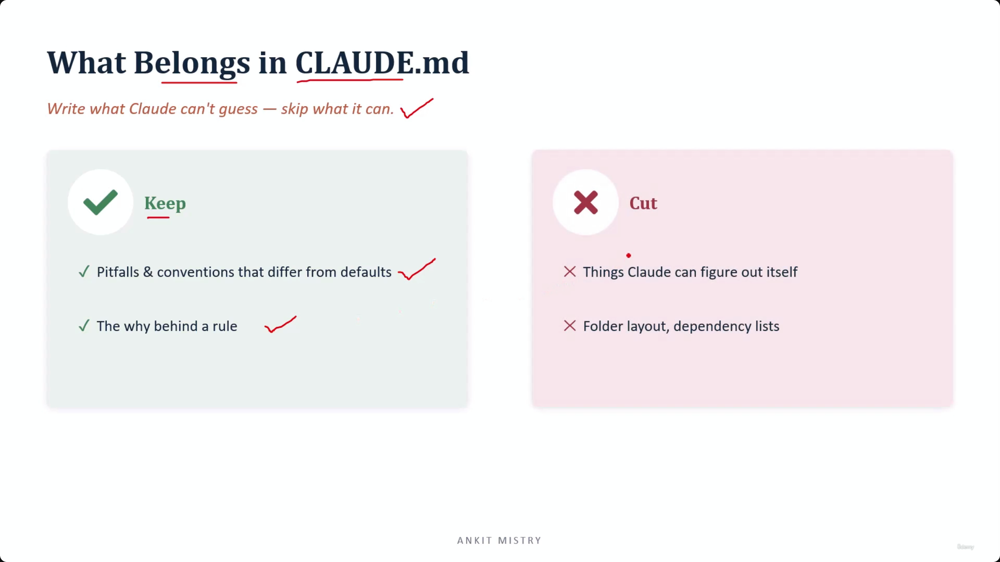
[00:09:59](https://www.udemy.com/course/claude-ai-certification/learn/lecture/57479739#overview)

### What Belongs in CLAUDE.md

- **[Core Principle]** Write what Claude can't guess — skip what it can

#### What to Keep

- Pitfalls and conventions that differ from defaults
    - Include things that are surprising or particular to your specific project
    - Document traps that aren't obvious to an outsider
- The "why" behind a rule
    - **[Why it matters]** Providing the reasoning ensures Claude understands the intent rather than just blindly obeying a command

#### What to Cut

- Things Claude can figure out itself
    - **[Examples]**
        - Folder layouts
        - Dependency lists
    - **[Why leave them out]** Claude can simply look at the project structure and read files like `package.json` to understand these details automatically

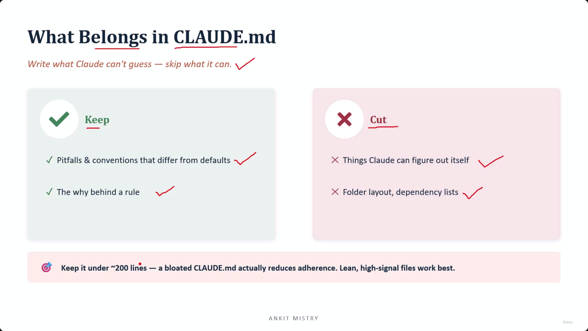
[00:10:30](https://www.udemy.com/course/claude-ai-certification/learn/lecture/57479739#overview)

### Maintaining High Signal

- **[The 200-Line Limit]** Keep the file under approximately 200 lines
    - **[Why?]** A bloated file actually reduces adherence
    - **[The Counter-intuitive Truth]** More instructions do not necessarily mean more control; when the file becomes too large, Claude follows it less effectively
    - **[The Goal]** Aim for lean, high-signal files that contain only the most important information

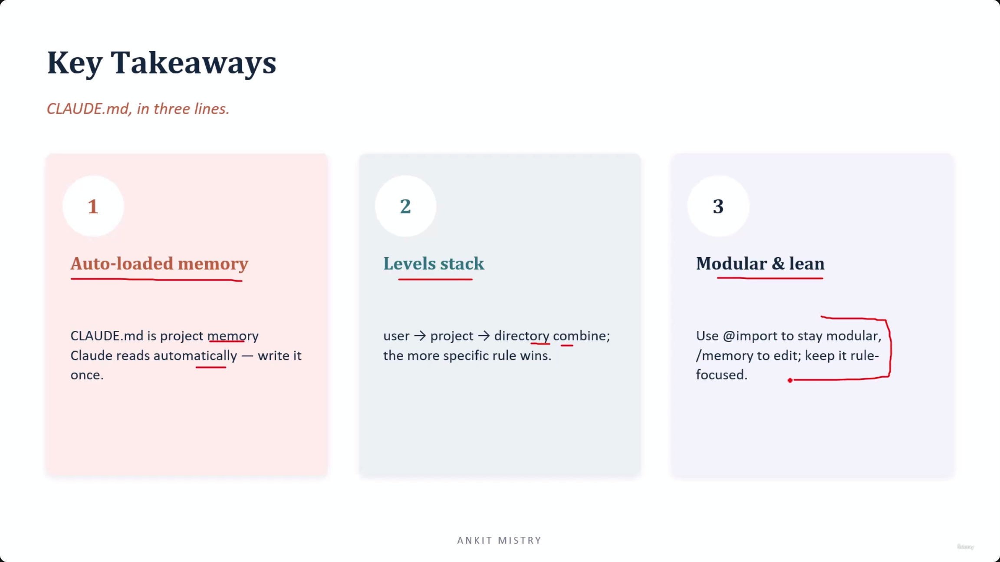
[00:11:35](https://www.udemy.com/course/claude-ai-certification/learn/lecture/57479739#overview)

### CLAUDE.md Key Takeaways

- **1. Auto-loaded memory**
    - CLAUDE.md acts as project memory that Claude reads automatically
    - You write it once, and it stays part of the context
- **2. Levels stack**
    - Rules combine across different levels: `user` $\rightarrow$ `project` $\rightarrow$ `directory`
    - **[Precedence]** A more specific rule wins in the event of a conflict
- **3. Modular & lean**
    - Use `@import` to keep the structure modular
    - Use `/memory` to edit files easily
    - **[Goal]** Keep the content rule-focused to maintain high signal

[00:11:48](https://www.udemy.com/course/claude-ai-certification/learn/lecture/57479739#overview)

---

## Simple Explanation (with Claude Examples)

**The core idea, in one line**: `CLAUDE.md` is a way to teach Claude about your project once — at different levels of scope — instead of re-explaining the same things every session.

**The four hierarchy levels — "company policy, team rules, your desk"**

| Level | Path example | Applies to |
|---|---|---|
| Enterprise | `/Library/Application Support/ClaudeCode/CLAUDE.md` | Everyone, org-wide |
| User | `~/.claude/CLAUDE.md` | Just you, across all your projects |
| Project | `<project-root>/CLAUDE.md` | Everyone working on that repo (committed to git) |
| Directory | `<project-root>/<subfolder>/CLAUDE.md` | Only work inside that specific folder |

*Claude Code example*: a `frontend/CLAUDE.md` saying "use Tailwind, not custom CSS" only loads when I'm actually working inside `frontend/` — it stays completely out of my context when I'm working on the backend instead.

**How precedence works — merge, then let the closest rule win**

All applicable levels load *together*, not one replacing another. When two levels conflict, the **more specific/closer** one wins: Directory > Project > User > Enterprise.

*Example*: your personal file says "2-space indentation," the project file says "4-space indentation" — the project rule wins for shared work, because it's closer to the actual task than your general personal habit.

**`@import` — organizing for humans, not for context savings**

`@import` lets you split one giant `CLAUDE.md` into smaller files (`docs/style.md`, `docs/testing.md`) and pull them back together with a reference — like `#include` in C. The important catch: **imports don't shrink Claude's context**. Everything imported still fully loads at launch — it's a tidiness trick for you, not a context-saving trick for Claude.

**The `#` quick-add shortcut**

Typing `#` at the start of a message lets you jot a rule down mid-conversation without stopping to open a file — Claude then asks which file (User/Project/Directory) it should be saved to. It's the sticky-note version of editing `CLAUDE.md`, useful for capturing a correction the moment you notice it instead of forgetting to write it down later.

**What belongs in the file — write what Claude can't guess**

- **Keep**: surprising project-specific gotchas, and the *why* behind a rule (so Claude can apply it sensibly in edge cases, not just obey blindly).
- **Cut**: things Claude can figure out itself — folder layout, dependency lists (it can just read `package.json`).

**The 200-line limit — counterintuitively, less is more**

Keeping the file lean (under ~200 lines) makes Claude follow it *more* reliably, not less. A bloated file full of obvious advice dilutes attention, and important rules get lost in the noise.

**Recap in 3 lines**

1. **Levels stack, closest wins** — Enterprise → User → Project → Directory, merged together, most specific rule wins conflicts.
2. **`@import` organizes files for humans; it doesn't save Claude any context** — everything still loads in full.
3. **Write what Claude can't guess, keep it under ~200 lines** — a lean, high-signal file gets followed better than a long, generic one.

---

## Exam Objective Note: CCAR-F 3.1 — CLAUDE.md Hierarchy, Scoping, and Modular Organisation

**The cost side: the whole file loads every time, whether you need it or not**

`CLAUDE.md` doesn't pick and choose what to load. It loads in full, at the start of every single conversation. So a rarely-needed section, like "monthly release steps," still costs context in every conversation, even ones that have nothing to do with releases. This is exactly why path-specific rules exist (see note 3.3) — so you stop paying for things that aren't relevant right now.

**The correctness side: conflicts don't get fixed, they just pile up together**

Here's the sharper point: when two levels of `CLAUDE.md` disagree, nothing merges them or picks a winner. Both instructions get pasted into context side by side. "The closer rule wins" is advice we give the agent — it isn't something the system enforces. Nothing deletes the losing rule, so Claude could still end up following either one.

*Everyday analogy*: two sticky notes on your desk — one says "always use blue ink," the other says "always use black ink." Telling someone "when in doubt, follow the closer note" doesn't make the other note disappear. It's still sitting right there, and someone in a hurry could grab either pen.

*Claude Code example*: say your personal file says "use tabs" and your project file says "use spaces." Both lines actually sit in context together, unresolved. Claude is expected to follow "spaces" because it's closer, but nothing physically stops it from following "tabs" instead — the contradiction is still fully present.

**Key fact 1 — the fix for a long file is cutting it down, not emphasizing it**

Length itself hurts adherence. Making a bloated file **bold**, ALL-CAPS, or repeating the same rule louder doesn't help — that's still more content. The only real fix is deleting stuff.

**Key fact 2 — after compaction, only the root file comes back on its own**

After `/compact`, Claude automatically reloads the **project-root `CLAUDE.md`** into the freshly shrunk context. But **subdirectory-level files are not brought back automatically** — they only reappear if Claude happens to touch a matching file in that folder again later.

**Recap in 3 lines**

1. **The whole file loads every session regardless of relevance** — irrelevant sections still cost context every time.
2. **Conflicts pile up, they don't resolve** — both rules sit in context together, and Claude could follow either.
3. **Cut length instead of emphasizing it — and remember compaction only restores the root file**, not subdirectory-level ones.