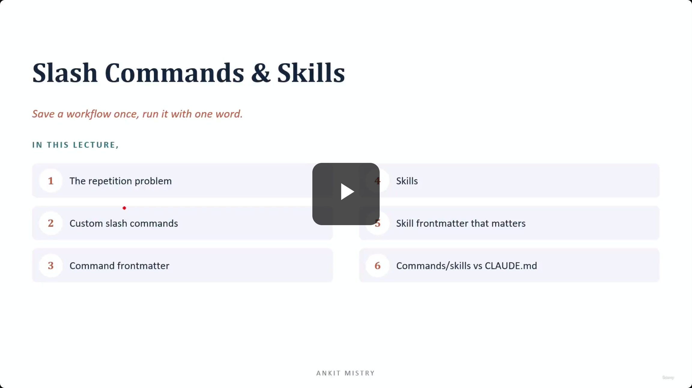
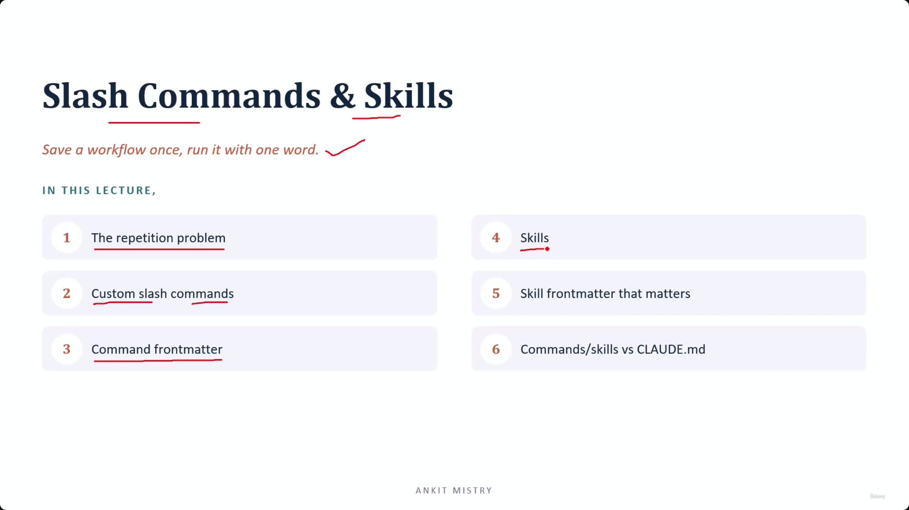
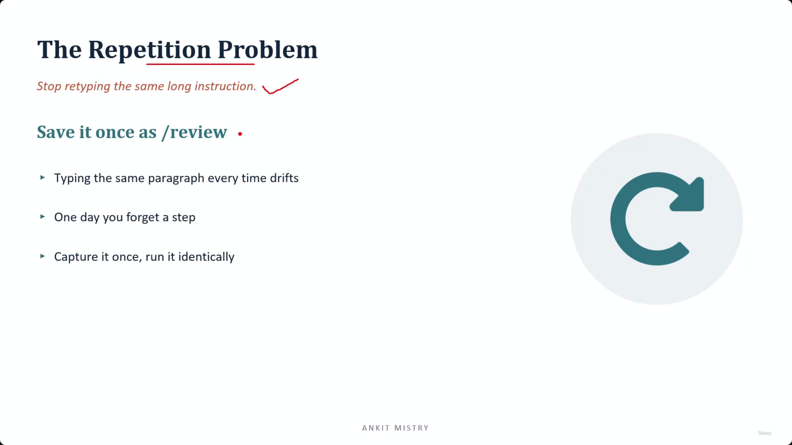

## Slash Commands & Skills

- Save a workflow once, run it with one word.
- **[Goal]** To automate actions that are run repeatedly so they can be fired off with a single word.

### Lecture Roadmap

1. The repetition problem
2. Custom slash commands
3. Command frontmatter
4. Skills
5. Skill frontmatter that matters
6. Commands/skills vs CLAUDE.md

[00:00:41](https://www.udemy.com/course/claude-ai-certification/learn/lecture/57479743#overview)

[00:01:06](https://www.udemy.com/course/claude-ai-certification/learn/lecture/57479743#overview)

### The Repetition Problem

- **[Problem]** Stop retyping the same long instruction
    - Manually typing the same paragraph every time leads to "drift"
    - Repetitive manual entry increases the risk of forgetting a step one day
- **[Solution]** Save it once as a command (e.g., `/review`)
    - Capture the instruction once
    - Run it identically every time to ensure consistency

### The Value of Command Consistency

- **[The Core Benefit]** Freezing instructions
    - Manually retyping instructions leads to variation (a word changes, a step is dropped)
    - Saving a command "freezes" the instruction perfectly
    - This ensures the command runs the same way every single time
- **[Analogy]** Slash commands as "Speed Dial"
    - Just as you don't dial a phone number digit by digit (risking mistakes)
    - You press one button to reach the exact same destination
    - A command tucks a careful, detailed instruction behind one short, reliable name

### Custom Slash Commands

- **[Mechanism]** A Markdown file is transformed into a command
- **[Creation Process]** Drop a file into the `.claude/commands` folder
    - **Project-specific commands**: Stored in the `[project_name]/.claude/commands` folder
    - **Personal/Global commands**: Stored in the `~/ .claude/commands` folder in your home directory
- **[Structure]**
    - **Command Name**: Derived directly from the filename
    - **Prompt Content**: The body of the Markdown file becomes the actual instruction
- **[Dynamic Input]**
    - Use the `$arguments` placeholder
    - **[Why?]** This allows you to drop your specific input (e.g., a piece of code or a bug description) directly into the saved prompt
    - Example: A file named `fix-issue.md` would be invoked as `/fix-issue`

### Command Scoping vs. CLAUDE.md

- **[Parallel Logic]** The scoping mechanism for slash commands mirrors the logic used for `CLAUDE.md`:
    - **Project-level** (`[project_name]/.claude/commands`): Committed to version control for team-wide standardization.
    - **Home-directory level** (`~/.claude/commands`): Stays local to the individual for personal workflows.

### Command Front Matter

- **[Purpose]** Adding a few lines of configuration makes a command more robust and easier to use
- **[Key Fields]**
    - **`description`**
        - Defines what the command does
        - **[Benefit]** Makes the command discoverable by appearing in `/help` and allowing Claude to auto-suggest the command during typing
    - **`argument_hint`**
        - Provides context for the expected input
        - **[Benefit]** Acts as an autocomplete hint for the `$arguments` placeholder, guiding the user on what to provide

### Advanced Command Configuration

Beyond discoverability, front matter can be used to fine-tune the execution environment of a command:

- **`allowed_tools`**
    - Pre-approves specific tools for use within the command
    - **[Benefit]** Prevents the workflow from pausing mid-run to ask for user permission, allowing for a seamless, uninterrupted execution
- **`model`**
    - Specifies a particular LLM to power the command
    - **[Why?]** Not every task requires the most powerful model; you can specify a "lighter" or "faster" model for simpler commands
    - **[Benefit]** Increases execution speed and reduces operational costs
- **[Summary of Description Benefits]**
    - Makes the command discoverable via `/help`
    - Enables Claude to proactively auto-suggest the command as you type

### Proactive Command Suggestion

- **[The Power of Descriptions]** A good description goes beyond being a static entry in a help menu
    - **[How it works]** When your natural language request matches the intent described in a command's front matter, Claude can proactively offer to run that command
    - **[Benefit]** This allows Claude to "reach" for your custom command on your behalf, turning a manual trigger into an intelligent suggestion

---

## Skills

- **[The Evolution]** Skills represent the next level of complexity, essentially where "Commands grew up into Skills"
- **[Implementation]** While commands are simple instruction files, skills are more robust and are defined using a `.skill.md` file

### Skills vs. Commands

While a skill still functions as a slash command (invocable by name), it introduces two major upgrades over a standard command:

- **[Structural Complexity]** Folder-based architecture
    - Unlike a command, which is a single `.md` file, a skill is defined by a `.skill.md` file that resides within a dedicated folder
    - **[Why?]** This folder structure allows the skill to carry and reference a suite of supporting files required for more complex tasks
- **[Autonomous Invocation]** Auto-discovery
    - Skills feature built-in auto-discovery capabilities
    - **[The Shift]** While commands primarily require the user to type them, Claude can autonomously detect when a skill is relevant to the current context and invoke it on its own

| Feature | Slash Command | Skill |
| --- | --- | --- |
| Storage | Single .md file | Dedicated folder containing .skill.md and supporting files |
| Triggering | Primarily manual (user types /command) | Manual OR Autonomous (Claude auto-discovers and invokes) |

### Skill Priority and Name Clashes

- **[Conflict Resolution]** If a slash command and a skill share the exact same name
    - The **Skill** always takes priority
    - **[Why?]** Because the skill is the richer, more complex form of the instruction, it is designed to override the simpler command

### Skill Front Matter That Matters

While skills are more complex than commands, they utilize specific front matter fields to manage their advanced capabilities:

- **`context`**
    - Defines the specific environment or scope in which the skill runs
    - **[Benefit]** Allows the skill to execute within an **isolated context**, preventing it from interfering with or being influenced by the broader conversation state unless intended
- **`allowed_tools`**
    - Pre-approves specific tools for use during the skill's execution
    - **[Benefit]** Enables smoother, more autonomous workflows by reducing the need for manual user permission during tool use

### Skill Front Matter: Key Configuration Fields

Beyond the basic setup, three specific fields are critical for controlling how a skill behaves and how it interacts with the user:

- **`context`**
    - Runs the skill within an isolated environment
    - **[Benefit]** Prevents a "noisy" or complex skill from polluting or cluttering the main conversation state
- **`allowed_tools`**
    - Pre-approves a specific list of tools for the skill to use
    - **[Benefit]** Smooths out the execution by reducing the number of manual approval prompts
    - **[CRITICAL WARNING]** This is a whitelist, not a sandbox
        - It pre-approves the listed tools, but it **does not block** any other tools
        - Every other tool remains available to the skill unless explicitly restricted elsewhere
- **`disable_model_invocation`**
    - Set to `true` to prevent Claude from autonomously triggering the skill
    - **[Benefit]** Puts the user strictly in charge; the skill will only fire when manually invoked by you

### Refined Skill Configuration

#### The `allowed_tools` Nuance

- **[Crucial Distinction]** `allowed_tools` is about **approval**, not **restriction**
    - It functions as a way to pre-approve specific tools so they run without manual prompts
    - **[The Trap]** It does *not* act as a whitelist that shuts out other tools
    - Every other tool remains available and usable by the skill unless otherwise restricted

#### Using `disable_model_invocation` for Safety

- **[Purpose]** Prevents Claude from autonomously triggering the skill
- **[When to use it]** For "side-effect" commands—actions that have real-world consequences
    - **[Examples]** `/commit` or `/deploy`
    - **[Why it matters]** You do not want an AI autonomously committing code or deploying software to production without your explicit command
    - **[Benefit]** Ensures that high-stakes actions remain strictly under human control

### Commands and Skills vs. CLAUDE.md

Choosing how to guide an AI involves deciding between passive context and active execution.

- **CLAUDE.md: Always-on Rules**
    - Functions as passive context that Claude reads continuously
    - **[Best use]** Defining standing conventions, project-wide standards, or permanent rules that should always apply
- **Commands & Skills: On-demand Actions**
    - Functions as specific actions that are triggered
    - **[Invocation]** Can be called manually by the user or autonomously by Claude (depending on configuration)
    - **[Best use]** Executing specific workflows, transformations, or side-effect-driven tasks

| Feature | CLAUDE.md | Commands & Skills |
| --- | --- | --- |
| Nature | Passive Context | Active Execution |
| Persistence | Always-on (Continuous) | On-demand (Triggered) |
| Primary Goal | Establishing conventions | Performing specific actions |

### Choosing Between Rules and Actions

To decide where to place guidance, use this simple mental framework:

- **The Decision Question**
    - Ask: "Is this a rule that should always be true?"
        - If **Yes** $\rightarrow$ Use `CLAUDE.md` (Standing Convention)
        - If **No** (it is an action I run now and then) $\rightarrow$ Use a Command or Skill (Repeatable Task)
- **Scope Availability**
    - Both `CLAUDE.md` and Commands/Skills support two levels of scope:
        - **Project Scope**: Relevant only to the specific repository/project
        - **Personal Scope**: Available across all sessions/projects for the user

### Summary: Commands, Skills, and CLAUDE.md

- **Commands and Skills in Brief**
    - **1. Files become commands**
        - A single Markdown file placed in the `.claude/commands` folder becomes a slash command
        - Use `$arguments` to pass user input into the command
    - **2. Skills add power**
        - A `.skill.md` file enables advanced capabilities:
            - Supporting files for complex workflows
            - Automatic discovery by the AI
            - The `context` fork option for specialized execution
    - **3. On-demand vs. Always-on**
        - `allowed_tools` acts as a pre-approval mechanism rather than a strict restriction
        - **The core distinction:**
            - **Commands & Skills:** On-demand (triggered when needed)
            - **CLAUDE.md:** Always-on (passive context shaping every interaction)

### The Complete Mental Model: Knowledge vs. Action

The relationship between the different configuration types creates a complete system for managing AI behavior:

- **CLAUDE.md (The "Memory")**
    - Represents what Claude **always knows**
    - Contains the standing rules and conventions that shape every single interaction
    - Functions as the "always-on" context
- **Commands & Skills (The "Toolkit")**
    - Represents what Claude **can do**
    - Contains saved workflows and repeatable tasks
    - Functions as the "on-demand" execution layer

| Concept | Purpose | Analogy |
| --- | --- | --- |
| CLAUDE.md | Defining rules and constraints | The personality/knowledge of the assistant |
| Commands & Skills | Executing specific workflows | The tools/actions in the assistant's belt |

---

## Simple Explanation (with Claude Examples)

**The core idea, in one line**: Save a workflow once as a Command or Skill, then run it with a single word — instead of retyping the same long instruction every time.

**Slash Commands — a Markdown file becomes a command**

A file dropped into `.claude/commands/` becomes a command: the filename is the command name, the file's body is the instruction, and `$arguments` lets you pass in specific input.

*Claude Code example*: earlier in this conversation, you had a `greet.md` file in `.claude/commands/` — its content ("Greet me with a moral before providing a response") became the `/greet` command automatically, just by existing in that folder.

**Frontmatter that matters**: `description` (shows in `/help`, lets Claude auto-suggest it), `argument_hint` (autocomplete hint), `allowed_tools` (pre-approves tools so it doesn't pause for permission), `model` (use a cheaper model for simple commands).

**Skills — "Commands grown up"**

Instead of one file, a Skill is a folder (`.claude/skills/<name>/SKILL.md`) that can hold supporting files, and — crucially — Claude can **auto-discover and invoke it on its own**, without you needing to type a slash command.

*Claude Code example*: this is literally the `explain-note` skill built in this project. It wasn't just typed as `/explain-note` — because its `description` clearly says when to use it, I could reach for it automatically when you asked "explain this note file," even mid-conversation, without an explicit command.

**Skill frontmatter that matters**: `context` (runs isolated so it doesn't clutter your main conversation), `allowed_tools` (a *pre-approval* list, not a security sandbox — it doesn't block other tools), `disable_model_invocation: true` (stops Claude from ever triggering it automatically — critical for side-effect actions like `/deploy` or `/commit`, which should always be a deliberate human trigger).

**Name clash rule**: if a command and a skill share a name, the **Skill wins**, since it's the richer form.

**Commands/Skills vs. `CLAUDE.md` — the decision test**

Ask: *"Is this a rule that should always be true?"* Yes → `CLAUDE.md` (passive, always-on). No, it's something you run "now and then" → a Command or Skill (an action you trigger).

*Claude Code example*: "This project always uses 4-space indentation" belongs in `CLAUDE.md`. "Explain a note file in simple words with Claude examples" is something you invoke occasionally — that's exactly why it became a skill, not a standing rule.

**Recap in 3 lines**

1. **A `.md` file in `.claude/commands/` becomes a slash command** — filename is the name, body is the instruction.
2. **Skills are the richer version** — a folder, with auto-discovery, so Claude can reach for them without being explicitly typed.
3. **Rules go in `CLAUDE.md`; actions go in Commands/Skills** — "always true" vs. "something I trigger sometimes."