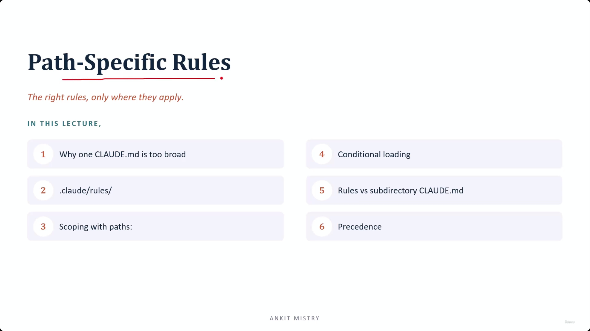
[00:00:20](https://www.udemy.com/course/claude-ai-certification/learn/lecture/57479749#overview)

## Path-Specific Rules

- The right rules, only where they apply.
- A sharper alternative to using a single, broad `CLAUDE.md` file
    - Path-specific rules switch on only for the exact files they are meant for

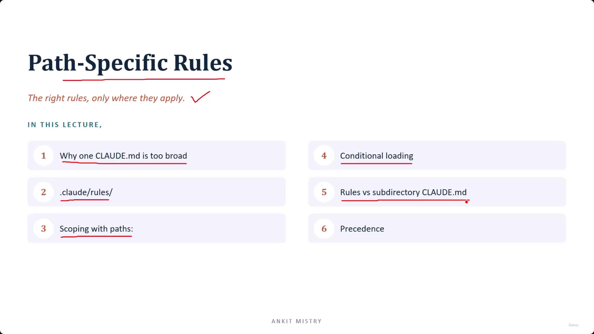
[00:00:43](https://www.udemy.com/course/claude-ai-certification/learn/lecture/57479749#overview)

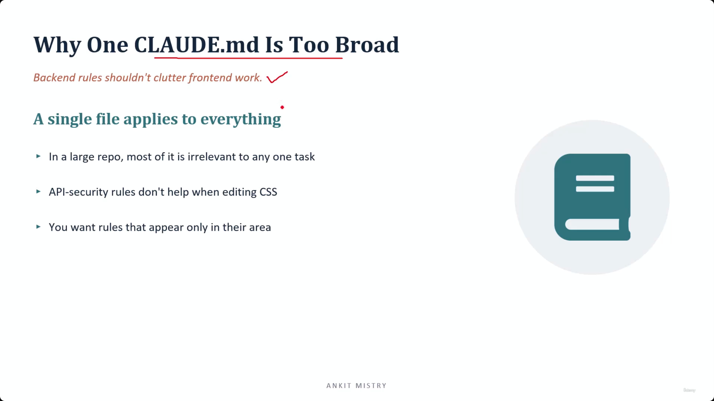
[00:01:00](https://www.udemy.com/course/claude-ai-certification/learn/lecture/57479749#overview)

### Why one CLAUDE.md is too broad

- A single file applies to everything in the repository
    - In large repos, most of the file's content is irrelevant to any single task
- **[The Problem]** It creates unnecessary cognitive load and "waste"
    - For example, API security rules are irrelevant when you are only editing CSS
    - Every session, Claude is forced to carry rules for parts of the project that aren't currently being worked on

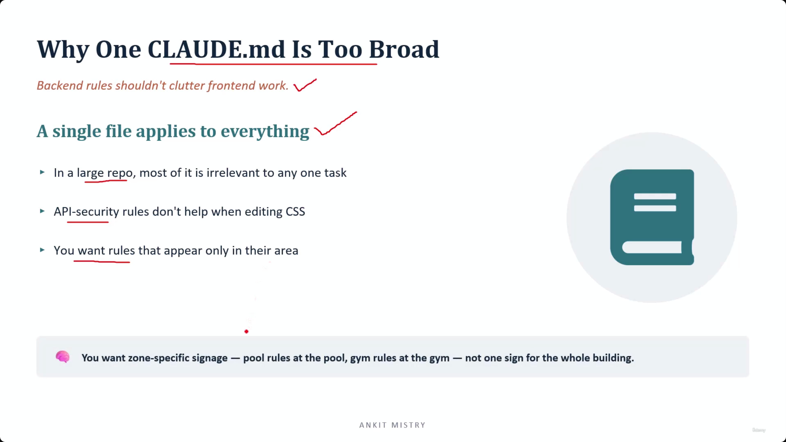
[00:01:39](https://www.udemy.com/course/claude-ai-certification/learn/lecture/57479749#overview)

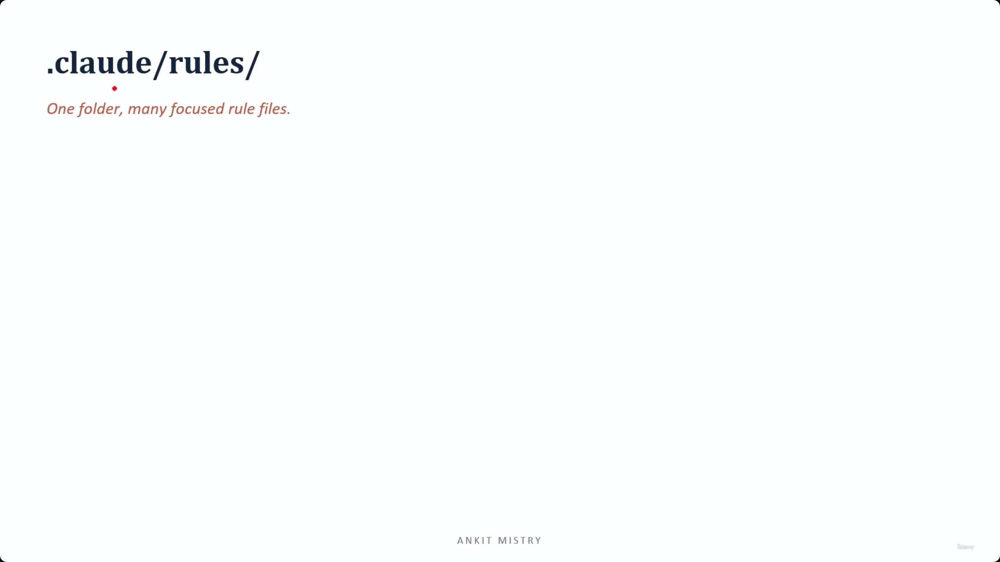
[00:02:10](https://www.udemy.com/course/claude-ai-certification/learn/lecture/57479749#overview)

### The Analogy of Zone-Specific Signage

- Instead of one giant sign for an entire building, use zone-specific signage
    - Pool rules should be at the pool
    - Gym rules should be at the gym
- **[The Goal]** Avoid "noise" in the wrong place
    - Putting a "no diving" rule on a gym wall is nonsensical and creates clutter
    - Path-specific rules ensure the right rules are posted exactly where they belong and nowhere else

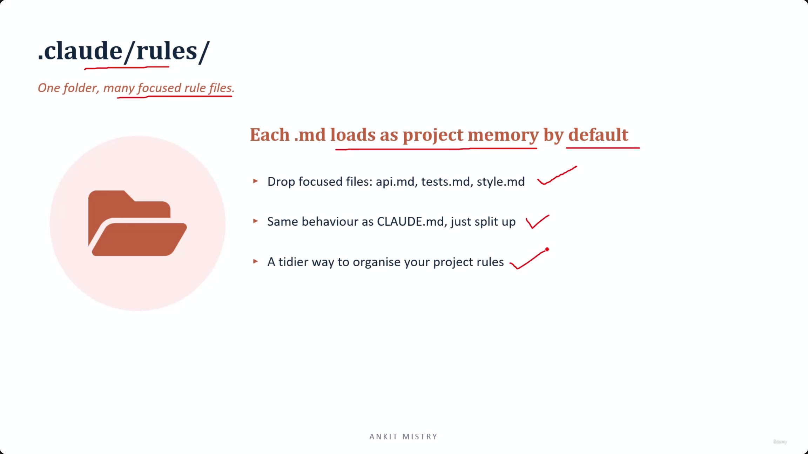
[00:02:43](https://www.udemy.com/course/claude-ai-certification/learn/lecture/57479749#overview)

## The `.claude/rules/` Folder

- One folder holding many focused rule files
- Each `.md` file within this folder loads as project memory by default
    - You can drop in focused files such as:
        - `api.md`
        - `tests.md`
        - `style.md`
- **[Key Characteristic]** It is the same behavior as `CLAUDE.md`, just split up
    - This is simply a tidier way to organize your project rules
    - No "magic" is happening; these files behave exactly like your primary `CLAUDE.md` file

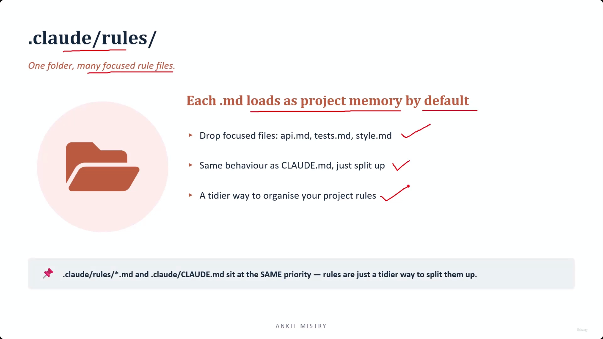
[00:03:03](https://www.udemy.com/course/claude-ai-certification/learn/lecture/57479749#overview)

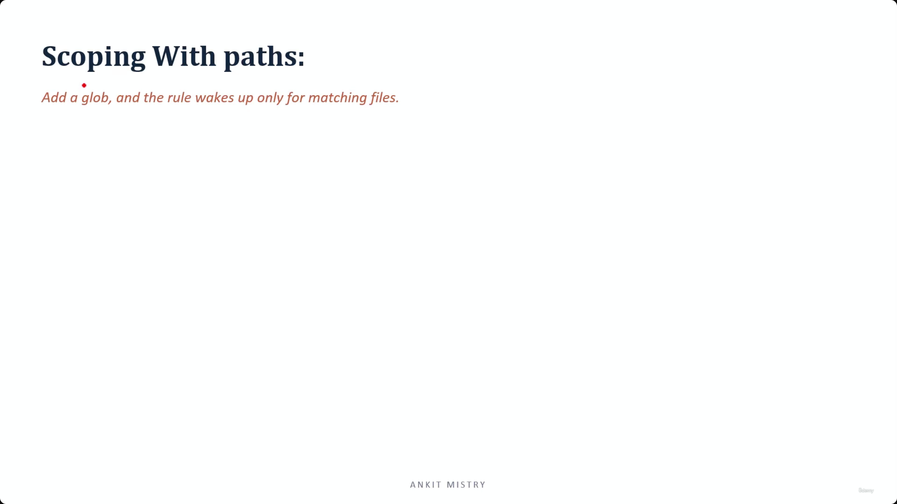
[00:03:38](https://www.udemy.com/course/claude-ai-certification/learn/lecture/57479749#overview)

### Rule Priority and Organization

- **[Priority Clarification]** Splitting rules into the `.claude/rules/` folder does not change their importance
    - Rules in `.claude/rules/*.md` and `CLAUDE.md` sit at the SAME priority
    - A rule in `api.md` carries exactly the same weight as that same rule in `CLAUDE.md`
- The rules folder is purely a tidier way to split them up, not a way to change how they are weighted

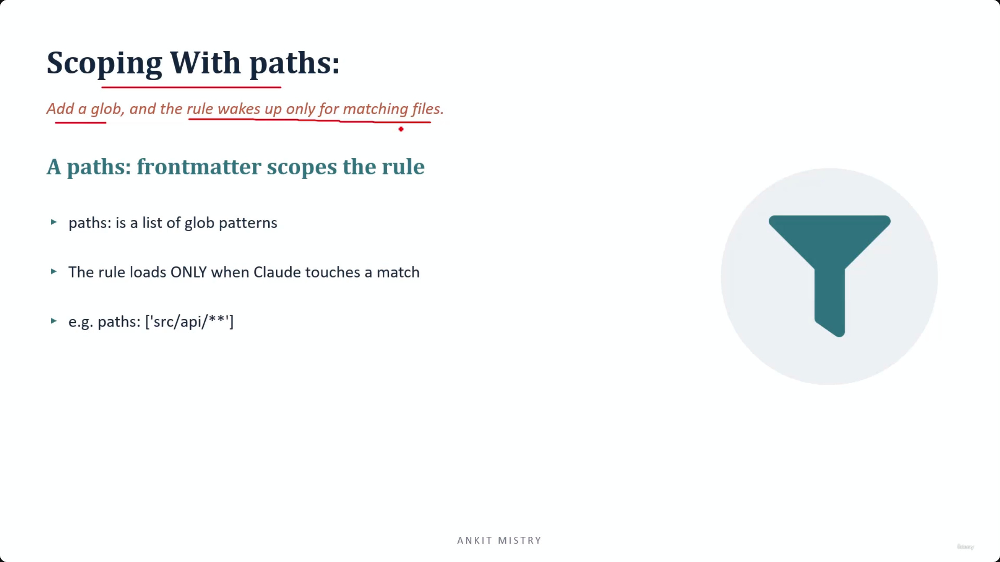
[00:03:52](https://www.udemy.com/course/claude-ai-certification/learn/lecture/57479749#overview)

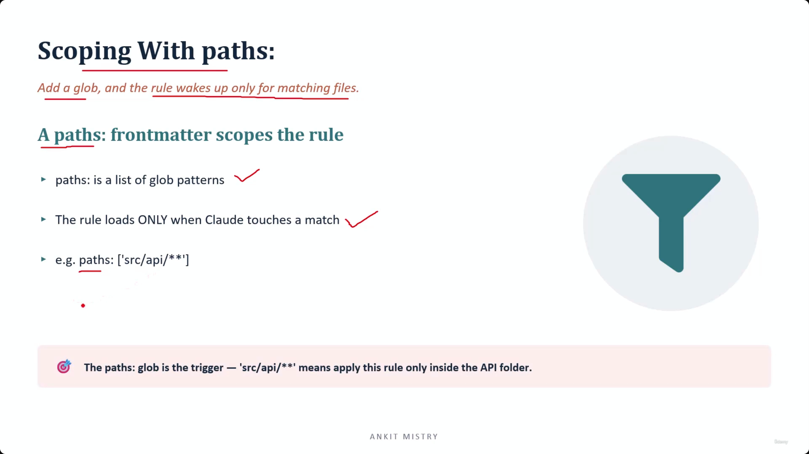
[00:04:31](https://www.udemy.com/course/claude-ai-certification/learn/lecture/57479749#overview)

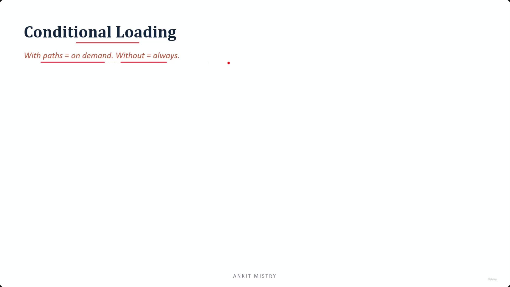
[00:05:13](https://www.udemy.com/course/claude-ai-certification/learn/lecture/57479749#overview)

### Scoping With paths

- Use a glob pattern in the frontmatter to act as a trigger
    - The rule "wakes up" only for matching files
    - If the file path doesn't match, the rule stays "asleep"
- **[How it works]** The `paths` field is a list of glob patterns that scopes the rule
    - Example: `paths: ['src/api/**']`
        - This pattern means the rule applies only inside the `api` folder

### Conditional Loading

- **With paths = on demand**
    - Rules load only when Claude touches a matching file
- **Without paths = always**
    - Rules load every single time, regardless of the file being worked on

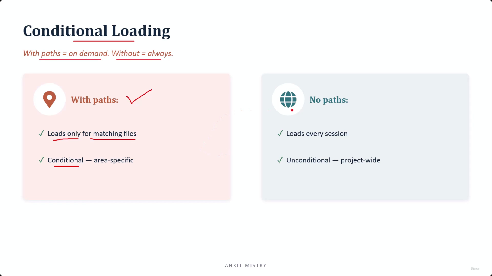
[00:05:42](https://www.udemy.com/course/claude-ai-certification/learn/lecture/57479749#overview)

### Comparison of Loading Behaviors

| Feature | With paths | No paths |
| --- | --- | --- |
| Loading Type | On demand | Always on |
| Scope | Conditional — area-specific | Unconditional — project-wide |
| Behavior | Loads only for matching files; stays out of the way until needed | Loads every session; behaves like ordinary project memory |

- **[With paths]** is "polite"
    - It only shows up in the specific area it belongs to
    - It is triggered only by the files you actually touch

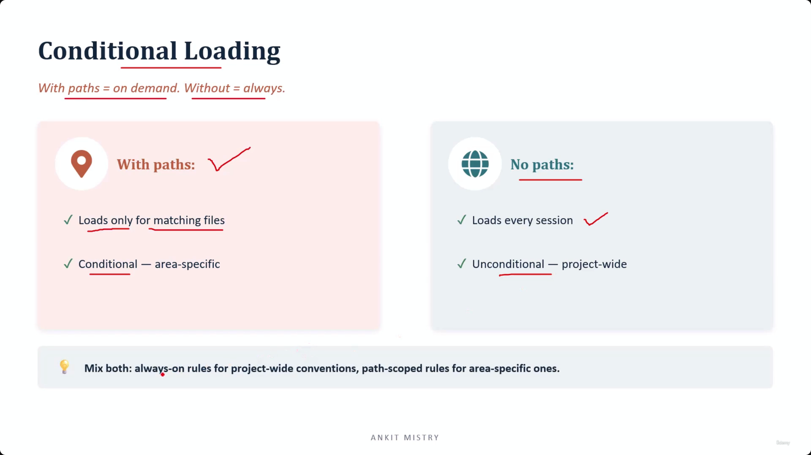
[00:06:09](https://www.udemy.com/course/claude-ai-certification/learn/lecture/57479749#overview)

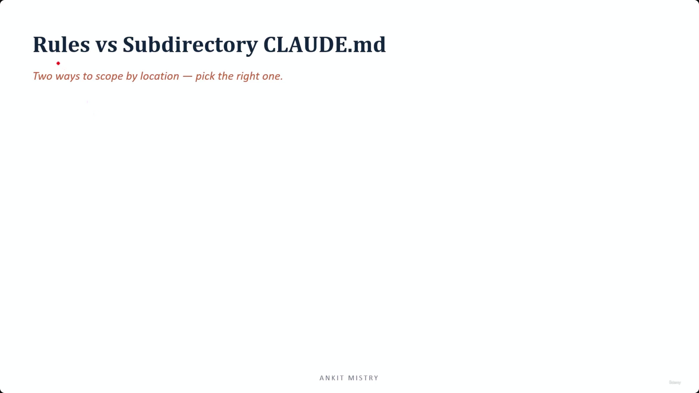
[00:06:38](https://www.udemy.com/course/claude-ai-certification/learn/lecture/57479749#overview)

### Combining Loading Behaviors

- **[The Best of Both Worlds]** You don't have to choose just one; you can mix both strategies
    - Use **always-on** rules for project-wide conventions
        - Example: General coding styles that apply to every file in the repo
    - Use **path-scoped** rules for area-specific concerns
        - Example: API security rules that only matter in a specific directory

## Rules vs Subdirectory CLAUDE.md

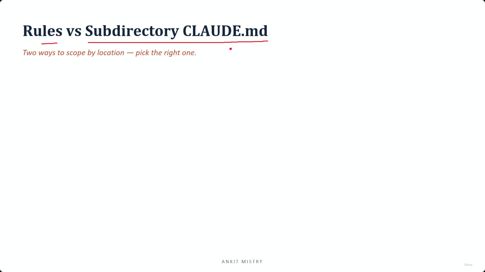
[00:06:45](https://www.udemy.com/course/claude-ai-certification/learn/lecture/57479749#overview)

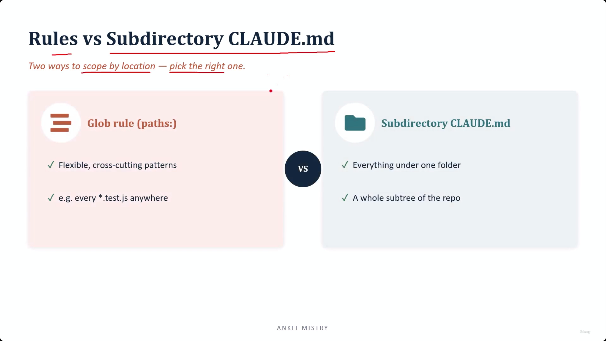
[00:06:53](https://www.udemy.com/course/claude-ai-certification/learn/lecture/57479749#overview)

### Scoping Methods: Glob Patterns vs. Subdirectory Files

There are two primary ways to scope rules by location:

| Method | Description | Best For |
| --- | --- | --- |
| Glob rule (paths:) | Follows a specific pattern wherever it appears in the repo | Flexible, cross-cutting patterns (e.g., every *.test.js file anywhere) |
| Subdirectory CLAUDE.md | Covers everything within one specific folder | Covering an entire subtree/location from top to bottom |

- **[The distinction]**
    - A **glob rule** is pattern-driven and can jump around the repository to find matching files
    - A **subdirectory file** is location-driven and applies to every file within that specific directory and its children

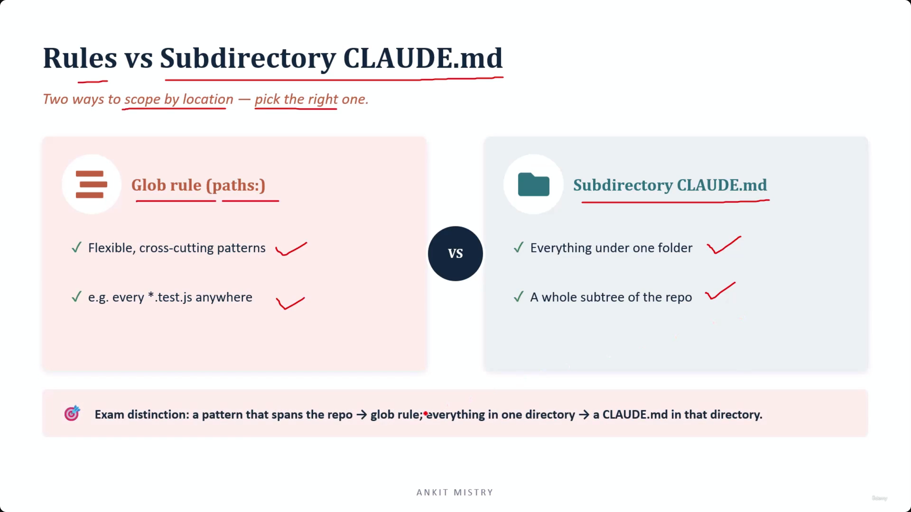
[00:07:31](https://www.udemy.com/course/claude-ai-certification/learn/lecture/57479749#overview)

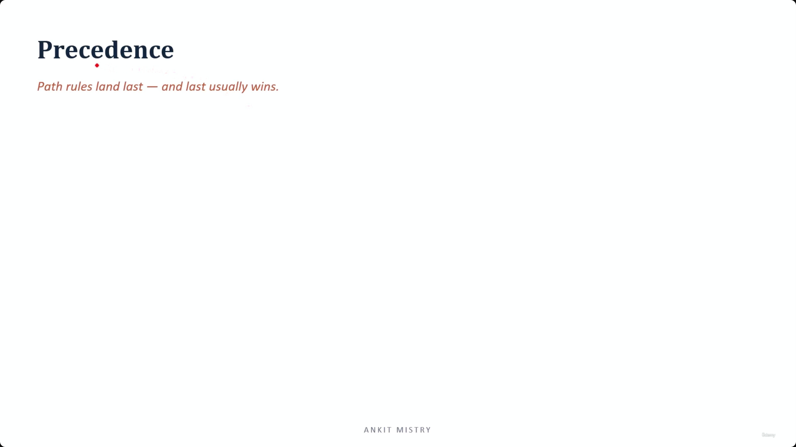
[00:08:10](https://www.udemy.com/course/claude-ai-certification/learn/lecture/57479749#overview)

### The Exam Distinction

To choose the right scoping method, identify if your rule follows a pattern or a location:

- **Glob Rule**
    - Best for patterns that span the entire repository
    - **[Example]** Test files (`*.test.js`) that are scattered throughout the repo, sitting next to the code they test rather than in one central folder
- **Subdirectory&#32;`CLAUDE.md`**
    - Best for everything contained within one specific directory
    - **[Example]** An `api` folder where all API-related code sits neatly in one place

---

## Precedence

- Path rules land last — and last usually wins

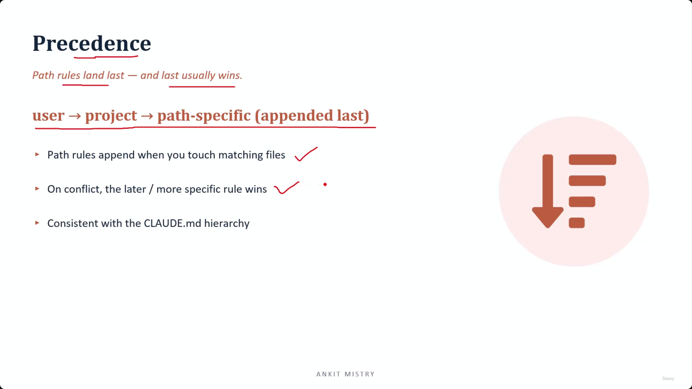
[00:08:36](https://www.udemy.com/course/claude-ai-certification/learn/lecture/57479749#overview)

### Rule Application Order

- The order of rule application is:
    - User rules
    - Project rules
    - Path-specific rules (appended last)
- **[How it works]**
    - Path rules only append to the context when you touch/access matching files
    - In the event of a conflict, the later and more specific rule wins
    - This behavior is consistent with the standard `CLAUDE.md` hierarchy

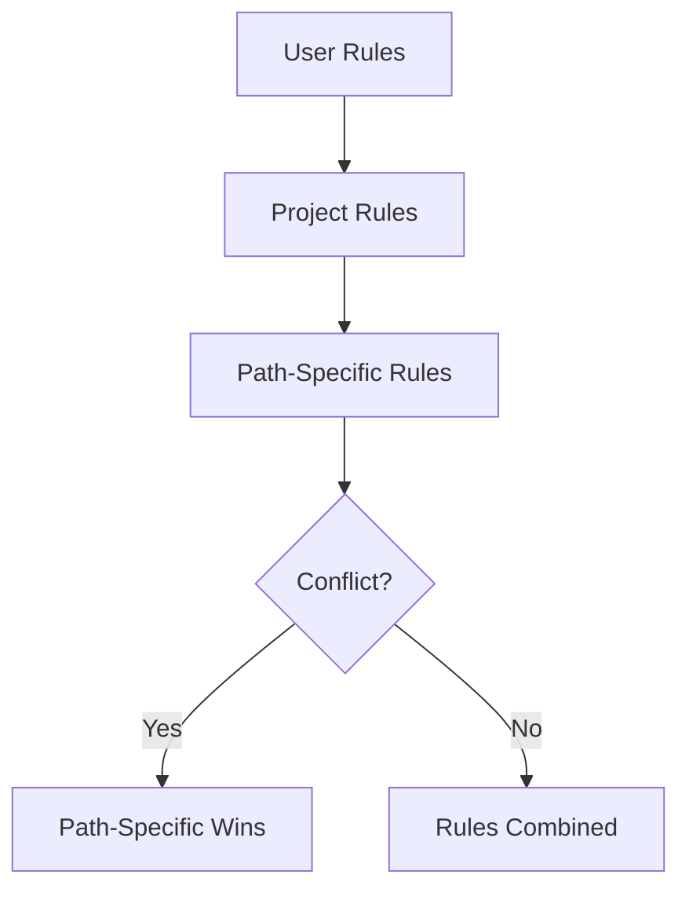
```mermaid
flowchart TD
    A[User Rules] --> B[Project Rules]
    B --> C[Path-Specific Rules]
    C --> D{Conflict?}
    D -->|Yes| E[Path-Specific Wins]
    D -->|No| F[Rules Combined]
```

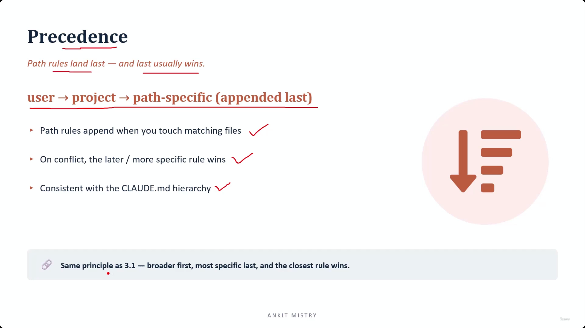
[00:09:02](https://www.udemy.com/course/claude-ai-certification/learn/lecture/57479749#overview)

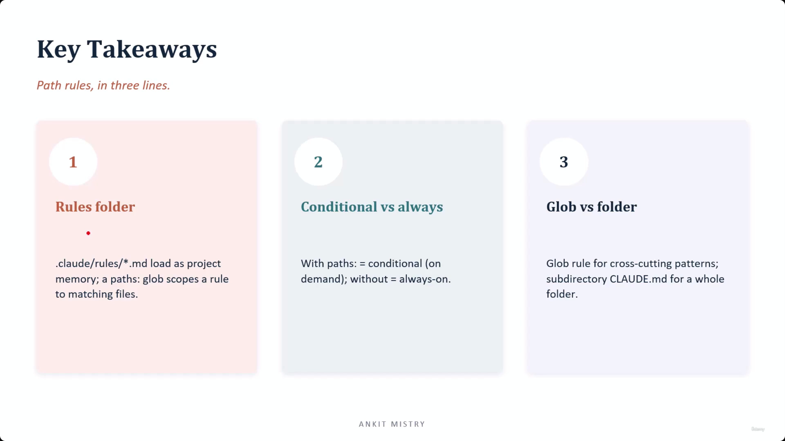
[00:09:34](https://www.udemy.com/course/claude-ai-certification/learn/lecture/57479749#overview)

### Consistent Precedence Principle

- The logic of precedence remains consistent across different levels:
    - Broader rules come first
    - The most specific rule comes last
    - The closest/most specific rule wins any conflict
- **[Why this matters]** Because path-specific rules are the most specific and land last, they naturally take priority over general project rules.

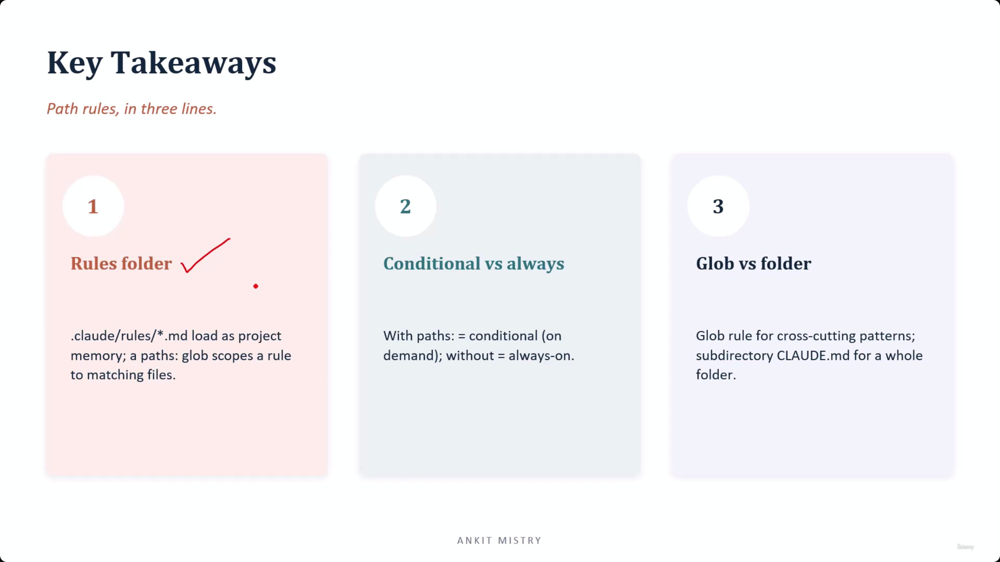
[00:09:45](https://www.udemy.com/course/claude-ai-certification/learn/lecture/57479749#overview)

## Key Takeaways

### Path Rules Summary

1. **Rules folder**

    - `.claude/rules/*.md` files load as project memory
    - A `paths:` glob scopes a rule to matching files

2. **Conditional vs always**

    - With `paths:` = conditional (loads on demand)
    - Without `paths:` = always-on

3. **Glob vs folder**

    - Glob rule: used for cross-cutting patterns
    - Subdirectory `CLAUDE.md`: used for a whole folder
- **[The Core Principle]**
    - The objective is to aim the right rules at exactly the right files
    - A plain rule file acts as always-on project memory, whereas adding a `paths:` field transforms it into a targeted, conditional rule.

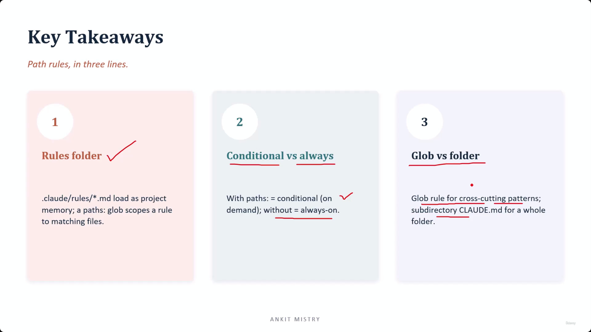
[00:10:30](https://www.udemy.com/course/claude-ai-certification/learn/lecture/57479749#overview)

### The Goal of Targeted Rules

- Mix different rule types to optimize context
    - Use **always-on** rules for project-wide conventions
    - Use **path-scoped** rules for specific areas
- **[The Outcome]** Claude sees the rules that matter right where they matter, and nothing more

---

## Simple Explanation (with Claude Examples)

**The core idea, in one line**: A single `CLAUDE.md` loads fully every session no matter what you're working on — path-specific rules fix that by only "waking up" for the exact files they're meant for.

**The zone-specific signage analogy**

Pool rules belong at the pool, gym rules belong at the gym — not one giant sign for the whole building. Path rules work the same way: the right instruction shows up only in the right place.

**How it's implemented — the `.claude/rules/` folder**

Split rules into focused files like `.claude/rules/api.md`. By default these behave exactly like `CLAUDE.md` — same priority, just tidier.

**The real trigger — the `paths` field**

```yaml
---
paths: ["src/api/**"]
---
Always validate JWTs before processing requests here.
```

- **No `paths`** → always-on, loads every session.
- **With `paths`** → conditional, only loads when Claude touches a matching file.

*Claude Code example*: if this project had a `.claude/rules/notes-style.md` scoped to `paths: ["**/*.md"]`, it would only load when I'm working on Markdown note files — staying completely out of context if I were ever touching, say, a config file instead.

**Glob rule vs. subdirectory `CLAUDE.md`**

- **Glob rule** — pattern-based, jumps around the repo wherever it matches (e.g., every `*.test.js` file, no matter where it lives).
- **Subdirectory `CLAUDE.md`** — location-based, covers an entire folder regardless of filename.

**Precedence — path rules win last**

Order: User → Project → Path-specific (appended last). Since path rules are the most specific and load last, they override broader rules on conflict — consistent with the same "closer wins" logic from the `CLAUDE.md` hierarchy.

**Recap in 3 lines**

1. **One giant `CLAUDE.md` wastes attention** — rules for parts of the project you're not touching still load anyway.
2. **`paths:` makes a rule conditional** — it only wakes up for matching files, staying silent everywhere else.
3. **Path rules win conflicts** — they're the most specific and load last, same "closer wins" logic as the broader hierarchy.