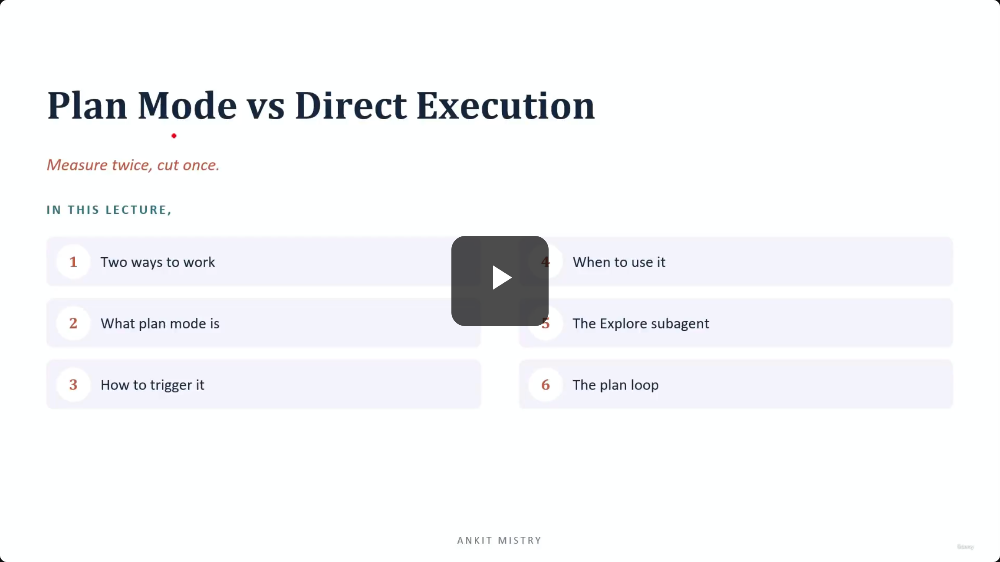
[00:00:00](https://www.udemy.com/course/claude-ai-certification/learn/lecture/57479751#overview)

## Plan Mode vs Direct Execution

- The core operational choice when working with Cloud Code: deciding whether to plan first or dive straight in
- **[Principle]** "Measure twice, cut once."

### Lecture Overview

1. Two ways to work
2. What plan mode is
3. How to trigger it
4. When to use it
5. The Explore subagent
6. The plan loop

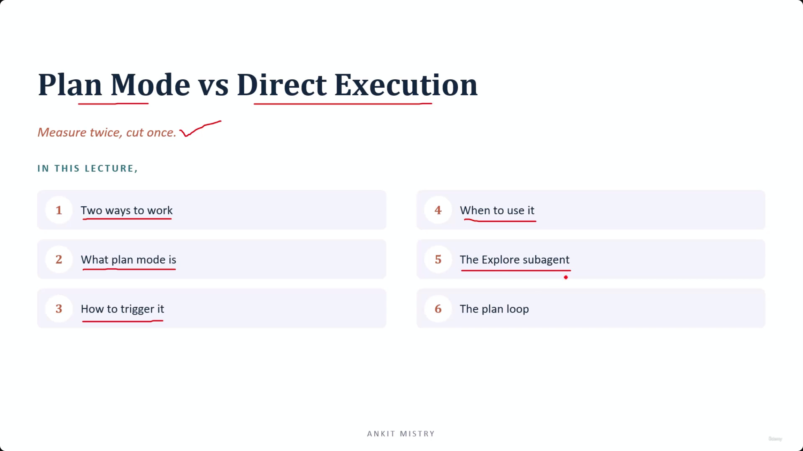
[00:00:43](https://www.udemy.com/course/claude-ai-certification/learn/lecture/57479751#overview)

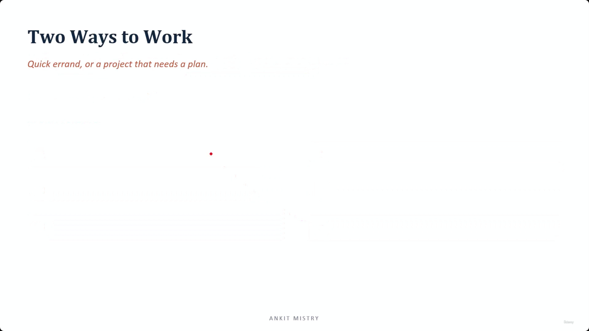
[00:00:47](https://www.udemy.com/course/claude-ai-certification/learn/lecture/57479751#overview)

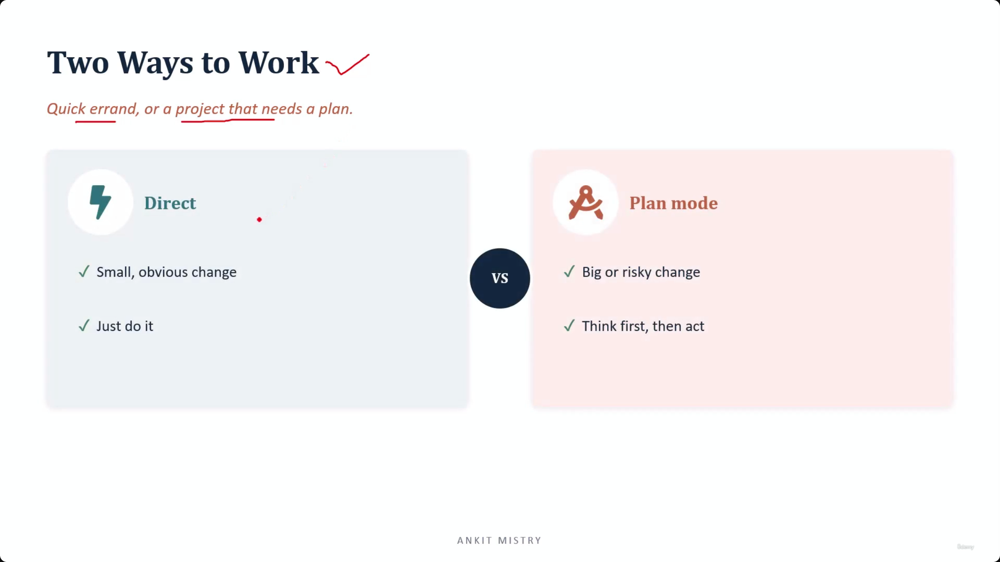
[00:01:00](https://www.udemy.com/course/claude-ai-certification/learn/lecture/57479751#overview)

### Two Ways to Work

- The choice depends on whether the task is a "quick errand" or a "project that needs a plan"
- **Direct Execution**
    - Best for small, obvious changes
    - Approach: "Just do it"
- **Plan Mode**
    - Best for big or risky changes
    - Approach: "Think first, then act"

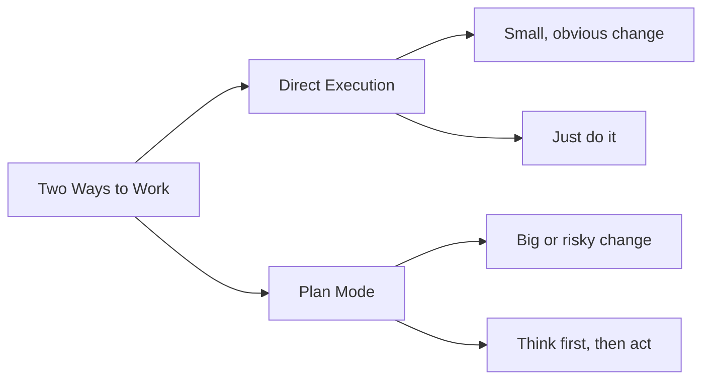
```mermaid
flowchart LR
    A["Two Ways to Work"] --> B["Direct Execution"]
    A --> C["Plan Mode"]

    B --> B1["Small, obvious change"]
    B --> B2["Just do it"]

    C --> C1["Big or risky change"]
    C --> C2["Think first, then act"]
```

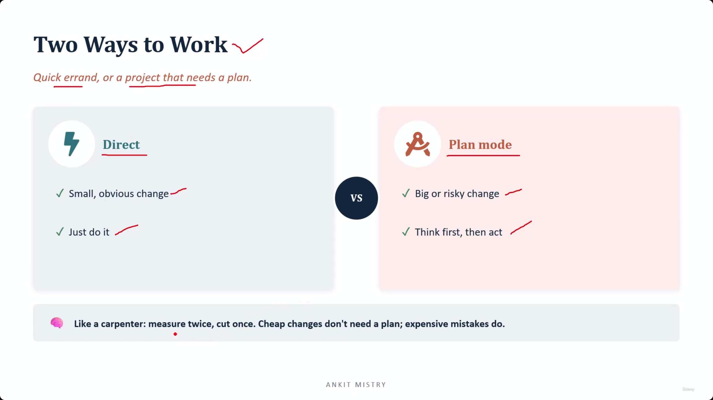
[00:01:37](https://www.udemy.com/course/claude-ai-certification/learn/lecture/57479751#overview)

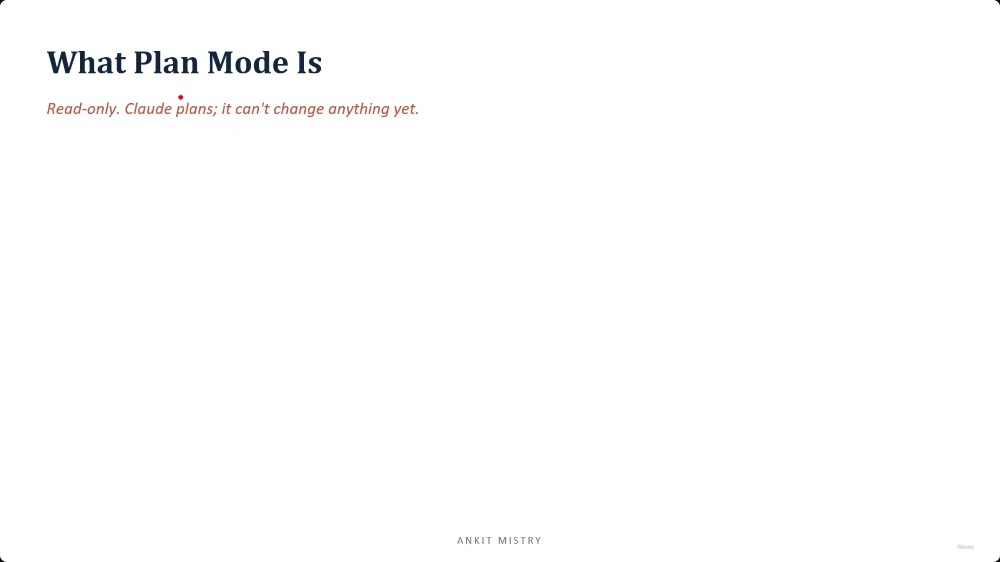
[00:02:04](https://www.udemy.com/course/claude-ai-certification/learn/lecture/57479751#overview)

### The Carpenter Analogy

- **[Principle]** "Measure twice, cut once"
    - Planning is equivalent to measuring
    - Cutting is equivalent to executing the change
- **[Why plan?]** To avoid "expensive mistakes"
    - Small, "cheap" changes don't require a plan
    - If a mistake is expensive to undo, the time spent planning is a necessary investment to save the "whole plank"

### What Plan Mode Is

- Read-only mode where Claude plans but cannot change anything yet

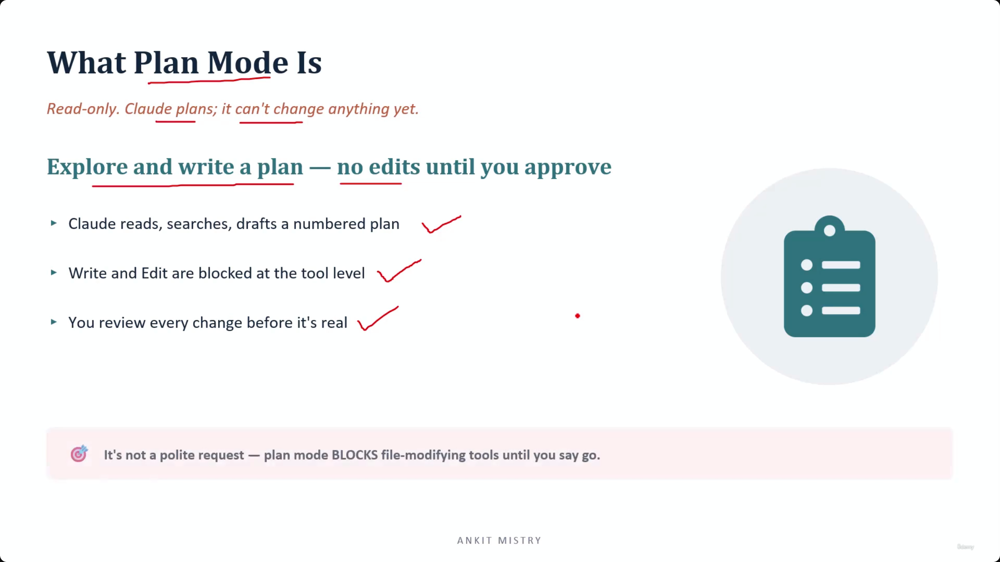
[00:02:57](https://www.udemy.com/course/claude-ai-certification/learn/lecture/57479751#overview)

### Safety and Approval in Plan Mode

- **[Mechanism]** Claude explores and writes a plan with no edits until approved
    - Claude reads and searches the codebase
    - Claude drafts a numbered plan
- **[Safety Feature]** Write and Edit capabilities are blocked at the tool level
    - This prevents Claude from touching a single file without permission
    - You review every proposed change before it becomes real

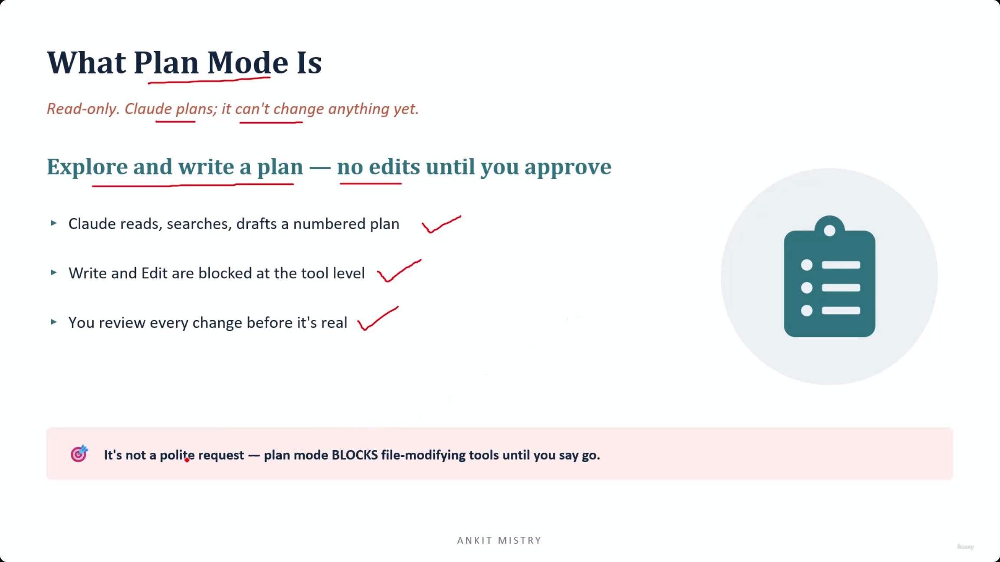
[00:02:58](https://www.udemy.com/course/claude-ai-certification/learn/lecture/57479751#overview)

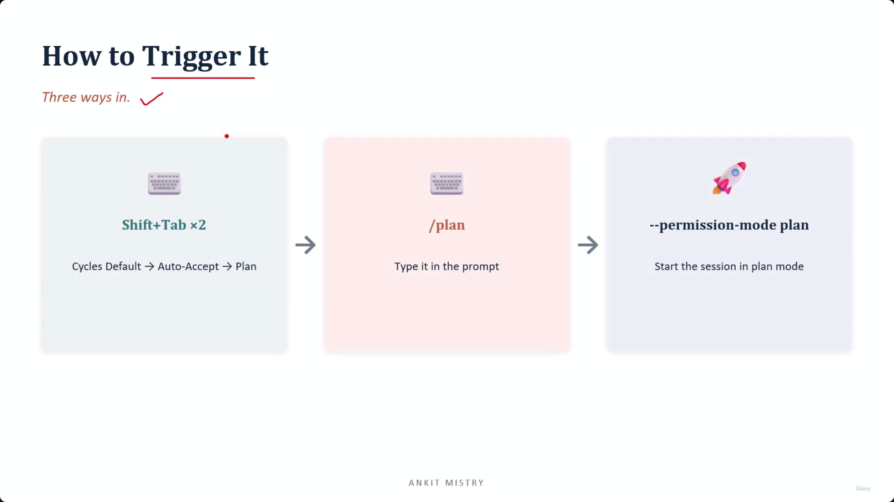
[00:03:35](https://www.udemy.com/course/claude-ai-certification/learn/lecture/57479751#overview)

### Plan Mode Safety Guarantee

- **[Hard Guarantee]** Plan Mode is not a polite request for Claude to wait
    - It actively **BLOCKS** file-modifying tools
    - The Write and Edit tools are switched off at the tool level
    - Even if Claude attempts to edit a file, it physically cannot do so until you say "go"

### How to Trigger Plan Mode

There are three ways to enter Plan Mode:

| Method | Action / Command | Description |
| --- | --- | --- |
| Keyboard Shortcut | Shift + Tab (x2) | Cycles through Default $\rightarrow$ Auto-Accept $\rightarrow$ Plan |
| Prompt Command | /plan | Type the command directly into the prompt |
| Session Flag | --permission-mode plan | Start the entire session in plan mode |

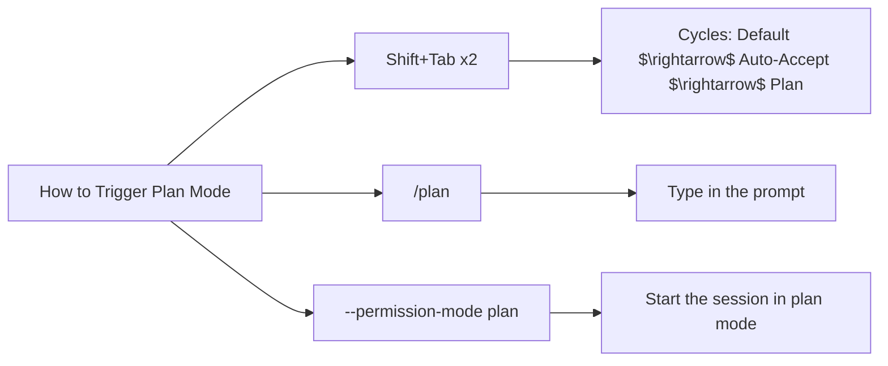
```mermaid
flowchart LR
    A["How to Trigger Plan Mode"] --> B["Shift+Tab x2"]
    A --> C["/plan"]
    A --> D["--permission-mode plan"]

    B --> B1["Cycles: Default $\rightarrow$ Auto-Accept $\rightarrow$ Plan"]
    C --> C1["Type in the prompt"]
    D --> D1["Start the session in plan mode"]
```

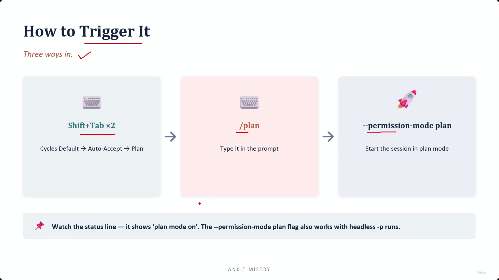
[00:04:15](https://www.udemy.com/course/claude-ai-certification/learn/lecture/57479751#overview)

### Verifying Plan Mode

- **[Practical Tip]** Watch the status line
    - It will explicitly show `plan mode on` so you never have to guess
- **[Headless Compatibility]** The `--permission-mode plan` flag also works with `headless -p` runs

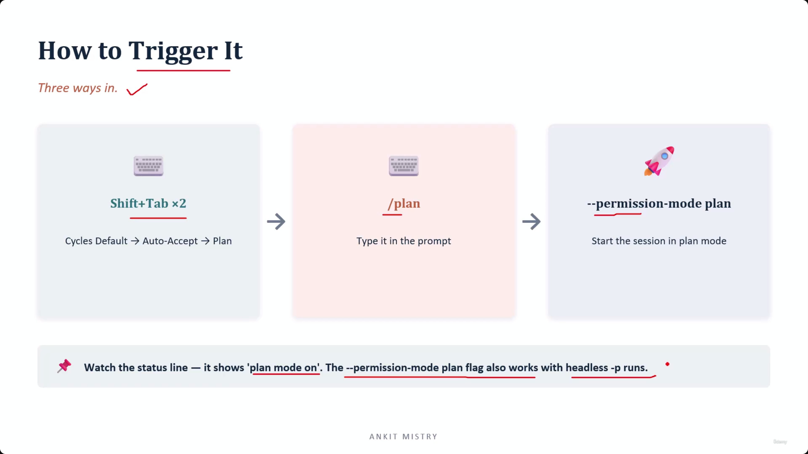
[00:04:31](https://www.udemy.com/course/claude-ai-certification/learn/lecture/57479751#overview)

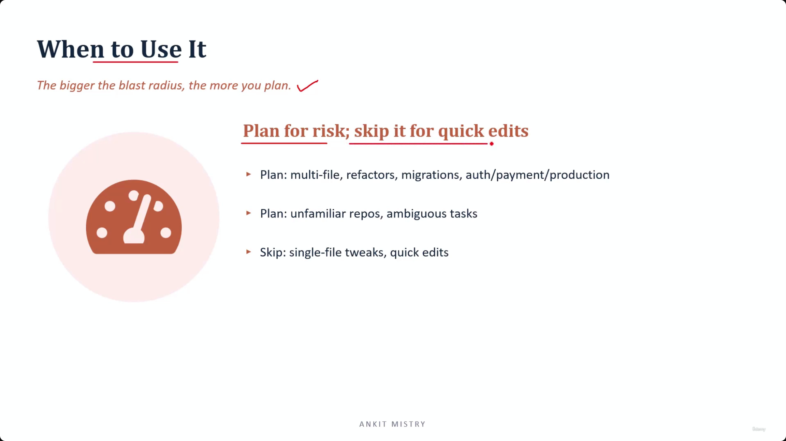
[00:04:59](https://www.udemy.com/course/claude-ai-certification/learn/lecture/57479751#overview)

### When to Use Plan Mode

- **[Rule of Thumb]** The bigger the blast radius, the more you plan
- **Plan for risk**
    - Multi-file changes
    - Refactors
    - Migrations
    - Anything touching auth, payment, or production
    - Unfamiliar repositories
    - Ambiguous tasks
- **Skip for quick edits**
    - Single-file tweaks
    - Quick, low-risk edits

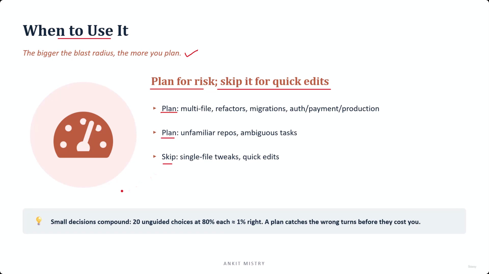
[00:05:36](https://www.udemy.com/course/claude-ai-certification/learn/lecture/57479751#overview)

### The Pattern of Decision Making

- **Plan when the ground is uncertain**
    - Changes are large or dangerous
    - The task is ambiguous
- **Skip when the path is clear**
    - Single-file tweaks
    - Quick, low-risk edits

### The Math of Compounding Errors

- **[Why Plan?]** Small, unguided decisions compound over time, leading to a high probability of failure
- If you make 20 unguided choices, and each one is right 80% of the time:
    - The probability of the entire sequence being correct is only about 1%
    - $$0.8^{20} \approx 0.01$$
- A plan catches these "wrong turns" before they become costly mistakes

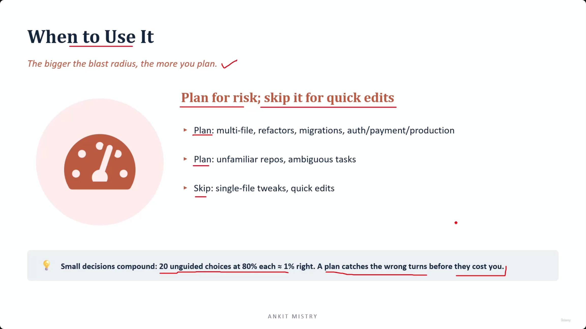
[00:06:00](https://www.udemy.com/course/claude-ai-certification/learn/lecture/57479751#overview)

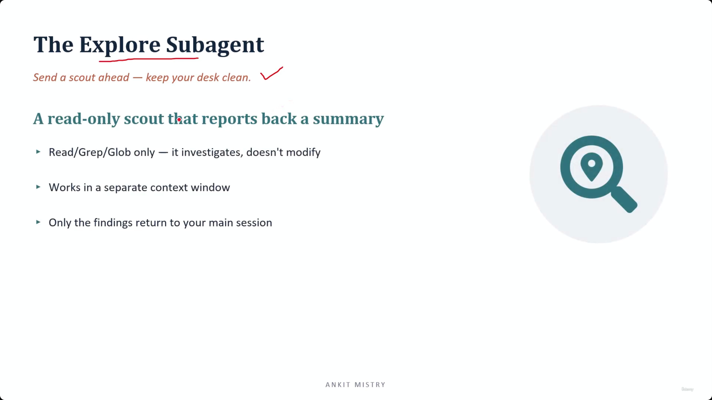
[00:06:34](https://www.udemy.com/course/claude-ai-certification/learn/lecture/57479751#overview)

### The Explore Subagent

- **[Analogy]** Send a scout ahead — keep your own desk clean
- A read-only scout that investigates and reports back a summary
    - It uses `Read`, `Grep`, and `Glob` tools only
    - It is designed to investigate without modifying files
- **[Workflow]** Operates in a separate context window
    - Only the findings/summary are returned to your main session

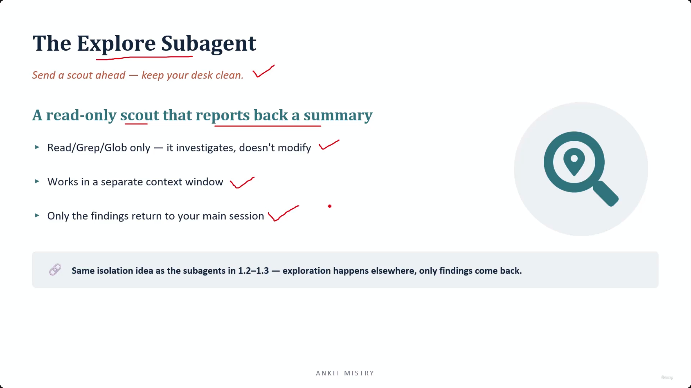
[00:07:12](https://www.udemy.com/course/claude-ai-certification/learn/lecture/57479751#overview)

### Subagent Isolation Pattern

- **[Context Management]** The Explore subagent operates in a separate context window to prevent context bloat
    - The "messy, verbose work" of digging through files happens elsewhere
    - Only a tidy summary is returned to the main session, rather than the "mountain of files" it had to read
- **[Architectural Pattern]** This follows the same isolation principle seen in subagents from lectures 1.2 and 1.3
    - A specialist goes off to perform heavy lifting in a separate space, returning only the necessary findings

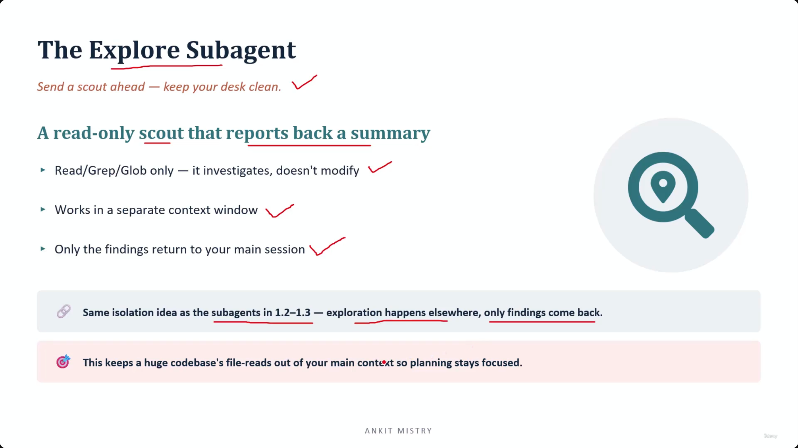
[00:07:44](https://www.udemy.com/course/claude-ai-certification/learn/lecture/57479751#overview)

### The Benefits of Context Isolation

- **[Context Management]** Prevents the main session from being swamped by large codebases
    - If Claude reads 100 files directly into the main session, the context becomes muddy and cluttered
    - The Scout absorbs the heavy reading elsewhere
- **[Planning Precision]** Keeps the planning phase sharp
    - By only returning essential findings, the subagent ensures the user's planning stays focused on what actually matters

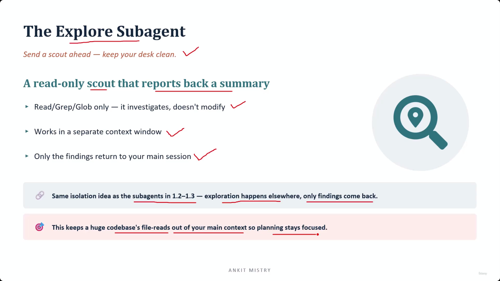
[00:08:16](https://www.udemy.com/course/claude-ai-certification/learn/lecture/57479751#overview)

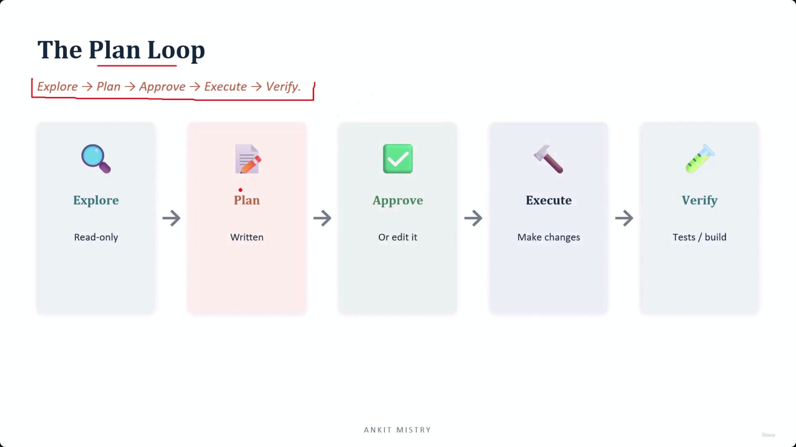
[00:08:32](https://www.udemy.com/course/claude-ai-certification/learn/lecture/57479751#overview)

## The Plan Loop

- **[The Workflow]** A five-step rhythm to ensure safe and deliberate changes:

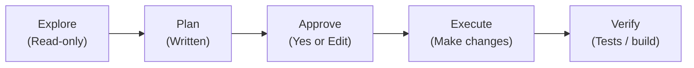
```mermaid
flowchart LR
    A["Explore\n(Read-only)"] --> B["Plan\n(Written)"]
    B --> C["Approve\n(Yes or Edit)"]
    C --> D["Execute\n(Make changes)"]
    D --> E["Verify\n(Tests / build)"]
```

- **[Safety Boundary]** The loop is designed so that nothing in the codebase is actually touched until step four
    - Steps 1-3 (Explore, Plan, Approve) are purely about looking, writing, and deciding
    - Step 4 (Execute) is the first point where actual modifications occur

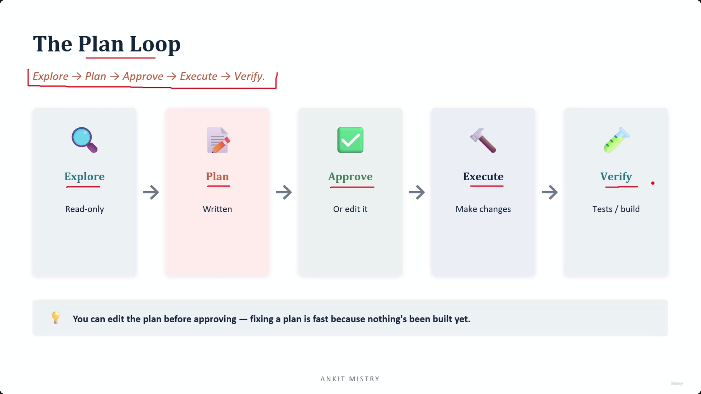
[00:09:13](https://www.udemy.com/course/claude-ai-certification/learn/lecture/57479751#overview)

### The Efficiency of the Approve Step

- **[Why it's safe and cheap]** You can edit the plan before approving it
    - Fixing a plan is fast because nothing has been built yet
    - If you spot a mistake, you only need to change a line of text
    - Since nothing has been coded, nothing has to be "uncoded"
- **[The core advantage]** It allows you to catch problems at their cheapest possible moment—on paper—before a single file is changed

### Key Takeaways: Plan Mode in Three Lines

- **Read-only planning**
    - Plan mode = Claude plans, you approve, then it edits
    - No changes occur until approval
- **Trigger for risk**
    - Use `Shift+Tab x2`, `/plan`, or `--permission-mode plan`
    - Use these for big or risky work
- **Scout with Explore**
    - The Explore subagent investigates in a separate context and reports back

[00:09:46](https://www.udemy.com/course/claude-ai-certification/learn/lecture/57479751#overview)

### The Core Philosophy of Plan Mode

- **[The Golden Rule]** For risky work, you think first and act second
    - Plan mode provides the structural safety to ensure this principle is followed
    - It separates the cognitive task (planning) from the mechanical task (executing)

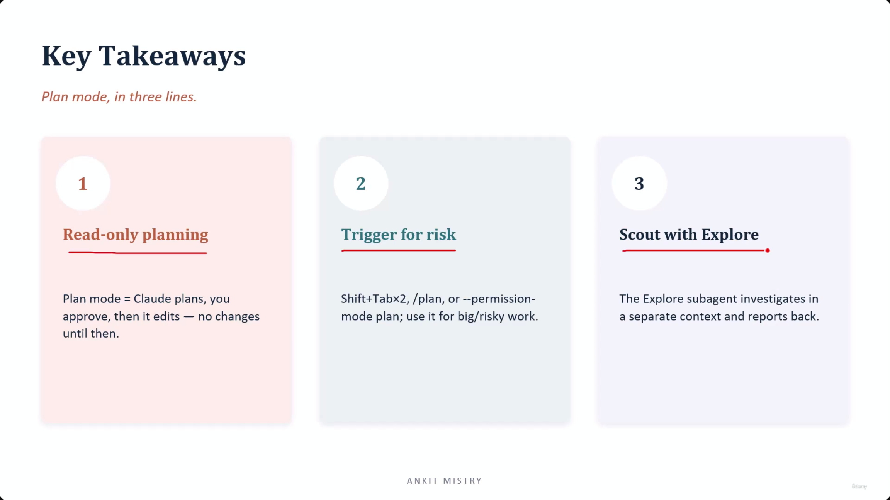
[00:10:31](https://www.udemy.com/course/claude-ai-certification/learn/lecture/57479751#overview)

### Summary of Plan Mode

| # | Concept | Details |
| --- | --- | --- |
| 1 | Read-only planning | Claude plans, you approve, then it edits — no changes occur until approval |
| 2 | Trigger for risk | Use Shift+Tab x2, /plan, or --permission-mode plan for big/risky work |
| 3 | Scout with Explore | The Explore subagent investigates in a separate context and reports back |