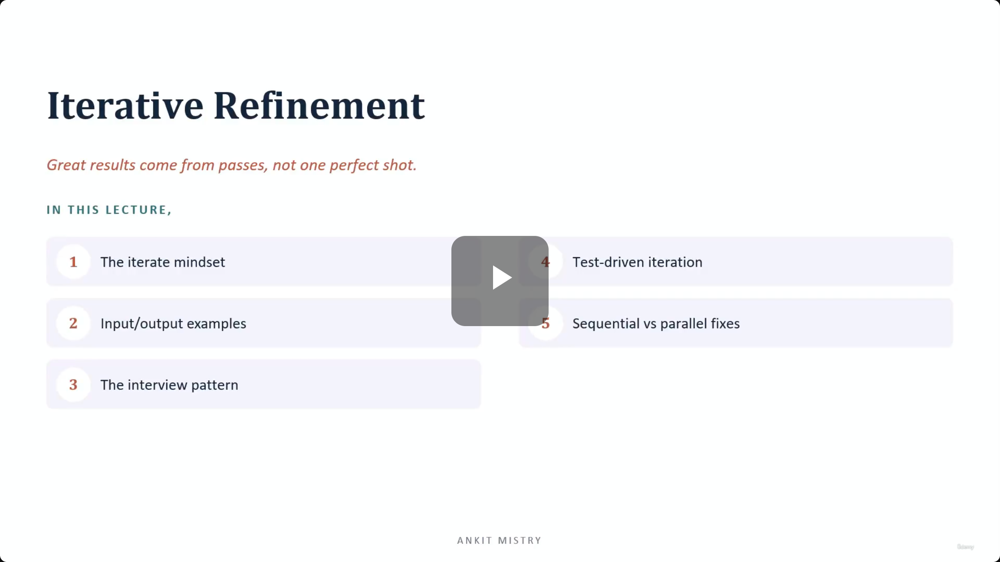
[00:00:01](https://www.udemy.com/course/claude-ai-certification/learn/lecture/57479753#overview)

## Iterative Refinement

- Great results come from passes, not one perfect shot.
- **[The core idea]** Because you cannot expect Claude to produce perfect output on the very first try, you must refine it through multiple passes.

### Lecture Overview

1. The iterate mindset
2. Input/output examples
3. The interview pattern
4. Test-driven iteration
5. Sequential vs parallel fixes

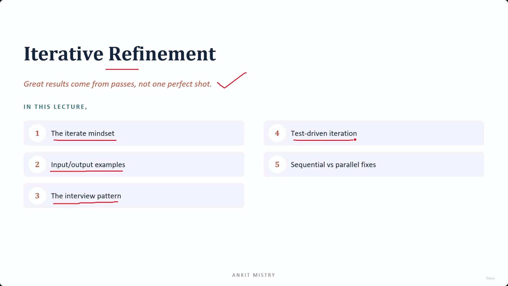
[00:00:44](https://www.udemy.com/course/claude-ai-certification/learn/lecture/57479753#overview)

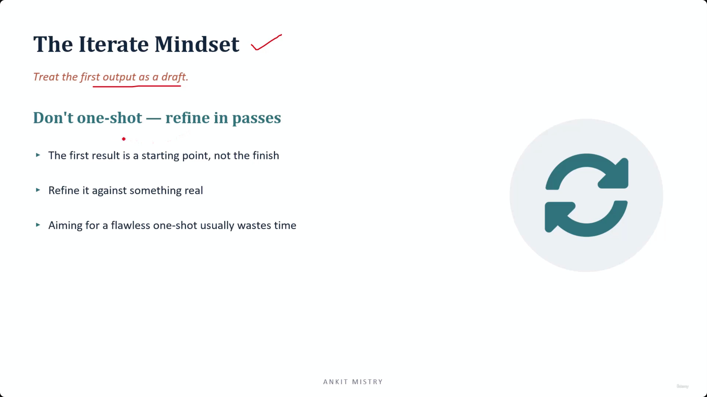
[00:01:04](https://www.udemy.com/course/claude-ai-certification/learn/lecture/57479753#overview)

### Prompting Pitfalls

- **The One-Shot Trap**: It is tempting to attempt writing one enormous, perfect prompt in hopes of receiving a perfect answer immediately.
- **Efficiency Loss**: Aiming for a flawless one-shot often results in wasted time compared to iterative refinement.

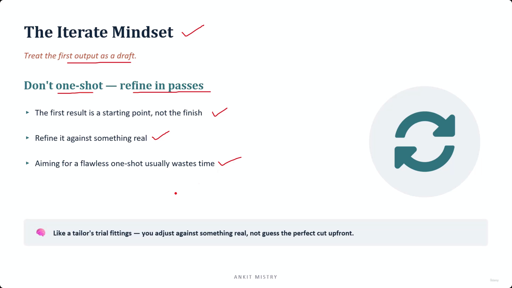
[00:01:39](https://www.udemy.com/course/claude-ai-certification/learn/lecture/57479753#overview)

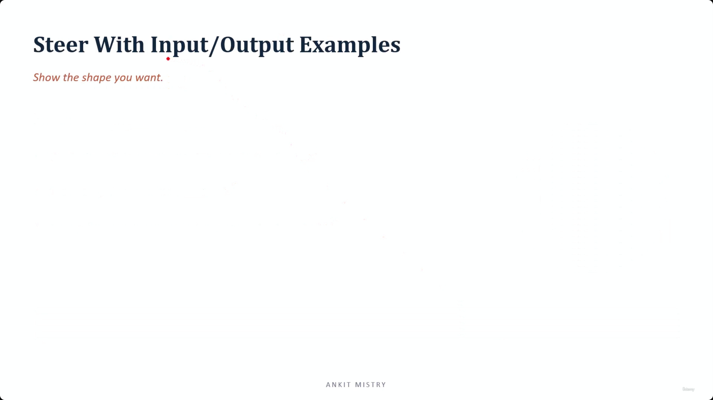
[00:02:11](https://www.udemy.com/course/claude-ai-certification/learn/lecture/57479753#overview)

### The Tailor's Analogy

- Instead of a one-shot approach, get a rough first draft quickly and improve it step by step.
- **[The Core Concept]** Iteration is like a tailor's trial fittings:
    - A tailor doesn't measure once and cut a perfect suit immediately.
    - They make a rough version for you to try on.
    - They then adjust the suit to your actual shape.
    - This allows them to adjust against something real rather than guessing the perfect cut upfront.

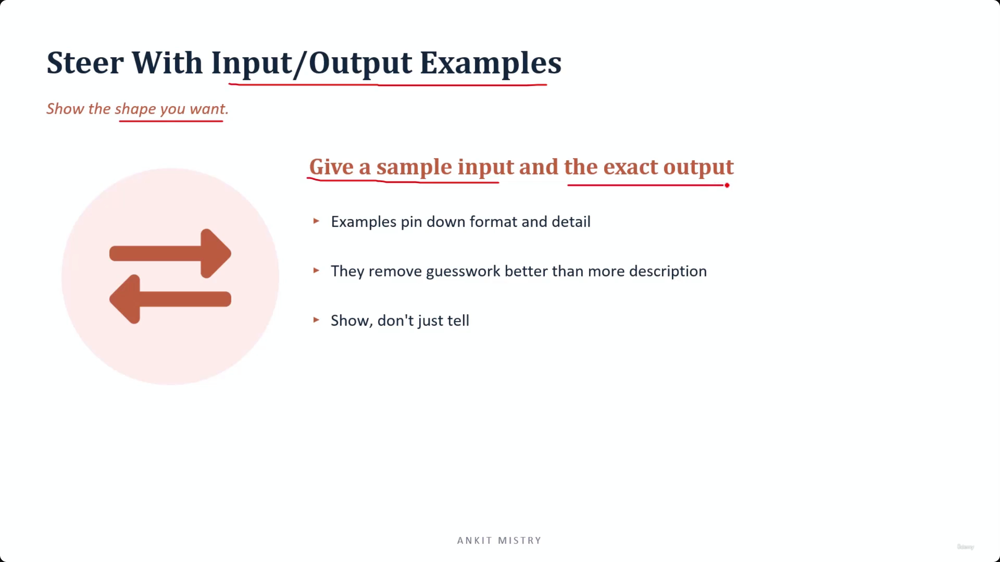
[00:02:28](https://www.udemy.com/course/claude-ai-certification/learn/lecture/57479753#overview)

### Steer With Input/Output Examples

- **[The Core Principle]** Show the shape you want.
- Give a sample input and the exact output you want
    - Examples pin down format and detail
    - They remove guesswork better than more description
- **Show, don't just tell**
    - Describing a format in words for a long time can still lead to being misunderstood
    - A single clear example of input and its corresponding output is more effective than a paragraph of instructions

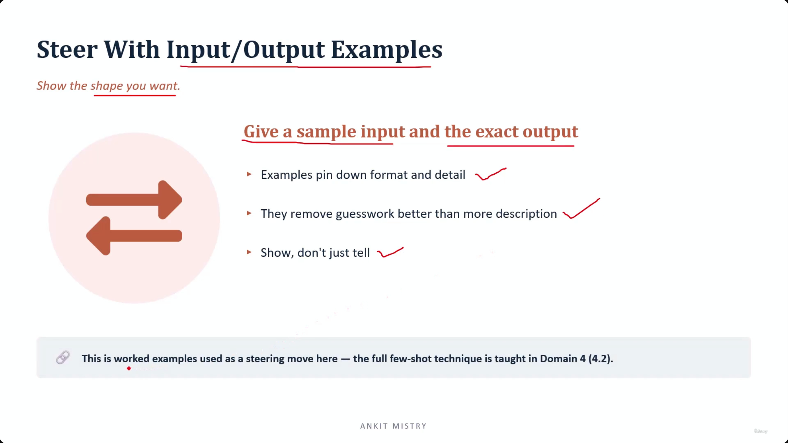
[00:03:03](https://www.udemy.com/course/claude-ai-certification/learn/lecture/57479753#overview)

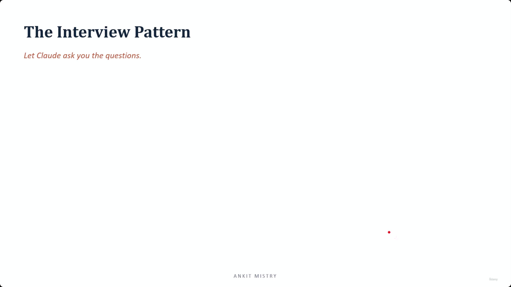
[00:03:34](https://www.udemy.com/course/claude-ai-certification/learn/lecture/57479753#overview)

### Worked Examples as a Steering Move

- **[Technical Context]** Using examples to guide output is a specific steering move known as using "worked examples."
    - This is a lighter application of the full "few-shot prompting" technique.
    - Full mastery of few-shot prompting is covered later in the course (Domain 4, Lecture 4.2).

### The Interview Pattern

- Reverses the usual interaction direction.
- **[Core Concept]** Let Claude ask you the questions.

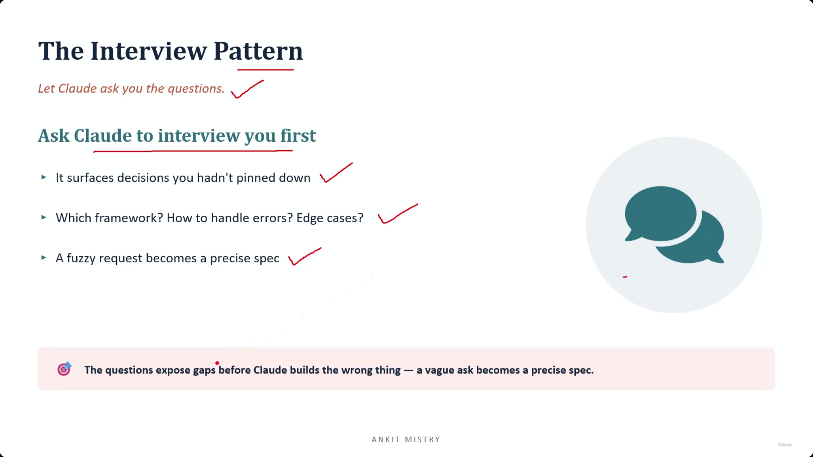
[00:04:22](https://www.udemy.com/course/claude-ai-certification/learn/lecture/57479753#overview)

### Benefits of the Interview Pattern

- **[The core move]** Ask Claude to interview you first.
- **[Why it works]** It surfaces decisions that you hadn't actually pinned down yet.
    - It exposes gaps in your reasoning before Claude starts building the wrong thing.
    - It transforms a fuzzy request into a precise specification.
- **Examples of decisions surfaced by Claude's questions:**
    - Which framework to use
    - How to handle errors
    - How to manage edge cases

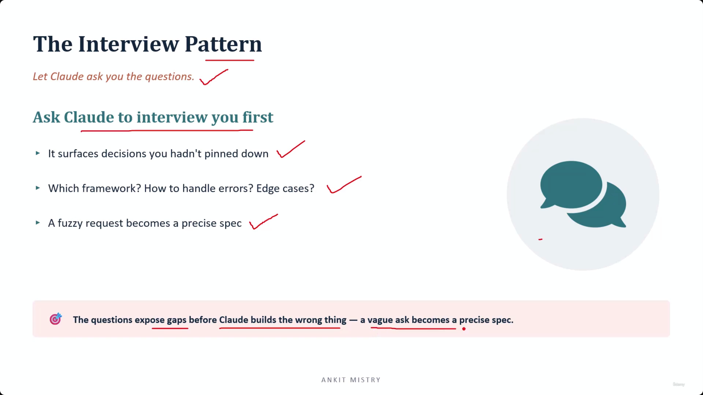
[00:04:29](https://www.udemy.com/course/claude-ai-certification/learn/lecture/57479753#overview)

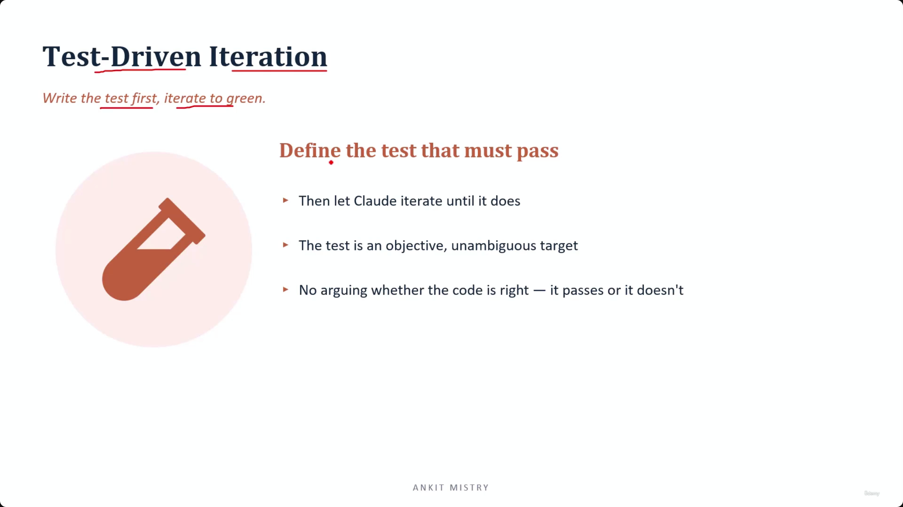
[00:05:03](https://www.udemy.com/course/claude-ai-certification/learn/lecture/57479753#overview)

### The Interview Pattern (Continued)

- **[The Risk of Fuzzy Requests]** Without an interview, Claude must guess the missing pieces.
    - Guessing often leads to building the wrong thing.
    - The interview catches these gaps upfront.
- **[The Benefit]** Every question answered is one wrong assumption avoided.

---

## Test-Driven Iteration

- **[The Core Loop]** Write the test first, then iterate until it turns "green" (passes).
- **The Process:**

    1. Define the test that must pass.
    2. Let Claude iterate until the test is successful.

- **[Why use tests?]** The test serves as an objective, unambiguous target.
    - It removes ambiguity: there is no arguing whether the code is right—it either passes or it doesn't.

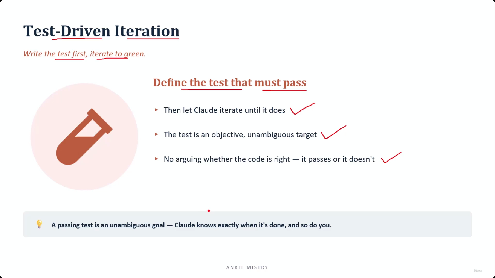
[00:05:41](https://www.udemy.com/course/claude-ai-certification/learn/lecture/57479753#overview)

- **[The Mechanical Advantage]** Instead of judging by eye whether code is good enough, use a hard mechanical check.
    - There is no gray area or debate: the code either meets the test or it does not.
- **[An Unambiguous Goal]** A passing test provides a clear target for both the human and the AI.
    - Claude does not have to guess what "finished" looks like.
    - It removes the guesswork from the iteration loop.

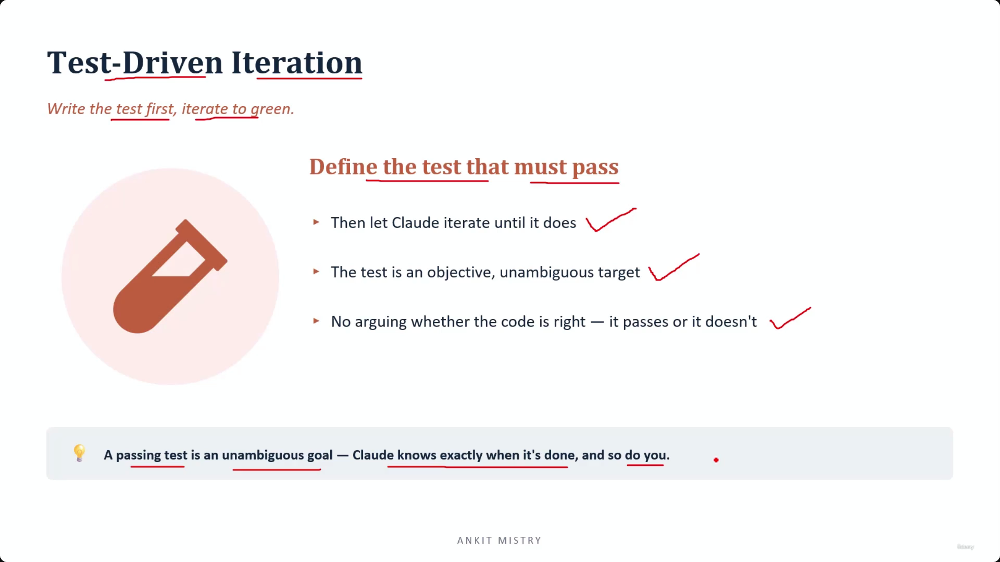
[00:06:00](https://www.udemy.com/course/claude-ai-certification/learn/lecture/57479753#overview)

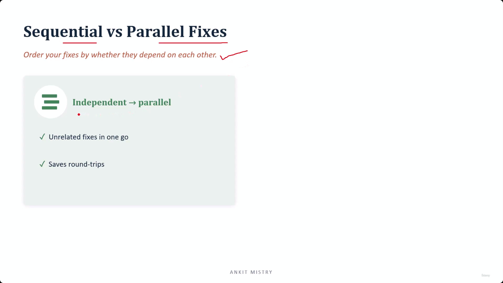
[00:06:30](https://www.udemy.com/course/claude-ai-certification/learn/lecture/57479753#overview)

- **[The Finish Line]** A passing test provides certainty.
    - It creates a clear finish line (the "green" test).
    - It removes the ambiguity of whether the work is truly complete.

## Sequential vs Parallel Fixes

- **[The Deciding Question]** Order your fixes by whether they depend on each other.
- **Parallel Fixes**
    - Apply when fixes are independent/unrelated.
    - Perform all unrelated fixes in one single go.
    - **[Why?]** This saves time by reducing the number of round trips between you and the AI.

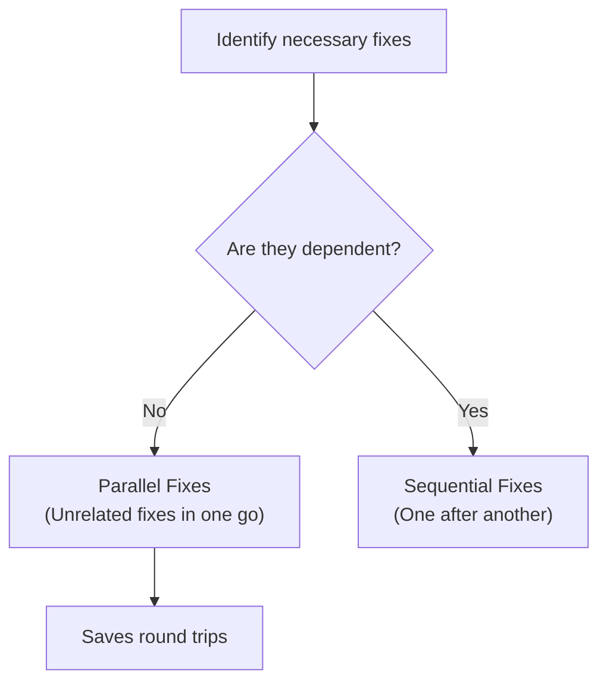
```mermaid
flowchart TD
    Start[Identify necessary fixes] --> Decision{Are they dependent?}
    Decision -->|No| Parallel["Parallel Fixes\n(Unrelated fixes in one go)"]
    Decision -->|Yes| Sequential["Sequential Fixes\n(One after another)"]
    Parallel --> Efficiency["Saves round trips"]
```

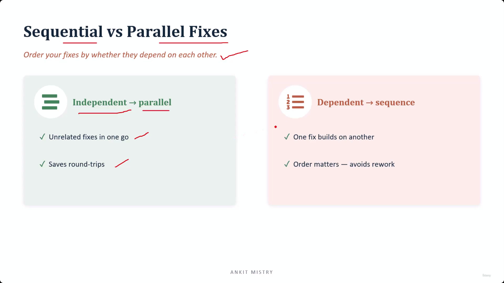
[00:06:58](https://www.udemy.com/course/claude-ai-certification/learn/lecture/57479753#overview)

### Dependent $\rightarrow$ Sequence

- **[When to use]** When one fix builds on another
- **[The Importance of Order]** The sequence must be deliberate
    - The first fix must "land" (be successful) before the second fix even makes sense
    - **[Why?]** Following the correct order avoids having to redo work later due to dependencies

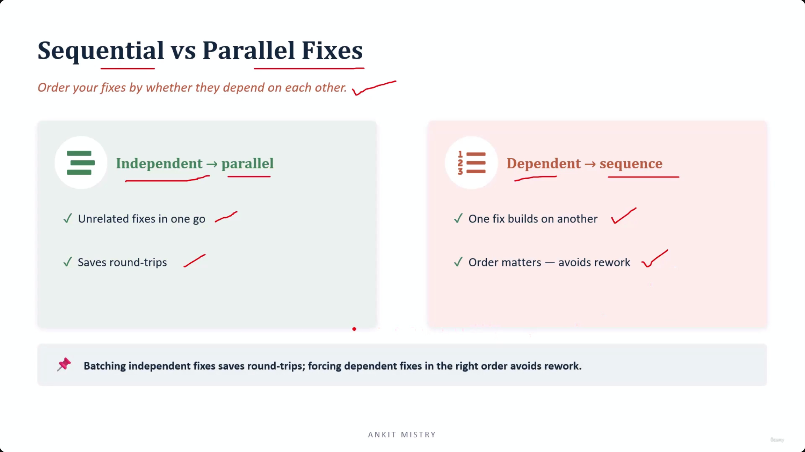
[00:07:31](https://www.udemy.com/course/claude-ai-certification/learn/lecture/57479753#overview)

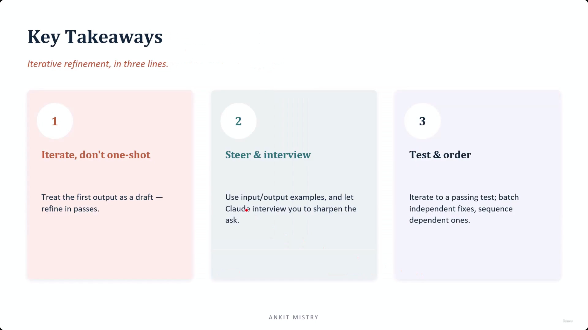
[00:07:55](https://www.udemy.com/course/claude-ai-certification/learn/lecture/57479753#overview)

### Summary of Fix Strategies

- **[The Core Question]** Do these fixes depend on each other?
    - **If No (Independent&#32;**$\rightarrow$**&#32;Parallel)**
        - Batch unrelated fixes into a single pass
        - **[Why?]** Saves time by reducing round trips
    - **If Yes (Dependent&#32;**$\rightarrow$**&#32;Sequential)**
        - Order them so the first fix "lands" before the second begins
        - **[Why?]** Avoids the need to redo work later

---

## Key Takeaways: Iterative Refinement

### 1. Iterate, don't one-shot

- Treat the first output as a draft
- Refine the output in multiple passes

### 2. Steer & interview

- Use input/output examples to steer performance
- Let Claude interview you to sharpen the ask

### 3. Test & order

- Iterate until you reach a passing test
- Batch independent fixes
- Sequence dependent ones

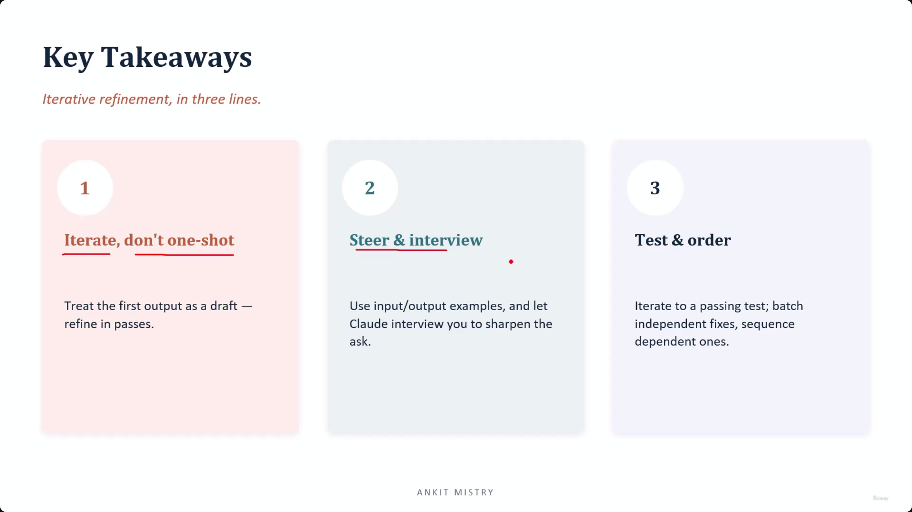
[00:08:16](https://www.udemy.com/course/claude-ai-certification/learn/lecture/57479753#overview)

## Key Takeaways: Iterative Refinement

- **[The Core Philosophy]** Stop chasing the perfect first answer.
    - Instead, accept a rough draft and steer it sharper and sharper through multiple passes.

### Iterative Refinement in Three Lines

| Step | Principle | Action |
| --- | --- | --- |
| 1 | Iterate, don't one-shot | Treat the first output as a draft and refine it in passes. |
| 2 | Steer & interview | Use input/output examples and let Claude interview you to sharpen the ask. |
| 3 | Test & order | Iterate to a passing test; batch independent fixes and sequence dependent ones. |

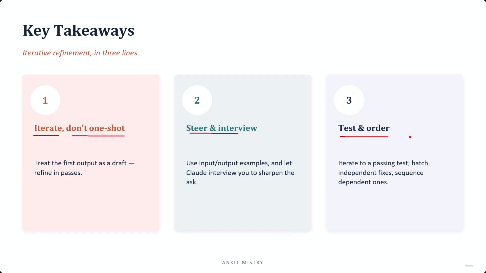
[00:09:00](https://www.udemy.com/course/claude-ai-certification/learn/lecture/57479753#overview)

---

## Simple Explanation (with Claude Examples)

**The main idea, in one line**: Don't expect Claude to nail it on the first try — give it a rough attempt, then guide it closer, step by step.

**Don't try to write the "perfect" prompt**

A huge, exhaustively detailed prompt aiming for a perfect first answer usually wastes more time than a quick, simple ask followed by a correction. Like a tailor making a rough first-fit suit, then adjusting it on you — rather than trying to cut the perfect suit blind.

*Claude Code example*: instead of a 10-line prompt describing exactly how to refactor code, just say "refactor this for clarity," see the result, then say "move this part into its own function." Two short steps beat one giant guess.

**Show an example instead of explaining in words**

If you want a specific format, one example beats a paragraph of description.

*Claude Code example*: instead of saying "make error messages friendly," show `Input: ENOENT, config.json → Output: "Couldn't find config.json — check the path and try again."` Claude now *sees* exactly what you want.

**Let Claude interview you first**

Before building something big, ask Claude to ask *you* questions. This surfaces decisions you hadn't actually made yet, so it doesn't guess wrong and build the wrong thing.

*Claude Code example*: you say "build me a login system." Claude asks "JWT or cookies? Rate-limit failed logins?" — answering now saves a wrong build later.

**Use a test as the finish line**

Give Claude a failing test instead of eyeballing "does this look done?" It passes or it doesn't — no ambiguity about whether the work is complete.

**Grouping multiple fixes — together or one at a time**

Ask: *do these fixes depend on each other?*
- **No** → batch them together in one go (saves round trips). Example: "fix this typo, rename that variable, add this import."
- **Yes** → do them in order. Example: "add a field to the database" must happen *before* "make the API use that field."

**The whole idea in 3 words**: Draft. Steer. Repeat.

---

## Exam Objective Note: CCAR-F 3.5 — Iterative Refinement Techniques

**Without a real check, "looks done" is the only signal — and you become the verification loop**

Claude stops when the work *looks* done. If there's no objective pass/fail signal, that subjective impression is all it has to go on — meaning a human ends up manually verifying everything themselves.

**The fix: give Claude something it can actually run**

A test suite, a build's exit code, a script that diffs against a known-good fixture — anything that returns a real pass or fail, instead of relying on "does this look right?"

**The mechanisms escalate in strength**

Asking in the prompt (weakest, easiest to ignore) → a goal condition → a **Stop hook** that literally blocks the turn from ending until the condition is satisfied (strongest, deterministic — same hook mechanism from domain-1's Agent SDK Hooks note).

**Two counter-intuitive points**

1. **Ask for evidence, not an assertion.** "I fixed it" is a claim that could be confidently wrong. Pasted test output showing green is actual proof.
2. **After correcting the same issue twice, clear the context rather than trying a third correction.** The accumulated failed attempts sitting in context can actively anchor the model into repeating the same wrong pattern — a fresh context often breaks that loop better than one more retry.

**Recap in 3 lines**

1. **No check = you become the check** — give Claude a real pass/fail signal instead of trusting "looks done."
2. **Enforcement escalates**: prompt ask → goal condition → Stop hook (which actually blocks completion).
3. **Demand evidence over assertions, and clear context after two failed corrections** — don't attempt a third fix in the same polluted context.