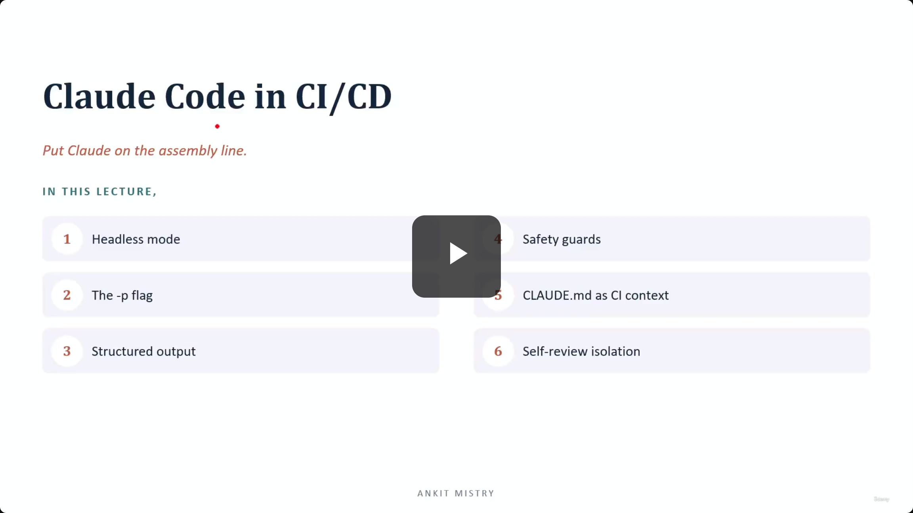
[00:00:00](https://www.udemy.com/course/claude-ai-certification/learn/lecture/57479755#overview)

## Claude Code in CI/CD

- Moving Claude onto the "assembly line"
    - This involves integrating it into CI/CD workflows so it can run automatically without human interaction
- **Lecture Overview**
    - 1. Headless mode
    - 2. The `-p` flag
    - 3. Structured output
    - 4. Safety guards
    - 5. `CLAUDE.md` as CI context
    - 6. Self-review isolation

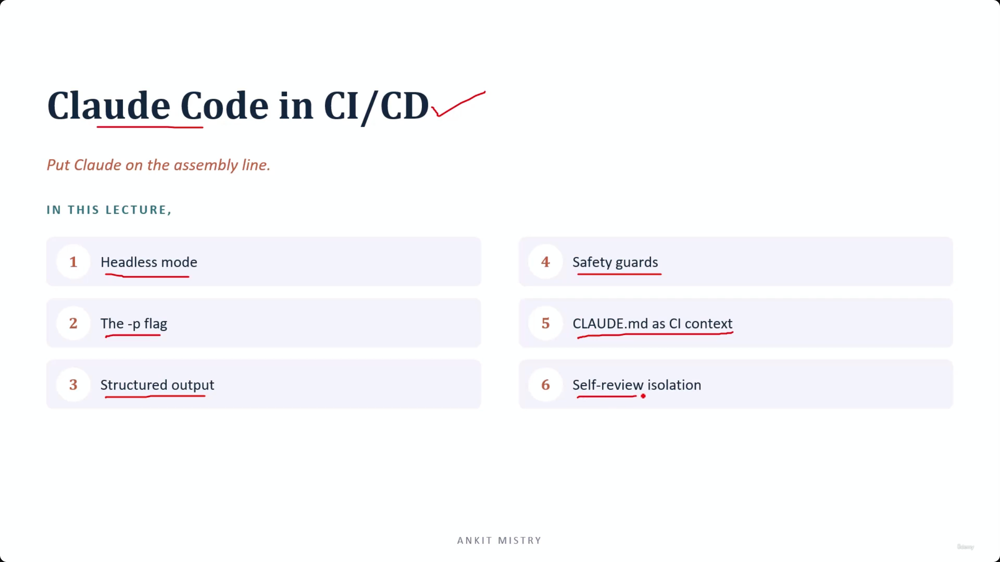
[00:00:42](https://www.udemy.com/course/claude-ai-certification/learn/lecture/57479755#overview)

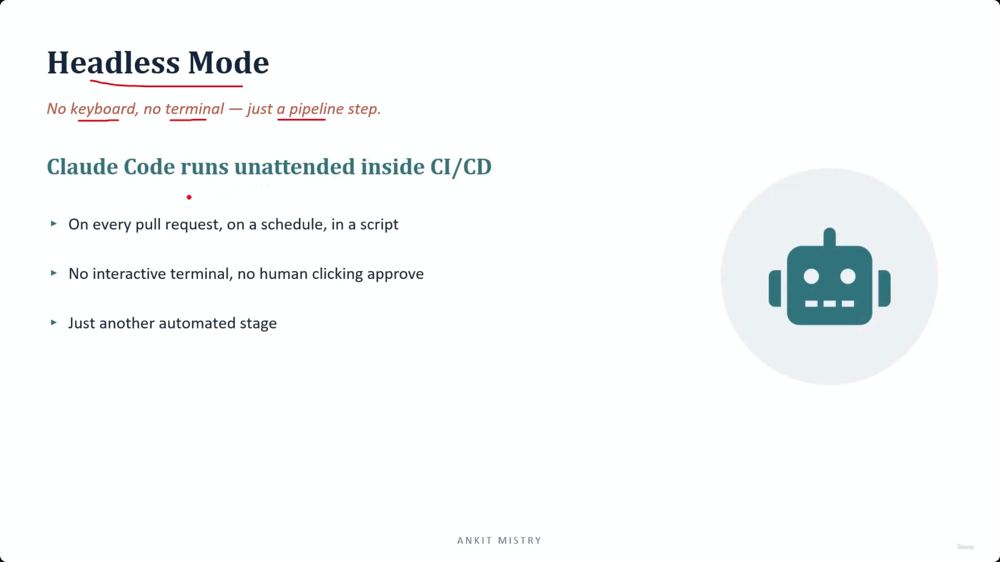
[00:00:57](https://www.udemy.com/course/claude-ai-certification/learn/lecture/57479755#overview)

### Headless Mode

- Defined as running without a keyboard or terminal
    - It functions simply as another automated step in a pipeline
- Claude Code runs unattended inside CI/CD
    - It can be triggered on every pull request, on a schedule, or within a script
    - There is no interactive terminal and no human required to click 'approve'

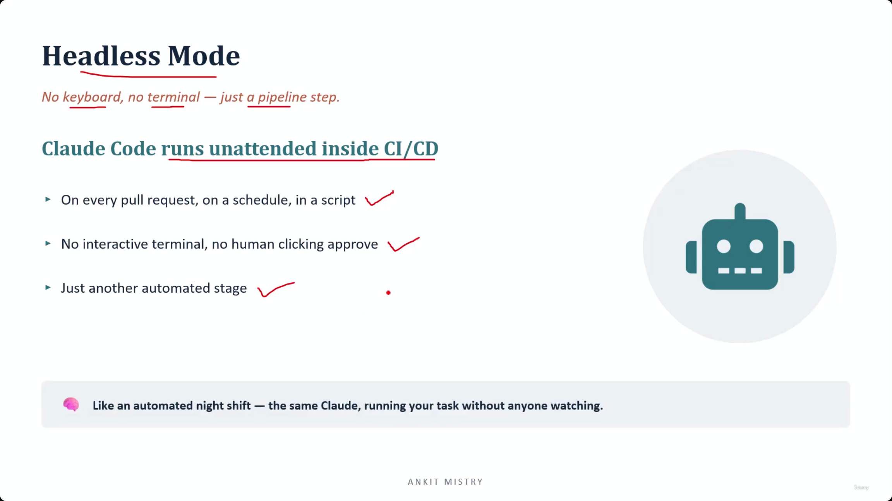
[00:01:36](https://www.udemy.com/course/claude-ai-certification/learn/lecture/57479755#overview)

### The Nature of Headless Mode

- Represents a shift from interactive use to automation
    - Moves away from assuming a human is sitting at the keyboard
    - Claude becomes just another automated stage in the pipeline, like running tests or building code
- **[Analogy] The Automated Night Shift**
    - Claude runs tasks without anyone watching
    - Work is completed on every pull request, but there is no one present to guide it or catch problems in the moment
    - The unattended nature is the core characteristic

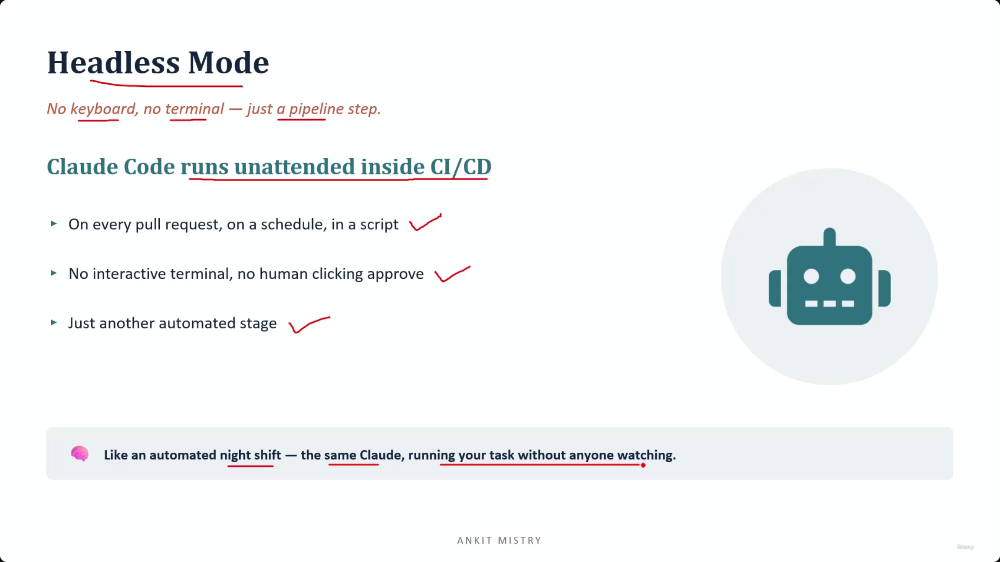
[00:02:00](https://www.udemy.com/course/claude-ai-certification/learn/lecture/57479755#overview)

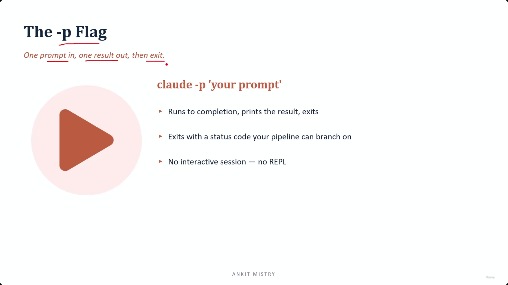
[00:02:20](https://www.udemy.com/course/claude-ai-certification/learn/lecture/57479755#overview)

### The `-p` Flag

- **[Behavior]** One prompt in, one result out, then it exits
    - It runs to completion, prints the result, and then terminates
- **Usage**
    - `claude -p 'your prompt'`
- **Pipeline Suitability**
    - Exits with a status code that the pipeline can branch on
    - Eliminates the need for an interactive session or a REPL (no live back-and-forth prompting)

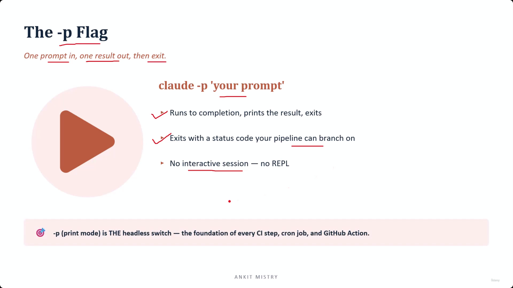
[00:02:58](https://www.udemy.com/course/claude-ai-certification/learn/lecture/57479755#overview)

### The Headless Switch

- **[Core Function]** The `-p` flag (print mode) is the fundamental mechanism that converts interactive Claude into an automated step
- **Foundation of Automation**
    - It is the essential component for every CI step, cron job, and GitHub Action
    - If asked how to run Claude Code without a human in an automated pipeline, the answer is the `-p` flag
- **Pipeline Requirements**
    - A successful pipeline step must start, perform its job, and finish cleanly
    - `-p` enables this by taking one prompt, producing one result, and then getting out of the way

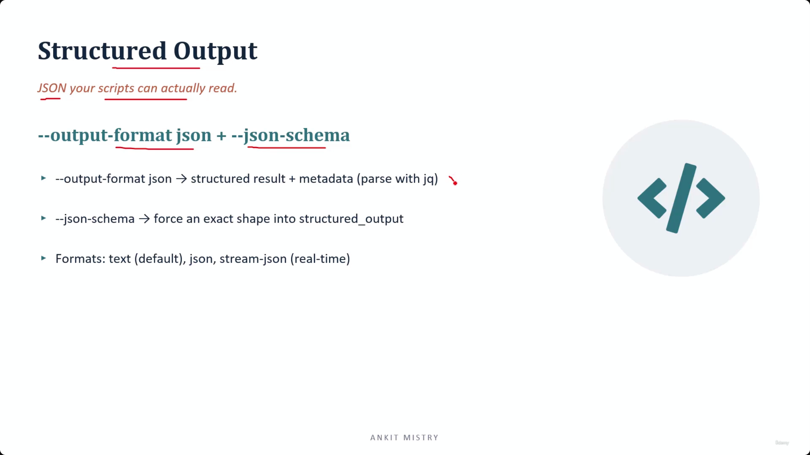
[00:03:48](https://www.udemy.com/course/claude-ai-certification/learn/lecture/57479755#overview)

### JSON and Schema Configuration

- **[Purpose]** To generate machine-readable JSON that scripts can parse and act upon
- **Key Flags**
    - `--output-format <format>`
        - Produces a structured result plus metadata
        - Ideal for piping into tools like `jq`
        - Available formats:
            - `text` (default)
            - `json`
            - `stream-json` (for real-time processing)
    - `--json-schema`
        - Forces the model to adhere to an exact shape within a `structured_output` field

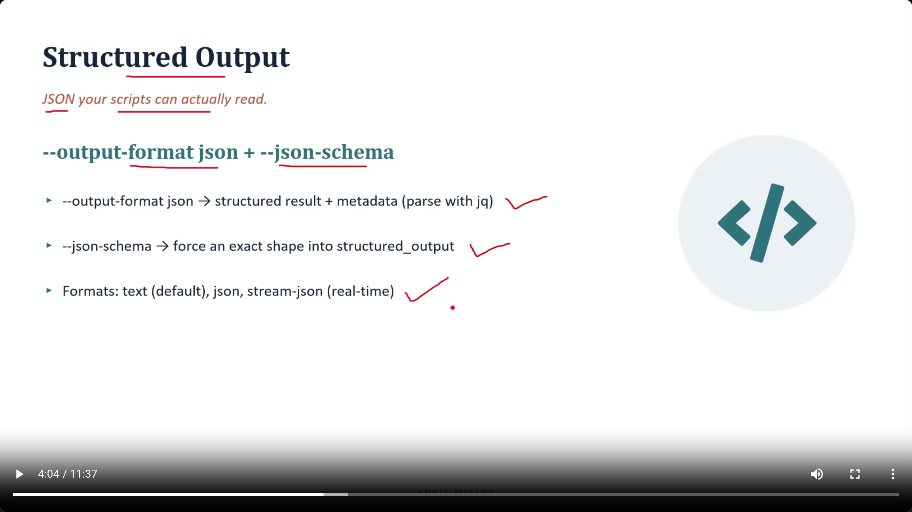
[00:04:04](https://www.udemy.com/course/claude-ai-certification/learn/lecture/57479755#overview)

### The Necessity of JSON Schemas

- **[The Problem]** Relying on raw JSON output without a schema is just "hoping" the output looks right
    - If a downstream script expects a specific field to decide its next action, any variation in the model's response will break the pipeline
- **[The Solution]** Use `--json-schema` to force an exact shape into the `structured_output` field
    - This ensures the required fields are present and in the correct place every single time
- **[Benefit]** Provides clean, structured data that scripts can actually read and act upon
    - Replaces unpredictable "blobs of prose" with predictable, machine-readable shapes
    - Facilitates reliable branching logic in automated workflows

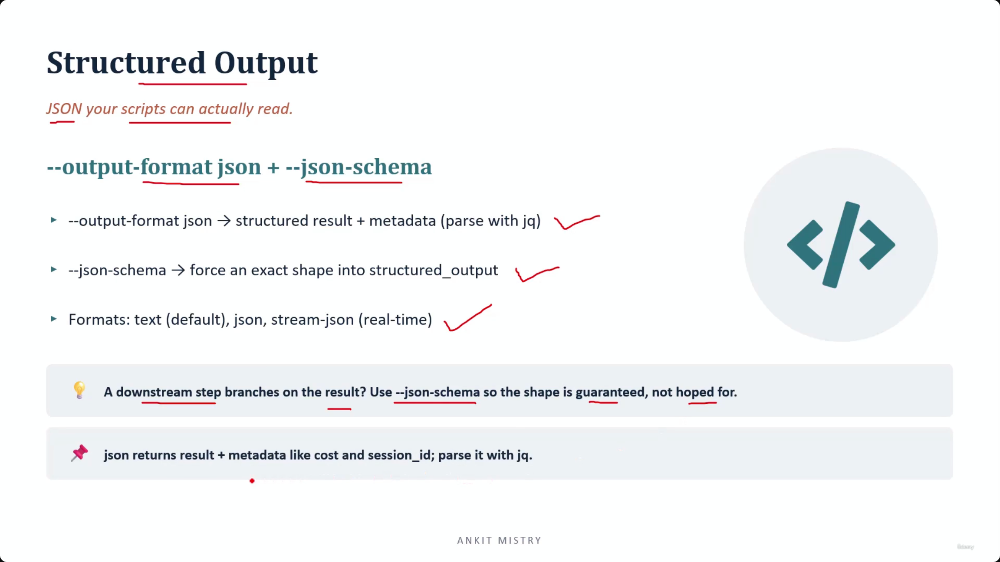
[00:04:51](https://www.udemy.com/course/claude-ai-certification/learn/lecture/57479755#overview)


[00:05:32](https://www.udemy.com/course/claude-ai-certification/learn/lecture/57479755#overview)

### JSON Format Metadata

- **[The Bonus]** Using `--output-format json` returns the actual result along with useful metadata about the run
    - Includes details like `cost` and `session_id`
- **Parsing with&#32;`jq`**
    - Because the output is clean JSON, small command-line tools like `jq` can easily extract specific pieces of data from the metadata or the result

### Safety Guards

- **[Core Concept]** When running in an unattended mode, it is essential to set limits upfront to prevent runaway processes or costs

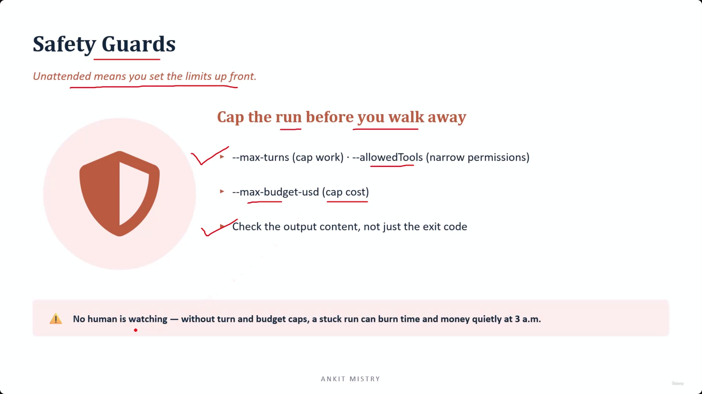
[00:06:15](https://www.udemy.com/course/claude-ai-certification/learn/lecture/57479755#overview)

### Unattended Execution Safeguards

- **[Core Concept]** Because no human is monitoring the process, you must establish hard limits upfront to prevent runaway processes or unexpected costs
- **Key Constraints**
    - `--max-turns`: Caps the total amount of work/steps performed
    - `--allowed-tools`: Narrows permissions to limit the agent's capabilities
    - `--max-budget-usd`: Caps the total cost in USD
- **Validation Strategy**
    - Do not rely solely on the exit code; you must also check the actual output content to ensure the result is valid

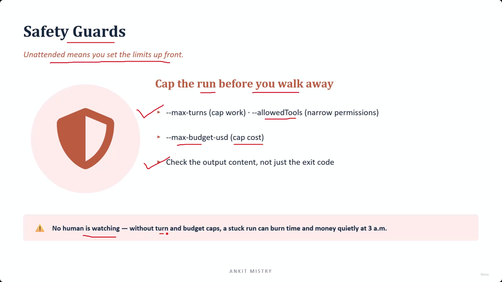
[00:06:19](https://www.udemy.com/course/claude-ai-certification/learn/lecture/57479755#overview)

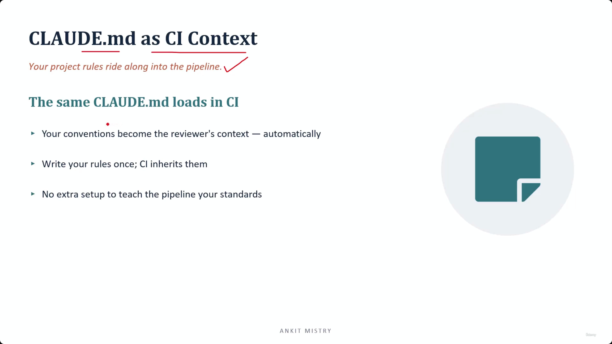
[00:07:00](https://www.udemy.com/course/claude-ai-certification/learn/lecture/57479755#overview)

### The Risk of Unattended Runs

- **[The Danger]** Without turn and budget caps, a process stuck in a loop can burn time and money quietly
    - This is especially critical for "headless" or unattended runs where no human is present to hit stop
    - A loop running at 3 a.m. could continue indefinitely, accumulating a significant bill by morning

### CLAUDE.md as CI Context

- **[Core Concept]** Your project rules ride along into the CI pipeline automatically
- **[How it works]** The same `CLAUDE.md` file used locally loads in CI
    - Your conventions automatically become the reviewer's context
    - You only have to write your rules once
    - CI inherits these rules without requiring extra setup to teach the pipeline your standards

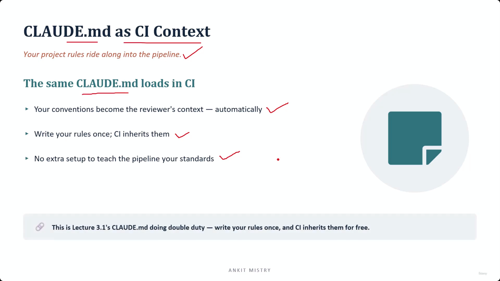
[00:07:32](https://www.udemy.com/course/claude-ai-certification/learn/lecture/57479755#overview)

### The Dual Role of CLAUDE.md

- **[Double Duty]** The file serves two distinct purposes simultaneously:
    - **Local Project Memory:** Acts as the context for your individual development sessions (as established in earlier lectures).
    - **CI Governing Context:** Automatically provides the rules and conventions for automated reviewers in the pipeline.
- **Efficiency Gains**
    - You write your rules once and CI inherits them for free
    - There is no extra setup required to teach the pipeline your standards; the rules you use for daily work are the exact same rules the automated reviewer uses.

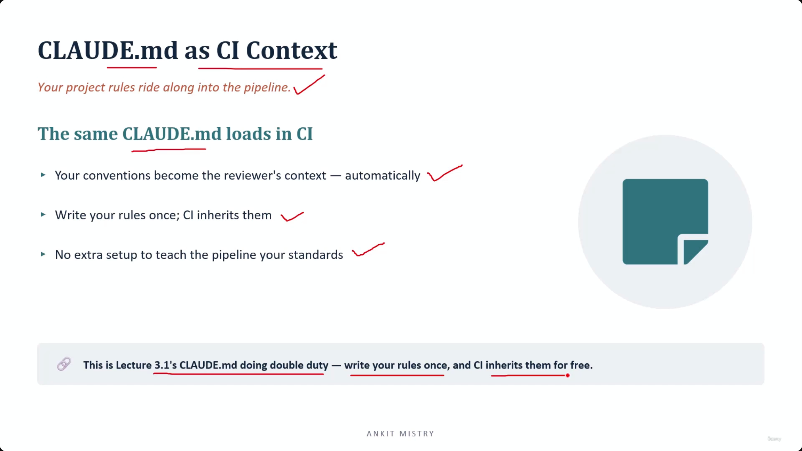
[00:07:49](https://www.udemy.com/course/claude-ai-certification/learn/lecture/57479755#overview)

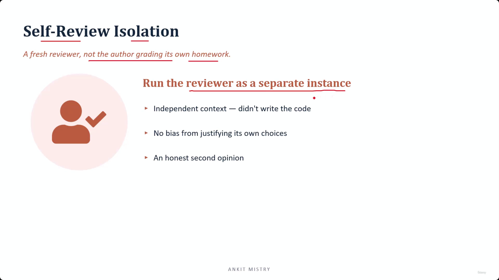
[00:08:22](https://www.udemy.com/course/claude-ai-certification/learn/lecture/57479755#overview)

### The CI Payoff

- **[Unified Context]** The exact same `CLAUDE.md` file used for local development also guides Claude within the CI pipeline
- **[Analogy]** One file teaches Claude your project both "at your desk" and "out on the assembly line"

### Self-Review Isolation

- **[Core Principle]** You want a fresh reviewer, not the author grading its own homework
- **Technique: Run the reviewer as a separate instance**
    - **Independent context:** The reviewer instance did not write the code it is checking
    - **No bias:** Prevents the agent from simply justifying its own previous choices
    - **Result:** Provides an honest second opinion

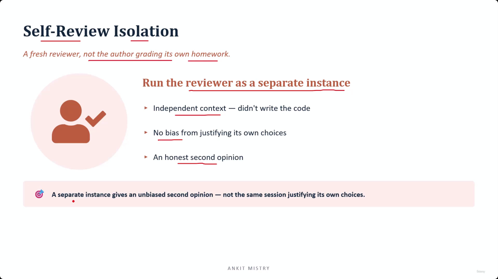
[00:08:54](https://www.udemy.com/course/claude-ai-certification/learn/lecture/57479755#overview)

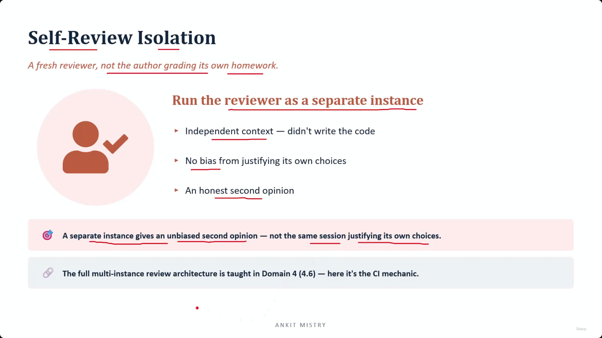
[00:09:29](https://www.udemy.com/course/claude-ai-certification/learn/lecture/57479755#overview)

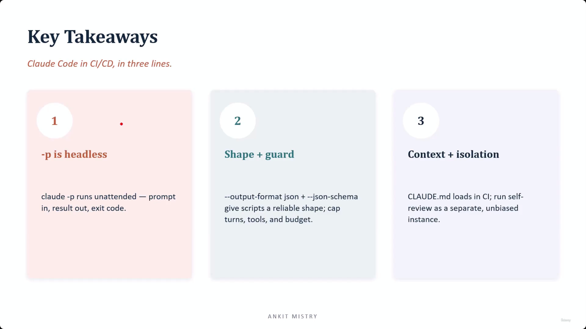
[00:10:02](https://www.udemy.com/course/claude-ai-certification/learn/lecture/57479755#overview)

### Achieving an Unbiased Second Opinion

- **[The Core Idea]** Bring in a fresh reviewer that sees the code "cold"
    - It has no inherent reason to defend the code because it didn't write it
- **[Why it matters]** Prevents the "grading its own homework" problem
    - If the same Claude instance that wrote the code also reviews it, it carries all the reasoning used during the writing process
    - This makes the agent naturally inclined to justify its own choices rather than finding flaws
- **[The Practical Application]** In this context, it is used as the standard mechanic for reviewing code within a CI pipeline
    - *Note: The full multi-instance review architecture is a deeper topic covered in Domain 4 (Lecture 4.6)*

### Key Takeaways: Claude Code in CI/CD

- **1. Shape + Guard**
    - Use `--output-format json` and `--json-schema` to give results a reliable shape
    - Use guards to cap turns, tools, and budget
- **2. Context + Isolation**
    - `CLAUDE.md` loads in CI to provide project context
    - Run the self-review as a separate, unbiased instance

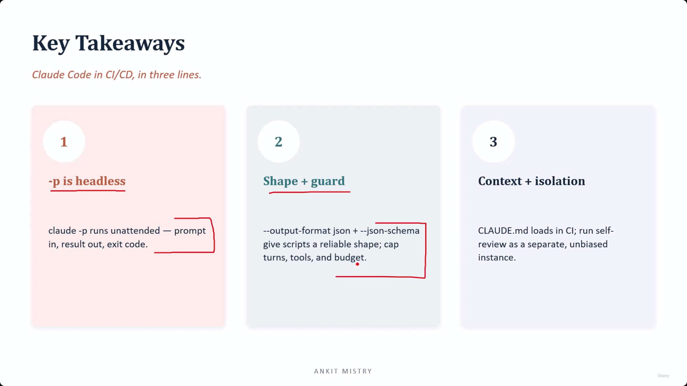
[00:10:22](https://www.udemy.com/course/claude-ai-certification/learn/lecture/57479755#overview)

### Summary: Claude Code in CI/CD

Claude Code in CI/CD can be summarized in three core principles:

1. **-p is headless**

    - `claude -p` runs unattended
    - Operates on a "prompt in, result out, exit code" model

2. **Shape + guard**

    - Use `--output-format json` and `--json-schema` flags to give scripts a reliable shape
    - Cap turns, tools, and budget to maintain control

3. **Context + isolation**

    - `CLAUDE.md` loads in CI to provide project context
    - Run self-review as a separate, unbiased instance

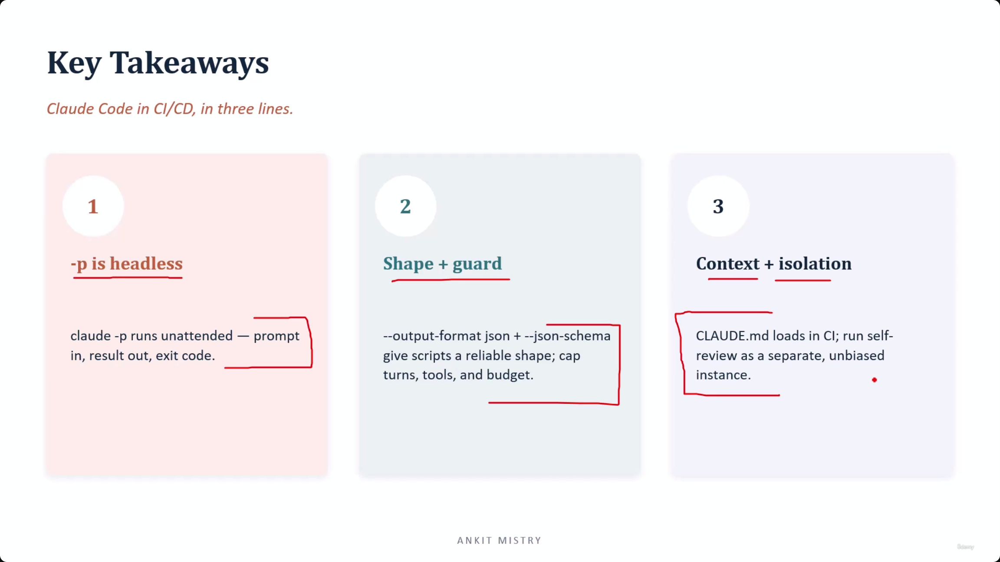
[00:10:51](https://www.udemy.com/course/claude-ai-certification/learn/lecture/57479755#overview)

### Domain 3 Recap: Claude Code Configuration and Workflows

Throughout this domain, the focus has been on shaping how Claude works, transitioning from a local development environment to an automated assembly line in a CI pipeline.

**The Journey of Configuration:**

- **Teaching the project:** Using `CLAUDE.md` to provide essential context.
- **Defining workflows:** Saving repetitive tasks as commands and skills.
- **Precision control:** Using path-specific loading to aim rules precisely at certain parts of the codebase.
- **Risk management:** Learning to plan before performing risky work and refining results through iterative passes.

**Core Objective:**

- To shape and control Claude's behavior from your own desk all the way out to your automated pipelines.

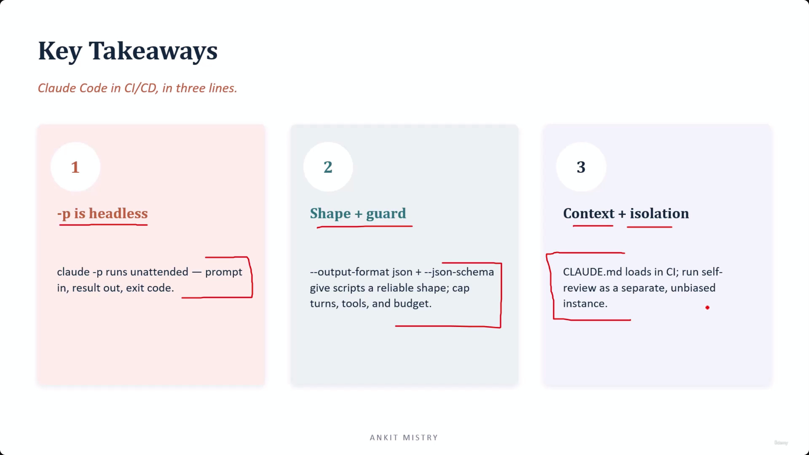
[00:11:35](https://www.udemy.com/course/claude-ai-certification/learn/lecture/57479755#overview)

---

## Simple Explanation (with Claude Examples)

**The core idea, in one line**: Instead of you typing into Claude and reading its reply, a script does that talking *for* you — automatically, with no person watching.

**Headless mode — the night shift**

No terminal, no human — triggered automatically (e.g., on every pull request). Work gets done, but nobody's watching in real time.

**The `-p` flag — one prompt, one answer, done**

```bash
claude -p "Summarize what this pull request changes"
```
One instruction in, one printed result out, then the program exits — exactly what a pipeline step needs.

**Structured, predictable output**

```bash
claude -p "Review this PR for security issues" --output-format json
```
```json
{ "result": "No security issues found in this PR.", "cost": 0.014, "session_id": "abc123" }
```
`--json-schema` goes further, forcing an *exact* shape every time:
```json
{ "structured_output": { "passed": false, "issues": ["Missing null check on line 42"] } }
```
Now a script can safely write `if structured_output.passed == false: fail the build` — no guessing at wording.

**Safety guards — because nobody's watching**

```bash
claude -p "Fix the failing tests" --max-turns 5 --max-budget-usd 2 --allowed-tools Edit,Bash
```
Caps how many steps, how much money, and which tools — so a silent 3 a.m. bug loop can't run up a huge bill with no one there to stop it.

**`CLAUDE.md` rides along automatically**

The same `CLAUDE.md` you use locally loads in CI too, with zero extra setup — your rules apply whether you're chatting at your desk or Claude is auto-reviewing a PR.

**Self-review isolation — don't grade your own homework**

A second, separate Claude instance — with no memory of *why* the first one made its choices — reviews the code cold, giving a genuinely independent opinion instead of defending its own prior reasoning.

*Claude Code example*: this is the same principle behind `code-review`'s independent review pass in this environment — a fresh look at a diff, not the same context that wrote it, judging the work on its own merits.

**The whole flow, start to finish**

```
Your prompt → claude -p "..." --output-format json --json-schema {...}
  → Claude reads code + CLAUDE.md, does the work
  → Prints ONE structured JSON result, then exits
  → Your CI script reads that JSON and decides: pass the build, or fail it
```

**Recap in 3 lines**

1. **`-p` is headless** — prompt in, structured result out, exit.
2. **Shape + guard** — force JSON output with a schema, cap turns/tools/budget.
3. **Context + isolation** — `CLAUDE.md` carries into CI automatically; review with a fresh, separate instance.

---

## Exam Objective Note: CCAR-F 3.6 — CI/CD Integration

**Mostly it comes down to two flags**

`--output-format json` puts Claude's answer text into a `result` field. Add `--json-schema` alongside it, and the schema-shaped data goes into a separate `structured_output` field. Both fields show up together in the same output.

**The trap: format annotations look enforced, but aren't**

A schema hint like `"format": "email"` is accepted without complaint, but it's **never actually checked**. Assuming it guarantees a valid email address is a real design mistake — nothing stops Claude from outputting something that isn't an email, and it would still pass validation.

**In an unattended run, permissions matter more than anything else**

There's a sneaky gotcha in the rule syntax: in `Bash(git diff *)`, that **space** before the `*` is what limits the match to only the exact command `git diff`. Remove the space (`Bash(git diff*)`), and the same rule now also matches `git diff-index` — a different command you probably never meant to allow.

*Everyday analogy*: it's like the difference between "allow anyone named John" and "allow anyone named John" followed immediately by a wildcard with no space — the second version could accidentally also let in "Johnathan," someone you never meant to include.

*Claude Code example*: you write a CI permission rule as `Bash(git diff*)`, meaning to allow just `git diff`. Because the space is missing, Claude can also silently run `git diff-index` under that same allowed rule — a gap you'd only catch by reading the permission syntax carefully.

**Bare mode: reproducible because it skips all your local setup**

Bare mode skips `CLAUDE.md`, hooks, and MCP server discovery completely. That's actually the point — by ignoring everything specific to your local machine, the exact same command behaves exactly the same way no matter which machine runs it.

**Recap in 3 lines**

1. **`result` holds the text; `structured_output` holds the schema-shaped data** — both present when a schema is supplied.
2. **Format annotations like `email` are never enforced** — don't design as if they validate anything.
3. **A missing space in a Bash permission rule silently widens the match** — `Bash(git diff *)` is not the same as `Bash(git diff*)`; bare mode buys reproducibility by skipping all local config.