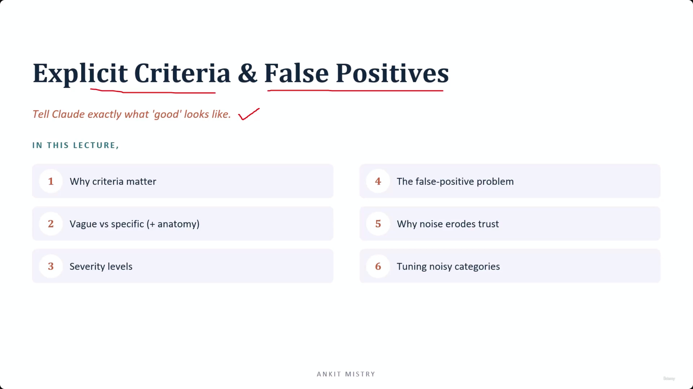
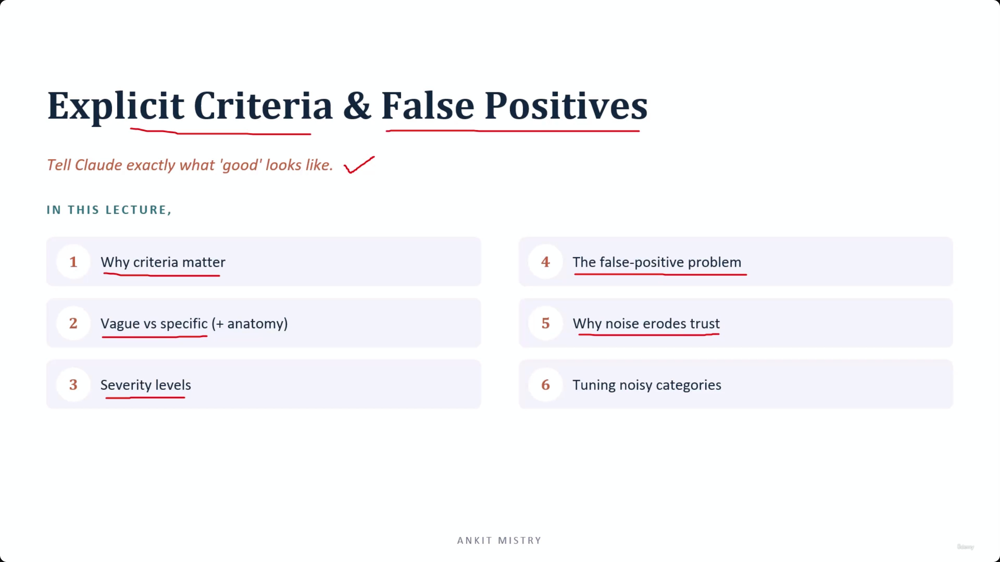
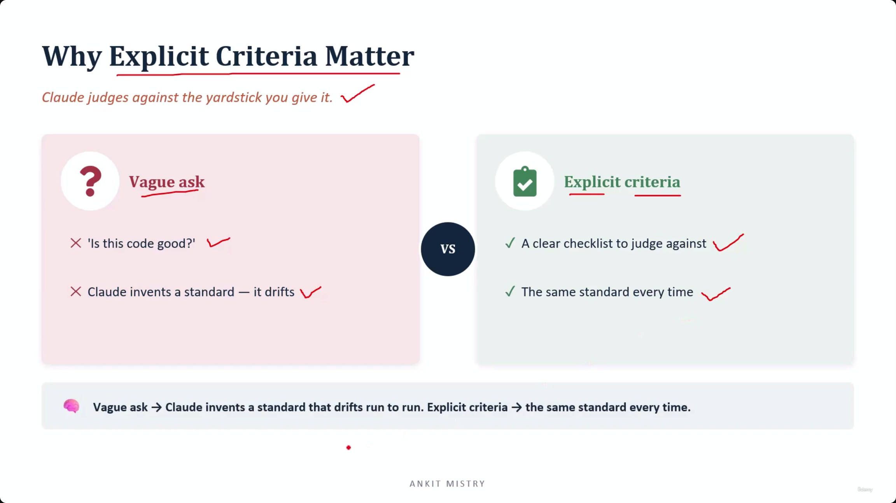
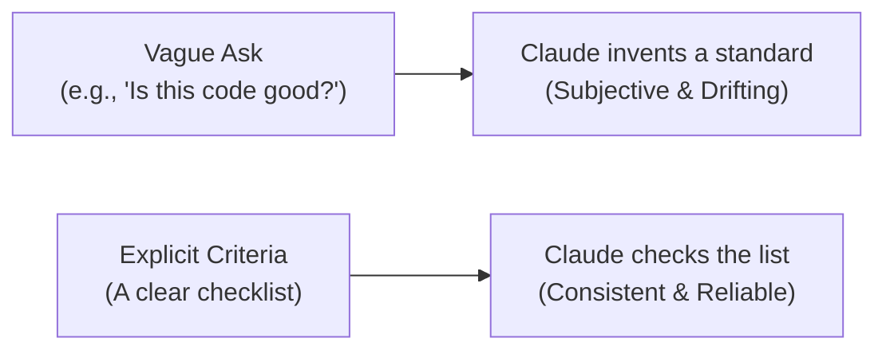
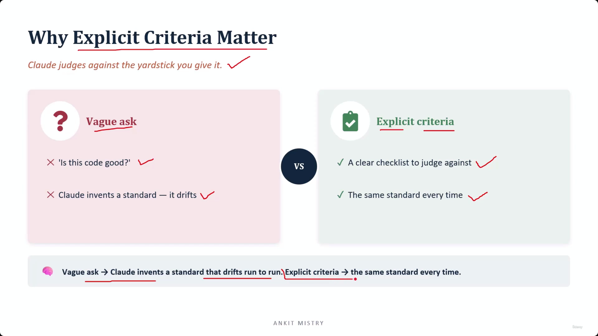
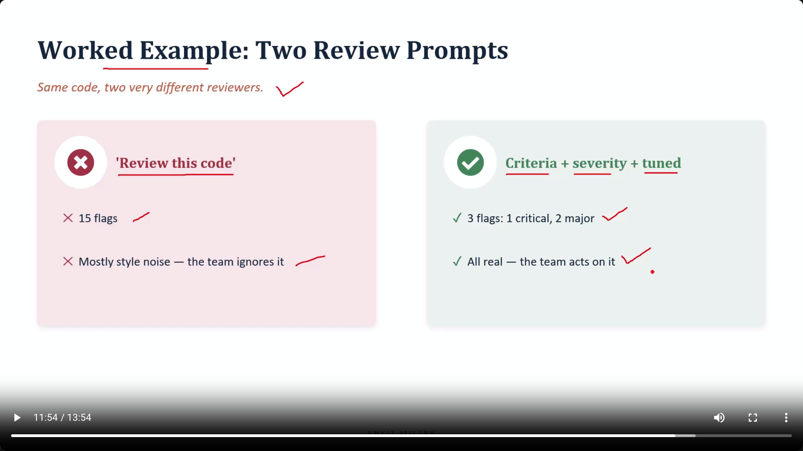
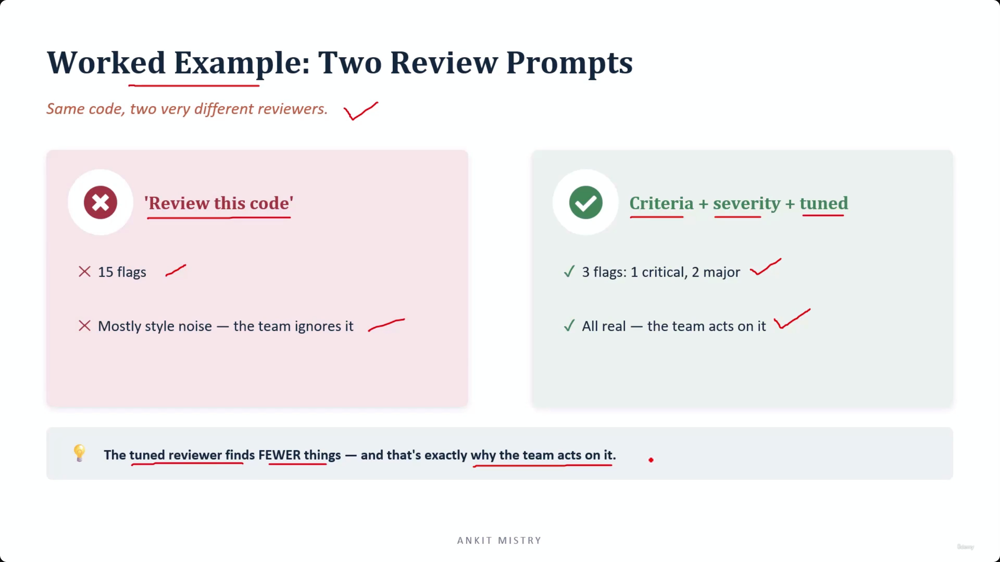
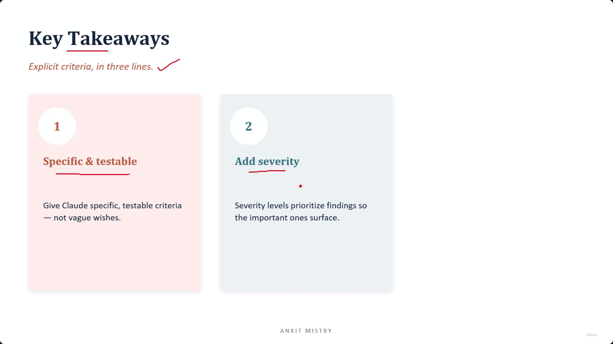
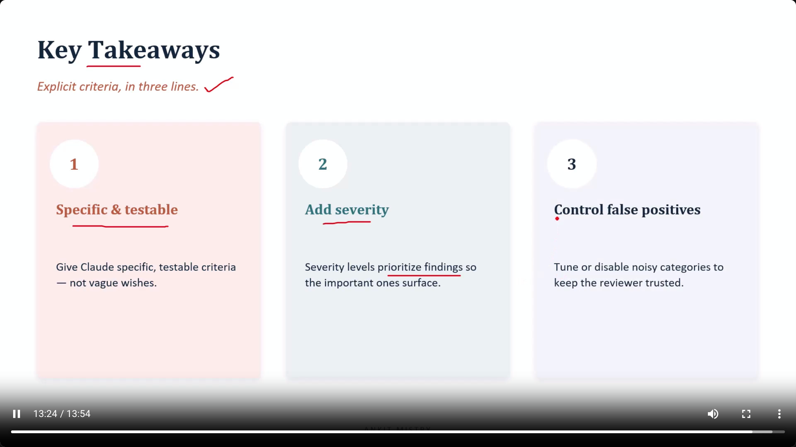

[00:00:30](https://www.udemy.com/course/claude-ai-certification/learn/lecture/57493845#overview)

## Prompt Engineering and Structured Output

### Explicit Criteria & False Positives

- The goal is to get reliable and precise results out of Claude
- **[Core Principle]** Tell Claude exactly what 'good' looks like
- **Lecture Overview**

    1. Why criteria matter
    2. Vague vs specific (+ anatomy)
    3. Severity levels
    4. The false-positive problem
    5. Why noise erodes trust
    6. Tuning noisy categories

[00:00:45](https://www.udemy.com/course/claude-ai-certification/learn/lecture/57493845#overview)

### The Problem with Vague Asks

- Claude judges against the yardstick you provide
- **[The Risk of Drift]** Using subjective or imprecise prompts forces Claude to invent its own standards
    - Example: "Is this code good?"
    - Because "good" is not a fixed standard, the model's evaluation will drift from your actual requirements
    - What one person considers "good" code differs from another, leading to inconsistent results

[00:02:04](https://www.udemy.com/course/claude-ai-certification/learn/lecture/57493845#overview)

### Explicit Criteria vs. Vague Asks

- **[Vague Ask]** Asking questions like "Is this code good?"
    - Claude has to invent a standard on the spot
    - This leads to "drift," where the standard changes from run to run
- **[Explicit Criteria]** Providing a clear checklist to judge against
    - Claude uses the exact list of things to check
    - This ensures the same standard is applied every single time

[00:02:14](https://www.udemy.com/course/claude-ai-certification/learn/lecture/57493845#overview)

### The Core Lesson of Explicit Criteria

- Consistency does not come from asking a cleverer question
- **[The Mechanism]** Consistency comes from providing a fixed yardstick
    - This prevents Claude from having to guess at your intent

### Vague vs. Specific

- **[The Vague Ask]** Often takes the form of a "wish"
    - Example: "Check for security problems"
    - **[The Problem]** Claude is forced to guess what you actually care about
- **[The Specific Rule]** Must be testable
    - Unlike a wish, a specific rule provides a clear, verifiable standard

### Wishes vs. Testable Rules

- **[The Problem with Wishes]** High-level requests like "Check for security problems" are too broad
    - Security problems can encompass hundreds of different vulnerabilities
    - **[The Result]** Because Claude has to guess which specific problems you care about, it becomes inconsistent
        - It might catch one type of issue today and a completely different one tomorrow
- **[The Power of Testable Rules]** Specific rules are observable and verifiable
    - Instead of a wish, provide a concrete technical pattern to look for
    - **[Example]** Rather than "Check for security problems," use:
        - "Flag any SQL query that is built with string concatenation"
    - **[Why this works]** This is a specific, testable instruction because string concatenation (gluing bits of text together to build a query) is a well-known, identifiable security risk

### The Testability Heuristic

- **[The Gold Standard]** A rule is effective when it is precise enough that Claude doesn't have to guess
    - It looks for one exact, identifiable pattern
    - It flags that specific pattern immediately
- **[The Human Test]** To determine if a criterion is good, apply this mental check:
    - **[The Question]** "Could I check this myself by hand with a clear yes or no?"
    - **[If Yes]** It is a good, testable rule
    - **[If No]** If the rule is fuzzy or open to opinion, Claude will apply it inconsistently

> A criterion that Claude cannot test objectively will be applied inconsistently.

### Severity Levels

- **[The Concept]** Not every issue found requires the same level of urgency
    - Categorizing findings helps distinguish between minor concerns and "5 alarm fires"

#### Critical Severity

- **[Definition]** Issues that are severe enough to block a release
    - **[The Rule]** Critical means "stop"; these must be dealt with immediately
- **[Example]** A hard-coded password
    - This is a serious security hole that makes shipping the code impossible until it is resolved

#### Major Severity

- **[Definition]** Issues that are important and require attention, but are not immediate blockers
    - **[The Rule]** Major means "fix this soon"; it is a real problem, but it doesn't necessitate an immediate halt to production
- **[Example]** Missing error handling
    - While a legitimate issue that should be addressed, it doesn't typically stop a release in the same way a critical security hole does

#### Minor Severity

- **[Definition]** Low-stakes issues that are primarily about cleanliness or style
    - **[The Rule]** Minor means "fix it if you have time"; these issues are non-breaking and can wait
- **[Example]** An inconsistent name
    - This is considered "untidy" rather than a functional or security risk

---

### The Importance of Severity Categorization

- **[The Problem]** Without explicit severity levels, the output lacks hierarchy
    - A simple typo would carry the same weight as a critical security vulnerability
    - **[The Goal]** Categorization allows the user to immediately distinguish between high-priority emergencies and low-priority polish.

### The Risk of Omitting Severity

- **[The Consequence]** Without severity levels, every finding carries equal weight
    - A tiny typo and a serious security hole look equally urgent
    - **[The Danger]** The most critical issues get "buried in the crowd" because they lack visual or structural distinction from trivial ones

### The False Positive Problem

- **[Definition]** A false positive occurs when the model flags something as an issue that is not actually a problem
    - This creates "noise" that can erode trust in the model's output

### False Positives vs. False Negatives

- **False Positive (The "False Alarm")**
    - **[Analogy]** Like a smoke alarm going off because you are just making toast
    - **[The Impact]** It is "loud and wrong"
- **False Negative (The "Missed Issue")**
    - **[Definition]** When the model stays silent about a real problem that actually exists
    - **[The Impact]** It fails to catch a legitimate vulnerability or error
- **[The Trust Factor]** While both errors are detrimental, False Positives are the primary threat to trust
    - Over-broad criteria lead to excessive false alarms
    - Frequent false positives cause users to stop trusting the model's judgment entirely

### Tuning Noisy Categories

- **[The Strategy]** To maintain trust, you must actively tune the categories that produce the most noise
- **[The Goal]** Reducing false alarms is not just about accuracy, but about ensuring the model's output remains actionable and worth the user's attention

### Why Noise Erodes Trust

- **[The Proverb]** "A reviewer who cries wolf gets ignored"
- **[The Mechanism of Failure]** High noise levels cause users to enter an "autopilot" dismissal mode
    - When a user encounters a stream of nonsense flags, they develop a habit of clicking "dismiss"
    - This behavior is a survival mechanism to filter out the noise, but it creates a massive blind spot
- **[The Critical Consequence]** The "Crying Wolf" effect renders the system useless
    - When a genuine, critical flag finally appears, it is dismissed along with the noise
    - **[The Hard Truth]** A noisy reviewer is often worse than having no reviewer at all
        - A reviewer with no output provides zero information
        - A noisy reviewer actively trains the user to ignore the very information they were designed to provide

### The Fallacy of the "Better Than Nothing" Reviewer

- **[The Counter-Intuitive Reality]** It is tempting to believe a reviewer that is occasionally wrong is still better than having no reviewer at all
    - This is false
    - Once a user learns to ignore a noisy system, the model's value drops to zero
- **[The Loss of Utility]** When trust is broken, the model's accuracy no longer matters
    - The user begins to treat both "good" flags and "bad" flags the same way
    - Even when the model provides a perfectly correct, critical insight, it is ignored because it is indistinguishable from the previous noise

### Tuning: Managing Noisy Categories

- **[The Core Principle]** Turn off what you cannot make precise
- **[The Two-Pronged Approach]** When a specific category (e.g., "style nitpicks") is producing too many false positives, you have two options:
    - **Narrow the scope**: Tighten the rules to make the criteria much more specific and harder to trigger accidentally
    - **Switch it off**: If the category cannot be made precise, disable it entirely to prevent it from eroding the trust built by more reliable categories

### Strategies for Tuning Noisy Categories

- **[The Core Approach]** If a category is producing too many false positives, you have two real options:
    - **Narrow the rule:** Tighten the specific criteria to make the definition of an "issue" much more restrictive
    - **Disable the category:** Switch the category off entirely
- **[The Logic of Disabling]** Fewer high-precision flags are more valuable than many noisy ones
    - It is better to have a silent category than one that drowns out legitimate, high-value flags with noise
    - This requires being honest about which checks actually work and which are currently unreliable
- **[The Common Mistake]** Avoid "Vague Pleas" when dealing with over-flagging
    - **[The Wrong Way]** Adding instructions like `"please be more careful"` or `"only report high confidence issues"` to the prompt
    - **[Why it fails]** These are vague requests that do not provide the model with a fixed yardstick or testable rules
    - **[The Right Way]** Apply specific structural changes: tighten the rule or disable the category

### Worked Example: Two Review Prompts

- **[The Vague Approach]** Using a generic prompt like `'Review this code'`
    - Produces a flood of findings (e.g., 15 flags)
    - Most findings are trivial style noise
    - **[Result]** The team learns to ignore all flags, including the useful ones, because they are indistinguishable from the noise
- **[The Structured Approach]** Using a prompt with `Criteria + severity + tuned`
    - Produces significantly fewer, high-signal flags (e.g., 3 flags: 1 critical, 2 major)
    - All findings are "real"
    - **[Result]** The team acts on the findings because they are high-value and actionable

| Prompt Type | Resulting Flags | Quality | Team Response |
| --- | --- | --- | --- |
| Vague ('Review this code') | 15 flags | Mostly style noise | Ignores everything |
| Structured (Criteria + severity + tuned) | 3 flags (1 critical, 2 major) | All real | Acts on them |

[00:11:54](https://www.udemy.com/course/claude-ai-certification/learn/lecture/57493845#overview)

### The Paradox of Review Thoroughness

- **[The Counter-Intuitive Truth]** A tuned reviewer finds *fewer* things, and that is exactly why the team acts on it
    - Higher volume of flags does not equal higher thoroughness if the quality is low
    - The reviewer that found 15 things was ignored
    - The reviewer that found 3 things was trusted
- **[Why Tuning Works]** By reducing noise, you increase the signal-to-noise ratio
    - The tuned reviewer (using `Criteria + severity + tuned`) produces findings that are genuine and categorized by severity
    - This clarity allows the team to distinguish real issues from trivial style noise

[00:12:39](https://www.udemy.com/course/claude-ai-certification/learn/lecture/57493845#overview)

[00:13:08](https://www.udemy.com/course/claude-ai-certification/learn/lecture/57493845#overview)

### Key Takeaways: Explicit Criteria in Three Lines

- **1. Specific and testable**
    - Provide Claude with specific, testable criteria instead of vague wishes
    - **[Why it matters]** A rule that can be checked by hand will be applied consistently, whereas a fuzzy wish will not
- **2. Add severity**
    - Use severity levels to prioritize findings
    - **[Why it matters]** Without levels, a typo and a security hole look equally urgent; severity ensures the most important issues surface first

[00:13:24](https://www.udemy.com/course/claude-ai-certification/learn/lecture/57493845#overview)

---

## Simple Explanation (with Claude Examples)

**The core idea, in one line**: If you ask Claude a fuzzy question, you get a fuzzy answer — tell it exactly what "good" or "bad" looks like, and it checks consistently every time.

**Vague questions drift**

"Is this code good?" has no fixed standard, so Claude invents one on the spot — and that invented standard can change between runs. "Flag any SQL query built with string concatenation" names one exact, checkable pattern instead.

*Claude Code example*: asking me "review this file for problems" is a wish — I have to guess what you care about. Asking "flag any function longer than 50 lines with no comments" is a testable rule — I check it the same way every time.

**The human test**: *"Could I check this myself, by hand, with a plain yes or no?"* If yes, it's a solid rule. If it's fuzzy or opinion-based, Claude will apply it inconsistently too.

**Severity levels — not every issue deserves the same alarm**

**Critical** = stop, don't ship (a hard-coded password). **Major** = fix soon (missing error handling). **Minor** = fix whenever (an inconsistent name). Without labels, a typo looks just as urgent as a leaked API key.

**False positives — the "false alarm" problem**

Like a smoke alarm going off because you made toast: loud and wrong. False positives (flagging something that isn't a problem) damage trust more than false negatives (staying silent about a real one) — because once a reviewer cries wolf, people stop reading its flags, including the real ones.

**Tuning noisy categories**

If a category (say, "style nitpicks") keeps producing false alarms: narrow the rule, or turn it off entirely. What doesn't work: vague pleas like "please be more careful" added to the prompt — that's still not a testable rule.

**The real comparison**

`"Review this code"` → 15 flags, mostly noise → team ignores everything. `"Flag SQL injection, missing error handling, hard-coded secrets, with severity"` → 3 flags, all real → team acts on every one.

**Recap in 3 lines**

1. **Be specific and testable** — a rule you could check by hand beats a vague wish.
2. **Add severity** — so critical issues don't get buried next to typos.
3. **Tune out noise, don't just ask nicer** — narrow or disable unreliable categories.

---

## Exam Objective Note: CCAR-F 4.1 — System Prompt Criteria

**The recurring failure: a criterion the prompt never defines**

"Flag anything suspicious" leaves Claude inventing its own standard — a slightly different one each run. The fix: named categories, each with a stated rule, anchored by a worked example that pins down the exact boundary.

**Knowing when a prompt is the wrong instrument**

Requirements phrased with "never" or "without exception" are guarantees. A prompt only *raises the odds* of compliance — it always leaves a residual tail of failure. For a true "never" requirement, remove the model from the requirement entirely: e.g., append the required text in code after the model runs, rather than trusting the model to always include it.

**Length is examined too**

A rule lost among thirty others isn't fixed by adding a thirty-second — that's dilution, not absence.

**Recap in 3 lines**

1. **Undefined criteria drift** — name categories, state a rule for each, anchor with a worked example.
2. **"Never" is a guarantee a prompt can't give** — enforce true guarantees in code, not in words.
3. **A buried rule needs subtraction, not one more addition.**