[00:00:23](https://www.udemy.com/course/claude-ai-certification/learn/lecture/57493847#overview)

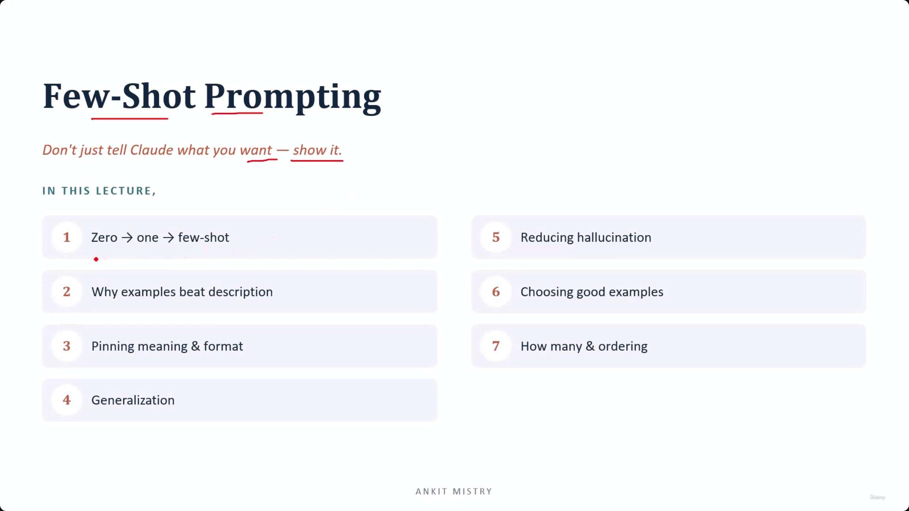
[00:00:32](https://www.udemy.com/course/claude-ai-certification/learn/lecture/57493847#overview)

## Few-Shot Prompting

- Don't just tell Claude what you want — show it.

### Lecture Roadmap

1. Zero $\rightarrow$ one $\rightarrow$ few-shot
2. Why examples beat description
3. Pinning meaning & format
4. Generalization
5. Reducing hallucination
6. Choosing good examples
7. How many & ordering

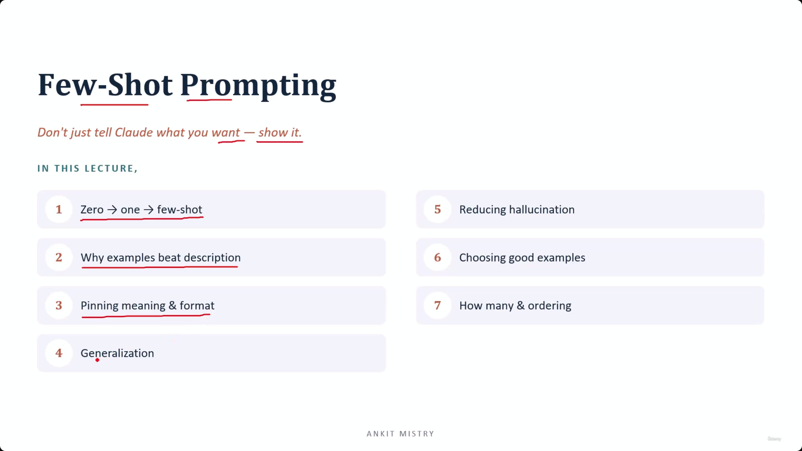
[00:00:44](https://www.udemy.com/course/claude-ai-certification/learn/lecture/57493847#overview)

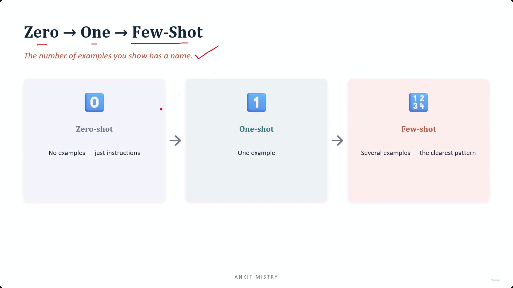
[00:01:11](https://www.udemy.com/course/claude-ai-certification/learn/lecture/57493847#overview)

### Zero $\rightarrow$ One $\rightarrow$ Few-Shot

- The terminology is defined by the number of examples provided in the prompt
    - **Zero-shot**: No examples are given, only instructions
    - **One-shot**: Exactly one example is provided
    - **Few-shot**: Several examples are provided to establish the clearest pattern

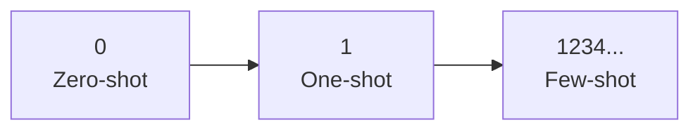
```mermaid
flowchart LR
    A["0\nZero-shot"] --> B["1\nOne-shot"] --> C["1234...\nFew-shot"]
```

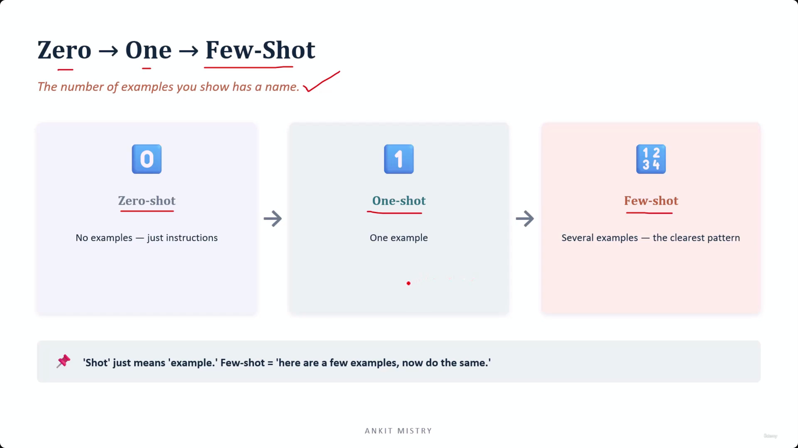
[00:01:46](https://www.udemy.com/course/claude-ai-certification/learn/lecture/57493847#overview)

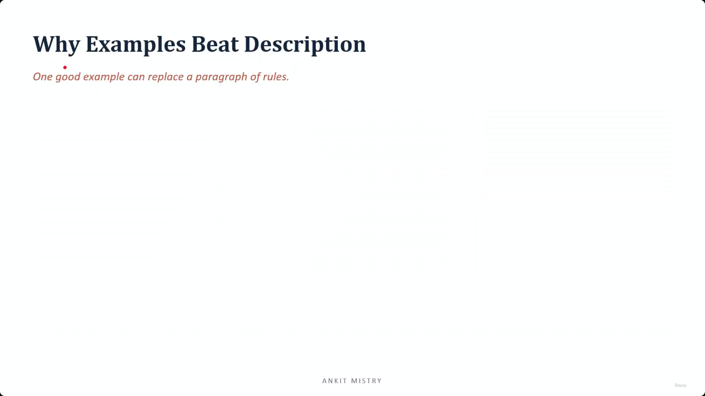
[00:02:10](https://www.udemy.com/course/claude-ai-certification/learn/lecture/57493847#overview)

### Decoding Prompting Terminology

- In this context, **'shot'** is simply a technical term for **'example'**
    - **Few-shot** = "Here are a few examples, now do the same"
- Providing multiple examples (few-shot) is typically the strongest way to establish a clear pattern for the model to follow

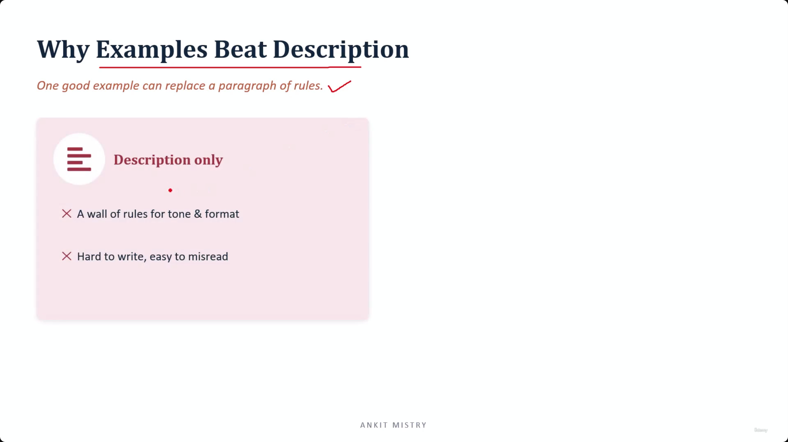
[00:02:23](https://www.udemy.com/course/claude-ai-certification/learn/lecture/57493847#overview)

### Why Examples Beat Description

- One good example can replace a paragraph of rules.

#### Description Only

- This approach relies on writing a "wall of rules" to define tone and format
    - **[The Problem]** It is difficult to write precisely
    - **[The Problem]** It is easy for the model to misread the long, fiddly list of instructions

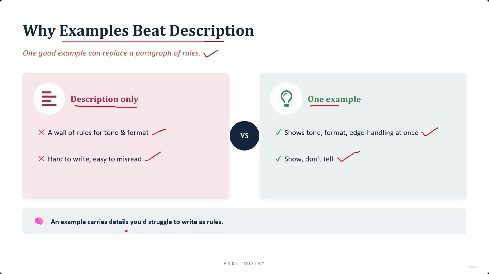
[00:03:30](https://www.udemy.com/course/claude-ai-certification/learn/lecture/57493847#overview)

#### One Example

- Follows the motto: "Show, don't tell"
- A single example carries significantly more weight than a page of rules
    - Instead of describing tone, you show a sentence in that tone
    - Instead of describing format, you show the format itself
- **[The Advantage]** It captures tone, format, and edge handling all at once
- **[The Deeper Reason]** Examples convey subtle details that are almost impossible to write down as explicit rules

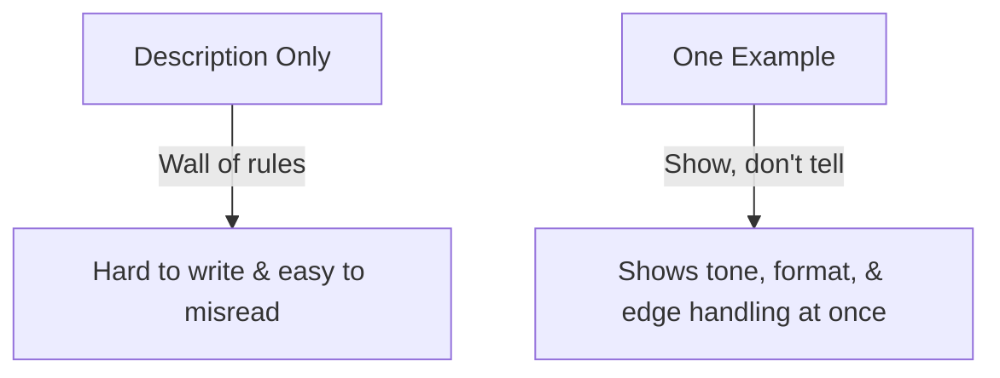
```mermaid
graph TD
    A[Description Only] -->|Wall of rules| B[Hard to write & easy to misread]
    C[One Example] -->|Show, don't tell| D[Shows tone, format, & edge handling at once]
```

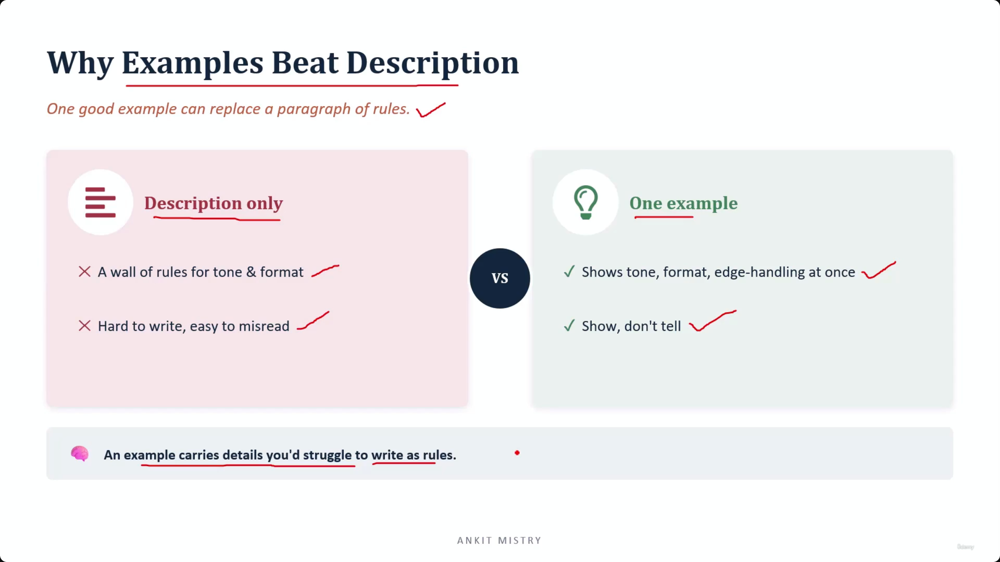
[00:03:42](https://www.udemy.com/course/claude-ai-certification/learn/lecture/57493847#overview)

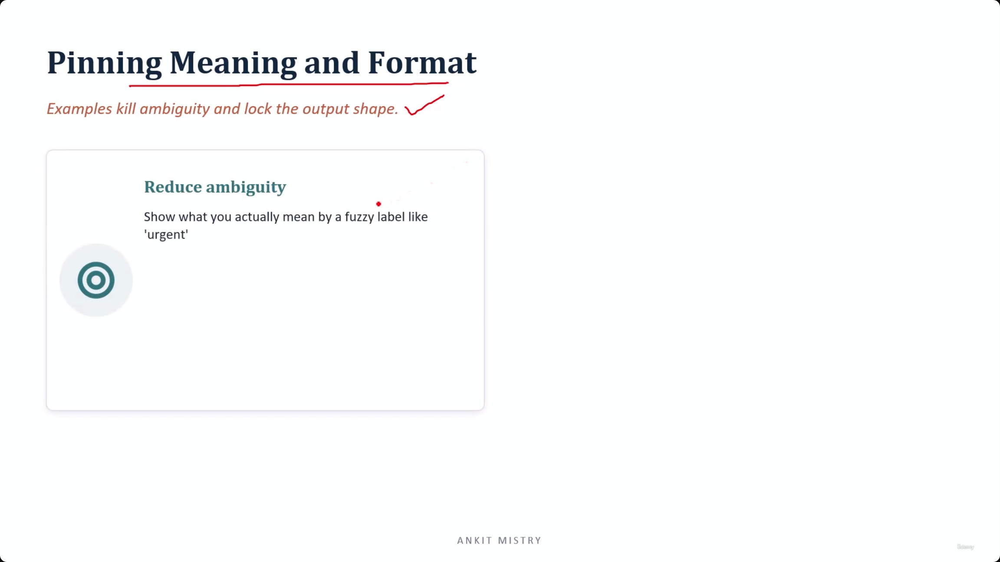
[00:04:11](https://www.udemy.com/course/claude-ai-certification/learn/lecture/57493847#overview)

### Pinning Meaning and Format

- Examples perform two primary jobs:
    - **Reducing ambiguity**: They clarify what you actually mean by vague or "fuzzy" labels
    - **Locking the output shape**: They ensure the model follows a specific structure

#### Reducing Ambiguity

- Examples show the concrete intent behind subjective words
    - **[Example]** A word like `urgent` is highly subjective and vague
    - An example provides the context needed to define exactly what counts as "urgent" in a specific situation

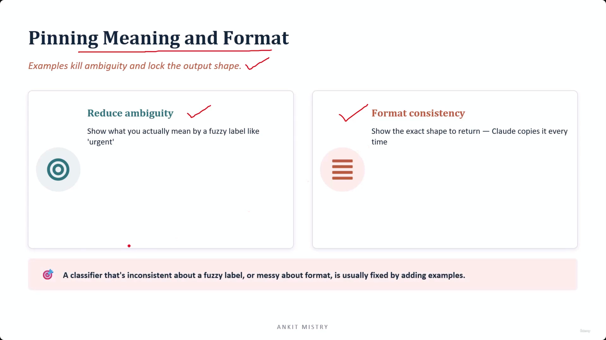
[00:05:10](https://www.udemy.com/course/claude-ai-certification/learn/lecture/57493847#overview)

#### Format Consistency

- The second job of examples is to **lock the output shape**
    - **[The Method]** Instead of describing the shape you want, show the model one example in that exact shape
    - **[The Result]** The model (e.g., Claude) copies the pattern every single time
    - **[The Advantage]** This makes the output significantly more reliable, consistent, and tidy

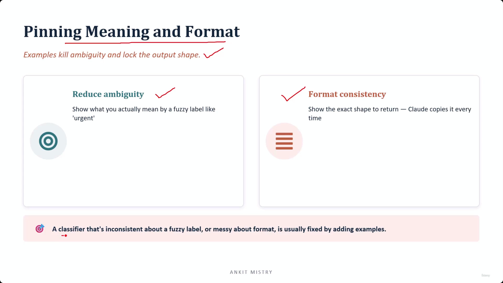
[00:05:12](https://www.udemy.com/course/claude-ai-certification/learn/lecture/57493847#overview)

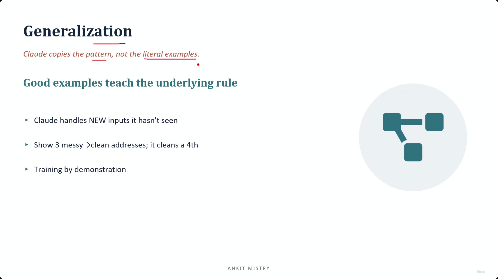
[00:05:53](https://www.udemy.com/course/claude-ai-certification/learn/lecture/57493847#overview)

### Troubleshooting Model Performance

- **[The Practical Rule]** If a classifier is inconsistent about a fuzzy label or messy about its format, the fix is usually to add examples
    - **[What to avoid]** Do not start by adding more descriptive rules
    - **[The correct first move]** Provide a few clear examples to establish the pattern

### Generalization

- Claude copies the pattern, not the literal examples
- **[How it works]** Good examples teach the underlying rule rather than just providing data points
    - This allows the model to handle NEW inputs it hasn't seen before
    - **[Example]** If you show 3 examples of cleaning messy addresses, the model learns the rule and can clean a 4th, different messy address
    - This is effectively "training by demonstration"

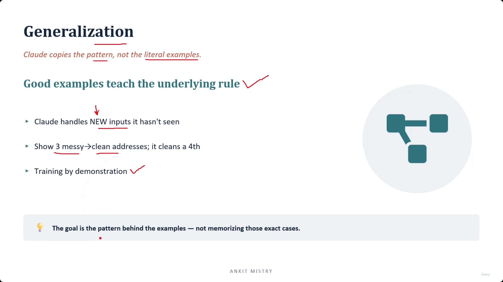
[00:06:31](https://www.udemy.com/course/claude-ai-certification/learn/lecture/57493847#overview)

### The Goal of Pattern Recognition

- Claude copies the pattern, not the literal examples
- **[The Core Principle]** Good examples teach the underlying rule
    - This allows the model to handle **NEW** inputs it hasn't seen before
    - **[Example]** Showing 3 messy addresses $\rightarrow$ clean addresses teaches the cleaning rule, so the model can clean a 4th, different address on its own
- **[Training by Demonstration]** The model isn't just repeating your specific cases; it is learning the logic behind them
- **[The Key Goal]** The objective is to establish the pattern behind the examples, not to have the model memorize those exact instances

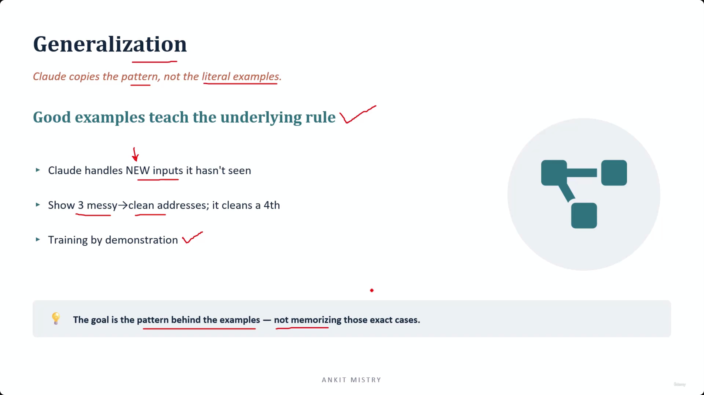
[00:06:43](https://www.udemy.com/course/claude-ai-certification/learn/lecture/57493847#overview)

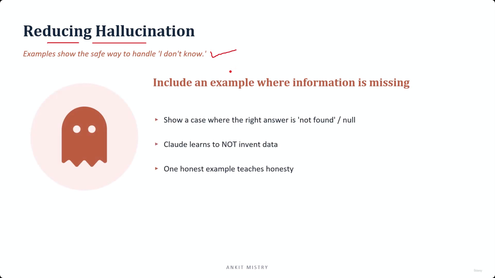
[00:07:13](https://www.udemy.com/course/claude-ai-certification/learn/lecture/57493847#overview)

### Pattern Recognition vs. Memorization

- **[The Core Principle]** Examples are not a lookup table of specific answers
    - They provide cases so the model can work out the general rule
    - The model then applies that rule to everything new

---

## Reducing Hallucination

- **[The Technique]** Show the safe way to handle "I don't know"
    - Include an example where the information is missing
    - Show a case where the right answer is `not found` or `null`
- **[The Result]** Claude learns to **NOT** invent data
- **[The Philosophy]** One honest example teaches honesty

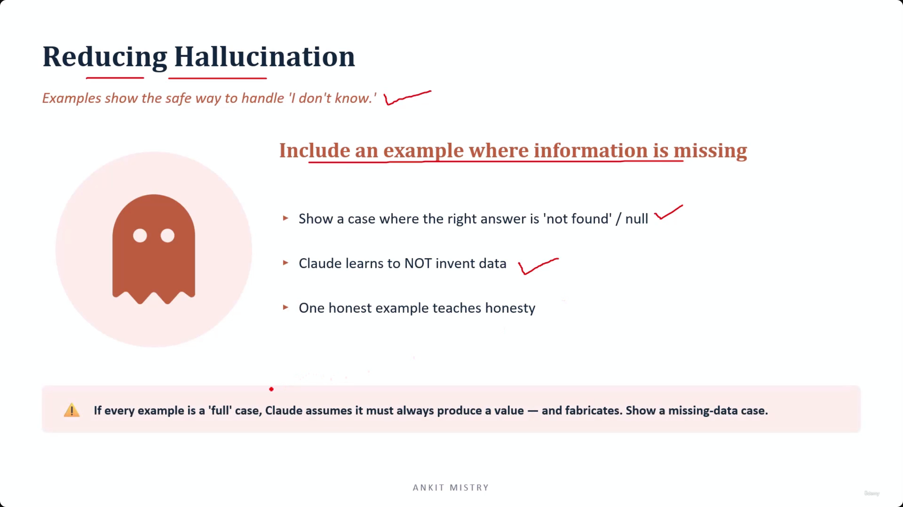
[00:07:51](https://www.udemy.com/course/claude-ai-certification/learn/lecture/57493847#overview)

## Reducing Hallucination

- **[The Technique]** Include an example where information is missing
    - Show a case where the right answer is 'not found' or 'null'
    - **[The Result]** Claude learns to **NOT** invent data
    - **[The Principle]** One honest example teaches honesty
- **[The Warning]** Avoid providing only 'full cases'
    - If every single example contains all the data, the model assumes it must always produce a value
    - This leads the model to fabricate information to satisfy the established pattern

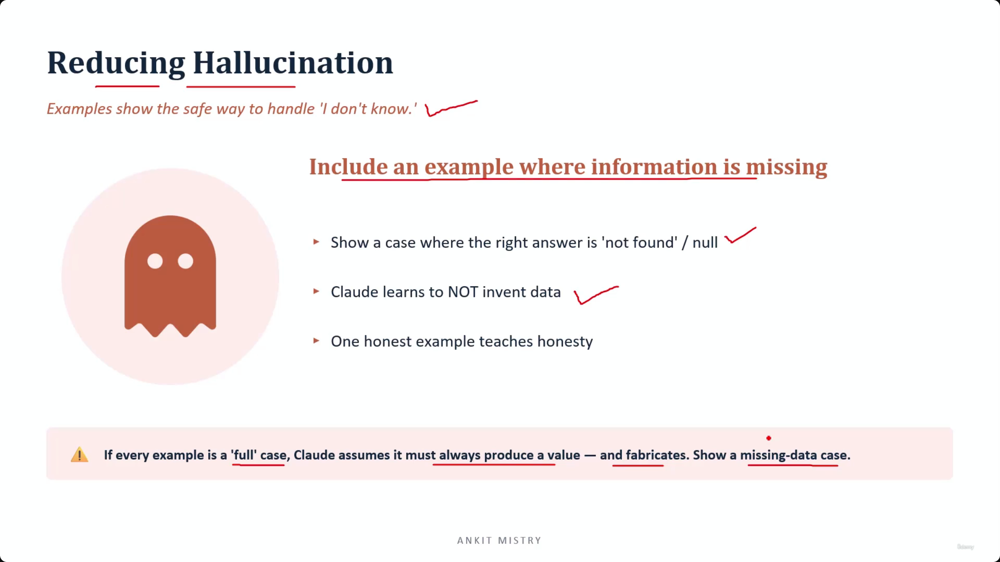
[00:08:14](https://www.udemy.com/course/claude-ai-certification/learn/lecture/57493847#overview)

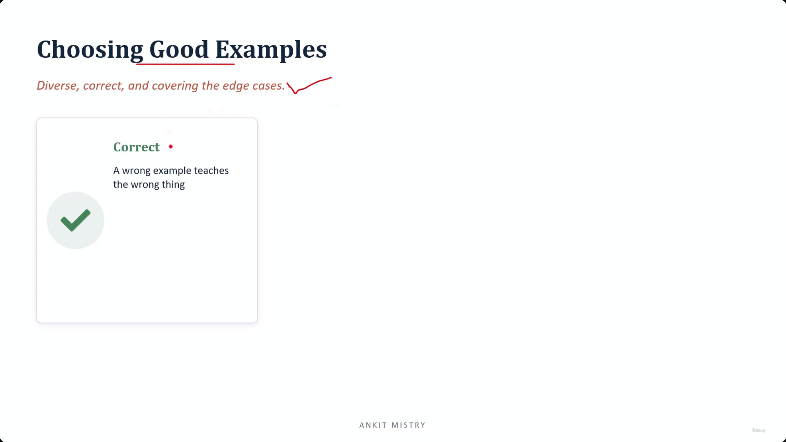
[00:08:46](https://www.udemy.com/course/claude-ai-certification/learn/lecture/57493847#overview)

## Choosing Good Examples

- Three essential qualities for effective examples:
    - Diverse
    - Correct
    - Covering edge cases

### The Importance of Correctness

- **[The Rule]** A wrong example teaches the wrong thing
    - Even an obvious error in an example can mislead the model's behavior

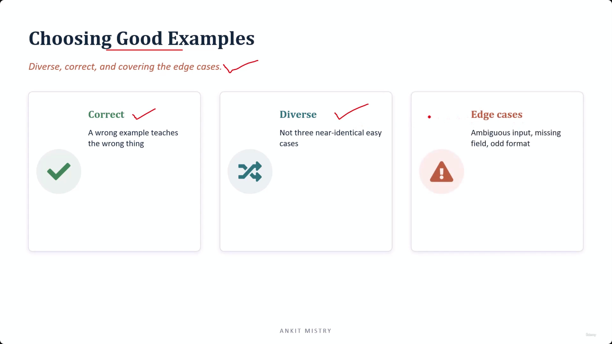
[00:09:41](https://www.udemy.com/course/claude-ai-certification/learn/lecture/57493847#overview)

### Diverse

- **[The Goal]** Avoid using three near-identical, easy cases
    - If examples are too similar, the model only learns a narrow situation
    - **[The Strategy]** Spread examples out to cover a real range of what the model might encounter

### Edge cases

- Prepare the model for non-standard inputs
    - Ambiguous input
    - Missing fields
    - Odd formats

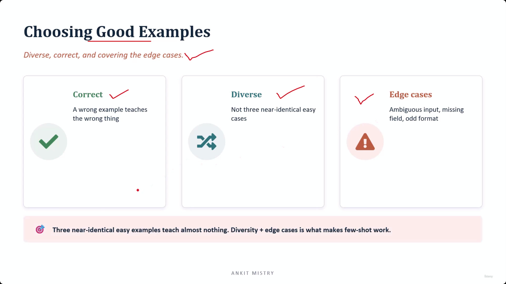
[00:10:11](https://www.udemy.com/course/claude-ai-certification/learn/lecture/57493847#overview)

### Maximizing Example Impact

- **[The Strategy]** Deliberately include "tricky" or "hard corner" examples
    - Easy cases are often handled well by the model anyway
    - Focus on the awkward, ambiguous, incomplete, or strangely formatted inputs
- **[The Key Lesson]** The true power of few-shot prompting
    - Three near-identical easy examples teach almost nothing
    - Effective prompting requires the combination of **Diversity + Edge Cases**


[00:10:28](https://www.udemy.com/course/claude-ai-certification/learn/lecture/57493847#overview)

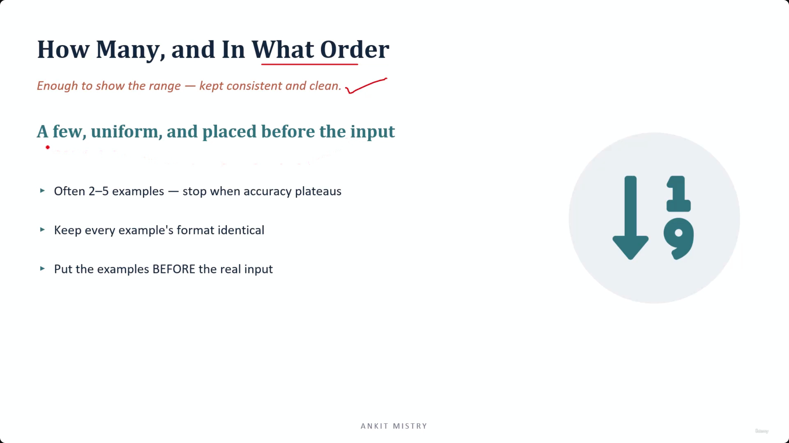
[00:10:59](https://www.udemy.com/course/claude-ai-certification/learn/lecture/57493847#overview)

## How Many, and In What Order

- **[The Recipe]** Enough to show the range — kept consistent and clean
- **[The Three-Part Rule]**
    - Use a few examples
    - Keep them uniform in style
    - Place them **BEFORE** the real input
- **[Practical Guidelines]**
    - Often 2–5 examples is the sweet spot
    - **[When to stop?]** Stop adding examples when accuracy plateaus (stops improving)
    - Keep every example's format identical to maintain consistency

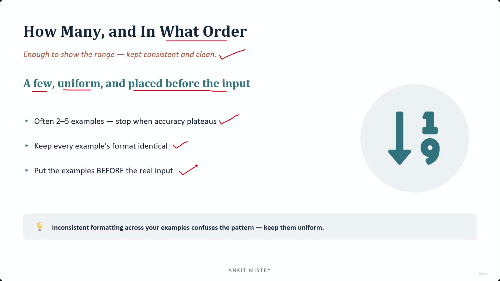
[00:11:32](https://www.udemy.com/course/claude-ai-certification/learn/lecture/57493847#overview)

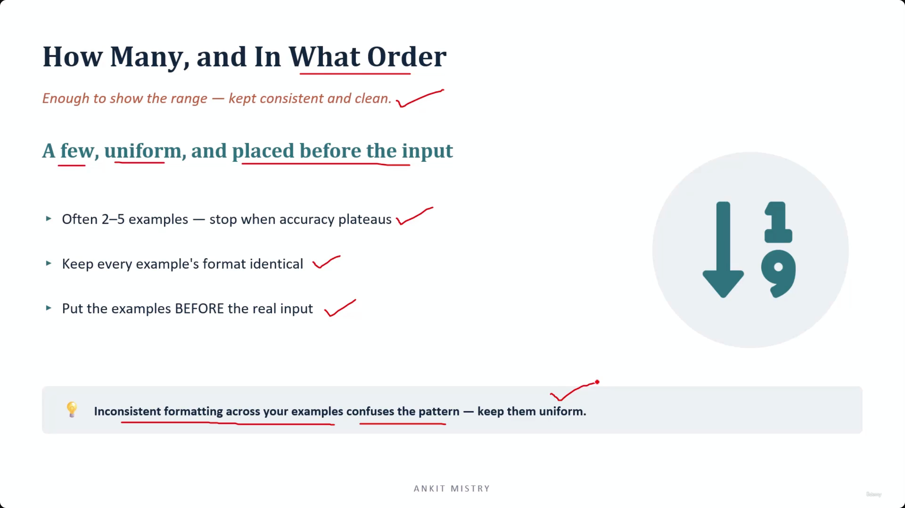
[00:11:58](https://www.udemy.com/course/claude-ai-certification/learn/lecture/57493847#overview)

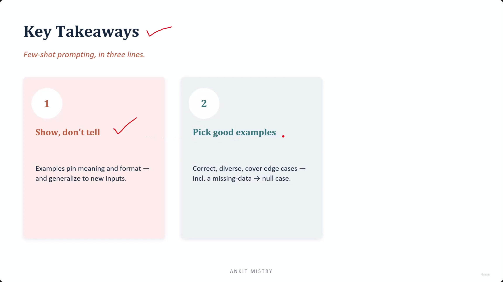
[00:12:26](https://www.udemy.com/course/claude-ai-certification/learn/lecture/57493847#overview)

## Key Takeaways: Few-Shot Prompting

### 1. Show, Don't Tell

- Use examples to pin down both meaning and format
- Examples allow the model to generalize to new, unseen inputs
- **[Pro-tip]** One good example is often more powerful than a whole paragraph of descriptive rules

### 2. Pick Good Examples

- **[The Three Qualities]**
    - **Correct**: Avoid teaching the wrong patterns with erroneous examples
    - **Diverse**: Avoid near-identical cases; spread examples across a real range of scenarios
    - **Cover Edge Cases**: Include missing data, null cases, or ambiguous inputs to prepare the model for the "hard corner" scenarios

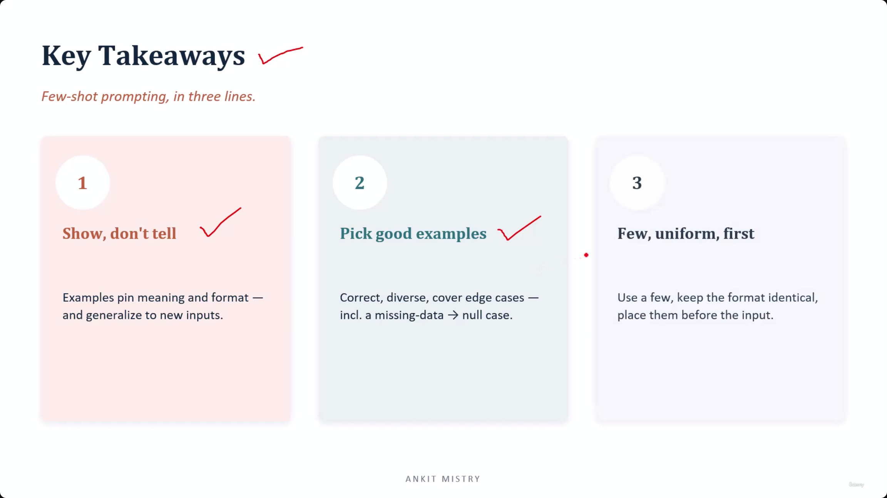
[00:12:45](https://www.udemy.com/course/claude-ai-certification/learn/lecture/57493847#overview)

---

## Simple Explanation (with Claude Examples)

**The core idea, in one line**: Instead of describing what you want in a paragraph, show Claude a few examples of the exact input → output pattern, and it copies that pattern.

**Zero/one/few-shot — just means "how many examples"**

*Claude Code example — actual prompt and output:*
```
Zero-shot prompt: "Extract the urgency from: 'My account got locked, please help ASAP.'"
Output: {"urgency": "high"}   ← reasonable, but Claude guessed what "urgency" means here
```
```
Few-shot prompt (3 examples shown first, defining critical/low/medium)
Then: "My account got locked, please help ASAP."
Output: {"urgency": "critical"}   ← now grounded in real reference points, more consistent
```

**Why examples beat a wall of rules**

Like teaching someone to fold a shirt — showing once beats three paragraphs of angle descriptions. Examples pin down both *meaning* (what "urgent" means here) and *format* (the exact JSON shape), which is nearly impossible to fully specify in words alone.

**Generalization — Claude learns the rule, not the examples**

Show 3 examples of cleaning messy addresses, and Claude applies the same cleaning logic to a 4th, never-seen address on its own — it learned the pattern, not a lookup table.

**Reducing hallucination**

If every example has a complete answer, Claude assumes it must *always* produce a value — so it invents data when real data is missing. Including one example where the correct answer is `null` teaches it that "not found" is an acceptable, honest answer.

*Claude Code example*: `Input: "Age unknown, name is Priya" → {"name": "Priya", "age": null}` — that one example teaches Claude it's fine to say "I don't know" instead of guessing an age.

**Choosing good examples — 3 qualities**

**Correct** (a wrong example teaches the wrong thing), **diverse** (not 3 near-identical easy cases), **covers edge cases** (deliberately include the messy, ambiguous inputs — easy cases are usually handled fine anyway).

**How many, and where**

Usually **2–5 examples**, all in the exact same format, placed **before** the real input.

**Recap in 3 lines**

1. **Show, don't tell** — one good example often beats a paragraph of rules.
2. **Pick examples that are correct, diverse, and cover edge cases** — not 3 easy near-duplicates.
3. **2–5 consistent examples before your real input** — Claude generalizes the pattern to new cases.