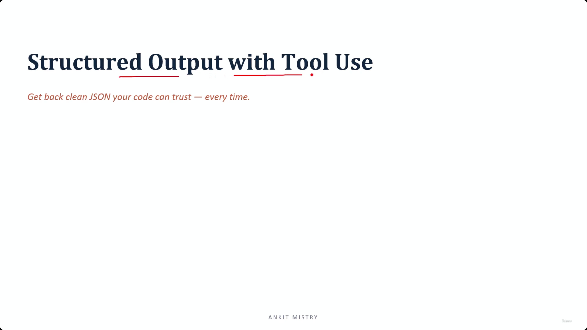
[00:00:24](https://www.udemy.com/course/claude-ai-certification/learn/lecture/57493851#overview)

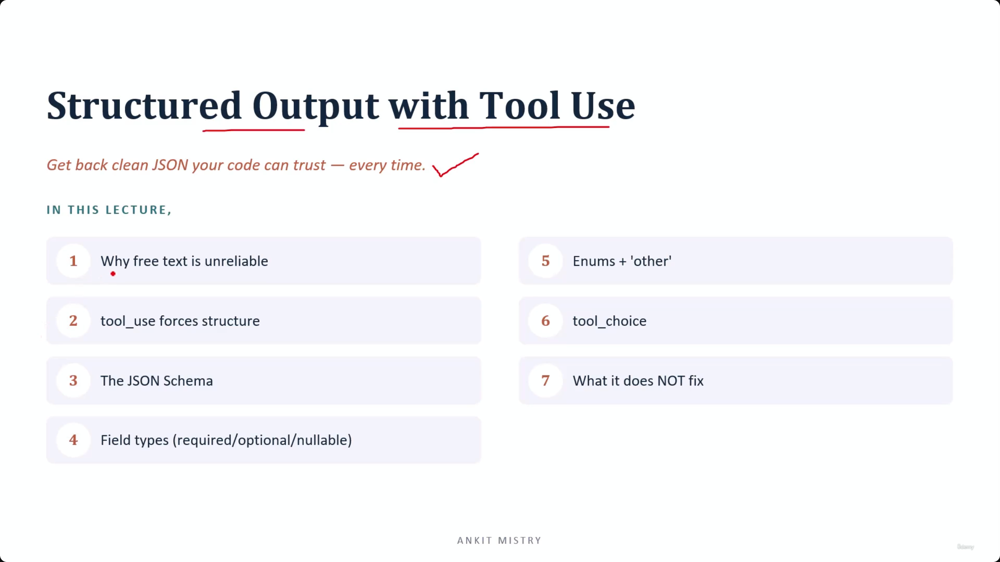
[00:00:32](https://www.udemy.com/course/claude-ai-certification/learn/lecture/57493851#overview)

## Structured Output with Tool Use

- Aim to get back clean JSON that code can trust every time
- **[Why?]** For real automation, being "reliable" isn't enough; code requires a guarantee of clean data in a fixed shape

### Lecture Overview

1. Why free text is unreliable
2. How tool use forces structure
3. The JSON Schema
4. Field types (required/optional/nullable)
5. Enums + 'other'
6. tool\_choice
7. What it does NOT fix

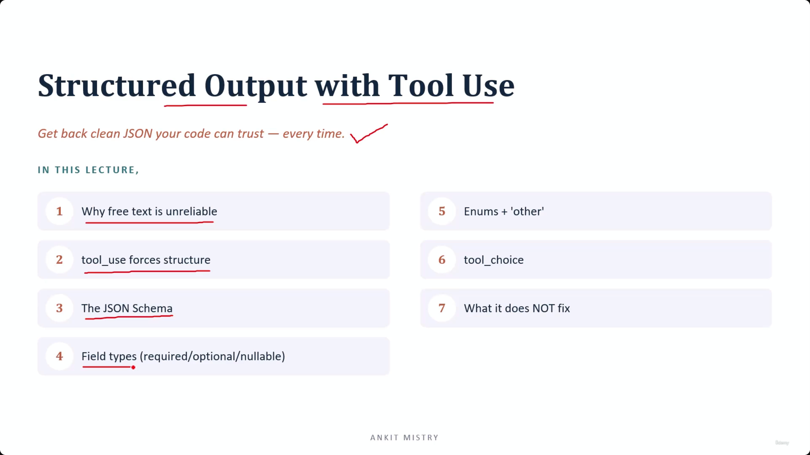
[00:00:44](https://www.udemy.com/course/claude-ai-certification/learn/lecture/57493851#overview)

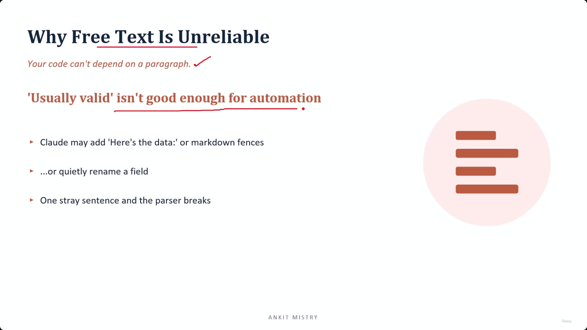
[00:01:13](https://www.udemy.com/course/claude-ai-certification/learn/lecture/57493851#overview)

### Why Free Text Is Unreliable

- **[Core Problem]** Your code cannot depend on a paragraph
    - For automation, "usually valid" is not good enough
- LLMs can introduce unexpected variations that break parsers:
    - Adding conversational filler (e.g., "Here's the data:")
    - Wrapping the output in markdown fences
    - Quietly renaming a field
    - Adding a single stray sentence that causes the parser to fail

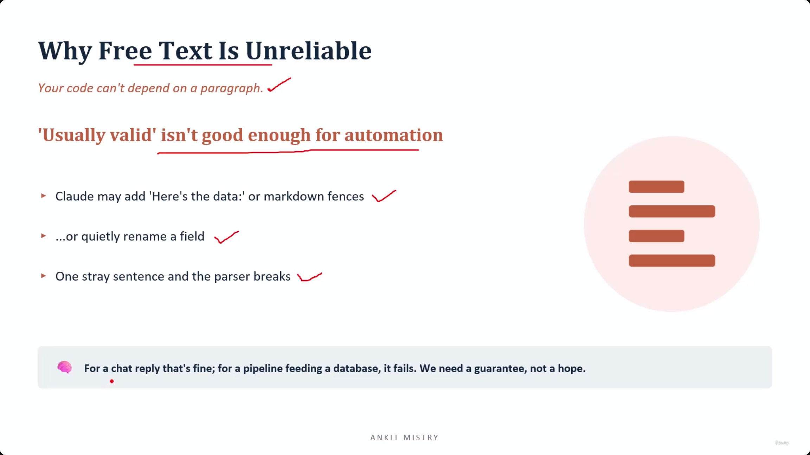
[00:01:48](https://www.udemy.com/course/claude-ai-certification/learn/lecture/57493851#overview)

### The Fragility of Automation

- **[The Core Distinction]** There is a massive difference between a human reading a reply and a program processing it
    - For a chat reply, conversational filler (like "Here's the data:") is perfectly fine
    - For an automated pipeline feeding a database, one unexpected word causes the entire process to fail
- **[Hope vs. Guarantee]**
    - Free text is a "hope": it usually works, but it is unreliable for automation
    - Automated systems require a "guarantee": they cannot run on "usually valid" data

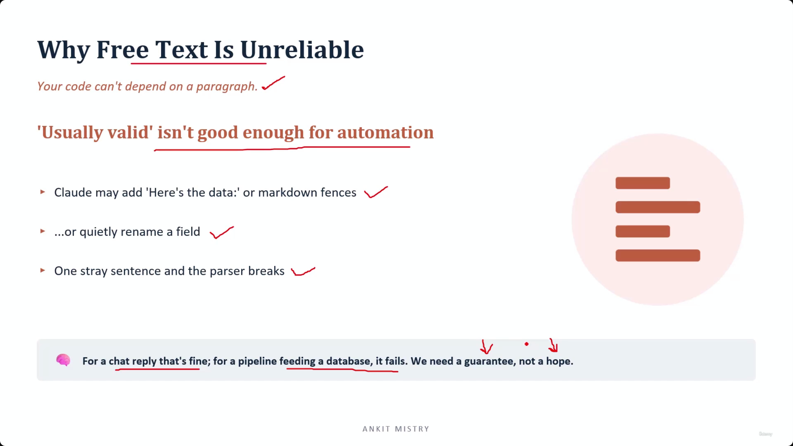
[00:02:15](https://www.udemy.com/course/claude-ai-certification/learn/lecture/57493851#overview)

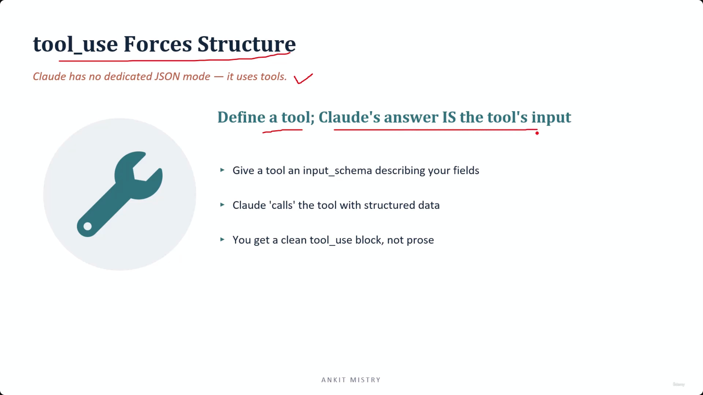
[00:02:39](https://www.udemy.com/course/claude-ai-certification/learn/lecture/57493851#overview)

### How tool\_use Forces Structure

- **[The Workaround]** Claude does not have a dedicated JSON mode
    - It uses tools to achieve structured output instead
- **[The Mechanism]** The process works by defining a tool with a specific structure
    - You provide a tool with an `input_schema` that describes your required fields
    - Claude's answer **is** the tool's input
    - Instead of generating prose, Claude "calls" the tool with structured data
- **[The Result]** You receive a clean `tool_use` block
    - This provides the structured data needed for code without the risk of conversational filler

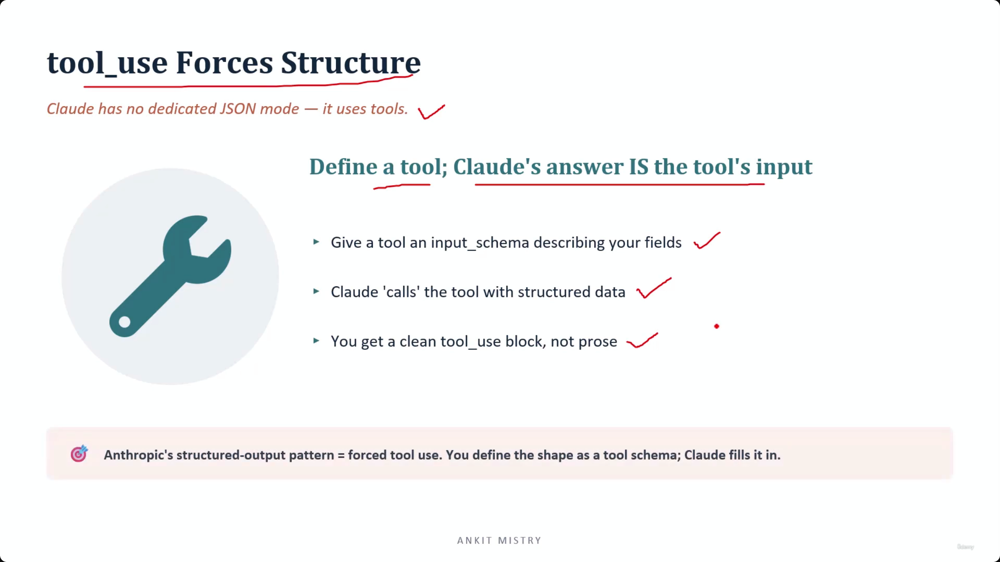
[00:03:13](https://www.udemy.com/course/claude-ai-certification/learn/lecture/57493851#overview)


[00:03:43](https://www.udemy.com/course/claude-ai-certification/learn/lecture/57493851#overview)

### Anthropic's Structured Output Pattern

- **[The Core Pattern]** Forced tool use
    - There is no special "give me JSON" button
    - Instead, you describe your desired shape as a tool schema
    - Claude is then forced to call that tool, and its answer is the tool's input
- **[Why this works]** It moves from a "hope" for valid text to a "guarantee" of structure

### The JSON Schema

- The schema acts as the blueprint for the answer

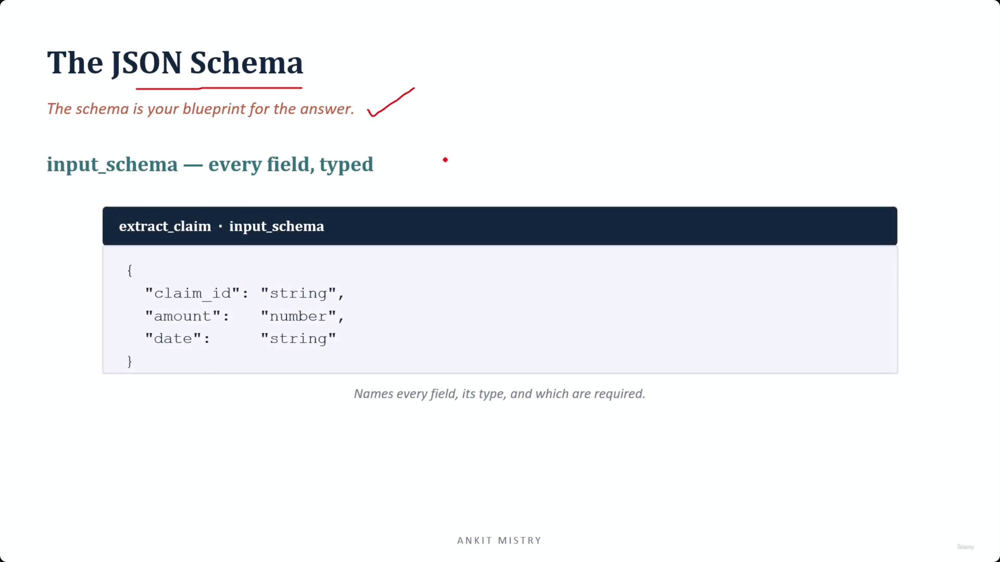
[00:03:54](https://www.udemy.com/course/claude-ai-certification/learn/lecture/57493851#overview)

#### Components of the `input_schema`

- **[Field Definition]** The schema names every specific field you expect to receive
- **[Type Enforcement]** It specifies the data type for each field (e.g., `string`, `number`)
- **[Requirement Constraints]** It identifies which fields are mandatory versus optional

#### Example: `extract_claim` Schema

To extract information from a claim, the `input_schema` might define the following structure:

```json
{
  "claim_id": "string",
  "amount": "number",
  "date": "string"
}
```

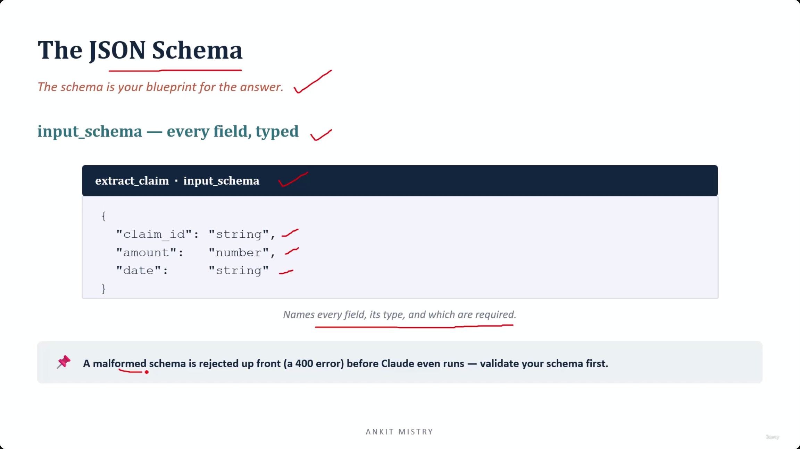
[00:04:37](https://www.udemy.com/course/claude-ai-certification/learn/lecture/57493851#overview)

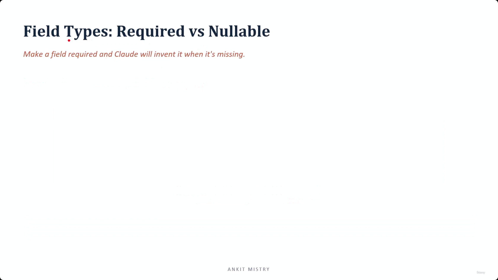
[00:05:04](https://www.udemy.com/course/claude-ai-certification/learn/lecture/57493851#overview)

#### Schema Validation

- **[Practical Tip]** Validate your schema before running Claude
    - A malformed schema is rejected upfront with a 400 error
    - This allows you to catch mistakes immediately and cheaply before spending any resources on running the model

### Field Types: Required vs Nullable

- Making a field required forces Claude to invent data when it is missing

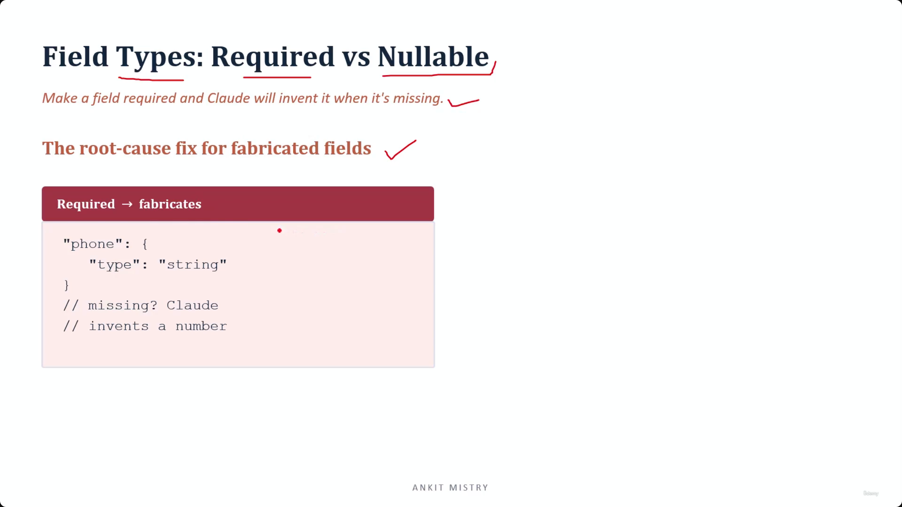
[00:05:44](https://www.udemy.com/course/claude-ai-certification/learn/lecture/57493851#overview)

### The Risk of Required Fields

- **[The Warning]** Making a field required can cause Claude to invent data when it is missing from the source
- **[The Root Cause]** This is not just a symptom to patch, but a fundamental issue with how fields are marked
- **[Case Study: Required&#32;**$\rightarrow$**&#32;Fabricates]**
    - If a field like `phone` is defined as a `string` and marked as **required**
    - But the document contains no phone number
    - Claude will invent a number to satisfy the requirement

```json
"phone": {
    "type": "string"
    // missing? Claude
    // invents a number
}
```

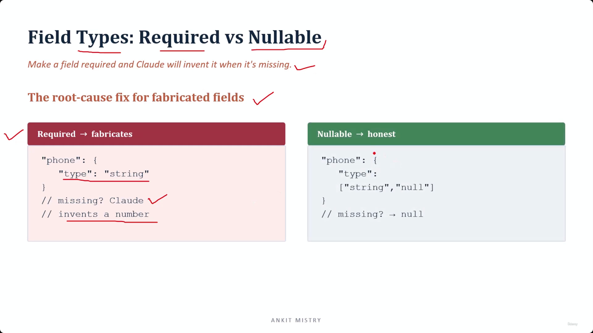
[00:06:15](https://www.udemy.com/course/claude-ai-certification/learn/lecture/57493851#overview)

#### Nullable $\rightarrow$ Honest

- **[The Solution]** Use nullable types to prevent fabrication
    - Instead of just a single type, allow the field to be `null`
    - This provides Claude with a truthful option when data is missing

| Approach | Schema Definition | Result if data is missing | Outcome |
| --- | --- | --- | --- |
| Required | "type": "string" | Claude invents a value | Fabrication |
| Nullable | "type": ["string", "null"] | Claude returns null | Honesty |

```json
// The "honest" way to handle missing data
"phone": {
    "type": ["string", "null"]
}
// missing? $\rightarrow$ null
```

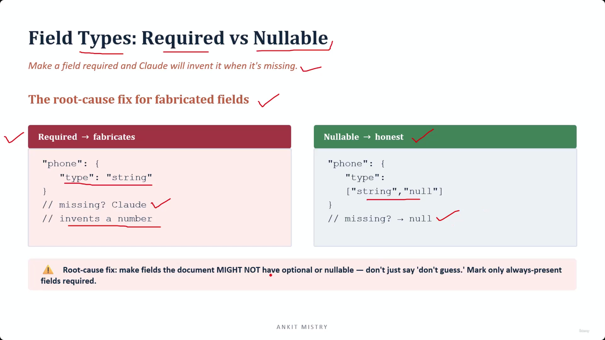
[00:06:46](https://www.udemy.com/course/claude-ai-certification/learn/lecture/57493851#overview)

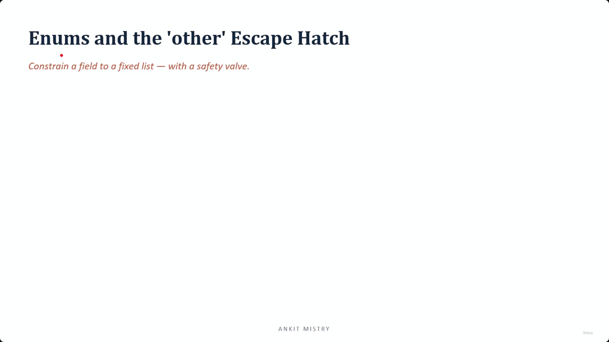
[00:07:24](https://www.udemy.com/course/claude-ai-certification/learn/lecture/57493851#overview)

### The Structural Fix for Fabrication

- **[The Right Way]** Use structural changes in the schema rather than prompting
    - Instead of adding "don't guess" to your prompt (which is a symptom patch)
    - Make any field that the document *might not* have either **optional** or **nullable**
- **[The Rule]** Only mark fields as **required** if they are guaranteed to be present in every single source document

### Enums and the 'other' Escape Hatch

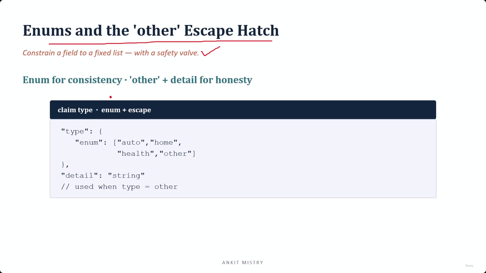
[00:07:40](https://www.udemy.com/course/claude-ai-certification/learn/lecture/57493851#overview)

### Implementing the 'Other' Escape Hatch

- **[The Concept]** Constrain a field to a fixed list while providing a "safety valve"
    - **Enum for consistency**: Ensures the model picks from a predefined set of allowed values
    - **'other' + detail for honesty**: Allows the model to capture data that doesn't fit the list without fabricating a value

#### Implementation Pattern

- Use an `enum` for the primary category
- Include `other` as one of the enum options
- Add a secondary `detail` field (string) to be used specifically when the type is `other`

```json
// claim type: enum + escape
"type": {
    "enum": ["auto", "home", "health", "other"]
},
"detail": "string" // used when type = other
```

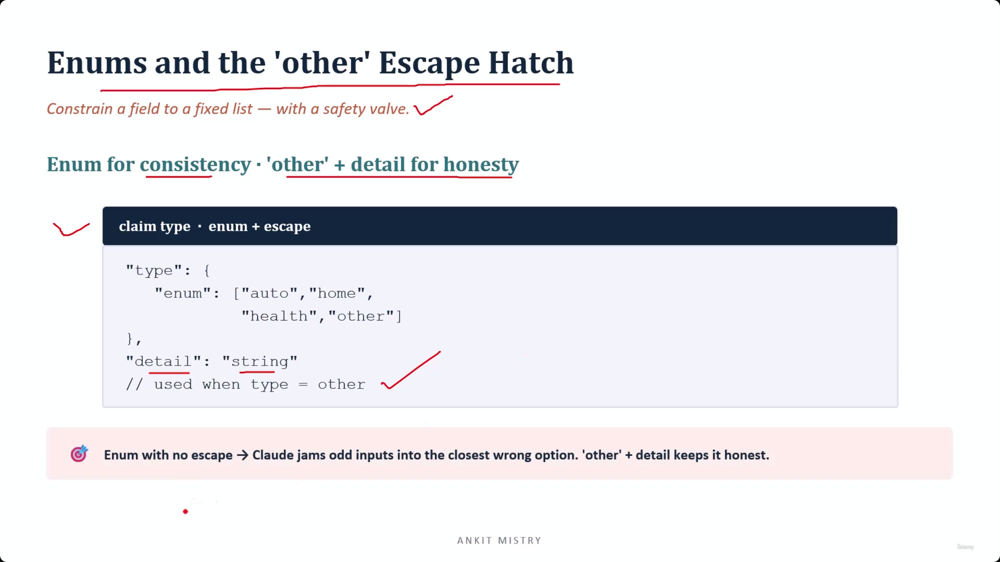
[00:08:20](https://www.udemy.com/course/claude-ai-certification/learn/lecture/57493851#overview)

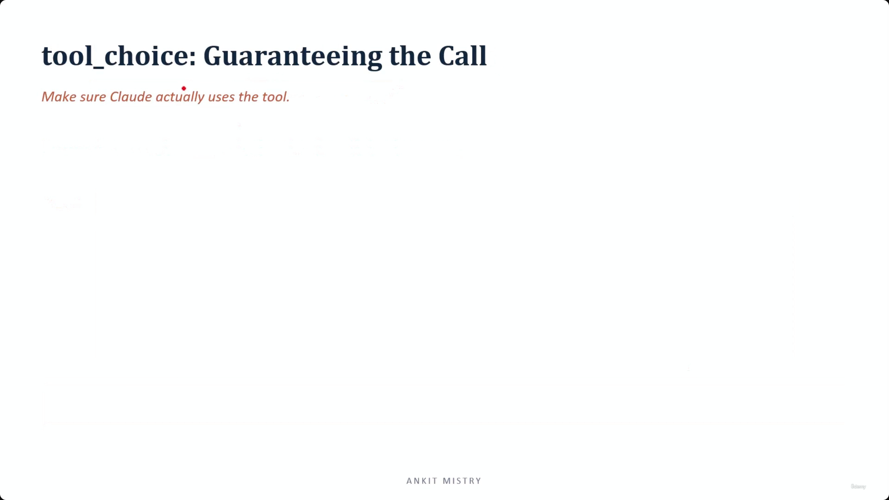
[00:08:57](https://www.udemy.com/course/claude-ai-certification/learn/lecture/57493851#overview)

### The Importance of the Escape Hatch

- **[The Problem]** An enum without an escape hatch forces Claude to "jam" an unusual input into the closest available (but incorrect) option
    - Example: If categories are only `auto`, `home`, and `health`, a claim that doesn't fit any of these will be misclassified
- **[The Solution]** The `other` + `detail` pattern maintains honesty
    - `other` provides a valid, truthful place for unusual cases to land
    - `detail` captures the specific context of what that unusual case actually was

```json
// claim type: enum + escape
"type": {
    "enum": ["auto", "home", "health", "other"]
},
"detail": "string" // used when type = other
```

---

## tool\_choice: Guaranteeing the Call

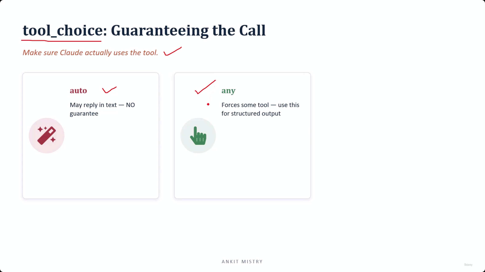
[00:09:33](https://www.udemy.com/course/claude-ai-certification/learn/lecture/57493851#overview)

## tool\_choice: Guaranteeing the Call

- **[Goal]** Ensure Claude actually uses the tool instead of just replying in text

### Comparison of tool\_choice Modes

| Mode | Behavior | Reliability for Structured Output |
| --- | --- | --- |
| auto | Claude may decide to call the tool, or it may simply reply in prose | Low (No guarantee; can wander into unstructured text) |
| any | Claude is forced to call a tool | High (Guarantees a tool call; prevents prose) |

- **[Why use&#32;`any`?]** It is the safe choice for automation because it prevents the model from "wandering off" into conversational filler or unstructured text, which is exactly what we are trying to avoid.

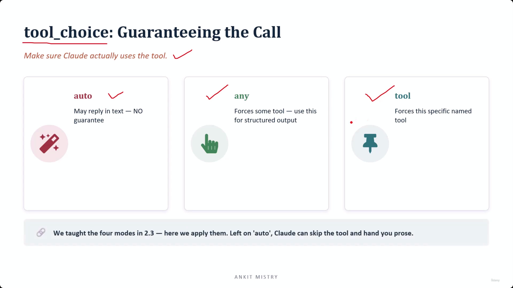
[00:10:19](https://www.udemy.com/course/claude-ai-certification/learn/lecture/57493851#overview)

### The `tool` Mode: Forcing a Specific Tool

| Mode | Behavior | Reliability for Structured Output |
| --- | --- | --- |
| auto | Claude may decide to call the tool, or it may simply reply in prose | Low (No guarantee; can wander into unstructured text) |
| any | Claude is forced to call a tool | High (Guarantees a tool call; prevents prose) |
| tool | Forces one specific named tool | Highest (Guarantees the exact tool you've specified is used) |

- **[Difference from&#32;`any`]** While `any` forces Claude to call *a* tool, it still allows the model to choose which one from a list. The `tool` mode removes that choice by naming the exact tool that must be used.
- **[When to use&#32;`tool`]** Use this mode when you have one specific extraction tool and want to guarantee that specific tool gets used, rather than letting Claude choose between multiple available tools.

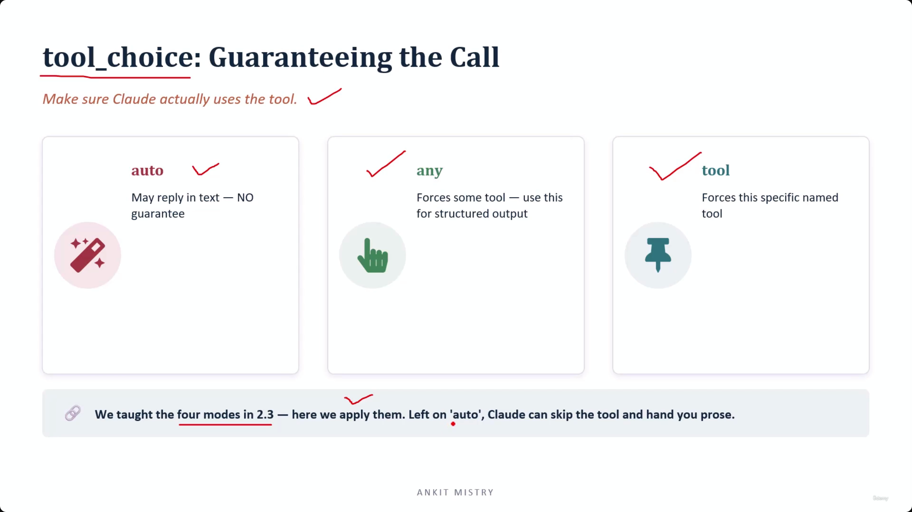
[00:10:31](https://www.udemy.com/course/claude-ai-certification/learn/lecture/57493851#overview)

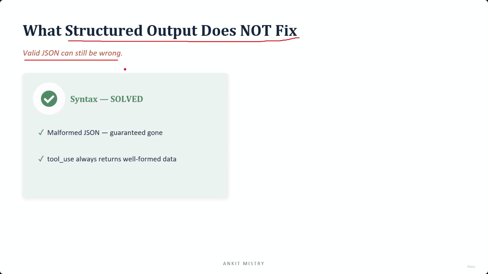
[00:11:08](https://www.udemy.com/course/claude-ai-certification/learn/lecture/57493851#overview)

### What Structured Output Does NOT Fix

- **[Warning]** Valid JSON can still be wrong
- **Syntax — SOLVED**
    - Malformed JSON is guaranteed gone
    - `tool_use` always returns well-formed data

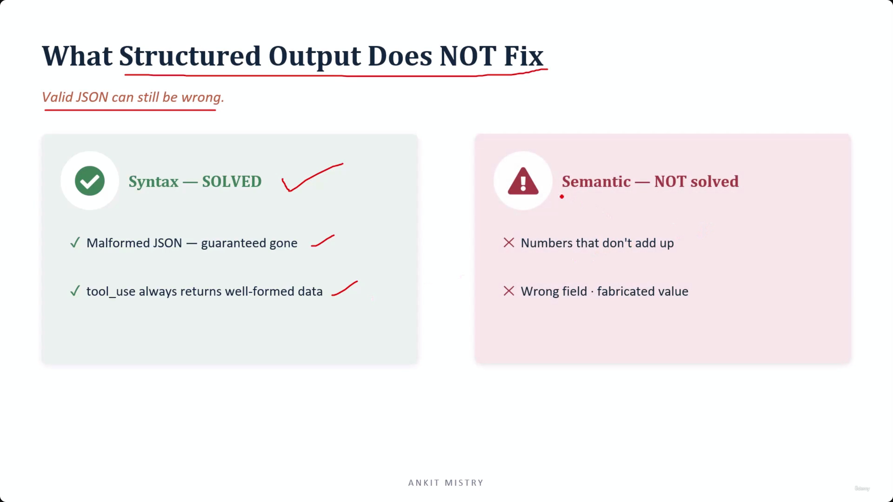
[00:11:35](https://www.udemy.com/course/claude-ai-certification/learn/lecture/57493851#overview)

### Semantic Errors: The Unsolved Problem

- **[Definition]** Semantic refers to the meaning and accuracy of the content, which structured output does not address.
- **[The Gap]** While `tool_use` guarantees the JSON syntax (the shape) is correct, it cannot guarantee that the data within that shape is truthful or logically sound.
- **Examples of semantic failures:**
    - Numbers that do not add up correctly
    - Values placed in the wrong field
    - Fabricated or hallucinated values

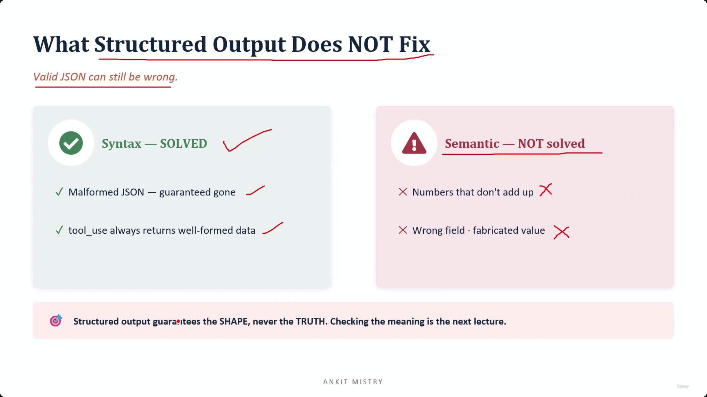
[00:12:07](https://www.udemy.com/course/claude-ai-certification/learn/lecture/57493851#overview)

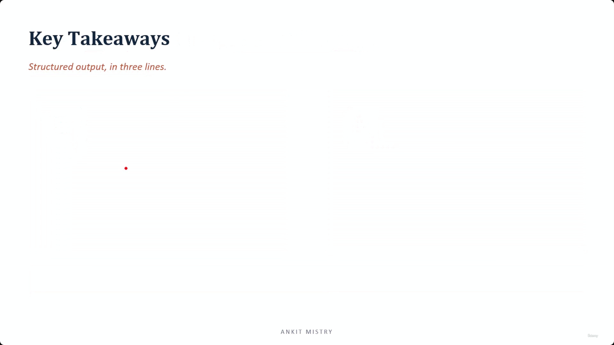
[00:12:41](https://www.udemy.com/course/claude-ai-certification/learn/lecture/57493851#overview)

### Summary of Structured Output

- **Syntax vs. Semantics**: Structured output ensures the JSON is well-formed (the shape), but it does not ensure the data is accurate (the truth).
- **The Core Misconception**: A valid JSON structure does not guarantee that the values within it are correct or truthful.

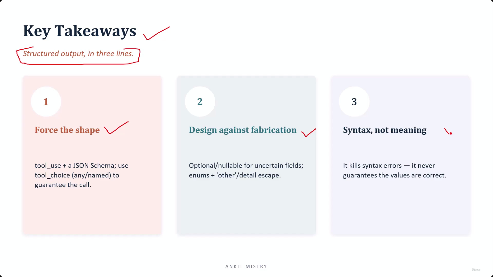
[00:13:30](https://www.udemy.com/course/claude-ai-certification/learn/lecture/57493851#overview)

## Key Takeaways

### Structured Output in Three Lines

1. **Force the shape**

    - Use `tool_use` combined with a JSON Schema
    - Use `tool_choice` (either `any` or a specific named tool) to guarantee the call
    - **[Crucial Note]** There is no native "JSON mode"; you must force the shape through the tool mechanism

2. **Design against fabrication**

    - Make uncertain fields either optional or nullable
    - Use enums with an "other" + detail escape hatch
    - **[Root Cause Fix]** Preventing invented data is a structural solution handled in the schema definition, not through pleas in the prompt

3. **Syntax, not meaning**

    - Structured output guarantees the syntax (the shape) is correct, but it does not guarantee the semantic accuracy (the truth) of the data


[00:13:32](https://www.udemy.com/course/claude-ai-certification/learn/lecture/57493851#overview)

## Key Takeaways: Structured Output

### 1. Force the Shape

- Use `tool_use` combined with a JSON Schema
- Use `tool_choice` (set to `any` or a specific named tool) to guarantee the call
- **[Note]** Since there is no native "JSON mode," you must force the shape through a tool

### 2. Design Against Fabrication

- Address the root cause of invented data through structural schema design
- Make uncertain fields `optional` or `nullable`
- Use `enums` with an `'other'` category and a `detail` escape hatch

### 3. Syntax, Not Meaning

- Structured output kills syntax errors (the shape is guaranteed)
- It does **not** guarantee the values are correct (the truth is not guaranteed)
- **[Crucial distinction]** Valid JSON can still be wrong

---

## Simple Explanation (with Claude Examples)

**The core idea, in one line**: If your code needs to trust Claude's answer 100% of the time, don't ask for a text reply — force Claude to fill out a "form" with an exact shape, using tool use.

**The problem with plain text**

```
Prompt: "Extract the claim ID, amount, and date."
Output: "Sure! Here's the data: Claim ID: CLM-2291, Amount: $450..."
```
A script parsing this has to survive "Sure! Here's the data:" and inconsistent formatting — one stray sentence breaks automation.

**The fix — a tool schema instead of a sentence**

```
Tool schema: { "claim_id": "string", "amount": "number", "date": "string" }
Claude's response (tool_use block): { "claim_id": "CLM-2291", "amount": 450, "date": "2026-03-03" }
```
No filler, no guessing labels — the script reads the fields directly, every time.

**The trap — "required" fields can make Claude lie**

```
Schema: "phone": { "type": "string" }   // required, but document has no phone number
Output: "phone": "555-0100"   ← invented out of thin air
```
Fix: allow `null` as an honest answer — `"type": ["string", "null"]` → `"phone": null` instead of a fabrication.

**Enums need an escape hatch**

```
Schema: "type": { "enum": ["auto", "home", "health"] }
Document describes a boat claim → forced into the wrong category: "auto"
```
Fix: add `"other"` plus a free-text `"detail"` field, so unusual cases have an honest place to land instead of being jammed into the nearest wrong option.

**`tool_choice` — making sure the tool actually gets used**

| Setting | Behavior |
|---|---|
| `auto` | Claude may call the tool, or reply in prose — no guarantee |
| `any` | Forced to call *some* tool |
| `tool` (named) | Forced to call *that exact* tool — strictest |

**What this does NOT fix**

Forcing a shape guarantees valid JSON — it says nothing about whether the *values* are true. `{"amount": 45000}` is perfectly valid JSON even if the real amount was $450.

**Recap in 3 lines**

1. **Force the shape with `tool_use` + a JSON schema** — no native "JSON mode" exists; this is how you get structure.
2. **Design against fabrication in the schema** — nullable/optional fields, and an `other` + `detail` escape hatch for enums.
3. **Syntax ≠ meaning** — valid JSON guarantees shape, never guarantees the data inside it is correct.

---

## Exam Objective Note: CCAR-F 4.3 — Structured Output with Tool Use

**Two separate things get tested together**

What the structure *is* — fixed by the schema. Whether a structured response happens *at all*, instead of plain text — fixed by forcing the tool call (`tool_choice`). You need both: a schema alone doesn't guarantee the tool gets called; forcing the call alone doesn't define the shape.

**The trap worth carrying in**

A required field with no way to express absence forces the model into a binary choice: break the schema, or invent a value. It invents.

**Prefilling is the old way**

Prefilling the response (seeding the assistant's reply with `{` to force JSON) was the older technique for forcing a shape — it's not where a new service should start today; use `tool_use` + a schema instead.

**Recap in 3 lines**

1. **Schema fixes the shape; forced `tool_choice` fixes whether structure happens at all** — two separate axes, often tested together.
2. **A required field with no "absent" option gets fabricated, not left blank.**
3. **Prefilling is legacy** — reach for `tool_use` and a schema in new designs.