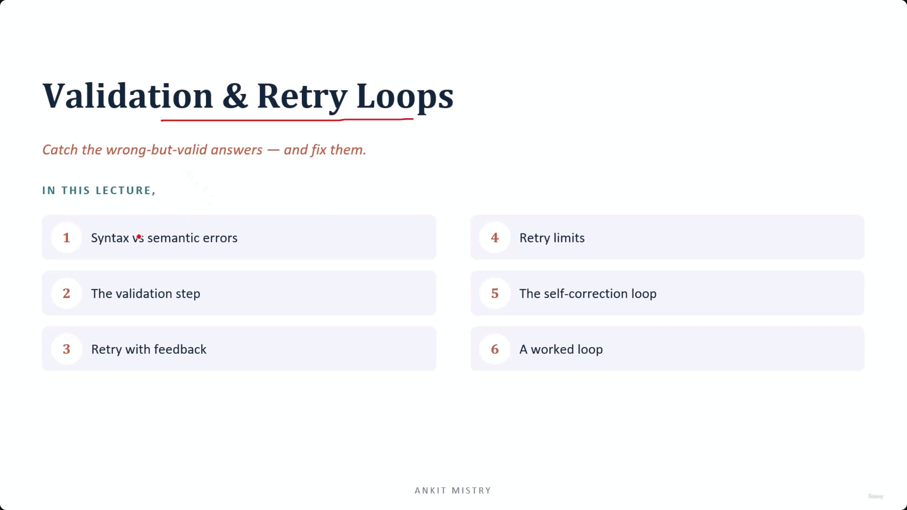
[00:00:32](https://www.udemy.com/course/claude-ai-certification/learn/lecture/57493853#overview)

## Validation & Retry Loops

- Catch the wrong-but-valid answers — and fix them.
- **[The Problem]** Valid syntax does not equal correct semantics
    - An LLM can produce a perfectly shaped JSON object where the actual data or numbers are wrong

### Lecture Overview

1. Syntax vs semantic errors
2. The validation step
3. Retry with feedback
4. Retry limits
5. The self-correction loop
6. A worked loop

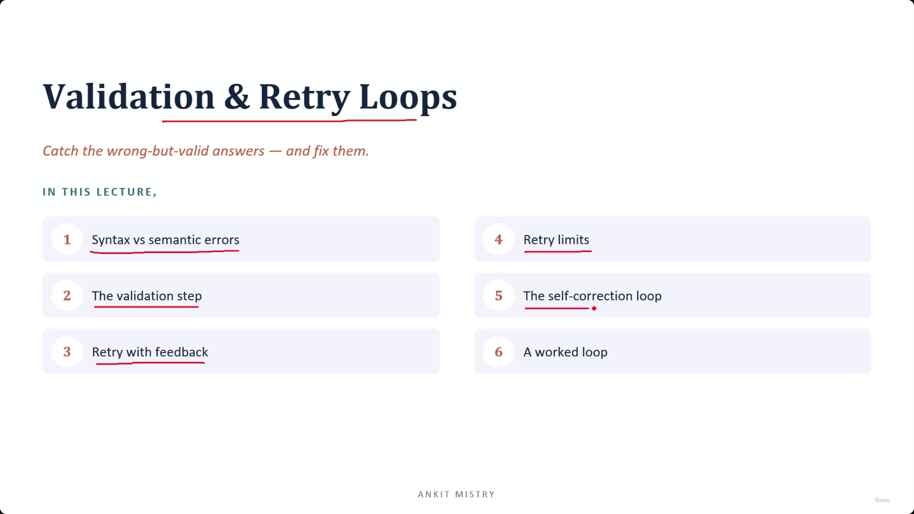
[00:00:44](https://www.udemy.com/course/claude-ai-certification/learn/lecture/57493853#overview)

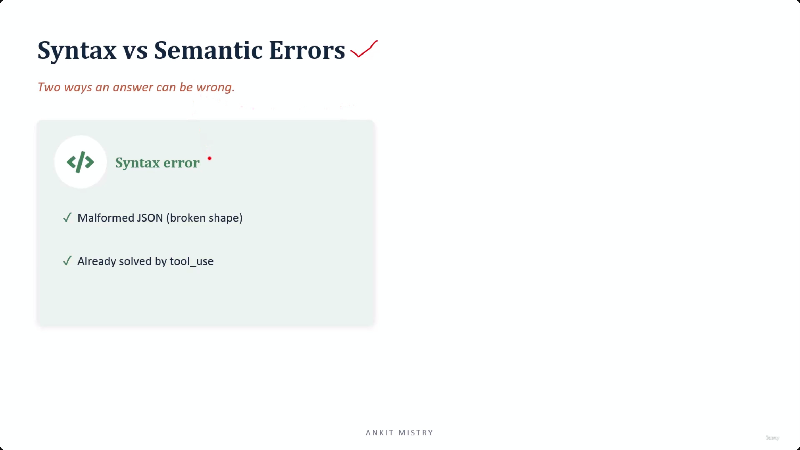
[00:01:03](https://www.udemy.com/course/claude-ai-certification/learn/lecture/57493853#overview)

### Syntax vs Semantic Errors

- There are two ways an answer can be wrong:
    - **Syntax error**: Refers to malformed JSON or a "broken shape"
        - Examples include unclosed brackets or broken fields
        - **[Status]** Already solved by using tool use, which guarantees the correct shape
    - **Semantic error**: (To be continued)

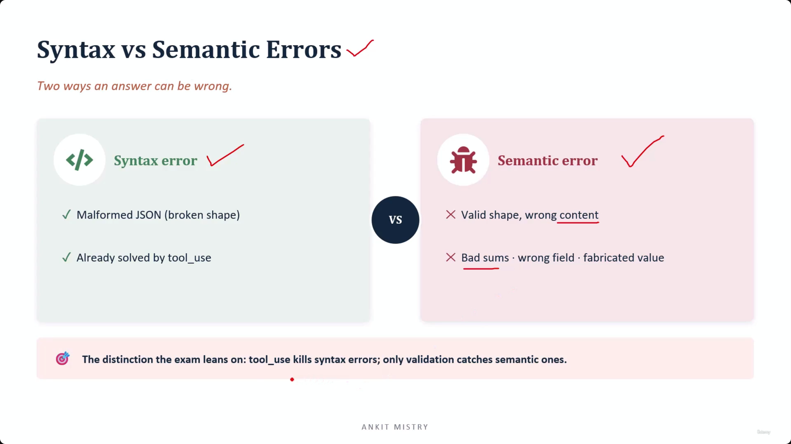
[00:02:00](https://www.udemy.com/course/claude-ai-certification/learn/lecture/57493853#overview)

### Semantic Errors

- Occur when the JSON shape is valid, but the content itself is incorrect
    - Examples include:
        - Bad sums
        - Values placed in the wrong field
        - Fabricated values
- **[The Critical Distinction]**
    - `tool_use` kills syntax errors
    - Only validation catches semantic errors

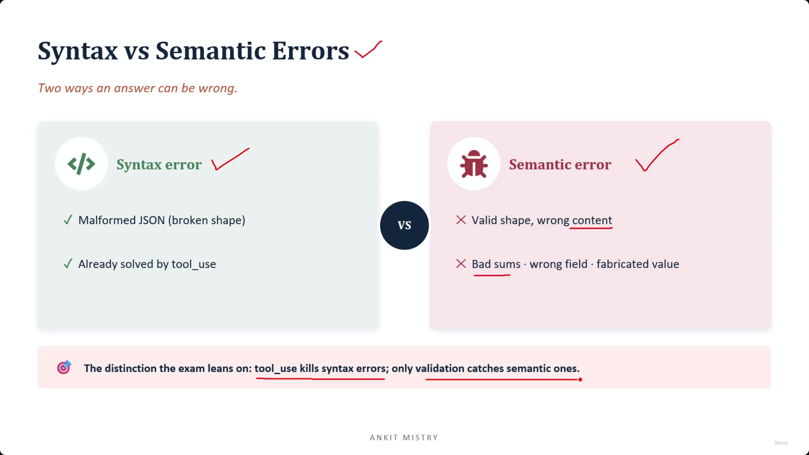
[00:02:13](https://www.udemy.com/course/claude-ai-certification/learn/lecture/57493853#overview)

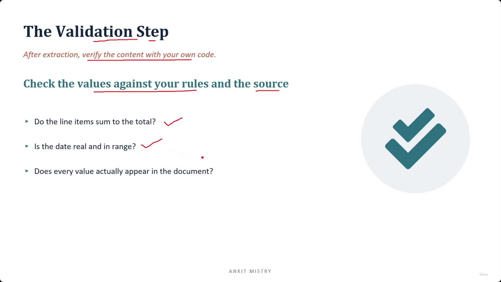
[00:02:53](https://www.udemy.com/course/claude-ai-certification/learn/lecture/57493853#overview)

### The Validation Step

- Occurs after extraction
- Involves verifying content with your own code
- **[How it works]** Check the values against your rules and against the source
    - Do the line items sum to the total?
    - Is the date real and in range?
    - Does every value actually appear in the document?

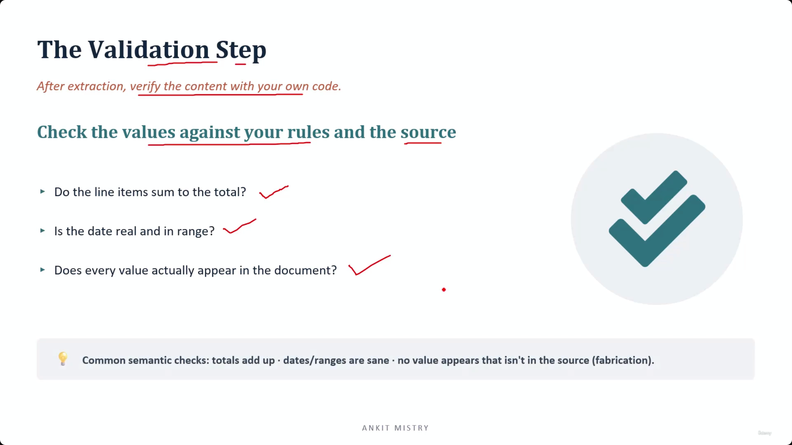
[00:03:14](https://www.udemy.com/course/claude-ai-certification/learn/lecture/57493853#overview)

### Common Semantic Checks

- These are "meaning checks" performed by your own custom code, not the LLM checking itself
- **[Core Objectives]**
    - **Arithmetic**: Adding up line items to ensure they match the total
    - **Logical Sanity**: Verifying that dates and ranges make sense
    - **Fabrication Check**: Ensuring no values were invented
        - Every extracted value must actually exist in the original source
        - This prevents the LLM from reporting figures that aren't actually in the document

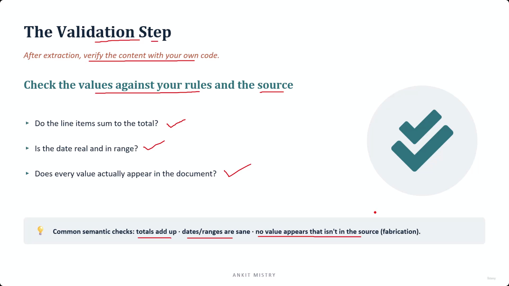
[00:03:40](https://www.udemy.com/course/claude-ai-certification/learn/lecture/57493853#overview)

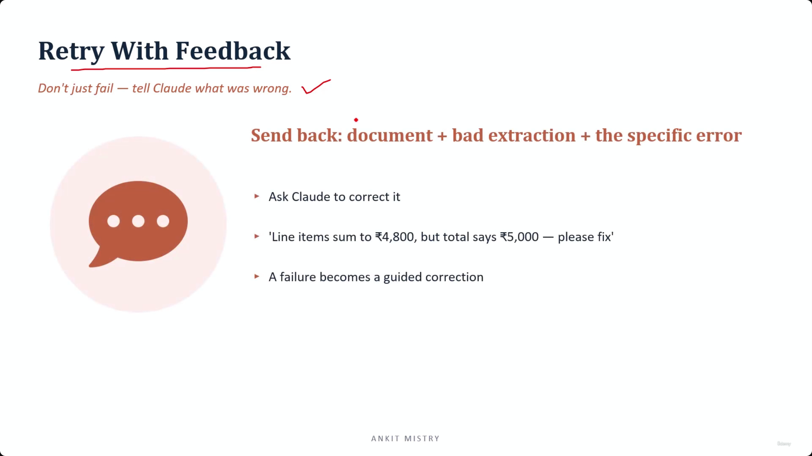
[00:03:57](https://www.udemy.com/course/claude-ai-certification/learn/lecture/57493853#overview)

### Retry With Feedback

- **[The Golden Rule]** Don't just fail — tell the LLM what was wrong
- **[How to retry]** Instead of a simple rejection, send back a package containing:
    - The original document
    - The bad extraction
    - The specific error encountered
- **[The Goal]** Turn a failure into a guided correction
    - Example feedback: "Line items sum to ₹4,800, but total says ₹5,000 — please fix"
    - This provides the LLM with the context needed to rectify its own semantic error

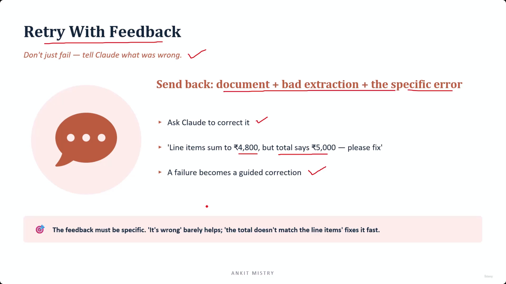
[00:04:32](https://www.udemy.com/course/claude-ai-certification/learn/lecture/57493853#overview)


[00:05:10](https://www.udemy.com/course/claude-ai-certification/learn/lecture/57493853#overview)

### The Importance of Specificity in Feedback

- **[The Key Principle]** Feedback must be precise to be effective
    - Vague feedback (e.g., "it's wrong") provides no actionable information
    - Vague feedback might cause the LLM to change the wrong thing
    - Precise feedback (e.g., "the total doesn't match the line items") allows for a fast fix
- **[The Result]** A precise error pointing at the exact mismatch tells the LLM precisely what to fix, enabling it to succeed on the very next try

### Retry Limits

- It is sensible to loop only a few times
    - After a certain point, the process should stop


[00:05:50](https://www.udemy.com/course/claude-ai-certification/learn/lecture/57493853#overview)

### Handling Retry Failures

- **[The Rule]** Loop a few times, then stop
    - Cap retries, commonly at 2 or 3 attempts
    - Each retry with feedback removes most remaining errors
- **[Escalation]** After the cap is reached, escalate the task
    - Flag the result for a human to review
    - Or mark the output as low confidence
- **[Why cap?]** To avoid infinite loops
    - No cap means an infinite loop that burns time and money on inputs the LLM may simply be unable to fix
    - If it still fails after the first few retries, the problem is likely too complex for the LLM alone

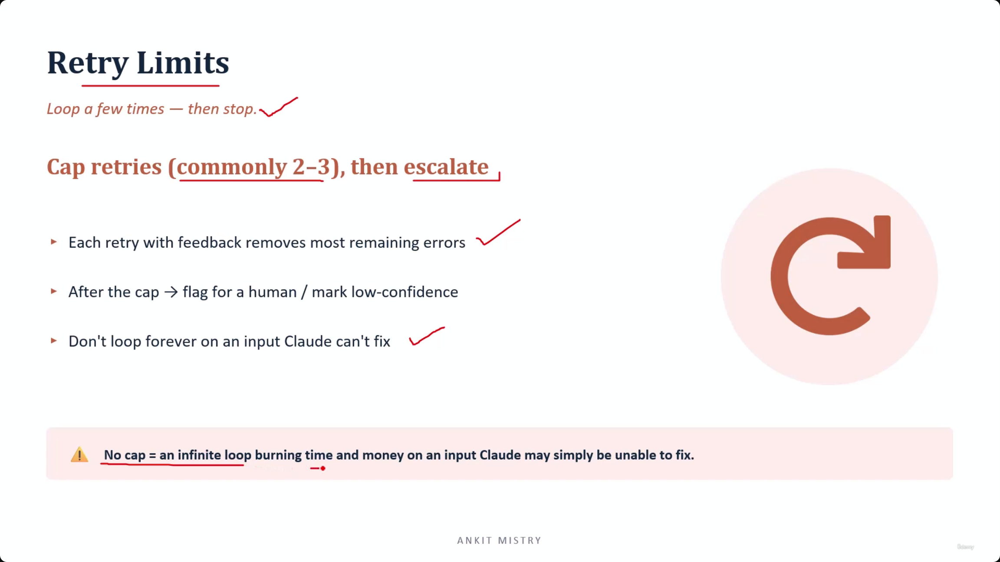
[00:05:55](https://www.udemy.com/course/claude-ai-certification/learn/lecture/57493853#overview)

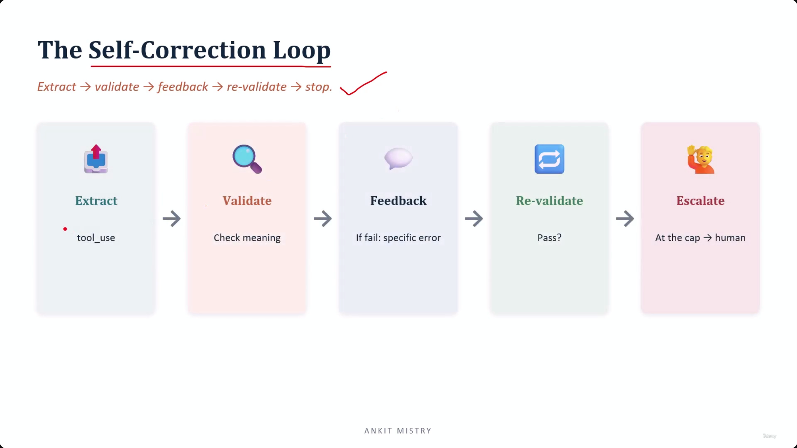
[00:06:37](https://www.udemy.com/course/claude-ai-certification/learn/lecture/57493853#overview)

### The Self-Correction Loop

- **[The Cycle]** The process follows five distinct stages in order:

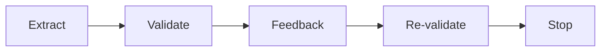
```mermaid
flowchart LR
    A[Extract] --> B[Validate]
    B --> C[Feedback]
    C --> D[Re-validate]
    D --> E[Stop]
```

- **Stage Details**:
    - **Extract**: Initial data extraction using tool use
    - **Validate**: Checking the meaning of extracted data
    - **Feedback**: If validation fails, provide a specific error
    - **Re-validate**: Checking the corrected output
    - **Escalate**: If the cap is reached, hand off to a human or mark as low confidence

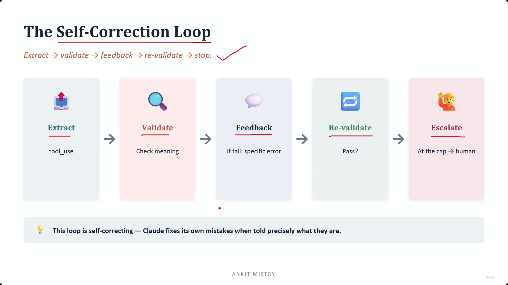
[00:07:17](https://www.udemy.com/course/claude-ai-certification/learn/lecture/57493853#overview)

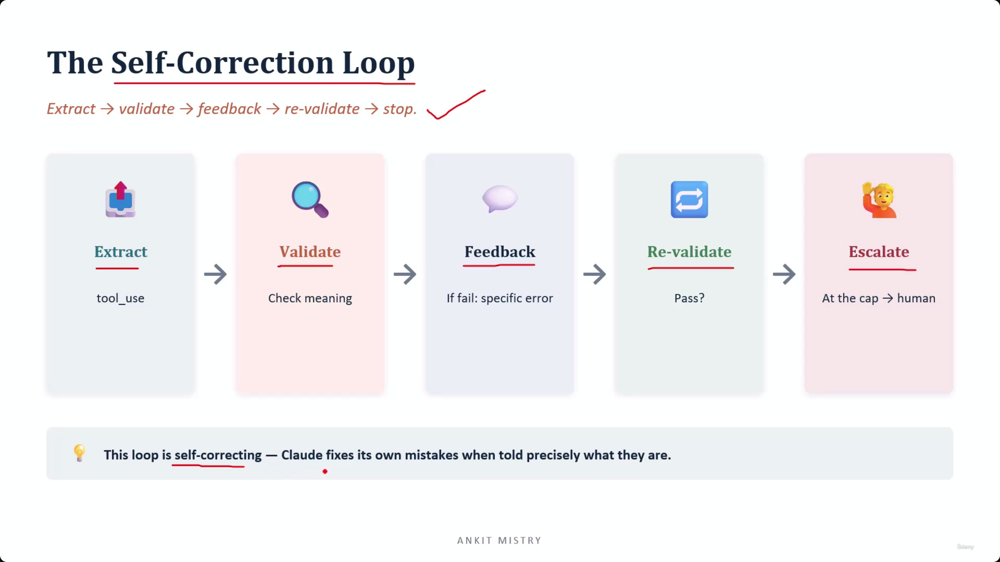
[00:07:20](https://www.udemy.com/course/claude-ai-certification/learn/lecture/57493853#overview)

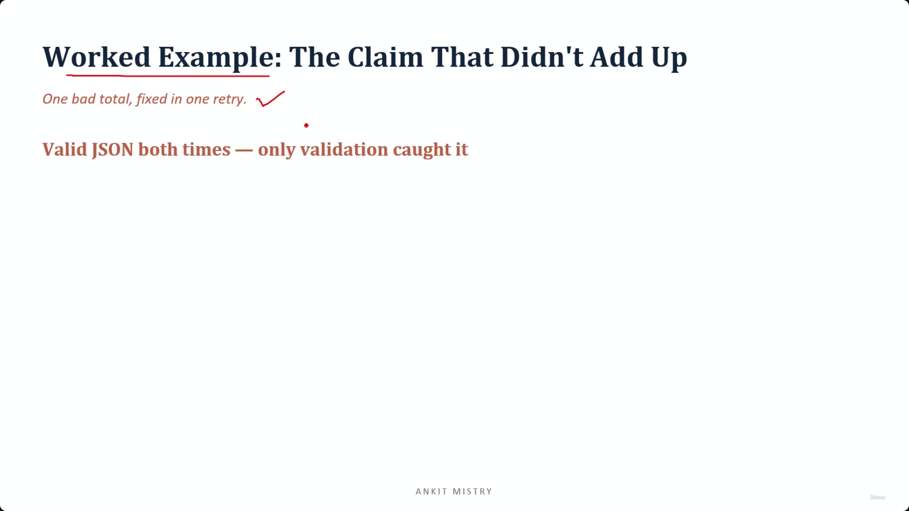
[00:08:03](https://www.udemy.com/course/claude-ai-certification/learn/lecture/57493853#overview)

### The Power of Self-Correction

- **[The Core Insight]** The loop is self-directing
    - On its own, the LLM may make a mistake
    - When given a precise description of that mistake, the LLM corrects itself
    - This creates a system that catches and mends its own errors with almost no human in the loop

### Worked Example: The Claim That Didn't Add Up

- **[Objective]** To demonstrate how one bad total can be fixed in a single retry

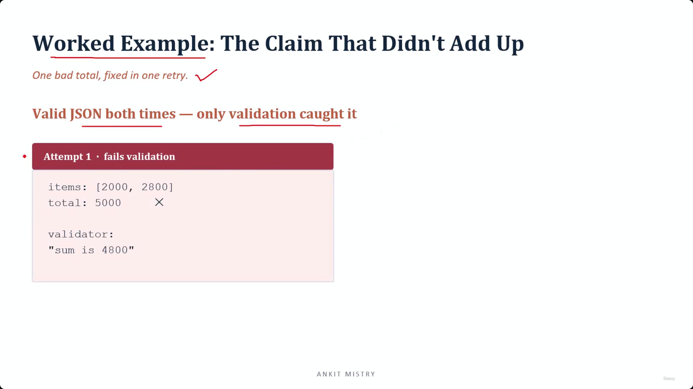
[00:08:24](https://www.udemy.com/course/claude-ai-certification/learn/lecture/57493853#overview)

### Worked Example: The Claim That Didn't Add Up

- **[Core Insight]** Valid JSON does not guarantee valid data
    - In this example, both attempts produced perfectly well-formed JSON
    - A "shape check" (syntax validation) would have allowed both attempts to pass through
    - Only the semantic validation step caught the error
- **Attempt 1: Fails Validation**
    - The extracted data contains a mathematical mismatch
    - Data:
        - `items: [2000, 2800]`
        - `total: 5000`
    - **Validator output**: "sum is 4800" (indicating the total should have been 4800, not 5000)

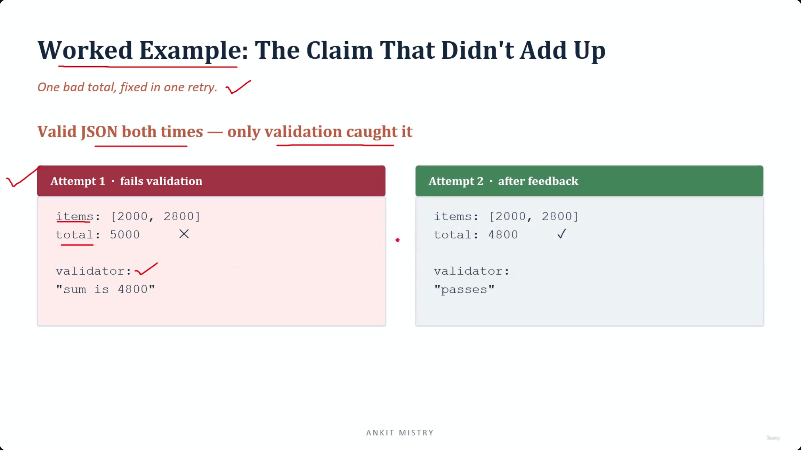
[00:08:56](https://www.udemy.com/course/claude-ai-certification/learn/lecture/57493853#overview)

#### Attempt 2: After Feedback

- **[Outcome]** The error is corrected in a single retry because the feedback was precise
- **Extracted Data**:
    - `items: [2000, 2800]`
    - `total: 4800`
- **Validator result**: "passes"

| Feature | Attempt 1 (Fails) | Attempt 2 (Success) |
| --- | --- | --- |
| JSON Syntax | Valid | Valid |
| Semantic Accuracy | Invalid (Sum mismatch) | Valid |
| Validator Output | "sum is 4800" | "passes" |

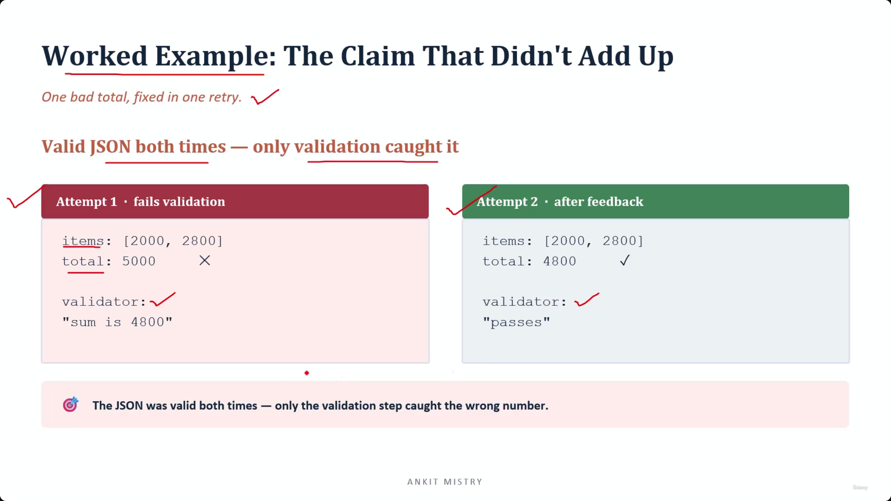
[00:09:28](https://www.udemy.com/course/claude-ai-certification/learn/lecture/57493853#overview)

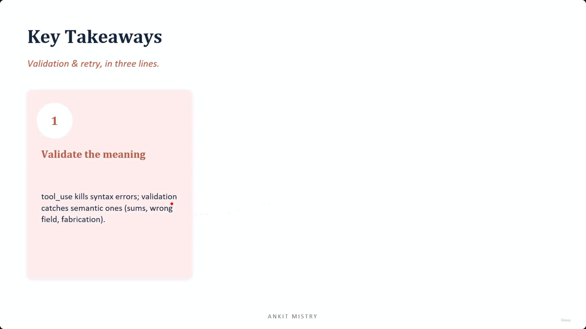
[00:10:03](https://www.udemy.com/course/claude-ai-certification/learn/lecture/57493853#overview)

### Summary: Valid Shape vs. Correct Content

- **[The Core Lesson]** A valid JSON structure does not equal valid data
    - Structured output ensures the LLM provides a "valid shape"
    - However, a valid shape can still contain incorrect content (e.g., wrong numbers)
    - The validation and retry loop is what transforms a syntactically correct but semantically wrong answer into a right one

### Key Takeaways: Validation & Retry

#### 1. Validate the Meaning

- **[The Distinction]** Tool use and syntax checks are not enough
    - Tool use is effective for killing syntax errors
    - Validation is required to catch semantic errors, such as:
        - Incorrect sums
        - Wrong fields
        - Fabrications

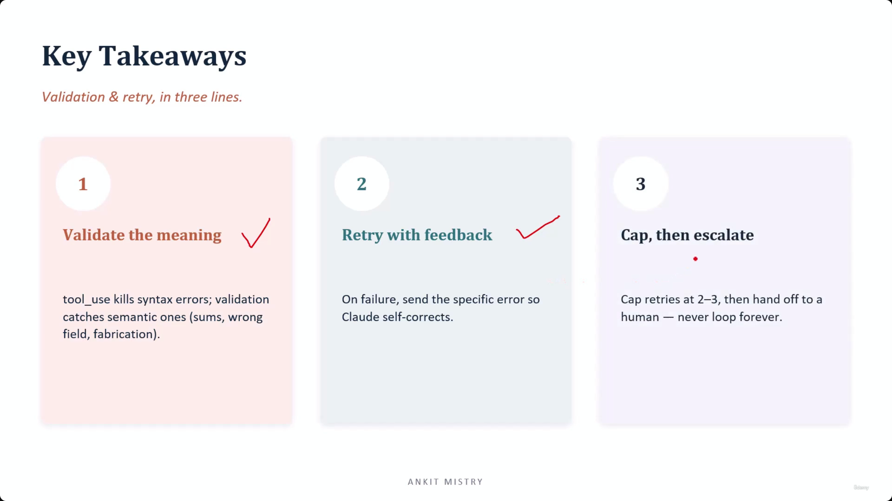
[00:10:33](https://www.udemy.com/course/claude-ai-certification/learn/lecture/57493853#overview)

#### 2. Retry with feedback

- **[The Strategy]** On failure, send the specific error message to the LLM
    - Providing precise mismatches allows the model to self-correct
    - Vague feedback (e.g., "it's wrong") is ineffective and fails to drive correction

#### 3. Cap, then escalate

- **[The Safety Mechanism]** Set a limit on the number of retries
    - Commonly capped at 2 or 3 attempts
    - If the limit is reached, hand the task off to a human
    - **[Why?]** To prevent infinite loops that waste time and money on inputs the LLM cannot resolve

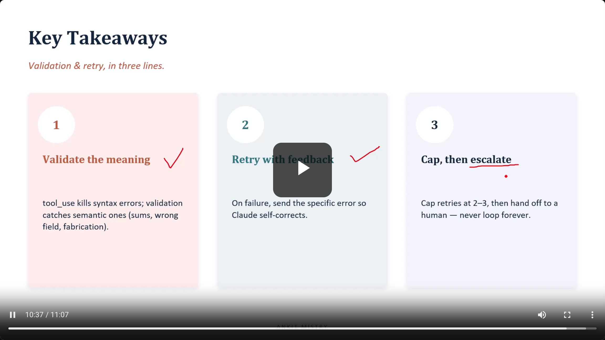
[00:10:37](https://www.udemy.com/course/claude-ai-certification/learn/lecture/57493853#overview)

---

## Simple Explanation (with Claude Examples)

**The core idea, in one line**: Getting valid JSON back doesn't mean the *numbers* are correct — validation catches wrong content, and precise feedback lets Claude fix it itself.

**Two kinds of "wrong"**

- **Syntax error** — broken shape (already solved by `tool_use`).
- **Semantic error** — perfectly valid shape, wrong content (bad math, a fabricated value). Only your own validation code catches this.

**Walking through the worked example**

```
Attempt 1: { "items": [2000, 2800], "total": 5000 }
```
Valid JSON, but 2000 + 2800 = 4800, not 5000. **Validation fails.**

```
Feedback sent back: "Line items sum to 4800, but total says 5000 — please fix."
```
Specific, not vague — Claude knows exactly what to correct.

```
Attempt 2: { "items": [2000, 2800], "total": 4800 }
```
2000 + 2800 = 4800 ✓. **Fixed in one retry**, because the feedback pointed at the exact problem.

**The full loop**

```
Extract → Validate → (fails?) → Feedback (doc + bad answer + specific error) → Re-validate → (still fails after 2-3 tries?) → Escalate to a human
```

**Why cap retries**

If a document genuinely can't be fixed, an uncapped loop burns time and money forever. Capping at 2-3 attempts: most real mistakes get fixed fast; beyond that, it's likely too hard for the model alone.

**Recap in 3 lines**

1. **Validate the meaning, not just the shape** — `tool_use` kills syntax errors; only your code catches wrong sums or fabricated values.
2. **Retry with precise feedback** — "sum is 4800, not 5000," not "this is wrong."
3. **Cap retries, then escalate** — stop after 2-3 tries and hand it to a human.

---

## Exam Objective Note: CCAR-F 4.4 — Validation, Retry, and Feedback Loops

**What a check can actually catch, and what it can't**

A basic syntax or type check will happily pass a total that doesn't match its own line items — checking "is this a number" isn't the same as checking "do these numbers add up." Catching that needs real math, done by your own code, not Claude checking its own work. Asking Claude to re-check itself often doesn't help either: whatever caused it to misread the document the first time is usually still there the second time it looks.

**Retrying blind vs. retrying with feedback**

Just resending the exact same request is like rolling the dice again — it succeeds or fails about as often as before, because nothing was actually fixed. What works is telling Claude exactly what was produced and exactly what was wrong with it — that turns a retry into a real correction.

**Claude Code example**: an extraction returns `items: [2000, 2800]` with `total: 5000` — the math is off (2000 + 2800 = 4800). Re-running the same prompt might just produce 5000 again. Sending back "line items sum to 4800, but total says 5000, please fix" gets a corrected `total: 4800` on the very next try.

**When retrying won't help**

If the schema itself is the wrong fit for the kind of documents you're feeding it, no number of retries fixes that — that's a design flaw, not noise.

**Recap in 3 lines**

1. A syntax check misses relationships between values — catch those with real math in your own code, not by having Claude check itself.
2. Resending the same request blind is just a coin flip — feedback on what was produced and what was wrong is what makes a retry actually fix something.
3. A wrong schema can't be fixed by retrying — that's a design problem, not noise.