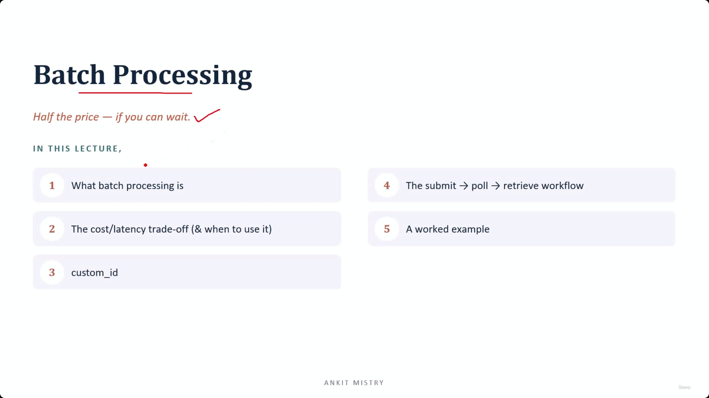
[00:00:29](https://www.udemy.com/course/claude-ai-certification/learn/lecture/57493857#overview)

## Batch Processing

- A method for processing large volumes of documents at scale
- **[The Core Trade-off]** Half the price if you can wait
    - You trade off latency (speed of response) for significant cost savings

### Lecture Overview

1. What batch processing is
2. The cost/latency trade-off (& when to use it)
3. custom\_id
4. The submit $\rightarrow$ poll $\rightarrow$ retrieve workflow
5. A worked example

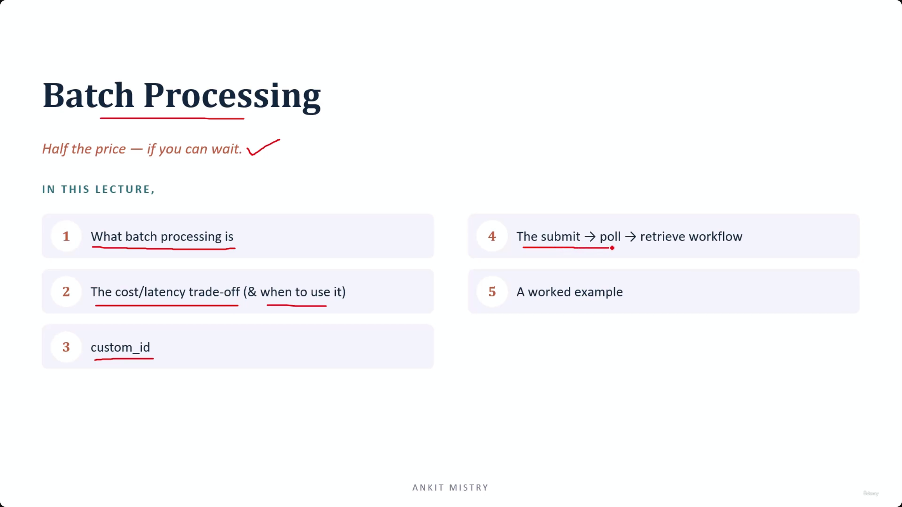
[00:00:43](https://www.udemy.com/course/claude-ai-certification/learn/lecture/57493857#overview)

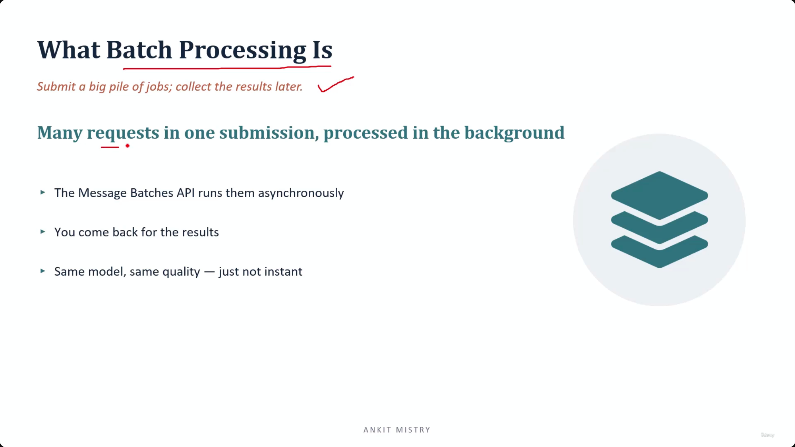
[00:01:06](https://www.udemy.com/course/claude-ai-certification/learn/lecture/57493857#overview)

### What Batch Processing Is

- Submit a big pile of jobs; collect the results later
    - Many requests are sent in one single submission
    - They are processed in the background
- The Message Batches API runs them asynchronously
    - This means they aren't processed right away, but on their own schedule
- **[Quality Assurance]** It uses the same model and provides the same quality as standard requests, it is just not instant

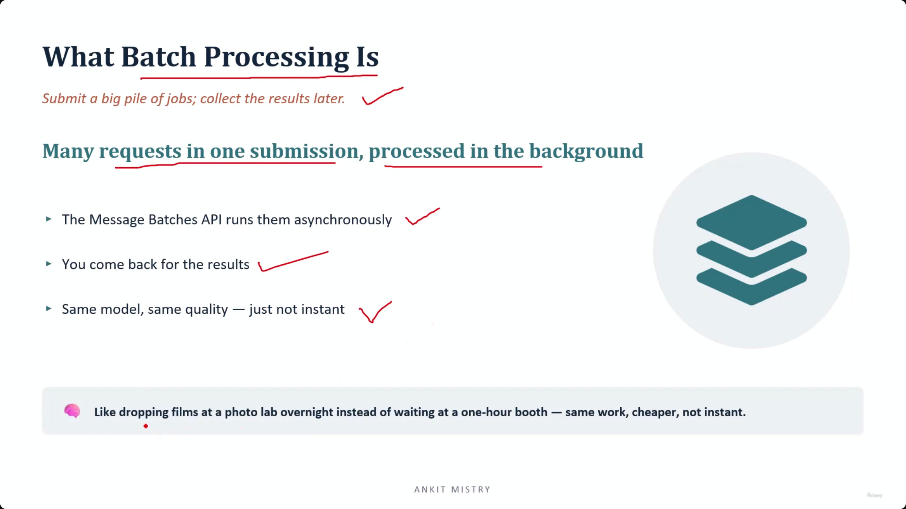
[00:01:47](https://www.udemy.com/course/claude-ai-certification/learn/lecture/57493857#overview)

### Batch Processing Workflow

- It is a "hand-over-and-walk-away" process
    - You submit a whole batch at once
    - You don't sit and wait for individual answers
    - You pick up the finished results only when they are complete
- **[The Photo Lab Analogy]**
    - **One-hour photo booth**: Fast, but you pay a premium for the speed
    - **Overnight photo lab**: Cheaper, but you have to wait
    - Both provide the same work/quality, just at different speeds and price points

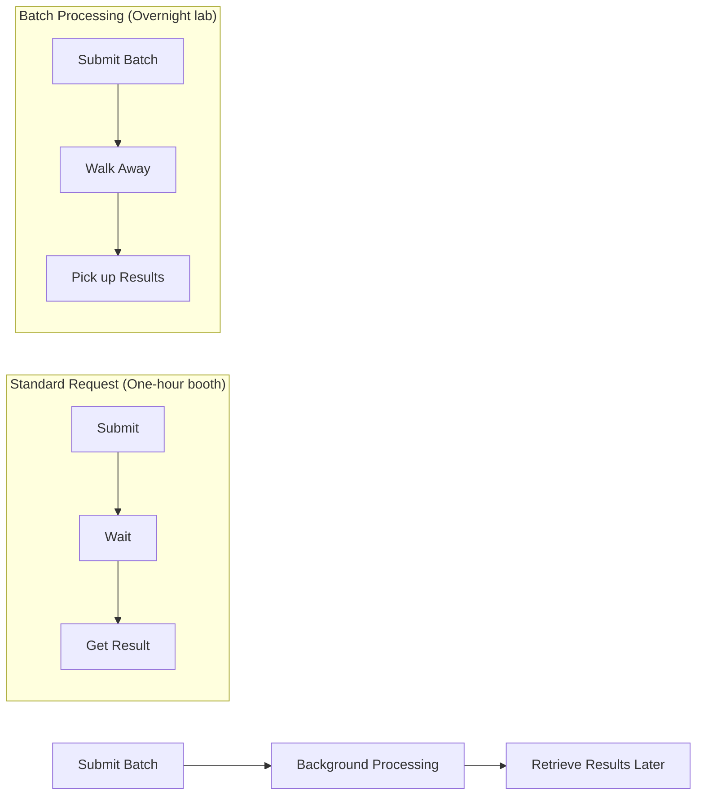
```mermaid
flowchart LR
    A[Submit Batch] --> B[Background Processing]
    B --> C[Retrieve Results Later]

    subgraph "Standard Request (One-hour booth)"
    D[Submit] --> E[Wait] --> F[Get Result]
    end

    subgraph "Batch Processing (Overnight lab)"
    G[Submit Batch] --> H[Walk Away] --> I[Pick up Results]
    end
```

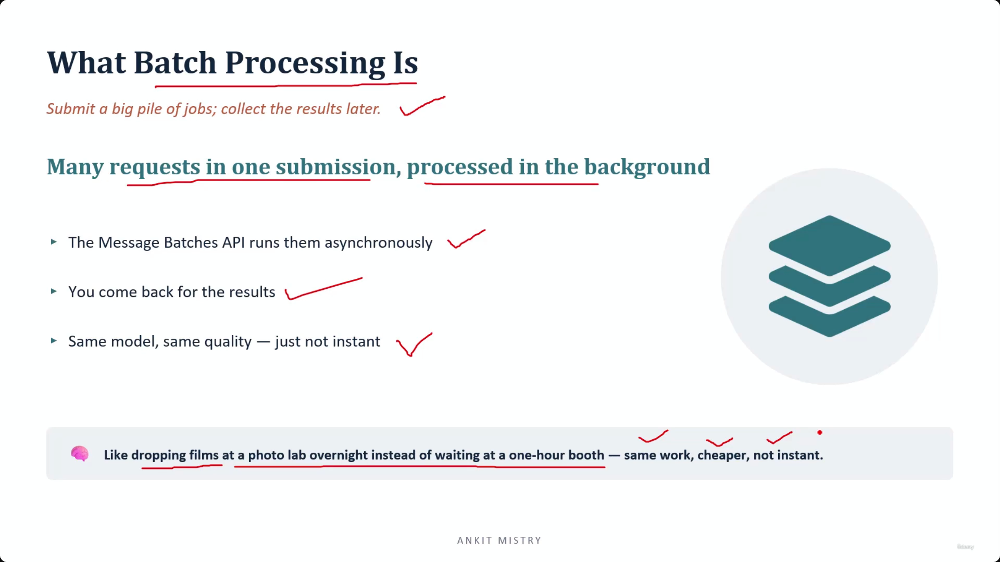
[00:02:13](https://www.udemy.com/course/claude-ai-certification/learn/lecture/57493857#overview)

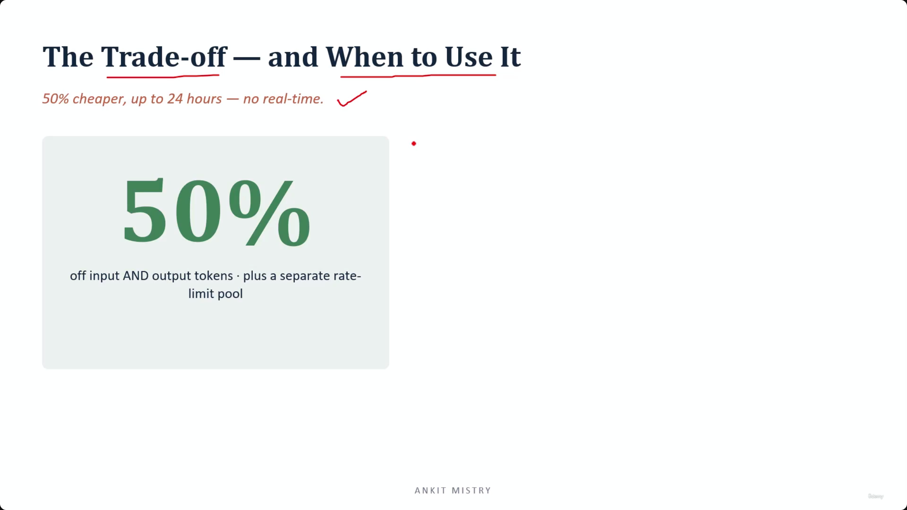
[00:02:36](https://www.udemy.com/course/claude-ai-certification/learn/lecture/57493857#overview)

### The Trade-off — and When to Use It

- **[The Core Savings]** 50% cheaper
    - This discount applies to both input AND output tokens
- **[The Trade-off]** Up to 24 hours — no real-time
    - You lose the ability to get instant responses
- **[Rate Limits]** Uses a separate rate limit pool
    - Because it has its own pool, large batch jobs don't compete with your standard real-time requests

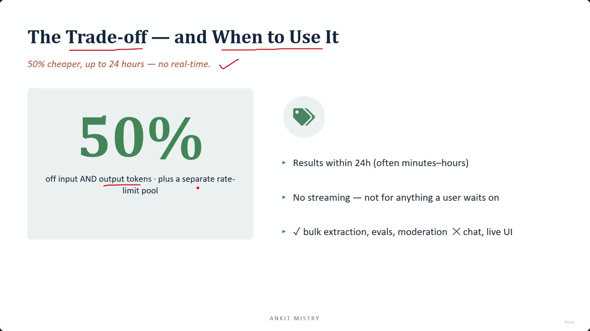
[00:03:05](https://www.udemy.com/course/claude-ai-certification/learn/lecture/57493857#overview)

### Choosing the Right Use Case

- **[Timing]** Results within 24 hours
    - While the limit is 24 hours, results often arrive within minutes to hours
- **[No Streaming]** Not for interactive use
    - Because there is no streaming, it is unsuitable for any interface where a user is actively waiting for a response
- **[Use Case Selection]**
    - **Great for background tasks:**
        - Bulk extraction
        - Evals (evaluations)
        - Moderation
    - **Bad for real-time interfaces:**
        - Chat
        - Live UI

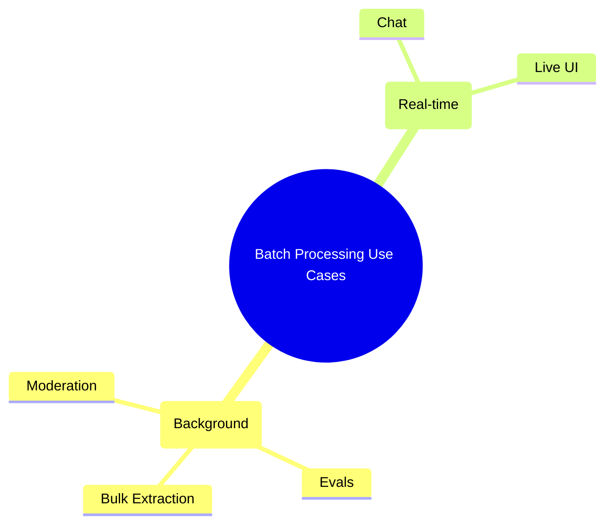
```mermaid
mindmap
  root((Batch Processing Use Cases))
    Good Fit (Background)
      Bulk Extraction
      Evals
      Moderation
    Bad Fit (Real-time)
      Chat
      Live UI
```

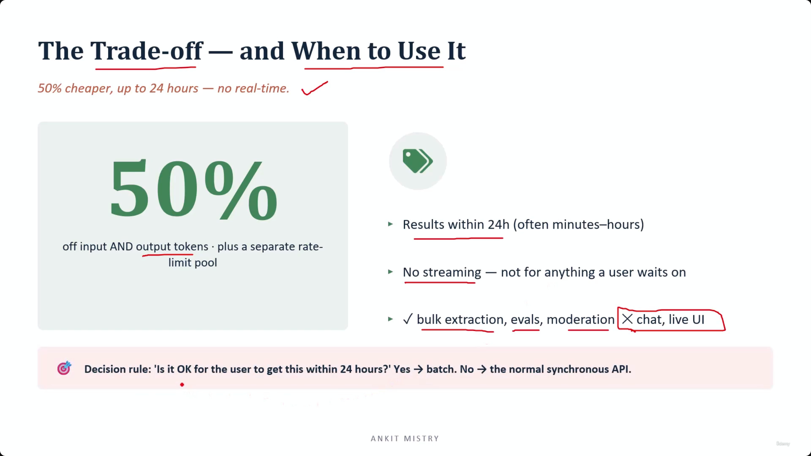
[00:03:45](https://www.udemy.com/course/claude-ai-certification/learn/lecture/57493857#overview)

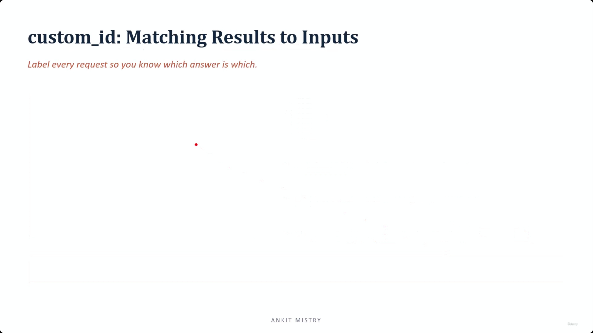
[00:04:21](https://www.udemy.com/course/claude-ai-certification/learn/lecture/57493857#overview)

### The Batch Decision Rule

- **[The Golden Question]** Is it okay for the user to get this within 24 hours?
    - **If Yes** $\rightarrow$ Use Batch (save 50%)
    - **If No** $\rightarrow$ Use the normal synchronous API
- **[Exam Tip]** This specific decision rule is a key concept tested in exams. The complexity or size of the job does not matter; only the latency requirement (the ability to wait up to a day) determines the choice.

### custom\_id: Matching Results to Inputs

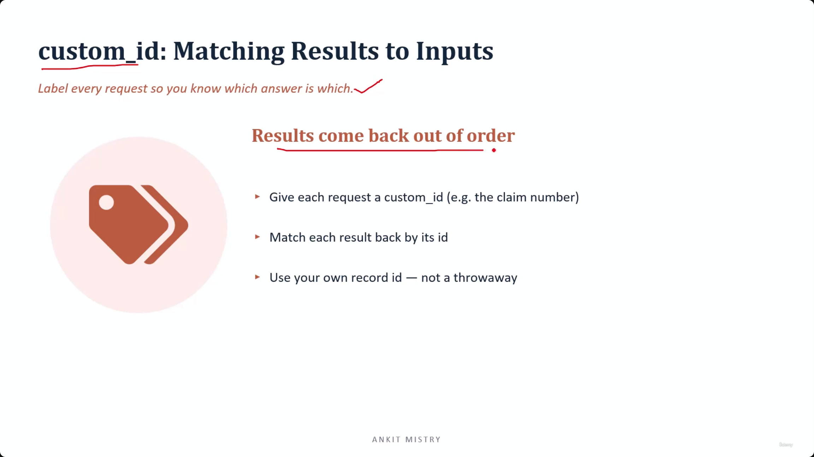
[00:04:38](https://www.udemy.com/course/claude-ai-certification/learn/lecture/57493857#overview)

### custom\_id: Matching Results to Inputs

- **[The Problem]** Results come back out of order
    - When processing thousands of jobs, the returned answers are shuffled
    - They do not arrive in the same order they were submitted
- **[The Solution]** Label every request with a `custom_id`
    - Give each request a unique identifier (e.g., a claim number)
    - Match each result back to its original input using this ID
- **[Best Practice]** Use your own record ID — not a throwaway
    - Instead of using a random or temporary string, use a meaningful identifier from your database
    - This makes the re-matching process seamless when the batch is complete

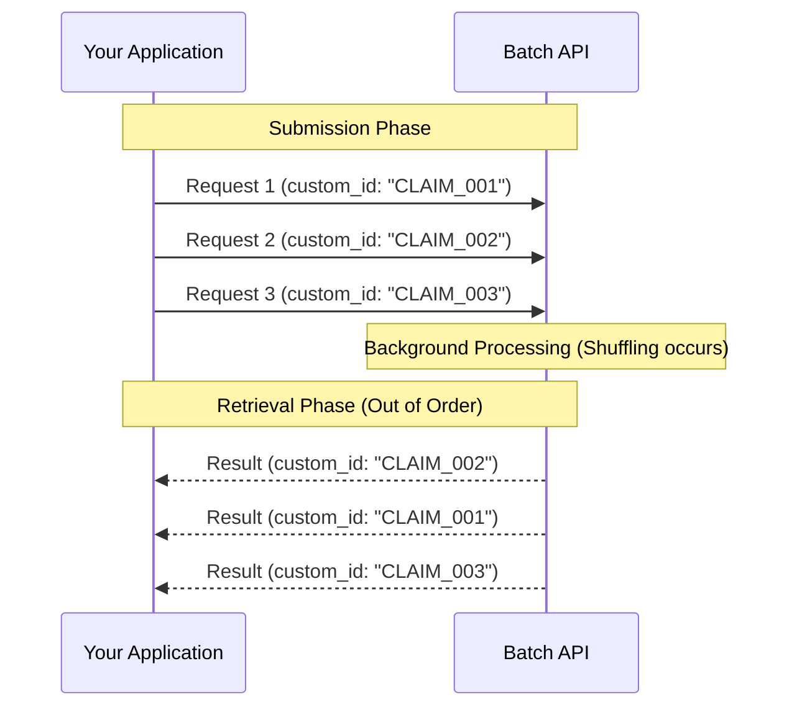
```mermaid
sequenceDiagram
    participant App as Your Application
    participant API as Batch API

    Note over App, API: Submission Phase
    App->>API: Request 1 (custom_id: "CLAIM_001")
    App->>API: Request 2 (custom_id: "CLAIM_002")
    App->>API: Request 3 (custom_id: "CLAIM_003")

    Note over API: Background Processing (Shuffling occurs)

    Note over API, App: Retrieval Phase (Out of Order)
    API-->>App: Result (custom_id: "CLAIM_002")
    API-->>App: Result (custom_id: "CLAIM_001")
    API-->>App: Result (custom_id: "CLAIM_003")
```

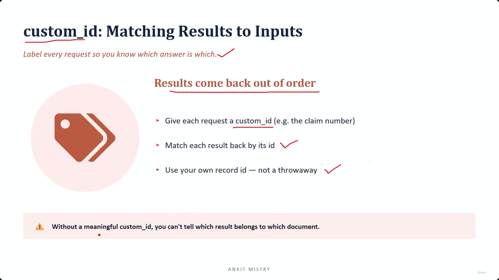
[00:05:17](https://www.udemy.com/course/claude-ai-certification/learn/lecture/57493857#overview)

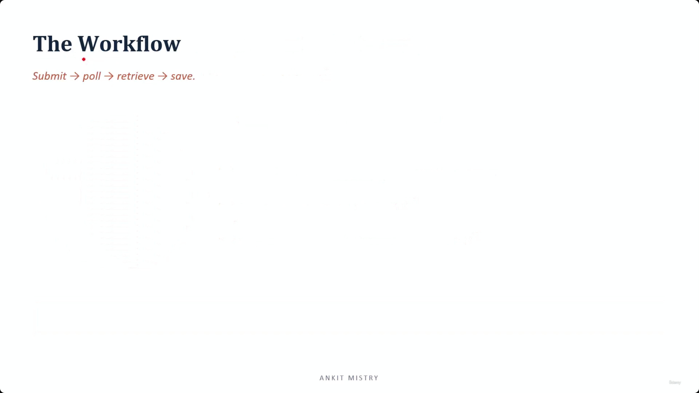
[00:05:46](https://www.udemy.com/course/claude-ai-certification/learn/lecture/57493857#overview)

### The Importance of Meaningful IDs

- **[The Critical Warning]** Without a meaningful `custom_id`, you cannot tell which result belongs to which document
    - If you use random or throwaway IDs, you will be left with a "shuffle pile" of answers that cannot be re-associated with their original inputs

### The Batch Workflow

1. **Submit**: Send the batch of requests to the API
2. **Poll**: Regularly check the status of the batch to see if processing is complete
3. **Retrieve**: Download the results once they are ready
4. **Save**: Store the processed data

```mermaid
flowchart LR
    A[Submit] --> B[Poll]
    B --> C[Retrieve]
    C --> D[Save]
```

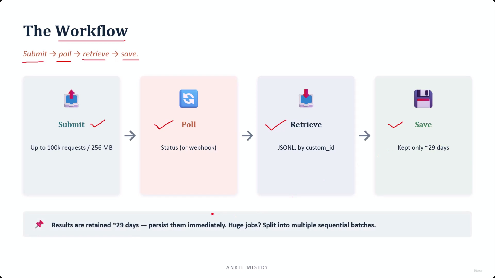
[00:06:38](https://www.udemy.com/course/claude-ai-certification/learn/lecture/57493857#overview)

### Detailed Batch Workflow

- **Submit**
    - Capacity: Up to 100,000 requests or 256 MB
- **Poll**
    - Method: Periodically check the status or use a webhook for notifications
- **Retrieve**
    - Format: Results are returned as a JSONL file
    - **[Crucial Step]** Match results back to inputs using the `custom_id`
- **Save**
    - Store the retrieved data
- **[Important Retention Note]** Results are only kept for approximately 29 days
    - Because of this limited window, you must persist the results immediately once they are retrieved

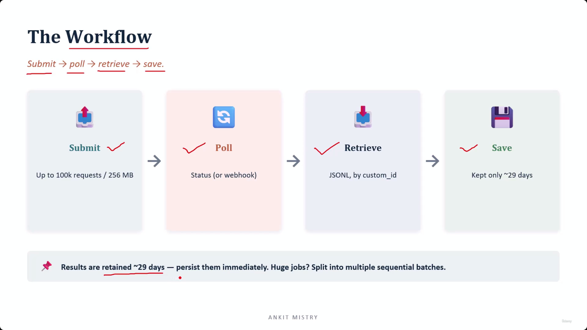
[00:06:45](https://www.udemy.com/course/claude-ai-certification/learn/lecture/57493857#overview)

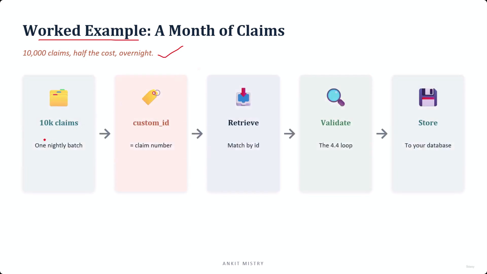
[00:07:22](https://www.udemy.com/course/claude-ai-certification/learn/lecture/57493857#overview)

### Practical Batch Processing Considerations

- **[Data Retention Warning]** Results are only retained for approximately 29 days
    - You must persist results into your own database immediately upon retrieval
    - Do not leave them "on the shelf" where they might expire
- **Handling Large Volumes**
    - If a job is truly huge, split it into multiple sequential batches rather than one massive attempt

---

## Worked Example: A Month of Claims

### Scenario: 10,000 Claims, Half the Cost, Overnight

To process a large volume of data efficiently, the workflow follows these steps:

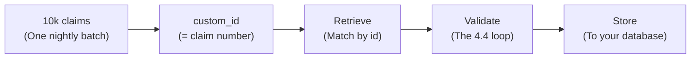
```mermaid
flowchart LR
    A["10k claims\n(One nightly batch)"] --> B["custom_id\n(= claim number)"]
    B --> C["Retrieve\n(Match by id)"]
    C --> D["Validate\n(The 4.4 loop)"]
    D --> E["Store\n(To your database)"]
```

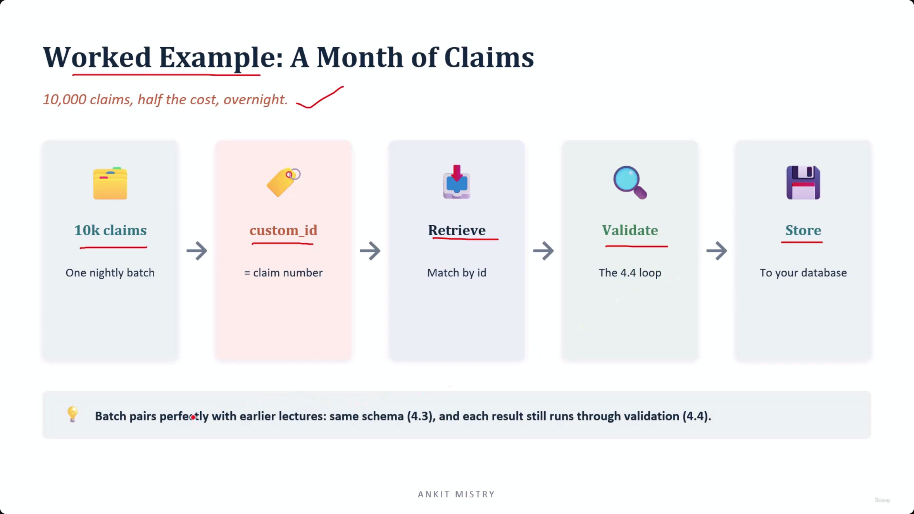
[00:08:01](https://www.udemy.com/course/claude-ai-certification/learn/lecture/57493857#overview)

### Case Study: Processing 10,000 Claims Overnight

- **[Scenario]** 10,000 claims processed as one nightly batch
- **[The End-to-End Pipeline]**

    1. **Submit**: Send the 10k claims as a single batch
    2. **Assign ID**: Use the claim number as the `custom_id`
    3. **Retrieve**: Pull the results and match them back using the ID
    4. **Validate**: Run each result through the validation loop (from Lecture 4.4)
    5. **Store**: Save the validated data to your database

- **[Integration with Previous Concepts]**
    - Batch processing works seamlessly with existing workflows
    - **Schema Consistency**: Uses the exact same schema defined in Lecture 4.3
    - **Quality Control**: Each result still undergoes the same validation process as standard requests

```mermaid
flowchart LR
    A["10k claims\n(One nightly batch)"] --> B["custom_id\n(= claim number)"]
    B --> C["Retrieve\n(Match by id)"]
    C --> D["Validate\n(The 4.4 loop)"]
    D --> E["Store\n(To your database)"]
```

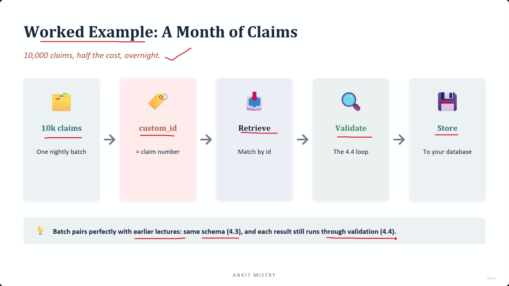
[00:08:17](https://www.udemy.com/course/claude-ai-certification/learn/lecture/57493857#overview)

### Batch Processing Integration

- **[Not a Replacement]** Batch processing does not replace existing techniques
    - It wraps around the same structured extraction and validation processes used in synchronous requests
    - The primary difference is that it runs overnight at scale for a significantly lower cost

---

## Key Takeaways

### Batch Processing in Three Lines

- **1. Async & 50% cheaper**
    - Results arrive within 24 hours
    - Ideal for non-urgent, high-volume work
    - **[The Trade-off]** You save 50% on costs, but you must accept the latency (waiting for results)

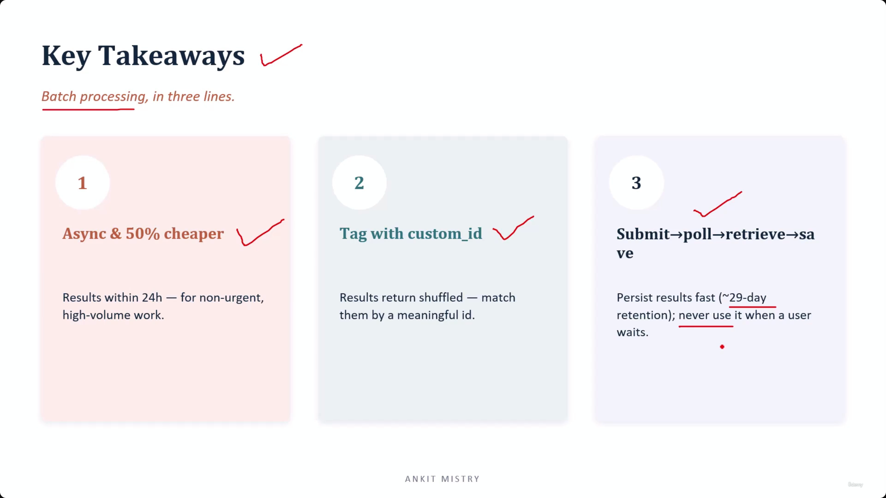
[00:09:45](https://www.udemy.com/course/claude-ai-certification/learn/lecture/57493857#overview)