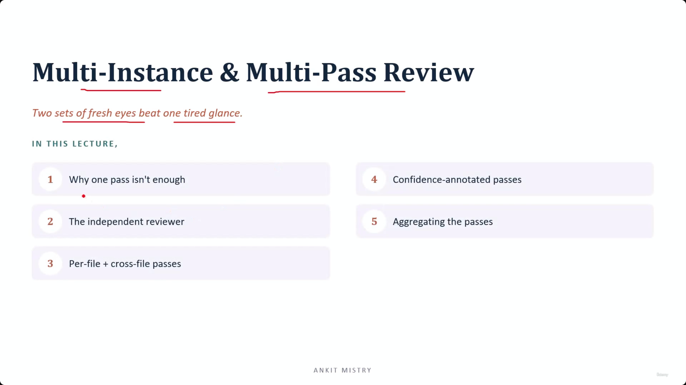
[00:00:33](https://www.udemy.com/course/claude-ai-certification/learn/lecture/57493861#overview)

## Multi-Instance & Multi-Pass Review

- Two sets of fresh eyes beat one tired glance.
- **[Lecture Roadmap]**
    - 1. Why one pass isn't enough
    - 2. The independent reviewer
    - 3. Per-file + cross-file passes
    - 4. Confidence-annotated passes
    - 5. Aggregating the passes

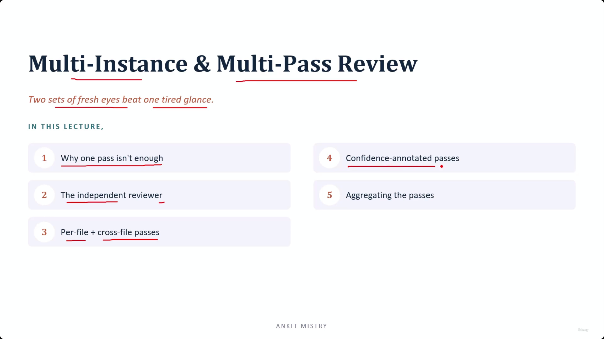
[00:00:45](https://www.udemy.com/course/claude-ai-certification/learn/lecture/57493861#overview)

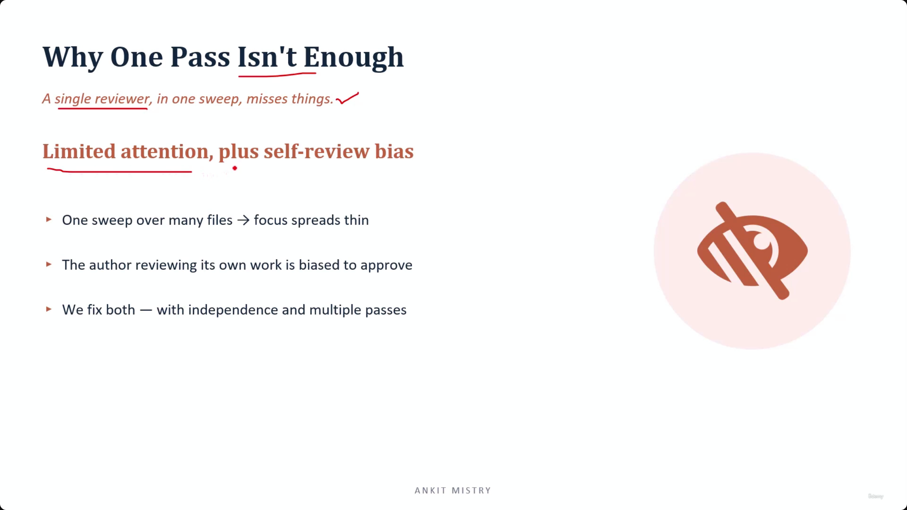
[00:01:07](https://www.udemy.com/course/claude-ai-certification/learn/lecture/57493861#overview)

## Why One Pass Isn't Enough

- A single reviewer in one sweep misses things
- **[The Two Main Problems]**
    - Limited attention: One sweep over many files causes focus to spread too thin
    - Self-review bias: An author reviewing their own work is naturally biased to approve it
- **[The Solution]**
    - We fix both issues by using independence and multiple passes

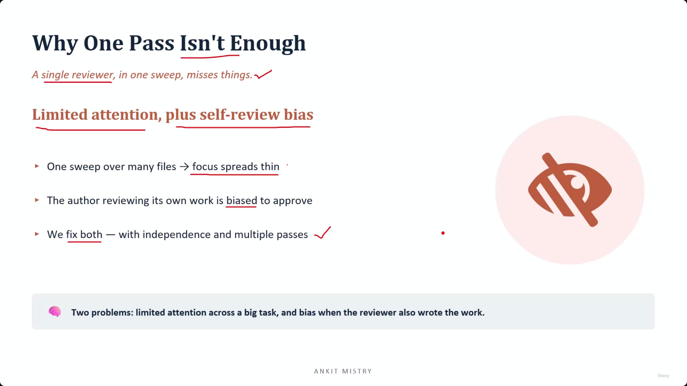
[00:01:45](https://www.udemy.com/course/claude-ai-certification/learn/lecture/57493861#overview)

## The Two-Problem/Two-Fix Framework

To solve the issues of single-pass reviews, we map specific solutions to specific problems:

- **[The Mapping]**
    - **Problem:** Limited attention (focus stretches thin over big tasks) $\rightarrow$ **Fix:** Multiple passes
    - **Problem:** Bias (the same Claude that wrote the code tends to approve its own work) $\rightarrow$ **Fix:** Independent reviewer

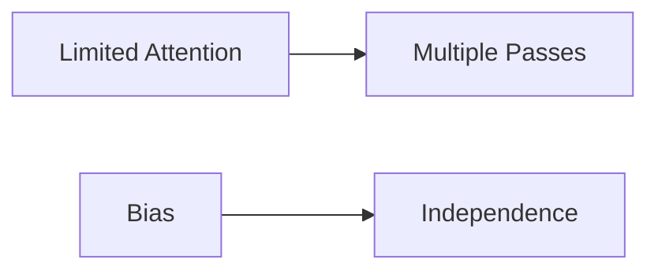

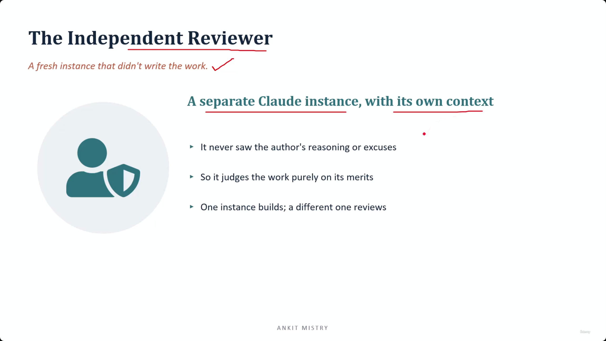
[00:02:30](https://www.udemy.com/course/claude-ai-certification/learn/lecture/57493861#overview)

## The Independent Reviewer

- A fresh instance that didn't write the work
- **[The Mechanism]** Uses a separate Claude instance with its own context
    - It never saw the author's reasoning or excuses
    - It judges the work purely on its merits
    - One instance builds; a different one reviews
- **[Why fresh context matters]** It forces a "cold" judgment
    - The reviewer has no memory of why the code was written a certain way
    - It cannot defend choices it never made

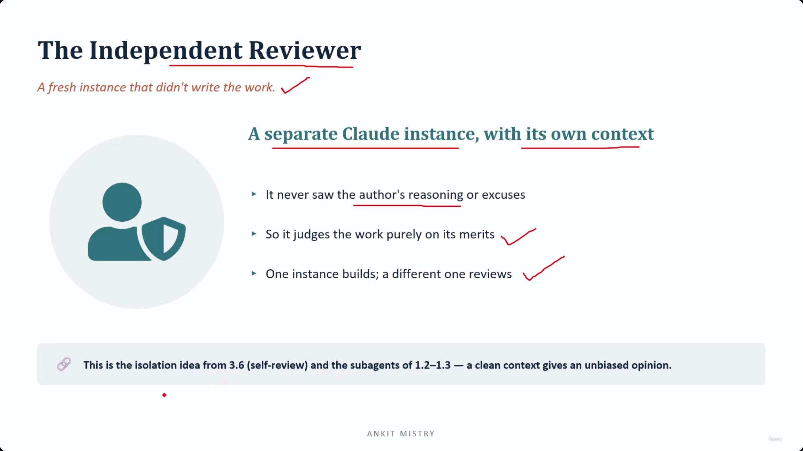
[00:03:04](https://www.udemy.com/course/claude-ai-certification/learn/lecture/57493861#overview)

### The Principle of Isolation

- A clean context is the foundation of an unbiased opinion
- **[Core Concept]** Isolation
    - This principle has been a recurring theme throughout the course
    - It was used with sub-agents (lectures 1.2–1.3) to work in isolated contexts
    - It was used with CI reviewers (domain 3) as a separate instance
    - It is applied here to ensure the independent reviewer provides a truly objective judgment

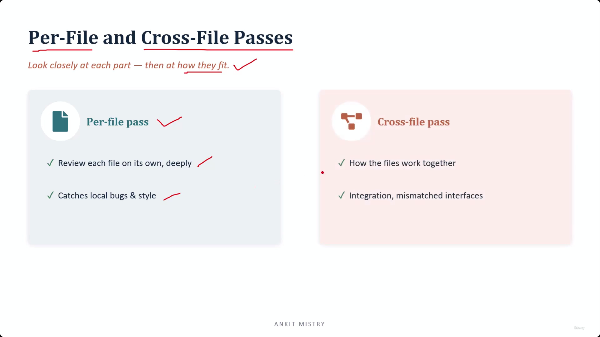
[00:04:28](https://www.udemy.com/course/claude-ai-certification/learn/lecture/57493861#overview)

## Per-File and Cross-File Passes

To ensure a thorough review, the process is split into two distinct views: looking closely at individual parts and then seeing how they fit together.

### Per-File Pass

- Involves reviewing each file on its own, deeply
- **[What it catches]** Local bugs and style issues
    - By focusing on one file at a time, the review can go deeper into the specifics of that single file
    - It is effective at spotting small, localized problems that live within the scope of one file

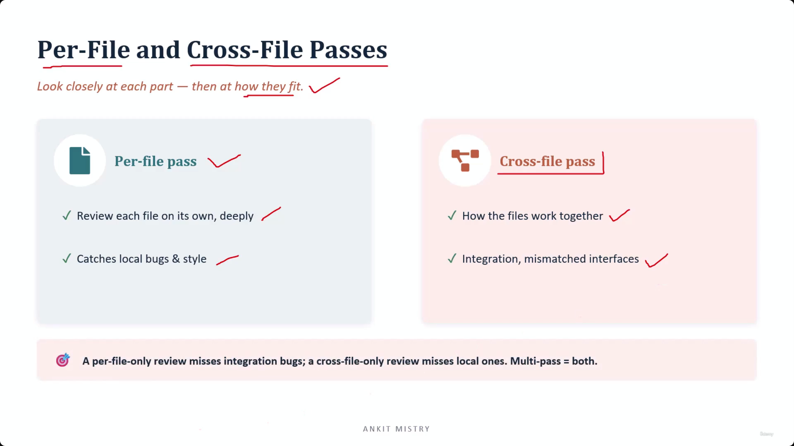
[00:05:02](https://www.udemy.com/course/claude-ai-certification/learn/lecture/57493861#overview)

### Cross-File Pass

- Focuses on how files work together
- **[What it catches]** Integration problems and mismatched interfaces
    - Some bugs do not exist within a single file
    - They live in the "gaps" where two files are supposed to connect but do not line up

### The Necessity of Multi-Pass Review

- **[The Problem]** Using only one type of pass leaves blind spots
    - A per-file-only review misses integration bugs
    - A cross-file-only review misses local bugs
- **[The Solution]** Multi-pass = both

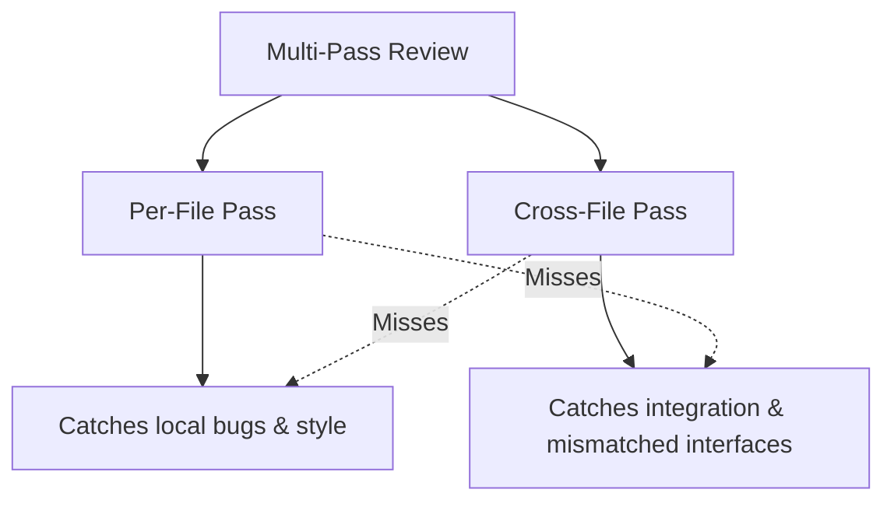

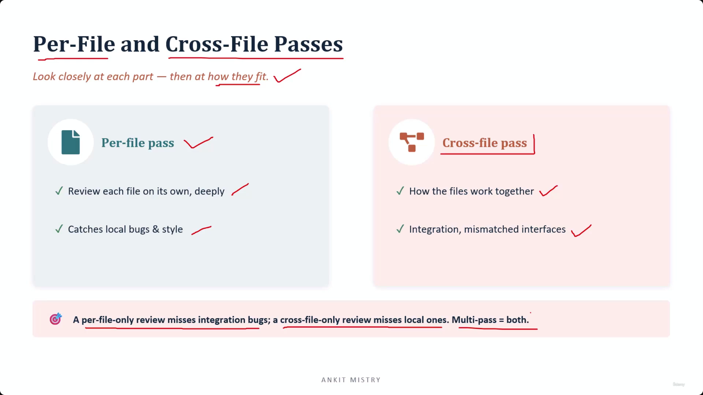
[00:05:14](https://www.udemy.com/course/claude-ai-certification/learn/lecture/57493861#overview)

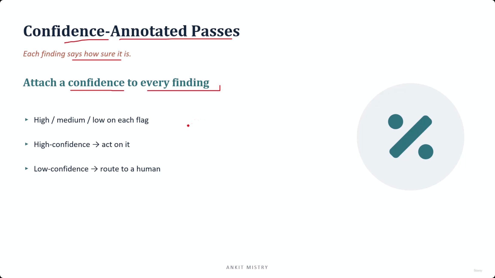
[00:05:56](https://www.udemy.com/course/claude-ai-certification/learn/lecture/57493861#overview)

### Completing the Multi-Pass Approach

- Neither pass alone is sufficient
    - Looking only at each file misses how they connect
    - Looking only at connections misses the bugs inside the files
- **[The Goal]** By performing both passes, you catch everything

## Confidence-Annotated Passes

- Each finding includes a measure of how sure the reviewer is about it
- **[Mechanism]** Attach a confidence level to every finding
    - Uses High / medium / low flags
    - **High-confidence** $\rightarrow$ act on it
    - **Low-confidence** $\rightarrow$ route to a human

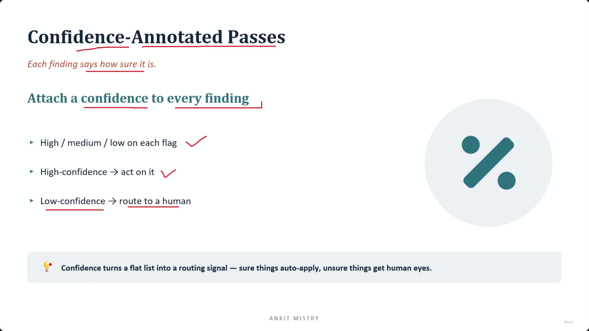
[00:06:28](https://www.udemy.com/course/claude-ai-certification/learn/lecture/57493861#overview)

### The Power of Confidence-Based Routing

- **[The Value Add]** Confidence transforms a flat list of findings into an actionable routing signal
    - **Without confidence:** You are left with a simple list of potential issues, requiring manual triage for every item
    - **With confidence:** You can automate the certainties and focus human attention specifically on the uncertainties
- **[The Workflow]**
    - **High-certainty findings** $\rightarrow$ Automate application/action
    - **Uncertain findings** $\rightarrow$ Route to human eyes for verification

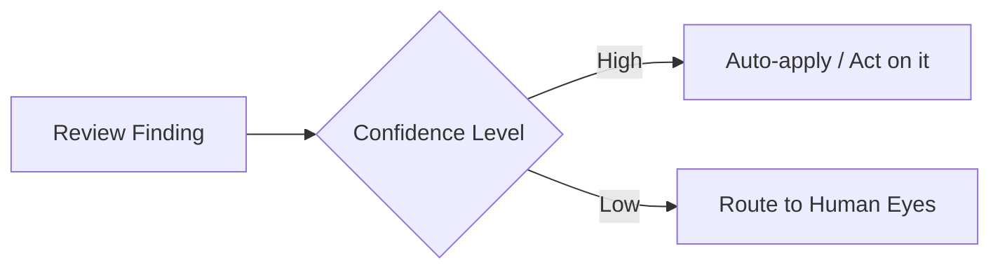

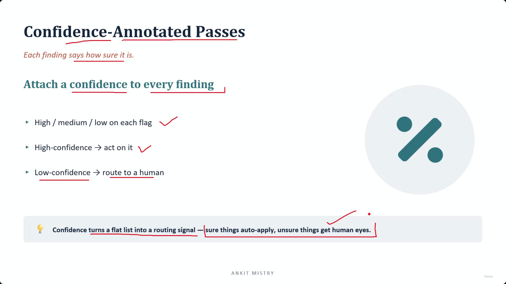
[00:06:45](https://www.udemy.com/course/claude-ai-certification/learn/lecture/57493861#overview)

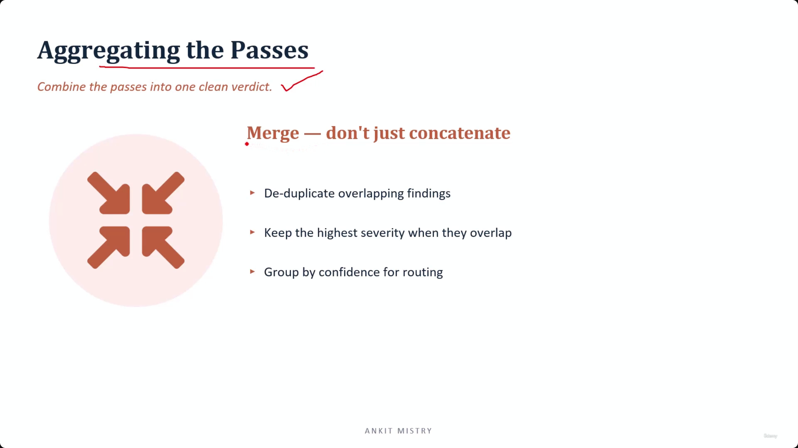
[00:07:19](https://www.udemy.com/course/claude-ai-certification/learn/lecture/57493861#overview)

## Aggregating the Passes

- The goal is to combine all individual passes into one clean, unified verdict
- **[The Method]** Merge — do not just concatenate
    - Simply sticking passes end-to-end is insufficient
    - **Merging involves:**
        - **Deduplication:** Removing overlapping findings found in different passes
        - **Severity Resolution:** Keeping the highest severity level when findings overlap
        - **Grouping:** Organizing by confidence level to facilitate routing

### The Risk of Redundancy

- **[The Warning]** Failure to merge correctly leads back to the "trust problem"
    - If you simply pile passes end-to-end, every duplicate issue shows up twice
    - This redundancy undermines the reliability of the review system, echoing core trust issues in automated agents

### The Complete Review Architecture

- **[The Goal]** To provide a full architectural view of how a single change is processed through the entire pipeline
- **[The Workflow]** The process follows a specific, sequential order to maintain both depth and breadth of review

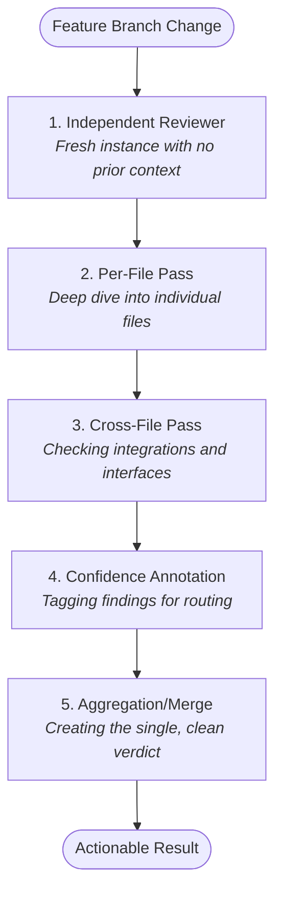

- **[The Critical Link]** The merge step is what prevents the system from becoming "noisy"
    - If the merge fails, duplicate findings from different passes resurface
    - A noisy review leads to the system being ignored, breaking the trust established in earlier principles

### The Integrated Review Architecture

- The complete review process is a synthesis of all previously discussed principles
- **[The Full Workflow]**

    1. **Independent Reviewer:** Start with a fresh, unbiased instance
    2. **Decomposition (The Two Passes):**

        - **Per-File Pass:** Deep dive into individual file logic
        - **Cross-File Pass:** Check integration and interfaces

    1. **Confidence Annotation:** Score every finding to enable routing
    2. **Aggregation:** Merge findings to deduplicate and resolve severity

- **[The Architectural Payoff]**
    - This system successfully resolves the tension between complexity and reliability
    - It brings together the core concepts of **Decomposition** (splitting big work into manageable pieces) and **Scored/Independent Review** (ensuring those pieces are judged accurately and without bias)

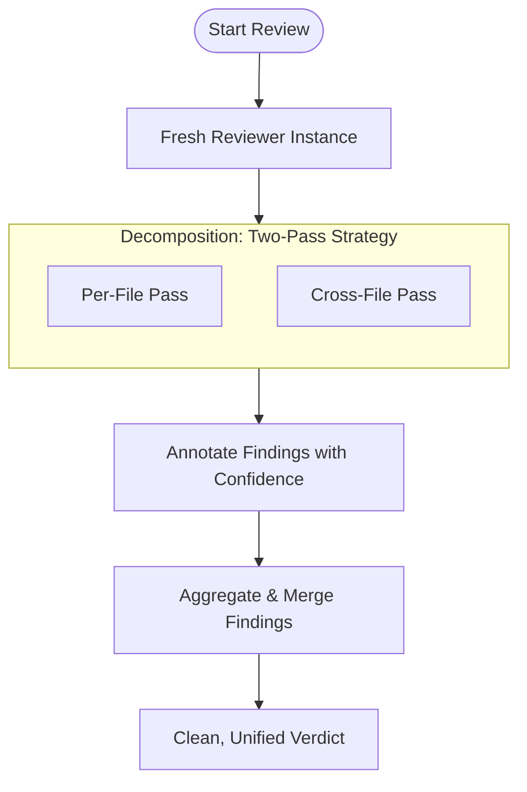

## Summary: Multi-Pass Review Key Takeaways

The multi-pass architecture fulfills the design promise of isolation by tying all previous principles together into a cohesive workflow.

- **The Independent Reviewer:** A separate instance eliminates self-review bias; because the reviewer did not write the code, it has no incentive to defend it.
- **The Complete Formula:** Effective review requires the combination of **Two Passes** (Per-File + Cross-File) plus **Confidence Annotation** to ensure both depth and actionable routing.

### Domain 4 Conclusion: The Design Promise

The multi-pass architecture succeeds by providing Claude with explicit instructions on what "good" looks like through a structured, multi-layered approach. By combining decomposition, independence, and scoring, the system transforms a single, error-prone glance into a rigorous, automated quality gate.

### The Synthesis of Reliability

- The transition from a "clever but unpredictable" model to a "reliable production system" is achieved by combining several key engineering layers:
    - **Prompt Engineering & Structured Output:** Using few-shot examples and forcing clean, structured formats.
    - **Validation:** Ensuring the meaning and structure of the output are correct through feedback loops.
    - **Efficiency:** Running large-scale jobs cheaply via batching.
    - **Quality Control:** Using the multi-pass review architecture (independent eyes) to catch errors.
- **[The Core Lesson]** Reliability is a product of these integrated layers working together to constrain and verify the model's behavior.

---

## Domain 5: Context Management

- The next phase of the journey focuses on how to effectively manage the information provided to the model (context).

---

## Simple Explanation (with Claude Examples)

**The core idea, in one line**: One reviewer, one pass, is never enough — you need fresh eyes (to avoid bias) and multiple passes (to avoid missing things), merged into one clean verdict.

**Two problems, two fixes**

| Problem | Fix |
|---|---|
| Limited attention (one sweep spreads focus too thin) | Multiple passes |
| Self-review bias (same instance approving its own work) | An independent reviewer |

*Claude Code example*: a fresh Claude session, with no memory of *why* another session wrote some code, reviews it cold — the same self-review isolation idea from the CI/CD note, applied to review generally.

**Per-file vs. cross-file passes**

- **Per-file** — deep dive into one file; catches local bugs.
- **Cross-file** — checks how files connect; catches mismatched interfaces that neither file shows on its own.

*Claude Code example*: `api/users.js` returns `{id, email}`, but `frontend/profile.js` expects `{userId, emailAddress}`. Each file looks fine alone — only a cross-file pass catches the mismatch.

**Confidence-annotated findings**

Tag each finding High/Medium/Low. High → auto-flag/act. Low → route to a human. Without this, every finding needs the same manual triage; with it, you automate the certainties and spend human attention only on the uncertain ones.

**Aggregating — merge, don't concatenate**

Simply stapling passes together duplicates findings and creates noise (echoing the "crying wolf" trust problem from earlier). Merging means: dedupe overlapping findings, keep the *highest* severity when they overlap, and group by confidence.

**The full pipeline**

```
Feature branch change
  → Independent reviewer (fresh instance)
  → Per-file pass
  → Cross-file pass
  → Confidence annotation
  → Aggregation/merge
  → One clean, actionable verdict
```

**Recap in 3 lines**

1. **Fix bias with independence** — a reviewer that never wrote the code has no reason to defend it.
2. **Fix blind spots with two passes** — per-file catches local bugs, cross-file catches integration bugs.
3. **Merge, don't concatenate** — dedupe and keep the highest severity, or the review becomes noisy and gets ignored.