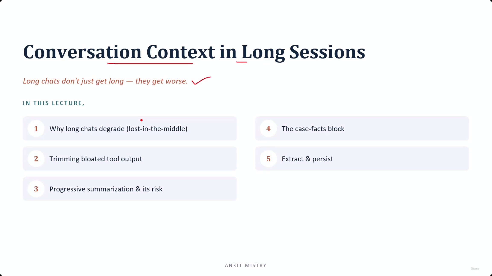
[00:00:40](https://www.udemy.com/course/claude-ai-certification/learn/lecture/57561039#overview)

## Context Management

### Conversation Context in Long Sessions

- Long chats don't just get long — they get worse.
- Managing the growth of history is a specific discipline required to prevent degradation in long sessions.

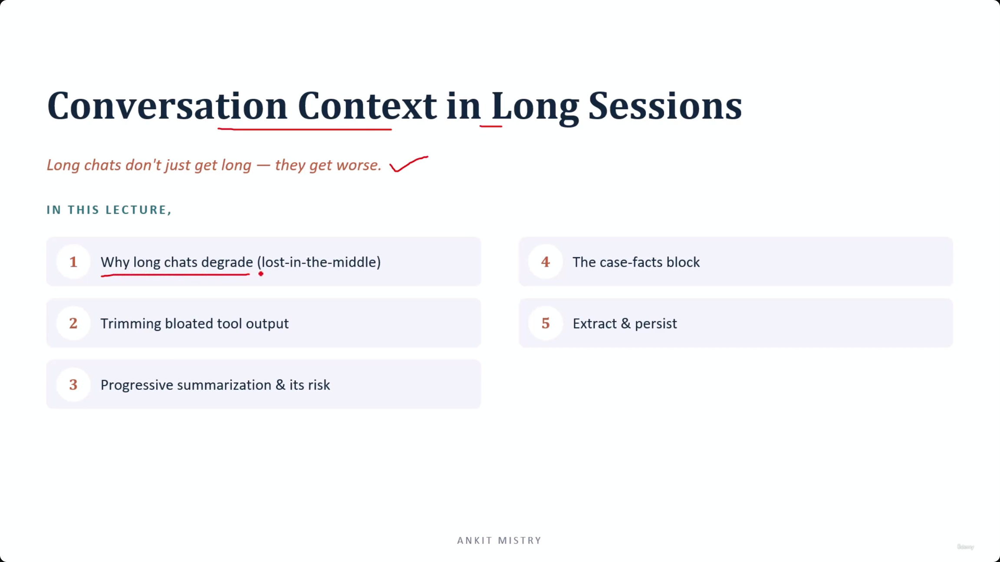
[00:00:43](https://www.udemy.com/course/claude-ai-certification/learn/lecture/57561039#overview)

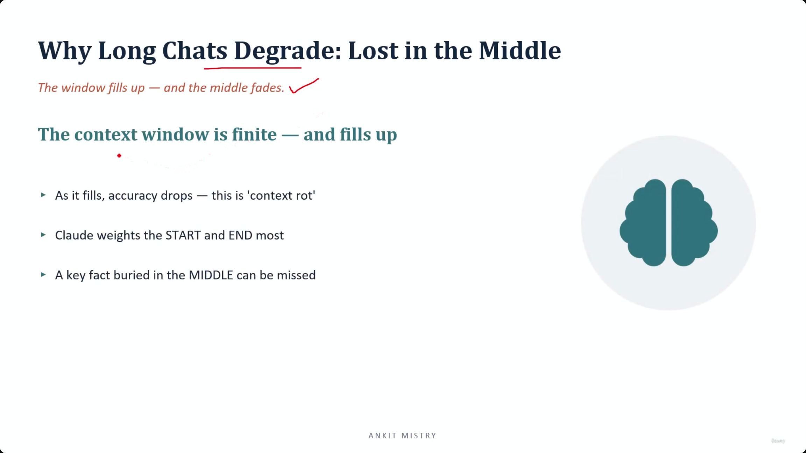
[00:01:15](https://www.udemy.com/course/claude-ai-certification/learn/lecture/57561039#overview)

### Why Long Chats Degrade: Lost in the Middle

- The phenomenon where "the window fills up — and the middle fades"
- **[Context Rot]** Because the context window is finite, as it fills up, accuracy drops
- Models like Claude tend to weight the START and END of the context most heavily
    - This means a key fact buried in the MIDDLE can be missed

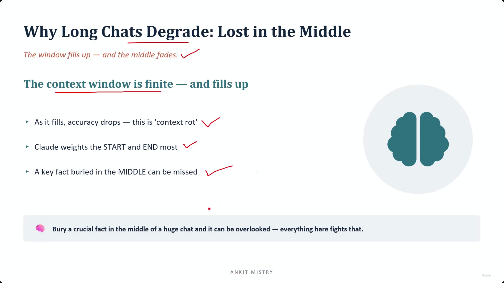
[00:01:55](https://www.udemy.com/course/claude-ai-certification/learn/lecture/57561039#overview)

### The Mechanics of 'Lost in the Middle'

- It is a measurable effect, not a sign of model carelessness
- As a chat becomes very long, the model's attention distribution shifts:
    - **High Attention**: The beginning of the conversation
    - **High Attention**: The most recent part of the conversation
    - **Low Attention**: Information buried in the middle
- **[The Core Challenge]** Because of this bias, a crucial fact in the middle of a huge chat can easily be overlooked
- This phenomenon is the central "enemy" that all context management techniques aim to solve

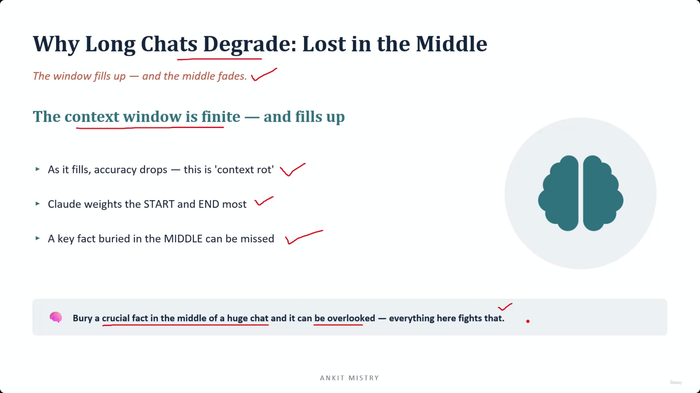
[00:02:15](https://www.udemy.com/course/claude-ai-certification/learn/lecture/57561039#overview)

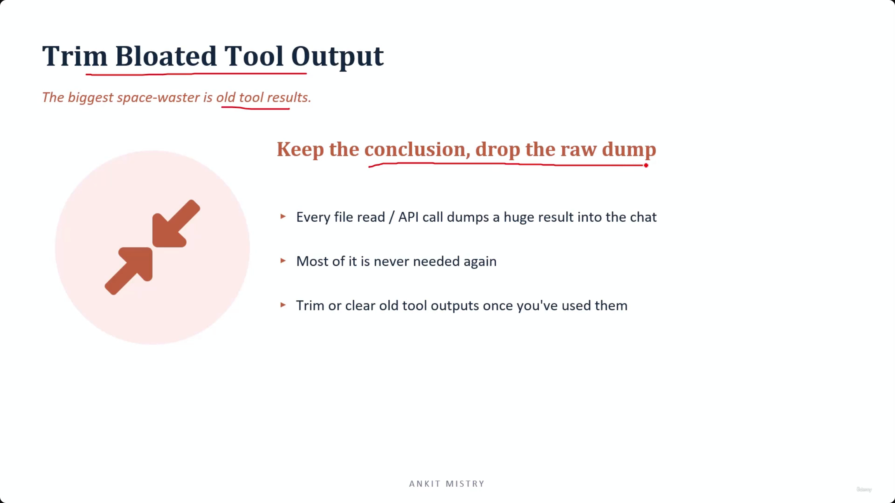
[00:02:48](https://www.udemy.com/course/claude-ai-certification/learn/lecture/57561039#overview)

### Trim Bloated Tool Output

- **[The Problem]** Old tool results are the biggest space-wasters in a conversation
    - Every file read or API call dumps a huge result into the chat
    - Most of this raw data is never needed again
- **[The Fix]** Keep the conclusion, drop the raw dump
    - Instead of keeping the entire output, only retain the essential conclusion or relevant summary
    - Trim or clear old tool outputs once they have been used to prevent them from clogging the context window

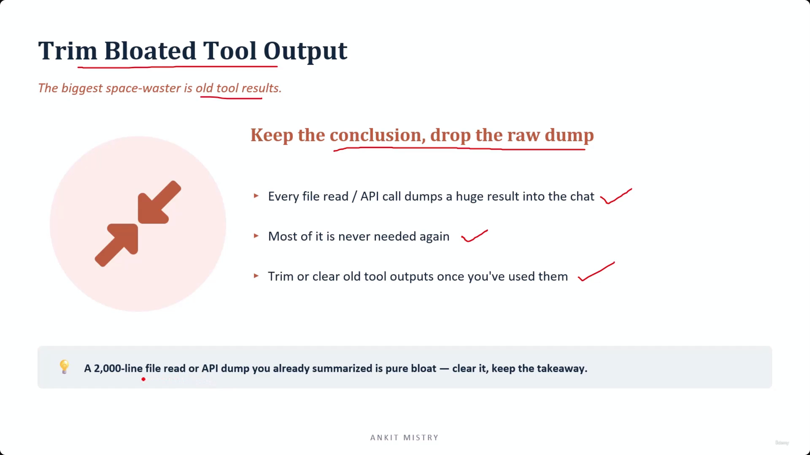
[00:03:28](https://www.udemy.com/course/claude-ai-certification/learn/lecture/57561039#overview)

### Managing Tool Output Bloat

- **[The Real Space-Waster]** It is rarely the actual conversation that fills the window
    - The majority of space is consumed by giant raw results from tools
    - Examples include entire file reads or massive API responses
- **[The Strategy]** Clear the raw dump once the information is processed
    - Once you have extracted what you need, the original data becomes "dead weight"
    - **Example**: A 2,000-line file read or an API dump that has already been summarized is pure bloat
    - **The Fix**: Clear the raw output and keep only the takeaway/conclusion

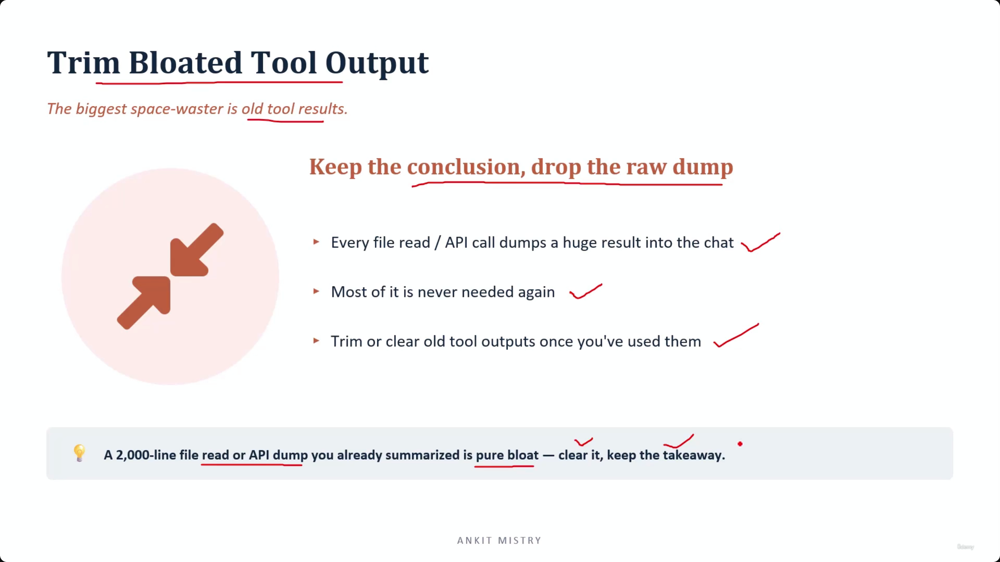
[00:03:43](https://www.udemy.com/course/claude-ai-certification/learn/lecture/57561039#overview)

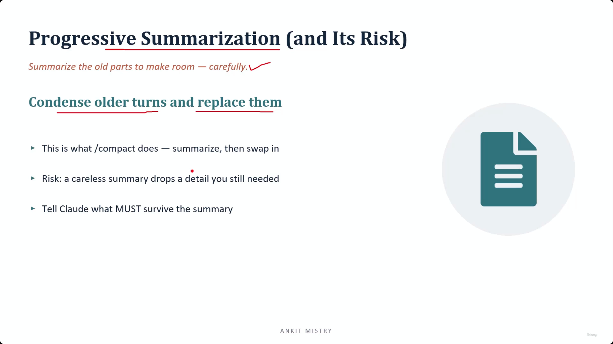
[00:04:19](https://www.udemy.com/course/claude-ai-certification/learn/lecture/57561039#overview)

### Progressive Summarization (and Its Risk)

- **[The Technique]** Condense older turns and replace them with summaries to make room
    - This is the mechanism behind commands like \`/compact
- **[The Risk]** A careless summary might drop a detail that is still needed later
    - **[The Fix]** Explicitly tell the model what MUST survive the summary process

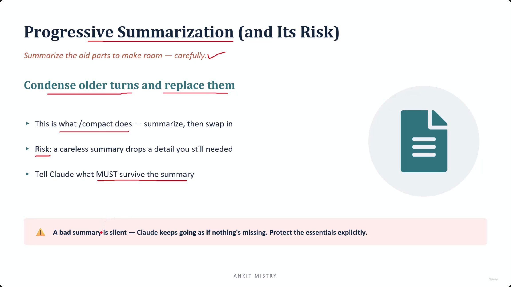
[00:04:54](https://www.udemy.com/course/claude-ai-certification/learn/lecture/57561039#overview)

### The Danger of Silent Failures in Summarization

- **[The Core Risk]** Summarization is a process of discarding information to make room
    - If the summary throws away the wrong thing, you have quietly lost a crucial detail
- **[The "Silent" Warning]** A bad summary is uniquely dangerous because it is silent
    - There is no error message or warning when a key fact is dropped
    - Claude will simply continue the conversation as if nothing is missing, unaware that its context is now incomplete
- **[The Mitigation]** Protect the essentials explicitly
    - Because the failure is silent, you cannot rely on the model to know what is important
    - You must explicitly tell the model which specific facts or details **MUST** survive the summary process

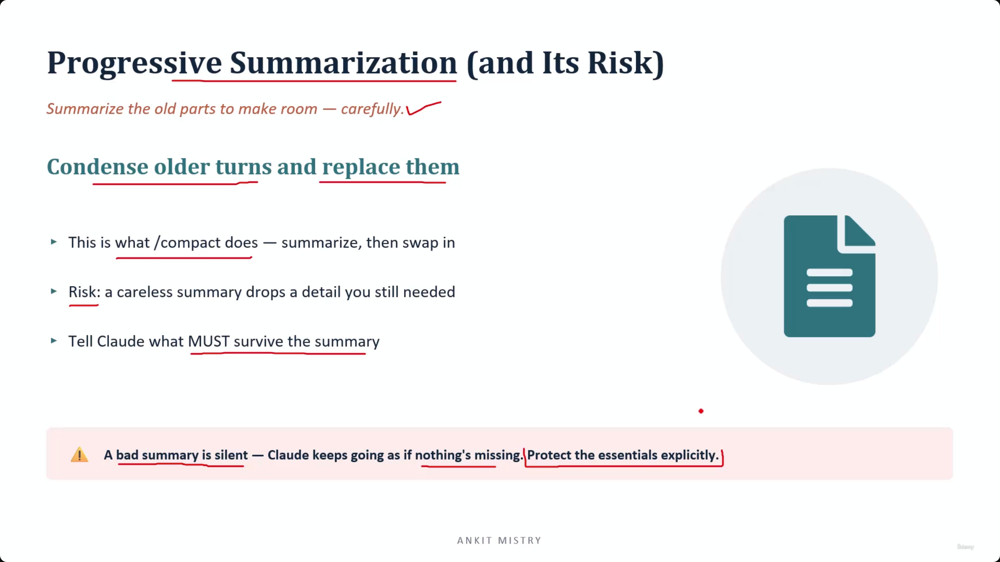
[00:05:14](https://www.udemy.com/course/claude-ai-certification/learn/lecture/57561039#overview)

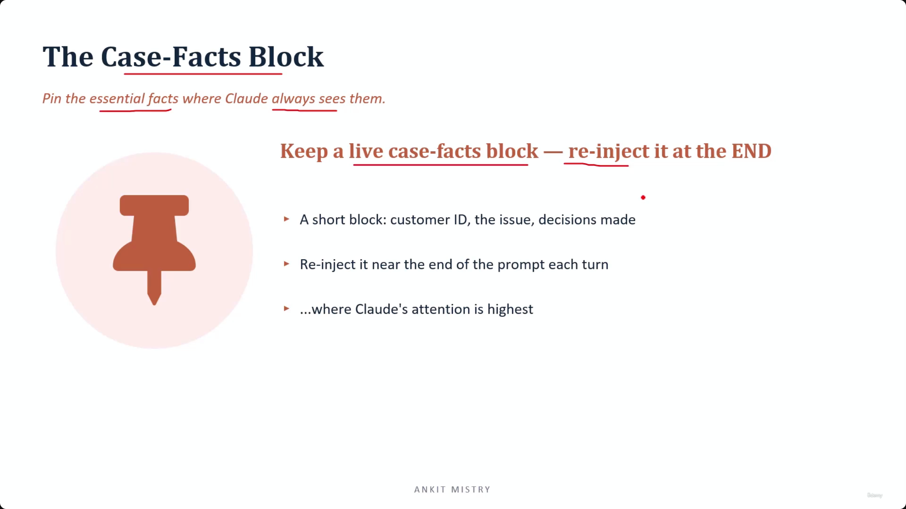
[00:05:46](https://www.udemy.com/course/claude-ai-certification/learn/lecture/57561039#overview)

### The Case-Facts Block

- **[The Trick]** Pin essential facts where Claude always sees them
    - Create a short, live block containing critical data
    - Examples of contents:
        - Customer ID
        - The core issue
        - Decisions made so far
- **[The Strategy]** Re-inject the block at the end of every turn
    - Place the block near the end of the prompt
    - **[Why?]** This is where the model's attention is highest, ensuring the facts are not lost to context drift or summarization errors

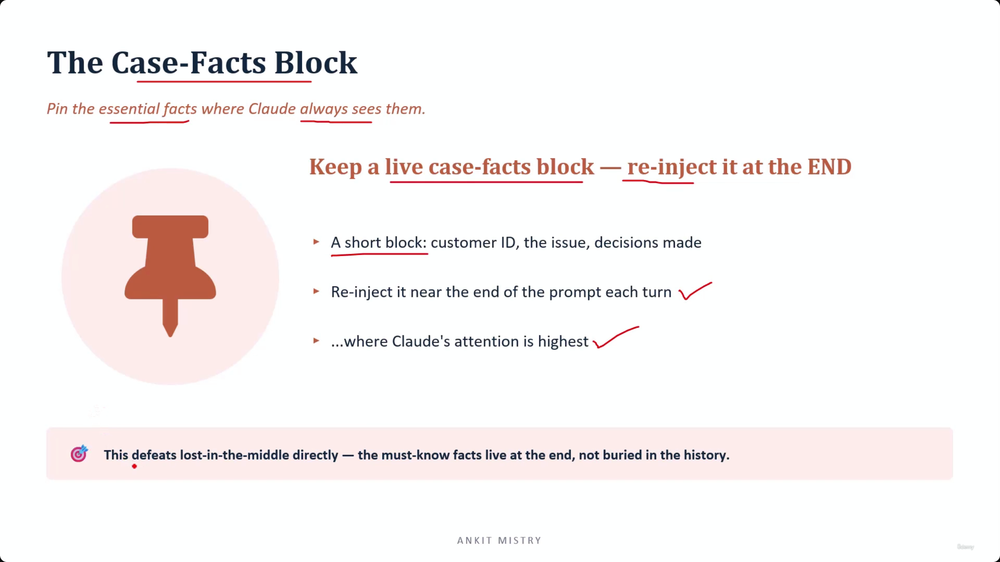
[00:06:23](https://www.udemy.com/course/claude-ai-certification/learn/lecture/57561039#overview)

- **[Why it works]** It directly defeats the "lost in the middle" problem
    - Instead of leaving must-know facts buried in the conversation history, you paste them freshly at the end of each turn
    - **[The Result]** This places the facts exactly where Claude's attention is highest

[00:06:44](https://www.udemy.com/course/claude-ai-certification/learn/lecture/57561039#overview)

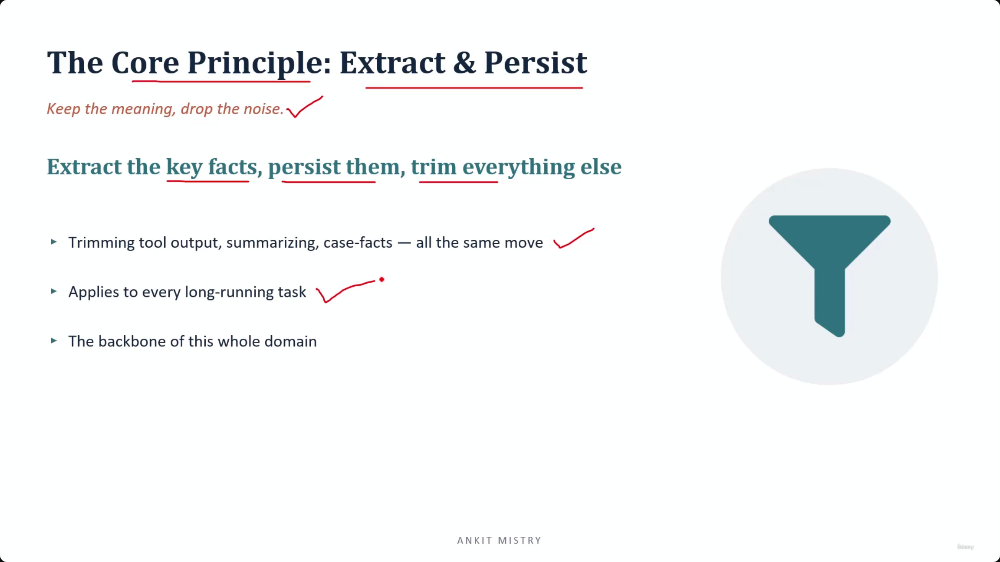
[00:07:26](https://www.udemy.com/course/claude-ai-certification/learn/lecture/57561039#overview)

## The Core Principle: Extract & Persist

- **[The Mantra]** Keep the meaning, drop the noise
- **[The Process]**
    - Extract the key facts
    - Persist them
    - Trim everything else
- **[The Unified Strategy]** All context management techniques follow this same movement:
    - Trimming tool output
    - Summarizing (Progressive Summarization)
    - Using a Case-Facts Block

By applying this single principle to every long-running task, you ensure the model maintains focus on what matters while preventing context bloat.

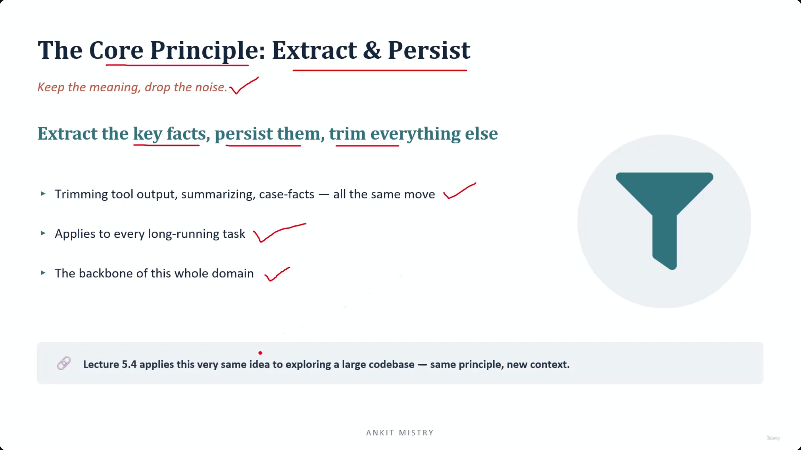
[00:07:49](https://www.udemy.com/course/claude-ai-certification/learn/lecture/57561039#overview)

### Preview: Applying Principles to Large Codebases

- **[The Connection]** The "Extract & Persist" principle is not limited to conversation history
- **[Future Application]** When exploring a large codebase, the same logic applies to managing files instead of chat turns
    - Instead of managing conversation turns, you will manage the massive amount of information contained within files
    - The goal remains the same: extract the essential code/logic and discard the noise to prevent context bloat

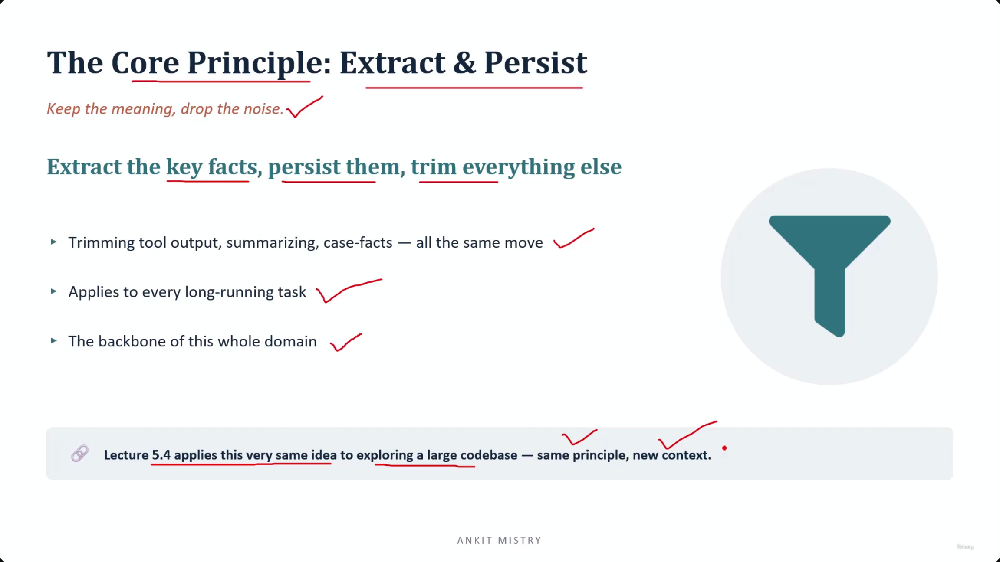
[00:08:16](https://www.udemy.com/course/claude-ai-certification/learn/lecture/57561039#overview)

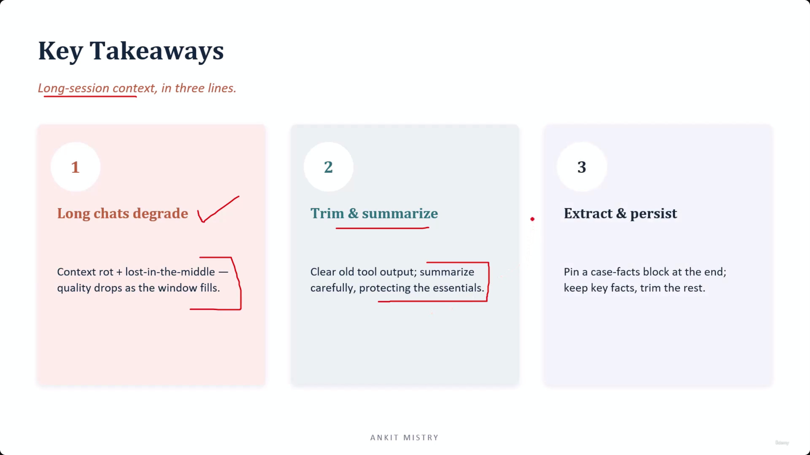
[00:08:56](https://www.udemy.com/course/claude-ai-certification/learn/lecture/57561039#overview)

---

## Simple Explanation (with Claude Examples)

**The core idea, in one line**: Long conversations don't just get longer — Claude's accuracy actually degrades, because it pays far more attention to the start and end of a conversation than to the middle.

**"Lost in the middle" — an everyday analogy**

Reading a long meeting transcript, you remember the opening and what was just said — something from the middle easily slips your mind. Claude has the same bias: high attention at the start, high attention at the most recent turns, weak attention to whatever's buried in between.

*Claude Code example*: in this exact conversation, if a fact you mentioned early on never gets restated and dozens of messages pile up in between, there's real risk I weight that early detail weaker than something you just said.

**Fix 1 — trim bloated tool output**

The biggest space-waster usually isn't the conversation itself — it's giant raw tool results (a full file read, a huge API response) that never get needed again in full. Keep the conclusion, drop the raw dump.

*Claude Code example*: after I `Read` a 250-line note file and write my explanation, the raw file dump is dead weight — the fix is keeping just the takeaway, not dragging every full file read forward for the rest of the conversation.

**Fix 2 — progressive summarization, carefully**

`/compact` condenses older turns into a summary to free up space. The risk: a careless summary might silently drop a detail you still needed. The fix is explicitly telling the model which facts **must** survive.

**Why this is scarier than a normal error**: a bad summary doesn't throw a warning — Claude just continues normally, unaware anything's missing.

**Fix 3 — the Case-Facts Block**

A short, always-current block of essential facts, re-pasted near the **end** of the prompt every turn — exactly where Claude's attention is strongest, defeating the "lost in the middle" problem directly.

**The one principle underneath all three**: Extract the key facts → Persist them → Trim everything else.

**Recap in 3 lines**

1. **Long chats degrade** — Claude attends most to the start and end, so mid-conversation facts get lost.
2. **Trim and summarize carefully** — clear raw tool dumps, explicitly protect facts that must survive a summary.
3. **Pin critical facts at the end of every turn** — beats letting essentials drift into the low-attention middle.

---

## Exam Objective Note: CCAR-F 5.1 — Context Window Management

**The first thing that breaks: an old instruction you still need**

When a long conversation starts losing quality, the first casualty is usually an instruction from early on that's still supposed to apply now. That's why "just delete the oldest messages first" is a bad strategy — the oldest message might be the one holding a rule you still need to follow.

Everyday analogy: it's like a manager giving an instruction at the start of a long meeting, and everyone forgetting it later simply because so much else got discussed in between — even though nobody ever cancelled it.

**For facts you truly can't lose, don't rely on the summary at all**

Summarizing (what `/compact` does) squeezes old messages into a shorter form. That's fine for most things. But for facts that must never be lost, don't even trust the summary process with them — put them in a small block that gets repeated on every single turn instead.

**Two small details worth remembering**

- A named field (like `customer_id: 4521`) survives better than the same fact buried in a paragraph. Copying a field is exact; rewriting prose during a summary is exactly where details quietly get changed or dropped.
- Trim a big tool result *before* it even arrives — filter or limit at the source — rather than letting it all flood in and cleaning up after.

*Claude Code example*: instead of running `Read` on an entire 5,000-line log file and hoping to mentally ignore most of it, it's better to `grep` for the specific error first, so only the relevant few lines ever enter context in the first place.

**Recap in 3 lines**

1. An early instruction can still matter later — never assume the oldest messages are the safest ones to delete.
2. Put must-never-lose facts in a block repeated every turn, not just inside a summary.
3. Trim big results before they arrive, and prefer named fields over rewritten prose — both keep facts from drifting.