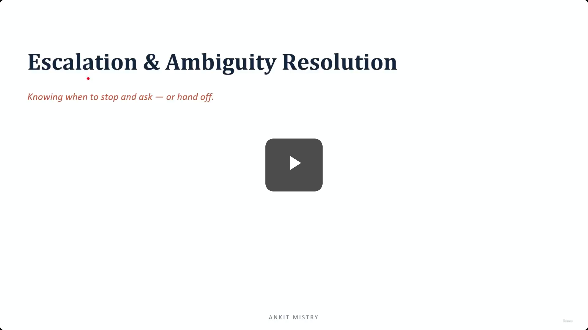
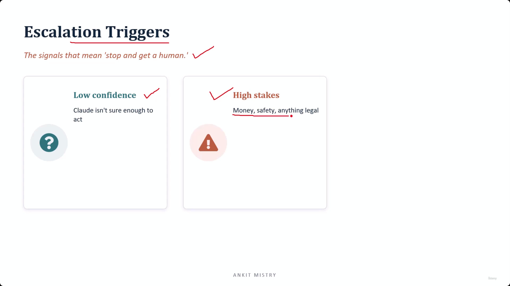

[00:00:00](https://www.udemy.com/course/claude-ai-certification/learn/lecture/57561043#overview)

## Escalation & Ambiguity Resolution

- Knowing when to stop and ask — or hand off.

### Lecture Overview

- Why escalate?
- Escalation triggers, including policy gaps

### The Risks of Guessing

- **The core principle**: A confident wrong action is worse than asking.
- **The danger of "Pressing Ahead"**
    - This occurs when an AI (like Claude) guesses when it is actually unsure.
    - This behavior is essentially gambling.
    - When stakes are high, a confident guess that turns out to be wrong leads to expensive mistakes.

### Escalation vs. Pressing Ahead

- **Escalation as a Feature**
    - Handing a decision to a human is the correct behavior, not a failure or a sign of 'giving up.'
    - Knowing its own limits is a critical capability of a reliable agent.
- **The Dangerous Agent**
    - The real danger comes from an agent that "plows ahead" despite being unsure.
    - An agent that recognizes uncertainty and brings in someone who knows the answer is performing its role correctly.

### Redefining Agent Reliability

- **The Paradox of the 'Good' Agent**
    - A common misconception is that a good agent must always have an answer.
    - In reality, the agent you can actually trust is the one that knows when to stop.
- **Knowing Limits as a Strength**
    - Recognizing one's own boundaries is not a weakness.
    - It is one of an agent's most important and best qualities.

### Escalation Triggers

- Signals that indicate an agent should stop and involve a human.
- **Low Confidence**
    - This occurs when the agent is simply not sure enough to act.
    - It is the most direct trigger: if the agent evaluates a situation and lacks sufficient confidence in the correct answer, it must escalate.

[00:03:06](https://www.udemy.com/course/claude-ai-certification/learn/lecture/57561043#overview)

### Additional Escalation Triggers

- **High Stakes**
    - Involves critical domains such as money, safety, or legal matters.
    - When stakes are high, even a minimal risk of error justifies a human review before proceeding.
- **Policy Gaps**
    - Occurs when a situation arises that is not covered by the specific rules or instructions provided to the agent.

### Honoring Explicit Human Requests

- **The Rule of Immediate Escalation**
    - If a user explicitly asks to speak to a human, the agent must escalate immediately.
    - The agent should not attempt to resolve the issue first or try to convince the user that it can handle it.
- **The Conflict of Intent**
    - AI agents are fundamentally designed to be helpful and solve problems.
    - **[Crucial Distinction]**: An explicit human request for intervention outranks the agent's instinct to be helpful.
    - Attempting to "talk a user out of" requesting a human is a failure to follow the escalation protocol.

### The Impact of Ignoring Human Requests

- **The Trust Erosion Risk**
    - Overriding a request for a human, even if well-intentioned, damages the user's trust in the system.
    - When a user asks for a person and the agent responds with "Let me just try one more thing," the user feels ignored.
- **[Key Principle]**: Even if the agent is genuinely capable of solving the problem, it must prioritize the user's request for human intervention over its own instinct to be helpful.

### Clarifying Multiple Matches

- **The Rule of Disambiguation**
    - When a user's request could apply to multiple distinct entities, the agent must ask a clarifying question.
    - **[The Core Instruction]**: Ask a question to pin down the specific intent; do not silently pick one of the matches.
    - **Example Scenario**:
        - Two customers share the same name (e.g., "Sharma").
        - Two different orders match the provided criteria.
        - The agent should ask: "Did you mean order A or order B?"
- **Disambiguation vs. Escalation**
    - It is critical to distinguish between asking for clarification and handing off to a human.
    - **Disambiguation**: Turning the question back to the user to resolve the ambiguity. This is a way for the agent to continue the task correctly.
    - **Escalation**: Handing the task to a human because the agent cannot proceed.
    - **[Key Distinction]**: Clarifying multiple matches is a way to resolve ambiguity *without* needing a human handoff.

### The Risk of Silent Selection

- **[The Danger of Guessing]**: When multiple entities (like customers or orders) match a user's criteria, the agent must never silently pick one.
    - Selecting an entity without confirmation risks acting on the wrong record.
    - This can lead to significant errors, such as modifying the wrong customer's account or processing the wrong order.
- **[The Value of Disambiguation]**: Asking a single clarifying question (e.g., "Did you mean order A or order B?") acts as a safeguard.
    - It prevents costly mistakes by ensuring the agent's subsequent actions are precisely aligned with user intent.

---

### Summary: Escalation and Ambiguity

To maintain reliability and trust, agents should follow these core escalation signals:

- **Low Confidence**: When the agent is unsure of the correct path or answer.
- **High Stakes**: When the task involves money, safety, or legal implications.
- **Policy Gap**: When the agent encounters a situation not covered by its existing instructions or rules.

### Core Escalation Rules Recap

To maintain reliability and prevent errors, agents must follow these three fundamental mandates:

1. **Never Invent Policy**: If a scenario is not covered by existing rules (a **Policy Gap**), the agent must escalate. Do not attempt to create or assume a procedure.
2. **Honor Explicit Requests**: An explicit demand for a human (e.g., "I want to talk to a person") is an instant escalation trigger. Do not attempt to talk the user out of the request; hand them over immediately.
3. **Resolve Ambiguity via Disambiguation**: When multiple matches exist, ask a clarifying question to let the user choose. This is a tool for the agent to continue the task correctly and is distinct from a human handoff.