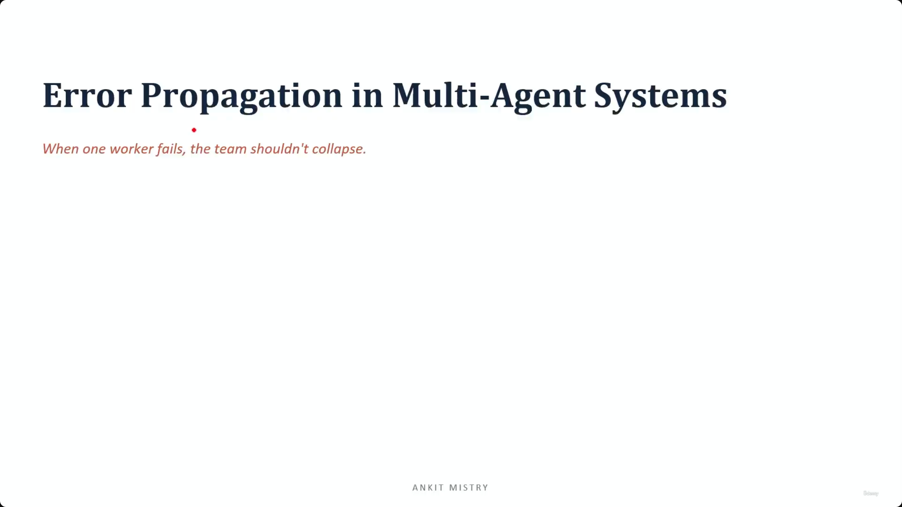

## Error Propagation in Multi-Agent Systems

- The core challenge: ensuring a team doesn't collapse when a single worker fails
- This concept combines two previous ideas:
    - Building coordinator and subagent teams
    - Implementing single-tool error handling
- **Lecture Roadmap**:

    1. The problem
    2. Structured error handback
    3. Failure types and partial results

### The Problem: Silent Failures

- **The Real Danger**: A silent failure is significantly worse than an explicit one
    - A failure is only a disaster if the coordinator doesn't realize it happened
- **The Mechanism of Failure**:
    - A subagent fails and returns nothing (empty data/null)
    - The coordinator, unable to distinguish between "no data" and "no error", proceeds with the task
    - The coordinator builds a final answer based on missing information
    - The system reports a result that is both confident and incorrect
- **Key Insight**:
    - The disaster isn't the failure itself, but the silence that follows it

### The Goal: Making Failures "Loud"

- **Expectation of Failure**: In any large-scale system, individual parts will occasionally fail
    - This is a normal, expected occurrence
- **The Engineering Objective**: The goal is not to achieve zero failures, but to ensure failures are visible
    - We must avoid "papering over" gaps silently
    - We need to make failures "loud" so the coordinator can detect the missing piece rather than proceeding as if nothing is wrong

### Structured Error Handback

- **The Fix**: Instead of returning nothing, subagents must report failures clearly using a fixed, predictable shape
- **The Subagent's Responsibility**: When a failure occurs, the subagent should return a structured error containing:
    - What exactly failed
    - The reason for the failure
    - Any partial data or results that *were* successfully retrieved
- **The Core Motto**:

    > Report, don't swallow.

- **Two Paths for a Failing Subagent**:
    - **Swallowing the error**: Returning nothing or null (leads to silent failures and incorrect final answers)
    - **Reporting honestly**: Passing the structured error upward (allows the coordinator to reason about the gap and decide how to proceed)

### Reusing Existing Error Formats

- **The Core Structure**: We aren't inventing a new error format for multi-agent systems; we are repurposing the one established in previous work (e.g., Lecture 2.2)
    - `is_error`: A flag indicating the status
    - `category`: The classification of the error
- **The Key Distinction**: The difference in a multi-agent context is not the *shape* of the error, but its *destination*
    - In single-tool scenarios, the error might just stop at the user or the immediate caller
    - In a team structure, the error **travels upward** to the coordinator
- **The Coordinator's Role**: Because the error is passed up, the coordinator can receive the structured data and actively decide how to compensate for the failure

### Distinguishing Failure Types

- **[Goal]**: The subagent must communicate to the coordinator exactly what *kind* of failure occurred to guide the next steps.
- **Access Failure (True Failure)**
    - Occurs when the subagent simply cannot reach the intended data source
    - **Cause**: The source might be down or unreachable
    - **Implication**: This is a genuine error/retrieval failure that may be temporary, meaning it is often worth attempting again
- **Empty Result (Valid Outcome)**
    - Occurs when the subagent successfully reaches the source but finds zero matching results
    - **Distinction**: Unlike an access failure, this is a valid state, not a system error

### Refining the Failure vs. Result Distinction

- **[Crucial Distinction]**: An empty result is a complete and correct answer, not a system failure
    - If a subagent reaches the source and finds nothing, it has succeeded in its task of checking
    - Treating an empty result as a failure leads to the "infinite retry trap," where the system wastes resources repeatedly searching for something that isn't there
- **Reporting Partial Successes**
    - Subagents should not just report binary success/failure; they should report the extent of their work
    - **Example**: If a subagent was tasked with checking 5 sources but only successfully accessed 2, it should report the partial data rather than a total failure

### Coordinator Recovery Strategies

Once the error is passed upward, the coordinator uses the structured error data to choose one of three paths:

1. **Retry**

    - Used when the error is **transient**
    - **Example**: A network timeout or a temporary service outage
    - The coordinator attempts the task again, hoping the temporary issue has resolved

2. **Skip and Note**

    - Used when the failure is **non-critical**
    - The coordinator acknowledges the gap in information but proceeds with the rest of the task
    - The missing data is flagged in the final output so the user is aware of the limitation

3. **Escalate**

    - Used when the failure is **critical**
    - The subagent's failure prevents the entire goal from being achieved
    - The error is handed up to a higher level of authority or the user for manual intervention

### The Principle of Honest Reporting

- **The Core Requirement**: All error propagation depends on the sub-agent providing an "honest error"
    - The sub-agent must clearly communicate exactly what went wrong
    - This clarity allows the coordinator to map the specific error to the correct recovery path
- **[Why it matters]**: To prevent "silently incomplete" reports
    - A report that looks complete but has missing data is more dangerous than one that explicitly states its limitations
    - **Example**: It is better to report "Findings complete, except news sources which were unavailable" than to provide a report that simply omits the news sources without explanation
- **User Impact**: Honest reporting provides transparency
    - Instead of a user receiving a report with a "quiet hole" in it, they receive a report that clearly defines the scope and the gaps in the information provided

### Summary: Core Principles of Error Propagation

- **Never fail silently**
    - The primary danger in a multi-agent system is not the failure itself, but the silence that follows it
    - Sub-agents must hand their failures upward using a structured format to ensure the coordinator is aware of the issue
- **Name the failure**
    - Errors must be explicit and descriptive
    - A structured error should package two distinct pieces of information:
        - The **failure type** (what went wrong)
        - The **partial results** (what was actually achieved before the failure)
    - **[Why this is necessary]**: This allows the system to distinguish between an access failure (an error) and an empty result (a valid outcome), preventing infinite retry loops on tasks that simply have no data to find

### Summary: The Three Principles of Error Propagation

To ensure a multi-agent team can survive individual worker failures, the system must adhere to these three rules:

1. **Never fail silently**

    - A sub-agent must always hand its failures up as a structured error
    - **[Key Insight]**: The silence is the true danger to the system, not the failure itself

2. **Name the failure**

    - Explicitly distinguish between different failure types
    - Differentiate between an actual access failure and an "empty result" (which is a valid answer, not a failure)

3. **Recover and be honest**

    - Choose the appropriate recovery path: **Retry**, **Skip and Note**, or **Escalate**
    - Always report what is missing to the user
    - **[Core Philosophy]**: An honest partial report is far more useful and trustworthy than a report that is silently incomplete

---

## Simple Explanation (with Claude Examples)

**The core idea, in one line**: In a coordinator/subagent team, a failure that stays silent is far more dangerous than one that speaks up — a subagent that returns nothing lets the coordinator build a confident, wrong answer on missing information.

**Why silence is the real danger**

Everyday analogy: if you ask a colleague to check something and they come back empty-handed without saying whether they checked or just gave up, you can't tell "nothing's there" from "I couldn't check." A coordinator facing the same ambiguity from a subagent will often just proceed as if everything's fine — producing a result that's both confident and wrong.

**The fix: "report, don't swallow"**

Instead of returning null on failure, a subagent reports a structured error: what failed, why, and any partial data it *did* manage to gather. This reuses the same `isError`/`errorCategory` shape from single-tool error design — the only difference here is where it travels: upward to the coordinator, not just back to the user.

*Claude Code example*: if I spawn an `Explore` agent to search five files and it can only reach three before hitting an error, a good report says "checked 3 of 5 files; couldn't access files 4 and 5 due to a permission error" — not silence, and not a vague "search failed."

**Two very different kinds of failure**

- **Access failure** (true failure) — couldn't reach the source at all; often worth retrying.
- **Empty result** (a valid, successful outcome) — reached the source, found nothing. Treating this as a failure causes the "infinite retry trap" — endlessly re-searching for data that simply isn't there.

**Three coordinator recovery paths**

- **Retry** — for transient errors (a timeout).
- **Skip and note** — for non-critical gaps; proceed, but flag the missing piece in the final output.
- **Escalate** — for critical failures that block the whole goal; hand to a human.

**Honest reporting beats a silently incomplete one**

*Example from the note*: "Findings complete, except news sources which were unavailable" is far more trustworthy than a report that just quietly omits the news sources with no explanation — the reader can't tell the difference between "nothing to find" and "didn't look" unless you say so.

**Recap in 3 lines**

1. **Never fail silently** — the silence is the real danger, not the failure itself.
2. **Name the failure type** — access failure (retry-worthy) vs. empty result (a valid, complete answer).
3. **Recover honestly** — retry, skip-and-note, or escalate, and always tell the user what's missing.

---

## Exam Objective Note: CCAR-F 5.3 — Error Propagation in Multi-Agent Systems

**The core defect: a failure that stops looking like a failure**

A worker that can't reach a source but returns its findings alone silently converts a partial result into an apparently complete one. Everything downstream then reasons from a false premise while looking entirely plausible, because every later stage genuinely did its job correctly — just on bad input.

**Two facts that must never collapse into each other**

"Could not look" and "nothing there" — an access failure and a genuinely empty, valid result.

**Not everything needs to travel upward**

A timeout that succeeded on retry was recovered without loss — reporting it is noise, not propagation. Only failures with real, unrecovered consequences need to climb up to the coordinator.

**Recap in 3 lines**

1. **A silently partial result looks complete** — the real danger is downstream reasoning built on a false premise that appears entirely correct.
2. **"Could not look" ≠ "nothing there"** — collapsing them into the same signal hides which recovery path is correct.
3. **Fully-recovered transient errors don't need to propagate** — reporting a successfully-retried timeout is just noise.