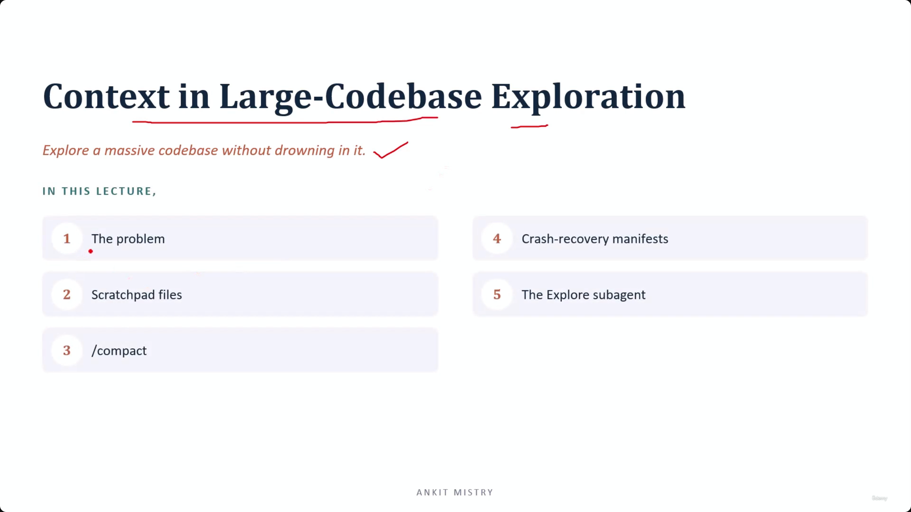
[00:00:37](https://www.udemy.com/course/claude-ai-certification/learn/lecture/57569699#overview)

## Context in Large-Codebase Exploration

- Goal: Explore a massive codebase without drowning in it.
- This involves applying the principles of extracting and persisting information and exploring incrementally.

### Lecture Overview

1. The problem
2. Scratchpad files
3. /compact
4. Crash-recovery manifests
5. The Explore subagent

### The Problem: Context Flooding

- Reading a large codebase fills the context window extremely fast
    - This is driven by the act of reading code files
    - Each file read dumps its entire contents into the context
    - Within just dozens of files, the context window becomes full

### The 'Lost in the Middle' Connection

- Context flooding is an extension of the "lost in the middle" problem
    - Instead of being caused by long conversations, the context is filled by file after file of source code
    - This causes the quality of the model's performance to drop mid-task
- **Mindset vs. Tools**
    - **Mindset (from Domain 2):** The habit of "exploring incrementally" (searching first and reading narrowly)
    - **Tools (this lecture):** The actual technical mechanisms used to maintain context and manage long-term exploration sessions

### Scratchpad Files

- **The core move:** Write your findings to disk rather than relying solely on the chat history
    - Instead of keeping everything in the conversation, save key discoveries to a dedicated file
    - Example: Writing a note like "Auth logic lives in `/auth` folder; bug is located in `login()` function"
- **[Why use this?]** To manage the trade-off between information density and context limits
    - **Disk is unlimited:** You can store an infinite amount of observations and findings
    - **Context is limited:** The chat window will eventually fill up and degrade performance
    - **Selective retrieval:** You only re-read the specific note you need at the moment it becomes relevant, keeping the active context clean

### Extract and Persist Made Literal

- **The Connection:** This is the concrete application of the "extract and persist" principle
    - **Previously (Conceptual):** Extract and persist was an abstract idea/principle
    - **Now (Concrete):** It is a physical file on disk where you literally write down findings
- **Maintaining a "Clean" Context**
    - By writing to a file, you ensure the context window stays lean and focused
    - You avoid the clutter of past observations while retaining the ability to retrieve them exactly when needed

### Compact

- **The Goal:** Summarize the session to continue working past the context limit
- **How it works:** It summarizes the existing conversation and replaces the history with that summary
    - This effectively shrinks the number of tokens being used
    - It allows a long-running task to continue without hitting the 'lost in the middle' degradation
- **[Implementation Strategy]:** Treat it as an active command rather than a passive occurrence
    - **Proactive usage:** Run the command when the context window is roughly 70% to 75% full
    - **Control:** You maintain control over what information is kept in the summary and what is discarded

### Proactive Context Control

- **Maintain Agency:** Do not wait for context degradation to force your hand
    - Don't wait until the model starts hallucinating or losing track of details
    - Instead, treat compaction as a tool you trigger on your own terms to ensure the session remains high-quality

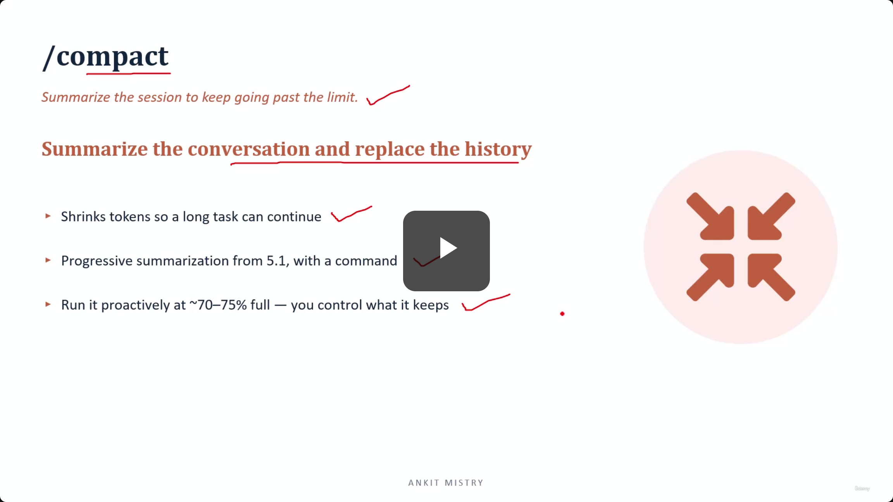
[00:04:24](https://www.udemy.com/course/claude-ai-certification/learn/lecture/57569699#overview)

### Strategic Timing for Compaction

- **Avoid "Compacting in a Panic"**
    - Do not wait until the context window is completely jammed or forced upon you
    - Waiting until the limit is reached reduces your ability to guide what survives
- **Compact at a Natural Break**
    - Trigger the command during a pause between distinct tasks
    - **[Why?]** A clean moment allows you to calmly ensure important findings are safely carried across into the summary

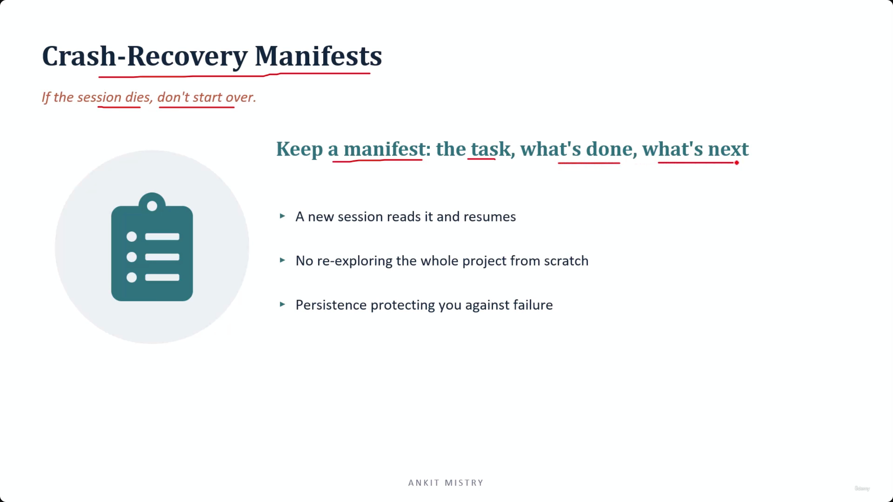
[00:05:23](https://www.udemy.com/course/claude-ai-certification/learn/lecture/57569699#overview)

## Crash-Recovery Manifests

- **The Core Concept:** If a session dies, you don't have to start over
    - A manifest acts as a safeguard against failure through persistence
- **What a Manifest contains:** It is a running log of the project state
    - The current task
    - What has been done
    - What is next
- **[How it enables recovery]:** A new session can read the manifest and resume immediately
    - This eliminates the need to re-explore the entire project from scratch

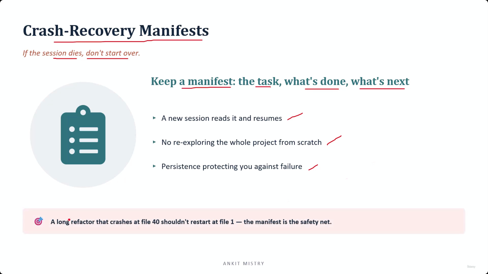
[00:05:59](https://www.udemy.com/course/claude-ai-certification/learn/lecture/57569699#overview)


[00:06:32](https://www.udemy.com/course/claude-ai-certification/learn/lecture/57569699#overview)

### Manifests in Practice

- **The Safety Net:** Prevents losing all progress during long-running tasks
    - **[Example]:** During a massive refactor that crashes at file 40, a manifest allows a new session to pick up at file 41
    - **Without a manifest:** You would have to restart the entire process from file 1, repeating all previous work

## The Explore Subagent

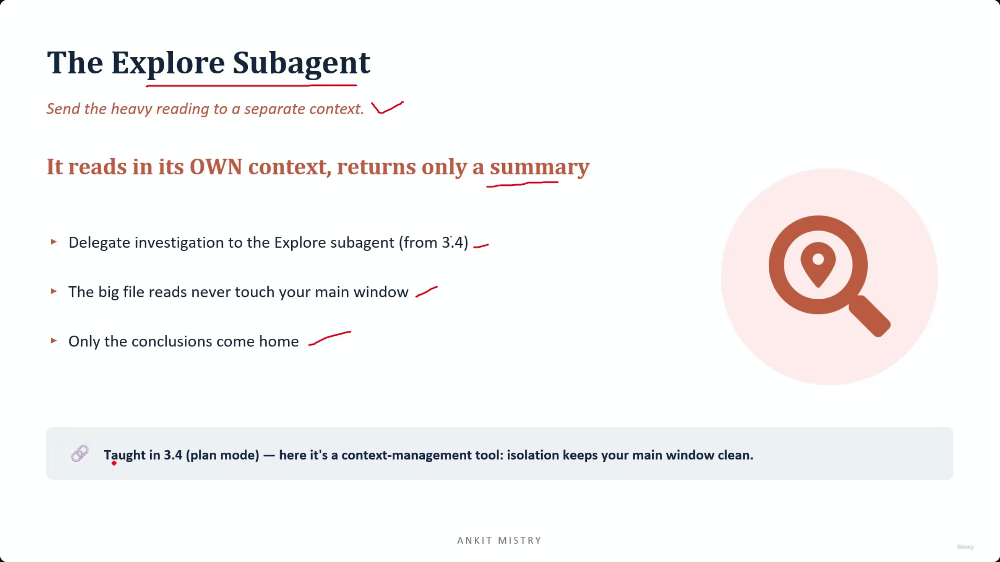
[00:07:20](https://www.udemy.com/course/claude-ai-certification/learn/lecture/57569699#overview)

### Subagent Delegation Mechanics

- **The Core Move:** Send heavy reading to a separate context
    - The subagent reads in its own context and returns only a summary
    - This delegates the investigation process to an isolated environment
- **[Benefit]:** Keeps the main window clean
    - Large file reads never touch your main window
    - Only the tidy conclusions are brought back to the main session
- **Context Management:** It functions as a tool for isolation
    - By isolating heavy reading, it prevents the main context from being overwhelmed by massive amounts of raw data

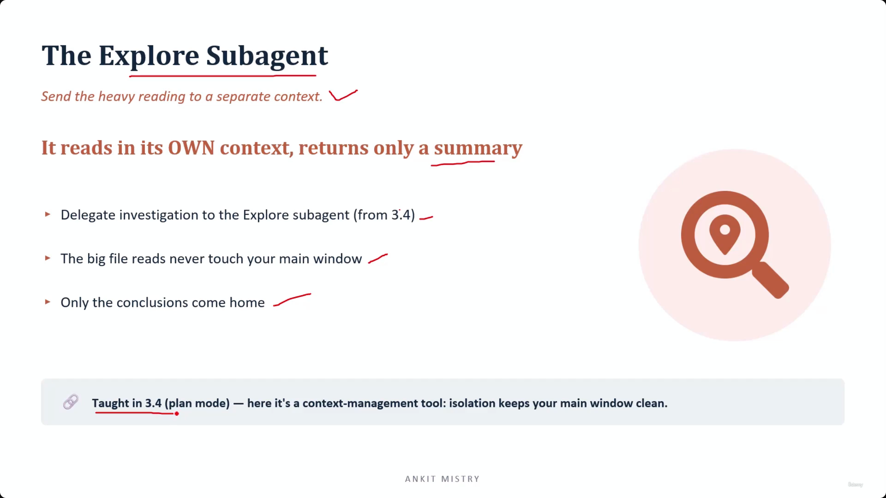
[00:07:22](https://www.udemy.com/course/claude-ai-certification/learn/lecture/57569699#overview)

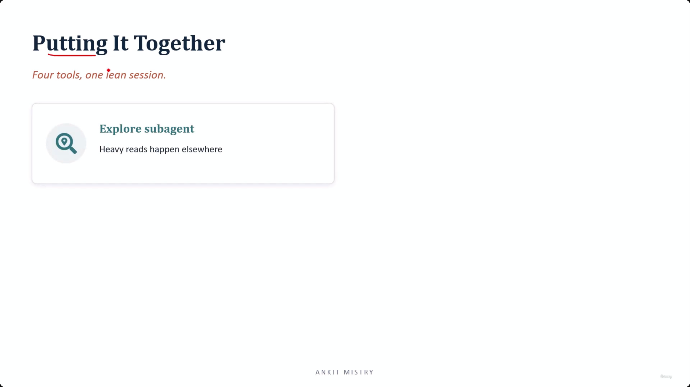
[00:07:59](https://www.udemy.com/course/claude-ai-certification/learn/lecture/57569699#overview)

### The Explore Subagent as a Context Management Tool

- **A Dual Purpose Tool:** While previously used for safe planning (as taught in 3.4), it also serves as a mechanism for isolation
    - **[How it works]:** It acts as a "scout" that performs heavy reading in its own separate context
    - **[The Result]:** This isolation keeps your main window lean and clean by ensuring massive file reads never touch the primary session context

---

## Putting It Together

- **The Goal:** Maintaining one lean session through the use of four specific tools
- **Tool 1: Explore Subagent**
    - Heavy reads happen elsewhere to protect the main context

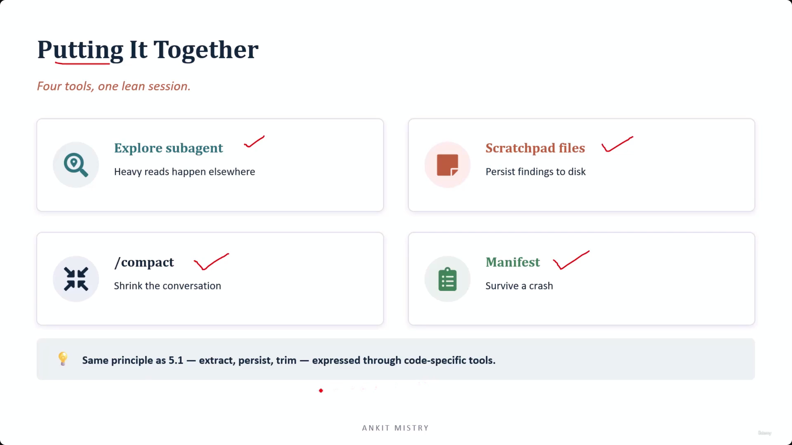
[00:08:46](https://www.udemy.com/course/claude-ai-certification/learn/lecture/57569699#overview)

- **Tool 2: Scratchpad files**
    - Used to persist findings to disk
    - **[Purpose]:** This keeps what you learn out of the active window context
- **Tool 3:&#32;`/compact`**
    - Shrinks the conversation
    - **[Purpose]:** Makes room when the conversation history itself becomes too long
- **Tool 4: Manifest**
    - Serves as a safety net to survive a crash
    - **[Purpose]:** Protects against the session dying

### The Core Principle of Session Management

All four tools follow the same fundamental workflow established in lecture 5.1:

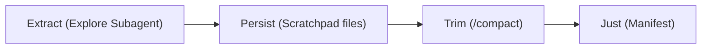


[00:08:52](https://www.udemy.com/course/claude-ai-certification/learn/lecture/57569699#overview)

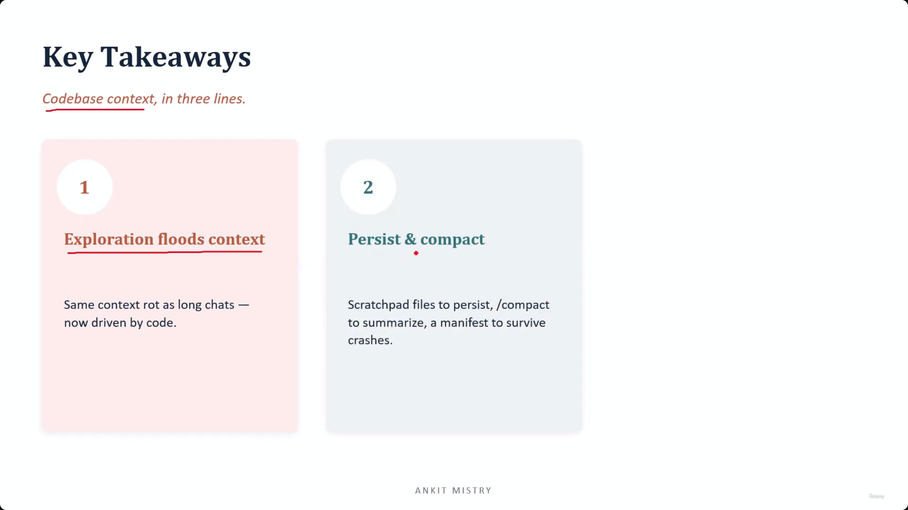
[00:09:34](https://www.udemy.com/course/claude-ai-certification/learn/lecture/57569699#overview)

### Key Takeaways: Codebase Context

- **Exploration floods context:**
    - Code-based exploration causes the same "context rot" seen in long text chats
    - Instead of just long dialogue, the context is overwhelmed by dozens of files and their contents
- **Persist and compact:**
    - Use scratchpad files to persist findings
    - Use `/compact` to summarize and make room

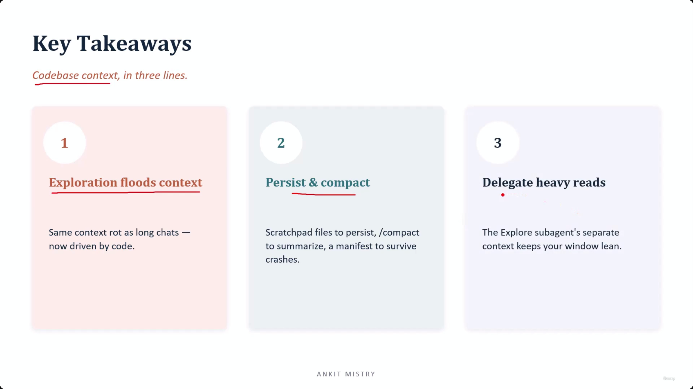
[00:09:49](https://www.udemy.com/course/claude-ai-certification/learn/lecture/57569699#overview)

---

## Simple Explanation (with Claude Examples)

**The core idea, in one line**: Exploring a large codebase floods context just like a long chat does — each file read dumps its full contents in, and within dozens of files the window fills up. Four tools fight this: scratchpad files, `/compact`, crash-recovery manifests, and the Explore subagent.

**Scratchpad files — extract and persist, made literal**

Instead of keeping everything in the chat, write key findings to a file on disk: "Auth logic lives in `/auth`; bug is in `login()`." Disk is unlimited; context is not. You only re-read the specific note when it becomes relevant, keeping the active context lean.

*Claude Code example*: my scratchpad directory in this session (`/private/tmp/claude-501/.../scratchpad`) exists for exactly this — writing intermediate findings to a file instead of keeping every detail live in our conversation forever.

**`/compact` — proactive, not panicked**

Summarizes the conversation and replaces the history with that summary, shrinking token usage. Best practice: trigger it around 70-75% full, at a natural break between tasks — not after the model's already started degrading, when you have less control over what survives.

**Crash-recovery manifests — a safety net**

A running log of current task, what's done, what's next. If a session dies mid-refactor at file 40, a new session reads the manifest and resumes at file 41 — instead of starting the whole thing over from file 1.

**The Explore subagent — heavy reading, elsewhere**

Sends the reading-heavy work to a separate context; only a tidy summary comes back. Large file reads never touch your main window.

*Claude Code example*: this is the exact `Explore` agent I have access to in this session — dispatching it to dig through many files means the raw content never floods our main conversation, only its conclusions do.

**Putting it together — the same extract → persist → trim workflow from the previous note**

```
Explore subagent → heavy reads happen elsewhere
Scratchpad files → persist findings to disk
/compact → shrink the conversation when it's too long
Manifest → survive a crash without losing progress
```

**Recap in 3 lines**

1. **Codebase exploration causes the same "context rot" as long chats** — just from files instead of dialogue.
2. **Scratchpad files persist findings to disk** — unlimited storage, re-read only what's relevant.
3. **`/compact` proactively, and use manifests + the Explore subagent** — control what survives, and never lose progress to a crash.

---

## Exam Objective Note: CCAR-F 5.4 — Codebase Exploration and Context Degradation

**One problem causes almost everything else**

The context window fills up fast, and once it does, quality drops. Exploring a big codebase — reading file after file — is one of the fastest ways to fill it.

**Two fixes that both work**

1. **Send the exploring to a subagent** — it does the heavy reading in its own separate window, and only a short summary comes back to the main conversation, not the whole transcript.
2. **Make the request narrower** — search for exactly what's needed instead of reading broadly.

**One detail worth remembering: what survives `/compact`**

`/compact` swaps out old messages for a summary. A `CLAUDE.md` file at the project's root gets automatically re-added on every request, but a `CLAUDE.md` file in a subfolder does not — it can quietly disappear after compacting.

*Claude Code example*: if a nested `Course-2/CLAUDE.md` set a rule like "always cite the source lecture," that rule could vanish from context after a `/compact`. A rule in the project's top-level `CLAUDE.md` would survive, because it gets re-injected every time.

**Recap in 3 lines**

1. A full context window is the root problem — exploring a large codebase is a fast way to cause it.
2. Delegating to a subagent or narrowing the request both fix it — pick whichever the situation calls for.
3. Root `CLAUDE.md` survives `/compact` automatically; a nested `CLAUDE.md` does not.