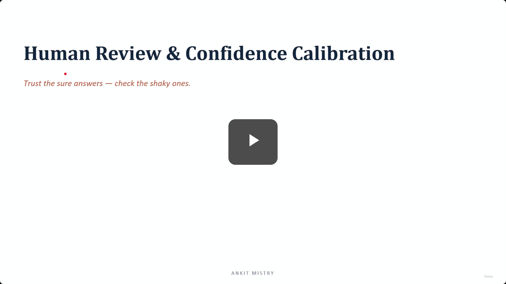
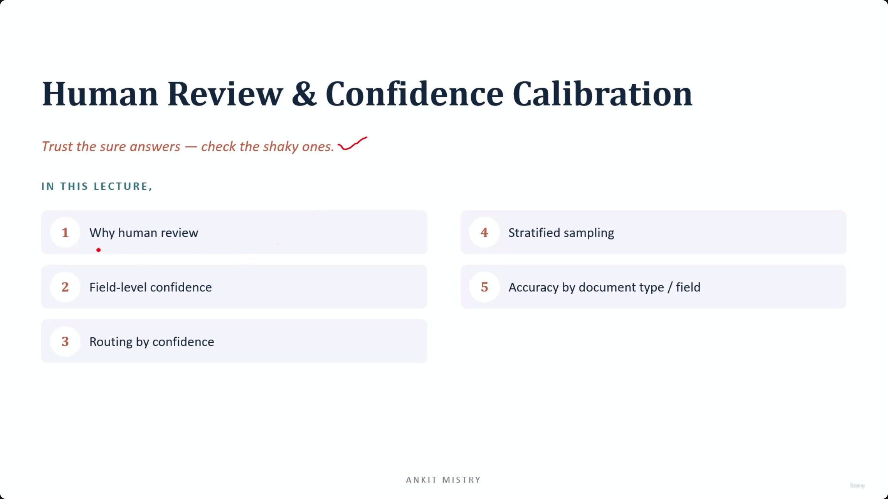
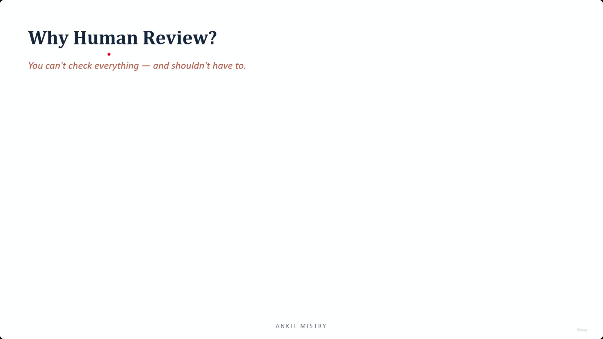
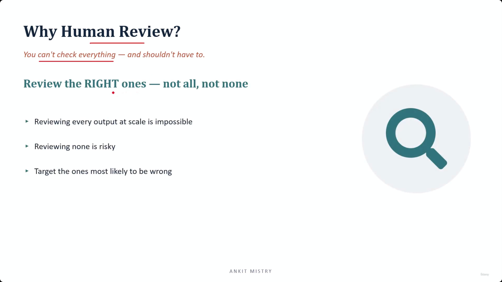
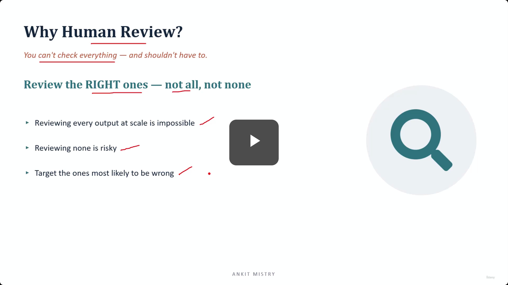
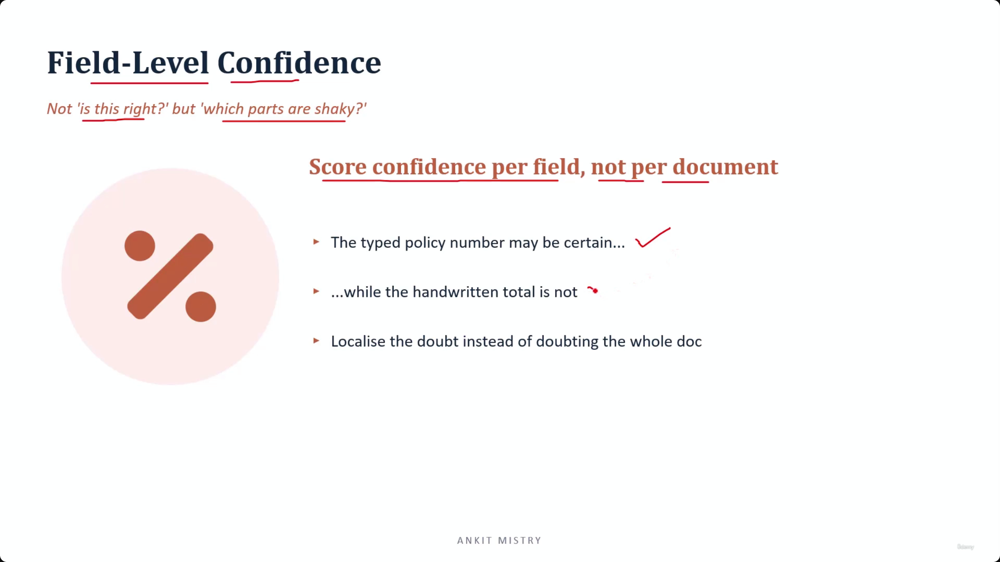
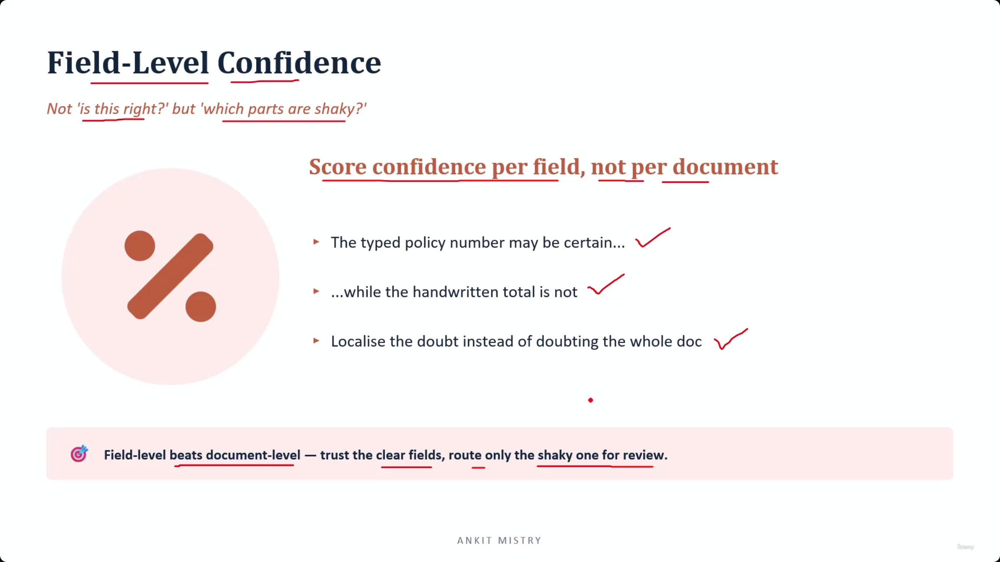
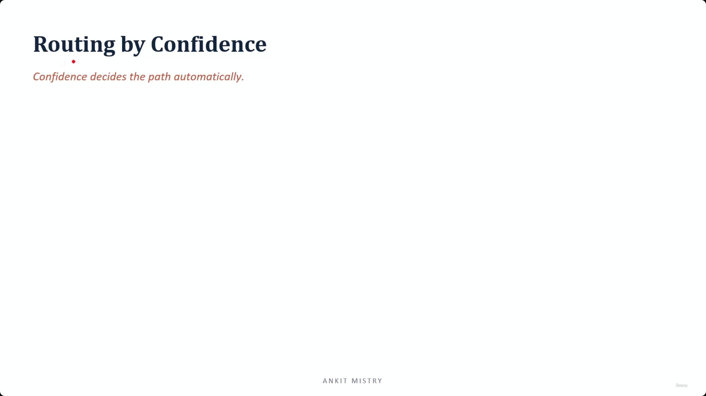

[00:00:14](https://www.udemy.com/course/claude-ai-certification/learn/lecture/57569867#overview)

[00:00:34](https://www.udemy.com/course/claude-ai-certification/learn/lecture/57569867#overview)

[00:00:52](https://www.udemy.com/course/claude-ai-certification/learn/lecture/57569867#overview)

## Human Review & Confidence Calibration

- Goal: Trust the sure answers — check the shaky ones.

### Lecture Roadmap

1. Why human review?
2. Field-level confidence
3. Routing by confidence
4. Stratified sampling
5. Accuracy by document type / field

[00:01:03](https://www.udemy.com/course/claude-ai-certification/learn/lecture/57569867#overview)

### Why Human Review?

- The core tension: You can't check everything, and you shouldn't have to
    - Reviewing every output at scale is impossible
    - Reviewing none is risky
- **The Goal**: Review the RIGHT ones — not all, not none
    - Target the ones most likely to be wrong

[00:01:18](https://www.udemy.com/course/claude-ai-certification/learn/lecture/57569867#overview)

[00:01:18](https://www.udemy.com/course/claude-ai-certification/learn/lecture/57569867#overview)

[00:02:38](https://www.udemy.com/course/claude-ai-certification/learn/lecture/57569867#overview)

### Field-Level Confidence

- The goal is to shift the question from "Is this right?" to "Which parts are shaky?"
- **Score confidence per field, not per document**
    - This localizes doubt instead of doubting the entire document
    - Example: A typed policy number might be certain, while a handwritten total is not

[00:03:26](https://www.udemy.com/course/claude-ai-certification/learn/lecture/57569867#overview)

### The Efficiency of Field-Level Confidence

- **Field-level beats document-level**
    - A document is not binary (simply "right" or "wrong")
    - Some fields are crystal clear while others are genuinely uncertain
- **Granular Routing**
    - You trust the clear fields and route only the shaky ones for review
    - **[Why this matters]** It saves significant effort: if one field is uncertain, you don't need a human to recheck the whole page—you only send them that specific shaky field

[00:03:30](https://www.udemy.com/course/claude-ai-certification/learn/lecture/57569867#overview)

[00:03:36](https://www.udemy.com/course/claude-ai-certification/learn/lecture/57569867#overview)

### Routing by Confidence

- Confidence decides the path automatically
- **[The Routing Rule]**
    - High confidence $\rightarrow$ Auto-accept
    - Low confidence $\rightarrow$ Human review
- **[Why this works]**
    - The confidence score acts as a switch
    - Obvious, high-confidence cases are processed automatically without bothering anyone
    - Human time is strictly reserved for the uncertain cases

### Evolution of the Routing Concept

- This is an expansion of the routing idea introduced in lecture 4.6
    - In 4.6, confidence determined whether to auto-apply findings or send them to a human
    - In this context, it has grown into the backbone and central engine of the entire review workflow

### Stratified Sampling

- (Topic introduced: Ad sampling)

### Spot-Checking Confidence Bands

- **[The Strategy]** Sample across every confidence band (high, medium, and low)
    - Instead of just reviewing low-confidence items, you take a smart sample from all levels
- **[Why this is necessary]** To catch "confidently wrong" outputs
    - If you only review low-confidence items, you are operating on the assumption that a high score always equals correctness
    - **The Risk**: If the model is confidently wrong, those errors will slip through the system entirely without a spot check
- **[The Goal]** To validate the reliability of the confidence scores themselves by ensuring the high-confidence "clear" path is actually accurate

### Accuracy by Document Type and Field

- **The core objective**
    - Accuracy is not uniform across an entire system
    - Performance varies depending on the specific type of document being processed
    - Performance also varies depending on the specific field being extracted

### Optimizing Review via Weakness Mapping

- **[The Strategy]** Track accuracy at two granular levels:
    - **By Document Type**: Recognizing that certain formats (e.g., handwritten forms) are inherently more difficult.
    - **By Field**: Recognizing that some specific data points are consistently harder to extract than others.
- **[Practical Application]**
    - For fields or document types identified as "error-prone": Route them for human review more aggressively.
    - For fields that are consistently correct: Relax the review requirements to save time and resources.
- **[The Feedback Loop]**
    - Your human review data serves as a "map of weaknesses."
    - **[Why this matters]** This map tells you exactly where the system is failing, allowing you to feed that intelligence back into the system to tighten performance in those specific weak spots.

### The Continuous Improvement Loop

- **[The Mechanism]** Every human review acts as a data point that reveals specific model struggles
    - Review data is used to identify exactly where errors cluster
    - This intelligence is used to "aim" the next round of human review more precisely at those specific weak spots
- **[The Result]** The system becomes smarter about its own limitations over time

---

### Summary: Human Review and Confidence

- **Targeted Review**: Review the right outputs—not all (which is impossible at scale) and not none (which is too risky)
    - Focus efforts on the outputs most likely to be incorrect
- **Confidence as a Guide**: Use confidence scores to route work, but validate them through stratified sampling to ensure the system isn't "confidently wrong"