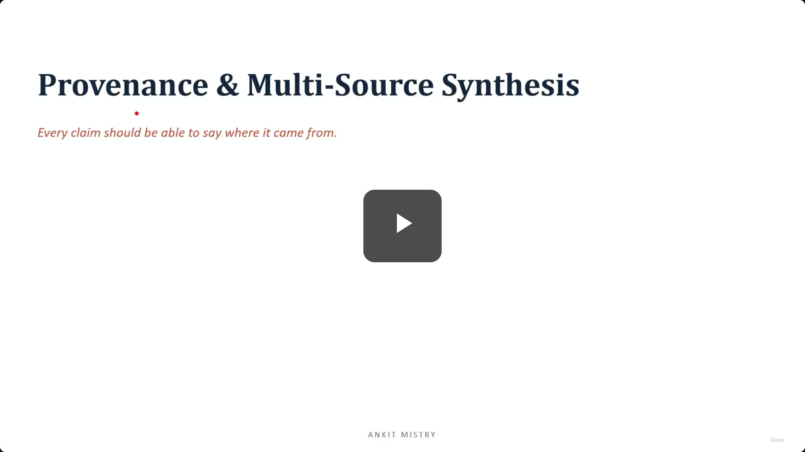

## Provenance & Multi-Source Synthesis

- **Core Principle**: Every claim should be able to say where it came from.
- **Lecture Roadmap**:
    - The problem
    - Claim source mapping
    - Conflict annotation and uncertainty

### The Problem: Loss of Attribution

- **The Core Issue**: Facts lose their connection to their original sources during the blending process.
- **The Synthesis Trap**: When 10 different sources are merged into one smooth, flowing report, the "seams" between them disappear.
- **Consequences of Seamless Synthesis**:
    - **Loss of Mapping**: It becomes impossible to tell which specific source backed which specific claim.
    - **Unverifiability**: Once attribution is lost, you cannot verify if a claim was actually stated by a source or if it was fabricated.
    - **Checkability Failure**: If the model (e.g., Claude) presents a unified answer without preserving source boundaries, the user loses the ability to audit the information.

### The Danger of Polished Prose

- **The Hallucination Problem**: In a seamless, flowing report, a hallucinated claim and a genuine fact from a real source look exactly the same.
- **[Why it matters]**: Without provenance, there is no way to tell them apart because the "seams" that would reveal a lack of evidence have been smoothed over.

### Claim Source Mapping

- **The Solution**: Every individual claim must be explicitly tied to the specific source it originated from.
- **Goal**: To ensure that even within a synthesized answer, the connection to the original evidence remains intact.

### Structured Attribution

- **The Mechanism**: Every individual fact in a synthesized report carries a specific tag or link pointing back to its exact origin.
- **[Analogy]**: It functions like citations, where each claim is "stapled" to its source.
- **Goal: Auditability**
    - This approach makes the entire synthesis auditable.
    - Because the claim and the source are kept together, any user can verify a single claim by following its link straight to the original evidence.
- **Connection to Previous Concepts**
    - This concept echoes the "structured handbag" approach discussed in previous lectures, where information is kept in a organized, paired format rather than being loosely dumped together.

### The Instinct of Structured Packaging

- **The Pattern**: Just as subagents keep an error and its context together as a single unit, synthesis must keep a claim and its source bound together.
- **[Why it matters]**: This ensures that information never loses its origin as it moves through different stages of processing.

### Conflict Annotation and Uncertainty

- **The Core Rule**: When sources disagree, you must say so; you do not average the results.
- **The Approach**: Instead of finding a middle ground that might not represent any real source, the goal is to:
    - Surface the disagreement directly.
    - Flag information that is shaky or uncertain.

### Temporal Framing

- **The Principle**: Old facts and new facts are not the same fact.
- **The Mechanism**: You must track and label the timing of information to provide context on its recency.
    - For example, a figure from 2019 and a figure from 2026 are not equally current.
- **[Why it matters]**: Without temporal labeling, the synthesis might treat outdated data as being just as valid as the most recent data, leading to a misleading conclusion.
- **Goal**: To ensure the reader understands the relative currency and relevance of the information being presented.

### Summary of Provenance & Multi-Source Synthesis

- **Core Principle 1: Maintain Claim-to-Source Mapping**
    - Merging multiple sources naturally risks losing attribution.
    - To prevent this, every individual fact must point back to its origin.
    - **[The Risk]**: An unsourced claim is essentially unverifiable and cannot be checked for accuracy.
- **Core Principle 2: Surface Conflict and Doubt**
    - Avoid the temptation to "blend away" disagreements or average out conflicting data.
    - Instead, the synthesis must:
        - Explicitly show disagreements alongside their respective sources.
        - Flag claims that carry low certainty or high uncertainty.
    - **[The Goal]**: To provide an honest representation of the available information rather than a polished but misleading consensus.

### Course Completion Overview

With the conclusion of Domain 5, the following core competencies have been covered:

- **Domain 1**: Architecting agent teams.
- **Domain 2**: Designing tools and connecting them via MCP (Model Context Protocol).
- **Domain 3**: Configuring and automating cloud code.
- **Domain 4**: Managing and refining output.
- **Domain 5**: Provenance & Multi-Source Synthesis.

### The Architect's Craft

- **The Ultimate Objective**: Moving beyond building systems that are merely "clever" to building systems that are:
    - **Reliable**: They perform consistently.
    - **Honest**: They maintain provenance and surface uncertainty.
    - **Production-ready**: They are robust enough for real-world deployment.