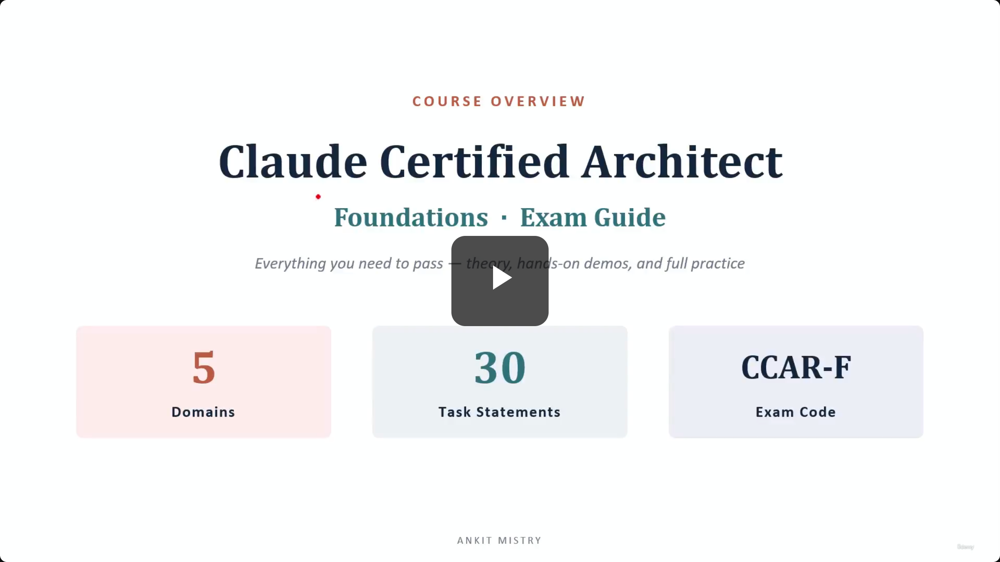

## Claude Certified Architect Foundations & Exam Guide

- **Course Promise**
    - Covers everything needed to pass: theory, hands-on demos, and full practice
- **Exam Framework**
    - 5 Domains
    - 30 Task Statements
    - Exam Code: `CCAR-F`

## About the Exam

### Exam Format

- **Logistics**
    - 60 items
    - 120 minutes
    - This averages out to 2 minutes per question
- **Question Style**
    - 4 of the 6 question types are scenarios
    - **[Note]** Most questions describe a specific situation and ask for the appropriate course of action
- **Passing Score**
    - 720 out of 1000

### Domain Weighting

| # | Domain | Weight |
| --- | --- | --- |
| 1 | Agentic Architecture & Orchestration | 27% |
| 2 | Tool Design & MCP Integration | 18% |
| 3 | Claude Code Configuration & Workflows | 20% |
| 4 | Prompt Engineering & Structured Output | 20% |
| 5 | Context Management & Reliability | 15% |

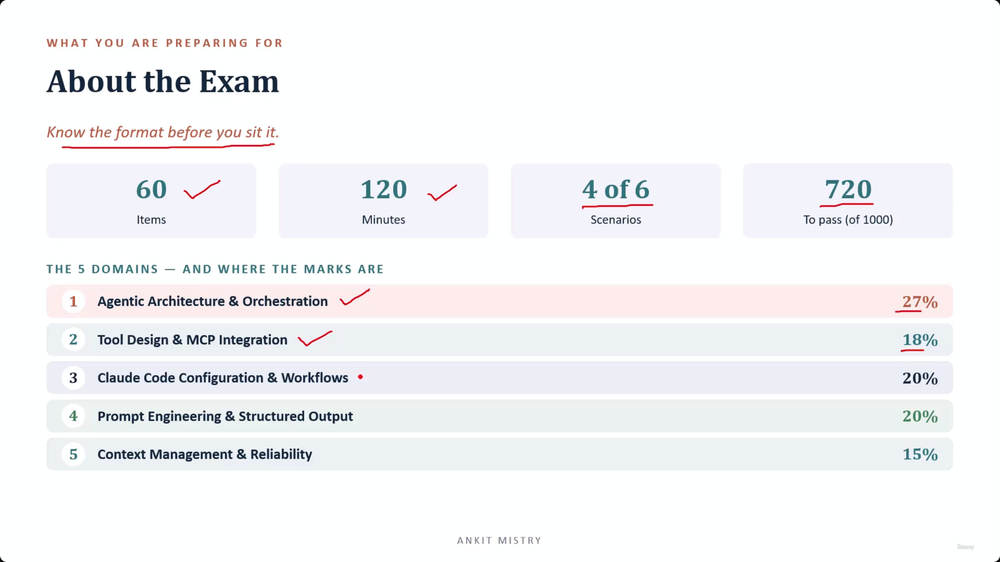
[00:01:28](https://www.udemy.com/course/claude-ai-certification/learn/lecture/57913477#overview)

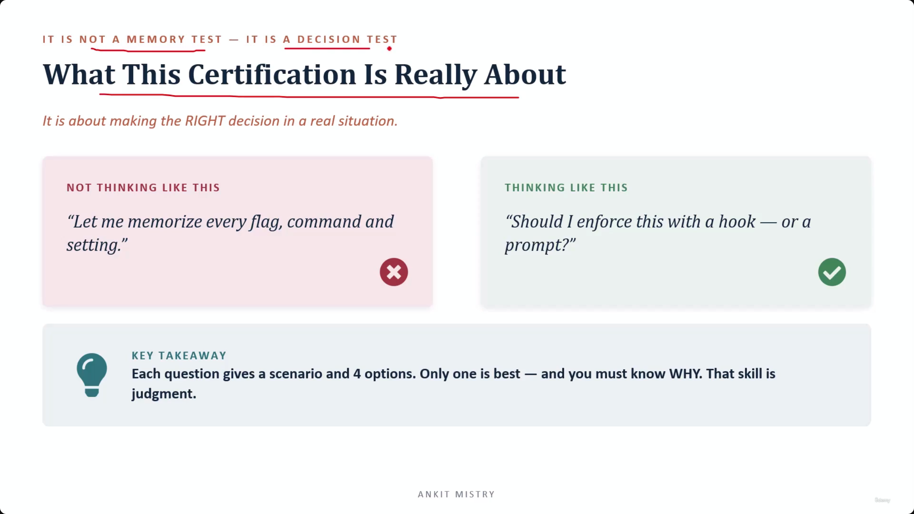
[00:02:08](https://www.udemy.com/course/claude-ai-certification/learn/lecture/57913477#overview)

### Domain Weighting (Continued)

- Domain 3: Claude Code Configuration & Workflows (20%)
- Domain 4: Prompt Engineering & Structured Output (20%)
- Domain 5: Context Management & Reliability (15%)
- **[Key Insight]** Domain 1 is the largest single portion (27%), but no domain is small enough to be ignored, as even the lightest is 15%

### The Nature of the Certification

- It is a decision test, not a memory test
    - The goal is making the right decision in a real-world situation
- **Key Takeaway**
    - Each question presents a scenario with 4 options
    - Only one is the best choice
    - Success requires knowing *why* that specific choice is superior, which is the skill of judgment

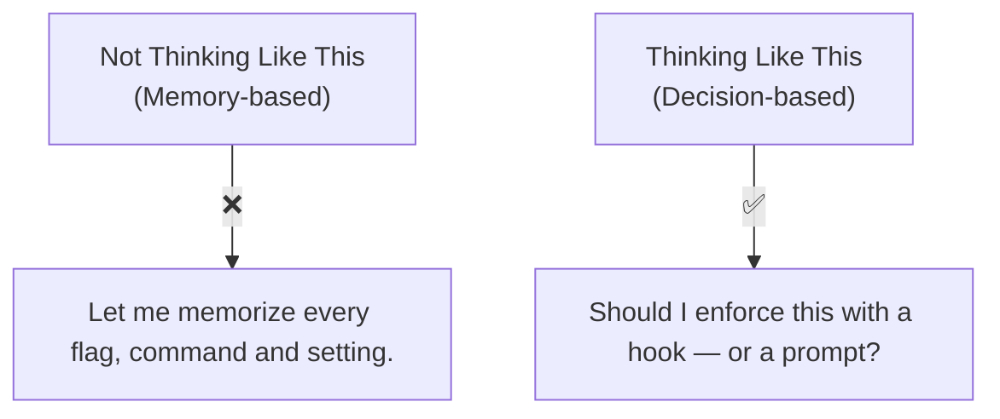

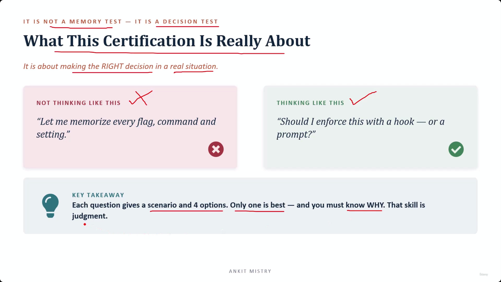
[00:02:59](https://www.udemy.com/course/claude-ai-certification/learn/lecture/57913477#overview)

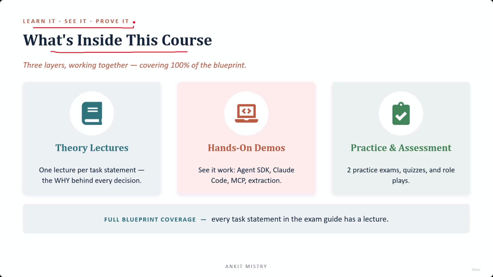
[00:03:17](https://www.udemy.com/course/claude-ai-certification/learn/lecture/57913477#overview)

### The Skill of Judgment

- The core goal is developing **judgment**
    - This means having the ability to look at a situation and pick the best course of action
    - It is about understanding the "why" behind decisions rather than just reciting facts

### Course Structure: Learn It, See It, Prove It

- The course uses three layers to cover 100% of the exam blueprint
- **Layer 1: Theory Lectures**
        - Provides one lecture per task statement
        - Focuses on the reasoning (the "why") behind every decision
- **Layer 2: Hands-On Demos**
        - "See it work"
        - Covers topics like Agent SDK, Claude Code, MCP, and extraction
- **Layer 3: Practice & Assessment**
        - "Prove it"
        - Includes 2 practice exams, quizzes, and role plays

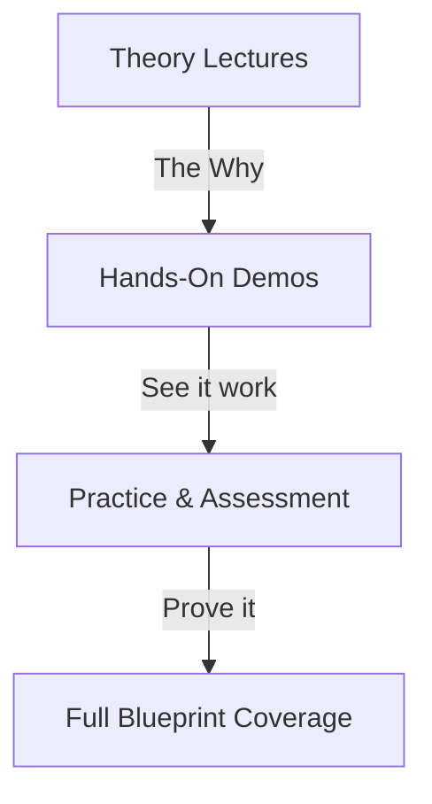

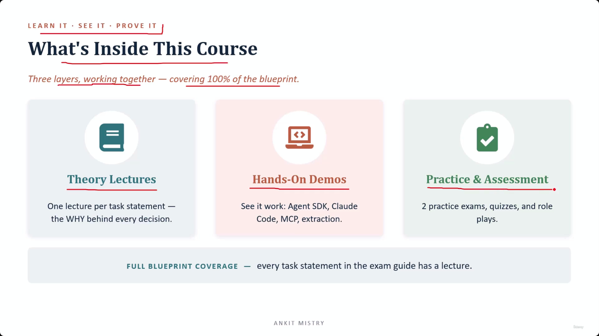
[00:04:00](https://www.udemy.com/course/claude-ai-certification/learn/lecture/57913477#overview)

### How to Get the Most Out of This Course

- **Recommended Study Path**
    - Follow this specific sequence to ensure each step builds on the last:

    1. **Watch the theory in order**

        - The lectures are sequential and build on each other

    1. **Do the hands-on demos**

        - Seeing the concepts run turns knowledge into actual understanding

    1. **Take the quizzes & role plays**

        - Use these to check your grasp domain by domain and practice making judgment calls

    1. **Save the practice exams for last**

        - Treat these as a real dress rehearsal, then review every wrong answer
- **[Pro-tip]** Keep the official exam guide open beside you — it is your map, and the course follows it

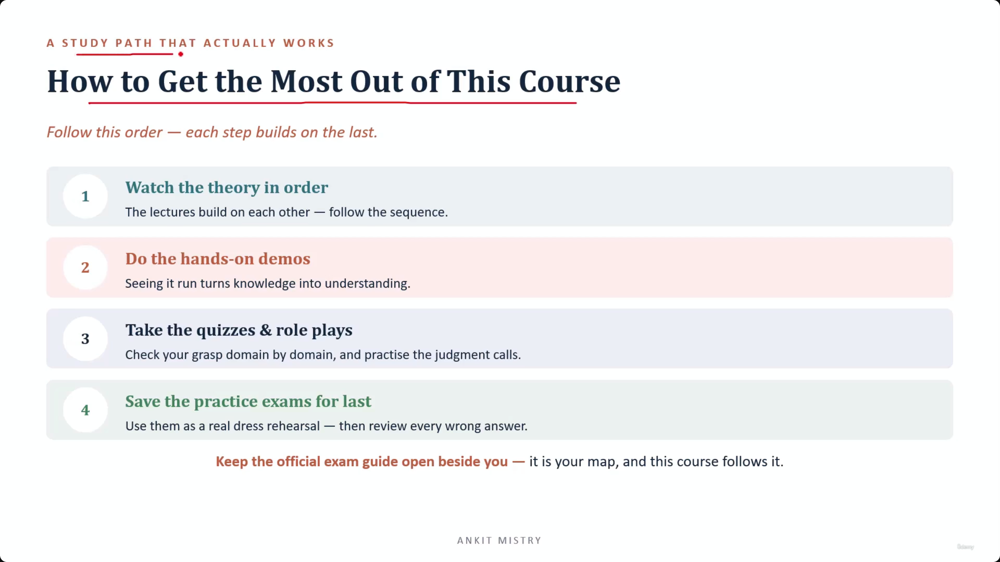
[00:04:28](https://www.udemy.com/course/claude-ai-certification/learn/lecture/57913477#overview)

### How to Get the Most Out of This Course

- **Recommended Study Path**
    - Follow this specific order because each step builds on the last:

    1. **Watch the theory in order**

        - Lectures build on each other; in Domain 1, almost every lecture leans on the one before it

    1. **Do the hands-on demos**

        - Seeing it run turns knowledge into understanding

    1. **Take the quizzes & role plays**

        - Use these to check your grasp domain by domain and practice making judgment calls

    1. **Save the practice exams for last**

        - Use them as a real dress rehearsal, then review every wrong answer
- **Pro-tip**
    - Keep the official exam guide open beside you — it is your map, and the course follows it

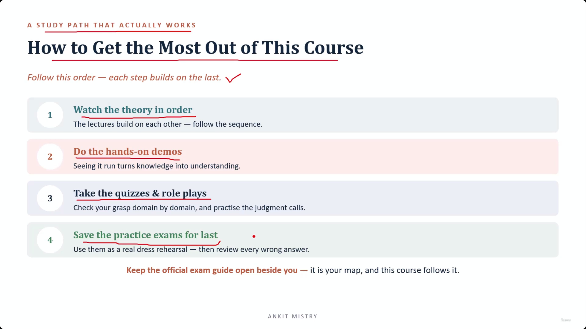
[00:05:13](https://www.udemy.com/course/claude-ai-certification/learn/lecture/57913477#overview)

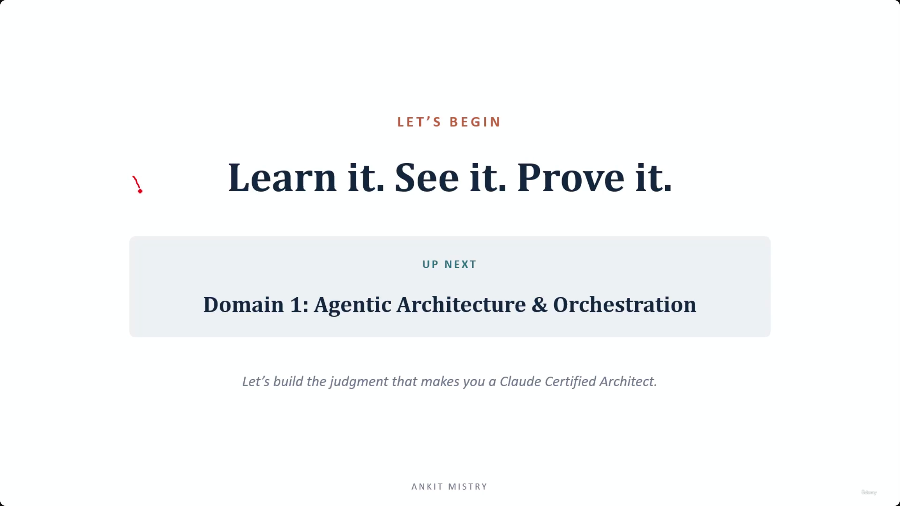
[00:05:38](https://www.udemy.com/course/claude-ai-certification/learn/lecture/57913477#overview)

### Domain 1: Agentic Architecture & Orchestration

- This is the largest domain on the exam

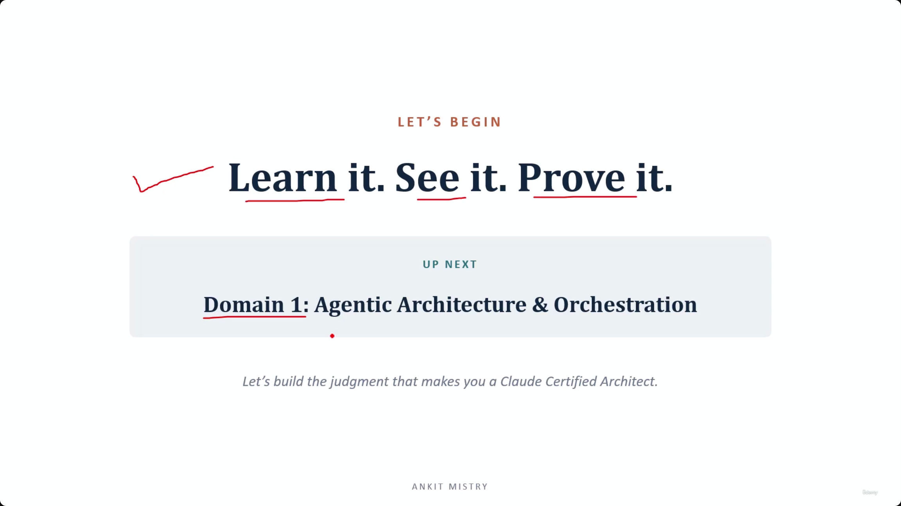
[00:06:01](https://www.udemy.com/course/claude-ai-certification/learn/lecture/57913477#overview)

### Course Motto & Next Steps

- **Motto**
    - Learn it, See it, Prove it
- **Up Next**
    - Domain 1: Agentic Architecture & Orchestration
    - This is the largest domain on the exam