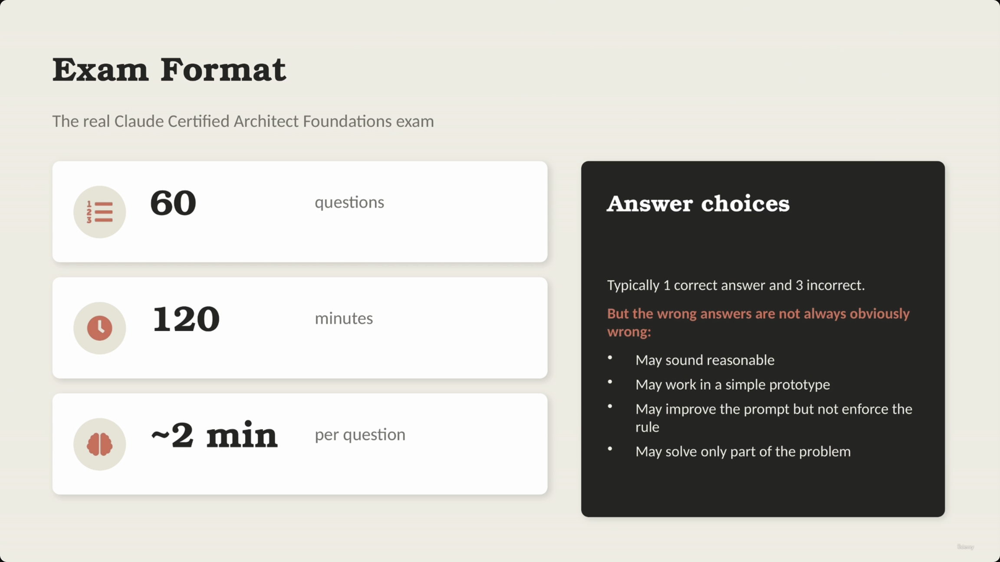
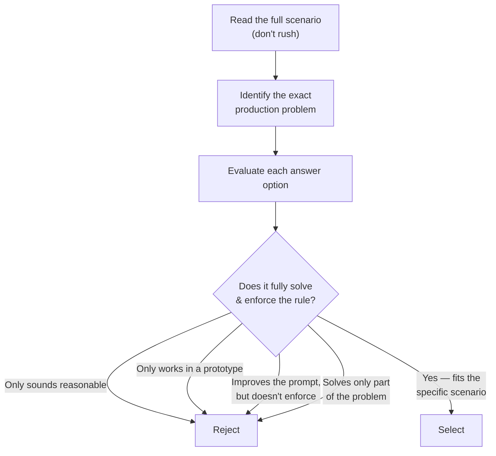
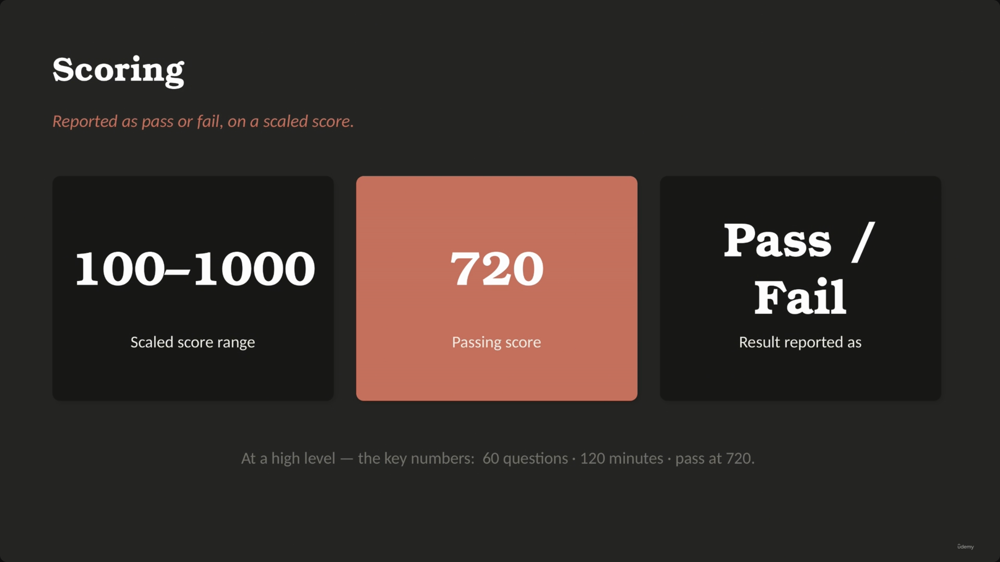
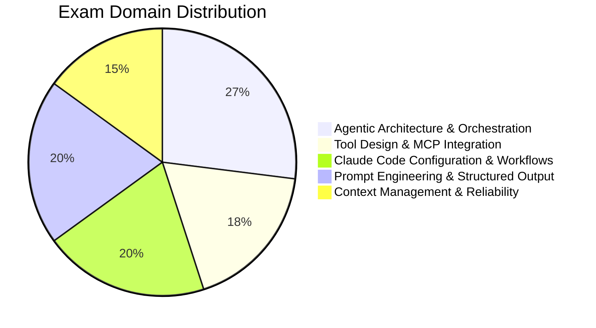
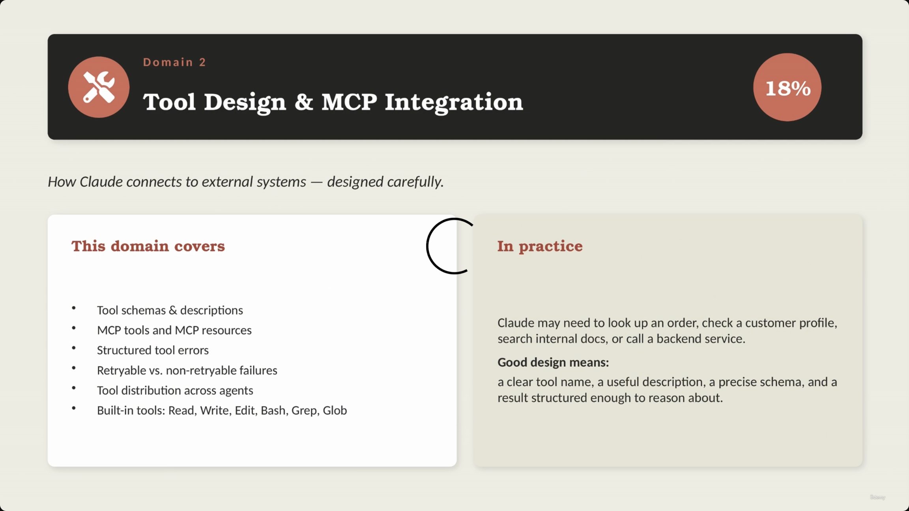
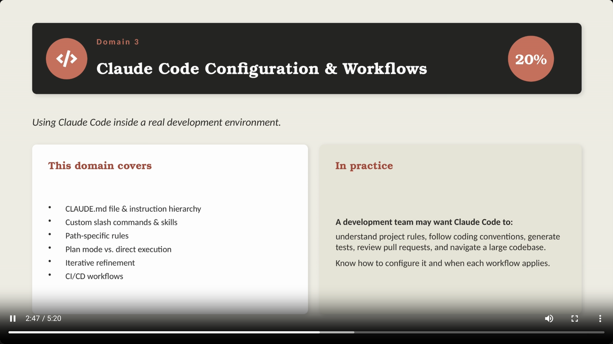
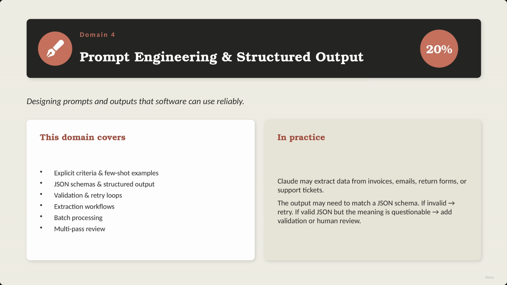

# Claude Certified Architect Foundations — Exam Format

> This lecture covers the logistics of the real exam and the practice exam, how scoring works, and how the exam content breaks down across five domains. The recurring theme: the exam is scenario-driven, not definition-driven — wrong answers are often *plausible*, not obviously wrong.

## Exam Logistics

- **60 questions total**
- **120 minutes** to complete
- **~2 minutes per question**, on average
- **Answer structure:** typically **1 correct answer and 3 incorrect answers**
- **[Caution]** Incorrect answers are not always obviously wrong. They may:
  - Sound reasonable
  - Work in a simple prototype
  - Improve the prompt but not enforce the rule
  - Solve only part of the problem

> **Transcript color:** "When you read an exam question, do not rush. Read the full scenario. Pay attention to the exact problem. And then choose the answer that best fits the production situation described in the question."

### How to approach a question

---

## The Practice Exam

- Available **after registration**
- **[Purpose]** Useful for reviewing style, terminology, and specific topics
- Based on the instructor's experience, it is **easier than the real exam** — not a perfect difficulty simulation

| Feature | Real Exam | Practice Exam |
|---|---|---|
| Questions | 60 | 60 |
| Time Limit | 120 minutes | 90 minutes |
| Difficulty | Requires careful reading and strong scenario understanding | Easier than the real exam |

**Useful for:**
- Getting familiar with question style
- Checking terminology
- Identifying topic areas that require more review

- **[Caution]** If the practice exam feels easy, remember the real exam requires more careful reading and deeper scenario understanding

> **Transcript color:** "I would not treat it as a perfect simulation of the real exam difficulty... if the practice exam feels comfortable, remember that the real exam may still require more careful reading and stronger understanding of the scenarios."

---

## Scoring

- Results are reported as a simple **Pass / Fail**
- The score is calculated on a **scaled range from 100 to 1000**
- **Passing score: 720**

| Metric | Value |
|---|---|
| Scaled score range | 100–1000 |
| Passing score | 720 |
| Result format | Pass / Fail |

---

## Exam Content Domains

The exam content is divided into five main domains:

### Domain 1 — Agentic Architecture & Orchestration (27%)

- The **largest domain** on the exam
- **Core topics:**
  - Agentic loops
  - Multi-agent systems
  - Orchestration
  - Coordinator and sub-agent patterns
  - The Task tool, and hooks
  - Session state
  - Resumption
  - Workflow design
- **[In simple terms]** This domain focuses on how Claude-based systems perform multi-step work

> **Transcript color:** "In simple terms, this domain is about how cloud-based systems perform multi-step work."

*Note: no dedicated title-card screenshot exists for Domain 1 — the capture tool appears to have skipped straight from the domains pie chart to the Domain 2 slide (see below).*

---

### Domain 2 — Tool Design & MCP Integration (18%)

- **[Purpose]** Focuses on how Claude connects to external systems, designed carefully
- **This domain covers:**
  - Tool schemas & descriptions
  - MCP tools and MCP resources
  - Structured tool errors
  - Retryable vs. non-retryable failures
  - Tool distribution across agents
  - Built-in tools: `Read`, `Write`, `Edit`, `Bash`, `Grep`, `Glob`

> **[Slide detail]** The "In practice" panel gives a concrete example not spoken in the transcript or written in the original bullets: *"Claude may need to look up an order, check a customer profile, search internal docs, or call a backend service. Good design means: a clear tool name, a useful description, a precise schema, and a result structured enough to reason about."*

---

### Domain 3 — Claude Code Configuration & Workflows (20%)

- **[Purpose]** Focuses on using Claude Code inside a real development environment
- **Core topics:**
  - `CLAUDE.md` file & instruction hierarchy
  - Custom slash commands & skills
  - Path-specific rules
  - Plan mode vs. direct execution
  - Iterative refinement
  - CI/CD workflows

> **[Slide detail]** The "In practice" panel adds framing not in the transcript or original bullets: *"A development team may want Claude Code to: understand project rules, follow coding conventions, generate tests, review pull requests, and navigate a large codebase. Know how to configure it and when each workflow applies."*

---

### Domain 4 — Prompt Engineering & Structured Output (20%)

- **[Core Focus]** Designing prompts and outputs that software can use reliably — not just "writing better prompts"
- **Core topics:**
  - Explicit criteria & few-shot examples
  - JSON schemas & structured output
  - Validation & retry loops
  - Extraction workflows
  - Batch processing
  - Multi-pass review
- **[In Practice]** Designing for reliability:
  - Example: extracting data from invoices, emails, return forms, or support tickets
  - The output must match a JSON schema
  - If the JSON is invalid → retry
  - If the JSON is valid but the meaning is questionable → add validation or human review

*(The slide's example list includes "return forms" — a minor addition not present in the original slide-note bullets.)*

---

### Domain 5 — Context Management & Reliability (15%)

- **[Purpose]** Focuses on keeping Claude-based systems reliable over time
- **Core topics:**
  - Conversation context & critical facts
  - Context degradation
  - Escalation patterns & error propagation
  - Large codebase exploration
  - Human review
  - Confidence calibration, provenance & uncertainty
- **[In Practice]** Managing the limitations of long-term interaction:
  - Long conversations can become difficult to manage
  - Critical facts may need to live outside the immediate conversation history
  - Sub-agents may return incomplete results, and external tools may fail
  - **[Strategy]** Certain cases should be routed to a human rather than being handled automatically

> **Transcript color:** "This domain is about designing systems that remain useful and safe, even when the workflow becomes complex."

---

## Quick comparison

| Domain | % of exam | Focus |
|---|---|---|
| **1. Agentic Architecture & Orchestration** | 27% | How Claude-based systems perform multi-step work |
| **2. Tool Design & MCP Integration** | 18% | How Claude connects to external systems |
| **3. Claude Code Configuration & Workflows** | 20% | Using Claude Code in a real dev environment |
| **4. Prompt Engineering & Structured Output** | 20% | Designing prompts/outputs software can use reliably |
| **5. Context Management & Reliability** | 15% | Keeping Claude-based systems reliable over time |

---

## Lesson Summary

### Key exam numbers

| Metric | Real Exam | Practice Exam |
|---|---|---|
| Total Questions | 60 | 60 |
| Time Limit | 120 min | 90 min |
| Passing Score | 720 | N/A |

### Exam application approach

- **[Key Insight]** The exam avoids testing isolated definitions — instead, it connects technical topics to realistic production situations.
- **[Next Steps]** The next lesson analyzes official production scenarios and maps them back to these five exam domains.

> **Transcript color:** "The exam does not present these topics only as isolated definitions. It connects them to realistic production situations. And that is where the official production scenarios become important."

---

*Sources: [slide notes](../01-Exam-Format.md) · [[hover-notes-transcripts/01-Exam Format (transcript)|full transcript]]*
