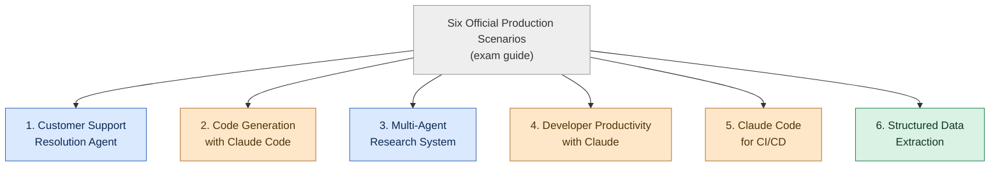
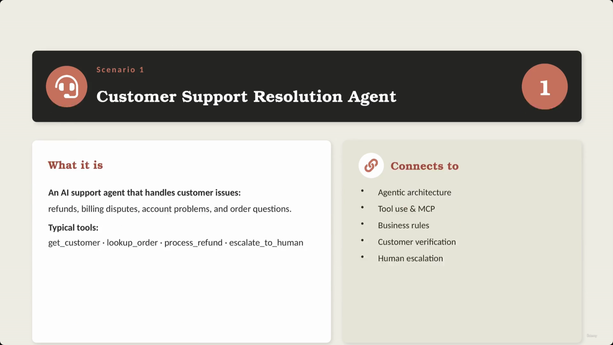
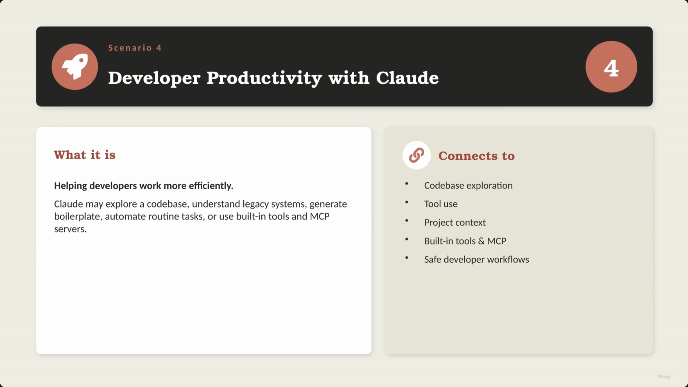
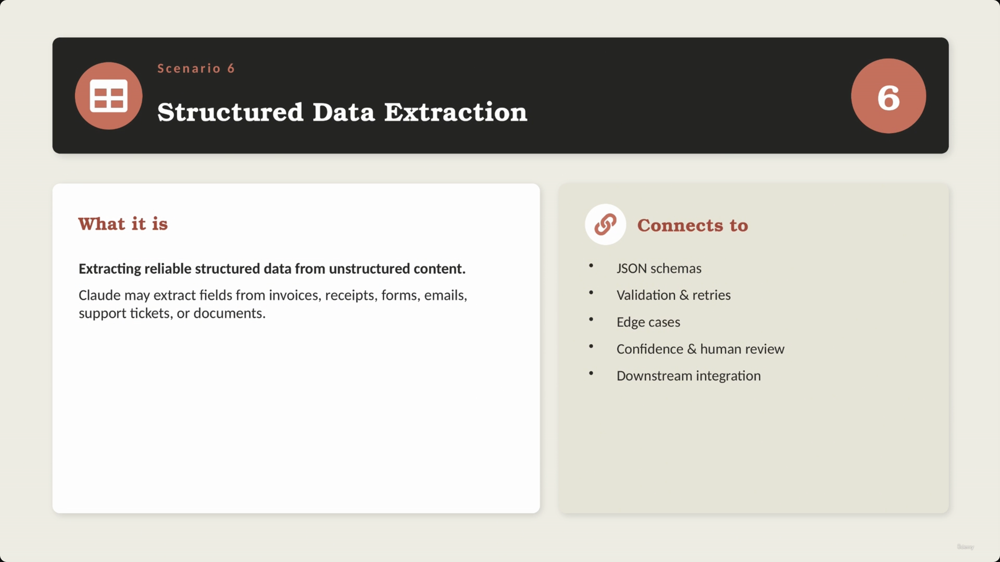
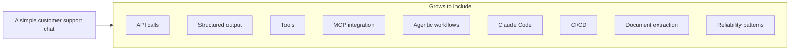
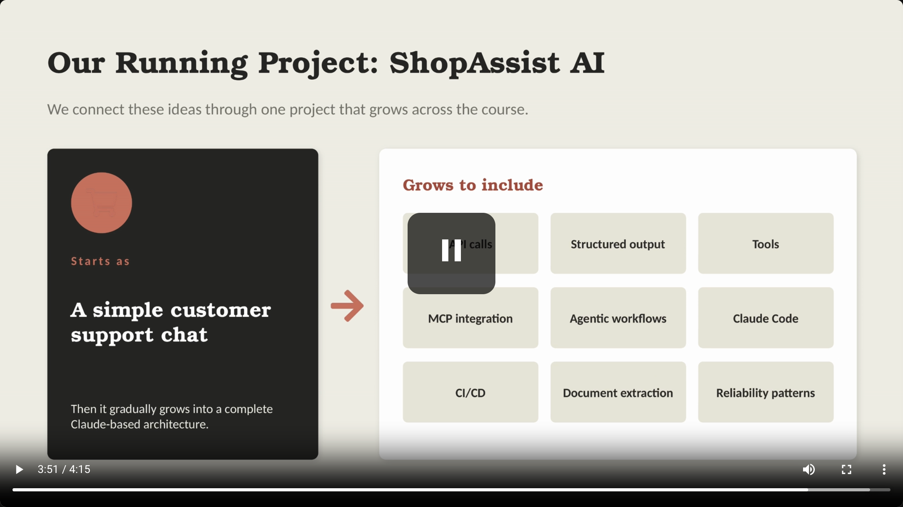

# Six Official Production Scenarios

> The official exam guide anchors the whole course in six production scenarios. Each one shows how exam topics (agents, tools, MCP, Claude Code, structured output) actually show up inside a real cloud-based system — and, as the closing section makes explicit, no single scenario is isolated: they all blend multiple exam domains together.

## Overview: the six scenarios

**Reading it:** two scenarios (1, 3) are agentic-workflow shaped; three (2, 4, 5) center on Claude Code as a developer/CI tool; one (6) is a pure structured-output/extraction problem. The exam mixes all three shapes because production systems mix all three.

---

## 1. Customer Support Resolution Agent

- An AI support agent designed to handle various customer issues:
  - Refunds
  - Billing disputes
  - Account problems
  - Order questions
- **Typical tools used:**
  - `get_customer`
  - `lookup_order`
  - `process_refund`
  - `escalate_to_human`
- **[Connects to]** Agentic architecture, tool use & MCP, business rules, customer verification, human escalation.

> **Transcript color:** "The first scenario is customer support resolution agent... an AI support agent that handles customer issues such as refunds, billing disputes, account problems, and order questions."

---

## 2. Code Generation with Claude Code

- Using Claude Code to perform various software development tasks:
  - Code generation
  - Refactoring
  - Debugging
  - Documentation
  - Test creation
- **[Configuration Layer]** Includes specific elements for controlling and guiding the tool:
  - `CLAUDE.md` & project instructions
  - Custom slash commands
  - Plan mode
  - Direct execution

---

## 3. Multi-Agent Research System

- A system where multiple agents work together to complete complex tasks:
  1. One agent searches for information
  2. Another agent analyzes documents
  3. Another agent synthesizes findings
  4. Another agent generates the final report
- **[Connects to]** Orchestration, context passing, citations & provenance, handling incomplete or conflicting information.

> **Transcript color:** "This scenario is about a system where multiple agents work together... [it] connects to orchestration, context passing, citations, provenance, and handling incomplete or conflicting information."

*(No distinct slide screenshot was captured for this scenario — the capture jumped from the Scenario 2 recap directly to the Scenario 4 slide while this scenario was being narrated. Content here is reconstructed from the slide-note bullets and transcript.)*

---

## 4. Developer Productivity with Claude

- Focused on helping developers work more efficiently by:
  - Exploring codebases
  - Understanding legacy systems
  - Generating boilerplate
  - Automating routine tasks
  - Using built-in tools and MCP servers
- **[Connects to]** Codebase exploration, tool use, project context, built-in tools & MCP, safe developer workflows.

> **Transcript color:** narration lists "code base exploration, tool use, project context, and safe developer workflows" — it skips "built-in tools & MCP" out loud even though that item is clearly on the slide and in the written bullets.

---

## 5. Claude Code for CI/CD

- Focuses on utilizing Claude Code within automated development pipelines.
- **[Connects to]** CI/CD automation, structured output, actionable comments, false-positive reduction, workflow integration.

> **Transcript color:** "Claude may review pull requests, generate tests, summarize code changes or provide structured feedback."

---

## 6. Structured Data Extraction

- Extracting reliable structured data from unstructured content.
- **Examples of use:**
  - Invoices, receipts, forms, emails, support tickets, documents
  - Reviewing pull requests, generating tests, summarizing code changes, or providing structured feedback (within CI/CD contexts)
- **[Connects to]** JSON schemas, validation & retries, edge cases, confidence & human review, downstream system integration.

---

## Scenarios combine multiple domains

- The six scenarios are not isolated from each other or from the exam domains — each one blends several domains together.

| Scenario | Blended Domains/Concepts |
|---|---|
| Customer Support | Agents, Tools, MCP, Context management, Human escalation |
| Code Generation | Claude Code, Configuration (`CLAUDE.md`), Slash commands, Plan mode |
| Multi-Agent Research | Orchestration, Context passing, Citations/provenance, Conflict handling |
| Developer Productivity | Codebase exploration, Tool use, Project context, Built-in tools & MCP |
| CI/CD | Claude Code, Structured output, Prompt engineering, Reliability |
| Structured Extraction | Prompts, Schemas, Validation, Retries, Human review |

> **Transcript color:** "Customer support may involve agents, tools, MCP, context management and human escalation. CI/CD may involve Claude Code, structured output, prompt engineering and reliability. Structured extraction may involve prompts, schemas, validation, retries, and human review."

**[Slide detail]** The slide itself only visualizes 3 of these 6 rows (Customer Support, CI/CD, Structured Extraction) in its table — the other three rows above are synthesized from each scenario's own "Connects to" bullets earlier in this lecture, not shown side-by-side on any single slide.

---

## Running project: ShopAssist AI

- A central project used throughout the course to connect different ideas and scenarios.
- **Starts as:** a simple customer support chat.
- **Grows to include:** API calls, structured output, tools, MCP integration, agentic workflows, Claude Code, CI/CD, document extraction, reliability patterns.

> **Transcript color:** "ShopAssist AI starts as a simple customer support chat. Then it gradually becomes a more complete cloud-based architecture with API calls, structured output, tools, MCP integration, agentic workflows, Claude Code, CI/CD, document extraction and reliability patterns."

---

## What's next

- The next lesson maps and compares the different parts of the Claude ecosystem: **Claude App**, **Claude API**, **Agent SDK**, **Claude Code**, **MCP** — clarifying what each is for before going deeper technically.

---

## Summary

- **Scenario 1 — Customer Support Resolution Agent:** agentic architecture, tool use, business rules, verification, escalation.
- **Scenario 2 — Code Generation with Claude Code:** dev tasks plus the Claude Code configuration layer (`CLAUDE.md`, slash commands, plan mode).
- **Scenario 3 — Multi-Agent Research System:** orchestration, context passing, citations, conflict handling.
- **Scenario 4 — Developer Productivity with Claude:** codebase exploration, built-in tools & MCP, safe workflows.
- **Scenario 5 — Claude Code for CI/CD:** automated pipelines, structured output, false-positive reduction.
- **Scenario 6 — Structured Data Extraction:** JSON schemas, validation & retries, human review.

**Exam framing to remember:** these six scenarios are the *official* lens the exam uses to test every other topic in this course — expect exam questions to be framed as "which of these six scenarios..." rather than asking about a concept in isolation. And no scenario stands alone: real production systems blend several of these patterns (and their domains) at once, as ShopAssist AI will demonstrate across the rest of the course.

---

*Sources: [slide notes](../02-Six-Official-Production-Scenarios.md) · [[hover-notes-transcripts/02-Six Official Production Scenarios (transcript)|full transcript]]*
