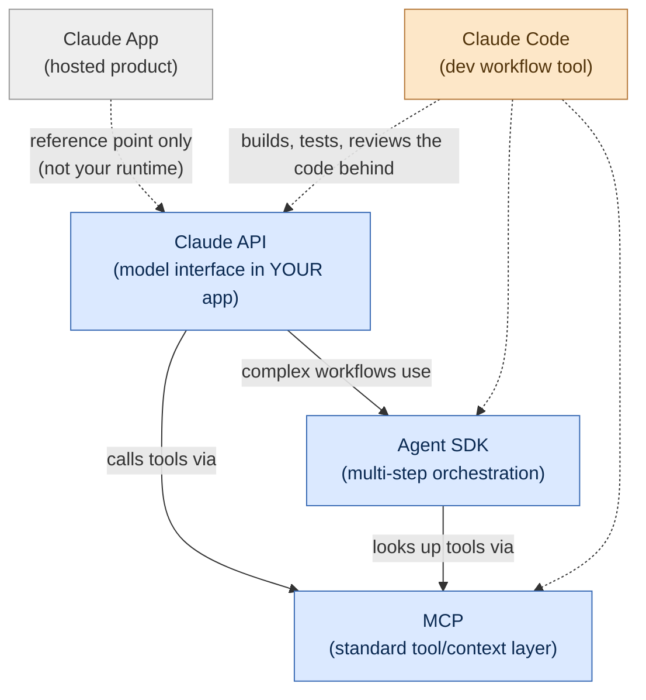
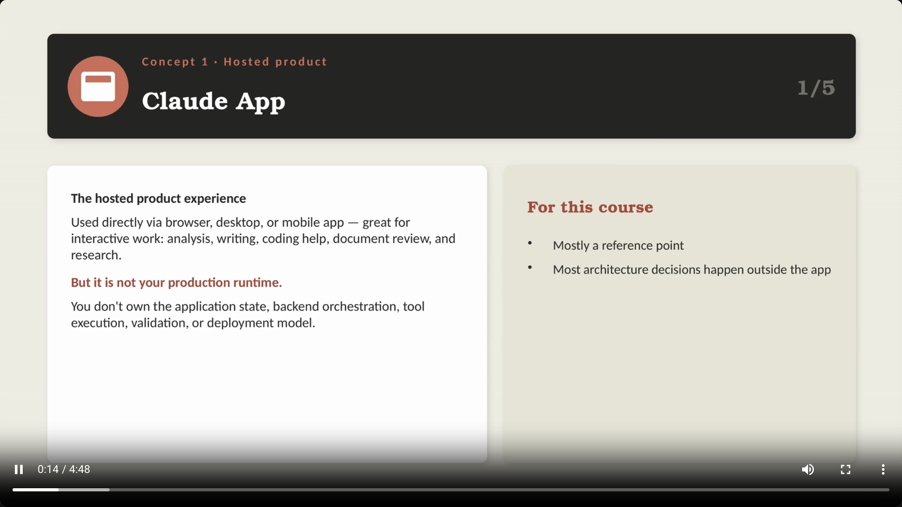
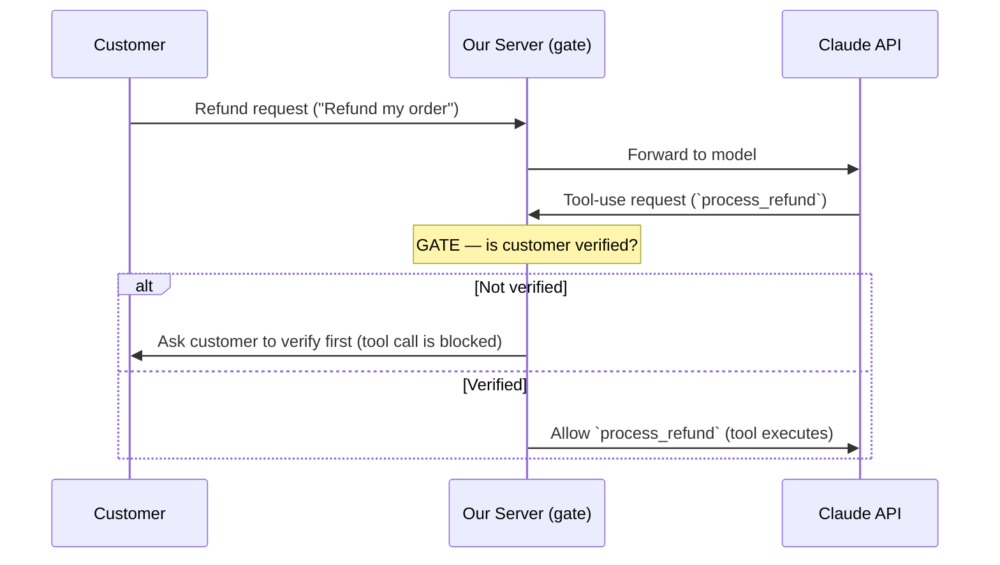
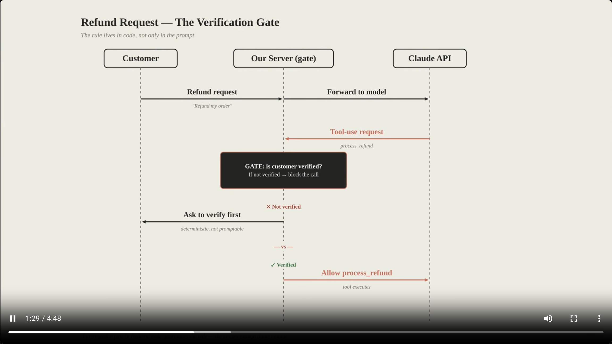
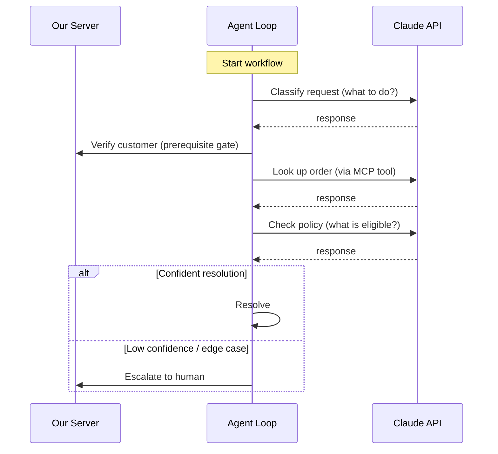
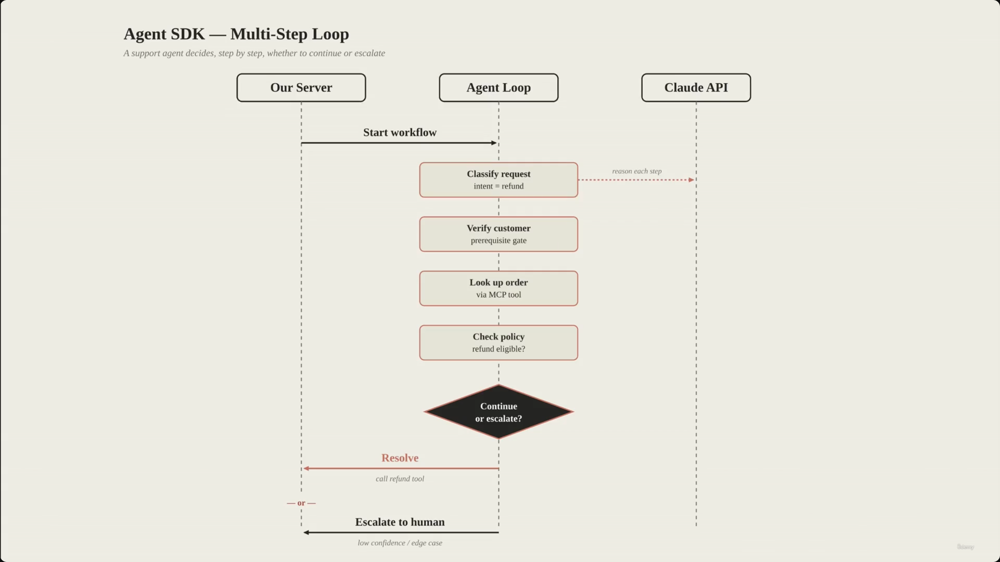
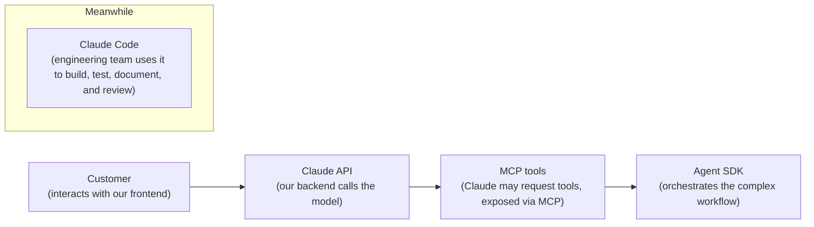
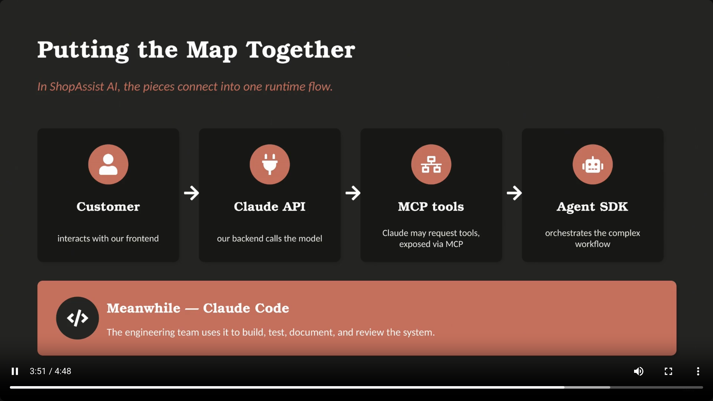
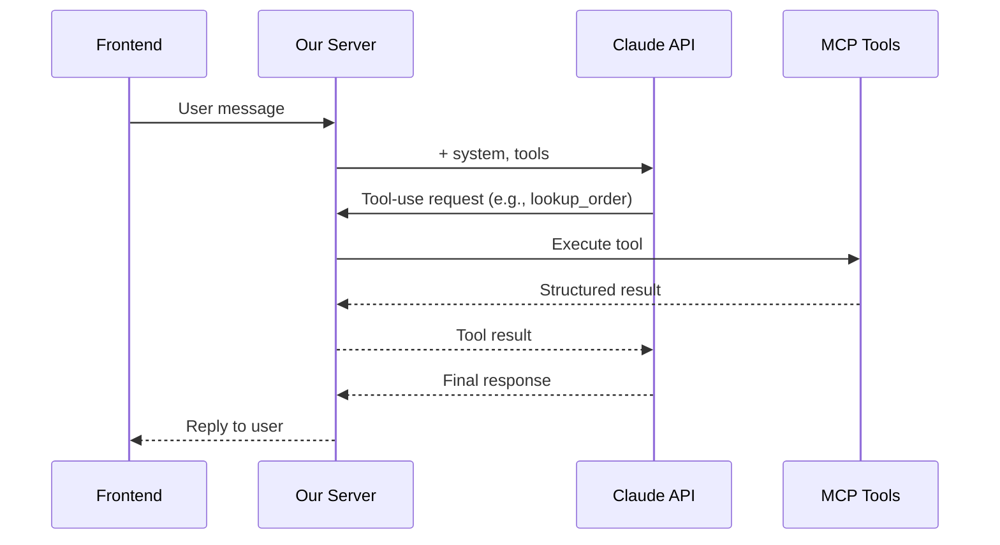
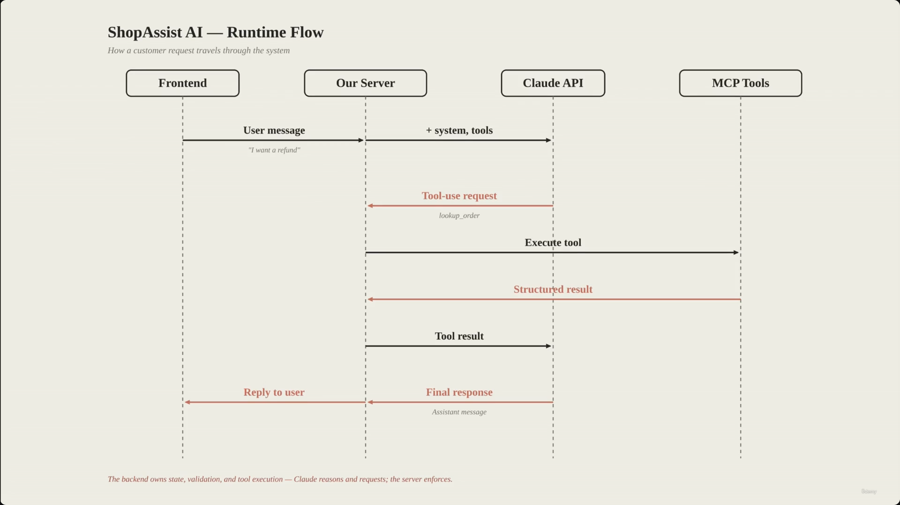

# Claude App vs Claude API vs Claude Code vs MCP vs Agent SDK

> This lecture separates five pieces of the Claude ecosystem that are easy to conflate: **Claude App**, **Claude API**, **Claude Code**, **Agent SDK**, and **MCP**. The exam cares less about "how do we prompt Claude" and more about **which layer is responsible for guaranteeing a behavior**.

## Overview: how the five pieces relate

**Reading it:** only three of these five things run inside your production system (API, MCP, Agent SDK). Claude App is a separate consumer product you don't own or control architecturally, and Claude Code is a development-time tool that helps engineers *build* the other three — it never runs at request-time in production.

---

## 1. Claude App

- The **hosted product experience** — accessed via browser, desktop app, or mobile app.
- Ideal for interactive work: writing, coding help, document review, research.
- **[Note]** It is **not your production runtime**. You don't own:
  - the application state
  - backend orchestration
  - tool execution
  - validation
  - the deployment model
- For this course (and the exam), Claude App is mostly a **reference point** — most architecture decisions happen *outside* the app.

> **Transcript color:** "Most architecture decisions happen outside the app... Cloud App is mostly a reference point."

---

## 2. Claude API

- The **model interface inside your own application**.
- **Communication flow:**
  - Your backend sends → messages, system instructions, model parameters, tool definitions, structured output requirements.
  - Claude returns → a response, structured data, or a tool-use request.
- **[Critical]** The API does **not** remove your responsibility as an architect. Claude can reason, classify, extract, generate, and request tools — but it should never be the *only* enforcement layer for critical rules.
- Your backend must still own:
  - Conversation state & auth
  - Permission checks
  - Tool execution
  - Output validation & retries
  - Observability & business rules

### 2a. The Verification Gate (why this boundary matters)

- **[The Problem]** Relying solely on a system prompt to enforce critical rules is unsafe — the model might decide to call a sensitive tool (e.g. `process_refund`) without proper authorization.
- **[The Solution]** Programmatic **prerequisite gates**: the backend explicitly verifies conditions *in code* before a tool call is allowed to proceed — the rule cannot depend only on the model's reasoning.

> **Transcript color:** "If the customer is not verified, the tool call is blocked. This is the kind of distinction the exam often cares about — not just how do we prompt Claude, but which layer should guarantee the behavior."

---

## 3. Claude Code

- A **developer workflow tool**, used inside a codebase to:
  - Inspect files
  - Understand architecture
  - Make edits
  - Write tests
  - Refactor code
  - Generate documentation
  - Review changes
- **The simple distinction:** Claude API belongs to the *application runtime*; Claude Code belongs to the *development workflow*.
- **When to use it:**
  - Engineers maintaining the codebase
  - Automating code reviews
  - Working inside CI/CD
  - Answering runtime questions *about* the API/tools/MCP/Agent SDK design (not answering them *at* runtime)

---

## 4. Agent SDK

- **[The distinction]** A simple API integration is one request → one response. Production workflows are often **multi-step** — that's an *agentic* workflow.
- **Example agentic workflow** — a support agent may need to:
  1. Classify the request
  2. Verify the customer
  3. Look up the order
  4. Check policy
  5. Call a tool
  6. Inspect the result
  7. Decide: continue, or escalate?
- **[Purpose]** The Agent SDK provides structure for this orchestration — it defines agents, tools, hooks, handoffs, and execution flow.
- **The key point is control:**
  - What can the agent decide?
  - What must the application enforce?
  - When should the loop stop or escalate?
  - Which actions require deterministic validation?

---

## 5. MCP — Model Context Protocol

- **[Definition]** A standard way to expose tools and context to Claude-compatible clients.
- **[Concept]** An **integration boundary** — more than just "tool calling." Designed to make tools easy to understand and hard to misuse.
- **Characteristics of a good MCP tool:**
  - A clear name & description
  - A typed input schema
  - Structured output
  - Useful error handling
  - Appropriate permissions
- **Why it matters:** this discipline matters most when Claude interacts with real business systems (orders, refunds, inventory, etc.) — a sloppy tool contract is where production incidents come from.
- **[Slide detail]** In ShopAssist AI, the tools exposed via MCP might be: `get_customer`, `lookup_order`, `process_refund`, `escalate_to_human`, `retrieve_policy`.

---

## Quick comparison

| Concept | What it is | Who owns/uses it | Runs in production? |
|---|---|---|---|
| **Claude App** | Hosted, consumer-facing product | End users, via browser/desktop/mobile | No — reference point only |
| **Claude API** | Model interface embedded in your app | Your backend | Yes — the core runtime call |
| **Claude Code** | Developer workflow tool | Engineers, CI/CD | No — build-time only |
| **Agent SDK** | Orchestration for multi-step agentic workflows | Your backend | Yes — when workflows are multi-step |
| **MCP** | Standard protocol for exposing tools/context | Your backend + tool servers | Yes — whenever tools are involved |

---

## Putting the map together: ShopAssist AI

> The pieces connect into a single runtime flow. In ShopAssist AI, the customer interacts with the frontend; the backend owns the Claude API call; Claude may request tools exposed through MCP; a complex workflow may be orchestrated with the Agent SDK; and — separately, at build time — the engineering team uses Claude Code to build, test, document, and review the whole system.

### ShopAssist AI — Runtime flow (request-level detail)

---

## Summary

- **Claude App** — the hosted, consumer-facing product. Reference point only.
- **Claude API** — the model interface used within an application's runtime. Your backend still owns state, auth, validation, and enforcement.
- **Agent SDK** — orchestrates complex, multi-step agentic workflows; the exam-relevant point is *control* (what the agent decides vs. what the app enforces).
- **MCP (Model Context Protocol)** — the standard layer for exposing tools and context to the model, designed to be hard to misuse.
- **Claude Code** — the developer workflow tool used for building, testing, documenting, and reviewing the system (build-time, not runtime).

**Exam framing to remember:** the recurring question isn't "how do we phrase the prompt" — it's "**which layer guarantees this behavior**." System prompts guide the model; programmatic gates in your backend *enforce* the rule.

---

## In Plain English

Here's the whole file in plain, everyday language:

**The big picture:** this lecture separates five things people mix up constantly — Claude App, Claude API, Claude Code, MCP, and Agent SDK — by explaining what each one actually is and, more importantly, which of them actually runs *inside your production system*.

**1. Claude App**
The app/website/desktop app you or anyone else chats with directly. It's a finished consumer product — not something you build with, just something you can look at for inspiration. It's not part of your own system at all.

**2. Claude API**
This is the actual thing your backend code calls to talk to the model. Sending messages, getting a response back — this is the real, literal connection point to Claude inside your own application.

**3. The API doesn't remove your responsibility**
Just because Claude can reason and decide things doesn't mean your backend can skip checking things itself — like verifying a customer before letting a refund actually go through. A rule spoken in a prompt is a suggestion; a rule enforced in your backend code is a guarantee.

**4. Claude Code**
A completely different thing — it's a tool for developers writing/reviewing/testing code in their own repository. It doesn't run inside your live product; it helps *build* the product.

**5. Agent SDK**
For when a task needs more than one back-and-forth step — like a support case that needs to classify the issue, verify the customer, look something up, and decide what to do next. It gives you structure for building that kind of multi-step, decision-making workflow.

**6. MCP (Model Context Protocol)**
A standardized way to expose tools/data to Claude so it's easy to use correctly and hard to misuse by accident — clear names, defined inputs, predictable outputs.

**7. How they all fit together in one real system (ShopAssist)**
The customer talks to your frontend → your backend calls the Claude API → Claude might request a tool, which is exposed via MCP → for more complex multi-step work, the Agent SDK orchestrates it all → and separately, the whole time, your engineering team is using Claude Code to actually build and maintain all of this.

**One-sentence summary:** Claude App is a product you don't own, Claude Code is a tool for building your codebase, and Claude API + MCP + Agent SDK are the three pieces that actually run inside your production system — with your backend, not the model, always responsible for guaranteeing the rules that really matter.

---

*Sources: [slide notes](../03-ClaudeApp-vs-ClaudeAPI-vs-ClaudeCode-vs-MCP-vs-AgentSDK.md) · [[hover-notes-transcripts/03-ClaudeApp-vs-ClaudeAPI-vs-ClaudeCode-vs-MCP-vs-AgentSDK (transcript)|full transcript]]*
