# What An LLM Does

> This lecture opens up the black box: what actually happens between a user's message going in and Claude's response coming out. The core idea is that an LLM is not magic — it's a **prediction engine** that repeatedly asks "what's the most likely next token?", and the *only* lever an architect has over its answers is the **context** supplied to it.

> **Note on sources:** the frontmatter in the original slide note links to a transcript file ("CourseProject-BuildingShoppingAsist") that doesn't exist in `hover-notes-transcripts/` and doesn't match this lecture's topic — it's a stale/broken link. No transcript was available for this lecture, so this note is built from the slide bullets and screenshots alone (no transcript quotes below).

---

## Framing: Contextual Architecture

- Concepts in this course are taught inside the framework of a production-style architecture (ShopAssist AI), rather than as memorized, disconnected facts.
- The goal is to understand each service's **purpose**, its **placement** in a system, and its **role** in solving a real engineering problem — including the LLM itself.

---

## 1. From Text to Meaning: Tokens, Embeddings, Context

Before Claude can predict anything, it has to turn your raw message into something it can reason over. That happens in layers:

| Layer | What it is |
|---|---|
| **Token** | The discrete label — a raw piece of text |
| **Embedding** | The starting, general-purpose numeric representation of a token |
| **Context** | The surrounding tokens that sharpen that meaning into something specific |

- **Contextualizing embeddings:** the model does a second pass to determine a token's numeric representation based on its *neighbors* — not "what does this token usually mean?" but "what does this token mean *here*?"
- **[The Result]** The same visible word can produce different internal numeric representations depending on position and surrounding tokens — this is how the model tells apart identical words used in different senses.

**Example — "I want to return my order":**

| Token | Contributes |
|---|---|
| `I` | identifies the customer |
| `want` | signals intent |
| `return` | points to a specific type of request |
| `my order` | points to a previous purchase |

- **[The Result]** Claude synthesizes these pieces into a high-level concept: *the customer is requesting help with a product return.* It isn't processing isolated words — it's building intent.

---

## 2. Generation: Predicting One Token at a Time

Once Claude has a rich internal representation of the input, **generation** begins — the stage where it uses that representation to predict a response.

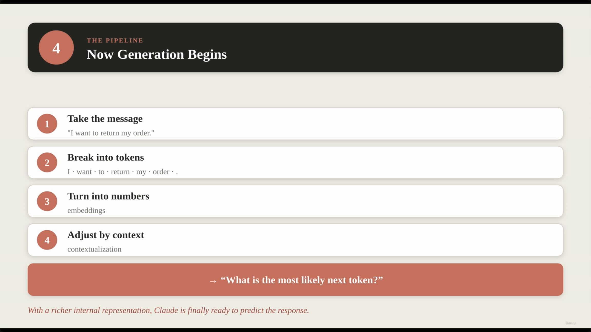

**[The Core Mechanism]** The model does not choose a next token with certainty — it assigns a **probability** to every candidate token, given the current context, and picks from that distribution.

**Example context:** *"I want to return my order and get a ____"*

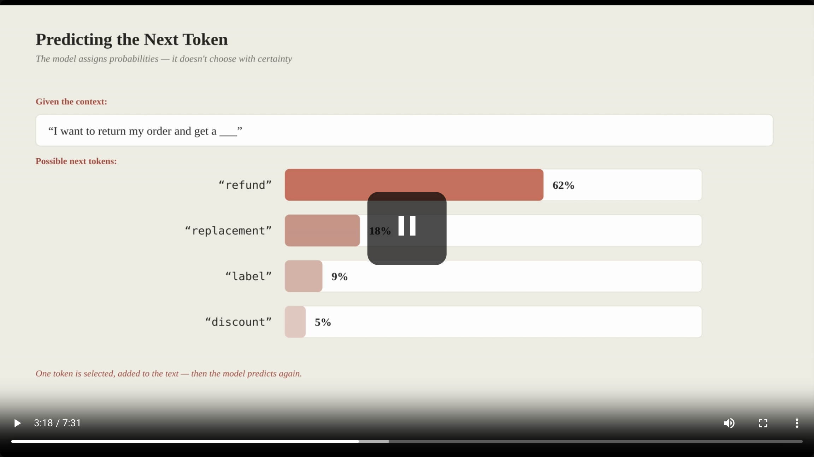

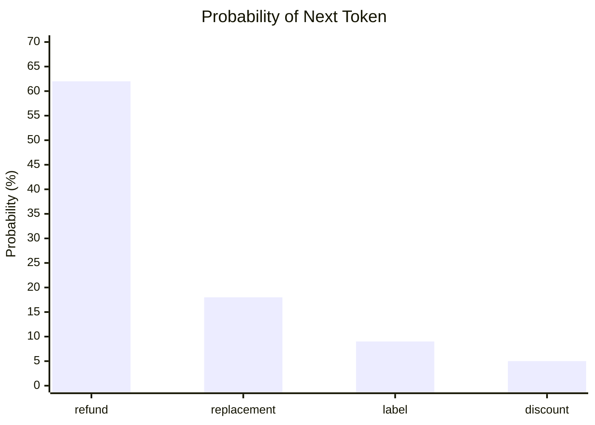

- "refund" is the most likely next token at 62% probability.
- Once a token is selected, it's appended to the text, and the model repeats the entire process — re-reading the now-longer context — to predict the *next* token.

**[Slide detail]** This same probability example is used twice in the source deck (once to introduce "Predicting the Next Token," once again under "The Iterative Prediction Loop") — it's one underlying mechanism, not two.

### The iterative loop, visualized

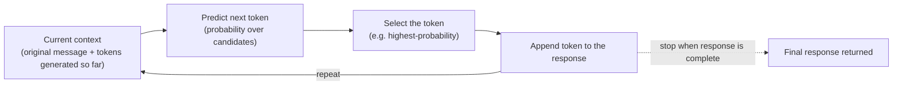

---

## 3. How Tokens Build a Full Response

The model predicts one token, appends it, and predicts again. After many small iterative steps, the sequence of individual tokens forms a complete, coherent sentence.

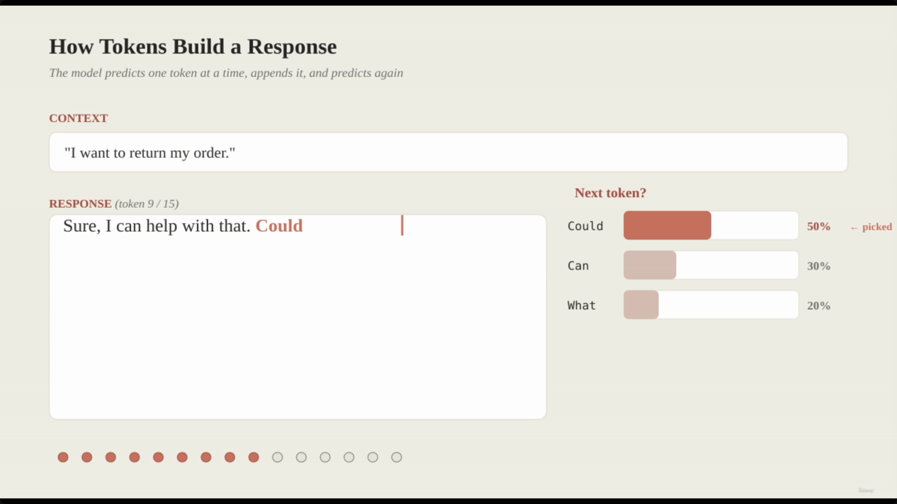

**Example of the iterative process** (context: *"I want to return my order."*):

| Step | Token predicted | Probability | Response so far |
|---|---|---|---|
| 1 | "Sure," | 66% | "Sure," |
| 2 | "I" | 64% | "Sure, I" |
| 3 | "can" | 68% | "Sure, I can" |
| 4 | "help" | 50% | "Sure, I can help" |
| 5 | "with" | 82% | "Sure, I can help with" |
| 6 | "that." | 82% | "Sure, I can help with that." |

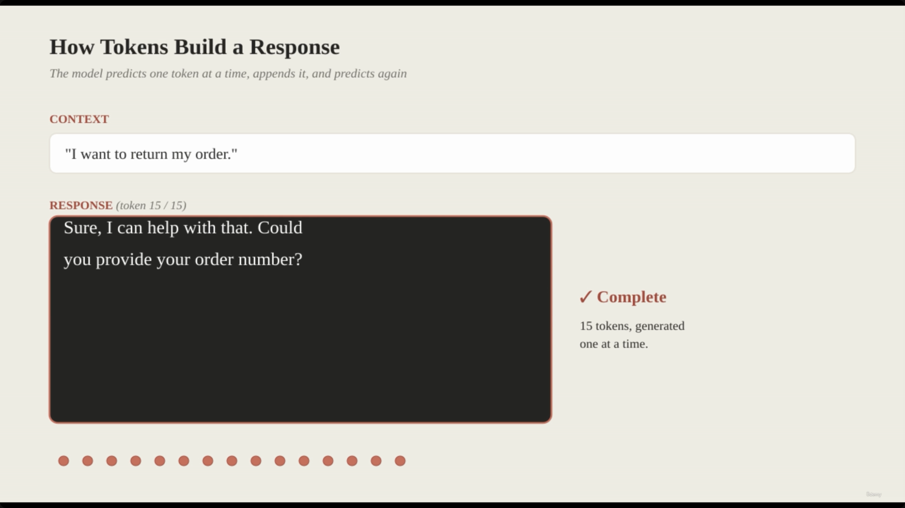

- **[The Result]** To the user, it looks like Claude wrote one complete sentence at once:

  > "Sure, I can help with that. Could you provide your order number?"

  In reality it was 15 individual next-token predictions, appended one after another.

---

## 4. The Architect's Responsibility: Context Injection

**[Core Principle]** Claude generates answers based *solely* on the context it receives. It has no inherent, automatic access to your systems:

- It does not automatically know your database contents (order status, inventory, customer profiles).
- It does not automatically know conversation history — unless the application re-sends previous messages.
- It does not automatically know real-time user identity or permissions.

Because the model doesn't "know" your business, **the application must act as the bridge** — proactively injecting the specific data points needed to turn a generic response into a useful, specific one.

**Example in ShopAssist AI** — if a customer says "I want to return my order":

- Claude understands the *intent* (a return request).
- Claude does **not** know: which specific order is referenced, whether the customer is verified, whether the order is eligible for return, or whether a refund has already been processed.

### Same request, different context

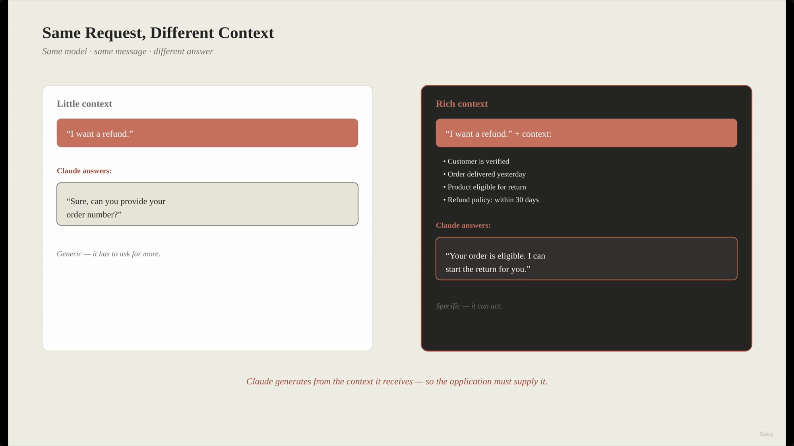

| Feature | Little Context | Rich Context |
|---|---|---|
| Input message | "I want a refund" | "I want a refund" + context |
| Additional data | None | Customer is verified; order delivered yesterday; product eligible for return; refund policy details |
| Claude's response | "Sure, can you provide your order number?" | "Your order is eligible. I can start the return for you." |

- **[The Architect's Role]** Because the model generates from what it receives, the application is responsible for supplying the necessary context — the same underlying model produces a generic *or* a specific, actionable answer purely based on what's fed in.
- A concrete version of the same idea: given a policy like "allows refunds within 30 days," Claude can move from *"I can help with that. What is your order number?"* to *"Your order is eligible for a refund. I can start the return process for you."*

---

## 5. The Model Reasons — The System Controls

Claude is the reasoning and language layer. The surrounding system controls what it *sees* and what it's *allowed to do*.

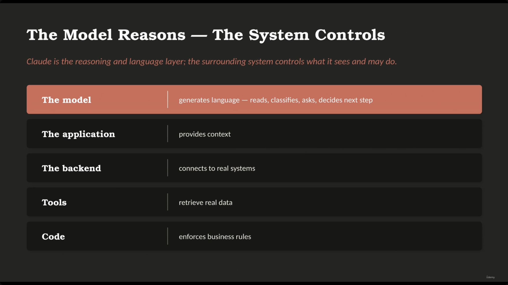

| Component | Responsibility |
|---|---|
| **The model** | Generates language — reads, classifies, asks, decides next step |
| **The application** | Provides context |
| **The backend** | Connects to real systems |
| **Tools** | Retrieve real data |
| **Code** | Enforces business rules |

**[The Role of the Model]** — it acts as the "brain" for reasoning and language tasks:

- It can read a given situation.
- It can follow complex instructions.
- It can ask clarifying questions.
- It can summarize information or classify intent.
- It can decide what the next logical step in a process should be.

---

## 6. The Whole Mechanism: A Seven-Step Prediction Engine

Rather than viewing an LLM as magic, it can be understood as a powerful prediction engine following a specific, repeatable sequence — this ties together everything above (tokenizing, embedding, contextualizing, and iteratively predicting):

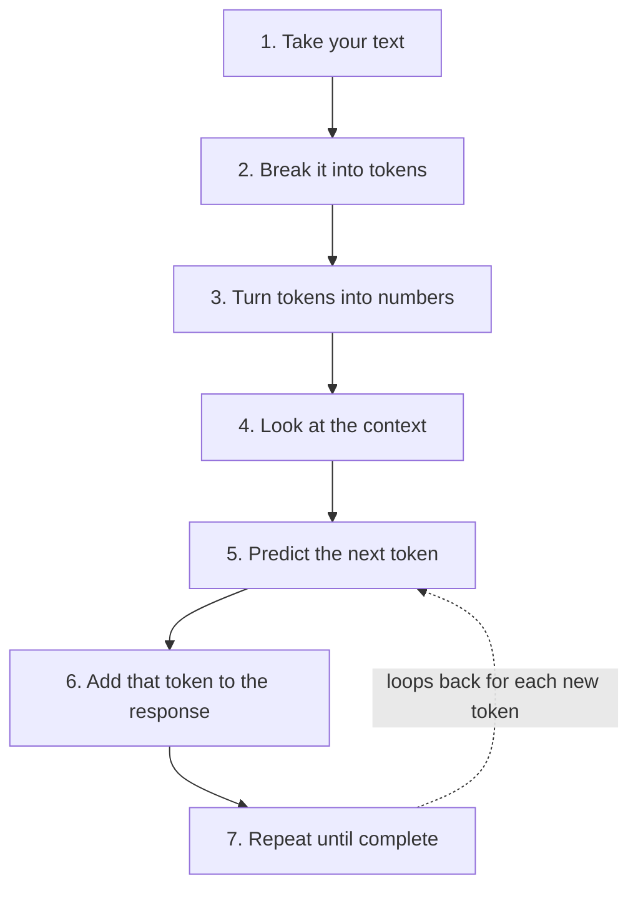

---

## 7. Everything Is Context

Whatever information is provided to the model before it predicts the next token fundamentally shapes the answer. In a production system, all of the following are just different forms of "managed context":

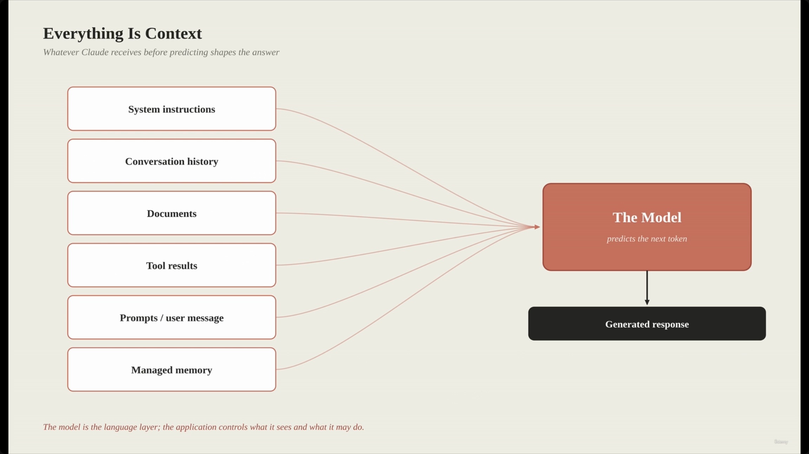

- **System instructions** — high-level guidance on how to behave
- **Conversation history** — the record of previous exchanges
- **Documents** — external knowledge or data
- **Tool results** — data retrieved from external systems via tools
- **Prompts / user message** — the current request
- **Managed memory** — long-term or session-based information stored by the application

**[The core principle]** Prompts, history, documents, tool results, memory, and agentic loops are all just ways to manage the context the model uses to make its predictions.

### Agentic workflows as context loops

Instead of a single interaction, agentic workflows function as a continuous loop of reasoning and action, at a coarser grain than the token-by-token loop above:

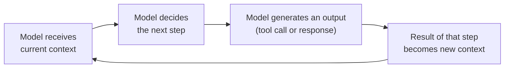

> **The Core Concept:** Don't imagine LLMs as magic. Imagine them as very powerful prediction engines. They receive context, predict the next token, and when this happens many times in a row, the result appears to be a conversation, a summary, a plan, or a support agent.

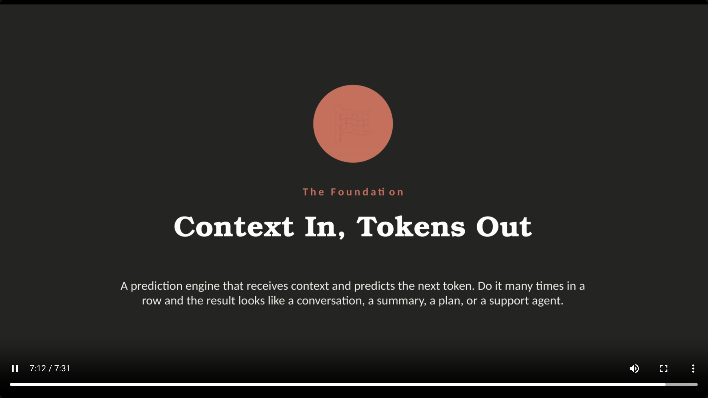

---

## Summary

- An LLM turns text into **tokens**, tokens into **embeddings**, and refines those embeddings using surrounding **context** — only then does it start generating.
- **Generation** is pure next-token prediction, repeated: predict → append → repeat, one token at a time, until the response is complete.
- The model **never** has automatic access to your business systems — no database, no live customer identity, no persisted conversation history unless the application re-supplies it.
- **The architect's job is context injection**: the same model, given the same request, produces a generic or a specific/actionable answer purely based on what context the application chooses to supply.
- Split of responsibility: **the model reasons** (language, classification, next-step decisions); **the system controls** (what it sees, via context, and what it's allowed to do, via tools and code).
- Zoom out far enough and everything — prompts, history, documents, tool results, memory, even multi-step agentic workflows — is just a form of **managed context** feeding the same underlying predict-the-next-token loop.

---

*Source: [slide notes](../04-What-An-LLM-Does.md) — no transcript was available for this lecture (see note above).*
