# First Request — api-key, messages, max_tokens, stop_reason

> This lecture is the first hands-on moment in the course: before building ShopAssist AI, it proves that Python can talk to Claude at all. It walks a Jupyter notebook through five steps — set up the environment, store the API key safely, create the Anthropic client, send one message, and inspect what comes back — and along the way introduces the three parameters that show up in almost every request/response pair for the rest of the course: `max_tokens`, `messages`, and `stop_reason`.

---

## 1. Setting up the environment

- **Language for the course:** Python — a popular choice for API demos, backend prototypes, automation, and AI workflows.
  - **[Note]** The course is not Python-only: Claude API concepts are language-agnostic. Anthropic ships official SDKs for **Python, TypeScript, Java, Go, Ruby**, plus PHP and a command-line interface (per the transcript).
- **The API interaction pattern is the same regardless of language:**
  1. Create a client
  2. Send messages
  3. Set parameters (`model`, `max_tokens`, etc.)
  4. Read the response
- **Tooling for this course:** Visual Studio Code + the Jupyter Notebook extension, running a `.ipynb` notebook step by step.
  - **Why notebooks over a backend framework (FastAPI/Django/Flask) for learning:** you can run one small piece of code at a time and immediately inspect exactly what Claude returns — production code would normally live in a real backend framework instead.
- **Lesson roadmap:** set up the environment → store the API key safely → create the Anthropic client → send the first message → inspect the response.

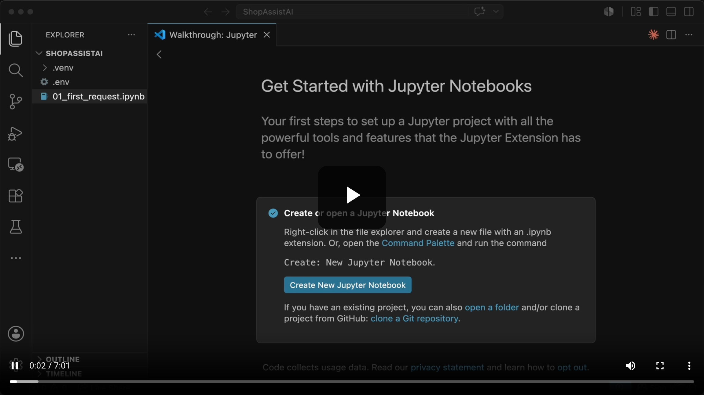

> **Transcript color:** "If your production stack uses Node.js, Java, Go, or another supported language, you can port the same ideas to that SDK." The instructor treats the language as an implementation detail — the architecture (client → messages → parameters → response) is what the exam cares about.

*(Note: this exact "Get Started with Jupyter Notebooks" screen was captured five separate times in the source recording — at 0:00, 0:02, 0:29, 0:59, and 1:15 — while the narrator talked through language support, the API pattern, and the notebook/backend-framework comparison without the on-screen slide ever changing. Only one representative frame is kept here; the very first capture (0:00) was a video-still-loading artifact and is dropped entirely.)*

---

## 2. Getting an API key

- Before building the full ShopAssist AI, the first step is verifying Python can reach Claude at all — which requires an API key from the **Anthropic Console**.
- **Process for creating a key:**
  1. **Open the Console** — navigate to `console.anthropic.com`, log in, go to Settings → API Keys, click **Create Key**
  2. **Name it** — give it a clear, identifiable label so it can be tracked/revoked later (e.g. `my-api-key`, or `shopassist-ai-key` per the transcript)
  3. **Copy it once** — copy immediately; the key cannot be viewed again after the dialog closes
- **[Crucial] Security rules:**
  - Treat the API key like a password
  - Never hard-code it into Python code, put it in frontend JavaScript, or commit it to GitHub
  - Store it as an environment variable so the SDK reads it automatically
  - If a key ever leaks, rotate it immediately
- **Storage strategy:**
  - **Local development:** a `.env` file
  - **Production:** environment variables or a dedicated secrets manager

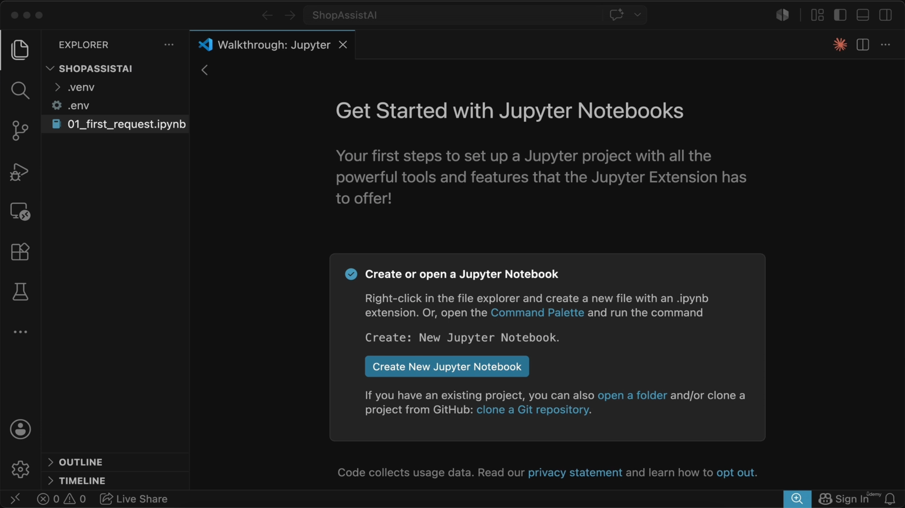

*(This "Get Your API Key" slide was also captured four times back-to-back — 1:38, 1:51, 2:08, 2:25 — with identical content each time; one representative is kept.)*

### Project setup

- Initial VS Code project structure:
  - A root project folder (`ShopAssistAI`)
  - A `.env` file for secure key storage
  - A Jupyter notebook (`01_first_request.ipynb`) for the lesson

```text
# Contents of .env
ANTHROPIC_API_KEY="your-api-key-here"
```

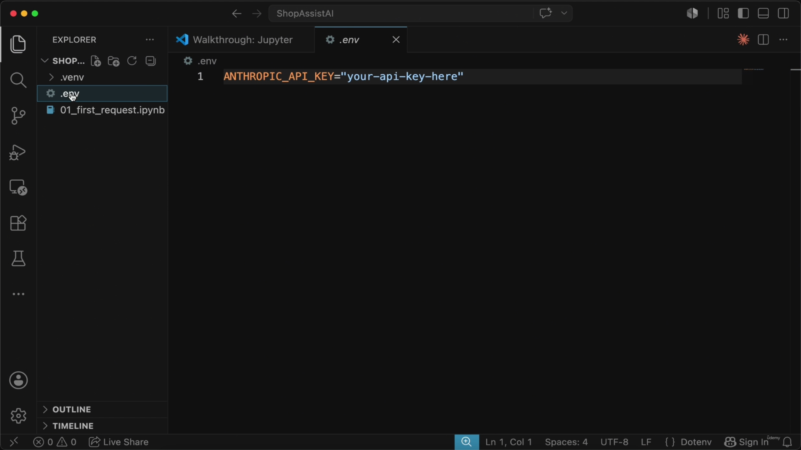

- **Protecting the file:** add `.env` to `.gitignore` if using Git — this prevents the key from being accidentally committed to version control.

---

## 3. Installing packages and loading the key

- Required Python packages, installed via `pip`:

```bash
pip install anthropic python-dotenv
```

  - `anthropic` — the official Python SDK for Claude
  - `python-dotenv` — loads variables from a `.env` file into the Python environment
- Import the loader in the notebook:

```python
from dotenv import load_dotenv
```

<table><tr><td>

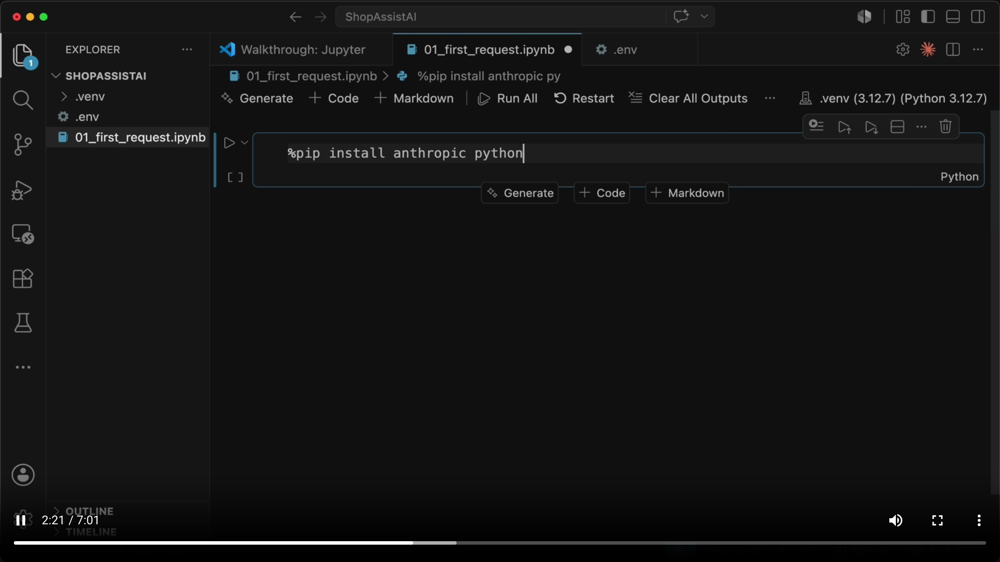

</td></tr></table>

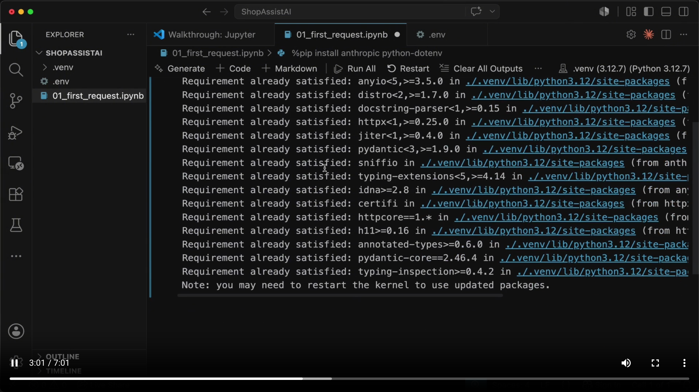

*(A short incremental build-up: the first frame shows the `%pip install anthropic python` command still being typed, the second shows it completed as `%pip install anthropic python-dotenv` with the dependency-resolution output, and a third — visually near-identical to the second, just with the cell collapsed to its final "Note: you may need to restart the kernel" line — was dropped as a repeat capture of the same completed state.)*

---

## 4. Initializing the Anthropic client and defining the model

- **[Automatic key loading]** The client does **not** need the API key passed directly — the SDK automatically looks for an environment variable named `ANTHROPIC_API_KEY`. This keeps secrets outside the source code.

```python
from dotenv import load_dotenv
from anthropic import Anthropic

load_dotenv()
client = Anthropic()
```

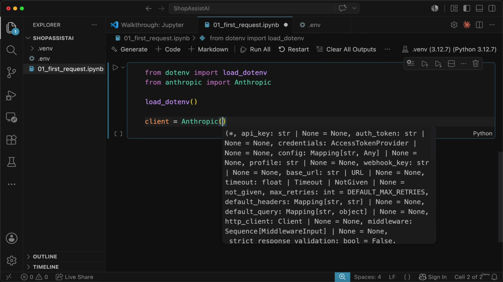

- **[Slide detail]** The autocomplete tooltip for `Anthropic()` reveals its full constructor signature — far more than `api_key` alone: `auth_token`, `credentials` (an `AccessTokenProvider`), `config`, `profile`, `webhook_key`, `base_url`, `timeout`, `max_retries` (defaulting to `DEFAULT_MAX_RETRIES`), `default_headers`, `default_query`, `http_client`, `middleware`, `strict_response_validation`. None of this is mentioned in the transcript or slide-note bullets — the lesson only uses the zero-argument `Anthropic()` form.

- **Model selection:** the project uses `claude-sonnet-4-6` (the notebook demo; the slide note text separately references `claude-3-5-sonnet-20240620`, illustrating that the exact model string used in a course recording can vary by take).
  - **[Pro-tip]** Model names change over time — always verify the current string in the official Anthropic documentation before shipping.

```python
model = "claude-sonnet-4-6"
```

- **[Design choice]** The model name is kept in a variable rather than inlined, so it's easy to change later.

---

## 5. Making the first request

- **The core method:** `client.messages.create()` — the primary way to send a message to Claude.
- **Core parameters for a basic request:**
  - `model` — which Claude model to use
  - `max_tokens` — the maximum number of tokens Claude is *permitted* to generate
    - **[Important distinction]** This is a **ceiling**, not a target. The model does not try to use all available tokens — it simply stops once it reaches the limit. For a short customer-support answer, 300 is plenty.
  - `messages` — the structured conversation, as a list of message objects
    - Each message needs a `role` (e.g. `"user"`) and `content` (the message text)

```python
message = client.messages.create(
    model=model,
    max_tokens=300,
    messages=[
        {
            "role": "user",
            "content": "A customer wants to return an order. Write a short helpful response."
        }
    ]
)
```

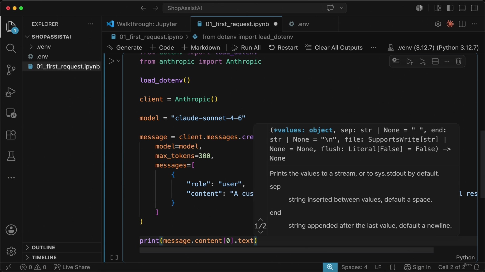

- **[Slide detail]** While typing this call, the editor's autocomplete briefly exposed the full signature of `client.messages.create()` — well beyond `model`/`max_tokens`/`messages`: `cache_control`, `container`, `inference_geo`, `metadata`, `output_config`, `service_tier` (`'auto'` / `'standard_only'`), `stop_sequences`, `stream`, `system`, and more (the tooltip was paginated "1/3", so still more parameters exist off-screen). None of these advanced parameters are discussed in this lecture, but their presence previews topics — system prompts, streaming, prompt caching, service tiers — covered later in the course.

---

## 6. Inspecting the API response

- **Accessing the response text:** the `content` attribute of the message object is a list of content blocks — get the generated text via the first block's `.text`.

```python
print(message.content[0].text)
```

- **Example output** for the customer-support prompt:

  > Hi there,
  >
  > I'm sorry to hear you'd like to return your order! I'm happy to help make this process as easy as possible. Here's what to do next:
  >
  > 1. **Have your order number ready** (found in your confirmation email)
  > 2. **Let us know the reason** for the return (damaged, wrong item, changed your mind, etc.)
  > 3. **Check your eligibility** — most items can be returned within **30 days** of delivery
  >
  > Once we confirm your return, we'll send you a **prepaid return label** via email. Refunds...
  >
  > **Need help now?**
  > - 📧 Email: support@example.com
  > - 💬 Live Chat: Available Mon–Fri, 9am–5pm
  > - 📞 Phone: 1-800-XXX-XXXX

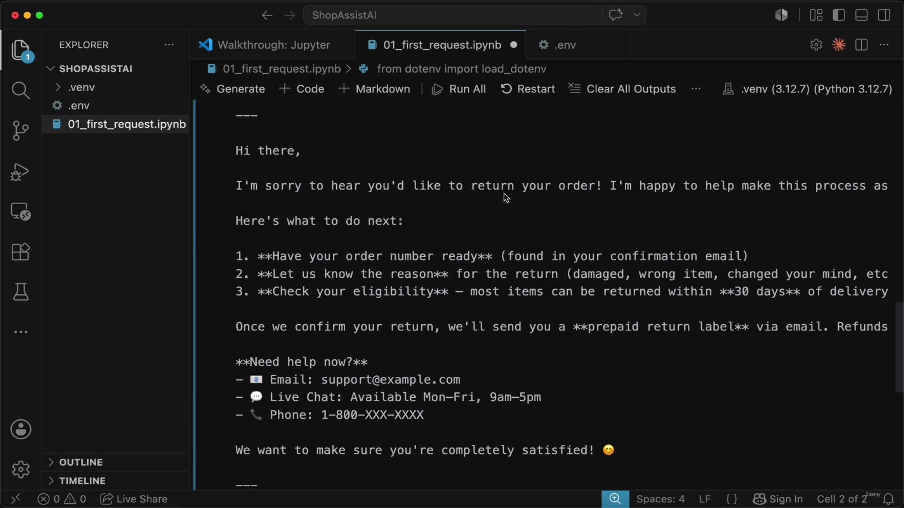

- **Checking why Claude stopped:** the response carries a `stop_reason` field explaining why generation ended.
  - **[Why check this?]** It tells you whether Claude finished its thought naturally or was cut off by hitting `max_tokens`.

```python
print(message.stop_reason)
```

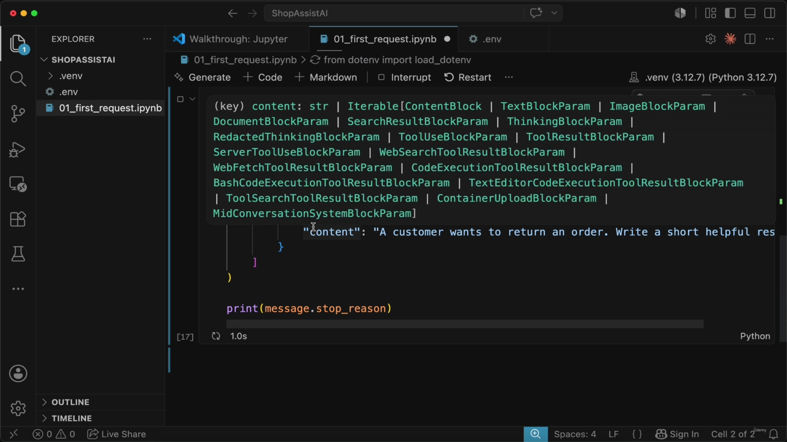

- **[Slide detail]** The autocomplete tooltip captured here (for the `content` field's type) lists a long union of content-block types that never appears in the transcript or the slide-note bullets: `TextBlockParam`, `ImageBlockParam`, `DocumentBlockParam`, `SearchResultBlockParam`, `ThinkingBlockParam`, `RedactedThinkingBlockParam`, `ToolUseBlockParam`, `ToolResultBlockParam`, `ServerToolUseBlockParam`, `WebSearchToolResultBlockParam`, `WebFetchToolResultBlockParam`, `CodeExecutionToolResultBlockParam`, `BashCodeExecutionToolResultBlockParam`, `TextEditorCodeExecutionToolResultBlockParam`, `ToolSearchToolResultBlockParam`, `ContainerUploadBlockParam`, `MidConversationSystemBlockParam`. This is a preview of everything a `content` list can eventually hold once tools, thinking, web search, and code execution enter the course — for this lecture, only a single `TextBlockParam`-shaped block is actually produced.

### Understanding `stop_reason` values

| `stop_reason` | Meaning | Application action |
|---|---|---|
| `end_turn` | Claude finished its response naturally | Safe to show the response to the user |
| `max_tokens` | Claude hit the `max_tokens` ceiling | Response may be incomplete/cut off mid-sentence — handle accordingly |
| `tool_use` | Claude is requesting the app run a tool before continuing | Execute the tool and continue the loop (covered later, in agentic workflows) |

> **Transcript color:** "Later in the course, when we use tools, we will see another important stop reason: `tool_use`. That means Claude is asking our application to run a tool before it can continue — for example, ShopAssist AI may need to look up an order in the database before answering a refund question."

---

## 7. Inspecting the full response object

- **[Why print the full object?]** End users only need the generated text, but developers need the complete structure during development to see what fields the backend can rely on.

```python
print(message)
```

- **Key fields in the response object:**
  - `id` — the unique response ID
  - `type` — `"message"`
  - `model` — the specific model that actually served the request
  - `role` — `"assistant"`
  - `content` — the list of content blocks
  - `stop_reason` — why the model stopped generating
  - `stop_sequence` — the custom stop sequence hit, if any (`None` here)
  - `usage` — token accounting for the request

- **Illustrative structure** (per the slide note's own reconstruction of the shape):

```json
{
    "id": "msg_012TwBrtb78cukwg4QWKST",
    "type": "message",
    "model": "claude-sonnet-4-6",
    "role": "assistant",
    "content": [
        {
            "type": "text",
            "text": "Hi there,\nThanks for reaching out! We're sorry to hear you'd like to return your order, but we're happy to help make the process as easy as possible.\n\nHere's what to do next:\n\n1. Confirm eligibility..."
        }
    ],
    "stop_reason": "end_turn",
    "stop_sequence": null,
    "usage": {
        "cache_creation": "CacheCreation"
    }
}
```

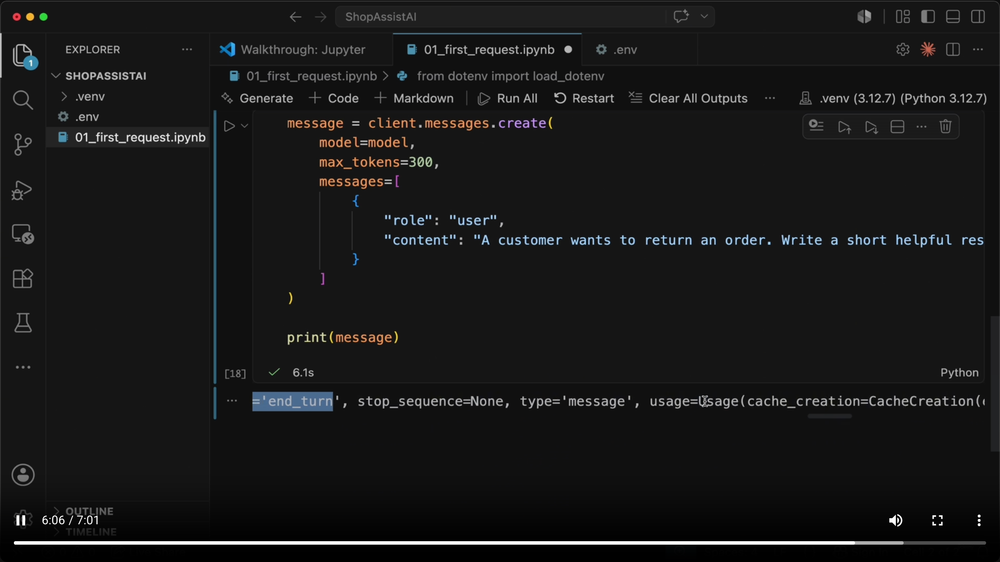

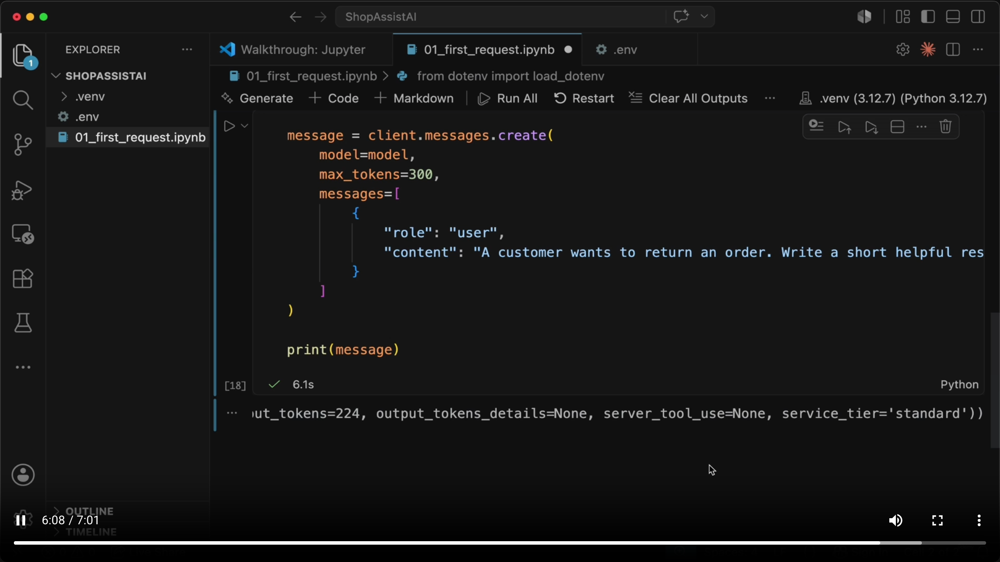

- **[Slide detail]** `print(message)` doesn't print JSON — it prints the SDK's actual Python object repr. The real captured fragment reads:
  `..., stop_reason='end_turn', stop_sequence=None, type='message', usage=Usage(cache_creation=CacheCreation(...), ..., output_tokens=224, output_tokens_details=None, server_tool_use=None, service_tier='standard'))`.
  This confirms two concrete facts neither the transcript nor the slide-note bullets state outright: this particular run produced exactly **224 output tokens**, and `usage` is a nested object (`Usage(cache_creation=CacheCreation(...), ...)`), not a flat dict — useful to know before trying to read `message.usage.output_tokens` in later lessons.

> **Transcript color:** "In real applications we usually do not print the full object to the user — during development it is very helpful. It lets us understand what the API returns and which fields our backend can use."

---

## Putting it together: the request/response lifecycle

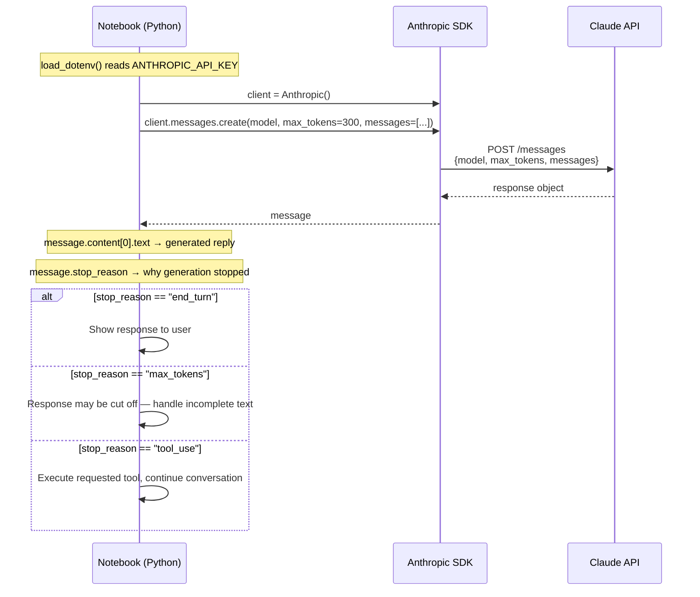

**Reading it:** the client never talks to the API directly — the SDK translates `client.messages.create(...)` into the actual HTTP call and translates the JSON response back into a typed `Message` object. The one field application logic must always branch on is `stop_reason`: it's the signal that separates "safe to display" from "incomplete" from "the model wants to call a tool."

---

## Summary

- **Environment:** VS Code + Jupyter Notebook extension, Python, for step-by-step execution and inspection.
- **API key:** created in the Anthropic Console, stored in a `.env` file (never hard-coded, never committed), loaded via `python-dotenv`.
- **Client:** `from anthropic import Anthropic; client = Anthropic()` — the SDK reads `ANTHROPIC_API_KEY` from the environment automatically.
- **Model:** kept in a variable (e.g. `model = "claude-sonnet-4-6"`) for easy updates; always verify the current model string in Anthropic's docs.
- **First request:** `client.messages.create(model=model, max_tokens=300, messages=[{"role": "user", "content": "..."}])`.
  - `max_tokens` is a ceiling on generation, not a target.
  - `messages` is a list of `{role, content}` objects representing the conversation.
- **Response:**
  - `message.content[0].text` — the generated text
  - `message.stop_reason` — `end_turn` (done), `max_tokens` (cut off), or `tool_use` (wants to call a tool — covered later)
  - `print(message)` — the full object (`id`, `type`, `model`, `role`, `content`, `stop_reason`, `stop_sequence`, `usage`) for development-time debugging.

> The foundation for everything else. Next: ShopAssist AI's first backend flow.

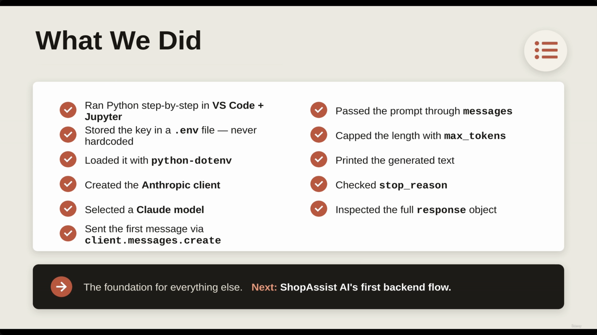

---

## In Plain English

Here's the whole file in plain, everyday language:

**The big picture:** this is the very first hands-on moment of the whole course — proving Python can actually talk to Claude — and along the way it introduces the handful of things (API key, client, messages, max_tokens, stop_reason) you'll use in almost every single lecture after this.

**1. Getting set up**
The course uses Python in a Jupyter Notebook (in VS Code) so you can run one small chunk of code at a time and immediately see what Claude sends back — but the actual concepts (client → send message → set parameters → read response) work identically no matter what programming language you use.

**2. Getting an API key, safely**
Create it once in the Anthropic Console, copy it immediately (you can't view it again later), and NEVER put it directly in your code or push it to GitHub — store it in a special `.env` file instead, which your code reads from automatically.

**3. The actual request, boiled down**
`client.messages.create(model=..., max_tokens=300, messages=[{"role": "user", "content": "..."}])` — that's genuinely it. `max_tokens` is just a hard ceiling on how long the reply can get, not a target Claude tries to hit.

**4. Reading the answer**
The actual reply text lives at `message.content[0].text`.

**5. `stop_reason` — the single most important field to check**
It tells you WHY Claude stopped talking. `end_turn` means it finished naturally (safe to show the user). `max_tokens` means it got cut off mid-thought (the reply might be incomplete). `tool_use` means Claude is waiting on your app to run something before it can continue (covered much later in the course).

**6. The full response object has way more in it than just the text**
An ID, which exact model handled it, token usage counts, etc. — useful for debugging while building, even though a real user would only ever see the plain text.

**One-sentence summary:** The whole first Claude request boils down to `client.messages.create(model, max_tokens, messages)`, reading the reply from `message.content[0].text`, and always checking `stop_reason` to know whether the answer is complete, cut off, or actually a request to run a tool.

---

*Sources: [slide notes](../05-First%20Request%20-%20api-key%2C%20messages%2C%20max_tokens%2C%20stop_reason.md) · [[hover-notes-transcripts/05-First Request - api-key, messages, max_tokens, stop_reason (transcript)|full transcript]]*
