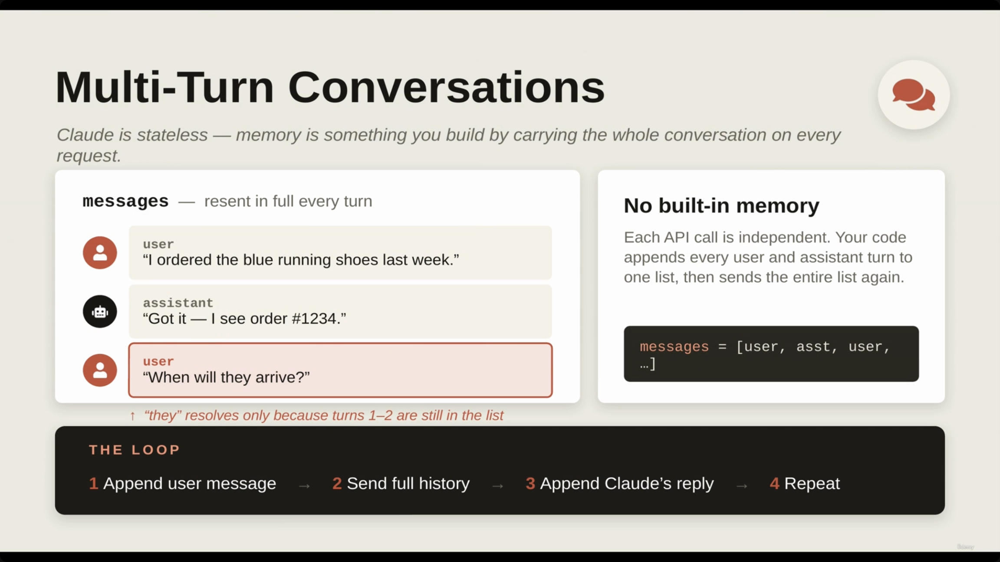
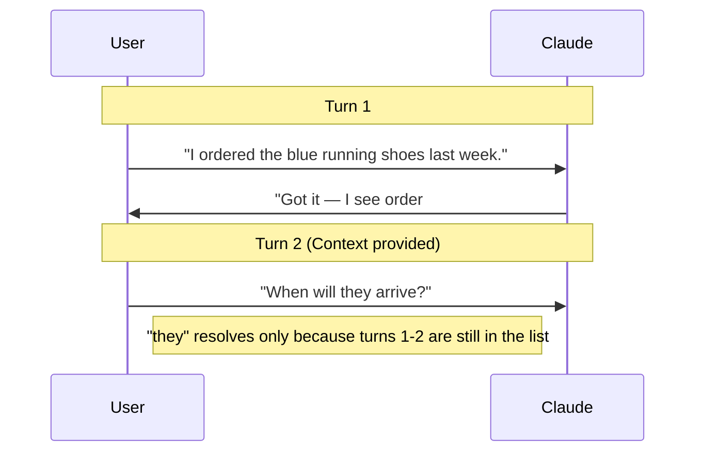
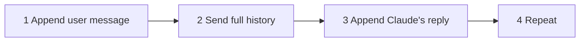
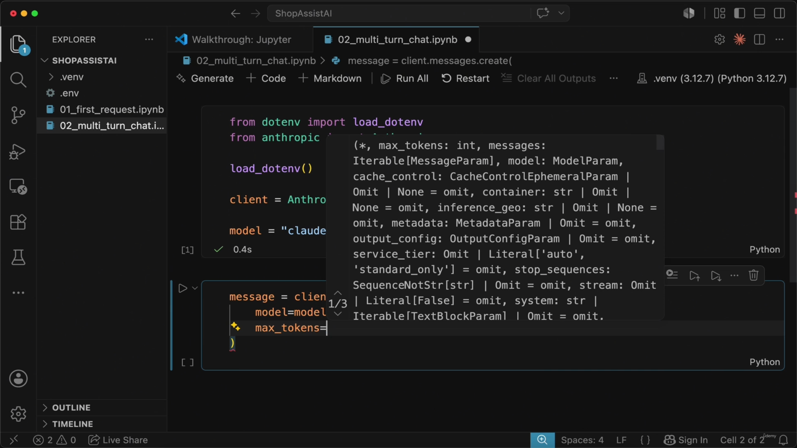
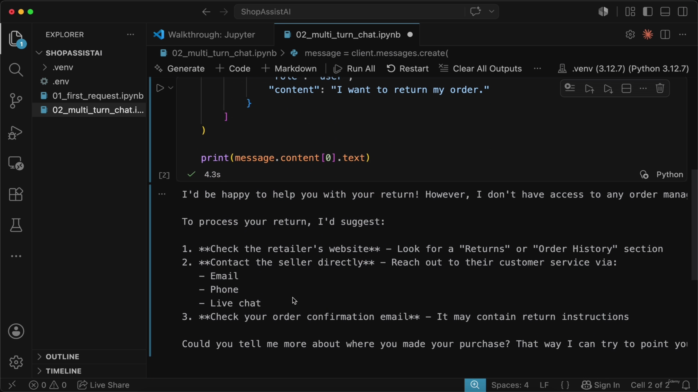
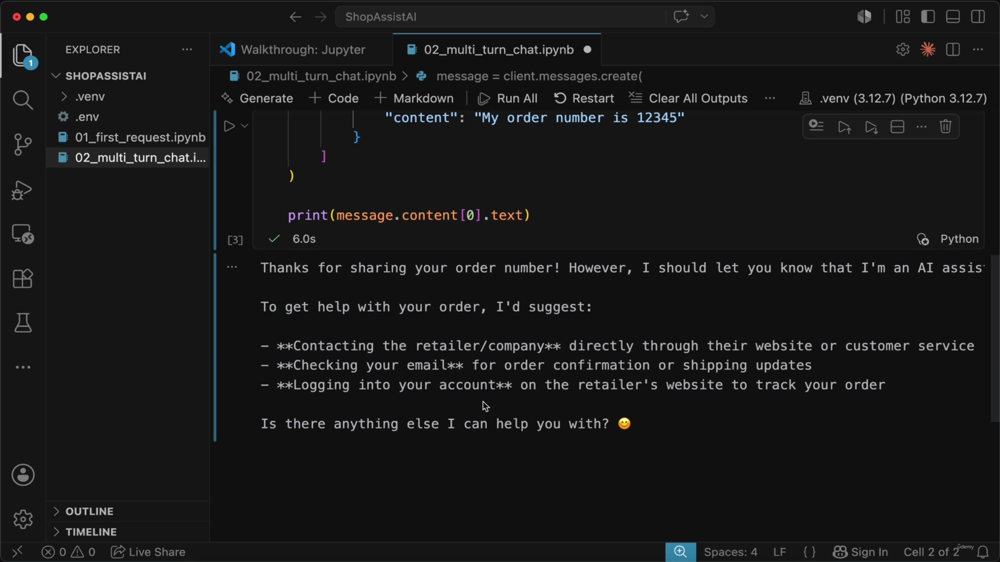
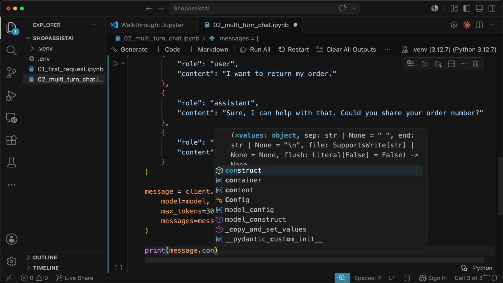
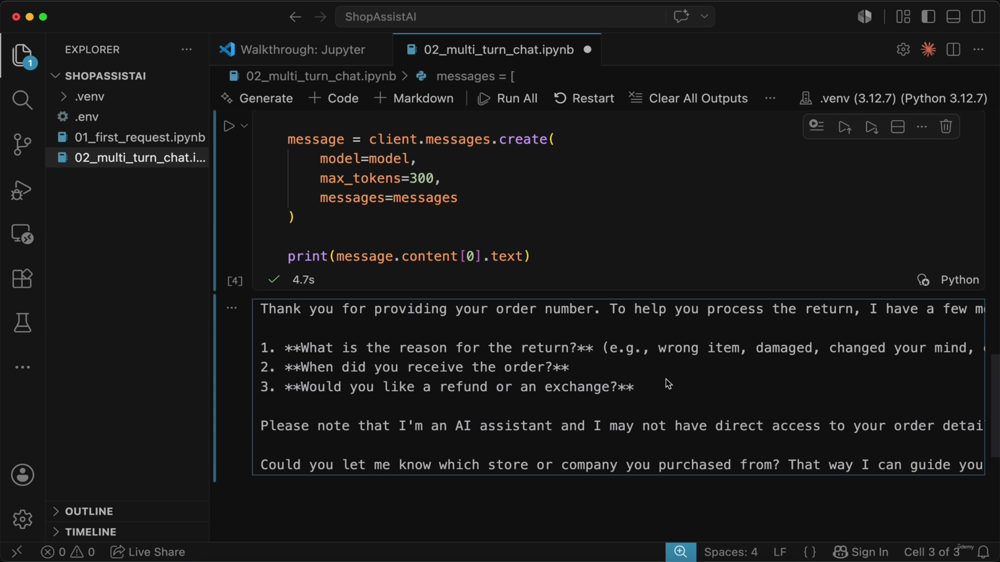
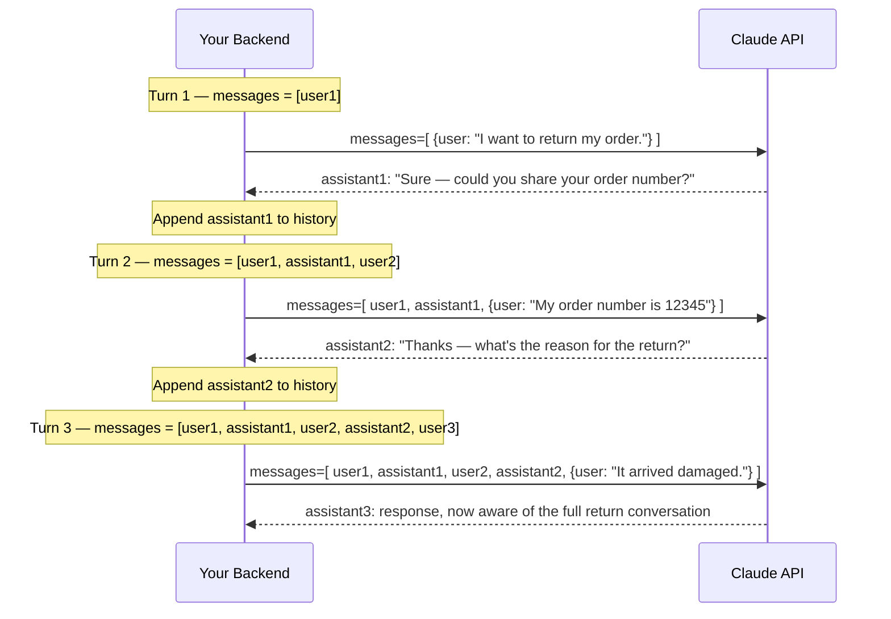

# Multi-Turn Conversations & Manual History

> The previous lecture made one isolated request to Claude and looked at the response object. This lecture makes the point that **a single request is not a chat application**. Claude's API is stateless — it has no memory of anything outside the current request — so "multi-turn conversation" is not a feature you turn on, it is an architecture pattern your own backend has to implement: collect the history, resend all of it, every time.



**[Note on the source images]** The slide note captured this same "Multi-Turn Conversations" title/summary slide five separate times in a row (00:00:00 → 00:01:59) while the narrator talked over it — the slide itself never changed in that window. Those duplicates are consolidated to the single image above. It also captured two fully blank/white transition frames (at 00:02:15 and 00:05:29) with no content, which are excluded below.

---

## 1. Claude is stateless

- Claude has **no built-in memory** of previous interactions.
- Memory is something *you* build, by carrying the whole conversation on every request.
- **[How to implement memory]** Because each API call is independent, your code must append every user and assistant turn to one list, then send that entire list again on the next call:
  - `messages = [user, asst, user, ...]`





> **Transcript color:** "A real support assistant does not work with one isolated message. The customer says something and ShopAssist replies. Then the customer adds more details. Then ShopAssist continues from the previous context."

---

## 2. Product vs. Developer experience

*(No distinct slide exists for this section or the next two — the deck stayed on the title slide from 00:00 to roughly 00:02:00 while this was explained verbally. Content below is reconstructed from the slide-note bullets and transcript narration only.)*

- **Using Claude (Product):** experienced through the web interface or app. The conversation feels natural because the *application* handles the heavy lifting — it automatically manages and sends the relevant chat history with each new message, and may bundle in built-in tools/product features.
- **Building with Claude (Developer):** requires manual management of state. You must explicitly track and send the conversation history yourself to maintain context.

### API vs. Product features

- Unlike ready-made chat applications, the **API does not provide the built-in tools or product features** that make the user experience feel seamless.
- Developers are responsible for building the application logic that handles the conversation flow.

### Manual context management

- Because each API request is isolated, the model only knows what is contained in the **current** request.
- **[What must be included manually?]**
  - **Previous messages** — to provide conversation history
  - **System prompts** — to define an assistant persona
  - **Business/customer data** — to provide access to tools, order information, or specific user details
- **[The Developer's Responsibility]** Unlike a consumer product, the API does not provide "hidden" memory; the developer must connect all pieces within their own application logic.

> **Transcript color:** "If we want Claude to know the previous messages, we must send those messages. If we want Claude to follow our assistant persona, we must provide a system prompt... So when we say multi-turn conversation, we are not talking about hidden [memory]. We are talking about our backend collecting the conversation history and sending the right context to Claude on every request."

---

## 3. Notebook setup

- Initializing the environment to work with Claude, reusing the same basic setup from the previous lesson.
- `load_dotenv()` lets Python load environment variables (like the API key) from a `.env` file.
- `client = Anthropic()` — because the API key is already in the environment, it does not need to be passed as a direct argument.
- The model name is stored in a variable (`model`) up front so the rest of the code stays clean and reusable across every request.

```python
from dotenv import load_dotenv
from anthropic import Anthropic

load_dotenv()

client = Anthropic()

model = "claude-sonnet-4-6"
```


**[Slide-note inconsistency]** The slide note's own "Notebook Setup" section (written before the "Notebook Setup Details" section) lists `model = "claude-3-sonnet-20240229"`. Neither the transcript nor the actual notebook screenshot above support that value — the screenshot and the transcript-backed follow-up code block both show `model = "claude-sonnet-4-6"`. Treated as a stray leftover/typo in the source notes and not carried forward as fact here.

---

## 4. Sending a single message

- **[The Initial Request]** To start a conversation, send a single message via `client.messages.create`.
- **[Key Parameters]**
  - `model` — reuses the `model` variable from setup
  - `max_tokens` — caps the maximum length of Claude's response (e.g., 300 tokens)
  - `messages` — a list of message objects, each with a `role` (e.g., `"user"`) and `content`

```python
message = client.messages.create(
    model=model,
    max_tokens=300,
    messages=[
        {"role": "user", "content": "I want to return my order."}
    ]
)

print(message.content[0].text)
```



Claude responds like a support assistant and asks for more information (e.g., an order number):



> **Transcript color:** "We call `client.messages.create` just like in the previous lesson... Claude will probably answer like a support assistant and ask for more information, such as the order number."

---

## 5. The common mistake — and its consequences

- **[The Problem]** When a user replies to a previous response, developers often mistakenly send **only the new message** in the `messages` list.
- **[Why it fails]** The API is stateless — it has no memory of the previous exchange. If you only send the new message, Claude loses all context of what was discussed before.

```python
# INCORRECT: This only sends the new message, losing previous context
message = client.messages.create(
    model=model,
    max_tokens=300,
    messages=[
        {"role": "user", "content": "My order number is 12345"}
    ]
)
```

- **[The Result]** Claude treats the interaction as a completely new, isolated request. It may still produce a reasonable-sounding answer, but it does not truly know the previous turn — it won't automatically know the user is attempting to return an order unless that intent is part of the *current* payload.



**[Example output of the incorrect request]** — Claude has no idea why an order number was just handed to it:

> Thanks for sharing your order number! However, I should let you know that I'm an AI assistant. To get help with your order, I'd suggest:
> - **Contacting the retailer/company** directly through their website or customer service
> - **Checking your email** for order confirmation or shipping updates
> - **Logging into your account** on the retailer's website to track your order
>
> Is there anything else I can help you with? 😊

> **Transcript color:** "This is exactly why we should not build applications that depend on the model guessing the missing context. If the context matters, we need to send it explicitly."

---

## 6. Implementing multi-turn conversations correctly

- **[The Rule]** If context matters, you cannot rely on the model to guess missing information — you must send the conversation history explicitly.
- **[The Correct Approach]** Build a `messages` list containing the full, chronological sequence of the exchange:
  1. The initial user message (the customer stating their intent)
  2. The assistant's previous reply (Claude's prior response)
  3. The new user message (the latest follow-up)

```python
messages = [
    {"role": "user", "content": "I want to return my order."},
    {"role": "assistant", "content": "Sure, I can help with that. Could you share your order number?"},
    {"role": "user", "content": "My order number is 12345"}
]

message = client.messages.create(
    model=model,
    max_tokens=300,
    messages=messages
)

print(message.content[0].text)
```



- **[The Mechanism]** By sending the full list (user intent → assistant reply → new user message), Claude can link the new information to the previous context — it recognizes that order #12345 is directly related to the earlier return request.



With the full history included, the same "My order number is 12345" follow-up now gets a response that is clearly anchored to the return request (asking for reason, receipt date, refund vs. exchange) instead of a generic "I'm just an AI" reply.

### How the messages array actually grows across turns



**Reading it:** the API itself never "remembers" turn 1 by turn 3 — the *entire* growing array is retransmitted on every single call. Nothing is cached or referenced by ID; the full conversation is the payload.

> **Transcript color:** "The conversation is not stored automatically inside Claude. The conversation is stored and managed by our application."

---

## 7. Conversation history as architecture

- **[The Developer's Role]** Because the API is stateless, managing the flow of a conversation becomes a **core part of the application's architecture**.
  - In consumer-facing apps (like the Claude web interface), this is handled automatically by the product.
  - In custom API-driven applications, the developer is responsible for implementing the logic to track and resend history.
- **[Managing state in production]** In a real-world environment, history is typically stored in:
  - A database
  - A session store
  - Another backend storage mechanism
- **[In development/notebooks]** A simple Python list is enough to manually manage the sequence of messages — which is exactly what this lesson does.

### Looking ahead: streamlining message management

- **[The Goal]** Move away from manually writing out message dictionaries for every single interaction.
- **[The Solution — next lesson]** Small helper functions to automate the process:
  - Adding user messages to the history
  - Saving assistant responses to the history
  - Building a simple reply loop for the application (ShopAssist AI)

---

## Quick comparison

| | Using Claude (Product) | Building with Claude (API) |
|---|---|---|
| **History management** | Automatic — the app tracks and resends it | Manual — your code must track and resend it |
| **System prompt / persona** | Built in | You must supply it explicitly per request |
| **Business/customer data & tools** | Handled by the product | You must connect it in your own application logic |
| **Where state lives** | Inside the hosted product | Your database/session store (or a Python list, in dev) |
| **Statelessness of the model itself** | Hidden from the user | Fully exposed — every request is isolated by default |

---

## Summary

- **Claude's API is stateless.** Each request is judged only on what's in that request's payload — nothing is remembered automatically between calls.
- **Multi-turn "memory" is a resend pattern**, not a Claude feature: append every user/assistant turn to a list, then send the whole list again on the next call.
- **The common bug** is sending only the newest user message on a follow-up — this silently strips all prior context and Claude answers as if the conversation just started.
- **The fix** is always the same: build the `messages` list as the full chronological sequence (prior user turns, prior assistant replies, new user turn) and send it in full, every time.
- **This is why conversation history is architecture, not an afterthought** — in production it lives in a database or session store; in a notebook, a plain Python list does the job.
- Next lesson: wrapping this manual list-building in small helper functions and a reply loop.

---

## In Plain English

Here's the whole file in plain, everyday language:

**The big picture:** sending one message to Claude and getting one answer back isn't a chat app — Claude has zero memory between requests, so "having a conversation" is something YOUR code has to build by hand, not a feature that's just switched on.

**1. Claude remembers nothing on its own**
Every single API call is completely independent. If you want Claude to remember what was said two messages ago, YOU have to resend the entire conversation, every single time.

**2. The product (Claude App) hides this from you**
When you chat with Claude in the browser, the app is quietly doing all this history-management work behind the scenes. When you're the one calling the API directly, none of that convenience exists — you own it all yourself.

**3. The most common beginner mistake**
When the user sends a follow-up message, only sending THAT new message (forgetting to include everything said before it). Claude then has no idea what's being discussed and responds like the conversation just started from scratch — even giving generic "I'm just an AI, contact the retailer" type answers.

**4. The actual fix**
Keep a running list of every message (both what the user said AND what Claude replied), tagged with who said it (`"role": "user"` or `"role": "assistant"`), and resend that ENTIRE growing list on every single request.

**5. Why this works**
Because Claude sees the whole history again each time, it can connect new information (like "my order number is 12345") back to what was said earlier (like "I want to return my order") — even though Claude itself never actually "remembers" anything between calls.

**6. In a real production app**
This history can't just live in a Python variable that disappears when the program stops — it needs to be saved somewhere durable, like a database.

**One-sentence summary:** Claude's API has zero memory between requests, so a real multi-turn conversation only works if your own code keeps a running list of every message and resends the entire thing on every single request — forget this and Claude will act like the conversation never happened.

---

*Sources: [slide notes](../06-Multi-Turn-Conversations-And-Manual-History.md) · [[hover-notes-transcripts/06-Multi-Turn-Conversations-And-Manual-History (transcript)|full transcript]]*
