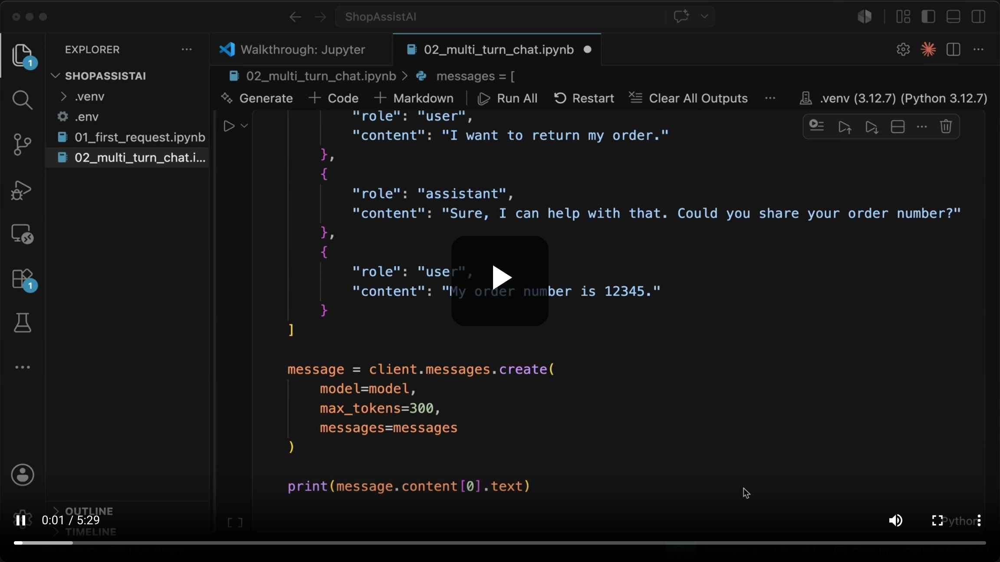
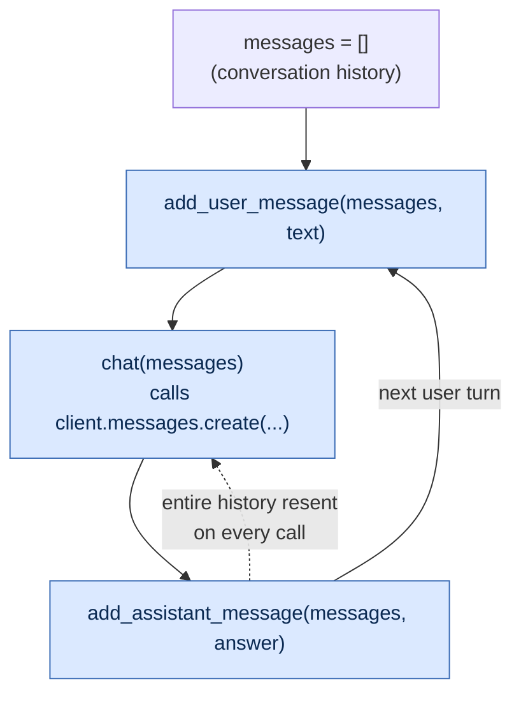
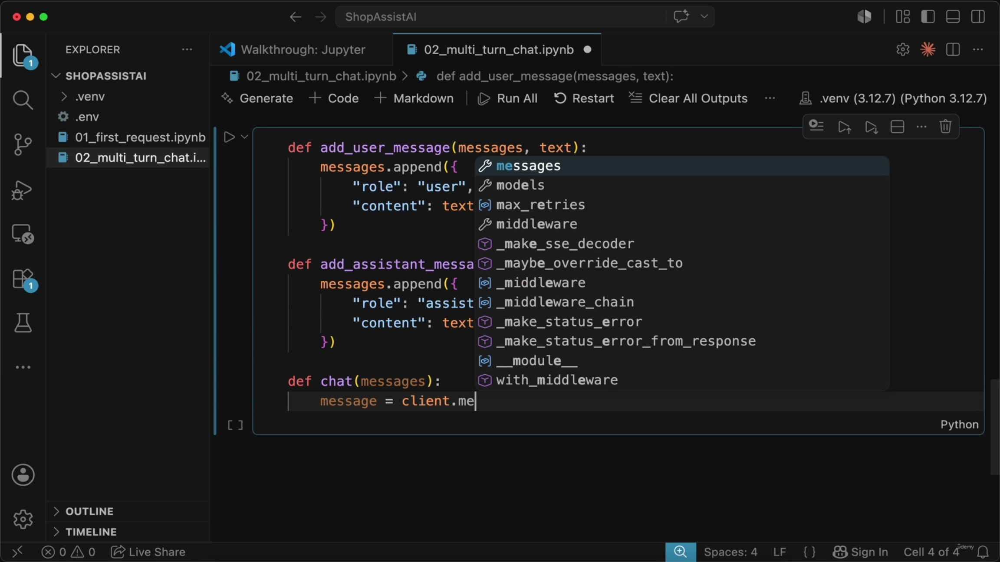
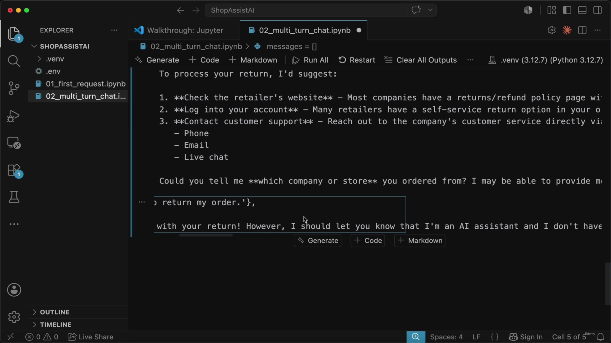
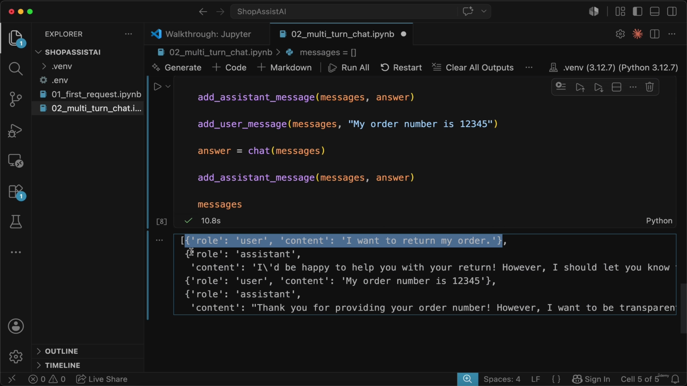
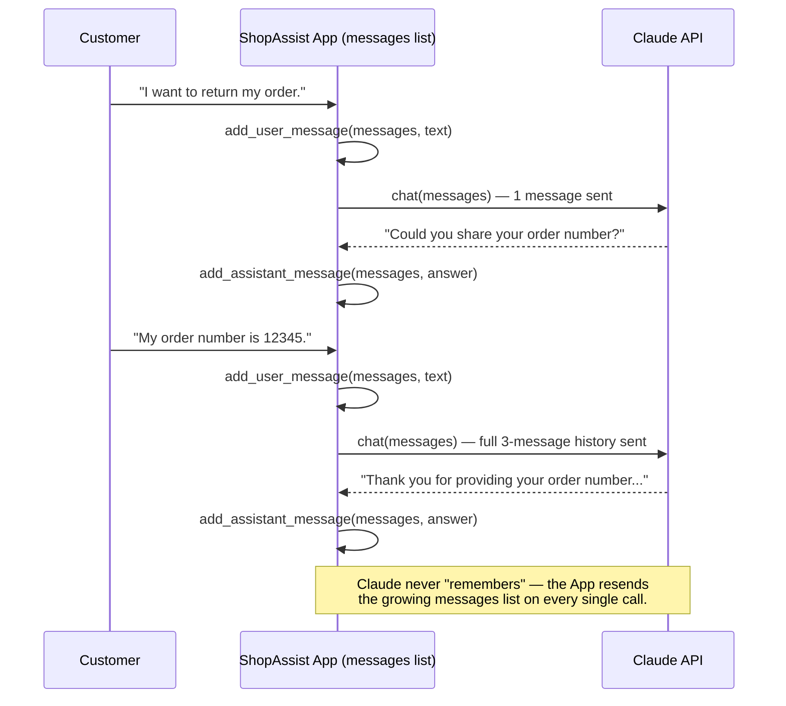

# Conversation History, Helper Functions & the Chat Loop

> The Claude API is stateless — it never remembers a previous request on its own. This lecture takes the manual, hand-written `messages` list from the previous lesson and refactors it into three small, reusable helper functions (`add_user_message`, `add_assistant_message`, `chat`) that together form the basic **chat-loop pattern** every multi-turn Claude application is built on.



## Overview: the chat-loop pattern



**Reading it:** nothing here is automatic — every arrow is a line of application code. Claude only ever sees what's currently sitting in `messages`; if a turn isn't appended to that list, it's as if it never happened.

---

## 1. Why the manual approach doesn't scale

- Claude API requests are **stateless** — the model does not automatically remember previous requests or context.
- **[How to maintain conversation]** To enable multi-turn conversations (like in ShopAssist AI), the application must:
  - Keep track of previous messages
  - Send the entire conversation history back to Claude with each new request
- This was already tested manually by building a `messages` list by hand — but **writing message dictionaries for every turn is a poor pattern** that doesn't scale.

```python
{
    "role": "user",
    "content": "I want to return my order."
},
{
    "role": "assistant",
    "content": "Sure, I can help with that. Could you share your order number?"
},
{
    "role": "user",
    "content": "My order number is 12345."
}
```

> **Transcript color:** "We saw why conversation history matters. Claude API requests are stateless. That means Claude does not automatically remember what happened in a previous request... That worked, but writing message dictionaries by hand every time is not a good pattern."

**[Refactor plan]** The fix is a set of small helper functions:
- A function to add **user** messages
- A function to add **assistant** messages
- A function to **send** the current conversation to Claude
- *(Next lecture)* a **system prompt** to define ShopAssist AI's persona, role, and tone

---

## 2. `add_user_message`

- **[Purpose]** Performs the single job of adding the user's latest message to the conversation history.
- **[Function inputs]**
  - `messages` — the list storing the conversation so far
  - `text` — the new string message sent by the user
- **[Mechanism]** Calls `.append()` on `messages` with a new dictionary: `"role"` set to `"user"`, `"content"` set to `text`.

```python
def add_user_message(messages, text):
    messages.append({
        "role": "user",
        "content": text
    })
```

## 3. `add_assistant_message`

- **[Purpose]** Adds Claude's response to the conversation history with the correct identifier.
- **[Function inputs]** Same shape as above — `messages` and `text` (this time, Claude's response text).
- **[Mechanism]** Appends a dictionary with `"role"` set to `"assistant"` and `"content"` set to `text`.
- **[Why the role matters]** Claude needs to know which messages came from the customer and which came from the assistant to maintain context across a multi-turn conversation.

```python
def add_assistant_message(messages, text):
    messages.append({
        "role": "assistant",
        "content": text
    })
```

> **Transcript color:** "This distinction is important. When we send the conversation history back to Claude, Claude needs to know which messages came from the customer and which messages came from the assistant."



*The screenshot above catches both helpers freshly written side by side in the notebook, with the `chat` function already started underneath (`message = client.me…`) — a natural mid-build checkpoint rather than a separate concept.*

---

## 4. `chat` — sending the request to Claude

- **[Purpose]** Handles the actual communication with the Claude API: sends the conversation history and retrieves the AI's response.
- **[Function inputs]** `messages` — the complete list of conversation history (both user and assistant turns).
- **[Mechanism]**
  - Calls `client.messages.create(...)` with:
    - `model` — the model to use
    - `max_tokens` — set to `300` to cap response length
    - `messages` — the full conversation history list
  - **[Handling the response]** The API returns a complex response object with metadata and other information. To keep things simple, the function extracts and returns only the response text via `message.content[0].text`.

```python
def chat(messages):
    message = client.messages.create(
        model="claude-3-5-sonnet-20240620",
        max_tokens=300,
        messages=messages
    )
    return message.content[0].text
```

**[Slide detail]** While typing `client.messages.create(`, the editor's own autocomplete tooltip briefly surfaced the method's full keyword signature — not discussed in the transcript or slide bullets, but a useful reference for what else the SDK exposes beyond `model`/`max_tokens`/`messages`:

```
(*, max_tokens: int, messages: Iterable[MessageParam], model: ModelParam,
 cache_control: CacheControlEphemeralParam | Omit | None = omit,
 container: str | Omit | None = omit,
 inference_geo: str | Omit | None = omit,
 metadata: MetadataParam | Omit = omit,
 output_config: OutputConfigParam | Omit = omit,
 service_tier: Omit | Literal['auto', 'standard_only'] = omit,
 stop_sequences: SequenceNotStr[str] | Omit = omit,
 stream: Omit | Literal[False] = omit,
 system: str | Iterable[TextBlockParam] | Omit = omit, ...)
```

This lecture only ever uses `model`, `max_tokens`, and `messages` — the rest (`system`, `stop_sequences`, `stream`, `cache_control`, etc.) are the hooks used in later lectures.

---

## 5. Putting the helpers together

- **[Workflow]** The helper functions and `chat` work together to drive one turn of a conversation:
  1. Initialize an empty list: `messages = []`
  2. Add user input via `add_user_message(messages, text)`
  3. Send history to Claude via `chat(messages)`
  4. Print the response
  5. **[Critical step]** Save Claude's response back via `add_assistant_message(messages, answer)`

```python
messages = []

add_user_message(messages, "I want to return my order.")
answer = chat(messages)
print("ShopAssist:", answer)
add_assistant_message(messages, answer)
```

- **[Why the last step matters]** If the assistant's answer is not saved back into `messages`, the *next* call to `chat(messages)` will only contain the user's message — it will be missing everything the assistant previously said.



**[Slide detail]** The actual response Claude gave in the demo run (visible on screen, not quoted in the transcript or slide bullets) shows the model proactively disclosing that it's an AI without a real backend to look anything up in, and falling back to generic self-service guidance:

> "...with your return! However, I should let you know that I'm an AI assistant and I don't have [access to your actual order]... To process your return, I'd suggest: **1. Check the retailer's website** ... **2. Log into your account** ... **3. Contact customer support** — Phone / Email / Live chat. Could you tell me **which company or store** you ordered from?"

This is a nice, concrete illustration of a point made in earlier lectures: without tools/MCP wired up, Claude can only reason and ask clarifying questions — it has no real order-lookup capability yet.

---

## 6. Inspecting and continuing the conversation

- **[Result]** After running the sequence above, `messages` contains both the user's prompt and the assistant's reply — the Python list is now acting as a simple conversation history.

```python
# The resulting messages list structure:
[
    {'role': 'user', 'content': 'I want to return my order.'},
    {'role': 'assistant', 'content': "I'd be happy to help you with your return! However, I should let you know that..."}
]
```

- **[Workflow]** Adding a follow-up turn to the *existing* conversation (not starting from an empty list):
  1. Reuse the existing `messages` list, which already holds the previous user + assistant turns.
  2. `add_user_message(messages, "My order number is 12345")` appends the new input.
  3. `chat(messages)` sends the **entire, updated** history to Claude.

```python
# Continuing the conversation
add_user_message(messages, "My order number is 12345")
answer = chat(messages)
print("ShopAssist:", answer)
add_assistant_message(messages, answer)
```



*(This screenshot shows the four-message history after both turns — it doubles as the payoff for both "inspecting the history" and "maintaining context across turns," since the same code/output state covers both ideas.)*

- **[Why this works]** Because `messages` is sent in its entirety, Claude receives full context: the original intent (returning an order), the assistant's earlier follow-up question (asking for the order number), and the new information (the order number itself).
- **[Key insight]** Claude does not remember previous requests on its own. The application is responsible for remembering the history and sending it back to the model with every new request.

**[Slide detail]** The demo's second response — again visible on screen but not in the transcript/bullets — has Claude continuing to be transparent about its limits even after receiving the order number: `"Thank you for providing your order number! However, I want to be transparent..."` (cut off on screen, but consistent with the same "no real backend access" caveat from the first turn).

### The two-turn exchange, end to end



---

## 7. Conversation history vs. system prompts

| | Conversation History | System Prompt |
|---|---|---|
| **Provides** | The context of the interaction | The model's identity and persona |
| **Tells Claude** | What has been said previously in the dialogue | How it should behave (e.g., acting as a specific support agent) |

> **Transcript color:** "So now ShopAssist can continue a basic conversation, but it still does not have a clear role or behavior... Conversation history tells Claude what has been said. A system prompt tells Claude how to behave." That's what the next lecture fixes.

---

## Summary

- Claude API calls are **stateless** — multi-turn conversation is an application-level responsibility, not a model feature.
- `add_user_message(messages, text)` and `add_assistant_message(messages, text)` replace hand-written dictionaries, tagging each turn with the correct `"role"`.
- `chat(messages)` is the single place that talks to `client.messages.create(model=..., max_tokens=300, messages=messages)` and unwraps the response down to `message.content[0].text`.
- The loop is: **append user turn → send full history → append assistant turn → repeat.** Skipping the last step silently breaks context on the next call.
- Conversation history and system prompts are complementary, not interchangeable: history = *what was said*; system prompt = *how to behave* (covered next).

---

*Sources: [slide notes](../07-Conversation-Helper-Function-And-Chat-Loop.md) · [[hover-notes-transcripts/07-Conversation-Helper-Function-And-Chat-Loop (transcript)|full transcript]]*
