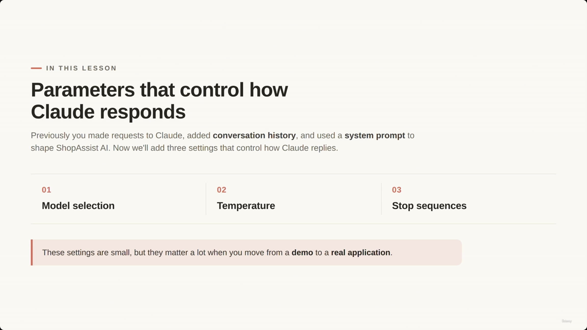
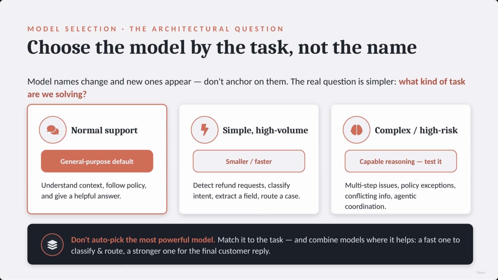
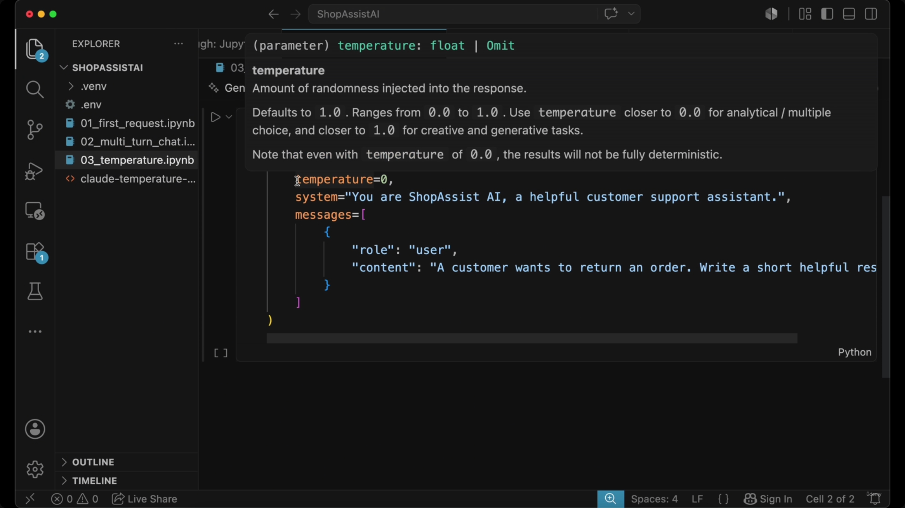
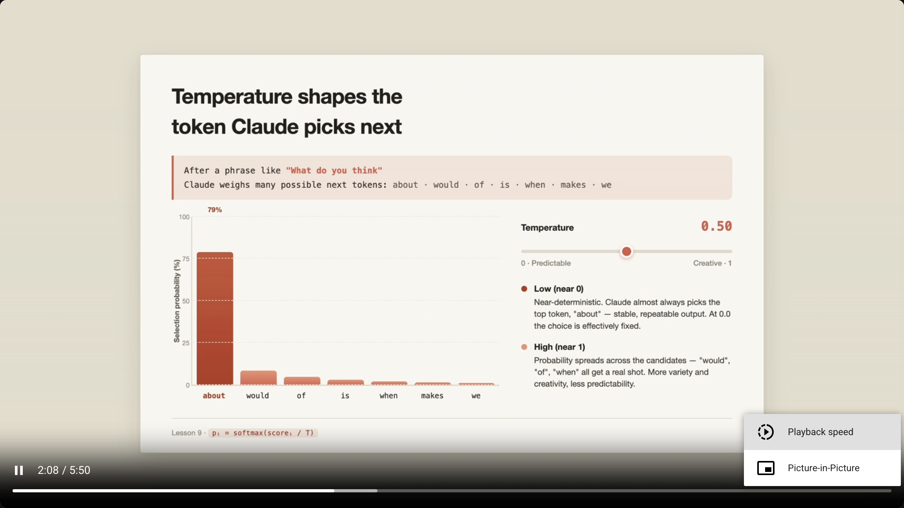
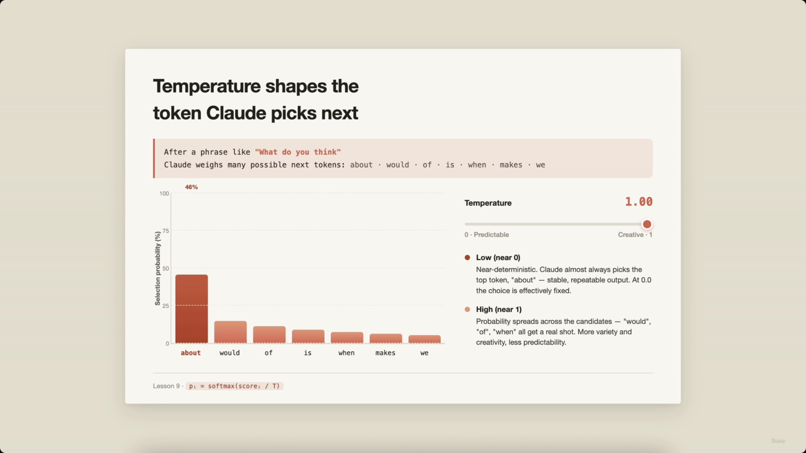
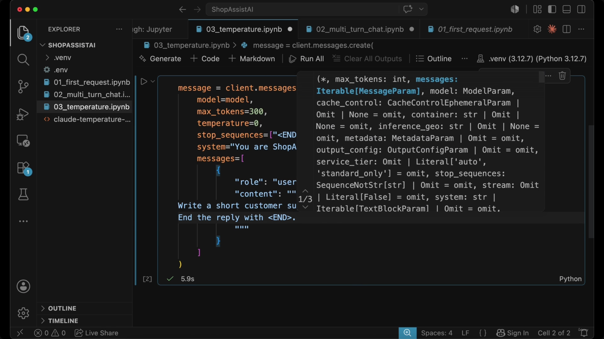
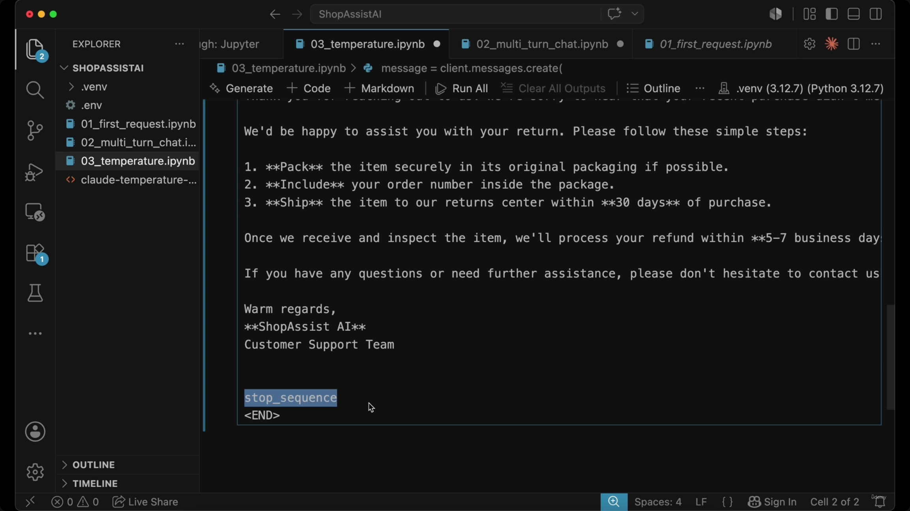
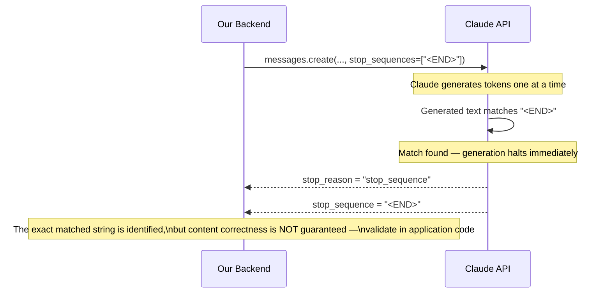
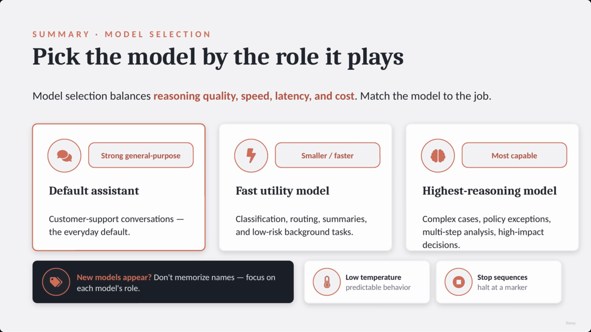

# Temperature, Model Selection, Prefill, and Stop Sequences

> **[Note]** Despite the lecture's filename, neither the captured slides nor the spoken transcript for this video actually cover **prefill** as a topic — the lecture (5:50 total) only walks through **model selection**, **temperature**, and **stop sequences**. Prefill is presumably covered in a separate lecture; nothing here has been invented to fill that gap.

Previously, requests to Claude added conversation history and a system prompt to shape ShopAssist AI's behavior. This lecture adds three settings that control *how* Claude responds — small parameters that matter a lot once you move from a demo to a real application.



---

## 1. Model Selection

- **[The Architectural Question]** Don't anchor on specific model names — they change frequently as new ones appear. Instead ask: **what kind of task are we solving?**

| Task Type | Model Characteristic | Use Case |
|---|---|---|
| Normal support | General-purpose default | Understand context, follow policy, and give a helpful answer |
| Simple, high-volume | Smaller / faster | Detect refund requests, classify intent, extract a field, route a case |
| Complex / high-risk | Capable reasoning — test it | Multi-step issues, policy exceptions, conflicting info, agentic coordination |

- **Strategy:** Don't automatically pick the most powerful model.
  - Match the model to the task.
  - Combine models where it helps — e.g., a **fast model to classify/route**, then a **stronger model for the final reply**.

> **Transcript color:** "Do not choose the most powerful model automatically. Choose the model based on the task. A simple task does not always need the most expensive model, but a risky or complex task should not be optimized only for cost."



*(This same "Choose the model by the task, not the name" slide was held on screen for roughly a minute while the narrator worked through all three task types — it recurs four times in the raw capture at 00:00:27, 00:00:43, 00:01:14, and 00:01:43; all four are pixel-identical, so only one copy is kept here.)*

---

## 2. Temperature

- Claude generates text by predicting **one token at a time**, not a full sentence at once.
- Each candidate next token gets a probability. Example: after "what do you think", candidates might include *about, would, of, is, when, makes, we* — one is far more likely than the rest.
- **Temperature controls how strongly Claude follows those calculated probabilities.**

```python
# temperature is a float parameter
# Defaults to 1.0. Ranges from 0.0 to 1.0.
# Use closer to 0.0 for analytical/multiple choice
# Use closer to 1.0 for creative and generative tasks.

temperature = 0.0
system = "You are ShopAssist AI, a helpful customer support assistant."
messages = [
    {"role": "user", "content": "A customer wants to return an order. Write a short helpful res"}
]
```

**[Slide detail]** The in-editor parameter tooltip for `temperature` (shown below, not spoken verbatim in the transcript) spells out the exact contract:

> `(parameter) temperature: float | Omit` — *Amount of randomness injected into the response. Defaults to `1.0`. Ranges from `0.0` to `1.0`. Use temperature closer to `0.0` for analytical / multiple choice, and closer to `1.0` for creative and generative tasks. Note that even with temperature of `0.0`, the results will not be fully deterministic.*

The last sentence is echoed loosely in the transcript ("temperature equals zero tells Claude to be more consistent... it does not mean the output will be perfectly identical every time"), but the precise wording and the `float | Omit` typing only appear on the slide.



### Temperature's effect on token selection

- **Low Temperature (near 0.0):** more deterministic — one token receives almost all the probability → stable, predictable, repeatable output.
- **High Temperature (near 1.0):** more variety — probability spreads across more candidates → the model has "freedom" to pick less-obvious, lower-probability options.

**[Slide detail]** The slide includes an interactive demo with an exact formula not mentioned in the transcript or the slide-note's bullets: **pᵢ = softmax(scoreᵢ / T)** — the standard temperature-scaled softmax. The demo shows two concrete readings for the top candidate token ("about") as the slider moves:

| Temperature (T) | P(top token "about") |
|---|---|
| ~0.0 (near-deterministic, per slide description) | ≈ 100% |
| **0.50** | **79%** |
| **1.00** | **46%** |

```mermaid
xychart-beta
    title "Probability assigned to the top token (\"about\") as Temperature increases"
    x-axis ["T ≈ 0.0 (near-deterministic)", "T = 0.50", "T = 1.00"]
    y-axis "P(top token) %" 0 --> 100
    bar [100, 79, 46]
```





*(A third capture of the same slider slide at 00:02:22 only differs by a "Playback speed 1.50x" browser overlay — same 0.50/79% reading underneath, so it's excluded as a duplicate. Likewise the editor tooltip from 00:01:53 recurs unchanged at 00:03:30 and is excluded.)*

### Matching temperature to the task

- Temperature isn't about "good" or "bad" settings — it's about **matching the setting to the task**.
- **Low temperature (e.g., 0.0):** consistency and predictability — ideal for support automation and refund-policy answers. Reduces randomness so replies don't drift too much between requests.
- **High temperature:** creative/generative tasks — e.g., brainstorming five creative product campaign ideas.

```python
# Example configuration for consistent support replies
temperature = 0.0
system = "You are ShopAssist AI, a helpful customer support assistant."
messages = [
    {"role": "user", "content": "A customer wants to return an order. Write a short helpful res"}
]
```

> **Transcript color:** "For support extraction, classification and policy driven decisions, lower temperature is usually better."

---

## 3. Stop Sequences

- A **custom text marker** that tells Claude exactly when to stop generating.
- The `stop_sequences` parameter accepts a **list of strings**. If Claude generates any of them, the API immediately halts the response.
- **Use case:** stop Claude before it bleeds into a section it shouldn't generate — e.g., generate only the customer-facing reply and stop before an internal-notes section, using a boundary marker like `<END>`.

```python
message = client.messages.create(
    model=model,
    max_tokens=300,
    temperature=0,
    stop_sequences=["<END>"],
    system="You are ShopAssist AI, a helpful customer support assistant.",
    messages=[
        {"role": "user", "content": "Write a short customer support reply about a return request. End the reply with <END>"}
    ]
)
```

**[Slide detail]** The editor's autocomplete for `client.messages.create(...)` (visible on-slide, not called out in the bullets or transcript) shows the fuller parameter surface: `max_tokens: int`, `messages: Iterable[MessageParam]`, `model: ModelParam`, `cache_control`, `container`, `inference_geo`, `metadata`, `output_config`, `service_tier: Literal['auto', 'standard_only']`, `stream: Literal[False]`, `system: str | Iterable[TextBlockParam]`, and — the one that matters here — **`stop_sequences: SequenceNotStr[str] | Omit = omit`**, confirming it's an optional list-of-strings parameter.



**Example generated output** (from the slide's notebook run) — the reply opens with an apology for the return, then:

```
We'd be happy to assist you with your return. Please follow these simple steps:

1. **Pack** the item securely in its original packaging if possible.
2. **Include** your order number inside the package.
3. **Ship** the item to our returns center within **30 days** of purchase.

Once we receive and inspect the item, we'll process your refund within **5-7 business days**.

If you have any questions or need further assistance, please don't hesitate to contact us...

Warm regards,
**ShopAssist AI**
Customer Support Team

stop_sequence
<END>
```

The notebook highlights `stop_sequence` / `<END>` directly beneath the generated reply — visual confirmation that generation stopped exactly at the boundary marker rather than continuing further.



### How stop_sequences interacts with stop_reason



### Stop sequences vs. validation

- **[Important distinction]** Stop sequences ≠ validation.
  - A stop sequence can prevent the model from generating extra text (like internal notes).
  - It **cannot** guarantee the generated text follows a schema or is factually accurate.
  - For production systems — especially JSON or tool calls — you still need **programmatic validation** in your application code.
- **[API Details]** When a stop sequence is triggered:
  - `stop_reason` explicitly states `stop_sequence`.
  - The response also identifies the exact string that halted generation (the `stop_sequence` field).

> **Transcript color:** "Stop sequences are not the same as validation. They can help control where the model stops, but they do not guarantee that the full output is correct."

---

## Quick reference: the three parameters

| Parameter | What it controls | Typical values / defaults | When to use it |
|---|---|---|---|
| **Model selection** | Which model handles the task — reasoning quality vs. speed vs. cost | Default general-purpose model; smaller/faster model; most-capable reasoning model | Match the model to the task type, not the model's name; combine models (fast classifier → strong responder) |
| **Temperature** | How strongly Claude follows token probabilities when sampling | Float, **default 1.0**, range **0.0–1.0**. Even at 0.0, output is not perfectly deterministic | Low (≈0.0) for consistent support/policy answers; high (≈1.0) for brainstorming/creative generation |
| **Stop sequences** | A custom string boundary that halts generation immediately | List of strings, e.g. `["<END>"]`; reported back via `stop_reason = "stop_sequence"` and the matching `stop_sequence` string | Prevent bleed into a section that shouldn't be generated (e.g., internal notes); NOT a substitute for output validation |



---

## Summary

- **Model selection** balances reasoning quality, speed, latency, and cost — think in terms of the *role* a model plays (default assistant, fast utility model, highest-reasoning model), not its name, since names change as new models appear.
- **Temperature** (default 1.0, range 0.0–1.0) governs how deterministic vs. creative token selection is. Low for support automation and policy answers; high for brainstorming and creative copy.
- **Stop sequences** give Claude a literal text boundary to halt at, surfaced via `stop_reason = "stop_sequence"` and the matched string — useful for separating sections, but never a replacement for real output validation.

> **Transcript color:** "As new models appear, do not memorize only the names. Focus on the role each model plays in your system — default assistant, fast utility model, or highest reasoning model. Use low temperature when you need predictable support behavior. Use stop sequences when your application needs Claude to stop at a specific point."

---

## In Plain English

Here's the whole file in plain, everyday language:

**The big picture:** three separate knobs that control HOW Claude responds (not what it knows) — which model to use, how random/creative vs. predictable its answers are, and how to force it to stop generating at an exact spot. (Note: despite the title, this lecture doesn't actually cover "prefill" — that's a separate topic elsewhere.)

**1. Picking a model**
Don't just always reach for "the biggest/most powerful one." Think about the actual task — a fast, cheap model is fine for simple classification/routing jobs; save the more expensive, more capable model for genuinely complex or high-risk decisions. You can even chain them: a fast model to sort/classify, then a stronger model to write the final reply.

**2. Temperature — how "risk-taking" Claude is with word choice**
Claude always calculates a probability for every possible next word. Low temperature (near 0) makes it almost always pick the most likely word — consistent, predictable, boring. High temperature (near 1) lets it pick less-obvious words more often — more variety, more creative, less predictable. Even at temperature 0, answers still aren't 100% identical every single time.

**3. Match temperature to the job**
Low temperature for support replies, policy answers, classification — anything where you want consistency. High temperature for brainstorming, creative writing — anything where variety is actually the goal.

**4. Stop sequences — a hard stop marker**
Give the API a specific string (like `<END>`), and tell the model in your PROMPT to actually write that string when it's done. The moment that exact text shows up in the output, the API cuts generation off immediately, no matter what.

**5. How you know it triggered**
The response tells you `stop_reason = "stop_sequence"` (why it stopped) plus exactly which string caused it (`stop_sequence` field).

**6. The important warning**
A stop sequence only controls WHERE the text stops — it says absolutely nothing about whether what came before it is actually correct. You still need real validation in your own code for anything that matters.

**One-sentence summary:** Pick your model based on the task (not just "biggest is best"), use low temperature for consistent/predictable answers and high temperature for creative ones, and use stop sequences as a hard boundary marker to stop generation at an exact point — but never mistake a stop sequence for actual output validation.

---

*Sources: [slide notes](../09-Temperature-ModelSelection-Prefill-And-StopSequences.md) · [[hover-notes-transcripts/09-Temperature-ModelSelection-Prefill-And-StopSequences (transcript)|full transcript]]*
