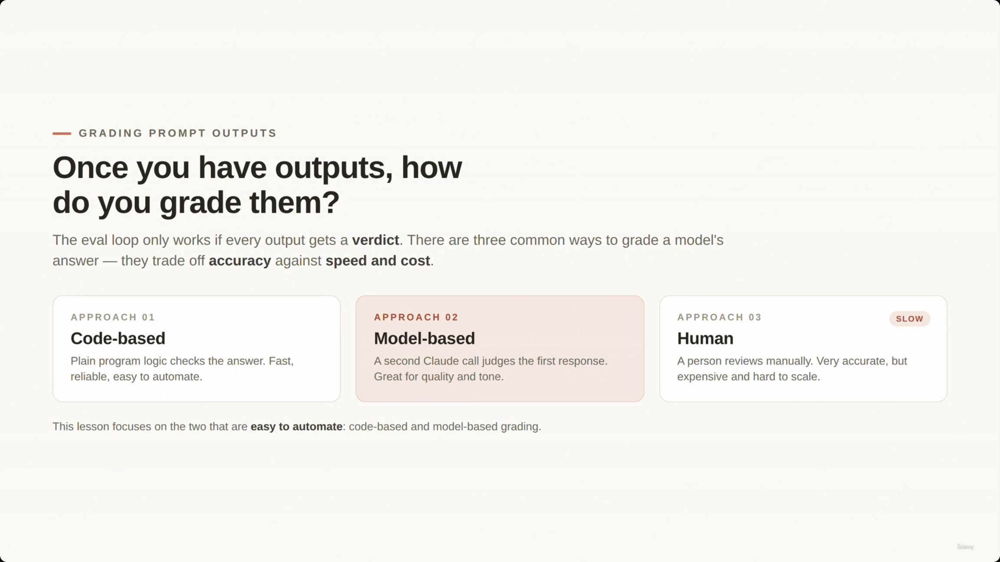
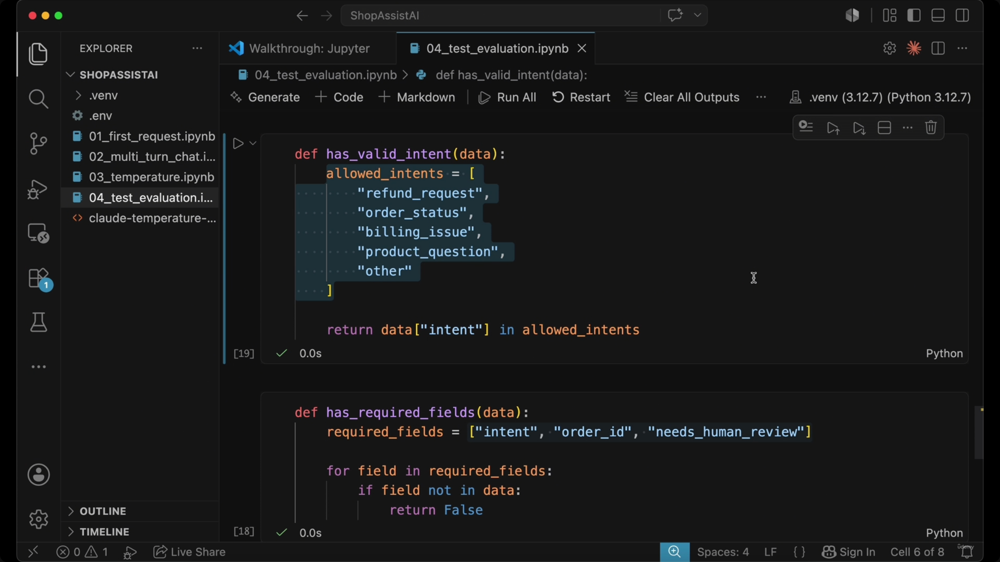
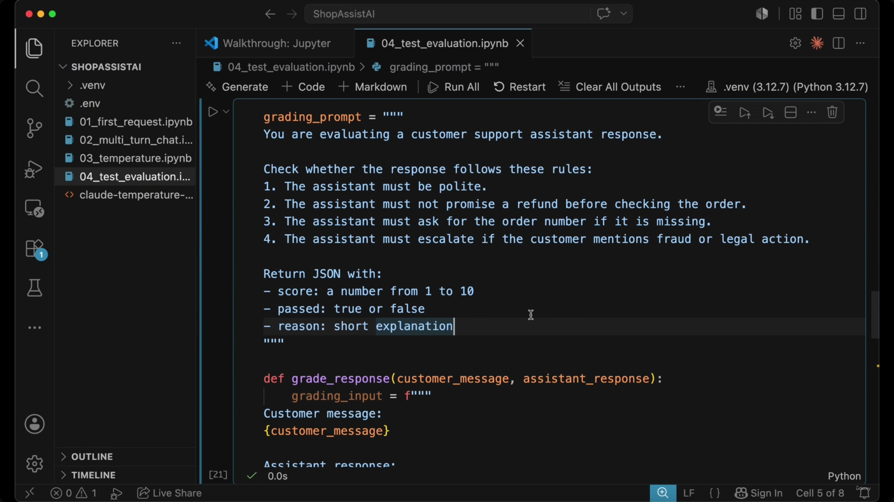
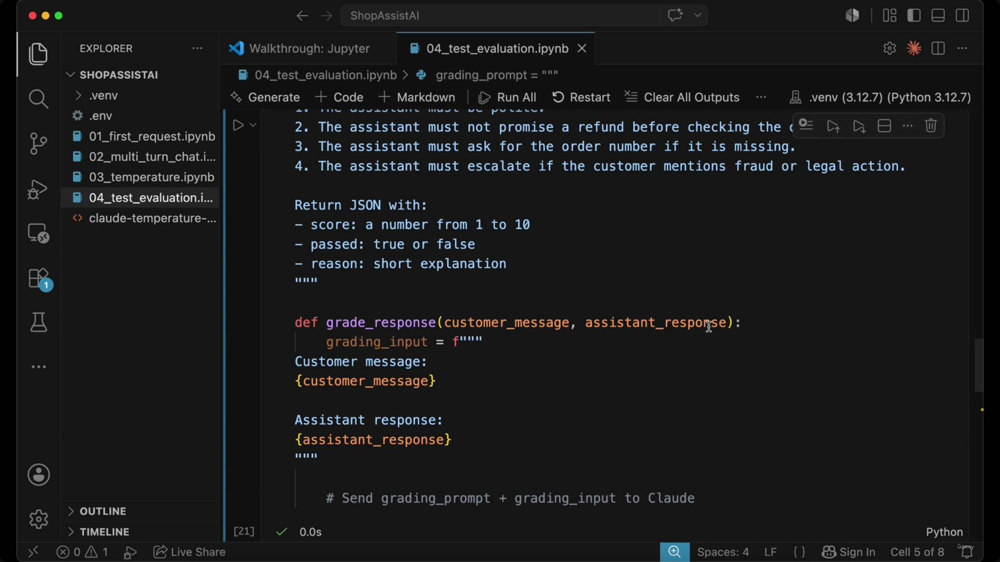
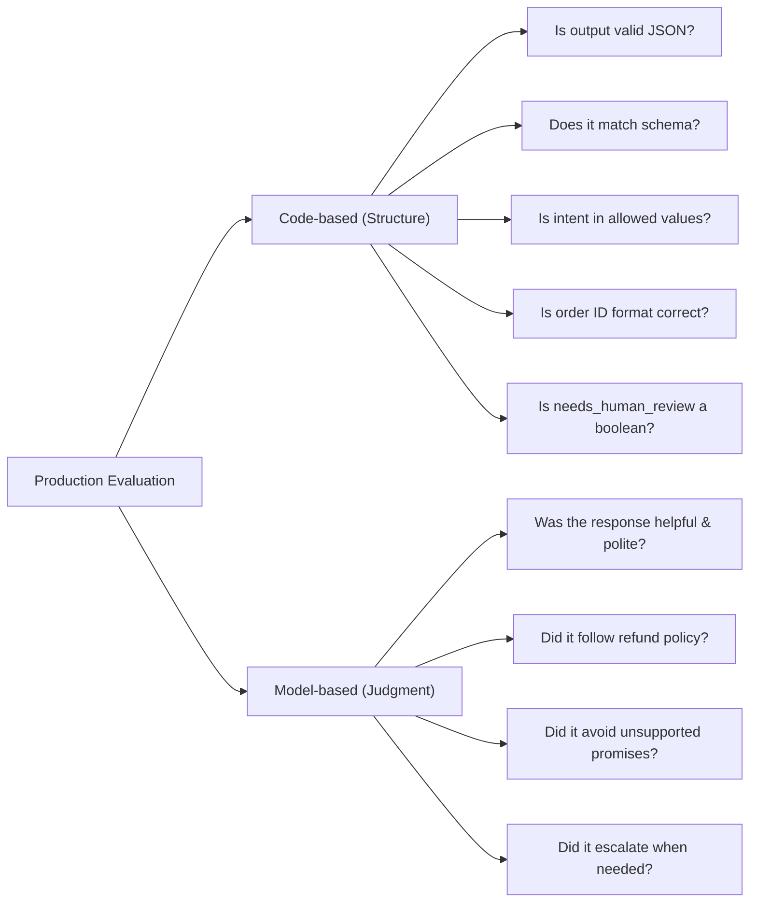
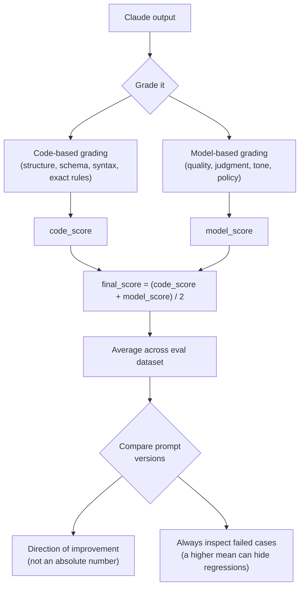

# Grading Claude Outputs: Code, Model, and Human Review

> The [[10-Prompt-Evaluation-Workflow 1|previous lecture]] built the eval loop: write test cases, run them through Claude, compare outputs, improve the prompt, run again. This lecture answers the question that loop depends on — **once you have an output, how do you decide if it's actually good?** Every output needs a verdict, and there are three ways to produce one, trading accuracy against speed and cost.



## Grading Prompt Outputs — three approaches

| Approach | What it is | Speed | Cost | Reliability | Best for |
|---|---|---|---|---|---|
| **01. Code-based** | Plain program logic checks the answer | Fast | Cheap | High (deterministic) | Structure, schemas, exact rules |
| **02. Model-based** | A second Claude call judges the first response | Medium | Medium | Variable (still a model) | Quality, tone, judgment, policy |
| **03. Human** | A person reviews manually | Slow | Expensive | Very accurate | High-stakes / hard-to-automate cases |

- The eval loop only works if **every** output gets a verdict.
- Human review is the most accurate but the slowest and most expensive — it doesn't scale.
- **This lesson focuses on the two approaches that are easy to automate: code-based and model-based grading.**

> **Transcript color:** "Human grading means a person reviews the output manually. It can be very accurate, but it is slow and expensive — so in this lesson we will focus mainly on the two approaches that are easier to automate."

---

## 1. Code-based grading

- Normal program logic checks whether the answer is correct — works best when the output has a **clear, predictable structure**.
- **Deterministic by nature:** the result is binary (valid/invalid, pass/fail) because the checks follow strict logic.

### JSON Validation

Checks whether Claude's response can be parsed as JSON at all:

```python
import json

def is_valid_json(text):
    try:
        json.loads(text)
        return True
    except json.JSONDecodeError:
        return False
```

### Field Validation

Checks that all fields the application depends on are present:

```python
def has_required_fields(data):
    required_fields = ["intent", "order_id", "needs_human_review"]
    for field in required_fields:
        if field not in data:
            return False
    return True
```

### Value Validation

Checks that a field's value falls within an allowed set — e.g. that `intent` is one of the values ShopAssist AI actually knows how to route:

```python
def has_valid_intent(data):
    allowed_intents = [
        "refund_request",
        "order_status",
        "billing_issue",
        "product_question",
        "other"
    ]
    return data["intent"] in allowed_intents
```


> **Note on this screenshot:** the slide note originally placed this code capture under an "Automation Advantages" header (a text-only slide with no code). Looking at the actual image content, it clearly belongs here — it's the `is_valid_json` / `has_required_fields` code shown live in the `04_test_evaluation.ipynb` notebook. This is a case of the capture lagging the real slide transition; it's filed under the correct section here.



**Why this matters for ShopAssist AI** — missing or invalid fields break core application logic, not just "look wrong":

| Missing field | Consequence |
|---|---|
| `intent` | Cannot route the request |
| `order_id` | May trigger an unnecessary follow-up question |
| `needs_human_review` | May fail to escalate a sensitive case |

**Code-based grading is fast, reliable, and easy to automate** — but only for things that reduce to a strict rule.

---

## Limitations of code-based grading

Code can only check **structure**, not **quality**. Some things simply can't be reduced to a true/false rule — judging whether an answer is *good* requires evaluating meaning, tone, and policy.


| Easy for code (strict rules) | Hard for code (judgment & policy) |
|---|---|
| Is the JSON valid? | Was the answer polite? |
| Is the field present? | Did it explain the return/refund policy clearly? |
| Is the value in the allowed list? | Did it avoid promising a refund too early? |
| Does the output match the schema? | Did it ask for missing information (e.g. an order number)? |
| | Did it escalate when necessary (e.g. fraud, legal threats)? |

**The solution:** for the questions on the right, you need a grader that understands language — that's **model-based grading**.

---

## 2. Model-based grading

Uses a **second LLM call** to evaluate the response produced by the first:

- **First LLM** → produces the actual customer support answer.
- **Second LLM** (the "grader") → evaluates the quality of that answer. It is not answering the customer — it is judging the answer.

### The grading process

You give the grader LLM a **grading prompt** with specific rules and a requested output format, then send it the original customer message plus the assistant's response.

**Example grading prompt:**

```text
You are evaluating a customer support assistant response.
Check whether the response follows these rules:
1. The assistant must be polite.
2. The assistant must not promise a refund before checking the order.
3. The assistant must ask for the order number if it is missing.
4. The assistant must escalate if the customer mentions fraud or legal action.

Return JSON with:
- score: a number from 1 to 10
- passed: true or false
- reason: short explanation
```



### Implementation

The grading prompt is combined with the original interaction context — the customer message and the assistant's response — before being sent to the grader model:

```python
def grade_response(customer_message, assistant_response):
    grading_prompt = """
    You are evaluating a customer support assistant response.
    Check whether the response follows these rules:
    1. The assistant must be polite.
    2. The assistant must not promise a refund before checking the order.
    3. The assistant must ask for the order number if it is missing.
    4. The assistant must escalate if the customer mentions fraud or legal action.

    Return JSON with:
    - score: a number from 1 to 10
    - passed: true or false
    - reason: short explanation
    """

    grading_input = f"""
    {grading_prompt}

    Customer message: {customer_message}
    Assistant response: {assistant_response}
    """

    # Send grading_prompt + grading_input to Claude
```



### Output

The grader LLM returns structured feedback:

```json
{
  "score": 4,
  "passed": false,
  "reason": "The assistant promised a refund before verifying the order."
}
```


This gives feedback that would be hard to capture with code alone.

### Use cases

Model-based grading is especially helpful for evaluating subjective criteria:

- Helpfulness
- Politeness
- Completeness
- Instruction following
- Business policy compliance
- Safety
- Escalation behavior

### Challenges and best practices

- **Inherent risk:** a model-based grader is still a model — it can make mistakes and be inconsistent.
- **Specificity matters.** Vague criteria produce scores that lack utility:

| Poor prompting (vague) | Effective prompting (specific) |
|---|---|
| "Grade whether the response is good" | Grade whether the response follows the refund policy |
| | Grade whether the response avoids unsupported promises |
| | Grade whether the response asks for missing information |
| | Grade whether the response uses a polite tone |

> **Note on screenshots for this section:** the slide note ties two screenshots (00:04:20 and 00:04:32) to this "vague vs. specific prompting" comparison, but neither capture actually shows that content — 00:04:20 is a repeat of the JSON grading-result screenshot above (already shown), and 00:04:32 is a duplicate of the "Combine both" slide that belongs to the next section. Both are excluded here as duplicates/misfiled captures; no unique screenshot exists for the vague-vs-specific comparison itself, so it's represented from the slide-note bullets and transcript only.

---

## Hybrid grading in production

Real-world systems combine both approaches to leverage their respective strengths: **code-based grading for structure** (deterministic checks), **model-based grading for judgment** (semantic checks).




### Scoring and comparison

You can combine both grader outputs into a single metric per test case:

```python
final_score = (code_score + model_score) / 2
```

**[Slide detail]** The screenshot below also shows a second piece of code not mentioned anywhere in the slide-note text or transcript — averaging the grading score across an entire results set:

```python
from statistics import mean

average_score = mean([result["score"] for result in results])
print(f"Average score: {average_score}")
```

This is the actual mechanism implied by "calculating the average score across the entire evaluation dataset" — the note only states that idea in prose, but the slide shows the concrete code for it.


**The goal of evaluation:** the specific number is less important than the ability to *compare* — average the score across the whole eval dataset, then compare `prompt version 1` against `prompt version 2` on the same dataset.

### The importance of inspecting failures

> The primary value of an aggregate score is to show *direction of improvement* between versions — not to be treated as a magic absolute number.


- **Example:** Prompt v1 scores 6.8, Prompt v2 scores 8.4 → v2 is *likely* better, but the number alone isn't proof of an unambiguous win.
- **The risk of averages:** a higher mean can hide real regressions. A new prompt might:
  - Improve refund handling **but break billing logic**
  - Increase politeness **but decrease directness**
  - Reduce hallucinations **but ask excessive follow-up questions**
- **Key principle:** don't stop at the average — always review the failed cases to understand *how* the model's behavior actually changed.

> **Transcript color:** "That is why evals are not just about numbers. They are also about reviewing failed cases and understanding what changed."

---

## Summary



- **Code-based grading** checks structure, schemas, syntax, and exact rules — fast, reliable, deterministic, but blind to quality.
- **Model-based grading** checks quality, judgment, tone, and policy-following using a second Claude call as grader — powerful but itself fallible, and only as good as how specific its grading prompt is.
- **Human review** is the most accurate option but too slow and expensive to run on every case — reserved for what automation can't cover.
- **In production, combine code-based and model-based grading**, average scores across an eval dataset for version comparison, and always inspect failed cases — a rising average can mask a real regression elsewhere.

---

*Sources: [slide notes](../11-Grading-Claude-Outputs-Code-Model-And-Human-Review.md) · [[hover-notes-transcripts/11-Grading-Claude-Outputs-Code-Model-And-Human-Review (transcript)|full transcript]]*
